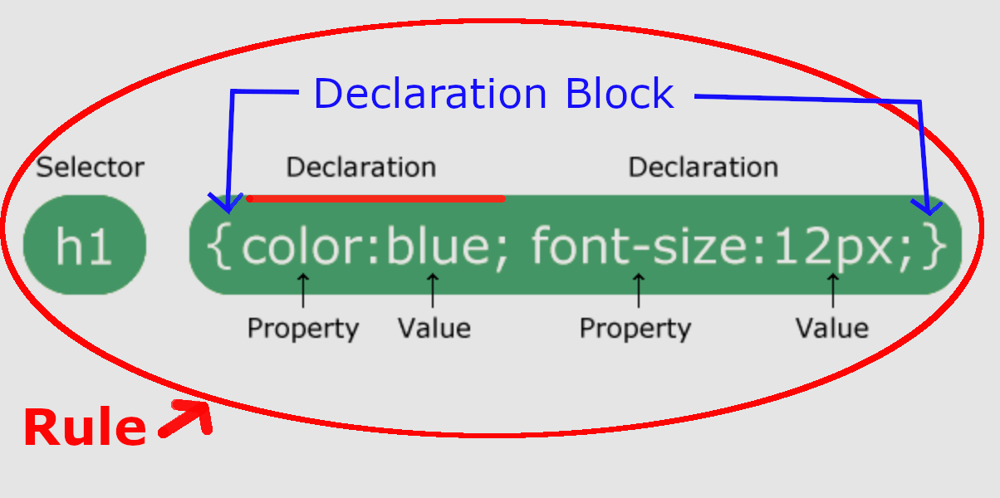

# D276 Web Development Foundations

## Tips

- <https://www.youtube.com/watch?v=5DhnwBq1Wbo>
- <https://docs.google.com/document/d/1X0fnepA5K4dI8-82D0wtikrFj6dzGszEVm8IE8lGL1U/edit#heading=h.k210oksf8ilt>
- Practice
  - <https://www.w3schools.com/accessibility/accessibility_quiz.php>
  - <https://www.w3schools.com/accessibility/css_quiz.php>
  - <https://www.w3schools.com/accessibility/html_quiz.php>
  - <https://www.w3schools.com/css/default.asp>
- Just off of zybooks over **50% of the test is inside the chapter 6 CSS** section.
- Brush up on **XML**, basic and advanced **css**. Understand the purpose of **bootstrap** too.
- <https://www.reddit.com/r/WGU/comments/186ahdl/d276_web_development_foundations_passed/>
  - Stick with the zyBooks material.
  - take advantage of all essential reading/video materials (literally denoted as ESSENTIAL VIDEO or ESSENTIAL READING), including the **LinkedIn Learning** videos and the **Pluralsight** videos.

## CSS Selectors

- **Rule**
  - selector and declaration combined.
  - 
- **Selector**
  - the 'tag' name.
  - 
- **Declaration**
  - property and value.
  - 
- **Declaration block**
  - everything inside the brackets.
  - 
- **Property and Value**
  - css attributes inside the brackets.
  - 
- **External CSS**
  - link to css file.

```html
<!DOCTYPE html>
<html>
  <head>
    <link rel="stylesheet" href="mystyle.css" />
  </head>
  <body></body>
</html>
```

- **cascade**
  - when two rules match, the one that comes last will win.
- **specificity**
  - the 'weight' something has. What rule wins when two rules conflict.
  1. `!important` highest
  2. `<p style="color:blue; padding: 1rem;">HI</p>` inline

```html
<!DOCTYPE html>
<html>
  <body>
    <h1 style="color:blue;text-align:center;">This is a heading</h1>
    <p style="color:red;">This is a paragraph.</p>
  </body>
</html>
```

- **Comments**
  - `/* This is a single line comment */`
  - `<!-- multi line comment -->`
- **image, vector, bitmap, transparency, interlacing, animation, image map, video, audio**
  - **image**
    - `JPG, GIF, PNG` are most common web images
    - always specify `width, height`
    - `alt` shows if `src` is broken or if **screen reader** is used to describe image.
  - **vector**: vector graphics. mathematical coordinates. SVG
    - SVG uses XML to describe animations.
  - **bitmap**: raster graphics. small dots.
  - **transparency**: allow background to show through.
    - opacity: 0 transparent, 1 opaque.
  - **interlacing**:
    - slow internet. Must be web ready. GIF, PNG support interlacing.
    - download in display small percentage at a time.
  - **animation**:
    - must be web ready: GIF, PNG, MNG.
    - PNG uses layers that can be individually manipulated.
    - GIF uses frames.
    - SVG uses XML.
  - **image map**: hot spots defined by coordinates.
    - rect: used to create a rectangular area
    - circle: used to create a circular area
    - poly: used to create a polygonal area
    - default: used to define the entire area
  - **video**
    - poster: thumbnail or first frame of video
    - controls: play, pause, ...

```html
<!-- Width and height in html help page to correctly load without flicker -->


<!-- OPACITY: 0 transparent, 1 opaque. -->


<video width="320" height="240" controls autoplay>
  <source src="movie.mp4" type="video/mp4" />
  <source src="movie.ogg" type="video/ogg" />
  <source src="movie.webm" type="video/webm" />
  Your browser does not support the video tag.
</video>

<!-- IMAGE MAP -->
<map name="infographic">
  <area
    shape="poly"
    coords="130,147,200,107,254,219,130,228"
    href="https://developer.mozilla.org/docs/Web/HTML"
    target="_blank"
    alt="HTML"
  />
  <area
    shape="poly"
    coords="130,147,130,228,6,219,59,107"
    href="https://developer.mozilla.org/docs/Web/CSS"
    target="_blank"
    alt="CSS"
  />
  <area
    shape="poly"
    coords="130,147,200,107,130,4,59,107"
    href="https://developer.mozilla.org/docs/Web/JavaScript"
    target="_blank"
    alt="JavaScript"
  />
</map>


<audio controls autoplay>
  <source src="horse.ogg" type="audio/ogg" />
  <source src="horse.mp3" type="audio/mpeg" />
  <source src="horse.wav" type="audio/wav" />
  Your browser does not support the audio element.
</audio>
```

- **Colors**
  - `blue;` named
  - `#FFF` hexadecimal, RGB, 00-FF. Higher more color intensity.
  - **216 `Web Safe Colors`** safe hex values from old days, where computers could only display 256 possible colors.
- **CSS link, fragment, URL**
  - fragments: `<a href="#some-id">` link that points to id on webpage.
  - url: hostname, path, query string, fragment, scheme.
  - `<a href="url" target="_blank"` open in new tab or window.

```css
a:link, /* normal unvisited link */
a:hover, /* when cursor moves over link */
a:visited, /* after clicked */
a:active {
  /* the moment link is clicked */
}
```

- **Position: containing block, static, relative, absolute, fixed, sticky**
  - containing block: block level element with position other than static.
  - static: default. flow with webpage
  - relative: relative to itself without effecting other elements.
  - absolute: relative to first positioned ancestor or window.
  - fixed: relative to viewport and stays even if page scrolled.
  - sticky: positioned based on users scroll position.
- **canvas**
  - draw graphics on the fly via JS.

## HTML

- **HTML**
  - `header, nav, menu, footer` have semantic meaning.
  - defines page structure. HTML 5.2 latest.

```html
<!DOCTYPE html>
<html lang="en">
  <head>
    <meta charset="UTF-8" />
    <meta name="viewport" content="width=device-width, initial-scale=1.0" />
    <title>Document</title>
  </head>
  <body>
    <header>
      <nav></nav>
    </header>

    <footer></footer>
  </body>
</html>
```

- **iframe**
  - inline frame used to embed another document inside html document.
- **XML**
  - describe data elements.
  - enhance structure and navigation of data.
  - Allows easy interchange of data with other applications.
- **block elements**
  - starts on a new line, always takes up the full width.
  - starts a new container.
  - div, p, table, header, ul, li, main, nav, footer...
- **Inline elements**
  - a, br, button, img, span...
- **empty tags -no closing tag**
  - hr, br, input, img, link, meta, source, area, embed
- **Link -relative vs absolute, external hyperlink, internal hyperlink, link rot**
  - relative: location after domain.
  - absolute: https://domain/path.
  - hyperlink: same as absolute outside domain.
  - internal hyperlink: `<a href="#someId">someId</a>` targets page id.
  - link rot: resource changes over time and link doesn't.
- **caption, thead, tbody, tfoot**
  - allow screen readers to understand purpose of table.
  - thead, tbody, tfoot: allowing the body of the table to scroll up and down, so you don’t lose your table headers when looking for information.

```html
<table>
  <caption>
    Front-end web developer course 2021
  </caption>
  <thead>
    <tr>
      <th scope="col">Person</th>
      <th scope="col">Most interest in</th>
      <th scope="col">Age</th>
    </tr>
  </thead>
  <tbody>
    <tr>
      <th scope="row">Chris</th>
      <td>HTML tables</td>
      <td>22</td>
    </tr>
    <tr>
      <th scope="row">Karen</th>
      <td>Web performance</td>
      <td>36</td>
    </tr>
  </tbody>
  <tfoot>
    <tr>
      <th scope="row" colspan="2">Average age</th>
      <td>33</td>
    </tr>
  </tfoot>
</table>
```

- **colspan, rowspan**
  - number of columns a cell should span.

```html
<table style="width:100%">
  <tr>
    <th colspan="2">Name</th>
    <th>Age</th>
  </tr>
  <tr>
    <td>Jill</td>
    <td>Smith</td>
    <td>43</td>
  </tr>
  <tr>
    <td>Eve</td>
    <td>Jackson</td>
    <td>57</td>
  </tr>
</table>

<table>
  <tr>
    <th>Name</th>
    <td>Jill</td>
  </tr>
  <tr>
    <th rowspan="2">Phone</th>
    <td>555-1234</td>
  </tr>
  <tr>
    <td>555-8745</td>
  </tr>
</table>
```

- **HTML Entities**
  - `<` &lt;
  - ` ` &nbsp;
- **Web Development Project Cycle**
- **Wireframe**
- **Stakeholder input**
- **sitemap**
- **website maintenance task**
- **form**
  - <https://developer.mozilla.org/en-US/docs/Web/HTML/Element/form>
  - input={text, radio, checkbox, submit, button}
  - action: name and location of CGI script or URL that runs/listens for the form submission.
  - method: get, post, dialog.
    - get: append form data as URL query. `?name=value&name2=value2`. Visible to all.
    - post: form data inside body of http.
    - dialog: when in dialog box, closes it.

```html
<form action="/action_page.php" method="post">
  <label for="fname">First name:</label><br />
  <input type="text" id="fname" name="fname" value="John" /><br />
  <label for="lname">Last name:</label><br />
  <input type="text" id="lname" name="lname" value="Doe" /><br /><br />
  <input type="submit" value="Submit" />
</form>

<!-- OPTION -->
<label for="cars">Choose a car:</label>
<select id="cars" name="cars">
  <option value="volvo">Volvo</option>
  <option value="saab">Saab</option>
  <option value="fiat">Fiat</option>
  <option value="audi">Audi</option>
</select>

<!-- MaxLength -->
<form action="/action_page.php">
  <label for="username">Username:</label>
  <input type="text" id="username" name="username" maxlength="10" /><br /><br />
  <input type="submit" value="Submit" />
</form>

<!-- Single Option Select -->
<label for="cars">Choose a car:</label>
<select name="cars" id="cars">
  <option value="volvo">Volvo</option>
  <option value="saab">Saab</option>
  <option value="mercedes">Mercedes</option>
  <option value="audi">Audi</option>
</select>
```

## Disabilities

- **ADA**
  - American Disabilities Act: **prohibits discrimination** and guarantees that people with disabilities have the same opportunities
- **WAI**
  - The W3C Web Accessibility Initiative
  - develops standards and support materials to help you understand and implement accessibility.
- **WCAG**
  - Web Content Accessibility Guidelines
  - create **single shared standard** for web content accessibility.
