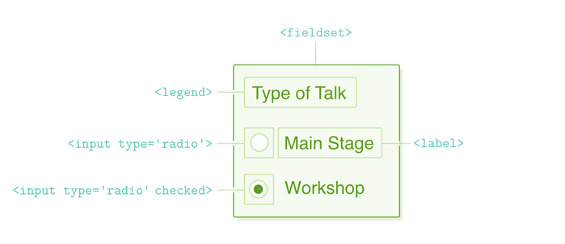

# D276 Web Development Foundations

## Tips

- <https://www.youtube.com/watch?v=5DhnwBq1Wbo>
- <https://docs.google.com/document/d/1X0fnepA5K4dI8-82D0wtikrFj6dzGszEVm8IE8lGL1U/edit#heading=h.k210oksf8ilt>
- Practice
  - <https://www.w3schools.com/accessibility/accessibility_quiz.php>
  - <https://www.w3schools.com/accessibility/css_quiz.php>
  - <https://www.w3schools.com/accessibility/html_quiz.php>
  - <https://www.w3schools.com/css/default.asp>
- Just off of zybooks over **50% of the test is inside the chapter 6 CSS** section.
- Brush up on **XML**, basic and advanced **css**. Understand the purpose of **bootstrap** too.
- <https://www.reddit.com/r/WGU/comments/186ahdl/d276_web_development_foundations_passed/>
  - Stick with the zyBooks material.
  - take advantage of all essential reading/video materials (literally denoted as ESSENTIAL VIDEO or ESSENTIAL READING), including the **LinkedIn Learning** videos and the **Pluralsight** videos.

## CSS Selectors

- **Rule**
  - selector and declaration combined.
  - 
- **Selector**
  - the 'tag' name.
  - 
- **Declaration**
  - property and value.
  - 
- **Declaration block**
  - everything inside the brackets.
  - 
- **Property and Value**
  - css attributes inside the brackets.
  - 
- **External CSS**
  - link to css file. `<link rel="stylesheet" href="mystyle.css">`

```html
<!DOCTYPE html>
<html>
  <head>
    <!-- external style sheet -->
    <link rel="stylesheet" href="mystyle.css" />
    <!-- Internal (Embedded) style sheet -->
    <style>
      h1 {
        color: red;
      }
    </style>
  </head>
  <body>
    <!-- Inline style sheet  -->
    <h1 style="color:blue;text-align:center;">This is a heading</h1>
  </body>
</html>
```

- **cascade**
  - styles of parent 'cascade' to children.
  - when two rules match, the one that comes last will win.
- **specificity**
  - the 'weight' something has. What rule wins when two rules conflict.
  1. `!important` highest
  2. `<p style="color:blue; padding: 1rem;">HI</p>` inline. 2nd highest
  3. last matching rule in stylesheet.
- **Combinators**

| symbol       | about                |
| ------------ | -------------------- |
| `h1, h2, h3` | all                  |
| `ul li`      | any descendant child |
| `ul > li`    | direct child         |
| `img + p`    | adjacent sibling     |
| `img ~ p`    | general sibling      |

```css
/* type selector */
div {
}
/* type 'td' with any descendant child an img */
td img {
}
/* target all h1, h2, h3 elements */
h1,
h2,
h3 {
}
/* link element with 'title' attribute */
a[title] {
}
/* input checkbox that's checked */
input[type='checkbox']:checked {
}
/* Links that start with "https://" and end in ".org" */
a[href^="https://"][href$=".org"]

/* class */
.hidden {
}
/* id */
#hidden {
}
```

```html
<!-- class attribute -->
<div class="one two three">hello</div>
<!-- id attribute -->
<div id="four">hello</div>
```

- **pseudo-selectors**
  - <https://developer.mozilla.org/en-US/docs/Learn/CSS/Building_blocks/Selectors/Pseudo-classes_and_pseudo-elements>
  - **pseudo-class**: selects elements that **are in a specific state**.
    - e.g. they are the first element of their type, or they are being hovered over by the mouse pointer.
  - **pseudo-elements**: they act as if you had **added a whole new HTML element** into the markup, rather than applying a class to existing elements.

```css
/* pseudo-class */
article p:first-child {
}
article p:hover {
}
/* pseudo-element */
article p::first-line {
}
article p::first-letter {
}
article p::before {
}
article p::after {
}
```

- **Comments**
  - `/* This is a single line comment */`
  - `<!-- multi line comment -->`
- **image, vector, bitmap, transparency, interlacing, animation, image map, video, audio**
  - **image**
    - `JPG, GIF, PNG` are most common web images
    - always specify `width, height`
    - `alt` shows if `src` is broken or if **screen reader** is used to describe image.
  - **vector**: vector graphics. mathematical coordinates. SVG
    - SVG uses XML to describe animations.
  - **bitmap**: raster graphics. small dots.
  - **transparency**: allow background to show through.
    - opacity: 0 transparent, 1 opaque.
  - **interlacing**:
    - slow internet. Must be web ready. GIF, PNG support interlacing.
    - download in display small percentage at a time.
  - **animation**:
    - must be web ready: GIF, PNG, MNG.
    - PNG uses layers that can be individually manipulated.
    - GIF uses frames.
    - SVG uses XML.
  - **image map**: hot spots defined by coordinates.
    - rect: used to create a rectangular area
    - circle: used to create a circular area
    - poly: used to create a polygonal area
    - default: used to define the entire area
  - **video**
    - poster: thumbnail or first frame of video
    - controls: play, pause, ...

```html
<!-- Width and height in html help page to correctly load without flicker -->


<!-- OPACITY: 0 transparent, 1 opaque. -->


<video width="320" height="240" controls autoplay>
  <source src="movie.mp4" type="video/mp4" />
  <source src="movie.ogg" type="video/ogg" />
  <source src="movie.webm" type="video/webm" />
  Your browser does not support the video tag.
</video>

<!-- IMAGE MAP -->
<map name="infographic">
  <area
    shape="poly"
    coords="130,147,200,107,254,219,130,228"
    href="https://developer.mozilla.org/docs/Web/HTML"
    target="_blank"
    alt="HTML"
  />
  <area
    shape="poly"
    coords="130,147,130,228,6,219,59,107"
    href="https://developer.mozilla.org/docs/Web/CSS"
    target="_blank"
    alt="CSS"
  />
  <area
    shape="poly"
    coords="130,147,200,107,130,4,59,107"
    href="https://developer.mozilla.org/docs/Web/JavaScript"
    target="_blank"
    alt="JavaScript"
  />
</map>


<!-- Audio -->
<!-- If you don't add 'controls' user cannot pause audio. -->
<!-- Most common codecs: AAC, MP3 -->
<audio controls autoplay>
  <source src="horse.ogg" type="audio/ogg" />
  <source src="horse.mp3" type="audio/mpeg" />
  <source src="horse.wav" type="audio/wav" />
  Your browser does not support the audio element.
</audio>
```

- **Colors**
  - `blue;` named
  - `#FFF` hexadecimal, RGB, 00-FF. Higher more color intensity.
  - **216 `Web Safe Colors`** safe hex values from old days, where computers could only display 256 possible colors.
- **CSS link, fragment, URL**
  - fragments: `<a href="#some-id">` link that points to id on webpage.
  - url: hostname, path, query string, fragment, scheme.
  - `<a href="url" target="_blank"` open in new tab or window.

```css
a:link, /* normal unvisited link */
a:hover, /* when cursor moves over link */
a:visited, /* after clicked */
a:active {
  /* the moment link is clicked */
}
```

- **Position: containing block, static, relative, absolute, fixed, sticky**
  - containing block: block level element with position other than static.
  - static: default. flow with webpage.
  - relative: relative to itself without effecting other elements.
  - absolute: relative to first positioned(not static) ancestor or window.
  - fixed: relative to viewport and stays even if page scrolled.
  - sticky: positioned based on users scroll position.
- **display**
  - inline-block: top and bottom(margin, padding), width, height respected. does not start newline after element.
- **canvas**
  - draw graphics on the fly via JS.
- **css variables**

```css
/* same as html -global */
:root {
  --main-bg-color: brown;
}

h1 {
  color: var(--main-bg-color);
}
```

- **absolute length**
  - they are not relative to anything else, and are generally considered to always be the same size.

| Unit | Name                | Equivalent to            |
| :--- | :------------------ | :----------------------- |
| cm   | Centimeters         | 1cm = 37.8px = 25.2/64in |
| mm   | Millimeters         | 1mm = 1/10th of 1cm      |
| Q    | Quarter-millimeters | 1Q = 1/40th of 1cm       |
| in   | Inches              | 1in = 2.54cm = 96px      |
| pc   | Picas               | 1pc = 1/6th of 1in       |
| pt   | Points              | 1pt = 1/72nd of 1in      |
| px   | Pixels              | 1px = 1/96th of 1in      |

- **relative length**
  - relative to something else, perhaps the size of the parent element's font, or the size of the viewport.

| Unit     | Relative to                                                         |
| :------- | :------------------------------------------------------------------ |
| em       | Font size of the parent                                             |
| ex       | x-height of the element's font.                                     |
| ch       | The advance measure (width) of the glyph "0" of the element's font. |
| rem      | Font size of the root element.                                      |
| lh       | Line height of the element.                                         |
| rlh      | Line height of the root element.                                    |
| vw       | 1% of the viewport's width.                                         |
| vh       | 1% of the viewport's height.                                        |
| vmin     | 1% of the viewport's smaller dimension.                             |
| vmax     | 1% of the viewport's larger dimension.                              |
| vb       | 1% of the size of the direction of the root element's block axis.   |
| vi       | 1% of the size of the direction of the root element's inline axis.  |
| svw, svh | 1% of the small viewport's width and height, respectively.          |
| lvw, lvh | 1% of the large viewport's width and height, respectively.          |
| dvw, dvh | 1% of the dynamic viewport's width and height, respectively.        |

- **transitions, animations**
  - Transitions execute when property changes, animations execute at a particular time.

```css
/* Transition */
.target {
  /* transition: <property> <duration> <timing-function> <delay>; */
  font-size: 14px;
  transition: font-size 4s 1s;
}
.target:hover {
  font-size: 36px;
}
/* Transition: translate */
.childs {
  transition: all 100ms ease-in-out;
}
.child1:hover {
  /* X positive value move right */
  /* Y positive value move down */
  /* X, Y, Z*/
  transform: translate(20px, 10px, 30px);
}
.child2:hover {
  /* W, H */
  transform: scale(0.5, 2); /* width / 2, height * 2*/
  /* scale can be written as stand alone */
  scale(0.5, 2);
  }
.child3:hover {
  /* Clockwise rotation */
  transform: rotate(45deg);
}

/* Animation */
div {
  animation /* duration | easing-function | delay | iteration-count | direction | fill-mode | play-state | name */
}
/* or */
div {
  animation-name: my-anni
  animation-duration
  animation-delay
  animation-iteration-count
  animation-direction: /* normal | reverse | alternate | alternate-reverse */;
  animation-timing-function /* ease | linear | ease-in | ease-out | ease-in-out | cubic-bezier(n,n,n,n) */
  animation-fill-mode /* none | forwards | backwards | both */
  /*
  none = no animation applied before or after executing.
  forwards = retain styles from last keyframe.
  backwards = retain styles from first keyframe.
  both = start with first keyframe, keep last keyframe.
  */
  @keyframes my-anni {
    0% { left: 0; top: 0; }
    50% {}
    100% {}
  }
}
```

- **adaptive website**
  - adapts to the width of the browser at specific widths.
  - e.g. A container is 400 pixels wide when the browser is wider than 500 pixels, but the container shrinks to 200 pixels when the browser is less than 500 pixels wide.
- **Responsive Web Design**
  - A responsive website will instead smoothly adjust the **width of the container** to fit the browser width.
  1. Elements are laid out on fluid, proportion-based grids that use **relative units** like percentages instead of absolute units like pixels.
  2. Images are sized with **relative units** to adapt to various screen sizes.
  3. **CSS media queries** apply different CSS styles depending on the **browser's width**.
- **Graceful degradation**
  - Design the **desktop website first** and modify the design to fit smaller screens.
- **Progressive enhancement**
  - A **"mobile first"** design methodology that begins with designing the website for the smallest device and then adapts the design for larger screens.
- **at-rule**
  - is a CSS statement that starts with the `@` character and instructs the **CSS engine how to behave**.
- **breakpoint**
  - screen width that **activates a media query**.
- **media queries**
  - A media query is composed of an optional media type and any number of media feature expressions.
  - media type: target special devices such as printers or screen readers.
  - media feature: characteristics of a given user agent, output device, or environment.

```css
/* Media Attribute on a link */
/* when media condition true, will download */
<link rel="stylesheet"
  media="print and (min-width: 400px)" 
  href="styles.css"
/>
/* media type all|screen|print */
@media screen, print {
}
@media only screen and (min-width: 320px) {
}
/* media feature */
/* aspect-ratio, width, height, orientation, resolution */
@media (min-width: 320px) {
}
@media screen and (orientation: portrait) and (max-width: 320px) {
}
```

## HTML

- **Wireframe**
  - blueprint for a web page.
- **HTML**
  - `header, nav, menu, footer` have semantic meaning.
  - defines page structure. HTML 5.2 latest.

```html
<!DOCTYPE html>
<html lang="en">
  <head>
    <meta charset="UTF-8" />
    <meta name="viewport" content="width=device-width, initial-scale=1.0" />
    <title>Document</title>
  </head>
  <body>
    <header>
      <nav></nav>
    </header>

    <footer></footer>
  </body>
</html>
```

- **iframe**
  - inline frame used to embed another document inside html document.
- **block elements**
  - starts on a new line, always takes up the full width.
  - starts a new container.
  - div, p, table, header, ul, li, main, nav, footer...
- **Inline elements**
  - a, br, button, img, span...
- **empty tags -no closing tag**
  - hr, br, input, img, link, meta, source, area, embed
- **Link -relative vs absolute, external hyperlink, internal hyperlink, link rot**
  - relative: location after domain.
  - absolute: https://domain/path.
  - hyperlink: same as absolute outside domain.
  - external: outside domain.
    - `<a href="http://example.com/media/index.html">my-link</a>`
  - internal hyperlink: `<a href="#someId">someId</a>` targets page id.
  - link rot: resource changes over time and link doesn't.
- **caption, thead, tbody, tfoot**
  - allow screen readers to understand purpose of table.
  - thead, tbody, tfoot: allowing the body of the table to scroll up and down, so you don’t lose your table headers when looking for information.

```html
<table>
  <caption>
    Front-end web developer course 2021
  </caption>
  <thead>
    <tr>
      <th scope="col">Person</th>
      <th scope="col">Most interest in</th>
      <th scope="col">Age</th>
    </tr>
  </thead>
  <tbody>
    <tr>
      <th scope="row">Chris</th>
      <td>HTML tables</td>
      <td>22</td>
    </tr>
    <tr>
      <th scope="row">Karen</th>
      <td>Web performance</td>
      <td>36</td>
    </tr>
  </tbody>
  <tfoot>
    <tr>
      <th scope="row" colspan="2">Average age</th>
      <td>33</td>
    </tr>
  </tfoot>
</table>
```

- **colspan, rowspan**
  - number of columns a cell should span.

```html
<!-- Colspan -->
<table style="width:100%">
  <tr>
    <th colspan="2">Name</th>
    <th>Age</th>
  </tr>
  <tr>
    <td>Jill</td>
    <td>Smith</td>
    <td>43</td>
  </tr>
  <tr>
    <td>Eve</td>
    <td>Jackson</td>
    <td>57</td>
  </tr>
</table>

<!-- Rowspan -->
<table>
  <tr>
    <th>Name</th>
    <td>Jill</td>
  </tr>
  <tr>
    <th rowspan="2">Phone</th>
    <td>555-1234</td>
  </tr>
  <tr>
    <td>555-8745</td>
  </tr>
</table>
```

- **HTML Entities**
  - `<` `&lt;`
  - ` ` `&nbsp;`
- **Web Development Project Cycle**
- **Stakeholder input**
- **sitemap**
- **website maintenance task**
- **form**
  - <https://developer.mozilla.org/en-US/docs/Web/HTML/Element/form>
  - input={text, radio, checkbox, submit, button}
    - minlength: limit characters. `minlength="3"`
    - maxlength: limit characters. `maxlength="25"`
  - action: name and location of CGI script or URL that runs/listens for the form submission.
  - method: get, post, dialog.
    - get: append form data as URL query. `?name=value&name2=value2`. Visible to all.
    - post: form data inside body of http.
    - dialog: when in dialog box, closes it.
  - option: may or may not have a 'value' attribute. only can choose one option.
  - fieldset: groups radio buttons under one legend.
    - flexbox not work with fieldset. must use float. or eliminate fieldset and legend and use css to align radio buttons.
  - 
- checkbox: allow multiple selections. `label` envelopes `input[type="checkbox"]`

```html
<form action="/action_page.php" method="post">
  <label for="fname">First name:</label><br />
  <input type="text" id="fname" name="fname" value="John" /><br />
  <label for="lname">Last name:</label><br />
  <input type="text" id="lname" name="lname" value="Doe" /><br /><br />
  <input type="submit" value="Submit" />
</form>

<!-- OPTION -Single Option Select -->
<label for="cars">Choose a car:</label>
<!-- OPTION -Multiple Option Select -->
<label for="cars" multiple>Choose a car:</label>
<select id="cars" name="cars">
  <option value="volvo">Volvo</option>
  <option value="saab">Saab</option>
  <option value="fiat">Fiat</option>
  <option value="audi">Audi</option>
</select>

<!-- MaxLength -->
<form action="/action_page.php">
  <label for="username">Username:</label>
  <input type="text" id="username" name="username" maxlength="10" /><br /><br />
  <input type="submit" value="Submit" />
</form>

<!-- Fieldset -->
<form>
  <fieldset>
    <legend>Choose your favorite monster</legend>
    <input type="radio" id="kraken" name="monster" value="K" />
    <label for="kraken">Kraken</label><br />
    <input type="radio" id="sasquatch" name="monster" value="S" />
    <label for="sasquatch">Sasquatch</label><br />
    <input type="radio" id="mothman" name="monster" value="M" />
    <label for="mothman">Mothman</label>
  </fieldset>
</form>

<!-- TextArea -->
<div class="form-row">
  <label for="abstract">Abstract</label>
  <textarea id="abstract" name="abstract"></textarea>
  <div class="instructions">Describe your talk in 500 words or less</div>
</div>

<!-- Checkbox -->
<!-- allows multiple answers. label wraps input,span. -->
<div class="form-row">
  <label class="checkbox-label" for="available">
    <input id="available" name="available" type="checkbox" value="is-available" />
    <span>I’m actually available the date of the talk</span>
  </label>
</div>
```

## Bootstrap

- **bootstrap**
  - framework for HTML, CSS, and JavaScript to help a developer **create responsive websites**.
  - standardized: icons, buttons...
- **typography**
  - appearance of your website to have a unified look and feel.
  - fonts, icons, and layouts consistently throughout the entirety of the website.
- **Icons**
  - standardized icons. `<i class="bi bi-arrow-down-right-circle"></i>`

## XML

- stores data in plaintext.
- Tags are **case sensitive** and **crashes on error**.
- default character encoding is `utf-8`.
- top XML tag is called `XML prolog`.
- describe data elements.
- enhance structure and navigation of data.
- Allows easy interchange of data with other applications.

```xml
<?xml version="1.0" encoding="UTF-8"?>
<note>
  <to>Tove</to>
  <from>Jani</from>
  <heading>Reminder</heading>
  <body>Don't forget me this weekend!</body>
</note>
```

## Disabilities

- **ADA**
  - American Disabilities Act: **prohibits discrimination** and guarantees that people with disabilities have the same opportunities.
- **WAI**
  - The W3C Web Accessibility Initiative.
  - develops standards and **support materials to help you understand** and implement accessibility.
- **WCAG**
  - Web Content Accessibility Guidelines.
  - **develop single shared standard** for web content accessibility.
- **errors**
  - most common errors: `syntax and logic errors`.
- **debugging rules**
  - find it
  - identify it
  - fix it
