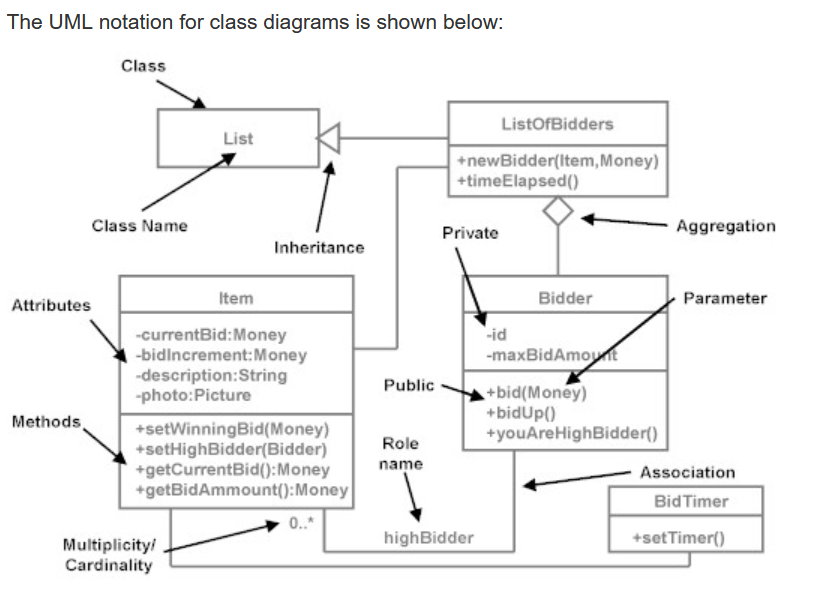
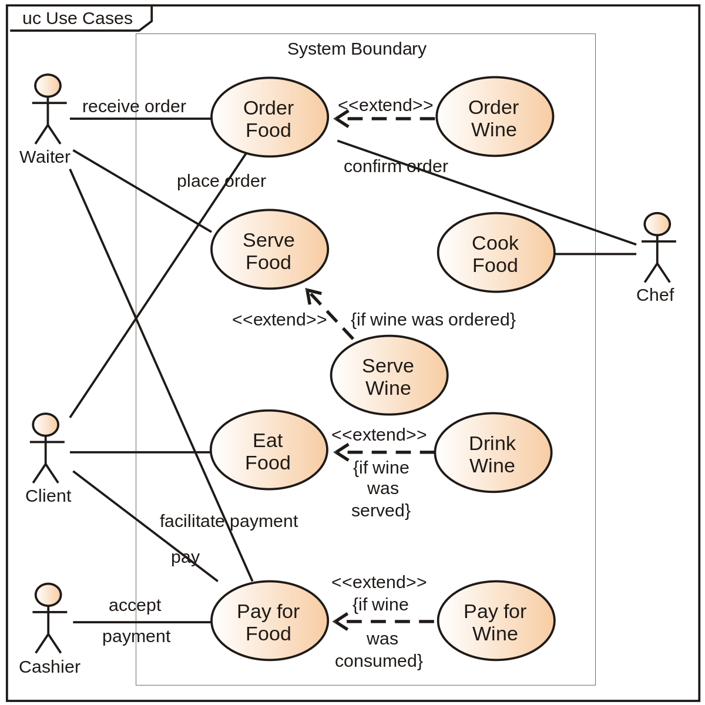
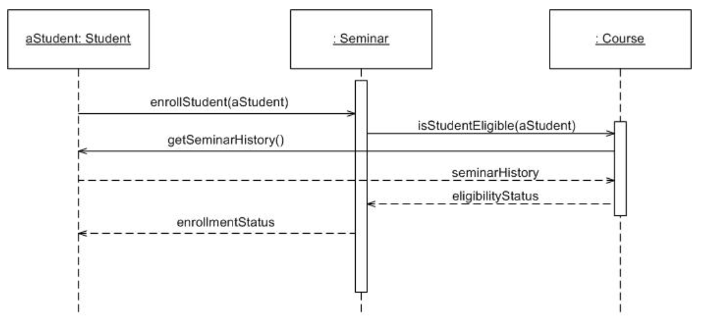
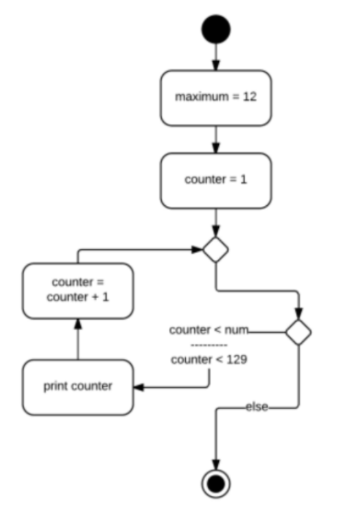
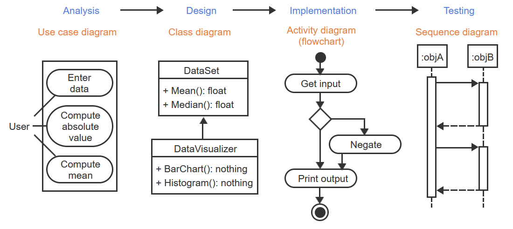

# D278 Scripting and Programming

## Tips

- <https://quizlet.com/781696862/d278-pre-assessment-scripting-and-programming-foundations-flash-cards/>
- <https://quizlet.com/784336947/d278-exam-prep-flash-cards/>
- <https://www.reddit.com/r/WGU/comments/14rq1yc/dirtshoes_guide_to_d278_scripting_and_programming/>
- <https://www.reddit.com/r/WGU/comments/11uvpeh/d278_scripting_and_programming_foundations_aka/>
- [wgu D278 Outline](https://srm--c.vf.force.com/apex/coursearticle?Id=kA03x000000spz1CAA)
- <https://ankiweb.net/shared/by-author/472161850>
- focus on chapters: 1, 2, 7.1, 7.2, 8, 9.
- book ISBN: 978-1-394-13419-9
- Once you take the PA, review it hard and study the chapters it recommends.
  - Absolutely don't overthink this class, it is a very VERY basic course that ultimately needs you to understand the concepts.
  - The OA will be very similar to the PA.
  - Understand the SDLC and which phase each diagram sits in: (Memorize this and whiteboard it) ADIC = UCAS
    - Analysis Phase(goals) = Use Case Diagram
    - Design Phase(wireframe) = Class Diagram
    - Implementation Phase(write) = Activity Diagram
    - Testing Phase(check) = Sequence Diagram
  - Understand the fundamental difference between For and While loops
  - Understand the fundamental difference between agile and waterfall
  - Understand the different data types ( integer, float, boolean, string )
  - Understand how to find the value of basic functions ( there are several of these to reference from in the PA )

| Lang   | OOP   | Static Typed | Compiled | Notes                                |
| ------ | ----- | ------------ | -------- | ------------------------------------ |
| C      | False | True         | True     | Procedural Oriented                  |
| C++    | True  | True         | True     | Object Oriented                      |
| C#     | True  | True         | True     | Object Oriented                      |
| Java   | True  | True         | True     | Object Oriented                      |
| JS     | True  | False        | False    | Object Oriented, but not class based |
| Python | True  | False        | False    | Object Oriented                      |

- That makes up probably 75% of the real exam.
- I opened the class on a Tuesday in April and finished that Thursday with flying colors.

## Lesson 2 Questions | Programming Fundamentals

- What is the purpose of a variable?
  - Purpose: Store and manage data values during program execution.
- How do you save a value to a variable?
  - Saving values: Use the assignment operator (=), e.g., `myVariable = 10`.
- What is a programming expression?
  - An expression may be a number like `80`, a variable name like `numApples`, or a simple calculation like `numApples + 1`.
- What is an identifier?
  - Names given to variables, functions, and other program elements.
- What constitutes a valid identifier?
  - Valid rules: Typically start with a **letter or underscore**, followed by letters, numbers, or underscores. **Case-sensitive** in most languages.
- What is a literal?
  - Fixed values directly written in code, e.g., 42, "hello", True.
- What is an operator?
  - Symbols performing operations on values, e.g., `+, -, *, /, %, ==, !=, &&, ||`.
- What precedence rules does programming use?
  - Order in which operators are evaluated, similar to math (PEMDAS).
- How does an integer differ from a float?
  - Integers: Whole numbers without decimals (e.g., `-5, 0, 10`).
  - Floats: Numbers with decimals (e.g., `3.14, -2.5`).
- What happens if you divide two integers? A integer and float?
  - Integer/Integer: Results in an integer quotient (remainder discarded).
  - Integer/Float or Float/Float: Results in a float.
- What happens if you divide a nonzero floating point number by zero?
  - 0 is mathematically **undefined**. A divide-by-zero error occurs at runtime if a divisor is 0, causing a **program to terminate**.
- How do you convert an item’s type?
  - Changing a value's data type using explicit functions (e.g., `int(), float(), str()`).
- What does the modulo operator do?
  - Returns the remainder of a division operation.
- What is the difference in a variable and a constant?
  - Variables: Values **can change** during program execution.
  - Constants: Values remain **fixed** throughout the program.
- How does an array work?
  - Collections of multiple values stored as a 'list', under a single name.
  - each item being directly accessible.
- What does index reference?
  - Indexing: Accessing individual elements using their numerical position (starting from 0).
- What is the purpose of each different data type?
  - Specify the kind of data a variable can hold (e.g., `integers, floats, strings, booleans`).
  - Each type has distinct operations and storage requirements.

## Lesson 3 Questions | Control Structures

- How does a branch differ from a loop?
  - Branch: Executes different parts of the code based on a condition. It's like a fork in the road, where the program takes one path or another.
  - Loop: Repeatedly executes a block of code until a specific condition is met. It's like going around a circle until you reach a specific point.
- How does an if-else branch work?
  - The if statement checks a condition. If it's true, the statement following the if will be executed. If it's false, the statement following the else (if present) will be executed.
- What does the equality operator do? Does it work for all data types?
  - The == operator checks if two values are equal. It works for most data types (integers, floats, strings, etc.) However, for complex data types (like lists or dictionaries), it checks for reference equality, not content equality.
- What are the four relational operators?
  1. `>`: greater than
  2. `<`: less than
  3. `>=`: greater than or equal to
  4. `<=`: less than or equal to
- What are the three logical operators?
  1. `and`: True only if both conditions are true
  2. `or`: True if at least one condition is true
  3. `not`: Negates the condition
- Explain the precedence rules.
  - Arithmetic operators have a specific order of evaluation, similar to math (PEMDAS).
  - **Logical** operators generally have **lower** precedence than relational and arithmetic operators.
- How is an infinite loop created?
  - Loop termination never becomes true.
  - Can happen accidentally due to incorrect logic or intentionally for specific purposes.
- What is a sentinel value?
  - special value indicating the end of a list (array).
  - The loop iteration continues until it encounters the sentinel value.
- What are the three parts of a loop?
  - **Initialization**: Initializing the loop variable (e.g., setting it to 0).
  - **Condition**: The condition that determines if the loop continues (e.g., while variable < 10).
  - **Increment**: An optional step that updates the loop variable for each iteration (e.g., variable += 1).
- What is difference in a while loop and do/while loop?
  - `while` loop: Checks the condition before executing the loop body. It may not run at all if the initial condition is false.
  - `do/while` loop: Executes the loop body first, then checks the condition. It will **always run at least once**.
- Which control structure is guaranteed to run only one time?
  - The `break` statement within a loop or the `if` statement with no else branch can both be used to ensure a piece of code runs only once.
- Which loop is used when you are unsure how many times you may need to iterate?
  - A `while` loop or a do/while loop is suitable when you don't know the exact number of iterations needed.
- Which loop is used when you know how many times you want to iterate?
  - A `for` loop is specifically designed for iterating a fixed number of times, often using a counter variable.

## Lesson 4 Questions | Functions

- What is a function?

  - A function is a **reusable block of code** that performs a specific task. It's like a mini-program within your main program.

  ```python
  # python
  def add(a, b):
    result = a + b
    print(result)

  add(2, 2) # 4
  ```

- Why are functions useful?
  - Organization: Break down complex programs into smaller, manageable units.
  - Reusability: Write code once and use it multiple times in different parts of your program.
  - Modularity: Test and debug functions independently.
  - Abstraction: Hide implementation details and make code easier to read and understand.
- What is a function call?
  - A function call is when you invoke a function to execute its code.
  - You call a function by using its name followed by parentheses, optionally providing arguments.

```python
  # python
def add(a, b):
  result = a + b
  print(result)

add(2, 2) # 4
```

- What are parameters and arguments?
  - Parameters: Variables defined within the function's parentheses. They act as placeholders for values that will be passed when the function is called.
  - Arguments: Actual values provided during a function call. They are assigned to the corresponding parameters.

```python
  # python
def add(a, b): # 'a' and 'b' are parameters. placeholders.
  result = a + b
  print(result)

add(2, 2) # '2' and '2' are arguments. values.
```

- What happens if you define a function but do not call it?
  - Nothing happens. The function is defined but not executed until it's called.
- What does a return statement do?
  - A return statement sends a value back from a function to the calling code.
  - It's optional; a function can perform actions without returning a value.

## Lesson 5 Questions | Algorithms

- What is a binary search?
  - Binary search: Preferred for sorted datasets where speed is crucial.
  - Concept: Divides the dataset in half repeatedly until the target element is found.
  - Requirements: Data must be sorted! This allows efficient splitting based on the target value's position in the sorted order.
  - Performance: Fast when applicable, often reaching the target element in logarithmic (log n) time, meaning the search time increases very slowly with dataset size.
  - Examples: Finding a word in a sorted dictionary, searching for a specific student in a class list.
- What is a linear search?
  - Linear search: Suitable for unsorted datasets or situations where fast searching isn't a priority.
  - Concept: Simply scans through the dataset element by element until the target is found.
  - Requirements: No sorting required.
  - Performance: Slow compared to binary search, particularly for large datasets. It takes linear time (n) on average, meaning the search time increases proportionally with the dataset size.
  - Examples: Finding a friend's name in an unsorted phonebook, searching for a specific file in a messy folder.

## Lesson 6 Questions | Software Design process

- What is SDLC?
  - The Software Development Life Cycle (SDLC) is a structured framework for planning, creating, testing, deploying, and maintaining software applications. It outlines the essential phases involved in bringing a software idea to life.
- What are the four phases of SDLC and what activities takes place in each of the four phases?
  1. Analysis: goals of project.
  2. Design: wireframe. -define how to build the program.
  3. Implement: write code.
  4. Testing: check code meets goals.
- In which phase do you write code?
  - Implementation phase.
- How does a waterfall approach differ from an agile approach?
  - Two primary approaches to implementing SDLC are waterfall and agile:
    - **Waterfall**: A sequential model where each phase is completed before moving to the next, providing well-defined milestones but less flexibility.
      - Just like a waterfall, you never return back to source. You continue to complete task until done.
    - **Agile**: An iterative and incremental approach where development happens in short sprints, allowing for continuous feedback and adaptation to changing requirements.
      - You do all 4 phases on small sprints, continuously building out the application.

## Lesson 7 Questions | Unified Modeling Language

- What is UML?
  - Unified Modeling Language (UML) uses different types of diagrams to **visualize the structure and behavior of programs**.
  - UML consists of several structural and behavioral diagrams.
    - A **structural** diagram visualizes **static** elements of software, such as the types of variables and functions used in the program.
    - A **behavioral** diagram visualizes **dynamic** behavior of software, such as the flow of an algorithm.
- Which UML diagrams are structural?
  - **Class diagram**: visually model the **classes of a computer program**, including data members and functions.
    - A class is a code blueprint for creating an object that is composed of data members and functions that operate on those data members.
    - 
- Which UML diagrams are behavioral?
  - **Use case diagram**: visually model **how a user interacts** with a software program.
    - 
  - **Sequence diagram**: shows the **logic** between software components and indicates the **order of events**.
    - 
  - **Activity diagram**: describe the flow of an activity or set of activities.
    - 
- Which UML diagrams are activity?
  - behavioral
  - 
- Which UML diagrams are used in the analysis phase?
  - Use Case diagrams
  - 
- Which UML diagrams are used in the design phase?
  - Class diagrams
  - 
- Which UML diagrams are used in the implementation phase?
  - Activity
  - 
- Which UML diagrams are used in the testing phase?
  - Sequence diagrams
  - 
- What is a Use Case diagram used for?
  - visually model **how a user interacts** with a software program.
  - 
- What is a Class diagram used for?
  - visually model the **classes of a computer program**, including data members and functions.
  - 
- What is a Sequence diagram used for?
  - shows the **logic** between software components and indicates the **order of events**.
  - 

## Lesson 8 Questions | Language Survey

- What is the difference in a compiled language and an interpreted language? Which languages are compiled? Which languages are interpreted?
  - **Compiled** languages: Translate their entire code into machine-readable instructions (bytecode) before execution. This results in faster runtime performance but requires recompilation after any code changes. Examples: `C++, Java, Go`.
  - **Interpreted** languages: Execute code line by line without generating bytecode. This offers flexibility for rapid prototyping and debugging but may have slower performance. Examples: `Python, JavaScript, Ruby`.
- What is the difference in statically typed and dynamically typed languages? Which languages are statically typed? Which languages are dynamically typed?
  - **Statically** typed languages: Explicitly declare the data type of variables before using them. This enables early error detection and type safety but requires stricter syntax. Examples: `Java, C#, TypeScript`.
  - **Dynamically** typed languages: Infer data types automatically based on their usage. This offers more flexibility and conciseness but may lead to runtime errors. Examples: `Python, JavaScript, Ruby`.
- What is the difference in an object-oriented language and a non object-oriented language? Which languages are object oriented? Which languages are not object oriented?
  - **Object-oriented** languages: Group data (attributes) and functionality (methods) into objects, emphasizing data encapsulation and code reuse. They promote modularity and code organization. Examples: `Java, Python, C++`.
  - **Non-object-oriented** languages: Focus on procedural programming, organizing code in procedures and functions, with less emphasis on objects. Examples: `C, Assembly language, some scripting languages`.
- How does a markup language differ from a programming or scripting language?
  - **Markup** languages: Define the structure and **layout** of documents, like `HTML` for web pages, `LaTeX` for technical documents. They don't have complex logic or computation capabilities.
  - **Programming/Scripting** languages: Focus on executing **logic and computations**, building and automating tasks, controlling program flow, and manipulating data.
- What is a programming library?
  - Collections of **pre-written code** (functions, classes) providing reusable tools for specific tasks, like data manipulation, networking, GUI development.
- Why are programming libraries used?
  - They save time and effort, promote code reuse and consistency, and offer access to advanced functionalities.
- Are libraries compiled or precompiled?
  - Libraries may be written in compiled or interpreted languages themselves.
  - Libraries are often precompiled into machine-readable formats for efficient use within another program, regardless of whether they were originally compiled or interpreted.
