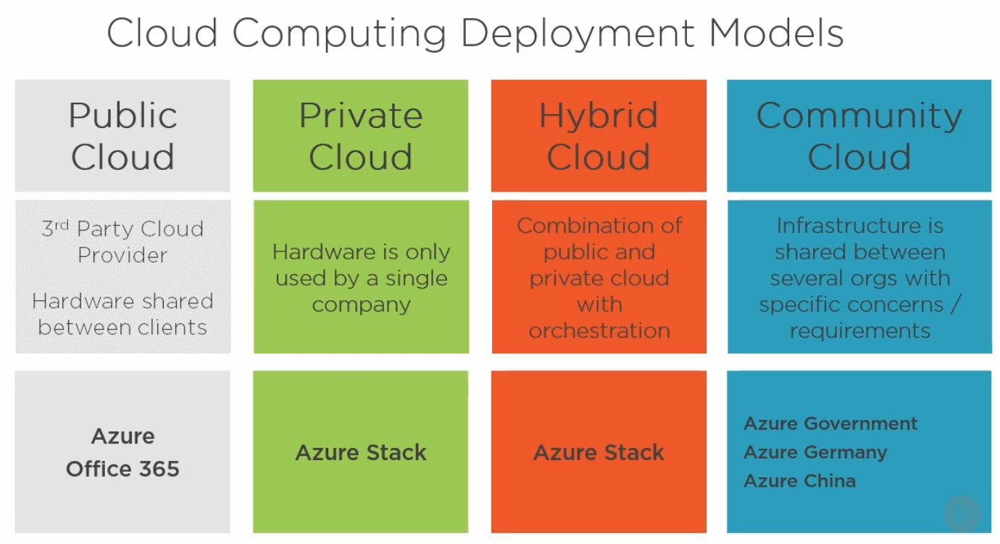
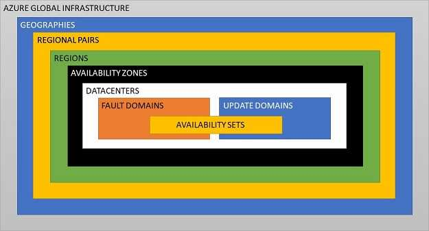
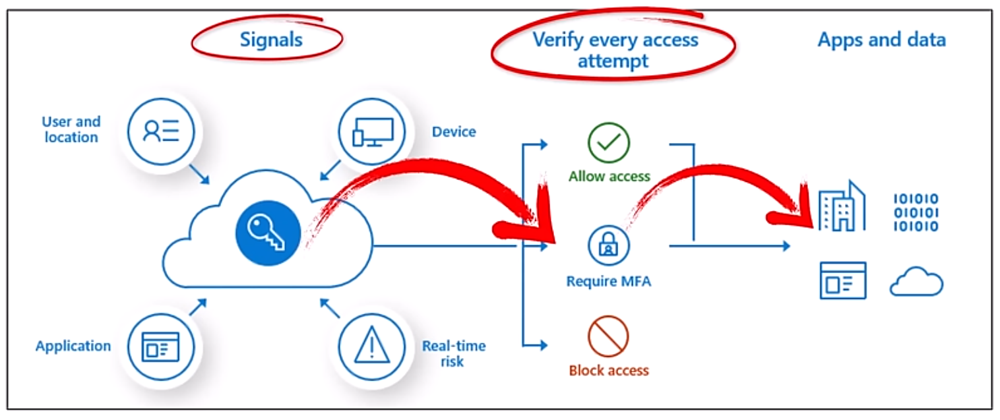

# Azure Fundamentals AZ-900 Exam Objectives

## Tips

- **Notes**
  - [github jasonotu study notes](https://github.com/undergroundwires/Azure-in-bullet-points/tree/master/AZ-900%20Microsoft%20Azure%20Fundamentals)
  - [zero2devops study notes](https://www.zero2devops.com/blog/azure-fundamentals-study-guide)
  - [Marczak](https://marczak.io/az-900/)
- **Videos**
  - [Reddit](https://www.reddit.com/r/AZURE/comments/14yk02t/questions_about_az900_exam/)
    - [exam cram youtube](https://www.youtube.com/watch?v=tQp1YkB2Tgs)
    - [complete course youtube](https://www.youtube.com/watch?v=pY0LnKiDwRA&list=PLlVtbbG169nED0_vMEniWBQjSoxTsBYS3)
  - [az-900 adam marczak](https://www.youtube.com/playlist?list=PLGjZwEtPN7j-Q59JYso3L4_yoCjj2syrM)
  - [free code camp](https://www.youtube.com/watch?v=NKEFWyqJ5XA)
  - [youtube inside cloud security video](https://www.youtube.com/watch?v=8n-kWJetQRk)
- **Practice Exams**
  - [practice exams](https://certification.kananinirav.com/az-900-microsoft-azure-fundamentals/practice-exam/exams.html)
- **Microsoft**
  - [microsoft azure az-900 training](https://learn.microsoft.com/en-us/training/courses/az-900t00)
  - [az-900 exam objectives](https://learn.microsoft.com/en-us/credentials/certifications/resources/study-guides/az-900)
  - 45 minutes, 40-60 questions, 700/1000.
  - Domain 1: Describe Cloud Concepts 25-30%
  - Domain 2: Describe Core Services 15-20%
  - Domain 3: Describe core solutions and management tools on Azure 10-15%
  - Domain 4: Describe general security and network security features 10-15%
  - Domain 5: Describe identity, governance, privacy, and compliance features 15-20%
  - Domain 6: Describe Azure cost management and Service Level Agreements 10-15%
  - Domain 7: Describe Azure Service Level Agreements (SLAs) and service lifecycles

| AZ-900 Domain Area                       | Weight |
| ---------------------------------------- | ------ |
| Describe cloud concepts                  | 25-30% |
| Describe Azure architecture and services | 35-40% |
| Describe Azure management and governance | 30-35% |

- <https://learn.microsoft.com/en-us/credentials/certifications/azure-fundamentals/?practice-assessment-type=certification>
- <https://cm.wgu.edu/t5/Frequently-Asked-Questions/Microsoft-Assessment-Scheduling-and-Score-Reporting/ta-p/2626>

- **notes were made from**:
  - [youtube inside cloud security video](https://www.youtube.com/watch?v=8n-kWJetQRk)
  - [github jasonotu study notes](https://github.com/undergroundwires/Azure-in-bullet-points/tree/master/AZ-900%20Microsoft%20Azure%20Fundamentals)

## 1.1 Describe cloud computing

- **Define cloud computing**
  - on-demand network access to a shared pool that can be rapidly provisioned with minimal management effort.
  - Microsoft: delivery of computing services over the internet. IoT, AI, ML,
- **Describe the shared responsibility model**
  - customer responsibility vs CSP(Cloud Service Provider).
  - Cloud infrastructure is more secure because company can shift focus on security and not on maintaining hardware.
  - 
- **Define cloud models, including public, private, and hybrid. Identify appropriate use cases for each cloud model**
  - **cloud models**: cost-effective, global, secure, scalable, elastic(dynamic scaling), always current(do not have to worry about infrastructure, software patches, upgrades or other IT management task.)
  - **Public**: shared hardware between clients. scalability, agility, PAYG(pay-as-you-go), no maintenance, low skill(to get started).
  - **Private**: your responsible for entire stack. legacy support, control, compliance.
  - **Hybrid**: blend on-prem and Cloud. flexibility.
  - **Community**: infrastructure shared between multiple organizations with common needs.
  - 
- **Describe Economies of Scale**
  - cloud provider purchase large quantities of hardware at discount and pass on savings.
- **CapEx to OpEx**
  - CapEx is hard assets(IT equipment). Spending upfront.
  - OpEx is operating expenses(monthly subscription). PAYG.
  - Cloud **increases** OpEx and **reduces** CapEx.
- **Describe the consumption-based model**
  - pay for what you use. Typically per unit of time or capacity:
    - per unit of time -VMs.
    - per-GB -storage.
    - per-execution -Azure Functions.
- **Compare cloud pricing models: Fixed, Serverless, Logic App, Functions, Event Grid**
  - **Fixed Price Model**
    - provision resources and pay for them whether you use them or not.
    - predictable cost.
  - **Serverless Architecture**
    - Cloud Service Provider dynamically manages provisioning of servers. **stateless and ephemeral**.
    - PAYG per use.
  - **Serverless Architecture: Logic App, Power Automate, Azure Automation, Functions, Event Grid**
    - Logic App: GUI drag-n-drop. Automate **DevOps** type workflows. schedule, automate, and orchestrate workflows.
    - Power Automate: GUI drag-n-drop. Automate task within **Office 365**.
    - Azure Automation: run books for automated task(powershell and python). Similar to ansible.
    - Functions: **event driven** compute-on-demand. runs code **triggered by events**. Advantage: does not have to 'poll' remote systems. pay-per-use.
    - Event Grid: manage events. **push** events to destination. Event Sources are 'pushed' to Event handlers. pub/sub model. app or service is 'reacting' to event. pay-per-use.

## 1.2 Describe the benefits of using cloud services

- **Describe the benefits of high availability, uptime, scalability in the cloud, Elasticity, Agility**
  - high availability: **consistent access** to **infrastructure, applications or services**. Expressed as 9's. 99999, downtime usually less than 5 minutes per year.
  - uptime: amount of time system is running.
    - e.g. server running all week, but web app only available for half the week. uptime was 100%, availability 50%.
  - scalability: ability to handle growth. **manually** scale/reduce.
  - elasticity: **automatically** scale/reduce based on app demand. scale quickly to spikes in demand.
  - agility: speed of allocate/deallocate resources. react quickly. Cloud is agile.
- **Disaster Recovery, Fault Tolerance**
  - **disaster recovery**:
    - design principle which allows a system to **recovers from natural or human induced disasters**.
    - Cloud based backup services, data replication and geo distribution ensure confidence that your data is safe even if a disaster should occur.
  - **fault tolerance**: handle **component** failure without service interruption. Robust(redundant hardware) for critical systems.
- **Describe the benefits of reliability and predictability in the cloud**
  - **reliability**: ability to recover from system failure.
  - **resiliency**: return application to fully function state after failure.
  - **predictability**: cloud solutions with predictable cost and performance. **cost, performance know in advance!**
- **Describe the benefits of security and governance in the cloud**
  - **Security**:
    - customer data: access control, encryption.
    - Standard Tier: DDOS attacks.
    - IaaS give you more control, but also more responsibility.
  - **Governance**
    - rules, policy that guide organizations.
    - guidance and guardrails that ensure we're as secure, consistent, and efficient as possible.
    - Azure Deployment templates: help companies meet regulatory requirements.
    - Cloud Adoption Framework: help you create and implement strategies. Five disciplines of cloud governance.
- **Describe the benefits of manageability in the cloud**
  - automatically scaling resources based on demand.
  - deploy resources based on preconfigured template.
  - monitor health, automatically replace failing resources
  - receive alerts.
  - Manage: CMD, API, Web Portal, Powershell

## 1.3 Describe cloud service types

- **Describe infrastructure as a service (IaaS)**
  - CSP provides VM, your responsible for the rest.
  - testing and deployment VMs, running applications in cloud, extending datacenter to cloud, disaster recovery.
  - 
  - 
- **Describe platform as a service (PaaS)**
  - CSP provides OS, your responsible for the rest.
  - development framework: reduces development effort and increase solution(code) quality.
    - Databases, web apps, backup services.
  - PaaS tools allow analysis of data. business intelligence.
  - 
  - 
- **Describe software as a service (SaaS)**
  - CSP provides app, customer configures features.
  - customer is responsible for access management and data recovery.
  - email, business productivity app... enables companies to securely and reliably outsource variety of functions, so they can focus on revenue generation.
  - 
  - 

## 2.1 Describe the core architectural components of Azure

- **Describe Azure Geography, regions, region pairs, and sovereign regions**
  - Geography: groups of regions in each continent.
    - Americas, Europe, Asia Pacific, Middle East and Africa.
  - Regions: set datacenters connected w/ low-latency communications.
  - Region Pairs: in same geography for disaster recovery. **300+ miles apart**.
  - Sovereign Regions: separation for compliance or legal purpose. physical and logical isolation.
    - (US government and US government contractors).
  - 
  - 
- **Describe availability zones**
  - group of datacenters within a region networked w/ low-latency network with independent power, network, cooling.
  - redundancy with datacenter failure.
  - 
  - 
- **Describe Azure datacenters**
  - physical buildings w/ servers. redundant network, power, cooling.
  - 
  - 
- **Azure Fault Domain**
  - rack of servers in a datacenter. Each have power, networking.
  - 
  - 
- **Describe Azure resources and resource groups**
  - resource group: - group related **resources that share common lifecycle**.
    - logical container for group assigning locks, tags, RBAC permissions... - under subscriptions.
    - **nested resource group not allowed**.
    - can contain resources from **multiple different regions**.
  - resource: entity managed by Azure(VM, VPN, storage...)
- **Describe subscriptions**
  - logical container to provision resources in Azure.
  - under management groups.
  - **unit of management, billing, and scale**
    - management boundary for **assigning policies, governance, isolation**.
- **Why create multiple subscriptions**
  - when subscription limits are reached
  - different payment methods
  - isolate resources between departments, projects...
- **Describe management groups**
  - used to enforce policy.
  - can have multiple subscriptions.
  - higher than subscriptions in hierarchy. Each directory is given single top-level management group called the **root**.
  - boundary for management and policy.
  - 
- **Describe the hierarchy of resource groups, subscriptions, and management groups**
  - management groups: enforce policy.
  - subscriptions: unit of management for isolation, billing, scale.
  - resource group: resources that share common lifecycle.
  - 

## 2.2 Describe Azure compute and networking services

- **Compare compute types, including container instances, virtual machines (VMs), and functions**
  - Azure VMs: on-demand server virtualization without need for hardware purchase.
    - virtual disk
  - Azure Kubernetes Service (AKS): docker containers with orchestration. pay for agent nodes, not master.
  - Azure Container Apps: **fully managed** Kubernetes-based application platform that helps you deploy apps from code or containers without orchestrating complex infrastructure.
  - Azure Container Instance (ACI): docker containers on demand in serverless environment. good for isolated containers, without orchestration.
  - Azure Virtual Desktop: virtual windows desktop.
- **Describe VM options, including Azure Virtual Machines, Azure Virtual Machine Scale Sets, availability sets, and Azure Virtual Desktop**
  - VM scale sets: manage group of **identical, load-balanced VMs**. elastic.
  - VM availability sets: staggered updates(update domains), varied power and network connectivity(fault domains).
    - update domains: grouping of VMs that will have updates applied at same time.
    - fault domains: groupings of VMs that share similar hardware, power, network.
    - availability set splits VMs across (up to three) fault domains.
    - 
- **Describe resources required for virtual machines**
  - virtual disk, virtual network(VNET), network interface(NIC), network security group, public IP address.
- **Describe application hosting options, including the Web Apps feature of Azure App Service, containers, and virtual machines**
  - web apps: PaaS. fully managed (VM + OS). elastic. you pick programming language(java, ruby, nodejs, python...). run on windows or linux.
  - API apps: REST based API with your choice of language and framework.
  - WebJobs: run a program. cron, bash, powershell, exe, java, php, nodejs... run background task.
  - mobile apps: backend for IOS, Android.
- **Describe virtual networking, including the purpose of Azure Virtual Networks, Azure virtual subnets, peering, VPN Peering, Site-to-Site, Point-to-Site, Azure DNS, Azure VPN Gateway, Azure Local Network Gateway, and Azure ExpressRoute**
  - **Virtual network(VNET)**: logical representation/isolation of your network. One or more subnets.
    - VMs in different VNETs **cannot** communicate by default.
  - **Virtual Subnet**: logical isolation/rules of ip space.
  - VMs in different subnet **can** communicate by default.
  - **Point-to-Site**: VPN tunnel from individual computer. no public IP address. Connects to 'VPN Gateway' on the Azure side.
  - **Site-to-Site**: VPN tunnel. On-prem VPN device assigned public IP address. Connects to 'VPN Gateway' on the Azure side.
  - **VNET-to-VNET**: VNET Peering.
  - **VPN Gateway**: hybrid cloud. on-prem to Azure VNET encrypted traffic. over internet. site-to-site VPN.
    - [VPN Gateway](https://learn.microsoft.com/en-us/azure/vpn-gateway/design)
  - **VNET Peering**: seamless connection of two or more VNETs. function as single VNET.
  - **ExpressRoute**: create hybrid cloud. on-prem with Azure VNET **with help of connectivity provider**. traffic does not traverse internet. higher security.
  - **Azure DNS**: name resolution external/internal VNET.
  - **Azure Local Network Gateway**: the on-prem VPN device to connect to Azure VPN.
- **Define public and private endpoints**
  - service endpoint: open internet access to **all** instances from VNET.
  - private endpoint: open internet access to **specific** instance.

## 2.3 Describe Azure storage services

- **Compare Azure storage services: blob, disk, file, table, queue**
  - blob: **unstructured** data. large files(archives), video, images... unstructured(any kind of data can be stored).
  - disk: **block-level** storage for persistent VM data. They are 'page-blobs' in blob storage.
  - file: mimics a SMB or NFS **file server**. file sharing access and management. Ensures data is **encrypted** at rest and in transit.
  - table: **structured NoSQL** data.
  - queue: **messages** accessible from anywhere through HTTPS calls.
- **Describe storage tiers**
  - hot: online tier, frequent access.
  - cool: online tier, infrequent access. 30 day storage.
  - cold: **online** tier, rarely accessed. 90 day storage.
  - archive: **offline** tier, rarely accessed. 180 day storage.
- **Describe redundancy options**
  - backup copies in local, zone, region.
- **Describe storage account options and storage types: LRS, ZRS, GRS, GZRS,**
  - LRS: locally redundant storage. three copies of data within same **datacenter**.
  - ZRS: zone redundant storage. copies data across three **availability zones**.
  - GRS: geo-redundant storage. synchronous LRS, then asynchronous LRS to secondary region.
  - GZRS: geo-zone redundant storage. synchronously ZRS, then asynchronously ZRS to secondary region.
  - RA-GRS: because secondary storage data cannot be read until primary fails, this method allows you to read from secondary, with primary still working.
  - [learn storage](https://learn.microsoft.com/en-us/azure/storage/common/storage-redundancy)
- **Identify options for moving files, including AzCopy, Azure Storage Explorer, and Azure File Sync**
  - AzCopy: cmd line utility copy blobs or files.
  - Azure Storage Explorer: GUI to manage blob/file.
  - Azure File Sync: centralize files. **Automated bi-directional sync** from **Cloud with on-prem**. Installs on Windows Server.
- **Describe migration options, including Azure Migrate and Azure Data Box**
  - Azure Migrate: hub of services and tools designed to help with data migration.
  - Azure Data Box: send terabytes of data into and out of Azure in a quick, inexpensive, and reliable fashion. Shipped 'data box'.

## 2.4 Describe Azure identity, access, and security

- **Describe directory services in Azure, including Microsoft Azure Active Directory (Azure AD), part of Microsoft Entra and Azure Active Directory Domain Services (Azure AD DS)**
  - AuthN: proving you are who you say you are. **Identity**.
  - AuthZ: permission to do something. **Access**.
  - Entra ID: GUI to setup policy, access, roles for Internal and external resources.
- **Describe authentication methods in Azure, including single sign-on (SSO), multifactor authentication, and passwordless, PIM, Conditional Access, Identity Protection**
  - SSO: single sign-on. sign in once, get access to multiple resources. **Modern Authentication**
  - Entra ID MFA: two or more of: something you known, something you have, something you are.
  - Passwordless: Windows Hello, Fido2, OAUTH.
  - PIM privileged identity management: Entra ID tool to manage, monitor access to resources.
  - Identity Protection: part of Entra ID suite. risk detection for sign-ins.
  - Conditional Access: Entra ID tool part of 'Identity Protection' that uses **signals**(phone telemetry, gps) to evaluate risk sign-in.
- **Describe external identities and guest access in Azure**
  - Entra ID External ID is for sharing company resources with external workforce, while still maintaining control of data. B2B (business-to-business).
  - B2B collaboration: external users can use preferred sign-in.
  - B2B direct connect: mutual two-way trust with another Entra ID or organization. close business partners.
  - B2C Business-to-Consumer: allow customer to sign-in to your resources without having to create a custom account. Federation.
  - Entra ID multi-tenant organization: multiple tenants collaboration.
- **Describe Conditional Access in Microsoft Azure Active Directory (Azure AD), part of Microsoft Entra**
  - used by Entra ID to bring signals(telemetry from users devices, location) together, to make decisions, and enforce policy on sign-in.
  - 
- **Describe Azure role-based access control (RBAC)**
  - role based access control. control who can do what with which resource.
- **Describe the concept of Zero Trust**
  - trust based on identity, not security perimeter. **NO entity is trusted by default**.
  - 
  - three principles of Zero Trust:
    - always authenticate and authorize.
    - least privilege: limit user access.
    - assume breach: segment network access.
- **Describe the purpose of the defense in depth model**
  - layered security, not relying one only one method to completely protect network.
  - identity: strong authentication, least privilege.
  - devices/apps: monitored for health and compliance.
  - data: labeled, encrypted at rest and transit.
  - infrastructure: version, configuration, access should be **managed**. Telemetry used to detect activity.
  - networks: segmented. real-time threat protection, end-to-end encryption, monitoring, and analytics.
- **Network Security Group**
  - rules to allow/deny traffic. inbound/outbound traffic. mimics firewall. applied to subnet or network adapter.
- **Azure Firewall**
  - fully stateful FaaS(firewall as a service), high availability, scalability.
  - mainly for non-HTTPS traffic(RDP, SSH, FTP...).
- **Azure DDOS**
  - standard tier: enhanced DDOS mitigation. logging, alerting, telemetry.
- **Azure Information Protection**
  - apply labels to documents to protect content. Allows discovery of unprotected documents/emails...
- **Describe the purpose of Microsoft Defender for Cloud, Azure Defender Endpoint**
  - unified infrastructure security management system. Provides guidance for Cloud, on-prem and other platforms(AWS, Google Cloud...).
  - provides security guidance.
  - azure defender endpoint: advanced-threat add-on.

## 3.1 Describe cost management in Azure

- **Describe factors that can affect costs in Azure**
  - resource types()
  - services
  - locations
  - ingress/egress traffic.
  - Reduce Cost:
    - reserved instances(1-3 year commitment)
    - reserved capacity: storage, db(Azure SQL, Database, Cosmos DB, Synapse Analytics, Cache for Redis).
      - predictable, optimize budget and forecasting.
    - hybrid: **on-prem Software Assurance-enabled** Windows Server, SQL **licenses** on Azure Cloud.
    - spot pricing: **unused** Azure compute capacity. pay-as-you-go.
- **Compare the Pricing calculator and the Total Cost of Ownership (TCO) calculator**
  - pricing calculator: before deploy. Estimate monthly Azure cost. Choose region, services, options and SKU(VMs).
  - TCO: before deploy. Show cost savings by migration to Azure.
- **Describe the Azure Cost Management and Billing tool**
  - after deploy. Suite of tools to help you analyze, manage, and optimize cost.
- **Describe the purpose of tags**
  - logically organize resources. Business policies or tracking cost.
  - you can **enforce tagging rules** with Azure policies.

## 3.2 Describe features and tools in Azure for governance and compliance

- **Describe the purpose of Microsoft Purview**
  - unified data governance service that helps organizations manage and govern data.
  - automates data discovery from **data scanning and classification**.
- **Describe the purpose of Azure Policy, Initiative**
  - Policy: **definition of the conditions** you want to **control/govern**. Guardrails. Can only be assigned to 'Scope', not resources.
  - Initiative: collection of policy definitions.
- **Describe the purpose of resource locks**
  - prevent accidental deletion/modifying of critical resources.
  - lock overrides permissions.
- **Describe the purpose of the Service Trust Portal**
  - publishing **audit reports** and other **compliance-related information** associated with Microsoft's cloud services

## 3.3 Describe features and tools for managing and deploying Azure resources

- **Describe the Azure portal**
  - web-based, unified console(GUI). Manage subscriptions.
- **Describe Azure Cloud Shell, including Azure CLI and Azure PowerShell, Mobil App**
  - cloud shell: browser accessible shell, to manage resources. Bash or PoserShell.
  - CLI: commands used to create and manage Azure resources.
  - powershell: manage through powershell.
  - mobil app: manage, track health and status, troubleshoot.
- **Describe the purpose of Azure Arc**
  - a bridge that extends the Azure platform to your environments.
  - unified and consistent management platform.
  - deploy agent on your server/database, allows you to use Azure services, monitoring, auditing...
- **Describe Azure Resource Manager and Azure Resource Manager templates (ARM templates), IaC, Blueprints**
  - blueprints: **environment setup files** to create template that is repeatable and must be adhered to when creating resources. Connection is kept, so when changed, reflected in infrastructure. For auditing.
  - azure resource manager(ARM): deployment and management portal. CRUD resources.
  - arm template: JSON file defines infrastructure and configuration for project. declarative, idempotent.
  - IaC infrastructure as code: all your network infrastructure described as code. part of CI/CD.

## 3.4 Describe monitoring tools in Azure

- **Describe the purpose of Azure Advisor**
  - scans configuration, recommends changes to optimize deployments, security, and money savings.
  - looks at: high availability, performance, cost.
- **Describe Azure Service Health**
  - notifies you about **Azure service incidents** and **planned maintenance**.
- **Describe Azure Monitor, including Log Analytics, Azure Monitor alerts, and App Insights**
  - azure monitor: collects telemetry from on-prem and Azure resources. Stores telemetry in **Azure Log Store**.
  - azure log analytics: run **log queries** against Azure Log Store.
  - azure monitor alerts: rules you create to detect and address issues. Can be created on any Azure Monitor data.
  - app insights: APM(application performance monitoring). Monitors performance, usage of **web apps**.
    - **proactive** review of app performance. **reactive** review of app execution.
