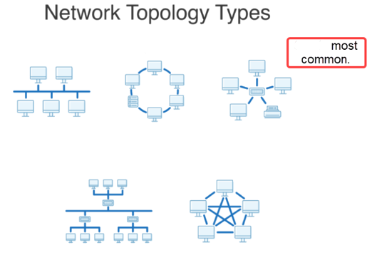
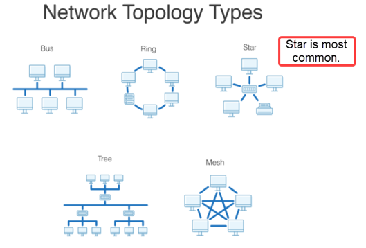
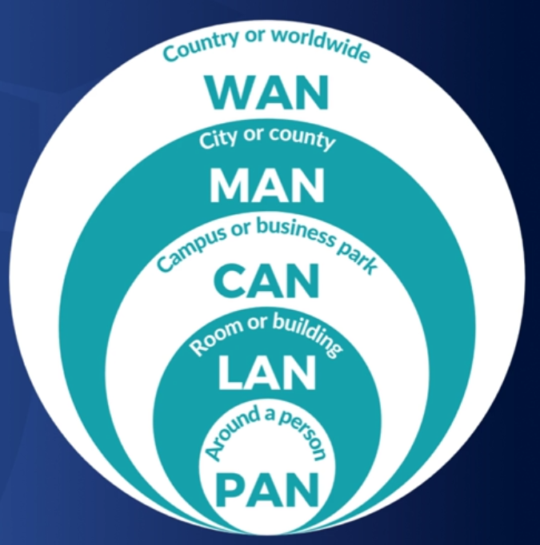

# D315 Network & Security Foundations

- https://www.examcompass.com/comptia/network-plus-certification/free-network-plus-practice-tests
- https://forms.office.com/pages/responsepage.aspx?id=z5Knz2h3QUOIV4F1TCr6H7WRaTy1bPBCu0xsIfiOAJhUM1RSQ0Q4TVlGVk4xWEQwWTBONks0MUc1MyQlQCN0PWcu
- https://quizlet.com/join/wfKUd8eK4?i=2vdkoj&x=1rqt
- https://www.reddit.com/r/WGU/comments/lhgi48/passed_1st_attempt_updated_study_guide_c172/?utm_source=share&utm_medium=ios_app&utm_name=ioscss&utm_content=2&utm_term=1
- https://drive.google.com/file/d/1mgo-OBPx24RTJ46Qay2WUzg8P3CGRmO0/view
-

## OSI Model

- What does OSI stand for? Describe OSI model.
- Describe TCP/IP. Compare OSI to TCP/IP.

%

- mnemonic PANTSPA

| Number | Layer        | Description                                                                    |
| ------ | ------------ | ------------------------------------------------------------------------------ |
| 7      | Application  | Http, DNS, FTP, software apps.                                                 |
| 6      | Presentation | (de)(en)cryption, Translates app to network format: ex.. jpg, mp4...           |
| 5      | Session      | Establish(and maintain connection),Manage,Terminate. (Request, Response, Auth) |
| 4      | Transport    | Segment and reassemble data. Host-to-Host. Reliable data delivery.             |
| 3      | Network      | Packet. Router, layer3 switch. Logical IP Addressing                           |
| 2      | Data Link    | Frame. Node-to-Node transfer. Error detection. switch, bridge, NIC.            |
| 1      | Physical     | Bit. hub, repeater, modem, and physical cabling.                               |

- mnemonic: NITA.

| TC/IP Model       | Protocols and Services                  | OSI Model                                   |
| :---------------- | :-------------------------------------- | :------------------------------------------ |
| Application       | HTTP, SSH, FTP, Telnet, NTP, DHCP, PING | 7. Application, 6. Presentation, 5. Session |
| Transport         | TCP, UDP                                | 4. Transport                                |
| Network           | IP, ARP, ICMP, IGMP                     | 3. Network                                  |
| Network Interface | Ethernet (physically sent)              | 2. Data Link, 1. Physical                   |

## Network Tools

Describe: arp, dig, finger, ifconfig, ipconfig, netstat -a, nmap, nslookup, ping, route, scp, telnet, tcpdump, traceroute, whois?

%

- arp: view arp cache. `arp -a` // show cache.
- dig: query DNS, troubleshooting. replacement of nslookup.
- finger: linux. info about remote system, login times.
- ifconfig: linux ipconfig
- ipconfig: view ip, subnet mask, default gateway. `ipconfg /all` // MAC, DNS, DHCP, Lease.
- netstat: view open, active ports. `netstat -a` // all ports(tcp, udp)
- nmap: network vulnerability scanner. host, open ports.
- nslookup: dns query. `nslookup 8.8.8.8` or `nslookup google.com`
- ping: ip connectivity and latency. `ping 192.168.0.1` or `ping google.com`
- route: show route table. `route` // windows `ip route` // linux.
- scp: secure copy. Copy files from one server to another.
- telnet: Legacy. Remote command line interface.(Pre ssh).
- tcpdump: sniffs tcp/ip packets and shows them in human readable form.
- traceroute: router hops. ip and latency. `traceroute 192.168.0.1` // linux, mac; `tracecert 192...` // windows.
- whois: info about website including contact information. `whois google.com`

## Cables

Describe: cat5-8, coax, Fiber

%

| Ethernet | Standard                      | Throughput | Distance   |
| -------- | ----------------------------- | ---------- | ---------- |
| Cat 5    | 100BASE-TX (Fast Ethernet)    | 100 Mbps   | 100 meters |
| Cat 5e   | 1000BASE-T (Gigabit Ethernet) | 1000 Mbps  | 100 meters |
| Cat 6    | 1000BASE-T                    | 1000 Mbps  | 100 meters |
| Cat 6e   | 10GBASE-T                     | 10 Gbps    | 55 meters  |
| Cat 6a   | 10GBASE-T                     | 10 Gbps    | 100 meters |
| Cat 7    | 10GBASE-T                     | 10 Gbps    | 100 meters |
| Cat 8    | 40GBASE-T (Fast Ethernet)     | 40 Gbps    | 30 meters  |

- **Coax**

  - analog signal. used by cable companies.
  - **type F** (screw on) connector.
  - **RG-6**: thick cable. Higher bandwidth.
  - **RG-11**: Longer distance. don't bend easy because thick insulation.
  - **RG-59**: legacy(RG-6 replaced). carries composite video. Used inside the home.

- **Fiber**

- Single Mode Fiber
- Multi Mode Fiber

| SMF yellow                           | MMF orange                           |
| ------------------------------------ | ------------------------------------ |
| Smaller core (10 micron)             | Larger core (50-100 microns)         |
| Longer distance (trans-alantic)      | Shorter distance (2 miles or less)   |
| Longer wavelength (higher bandwidth) | Shorter wavelength (lower bandwidth) |
| Laser                                | LED                                  |
| More Expensive                       | Less Expensive                       |

## Topology

%

- 
- bus: single line. coaxial cable, Thinnet. A bus network topology is a single line of devices connected together by one shared network cable. Half-duplex. collision problems.
- ring: circle connect. tried to solve collision problems. Token speak.
- mesh: most redundant. every device is connected to every other device. typically wifi.
- star(most common): central device (switch).

## Network

- Describe: PAN, LAN, CAN, MAN, WAN, WLAN, VLAN
- Describe: modems, hubs, repeaters, switches, routers.

%

- 
- PAN (personal area network) smallest network (about 10'. bluetooth, USB(wired)).
  - NFC, bluetooth.
- LAN (local area network). Limited to about 300' (one floor of office building).
  - Wifi: IEEE 802.11, Ethernet IEEE 802.3
- CAN (campus area network). few miles. campus wide. (military base)
- MAN (metropolitan area network). 25 miles.
- WAN (wide area network). 3000-4000 miles (california to New York.). No limits on range, even outer space.
- WLAN (wireless local area network). wifi in home.
- SAN (storage area network). pools of storage used by application servers.
  - iSCSI (internet SCSI) or FC (Fibre Channel) to connect.
- SoHo LAN (small office home office). business network. access printers, internet, servers.
- VLAN (Virtual Local Area Network). multiple devices separated from the network into one logical network.

| Network | Max Distance                     |
| ------- | -------------------------------- |
| PAN     | 10'                              |
| LAN     | 300'                             |
| CAN     | 2-3 miles (campus)               |
| MAN     | 25 miles (city)                  |
| WAN     | 3000-4000 miles (no limits)      |
| SAN     | pools of storage used by servers |
| SoHo    | same as LAN                      |

- modems: layer 1. translates the data from your ISP into a format that your home network devices can use.
- hubs: layer 1. copy frame to every port.
- repeaters: layer 1. retransmits signal. extend transmission distance.
- switches: layer 2. Switch uses and maintains a **MAC Address Table**(Maps it's ports to connected Host MAC address). Separates collision domain.
- routers: layer 3. divide the network.

## Virtualization

Describe Hypervisor, Type 1, Type 2?

%

- **Hypervisor**: creates the virtual hardware for devices.
  - software to create the illusion of physical hardware.
  - needed to connect with and host VM's.
  - manages all physical resources: memory, processor, storage.
  - Must have processor that supports virtualization.
  - maintains a network connection to the many virtual machines. commonly used on servers.
  - **Type 1**: (bare metal hypervisor). Installed directly on the physical hardware.
    - Hyper-V(Microsoft, Windows 10+), VMWare ESXi(server environment), Citrix's XEN Server, KVM(Linux open source).
    - Manages virtual machines and resources without relying on an underlying operating system.
    - complete access to hardware (no OS to go through).
  - **Type 2**: (hosted). Installed as an app on top of an existing operating system.
    - Requires the host operating system to manage hardware resources. Commonly used on personal computers.
    - Runs virtual machines as processes within the host operating system.
    - Microsoft Virtual, VMware Workstation, Oracle Virtual Box, and MAC Parallels Workstation.
    - Security: VM Escape. Attacker tries to get control of Host OS.

## Security Threats

- What is a person called who legally tries to compromise network security?
- What is some of the most potent threats from within an organization?
- arp poisoning/spoofing, bluejacking, bluesnarfing, brute force, buffer overflow, Deauth, DoS, DDoS, man-in-the-middle, phishing, ping flood, ping of death, port scanning, RPC Exploit, session hijacking, smurf, sniffing, spear phishing, SQL injection, teardrop, vlan hopping, wiretapping, zero-day?

%

- InfoSec jobs known as **penetration testers** who are tasked with attempting to compromise a network’s security.
- disgruntled insider may have a motive. **Whenever you combine motive and opportunity, you have a substantially increased risk of trouble.**

- **ARP Poisoning/Spoofing**: malicious arp packets to gateway in order to change it's ip to MAC pairing.
- **Bluejacking** is an attack in which someone sends unsolicited messages to a Bluetooth-enabled device.
- **Bluesnarfing**: gains unauthorized access to wireless device through bluetooth connection.
- **Brute Force**: try every combination of characters.
- **Buffer Overflow**: malicious code overflows into other parts of memory, executing with higher privileges.
- **Deauth**: DoS. Attacker sends Deauth frame with spoofed MAC to close wifi connection. Mitigation: WPA3/WPA2 encrypted packets.
- **DoS (Denial of Service)** Brute force. Increase traffic until overwhelm system.
- **DDoS (Distributed DoS Attacks and Botnets)** Botnet of zombie host.
- **Man-in-the-Middle**: attacker secretly relays and possibly alters the communications between two parties who believe that they are directly communicating with each other.
- **Phishing** Pretends to be from reputable company to reveal personal information. ex.. spoofed electronic media.
- **Ping Flood**: DDoS. overwhelms system with too many ICMP request.
- **Ping of Death**: DoS. ICMP packet flood with packet oversized(>65,535 bytes). To crash system.
- **Port Scanning**: tool such as nmap to scan network ports open and what app is listening.
- **RPC Attack** (Remote Procedure Call). Remote code execution(on RPC port) from buffer overflow or spoofing.
- **Session Hijacking**: stealing or predicting a valid session token to gain unauthorized access to the Web Server.
- **Smurf**: DDoS flood. ping request(ICMP echo) with spoofed source IP address.
- **Sniffing**: reading network traffic for reconnaissance or find vulnerabilities.
- **Spear Phishing** attacker has some info about target. Convince target communication is genuine.
- **SQL Injection**: embed sql commands into web request. control database.
- **Teardrop**: DoS. Malformed packets. Target Server tries to reassemble, causing overhead.
- **Vlan Hopping**: vlan attacker gains access to another vlan. Typically from misconfigured switch port.
- **Wiretapping**: illegal listening to someones conversation.
- **Zero-Day**: vulnerability found. Malware release before patch to fix is released.

## Malware Attacks

1. How deal with rootkits, backdoor attacks, and Trojan horses?
2. Describe Virus? How to mitigate?
3. Describe Worm? How to mitigate?
4. Describe Trojan? How to mitigate?
5. Describe Rootkit? How to mitigate?
6. Describe Ransomware? How to mitigate?
7. Describe Zero day? How to mitigate?

%

1. Run complete antivirus and anti-malware scans on your systems regularly and keep the virus definitions as up-to-date as possible to help you detect new and emerging threats.
2. **Malware**: malicious software. Generic term for: viruses, ransomware, worms, and trojans.
3. **Virus**: malicious code concealed in an executable file, run with same permissions as process.
4. **Worm**: malicious software that replicates itself to spread to other computers/drives. can cross network.
5. **Trojans**: malicious software(capture data, open backdoor) that looks legitimate.
6. **Rootkits**: gain root/system privileges and hide itself in boot process.
7. **Ransomeware**: encrypts or blackmail computer/data and demands payment.
8. **Zero-Day**: vulnerability found. Malware release before patch to fix is released.

## Cloud Infrastructure

- Describe: accessible, metered/measured, elasticity, on-demand, pooling, public, private, hybrid, community, multi-tenancy, single-tenancy, multi-cloud?

%

- **accessible**: global reach. The 'Edge'.
- **Metered/Measured Service/Utilization**: pre-paid, a-la-carte, pay-per-use, or committed offerings. Typically charges are based on the actual usage, but can be an hourly or monthly basis. Measured can also refer to graphs of actual usage.
- **Rapid Elasticity**: scale up/down as needed. Cloud Providers meet the fluctuating demands of cloud user. Done through automation and orchestration. Cloud provider services.
- **On-demand**: consumer can provision computing capabilities without requiring human interaction with each service provider.
- **Resource Pooling**: providers serve multiple clients (multi-tenant model), with different physical and virtual resources dynamically assigned and reassigned according to consumer demand. (ex.. AWS has 2000TB RAM, they rent you 4GB RAM).
- **Public**: services available over the public internet (AWS, Azure, Google Cloud).
- **Private**: private access to resources (GovCloud).
- **Hybrid**: public cloud and private cloud, including on-premises data centers or “edge” locations.
- **Community**: resources and cost shared by multiple organizations who have a common need.
- **Multi-Tenancy**: same resource used by multiple organizations (cheaper, less secure).
- **Single-Tenancy**: only the single organization uses resource (expensive, more secure).
- **Multi-Cloud**: leveraging the services of multiple public cloud providers.

## CIA

Describe CIA? Give examples of how it's used.

%

- **CIA** reference model to help enforce security management.
  - **Confidentiality** means that certain information should only be known to certain people.
  - **Integrity** data can only be modified by authorized person. (includes transport of data).
  - **Availability** means that information is accessible to those authorized to view or modify it.
- **Confidentiality**: the access to information should be granted only on a need-to-know basis. A person in the customer support department should not have access to the HR database. Unencrypted info, Deleted files not completely purged, physical theft of a device, social engineering. Ie; **User forgets to lock their screen** and another person hops on and looks through email.
- **Integrity**: the information should not be tampered with from source to destination. Any time data is changed. Man in the Middle attacks, **employee changes their salary** $$ in the database.
- **Availability**: The services of an organization should be available. Denial of service Distributed Denial of Service attacks. Unable to access the system. User locked out after 3 tries of password. Changes to access list (intentional or accidental). Ie; **email server crashes**.

## AAA

1. Describe is AAA in security?
2. A server is out of storage and fails to write to the log files. Administrators are still able to remotely log in and review logs. Which category of AAA is affected in this scenario?

%

1. **Authentication**: Who and what are you? (First step.) Username/password issues.
   **Authorization**: What are you allowed to do? (Second step.) Access rules. Administrative limitations.
   **Accounting**: Keeps track of what you do. (Final step.) Log files – anything with log files

- **Authentication** means that everything using the system is identified by an account and that an account can only be operated by someone who can supply the correct credentials.
  - The format of a credential is called an **authentication factor**. The principal factors are categorized as:
    - knowledge (something you know, such as a password)
    - possession (something you have, such as a smart card or smartphone)
    - inherence (something you are, such as a fingerprint).
    - **Multifactor Authentication** user must submit two different types of credentials.
    - **2-Step Verification** once registered, if ip or new device, another form of auth is used (soft token|OTP).
      - The code could be delivered by email , short message service (SMS) text, or as an automated voice call.
- **Authorization** means access to resources is allowed only to accounts with defined permissions. Each resource has an access control list specifying what users can do. Resources often have different access levels; for example, being able to read a file or being able to read and edit it.
- **Accounting** means logging when and by whom a resource was accessed.

2. Accounting.

## Firewalls

1. What is the pupose of a firewall?
2. What is IDS? IPS? Whats difference between the two?
3. Which network device is usually placed in-line between a trusted network and an untrusted network?
4. What are the different types of Firewalls? Which is considered most secure? Which one requires the most CPU?

%

1. Firewall is part of a computer system or network designed to block unauthorized access while permitting outward communication. Protection for one network from another. Network based firewalls filter traffic at OSI Layer 3 (IP) and 4 (TCP/UDP) (some can filter through Layer 7- application firewalls). Most firewalls are also Layer 3 routing devices that sit on the ingress/egress of a network – a central device that sits between you and the internet. Firewall rules are called Access control Lists – the ACLs allow or disallow traffic based on tuples (tuples = groups of variables like Source IP, Dest IP, Port Number, time, etc).
2. IDS/IPS

- IDS (Intrusion Detection System)
  - IDS are passive listeners on the network and are designed to alert a network administrator.
- IPS (Intrusion Prevention System)
  - designed to intercept and block suspicious traffic. Must be inline with traffic flow.
  - has many network in/out ports.
- Both
  - identify malicious traffic based on signatures. detect packets up to layer 7
  - anomaly-based behavior to detect intrusion.
  - require skilled staff to tune.
  - virtual or host based.
  - both can be configured to operate in 'tap'(just listen and alert, do not block) mode.
- IPS/IDS vs Firewall
  - IPS/IDS use signatures(virus/malware scanning) up to layer 7
  - Firewalls block based layer 3,4(stateless) or layer 3,4,5(stateful).

3. Firewall

4.

- **Stateless Firewall (Packet Filtering Firewall)**
  - obsolete
  - needs two rules: incoming traffic and outgoing traffic to establish a session.
  - Does NOT keep track of traffic flows (no sessions).
  - Operates at Layer 3 (the IP Layer) and Layer 4 (the TCP and UDP port numbers).
- **Stateful Firewalls**
  - keep track of connections from layer 3,4,5. (3)IP src/dest, (4)Port, (5)session.
  - complex firewall rules can be created, like only the Host can initiate communication.
  - EVERY packet is analyzed, categorized and a security decision is made. The inbound and outbound data packets are compared to determine if a connection should be allowed. This includes tracking the source and destination port numbers and sequence numbers as well as the source and destination IP addresses.
  - unlike stateless only needs one rule to establish a session.
  - OSI Layers 3, 4, 5.
- **Circuit Level Firewall**
  - Circuit-level gateways work at the session layer(5) of the OSI model.
  - monitor TCP handshaking between packets to determine whether a requested session is legitimate.
  - Information passed to a remote computer through a circuit-level gateway appears to have originated from the gateway(initiates new connection on behalf of the client and presents it's own IP to server).
  - conceal the details of the protected network from the external traffic.
  - Do not filter packets.
- **Proxy Server**
  - obsolete. replaced by NGFW.
  - Some firewalls are configured as proxies. You make a request to the firewall then the firewall makes its own request on your behalf to the internet. It then examines the response that it gets back for malware/danger and sends it to you if its safe. The client gets access to the network via the proxy server. This step is used to authenticate the user, establish the session, and set policies. The client must connect to the proxy server to connect to resources outside the network. Hides your IP address. Looks at actual data inside packets.
- **Application Level Firewall (NGFW -Next Generation Firewalls)**
  - (sometimes known as a proxy firewall). Blocks program-level traffic(application-aware). For example, you might be able to view Twitter but not post to Twitter because the application (stateful) firewall knows exactly what you should be allowed to do.
  - Inspects at OSI Level 7 (and below). Requires decode of the packets. Looks at actual data inside packets.
  - Multiple names:
    - app layer gateway
    - stateful multilayer inspection
    - deep packet inspection
    - next-gen.
  - Network based: controls traffic based on network address (youtube, twitter)
  - IPS: identify app, apply app specific signatures to traffic.
  - Content filtering.

## Transport Layer Security

1. Which OSI protocol is affected when a malicious user is targeting weaknesses in HTTPS?
2. Which attack tricks a client into mapping an IP address to a spoofed MAC address?
3. Which type of port has access to all VLANs by default in a traditional layer 2 switch? Why is that of concern?

- OSI Model 1-7, describe security threats and mitigation's?

%

1. The secure sockets layer, or SSL(obsolete, Now TLS)
2. ARP spoofing
3. Trunk. if a network administrator mistakenly configures a computer's switch port as trunk mode, the computer(attacker) may be able to send and receive traffic on any VLAN on the switch.

| N   | Layer        | Attack                             | Mitigation                                              |
| --- | ------------ | ---------------------------------- | ------------------------------------------------------- |
| 7   | Application  | Expose data, SQL injection         | Authorization, reverse proxy/IPS scan signatures        |
| 6   | Presentation | man-in-middle                      | application layer FW/IPS, train users fake certificates |
| 5   | Session      | RPC attack                         | regular patching/updates                                |
| 4   | Transport    | Segment port scanner               | packet filtering firewall                               |
| 3   | Network      | Packet. Ping sweep                 | packet filtering firewall                               |
| 2   | Data Link    | Frame. ARP poisoning/Vlan Hopping. | IPS/correct switch misconfiguration                     |
| 1   | Physical     | Bit. Wiretapping                   | control physical access                                 |

- Vlan hopping: Another Layer 2 attack targets Ethernet switches that separate traffic into multiple logical networks called virtual local area networks (VLAN). When configuring a switch with VLANs, the network administrator typically configures each switch port to operate in one of two modes: access mode (also called untagged mode) or trunk mode (also called tagging mode).
- When a computer is attached to an access port, it may only send and receive traffic on the VLAN assigned by the switch; the computer has no control over the VLAN selection. On the other hand, if a network administrator mistakenly configures a computer's switch port as trunk mode, the computer may be able to send and receive traffic on any VLAN on the switch.

## Encryption

1. What is end-to-end encryption?
2. Describe Symmetric, Asymmetric Cipher?
3. SSL, TLS?

%

1. Data is encrypted on the sender’s system and only the recipient is able to decrypt it.

- **Asymmetric Encryption**
  - private/public key pairs.
  - data encrypted with public key can only be decrypted with private key.
    - data encrypted with private key can only be decrypted with public key.
    - this allows for authenticity. When public key is sent, only the private key can read message and return it.
  - private key must be secret. Public key is known in the public domain.
  - slow. Used to synchronize the symmetric encryption key, for fast encryption.
  - algorithms: RSA, ECDSA.
- **Symmetric Encryption**
  - same key for encrypt and decrypt
  - key is known by both sender and receiver.
  - fast
  - used for large transmissions
  - Algorithms: DES, 3DES, AES (most common), SEAL
- **SSL**: Secure Socket Layer uses an asymmetric key pair. Offers end-to-end encryption.
- **TLS**: Transport Layer Security: It is the successor to SSL (basically the improved version.)
  - encryption. replaces SSL.
  - uses both asymmetric/symmetric keys. Unique keys for each transaction.
  - OSI layer 6.
  - Authentication is provided by asymmetric, data is encrypted with a symmetric cipher.
  - TLS creates a secure channel over the internet between a client computer and a server by exchanging a public key in the form of a certificate. The certificate is issued by a registered and well-known certificate authority (CA), such as Verisign. The certificate has a public key that is stored on the webserver and presented to the public whenever a user connects to the website. The private key is also stored on the webserver but is kept secret and protected.

1. client encrypts token with website(host) public key.
2. only the private key can read token. The host uses the token as the symmetric encryption key and returns data in cipherText.

## Wifi Security

1. Which type of wireless security protocol is the most secure?
2. What is AES encryption?
3. What is 3DES encryption?
4. Describe an Ad-hoc connection? Why use one?
5. What is a WAP?

%

1. (WPA2+AES)
2. Advanced Encryption Standard. A modern block cipher that supports three key lengths of 128, 192, and 256-bit encryption. It provides excellent long-term security against brute-force attacks. Six times faster than 3DES.
3. In cryptography, Triple DES, officially the Triple Data Encryption Algorithm, is a symmetric-key block cipher, which applies the DES cipher algorithm **three times** to each data block. The Data Encryption Standard's 56-bit key is no longer considered adequate in the face of modern cryptanalytic techniques and supercomputing power.

- WEP uses PSK (pre-shared key) and RC4 algorithm. It is weak.
- WPA uses RC4 algorithm and TKIP (Temporary Integrity protocol) which rekeys after every 10,000 packets. (Better than WEP)
- WPA2 uses AES and CCMP. (Most Used.)
- WPA3 – strongest but newer so not used as much yet. When asked a question about which is best, always look at the WP# - the higher, the better.
- Wireless Network Infrastructure Modes

  - **Ad-hoc**
    - two or more wireless stations communicate directly with each other.
    - peer-to-peer network.
    - scalability problem. Wireless hardware solves with AP (Access Point).
    - In ad-hoc mode, all wireless communication is performed in a peer-to-peer fashion and does not require or involve a WAP. Ad-hoc wireless networks are rarely used in homes or offices, but they can be helpful in setting up a new device, such as a printer by connecting them directly, much as one would do with a physical cable. Ad-hoc networks are also occasionally used to transfer files between devices, such as between a camera and a laptop.
  - Infrastructure
    - In almost all cases, a WAP or wireless router is used to connect wireless devices to the network. The WAP acts like an Ethernet switch in wired networking and often has a physical cable that connects it to the rest of the network. A wireless router is a WAP and a router combined into a single device and is most often used in home and small business environments to connect to the internet while also providing wireless connectivity for nearby devices.

- **WAP**: (wireless access point). connect wireless devices to the network. The WAP acts like an Ethernet switch in wired networking and often has a physical cable that connects it to the rest of the network.
