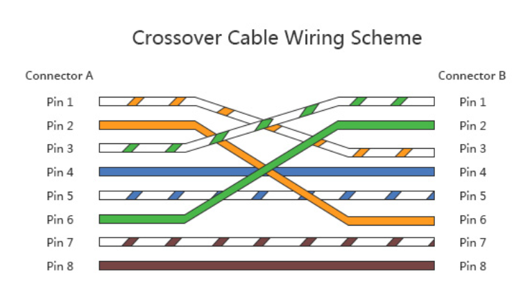
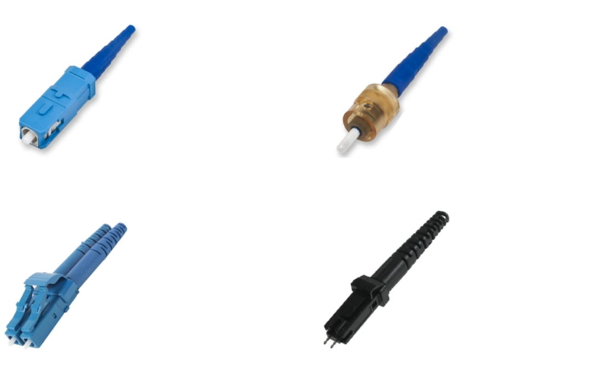
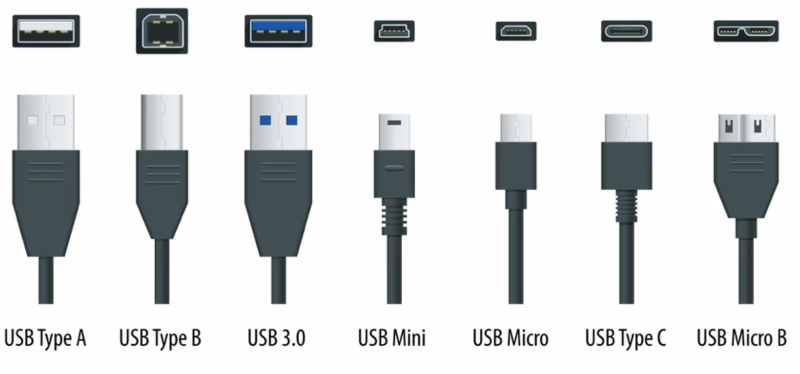
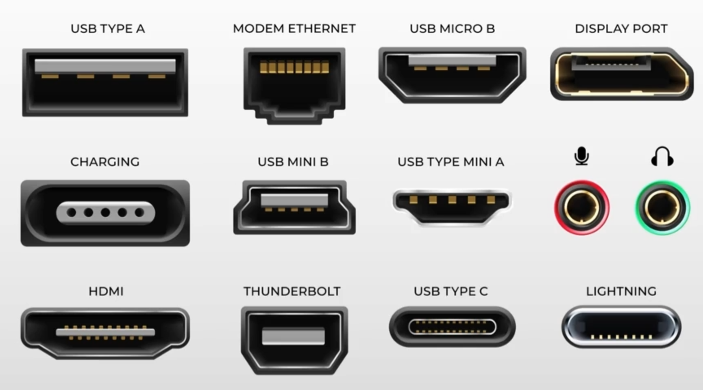
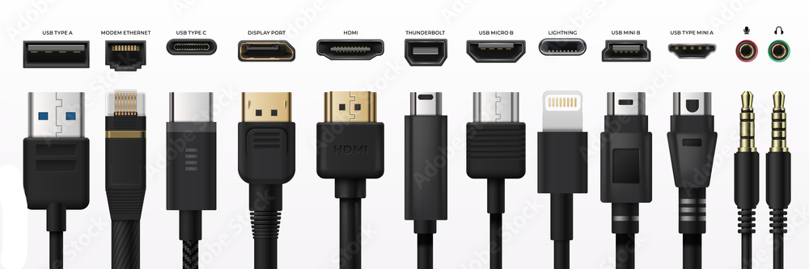
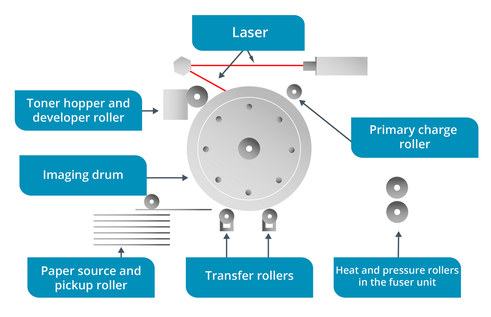
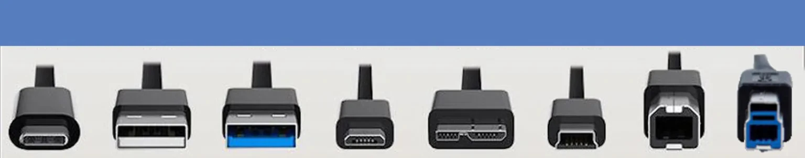
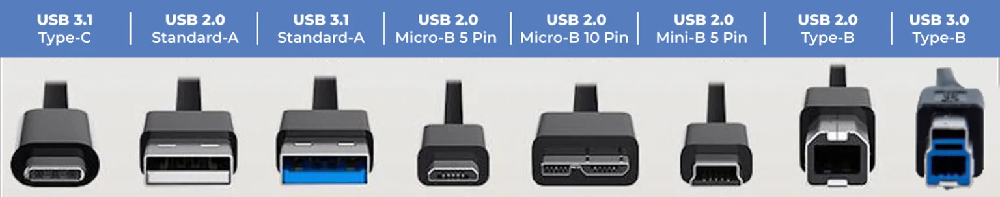

# CompTIA A+ Core1 (220-1101)

- PBQ practice questions:
  - https://www.reddit.com/r/WGUIT/comments/npydjn/comptia_a_2201001_pbq_practice/?utm_source=share&utm_medium=ios_app&utm_name=iossmf

## Cellular

GSM vs CDMA?
1G, 2G, 3G WCDMA, 3G HSPA, 3G HSPA+, 4G LTE, 4G LTE-A, 5G Low-band, 5G Mid-band, 5G High-band?
What is the CDMA PRL?
%

- **GSM (Global System For Mobiles)**: Cellular technology that takes the voice during a call and converts it into a digital format. Removable SIM card and most popular around the world. In US, used by AT&T and T-Mobile.
- **CDMA (Code-Division Multiple Access)**: Cellular technology that uses code division to split up the channel.
  - CDMA is a more powerful and flexible technology than GSM.
    - W-CDMA
      - Wideband CDMA
    - UMTS
      - Universal Mobile Telecommunications System
  - Cannot remove SIM, but new electronic SIM is a cheaper way of getting a data service when overseas.
  - **PRL (Preferred Roaming List)** is a database built by CDMA service and most important to connect to network while traveling.

| Technology   | Frequency     | Transfer Speed     |
| ------------ | ------------- | ------------------ |
| 1G           | 30KHz         | 2Kbps              |
| 2G           | 1800MHz       | 14.4Kbps - 64 Kbps |
| 3G WCDMA     | 1.6 - 2 GHz   | 144Kbps - 2Mbps    |
| 3G HSPA      | 1.6 - 2 GHz   | 14.4Mbps           |
| 3G HSPA+     | 1.6 - 2 GHz   | 50Mbps             |
| 4G LTE       | 2 GHz         | 100Mbps            |
| 4G LTE-A     | 8 GHz         | 1Gbps              |
| 5G Low-band  | 600 - 850 MHz | 30Mbps - 250Mbps   |
| 5G Mid-band  | 2.5 - 3.7 GHz | 100Mbps - 900Mbps  |
| 5G High-band | 25 - 39 GHz   | 10Gbps             |

## Cloud

What is: Metered Service? Measured Service? On-demand? Rapid Elasticity? Resource Pooling?
What is: Public Cloud? Private Cloud? Hybrid Cloud? Community Cloud? Multi-Tenancy Cloud? Single-Tenancy Cloud?
DaaS? IaaS? PaaS? SaaS?
%

- Metered Service: pre-paid, a-la-carte, pay-per-use, or committed offerings. Typically charges are based on the actual usage, but can be an hourly or monthly basis.
- Measured Service: cloud provider measures/monitors cloud services for insights into: billing changes, effective use of resources or overall predictive planning.
- Rapid Elasticity: scale up/down as needed. Cloud Providers meet the fluctuating demands of cloud user.
- On-demand: consumer can provision computing capabilities without requiring human interaction with each service provider.
- Resource Pooling: providers serve multiple clients (multi-tenant model), with different physical and virtual resources dynamically assigned and reassigned according to consumer demand. (ex.. AWS has 2000TB RAM, they rent you 4GB RAM).
- Public Cloud: services available over the public internet (AWS, Azure, Google Cloud).
- Private Cloud: private access to resources (GovCloud).
- Hybrid: public cloud and private cloud, including on-premises data centers or “edge” locations.
- Community Cloud: resources and cost shared by multiple organizations who have a common need.
- Multi-Tenancy Cloud: same resource used by multiple organizations (cheaper, less secure).
- Single-Tenancy Cloud: only the single organization uses resource (expensive, more secure).

| Platform | Includes                                             |
| -------- | ---------------------------------------------------- |
| IaaS     | hardware + management software                       |
| PaaS     | IaaS + OS (linux, windows, MAC...)                   |
| SaaS     | PaaS + complete app. you bring your data             |
| DaaS     | SaaS + desktop virtualization software, thin clients |

## Cloud Security

What is: VM Escape? VM Hopping? Rogue VM? VM Sprawl?
%

- **Best Security**: Up-to-date, Patched, Securely configured. Strong endpoint software protection, Limited extensions or add-ons.
- **Best Practices**: - Disable sharing between host and VM. encrypt vdi.
- **Security**
  - **VM Escape**: threat tries to leave virtual machine. Attacker tries to get access to underlying OS. Exploits a vulnerability in the hypervisor software. Easier on Type 2 hypervisor.
  - **VM Hopping**: threat moves from VM to another VM or to host.
  - **Sandbox Escape**: attacker tries to gain access to OS or other privileged process.
  - **Live Migration**: transfer VM to another machine. Make sure encrypted or trusted network.
  - **Data Remnants**: left over from a running virtualized environment. Encrypt virtual machine drives. Destroy encryption keys.
  - **Rogue VM**: unmanaged virtual machine connected to the organization's network.
  - **VM Sprawl**: The number of VM's on a network reach a point where admins can no longer manage them effectively. They become Rogue VM's. These VM's become susceptible to attack because they are default and not being monitored. Usually done by 3rd party developers.

## VM Communication

Describe VM communication types: internal? external? private? localhost?
%

- **Internal**: communicate with host and other VM's.
- **External**: communicate Internal + access internet.
- **Private**: creates a switch usable only by other VM's.
- **Localhost**: communicate only with itself.

## VM Virtualization (Intel & AMD)

Intel Virtualization called?
AMD Virtualization called?
ARM virtualization works on what OS?
What is Hypervisor? Describe Types of Hypervisor?
%

- **VT**: Intel -must have this to support virtualization.
  - EPT (Extended Page Table): SLAT (Second Level Address Translation) allows better virtual memory management and increases performance.
- **AMD-V**: AMD
  - RVI (Rapid Virtualization Indexing): SLAT.
- **ARM**: MAC processor. Only can virtualize ARM based OS.

- **Hypervisor**: manages all physical resources: memory, processor, storage. Must have processor that supports virtualization.
- **Type 1**: (bare metal). Faster. Hypervisor runs directly on the host's hardware, without going through OS.
  - Hyper-V(Microsoft, Windows 10+), VMWare ESXi(server environment), Citrix's XEN Server.
- **Type 2**: hypervisor talks to Host OS. Each VM has own OS. Security: attacker can get control of Host OS.
  - VMware Workstation, Oracle Virtual Box, and MAC Parallels Workstation.
- **Container/Containerization**: separates host resources at the OS level. OS defines isolated containers for each instance. Each VM does not need it's own OS.
  - Container based virtualization.
  - OS kernel shared across multiple machines.
  - Less resources because each container does not need it's own OS.
  - Very secure. Provides isolated environment for application at the OS level.
  - Docker: Hardware/Host OS/Container Manager/[Container1/App, Container2/App...].

## Coaxial Cable

What connector for coaxial cable?
Difference between RG-6 & RG-59?
%

- provided by internet companies. Cable modem converts to Ethernet signal.
- coaxial terminal to accept a **BNC-type** (push twist) connector.
- Can also have **type F** (screw on) connector.
- RG-6 thick cable. Used to deliver signal from cable company to home.
- RG-59: carries composite video. Used inside the home.
- Twinaxial cable: short range high speed device. Two conductors in wire.

## CAT 5e, 6 (Ethernet Cable)

What is: UTP? STP?
What connector available for Ethernet?
Describe Cat 5 - 8 cable? length? throughput?
Direct Burial Cable? Plenum Cable? Non-Plenum Cable?
Patch/Straight Through (568A), Crossover (568B) color code arrangement?
%

- IEEE 802.3 (1983) Ethernet Standard set by the (Institute of Electrical and Electronic Engineers)
- Ethernet is a collection of network protocols/standards.
- **UTP Unsheilded Twisted Pair**:
  - more twist, better emi protection, higher category number (5e,6,7,8) the more twist per inch of cable. more twist, faster transfer speed.
- **STP Sheilded Twisted Pair**
  - metal foil shielding. (more expensive, less emi problems. Operate about the same as UTP).
  - stops 'crosstalk'. Necessary for shielding around fluorescent lights.
- **RJ-45** (Register Jack - 45) data network connector.
- **RJ-11** phone network connector.
- **Throughput**: the actual data that can be transferred (not the theoretical).

| Ethernet | Standard                      | Throughput | Distance   |
| -------- | ----------------------------- | ---------- | ---------- |
| Cat 5    | 100BASE-TX (Fast Ethernet)    | 100 Mbps   | 100 meters |
| Cat 5e   | 1000BASE-T (Gigabit Ethernet) | 1000 Mbps  | 100 meters |
| Cat 6    | 1000BASE-T                    | 1000 Mbps  | 100 meters |
| Cat 6e   | 10GBASE-T                     | 10 Gbps    | 55 meters  |
| Cat 6a   | 10GBASE-T                     | 10 Gbps    | 100 meters |
| Cat 7    | 10GBASE-T                     | 10 Gbps    | 100 meters |
| Cat 8    | 40GBASE-T (Fast Ethernet)     | 40 Gbps    | 30 meters  |

- **Straight Through, Patch Cable** the cable end to end is identical. Transmit and Receive are opposite on devices.
  - 568B -> 568B. (568B):Orange Stripe,Orange, GreenStripe, Blue,BlueS, Green, BrownStripe, Brown.
  - 

| Device   | Transmit Pins | Receive Pins |
| -------- | ------------- | ------------ |
| PC       | 1,2           | 3,6          |
| Firewall | 1,2           | 3,6          |
| Router   | 1,2           | 3,6          |
| Switch   | 3,6           | 1,2          |

- **Crossover Cable** connect devices directly. ex.. two computers/switches/routers directly together.
  - Modern switches use **Auto MDI-X (Medium Dependent Interface Crossover)** that handles receive/transmit traffic for so you don't have to connect your switches together with crossover cable.
  - connect same device types.
  - 568A -> 568B.
- 

- T-568A: 1:Green Stripe, 2:Green, 3:Orange Stripe, 4:Blue, 5:BlueStripe, 6:Orange, 7:Brown Stripe, 8:Brown
- T-568B: 1:Orange Stripe, 2:Orange, 3:GreenStripe, 4:Blue, 5:BlueS, 6:Green, 7:Brown Stripe, 8:Brown.

| Device   | Transmit/Receive Pins |
| -------- | --------------------- |
| PC       | 1 -> 3, 2 -> 6        |
| Firewall | 1 -> 3, 2 -> 6        |
| Router   | 1 -> 3, 2 -> 6        |
| Switch   | 3 -> 1, 6 ->2         |

- **Direct Burial**: run directly in the ground. Thicker sheathing
- **Plenum**: fire retardant chemical layer (typically red/orange color). Must be used anywhere you cannot see (walls, raised floors, air ducts).
- **Non-plenum**: pvc. Normal Ethernet cable.

## PoE (Power over Ethernet)

POE Types: 13w, 25w, 51w, 73w?
What is a Power Injector?
%

- power injector to supply power to ethernet.
- PoE devices do not need electricity.
- **Power Injector**: plugs into wall outlet. Two RJ45 ports, one to switch, other to device.

| POE RJ-45 | Wattage                         |
| --------- | ------------------------------- |
| 802.3af   | 15.4w, oldest                   |
| 802.3at   | POE+, 25.5w                     |
| 802.3bt   | POE++, 51w(Type 3), 73w(Type 4) |

## Fiber Cable

Single Mode Fiber vs Multi-mode Fiber?
Label the image: (SC, ST, LC, MTRJ)?

%

| SMF yellow      | MMF orange       |
| --------------- | ---------------- |
| Smaller core    | Larger core      |
| Longer distance | Shorter distance |
| More Expensive  | Less Expensive   |

- 

## Computer Cables and Ports

Label these images.

%

- 
- 
- 
- 

## Email Setup

SMTP,POP3,IMAP. Describe Purpose of each. What are the ports (encrypted/unencrypted)?
A, AAAA, CNAME, MX, TXT, NS?
DMARC, DKIM, SPF?

%

| Port | Name                                                          | Encryption | TCP/UDP |
| ---- | ------------------------------------------------------------- | ---------- | ------- |
| 25   | `SMTP` (Simple Mail Transfer Protocol) sending/outgoing email | no         | TCP     |
| 110  | `POP3` (Post Office Protocol) incoming email.                 | no         | TCP     |
| 143  | `IMAP` (Internet Mail Application Protocol) incoming email    | no         | TCP     |
| 465  | `SMTP` encrypted outgoing email SSL/TLS                       | yes        | TCP     |
| 993  | `IMAP` encrypted incoming email SSL/TLS                       | yes        | TCP     |
| 995  | `POP3` encrypted incoming email SSL/TLS                       | yes        | TCP     |

1. **Incoming Mail server**: (port: 143/993 TLS) (FQDN of server) mail.example.com
2. **Outgoing Mail server**: (port: 25/465 TLS) (FQDN) smtp.example.com
3. **Encryption**: TLS (or older provider: SSL)
4. **Port**: incoming: 143/993 TLS, outgoing: 25/465 TLS

| DNS Record | Description    | Function                               |
| ---------- | -------------- | -------------------------------------- |
| A          | IPv4 Address   | links FQDN to IPv4 address             |
| AAAA       | IPv6 Address   | links FQDN to IPv6 address             |
| CNAME      | Canonical Name | points domain to another domain        |
| MX         | Mail Exchange  | directs email to mail server           |
| TXT        | Text           | add text into DNS. SPF, DKIM, DMARC... |
| NS         | Name Server    | which DNS has authority                |

- MX: Mail exchange. Host name of the mail server. Identify an email server for the domain so that other servers can send messages to it.
- DMARC: Domain-based Message Authentication, Reporting, and Conformance. Enforces Auth Policy/SPF/DKIM. Ensures SPF and DKIM are being utilized effectively. DMARC specifies a policy mechanism for senders to specify how authentication failures should be treated.
- SPF: Sender Policy Framework. Valid User sent email. Uses a TXT resource record published via DNS to identify the hosts authorized to send email from that domain.
- DKIM: DomainKeys Identified Mail. Valid Server sent email. Uses cryptography to validate the source server for a given email message. To configure DKIM, the organization uploads a public encryption key as a TXT record.

## Mobile Display Types

Describe each display screen technology: Capacitive Touch, Multi-touch, LCD, TN, VA, IPS, CCFL, LED, OLED?
What technology is older: TN, VA, IPS?
%

| Display                              | Description                                                                |
| ------------------------------------ | -------------------------------------------------------------------------- |
| Capacitive Touch                     | responds to touch                                                          |
| Multi-Touch                          | responds to multiple fingers touch                                         |
| Plasma                               | small cells plasma gas, excessive heat, low energy efficiency, burn-in     |
| LCD                                  | TFT (Thin-Film Transistor), CCFL is used for screen backlighting           |
| CCFL (Cold Cathode Fluorescent Lamp) | AC voltage. Lamp Backlighting                                              |
| LED (Light Emitting Diode)           | lighter than LCD. less power                                               |
| LED TN (Twisted Nematic)             | fast response times, gamers. Older than VA, IPS.                           |
| LED VA (Vertical Alignment)          | best contrast. middle quality of IPS and TN.                               |
| LED IPS (In-Plane Switching)         | best colors than VA and TN, wide 178° viewing angle                        |
| OLED (organic LED)                   | Lightest. each pixel has own light source. bendable. better than TN,VA,IPS |

## Mobile Phone Security

Describe EMM? MDM? MAM?
%

- **EMM**: (Enterprise Mobil Management). Manage entire mobile ecosystem. Phone, Ports, Apps, Policy.
- **MDM**: (mobile device management) Securing mobile phone. managing mobile phones policy.
- **MAM**: (Mobile Application Management). manage mobile phone apps that can access corporate data.

## Motherboard Memory & Cache

1. What types of memory do PC's have?
2. How fast is PC4-1600 (DDR4 module) memory?
3. What considerations for buying memory module?
4. Why is it important to buy modules in pairs?
5. What is laptop memory called?
6. Advantages of Multiple Modules?
7. 3 Memory modes?

%

- **Memory modes**:
  - **Single Channel**:
  - **Dual Channel**: doubles bandwidth.
  - **Flex**: bridges the gap between single-channel and dual-channel memory operations, offering improved performance when mismatched RAM. Dual channel for the matched memory, single channel for unmatched memory. ex.. 12GB, 4GB. 4GB will run in dual channel, 8GB will run single channel.
-

- **Cache**: small amount but extremely fast. Processor uses this first. Move memory from RAM into Cache.
- **RAM**: Random Access Memory | System Memory. Fast. Cheapest and fastest way to increase the performance. Data is moved from storage to RAM, then Cache.
- **PC4-16000** = 16000 MBps / 16 GBps.
- **Buying Memory**: same make, model, speed, keying, throughput of memory.
- **Module Pairs**: if they communicate at different speeds, Processor will have to choose the lower speed to talk to both modules.
- **Desktop Memory**: DIMM (Dual In-Line Memory). Module contains several RAM chips.
- **Laptop Memory**: SODIMM Small Outline Dual In-line Memory Module. DDR3,DDR4,DDR5. Smaller size.
- **Multiple Modules**: Faster speed, More Memory.

- **Storage**: HDD, SSD, DVD, CD, Flash USB, Floppy.
- **Addressing Memory**: processor accessing files in RAM.
- **Memory Controller**: BUS. (x86 32-bit), (x64 64-bit). The bits that can be transferred with each clock cycle.
  - x86 ~4 billion bits
  - x64 ~184 quintillion bits (16 Exabytes).
- **Memory Module**:
  - Type: Form Factor (amount of pins needed). All types same today, now based on version DDR3,DDR4,DDR5.
  - Size:
  - Speed: Bus Speed + Width of BUS = ?
  - DRAM: Dynamic RAM. Legacy. Must be charged every few milliseconds or data is lost.
  - SRAM: Static RAM. Legacy. Expensive. Solved the dynamic refresh problem of DRAM.
  - SDRAM: Synchronous DRAM. Operates same speed as motherboard BUS. ex.. PC66 (66MHz BUS), PC133,PC266.
  - DDR SDRAM: Double Data Rate Synchronous Dynamic Random-Access Memory. 184-pin. Doubles data rate (2x clock cycle).
  - DDR2 SDRAM: version 2. 240-pin
  - DDR3: 240-pin.
  - DDR4: 12.8 to 25.6 GBps.
  - DDR5: 38.4 to 51.2 GBps.
- **Multi-Channel Memory**: Faster speed, More Memory
  - Single Channel Memory: 64-bit only. -**Interleaving**: adding the BUS bits to increase performance.
    - Dual Channel Memory: 2 x 64-bit = 128-bit data bus
    - Triple Channel: 192-bits. 3 expansion slots.
    - Quad Channel: 256-bits. 4 expansion slots.
- **ECC Memory**: Error Correcting Code.
  - **RDIMM**: (Registered DIMM) Parity Memory: Error Checking. Basic calculation to check data integrity. Every byte has parity bit. Add all bits. Odd number parity = 1. Even number parity = 0.
  - **UDIMM**: (Unbuffered dual in-line memory module) Non-Parity Memory: No Error Checking.
  - ECC: detect errors and correct them. Slower performance.
    - Buffered/Registered Memory: hardware (register) between memory and CPU.
- **Virtual Memory**
  - Page File (Windows)
  - Swap Space (Linux, Unix/MAC)
  - memory written to HDD. Pretends to be memory. Slower.
  - 4KB (pages) will be allocated to memory.

## Network Types

What is the distance of each network: PAN, LAN, CAN, MAN, WAN, WLAN, SAN, SoHo?
%

- PAN (personal area network) smallest network (about 10'. bluetooth, USB(wired)).
- LAN (local area network). Limited to about 300' (one floor of office building).
  - Wifi: IEEE 802.11, Ethernet IEEE 802.3
- CAN (campus area network). few miles. campus wide. (military base)
- MAN (metropolitan area network). 25 miles.
- WAN (wide area network). 3000-4000 miles (california to New York.)
- WLAN (wireless local area network). wifi in home.
- SAN (storage area network). pools of storage used by application servers.
  - iSCSI (internet SCSI) or FC (Fiber Channel) to connect.
- SoHo LAN (small office home office). business network. access printers, internet, servers.

| Network | Max Distance                     |
| ------- | -------------------------------- |
| PAN     | 10'                              |
| LAN     | 300'                             |
| CAN     | 2-3 miles                        |
| MAN     | 25 miles                         |
| WAN     | 3000-4000 miles                  |
| SAN     | pools of storage used by servers |
| SoHo    | same as LAN                      |

## Ports

Well-Known Ports? Registered Ports? Private Ports?
Ports: 20,21,22,23,25,53,67,68,69,80,110,137,139,143,161,162,389,427,443,445,636,3389?
Describe the protocol: TCP? UDP?
%

| Name             | Port Range  |
| ---------------- | ----------- |
| Well-Known Ports | 1-1023 IANA |
| Registered Ports | 1024-49151  |
| Private Ports    | 49152-65535 |

| Port | Name                                                                       | Encryption | TCP/UDP |
| ---- | -------------------------------------------------------------------------- | ---------- | ------- |
| 20   | `FTP-Data`                                                                 | no         | TCP     |
| 21   | `FTP-Control-Connecting`                                                   | no         | TCP     |
| 22   | `SSH & SFTP` (Secure Shell) & SFTP (Secure File Transfer Protocol)         | yes        | TCP     |
| 23   | `Telnet` check open ports and connectivity                                 | no         | TCP     |
| 25   | `SMTP` (Simple Mail Transfer Protocol) sending email                       | no         | TCP     |
| 53   | `DNS` (Domain Name Service)                                                | no         | TCP/UDP |
| 67   | `DHCP` Server listens                                                      |            | UDP     |
| 68   | `DHCP` Client listens                                                      |            | UDP     |
| 69   | `TFTP` (Trivial File Transfer Protocol)                                    |            | UDP     |
| 80   | `HTTP`                                                                     | no         | TCP     |
| 110  | `POP3` (Post Office Protocol) incoming email.                              |            | TCP     |
| 137  | `NetBIOS` (Network basic input output system) windows file printer sharing |            | TCP     |
| 139  | `NetBIOS` handles authentication                                           |            | TCP     |
| 143  | `IMAP` (Internet Mail Application Protocol)                                |            | TCP     |
| 161  | `SNMP` (simple network management protocol) Managers->Agent, polling       |            | UDP     |
| 162  | `SNMP` remote manage: router, switch, printer...                           |            | UDP     |
| 389  | `LDAP` (AD, Directory, Replication, Authentication, Group Policy, Trusts.) | no         | UDP     |
| 427  | `SLP, srvloc` allow computer find services on lan.                         |            |         |
| 443  | `HTTPS` SSL(old) TLS(new encryption protocol)                              |            | TCP     |
| 445  | `SMB` (Server Message Block, windows file sharing) newer.                  |            | TCP     |
| 636  | `LDAP`                                                                     | yes        | UDP     |
| 3389 | `RDP` Remote Desktop Protocol, graphical interface                         |            | TCP     |

- **TCP** // SYN, SYN/ACK, ACK
  1. SYN sent by HostA
     1. In the SYN response, the SEQ number be set.
  2. HostB responds with SYN ACK
     1. HostB sends the `SYN ACK` flags on and acknowledges the **ACK: SEQ number + 1**. It also adds it's own SEQ tracking number.
     2. This is how HostA (sees the ACK number) knows HostB got all the bytes.
     3. TCP is bidirectional. Both peers can send data. HostB will add it's own SEQ number so each Host will have their own tracking numbers.
  3. HostA responds with **SEQ: ACK number + 1** and **ACK: SEQ number + 1**.
- **UDP**
  - video/audio

| TCP                                   | UDP                             |
| ------------------------------------- | ------------------------------- |
| Reliable                              | Not Reliable                    |
| connection-oriented, connection-full  | connection-less                 |
| segment, retransmission, flow control | no retransmission, no windowing |
| segmentation of sequencing            | no sequencing                   |
| acknowledgment                        | no acknowledgment               |

## Printers

What happens in these laser printer stages: Processing, Charging, Exposing, Developing, Transferring, Fusing?
Process for laser color printing?
What is speckles of dark spots on paper after laser printing?
What is horizontal/vertical lines on paper after laser printing?
What is horizontal/vertical stripes on paper after laser printing?
Describe Inkjet, Thermal, Impact, 3D printers?
%

- **Laser**
  - 
  - Laser: prints entire page at a time. Dry ink.
  - **Processing Stage**
    - printer converts data into bitmap and sends to printer RAM.
  - **Charging Stage**
    - image drum: creates image.
    - primary charge roller: charging stage. applies -600 V to drum.
  - **Exposing Stage**
    - laser: fires light at drum, light causes drum to lose it's charge. Creates a drum with charge/no-charge electrostatic latent image.
  - **Developing Stage**
    - toner hopper & developer roller: toner is dye in wax/plastic. It's negatively charged, so attracts to area light has positively charged. The drum becomes coated with toner.
  - **Transferring Stage**
    - **pickup roller**: picks up the paper.
    - **transfer roller**: transfer stage. applies positive charge to paper, causes toner to attract to paper. As paper leaves, static eliminator removes any charge left on paper.
  - **Fusing Stage**
    - fuser assembly: heat and pressure melt toner to paper.
  - **Laser Color**
    - color: CMYK. 4 passes or use transfer belt in one pass.
  - **Laser Troubleshooting**
    - speckling: toner is lose inside printer. toner vacuum.
    - lines vertical/horizontal: toner on feed rollers. wipe rollers with alcohol.
    - black stripes or whole page black: primary charge roller dirty or damaged, or high voltage power unit defective.
- **Inkjet**
  - Inkjet: sprays wet ink on page. expensive. slower than laser. Prints line-by-line.
  - print head: piezoelectric(head last longer, ink cheaper.) or thermal(print head is replaced when ink runs out.)
- **Thermal**
  - Thermal: heat to make image. Thermal paper. High speed printing.
  - good for barcodes and receipts.
- **Impact**
  - Impact: typewriter. dot-matrix printer. 1. Printhead 2. Ribbon 3. Tractor Feed. Good for multiple copies.
  - good for making copies from one sheet.
  - paper is usually two copies: plain, carbon copy.
  - tractor feed.
  - ink is from ribbon.
- **3D Printer**
  - 3D printers: height, width, depth. Print head: Extruder. Material: Filament.
  - print bed: usually glass plate thats heated. requires leveling to ensure print is same as CAD drawing.

## Printer Languages

PostScript? XPS? PCL? PDF?
%

- **Printer Control Language**: PCL produces faster outputs that are of lower quality. proprietary by HP.
- **PostScript**: Adobe. competitor to PCL. Can use on any printer. WYSIWYG. PS is slower but produces higher quality outputs.
- **Virtual Drivers**
  - XPS: (XML Paper Specification). Microsoft's PCL language.
  - PDF: Adobe.keeps file original look when printed.

## RAID

Three Features of RAID?
What does RAID provide?
What is removable storage?
What is the difference between external storage devices (HDD,SDD) and internal?
Storage size for CD, DVD, BR?
Best RAID for redundancy with parity using least amount of drives? Minimum drives?
Best RAID for speed and performance least amount of drives? Minimum drives?
Best RAID fully mirrored with least amount of drives? Minimum drives?
Best RAID speed and mirroring with least amount of drives? Minimum drives?
Describe RAID 0,1,5,10?
%

- **Three Features of RAID?**: Failure Resistant (RAID 1,5), Fault Tolerant (RAID 1,5,6), Disaster Tolerant (RAID 10 -independent zones with full access to data).
- **What does RAID provide?**: redundancy, high availability.
- **What is removable storage?**: store data and be carried.
- **What is the difference between external internal?**: same type, just has it's own drive enclosure that converts storage drive data port (SATA) into something hot-swappable like a USB, Thunderbolt, eSATA port.
- **Storage size for CD, DVD, BR?**: CD: 650-700MB; DVD 4.7GB-8.4GB DL; BR 25GB-50GB DL.
- **Best RAID for redundancy with parity? Minimum drives?**: RAID 5. 3 drives.
- **Best RAID for speed and performance? Minimum drives?**: RAID 0. 2 drives.
- **Best RAID fully mirrored? Minimum drives?** RAID 1. 2 drives.
- **Best RAID speed and mirroring? Minimum drives?** RAID 10. 4 drives.
- **Describe RAID 0,1,5,10?**:

| Raid | Min Drives | Lose | Description                                                                     |
| ---- | ---------- | ---- | ------------------------------------------------------------------------------- |
| 0    | 2          | 0    | **Striped**. Splits writes between multiple disk. No redundancy. Fastest        |
| 1    | 2          | 1    | **Mirrored**. Duplicate write. Full Redundancy. Slowest                         |
| 5    | 3          | 1    | **Striped with Parity**. Split. XOR Data. fast and redundant                    |
| 6    | 4          | 2    | **Striped with Double Parity**. fast and high redundancy                        |
| 10   | 4          | 1    | **Striping + Mirroring**. Fast. Raid 1 within a Raid 0. Best for offsite backup |

- **Parity**: fault tolerance by calculating data on the two drives and storing results on third. XOR'ing bit from drive 1 with a bit from drive 2. Storing the results on drive 3. Any one drive can fail and be rebuilt from the other two.

| Drive1, Drive2 | XOR Drive3(Parity drive) |
| -------------- | ------------------------ |
| 0, 0           | 0                        |
| 0, 1           | 1                        |
| 1, 0           | 1                        |
| 1, 1           | 0                        |

## Network Security

Describe Security Mitigation: IPS? Proxy Server? Firewall? DDoS? UTM?
%

- **Intrusion Prevention System (IPS)**
  - compares traffic patterns to signatures and allows or drops packets based on any signature matches found.
  - continuously monitors a network for malicious activity and takes action to prevent it, including reporting, blocking, or dropping it, when it does occur. ex.. DDos attack, Blackholes IP.
  - **DDoS**:
    - **Blackholing/Sinkholing**: Identifies any DoS IP addresses and routes their traffic to a null interface.
- **Proxy Server**
  - device that creates a network connection between client and remote server.
  - software or physical device.
  - allow for auditing(see time on website), increase security(ACL of whitelist webpage), increase speed and efficiency from caching.
- **Firewall**: ACL. Permit/Deny rules based on ports or src/dest ip address.
- **Proxy Server**: a proxy acts as a gateway between users and the internet.
- **UTM (Unified Threat Management)**
  - security through a single device (vpn, IPS, firewall, antispam, QoS, antispyware...).

| UTM Advantages                              | UTM Disadvantages                    |
| ------------------------------------------- | ------------------------------------ |
| reduce number of devices to learn, maintain | single point of failure              |
| lower cost upfront                          | lack details of specialized tools    |
| easier to install, configure                | performance not as good as dedicated |

## Troubleshooting Methodology

Describe the six CompTIA troubleshooting methodology?
What 3 things make up a CompTIA Problem?
%

- mnemonic: "I Eat Three Eggs (in) Virginia Daily"

1. Identify the problem
   1. Problem: Cause, Symptom, Consequence.
2. Establish a theory of probable cause
3. Test the theory to determine the cause
4. Establish a plan of action to resolve the problem and implement the Solution
5. Verify full system functionality
6. Document the findings, actions, and outcomes

## USB

Describe usb versions: 1 - 4?
Label these images.

%

- 
- 

| USB                    | Speed   | Communication | Max Length | Amps | Connectors              |
| ---------------------- | ------- | ------------- | ---------- | ---- | ----------------------- |
| 1.0 (Low Speed)        | 1.5Mbps | half-duplex   | 3 meters   | 0.5  |                         |
| 1.1 (Full Speed)       | 12Mbps  | half-duplex   | 5 meters   | 0.5  |                         |
| 2.0 (High Speed)       | 480Mbps | half-duplex   | 5 meters   | 0.5  |                         |
| 3.2 Gen 1 (USB 3.1)    | 5Gbps   | full-duplex   | 3 meters   | 0.9  | USB-A, USB-C, USB Micro |
| 3.2 Gen 2x1 SuperSpeed | 10Gbps  | full-duplex   | 3 meters   | 0.9  | USB-A, USB-C, USB Micro |
| 3.2 Gen 2x2 SuperSpeed | 20Gbps  | full-duplex   | 3 meters   | 0.9  | USB-C                   |
| 4                      | 40Gbps  | full-duplex   | 3 meters   | 1.5  | USB-C                   |

## Wifi

wifi a,b,g,n,ac,ax? What Frequencies/Bandwidth do they operate at?
%

| Standard          | Band               | Bandwidth              |
| ----------------- | ------------------ | ---------------------- |
| 802.11a           | 5GHz               | 54Mbps                 |
| 802.11b           | 2.4GHz             | 11Mbps                 |
| 802.11g           | 2.4GHz             | 54Mbps                 |
| 802.11n (Wifi 4)  | 2.4GHz and 5 GHz   | 150Mbps/600Mbps (MIMO) |
| 802.11ac (Wifi 5) | 5 GHz              | 3.5Gbps (MU-MIMO)      |
| 802.11ax (Wifi 6) | 2.4GHz, 5 and 6GHz | 9.6Gbps (MU-MIMO)      |

`*` MIMO: Multiple-Input and Multiple-Output: multiple antennas, channel bonding to send/receive data.
`*` MU-MIMO: Multiple User Multiple-Input and Multiple-Output: allows multiple user to access network at same time.

## Troubleshooting

- Most common solution to computer problems:

1. Computer reboots continuously?
2. Computer no boot, fans spin?
3. Clear boot password?
4. Power Supply Failing?
5. Date/Time resetting?
6. Burning smell when view computer internals?
7. Hard time connecting to network printer after power outage?
8. Force reset your new iPhone?
9. Mobile phone cannot call out, connect to the internet or headphones, but apps seems to work ok. What is the most likely problem?
10. Computer reboots randomly without warning. Most likely cause?
11. You boot computer and receive a S.M.A.R.T error. Most likely cause?
12. What error message will the computer show if booted without a HDD/SSD?
13. What error message will the computer show if booted without a OS?
14. Network connection drops out intermittently. What do you check first? Second?

%

1. **Computer Reboots Continuously**: RAM problem.
2. **Computer No Boot, Fans spin**: power supply, motherboard, processor, memory. (to check, remove processor, memory and listen for POST beeps, if no POST beeps, the power supply(most likely) or motherboard)
3. **Clear Boot Password**: remove cmos battery (laptop and desktop).
4. **Power Supply Failing**: no boot, fans spin.
5. **Date/Time Resetting**: bad CMOS battery.
6. **Burning Smell**: capacitors leaking. Inspect Power supply or motherboard.
7. Assign static ip to printer.
8. Hold down power and volume down buttons simultaneously for 10 seconds, then slide power off.
9. airplane mode is on.
10. power supply or fan(overheat). Test power supply first.
11. HDD/SSD failure.
12. No boot device available
13. Operating system not found
14. Network connection drops out intermittently. What do you check first? Second?
    1. patch cable good?
    2. loopback tool for port?
    3. ethernet speed and duplex setting is auto-negotiate
    4. NIC driver update.
