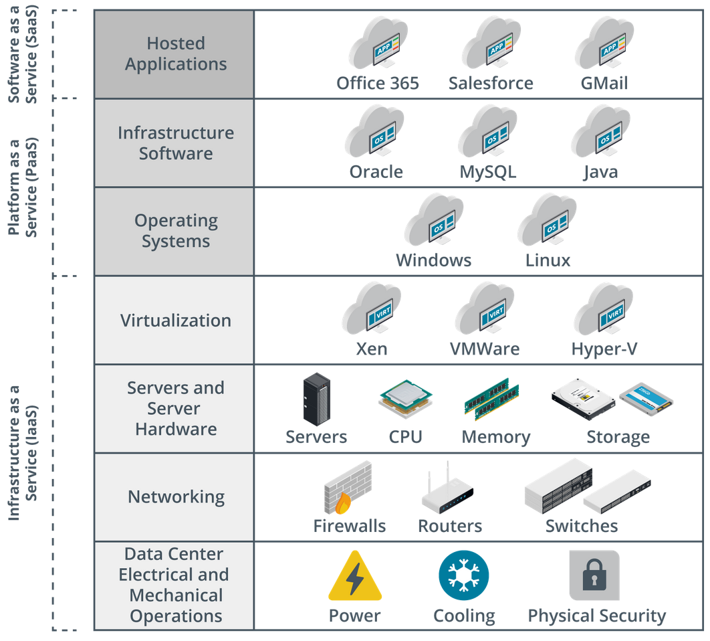
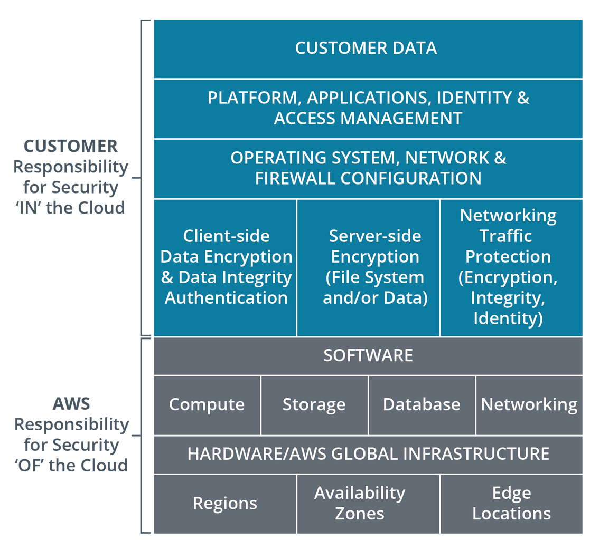
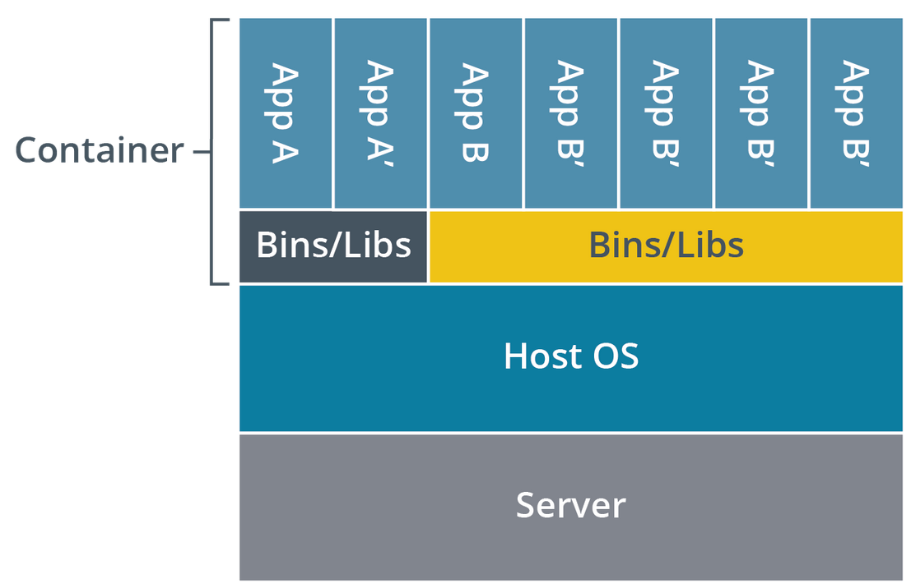
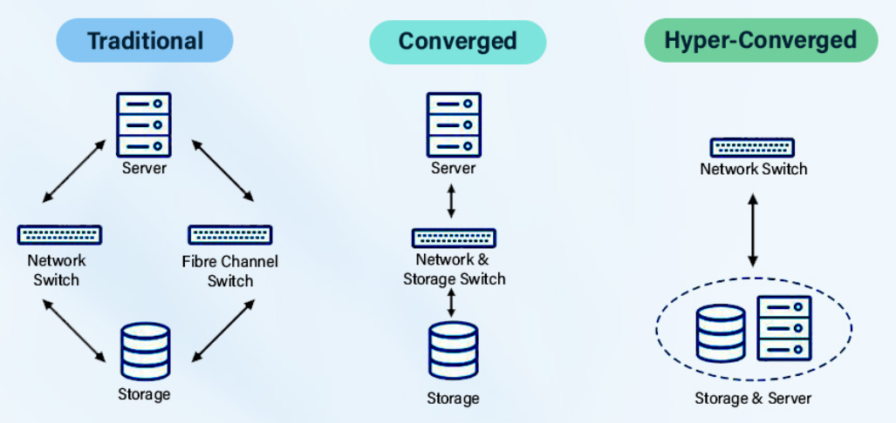

# WGU D318 Cloud Applications CompTIA Cloud+ CV0-003 Exam Objectives

## Tips

- <https://www.youtube.com/playlist?list=PLOYQCApvKhV1K2_jtzPVsPCnEv87piiw5>
- <https://www.reddit.com/r/WGU/comments/10dlfyy/comptia_cloud_cv0003_passed/>
- <https://www.reddit.com/r/CompTIA/comments/136zie0/cloud_cvo003_resources_and_review/>
- [linkedIn cloud+ videos](https://www.linkedin.com/learning/paths/prepare-for-the-comptia-cloud-plus-cv0-003-exam?u=2045532)
- [generic cloud resource](https://github.com/cloud-master-io/cloud-master-io)
- [cloud+ notes](https://dushanthas.github.io/CompTIA-Cloud-plus-notes/)
- [cloud+ pbq](https://wyzguyscybersecurity.com/study-tips-for-comptia-cloud-cv0-003-exam/)
- Passing score: 750 (on a scale of 100—900)
  - Min Passing score: 75%
  - Min questions correct: 65 of 80 + 10(do not count towards score).

| Domain                            | Percentage of Exam |
| --------------------------------- | ------------------ |
| 1.0 Cloud Architecture and Design | 13%                |
| 2.0 Security                      | 20%                |
| 3.0 Deployment                    | 23%                |
| 4.0 Operations and Support        | 22%                |
| 5.0 Troubleshooting               | 22%                |
| Total                             | 100%               |

## 1.1 Compare and contrast the different types of cloud models

- Public Cloud
  - A public cloud is a cloud computing model where the infrastructure and services are **owned and operated by a third-party provider**, such as **Amazon Web Services (AWS), Microsoft Azure, or Google Cloud Platform (GCP)**. Users can access these resources over the internet and pay for them on a pay-as-you-go basis.
- Private Cloud
  - A private cloud is a cloud computing model where the infrastructure and services are **dedicated to a single organization**. (GovCloud).
  - Private clouds can be hosted on-premises or in a colocation facility.
  - private clouds offer **exclusive access and control over all hardware, software, and data**. This allows organizations to benefit from the flexibility and scalability of cloud computing while maintaining a high level of security and privacy.
- Hybrid Cloud
  - A hybrid cloud is a combination of **public and private clouds**. This allows organizations to leverage the benefits of both models, such as the **scalability and elasticity of public clouds** and the **security and control of private clouds**.
- Community Cloud
  - A community cloud is a cloud computing model where the **infrastructure and services are shared by a group** of organizations with common interests or needs.
  - Community cloud is shared by just the organizations and not open to the public.
- Cloud within a Cloud or Virtual Private Cloud (VPC)
  - A cloud within a cloud is a cloud computing model where resources are provisioned from a **public cloud provider but are then isolated and managed as a private cloud**.
  - Unshared by default and not accessible to other customers.
  - Enables customers to have **single tenancy within a multi-tenant infrastructure**.
- Multicloud
  - Multicloud is the practice of **using multiple cloud computing services from different providers**. This can help organizations **avoid vendor lock-in** and take advantage of the best features and services from each provider.
  - Multi-cloud deployments **reduce reliance on a single vendor**, provide greater service flexibility and choice, **permit improved geographic control of data**, and help manage disaster mitigation.
- Multitenancy
  - Multitenancy is a cloud computing model where the **infrastructure and services are shared by multiple organizations**. This allows the provider to provide economies of scale and reduce the cost for users.
- Infrastructure as a Service (IaaS)

  - IaaS provides users with on-demand access to virtualized **computing resources**, such as servers, storage, and networking. Users have **full control over the operating system**, applications, and data that run on these resources.
  - The CSP manages hardware failures, firmware updates, device drivers, and hardware compatibility.
  - 

  | Platform | Cloud Provider Includes                                     |
  | -------- | ----------------------------------------------------------- |
  | IaaS     | physical hardware + hardware management software            |
  | PaaS     | IaaS + OS + app development environment(java, python, node) |
  | SaaS     | PaaS + complete app. You bring your data                    |
  | DaaS     | SaaS + desktop virtualization(VDI) software, thin clients   |

- Platform as a Service (PaaS)

  - PaaS **provides users with a platform** for developing, deploying, and managing applications. Users do not have to worry about managing the underlying infrastructure, such as servers and storage.
  - 

  | Platform | Cloud Provider Includes                                     |
  | -------- | ----------------------------------------------------------- |
  | IaaS     | physical hardware + hardware management software            |
  | PaaS     | IaaS + OS + app development environment(java, python, node) |
  | SaaS     | PaaS + complete app. You bring your data                    |
  | DaaS     | SaaS + desktop virtualization(VDI) software, thin clients   |

- Software as a Service (SaaS)

  - SaaS provides users with access to **applications** that are hosted and managed by the provider. Users typically access these applications through a web browser or mobile app.
  - Responsibility for the hardware where that software runs, the operating system upon which it runs, and the installation and patching of the software itself are all offloaded to the CSP.
  - ex.. Office 365, Salesforce, Gmail, Dropbox, Netflix...
  - 

  | Platform | Cloud Provider Includes                                     |
  | -------- | ----------------------------------------------------------- |
  | IaaS     | physical hardware + hardware management software            |
  | PaaS     | IaaS + OS + app development environment(java, python, node) |
  | SaaS     | PaaS + complete app. You bring your data                    |
  | DaaS     | SaaS + desktop virtualization(VDI) software, thin clients   |

- Internet of Things (IoT)
  - IoT is the network of physical devices that are embedded with sensors, software, and **network connectivity**, which allows them to collect and exchange data.
- Serverless
  - Serverless computing is a cloud computing model in which the **provider manages the servers and infrastructure that run applications**. Users simply write the code and the provider takes care of the rest.
- Machine Learning/Artificial Intelligence (AI)
  - Machine learning and artificial intelligence are technologies that allow **computers to learn and make decisions without being explicitly programmed**.
  - AI **simulates human intelligence** by providing structured, semi-structured, and unstructured data and solving complex problems. AI accomplishes this by using a set of rules to manage its analysis.
  - Machine Learning (ML) is a subset of AI. The goal of ML is to **make accurate predictions** by extracting data based on learned information and experience. ML systems are not explicitly programmed to find a particular outcome. Instead, they are programmed to learn from provided data and then make accurate decisions based on what they’ve learned.
- Shared Responsibility Model
  - The shared responsibility model is a cloud computing model where the **provider and the user share responsibility for security and compliance**.
  - The **CSP is responsible for securing the underlying infrastructure**. CSPs will typically provide **physical security** for the datacenter as well as **isolate data** between customers.
  - The **Cloud consumers are responsible for the direct user access security for their own data**.
  - 

## 1.2 Explain the factors that contribute to capacity planning

- Capacity Planning Hardware:
  - **EndUser**
    - Access from any device.
  - **Business**
    - Hardware requirements specify the physical infrastructure needed to support the project. This includes servers, storage, networking equipment, ect.
    - Internet throughput/speed.
    - Hardware Scalability.
    - Compatibility with cloud platforms and operating systems.
- Capacity Planning Software:
  - Software requirements encompass various software components, which may include off-the-shelf products, custom software, security software, auditing tools, and more.
    - Licensing requirements and costs.
  - Compatibility with the chosen cloud platform and hardware.
- Capacity Planning Budgetary:
  - Estimated costs for hardware, software, cloud services, and ongoing maintenance.
    - Include development budget, operational budget, and security budget, taking into account costs for creating, maintaining, and securing the product or system.
  - Cost of subscriptions.
  - Cost of scaling resources.
  - Budget allocation for different components of the cloud environment.
- Capacity Planning Business need analysis:
  - Identifying the business objectives and challenges that the cloud solution will address.
  - Aligning the cloud strategy with business goals and priorities.
- Capacity Planning Standard Templates:
  - Pre-configured cloud environments with specific configurations for common use cases.
  - Can be used to quickly deploy applications and services in the cloud.
  - Examples include web servers, databases, and development environments.
- Capacity Planning Per-user Licensing
  - Charges based on the number of users accessing the cloud service.
- Capacity Planning Socket-based Licensing
  - Charges based on the number of active connections to the cloud service.
- Capacity Planning Volume-based Licensing
  - Charges based on the amount of data stored or processed in the cloud.
- Capacity Planning Core-based Licensing
  - Charges based on the number of CPU cores used by the cloud service.
- Capacity Planning Subscription Licensing
  - Fixed monthly or annual fee for access to the cloud service with specific limitations.
  - This payment model uses a recurring, periodic billing cycle.
  - The model usually includes no long-term contracts.
- Capacity Planning User Density
  - The number of users accessing the cloud environment at a given time.
  - Used to determine the required amount of resources and performance capacity.
- Capacity Planning System Load
  - The amount of work being done by the cloud environment at a given time.
  - Measured by factors like CPU utilization, memory usage, and disk I/O.
- Capacity Planning Trend Analysis
  - Studying historical data to identify patterns and predict future trends in resource usage, performance, and costs.
  - Used to optimize resource allocation and budget planning.
- Capacity Planning Baselines
  - A reference point for comparing current performance and resource usage.
  - Established during initial deployment or after a period of stable operation.
- Capacity Planning Patterns
  - Recurring trends in resource usage or system behavior.
  - Can be used to identify potential bottlenecks and predict future demands.
- Capacity Planning Anomalies
  - Deviations from normal patterns that may indicate a problem or an opportunity.
  - Need to be investigated to identify the root cause and take corrective action.
- Capacity Planning Performance Capacity Planning
  - Predicting future resource needs and ensuring that the cloud environment can meet them.
  - Involves analyzing trends, forecasting future workloads, and optimizing resource allocation.

## 1.3 Explain the importance of high availability and scaling in cloud environments

- Explain the importance of high availability and scaling in cloud environments?
  - High availability and scaling are two fundamental pillars of a robust and efficient cloud environment. They are critical for ensuring continuous operation, meeting fluctuating demands, and delivering a seamless user experience.
  - High Availability: Minimizing downtime and service disruptions.
  - Scalability: Adapting to changing workloads and demands efficiently.
  - Cost optimization: Utilizing resources effectively and avoiding unnecessary costs.
  - Enhanced user experience: Delivering consistent and reliable performance.
- High Availability and Scaling in Hypervisors
  - Hypervisors are software programs that create and manage virtual machines (VMs) on a single physical server. They play a crucial role in achieving high availability and scalability.
- High Availability and Scaling in Affinity
  - Ensures that VMs with specific dependencies are placed on the same physical server. This improves performance and reduces latency.
- High Availability and Scaling in Anti-affinity
  - Distributes VMs across different physical servers to prevent a single hardware failure from impacting multiple VMs.
- High Availability and Scaling in Oversubscription
  - Oversubscription allows cloud providers to allocate more resources (CPU, RAM, storage) than the physical server has available. This can be effective for workloads with variable resource demands and improves overall utilization. However, it can also lead to performance issues if resources become overcommitted.
- High Availability and Scaling in Compute oversubscription
  - Sharing CPU cores among multiple VMs.
- High Availability and Scaling in Network oversubscription
  - Sharing network bandwidth among multiple VMs.
- High Availability and Scaling in Storage oversubscription
  - Sharing storage capacity among multiple VMs.
- High Availability and Scaling in Regions and Zones
  - Cloud providers offer services across multiple geographically distributed regions and zones. This provides redundancy and ensures that applications are available even if there is an outage in one region.
  - Geographically distinct areas with multiple data centers.
  - Zones: Fault-tolerant locations within a region.
- High Availability and Scaling in Applications
  - High availability for applications requires replicating them across multiple servers and regions. This ensures that if one instance fails, another can seamlessly take over.
- High Availability and Scaling in Containers
  - Containerization is a form of virtualization, but it is significantly different than VMs. **Containers virtualize at the OS layer**, rather than the hardware layer.
  - A container holds a **single application and everything it needs to run**.
  - Containers are lightweight and portable units of software that share an operating system kernel. They are becoming increasingly popular in cloud environments due to their fast startup times and resource efficiency.
  - Containerization: Packaging applications and their dependencies into containers.
  - Container orchestration: Managing the deployment, scaling, and networking of containers.
  - 
- High Availability and Scaling in Clusters
  - Clusters are groups of interconnected servers that work together to provide shared resources and services. They are fundamental for scaling applications and workloads horizontally.
- High Availability and Scaling of network functions
  - Ensuring continuous availability of network services like switches, routers, load balancers, and firewalls.
- High Availability and Scaling in Avoiding single points of failure
  - Eliminating single points of failure in the infrastructure to prevent outages.
- High Availability and Scaling in Scalability
  - Scalability refers to a system's ability to adapt to changing demands by increasing or decreasing resources. Different scaling approaches are available:
- High Availability and Scaling in Auto-scaling
  - Automatically adjusts resources based on predefined metrics.
- High Availability and Scaling in Horizontal scaling
  - Adding or removing VMs or containers to a cluster.
- High Availability and Scaling in Vertical scaling
  - Upgrading resources (CPU, RAM) of existing VMs or containers.
- High Availability and Scaling in Cloud bursting
  - Bursting workloads to the public cloud during peak demand.

## 1.4 Given a scenario, analyze the solution design in support of the business requirements

- Requirement analysis for Software
  - [Certmaster Cloud+](https://learn.comptia.org/app/certmaster-learn-for-cloud-exam-cv0-003#read/section/understand-business-requirements-analysis)
  - What software applications and platforms are included in the solution?
  - Compatibility with existing systems and applications.
  - Meets functional and technical requirements.
  - Scalability to accommodate future growth.
  - Availability of support and maintenance.
- Requirement analysis for Hardware
  - **Users**
    - Access from any device
  - **Business**
    - Reliable and fast Internet connectivity
    - Constructing and supporting a datacenter for private and hybrid cloud deployments
    - Specialized hardware that cloud services cannot provide, such as industrial or manufacturing equipment
    - Hardware scalability by the CSP
    - Reliability of the CSP's hardware
    -
  - What hardware infrastructure is required?
  - Sufficient capacity to meet performance and scalability needs.
  - High availability and redundancy to minimize downtime.
  - Security features to protect against cyber threats.
  - Cost-effectiveness and energy efficiency.
- Requirement analysis for Integration
  - How will the solution integrate with existing systems and applications?
  - Seamless integration with minimal disruption to ongoing operations.
  - Efficient exchange of data and information between systems.
  - Standardized interfaces and protocols.
- Requirement analysis for Budgetary
  - Cost-effective solution that aligns with financial constraints.
  - Clear and transparent pricing model.
  - Return on investment (ROI) analysis.
- Requirement analysis for Compliance
  - Adherence to all relevant **industry regulations** and standards.
    - Security and **data privacy compliance**.
    - Industry requirements (such as HIPAA, PCI DSS, and PII).
    - Regular **audits** and assessments.
  - CSP certificates of compliance.
- Requirement analysis for Service-Level Agreement (SLA)
  - Guarantees a certain level of service availability and performance.
  - Clearly defined metrics and service level objectives (SLOs).
  - Compensation for breaches of the SLA.
- Requirement analysis for User and business needs
  - Meets the specific needs and requirements of the users and the business.
  - User-friendly and intuitive interface.
  - Accessibility and inclusivity.
- Requirement analysis for Security
  - Robust security measures to protect against cyber threats.
  - Regular vulnerability scanning and penetration testing.
  - Secure data encryption and access controls.
- Requirement analysis for Network requirements.
  - Reliable and secure network infrastructure.
  - High-bandwidth connectivity to support data flow.
  - Scalability to accommodate future growth.
- Requirement analysis for Network Sizing.
  - Appropriate infrastructure sizing to meet current and future needs.
  - Resource utilization monitoring and optimization.
  - Scalable architecture to adapt to changing demands.
- Requirement analysis for Network Routing.
  - Optimal routing configuration for efficient data flow.
  - Minimization of latency and network congestion.
  - Load balancing across multiple paths.
- Development Environments
  - Environment for developers to design, build, and test the solution.
- Quality Assurance (QA) Environments
  - Environment for testing the functionality and performance of the solution.
- Staging Environments
  - Environment for simulating production conditions and testing the solution with real-world data.
- Blue-green Environments
  - Deployment strategy where the new version of the solution is deployed alongside the existing version and then switched over to once verified.
- Production Environments
  - Environment where the solution is deployed and used by end users.
- Disaster Recovery (DR) Environments
  - Backup and recovery infrastructure to ensure business continuity in case of an outage.
- Testing Techniques Vulnerability testing
  - Identifies weaknesses in the solution that could be exploited by attackers.
- Testing Techniques Penetration testing
  - Simulates real-world attacks to test the effectiveness of the security measures.
- Testing Techniques Performance testing
  - Measures the responsiveness and scalability of the solution under load.
- Testing Techniques Regression testing
  - Ensures that new changes haven't introduced any regressions or bugs.
- Testing Techniques Functional testing
  - Tests the functionality of the solution against specified requirements.
- Testing Techniques Usability testing
  - Assesses how easy and intuitive the solution is for users to interact with.

## 2.1 Given a scenario, configure identity and access management

- Why are Identification and authorization fundamental Security for controlling access to resources and ensuring data integrity in cloud environments?
  - Identification:
    - The process of verifying the identity of a user or system attempting to access resources.
    - Common methods include usernames, passwords, multi-factor authentication (MFA), biometrics, and Security Assertion Markup Language (SAML).
  - Authorization:
    - The process of determining what resources a user or system is allowed to access and what actions they are permitted to perform.
    - Based on user roles, permissions, and access control lists (ACLs).
- Privileged access management (PAM) Security?
  - Focuses on securing privileged accounts with elevated access to sensitive systems and data.
  - Utilizes techniques like least privilege, password vaulting, and session recording.
- Logical access management (LAM) Security?
  - Manages user access to applications, systems, and data across the cloud environment.
  - Leverages centralized directories and single sign-on (SSO) for seamless access.
- Account life-cycle management Best Practices?
  - Governs the creation, use, and termination of user accounts throughout their lifecycle.
  - Automates tasks like provisioning, deprovisioning, and password resets.
- Provision and deprovision accounts best practices?
  - Creating and removing user accounts as needed.
  - Automating account creation based on predefined roles and workflows.
- Describe Role-based access control (RBAC)
  - Grants access based on predefined roles and associated permissions.
- Describe Discretionary access control (DAC)
  - Allows users to control access to their own resources.
- Describe Non-discretionary access control (N-DAC)
  - Access controlled by an administrator or system based on rules and policies.
- Describe Mandatory access control (MAC)
  - Access determined by a central authority and enforced by the system.
- Benefits of robust identification and authorization
  - Increased security: Reduces the risk of unauthorized access and data breaches.
  - Improved compliance: Helps meet regulatory requirements and industry standards.
  - Enhanced user experience: Provides seamless and secure access to resources.
  - Reduced costs: Automates tasks and minimizes manual effort.
- Security Services in Cloud Environments: Directory services?
  - Store and manage information about users, groups, devices, and other resources.
  - Enable centralized authentication and authorization.
  - Examples include Active Directory, OpenLDAP, and Azure AD.
- Security Services in Cloud Environments: Lightweight Directory Access Protocol (LDAP)
  - An industry-standard protocol for accessing and managing directory services.
  - Provides a flexible and interoperable way to authenticate users and control access to resources.
- Security Services in Cloud Environments: Federation
  - Allows users to access multiple applications and services using a single set of credentials.
  - Simplifies user management and reduces password fatigue.
  - Examples include SAML and OpenID Connect.
- Security Services in Cloud Environments: Certificate management
  - Securely generates, issues, and manages digital certificates for authentication and encryption.
  - Provides trust and integrity for secure communication.
  - Examples include Let's Encrypt and AWS Certificate Manager.
- Security Services in Cloud Environments: Multifactor authentication (MFA)
  - Requires an additional factor beyond a password to verify user identity.
  - Increases security and reduces the risk of unauthorized access.
  - Examples include SMS codes, push notifications, and hardware tokens.
- Security Services in Cloud Environments: Single sign-on (SSO)
  - Allows users to authenticate once and access multiple applications without re-entering their credentials.
  - Improves user experience and reduces password fatigue.
  - Examples include Okta, Azure AD Connect, and Ping Identity.
- Security Services in Cloud Environments: Security Assertion Markup Language (SAML)
  - An open standard for exchanging authentication and authorization information.
  - Enables single sign-on and federation between different systems.
- Security Services in Cloud Environments: Public key infrastructure (PKI)
  - Framework for issuing, managing, and using digital certificates.
  - Provides secure communication and strengthens authentication.
  - Examples include OpenSSL and Microsoft Certificate Services.
- Security Services in Cloud Environments: Secret management
  - Securely stores and manages sensitive information like passwords, API keys, and encryption keys.
  - Ensures confidentiality and integrity of sensitive data.
  - Examples include HashiCorp Vault and AWS Secrets Manager.
- Security Services in Cloud Environments: Key management
  - Manages the lifecycle of encryption keys used for data protection.
  - Provides secure storage, rotation, and access control for encryption keys.
  - Examples include AWS Key Management Service (KMS) and Azure Key Vault.
- Benefits of utilizing Security Services in Cloud Environments
  - Improved security: Reduces the risk of unauthorized access and data breaches.
  - Enhanced user experience: Provides seamless and secure access to various applications and resources.
  - Reduced costs: Automates tasks and minimizes manual effort.
  - Increased compliance: Helps meet regulatory requirements and industry standards.

## 2.2 Given a scenario, secure a network in a cloud environment

- Secure a Network in a Cloud Environment: Network Segmentation:
  - Limit blast radius: A security breach in one segment is contained and doesn't impact others.
  - Granular access control: Define specific access rules for each segment.
  - Improved resource utilization: Optimize resource allocation within each segment.
- Virtual LAN (VLAN)/Virtual Extensible LAN (VXLAN)/Generic Network Virtualization Encapsulation (GENEVE)
  - Create logically separate networks within a shared physical network.
- Secure a Network in a Cloud Environment: Micro-segmentation
  - Further subdivide networks based on workload or security needs.
- Secure a Network in a Cloud Environment: Tiering:
  - Organize network resources into layers based on function (e.g., public, private, DMZ).
- Explain Domain Name Service (DNS)
  - Resolves domain names to IP addresses.
- Secure a Network in a Cloud Environment: DNS over HTTPS (DoH)/DNS over TLS (DoT)
  - Securely encrypts communication between clients and DNS resolvers.
- Secure a Network in a Cloud Environment: DNS Security (DNSSEC)
  - Cryptographically verifies the authenticity and integrity of DNS responses.
- Secure a Network in a Cloud Environment: Network Time Protocol (NTP)
  - Synchronizes clocks across devices in the network.
- Secure a Network in a Cloud Environment: Network Time Security (NTS)
  - Secures NTP communication against spoofing and manipulation.
- IPSec Encryption
  - Encrypts communication at the IP layer, securing the entire network stack.
- Transport Layer Security (TLS) Encryption
  - Encrypts communication between applications, protecting data in transit.
- Hypertext Transfer Protocol Secure (HTTPS) Encryption
  - Secures communication between web browsers and servers.
- What Advantages do you have with Data Encryption Techniques?
  - Protecting data confidentiality: Ensuring information remains private and only accessible to authorized entities.
  - Guaranteeing data integrity: Preventing unauthorized modification of data during transmission.
  - Providing data authenticity: Verifying the origin and identity of data.
- Tunneling
  - Tunneling encapsulates data within another protocol, creating a secure channel for communication.
  - Tunneling provides the following benefits:
    - Secure communication: Protects data from eavesdropping and manipulation.
    - Access control: Restricts access to specific resources and networks.
    - Network extension: Enables secure connections between geographically dispersed locations.
- Secure Shell (SSH)
  - Encrypts communication between devices for secure remote access and file transfer.
- Layer 2 Tunneling Protocol (L2TP)/Point-to-Point Tunneling Protocol (PPTP)
  - Create virtual tunnels over IP networks for remote access and site-to-site connections.
- Generic Routing Encapsulation (GRE)
  - Encapsulates datagrams within IP packets for routing through different networks.
- Secure a Network in a Cloud Environment: Firewalls
  - Filter network traffic based on predefined rules and access control lists (ACLs).
- Secure a Network in a Cloud Environment: Stateful firewalls
  - Monitor and analyze traffic flow to identify and prevent suspicious activity.
- Secure a Network in a Cloud Environment: Stateless firewalls
  - Filter traffic based on individual packets without considering state information.
- Secure a Network in a Cloud Environment: Web Application Firewall (WAF)
  - Protects web applications from common attacks like SQL injection and cross-site scripting.
- Secure a Network in a Cloud Environment: Application Delivery Controller (ADC)
  - Load balances traffic across multiple servers and provides additional security features like URL filtering and denial-of-service (DoS) protection.
- Secure a Network in a Cloud Environment: Intrusion Protection System (IPS)/Intrusion Detection System (IDS)
  - Monitors network traffic for malicious activity and prevents or alerts on detected threats.
- Secure a Network in a Cloud Environment: Data Loss Prevention (DLP)
  - Identifies and prevents sensitive data from being leaked or exfiltrated from the network.
- Secure a Network in a Cloud Environment: Network Access Control (NAC)
  - Grants or denies network access based on device compliance with security policies.
- Secure a Network in a Cloud Environment: Packet brokers
  - Mirror network traffic to security and monitoring tools for analysis and troubleshooting.
- Secure a Network in a Cloud Environment: Implementation considerations
  - Choose appropriate tunneling protocols based on security requirements and network topology.
  - Deploy necessary network services based on specific security needs and workload characteristics.
  - Configure and manage network services effectively to ensure optimal performance and security.
  - Monitor network activity for suspicious behavior and proactively address potential threats.
  - Regularly update network services and security policies to keep pace with evolving threats and vulnerabilities.
- Secure a Network in a Cloud Environment: Log and Event Monitoring
  - Proactively identify and address security incidents by monitoring logs and events generated by various systems and applications.
  - Utilize tools like Security Information and Event Management (SIEM) to collect, analyze, and correlate events across the cloud environment.
  - Monitor for suspicious activity like unauthorized access attempts, malware infections, and system vulnerabilities.
  - Set up alerts to notify administrators of potential security issues promptly.
  - System logs: Track system activity and identify potential issues.
  - Application logs: Monitor application behavior and detect errors or anomalies.
  - Security logs: Capture security events and identify suspicious activity.
  - Network logs: Track network traffic and identify unusual patterns.
- Secure a Network in a Cloud Environment: Network Flows
  - Monitor and analyze network traffic patterns to detect anomalous behavior and identify potential threats.
  - Use tools like network flow analysis (NFA) to track data flow across the network and identify bottlenecks or suspicious activity.
  - Correlate network flow data with other security data sources to gain deeper insights into threats and security posture.
  - Disabling unnecessary ports and services: Reduces the attack surface and minimizes potential vulnerabilities.
  - Disabling weak protocols and ciphers: Uses only strong cryptographic algorithms for secure communication.
  - Firmware upgrades: Applies latest firmware updates to address vulnerabilities and improve security posture.
  - Controlling ingress and egress traffic: Restricts inbound and outbound traffic based on security policies.
- Secure a Network in a Cloud Environment: Hardening and Configuration Management:
  - Implement security best practices by hardening operating systems, applications, and cloud services.
  - Disable unnecessary ports and services to minimize attack surfaces.
  - Disallow weak protocols and ciphers that are vulnerable to exploits.
  - Regularly update firmware and software to address vulnerabilities.
  - Control ingress and egress traffic using firewalls, access control lists (ACLs), and whitelisting or blacklisting.
  - Implement proxy servers to filter and monitor network traffic.
  - Utilize DDoS protection services to mitigate distributed denial-of-service attacks.

## 2.3 Given a scenario, apply the appropriate OS and application security controls

- Password complexity
  - Enforces strong passwords to reduce the risk of brute-force attacks.
- Account lockout
  - Automatically locks accounts after a certain number of unsuccessful login attempts.
- Application whitelisting
  - Only allows authorized applications to run on systems.
- Software feature restrictions
  - Disables unnecessary features and functionality to reduce the attack surface.
- User/group permissions
  - Grants least privilege access to users and groups based on their roles and needs.
- User Permissions
  - Restrict user access to sensitive data and resources.
  - Implement the principle of least privilege, granting only the minimum access required for users to perform their tasks.
  - Regularly review and update user permissions to ensure they remain appropriate.
- Antivirus/Anti-Malware/Endpoint Detection and Response (EDR)
  - Protects systems from viruses, malware, and other malicious threats.
  - EDR solutions provide real-time visibility and threat detection capabilities.
  - Regularly update antivirus/anti-malware signatures and EDR solutions to stay ahead of evolving threats.
- Host-based Intrusion Detection System (HIDS)/Host-based Intrusion Prevention System (HIPS)
  - Monitors system activity for suspicious behavior and potential security breaches.
  - HIDS detects malicious activity while HIPS actively prevents it.
  - These tools provide valuable insights into system security and can help identify and respond to threats quickly.
- OS and Application Security Controls: Hardened Baselines
  - Standardized configurations for operating systems and applications that meet specific security requirements.
  - Baselines include configurations for:
    - User and group permissions
    - Services and ports
    - Software features
    - Security settings and policies
    - Patching and vulnerability management
- Hardened Baselines Single function
  - Hardened baselines should focus on a single function to avoid unnecessary complexity and vulnerabilities.
- Hardened Baselines File integrity
  - Implement file integrity monitoring to detect and prevent unauthorized changes to critical system files.
- Hardened Baselines Log and event monitoring
  - Monitor system logs and events for suspicious activity and potential security breaches.
- Hardened Baselines Configuration management
  - Use configuration management tools to automate the deployment and enforcement of security settings across all systems.
- Hardening Builds
  - Builds are pre-configured versions of software that include specific software packages and configurations.
- Hardening Stable Builds
  - Stable builds are tested and proven to be reliable and secure, ideal for production environments.
- Hardening Long-term support (LTS) Builds
  - LTS builds receive security updates and patches for several years, providing long-term stability and support.
- Hardening Beta Builds
  - Beta builds offer early access to new features and functionalities but may contain bugs and require additional testing.
- Hardening Canary Builds
  - Canary builds are deployed to a small subset of users to test new features and identify potential issues before a wider rollout.
- OS and Application Security Controls: Operating System (OS) Upgrades
  - Regularly upgrade operating systems to address known vulnerabilities and improve security.
  - Plan and test OS upgrades carefully to avoid disruptions and ensure compatibility with existing applications.
  - Consider using rolling upgrades or blue-green deployments to minimize downtime and risk during upgrades.
- API Endpoint Encryption
  - Protects data in transit between applications and APIs.
  - Common protocols: HTTPS, Transport Layer Security (TLS).
- Application Encryption
  - Safeguards data within applications, databases, and internal communication.
  - Techniques: Field-level encryption, application-level encryption, database encryption.
- OS Encryption
  - Protects data stored on operating system disk drives and volumes.
  - Technologies: BitLocker, FileVault, Linux Unified Key Setup (LUKS).
- Storage Encryption
  - Secures data at rest within cloud storage services.
  - Often provided by cloud providers (e.g., Amazon S3 encryption, Azure Storage Service Encryption).
- Filesystem Encryption
  - Protects data stored on individual filesystems.
  - Options: eCryptfs, TrueCrypt, VeraCrypt.
- Mandatory Access Control (MAC):
  - Enforces a strict security policy that dictates which users or processes can access specific resources.
  - Restricts actions based on security labels assigned to subjects and objects.
  - Prevents unauthorized access to sensitive data, even by privileged users.
  - Examples: SELinux, AppArmor, TrustedBSD.
- Software Firewall:
  - Monitors and filters network traffic at the operating system level.
  - Controls incoming and outgoing connections to protect systems from unauthorized access and intrusions.
  - Can be configured to block specific ports, protocols, or IP addresses.
  - Examples: Windows Firewall, iptables (Linux), PF (FreeBSD).

## 2.4 Given a scenario, apply data security and compliance controls in cloud environments

- Data Security in Cloud Environments: Encryption at rest
  - Protects data stored on cloud storage and databases.
- Data Security in Cloud Environments: Encryption in transit
  - Secures data transmission between applications, devices, and users.
- Data Security in Cloud Environments: Encryption for sensitive data
  - Applies encryption to specific data fields or entire files containing sensitive information.
- Data Security in Cloud Environments: Key management
  - Utilizes secure key management practices to protect encryption keys and prevent unauthorized decryption.
- Data Security in Cloud Environments: Integrity
  - Ensures data remains unaltered and trustworthy.
  - Utilizes hashing algorithms like SHA-256 or MD5 to generate unique digital fingerprints of data.
  - Digital signatures provide additional verification of data origin and authenticity.
  - File integrity monitoring (FIM) tracks and alerts on unauthorized changes to critical data files.
- Data Security in Cloud Environments: Hashing algorithms
  - Generate unique digital fingerprints of data to detect unauthorized changes.
- Data Security in Cloud Environments: Digital signatures
  - Cryptographically verify the authenticity and integrity of data origin.
- Data Security in Cloud Environments: File integrity monitoring (FIM)
  - Continuously monitors files for modifications and alerts on unauthorized changes.
- Data Security in Cloud Environments: Classification
  - Categorizes data based on its sensitivity and security requirements.
  - Helps prioritize security controls and access restrictions based on data classification.
  - Typical classifications: Public, Internal, Confidential, Highly Confidential.
- Data Security in Cloud Environments: Segmentation
  - Divides cloud environments into logically separated segments to isolate and protect sensitive data.
  - Utilizes network segmentation, virtual networks, and storage segmentation techniques.
  - Limits the blast radius of potential security breaches.
  - Limiting access to specific segments based on user roles and permissions.
- Data Security in Cloud Environments: Access Control
  - Implements granular access controls to restrict data access to authorized users and applications.
  - Utilizes authentication, authorization, and accounting (AAA) mechanisms.
  - Utilizing methods like multi-factor authentication (MFA) and single sign-on (SSO) to enhance access control.
  - Enforces the principle of least privilege, granting only the minimum access required for specific tasks.
  - Regularly reviewing and updating access control policies and procedures.
- Data Security in Cloud Environments: Impact of Laws and Regulations:
  - legal hold: preserve relevant data for legal or regulatory purposes.
  - data residency restrictions: adhering to relevant laws and regulations governing data privacy and security like GDPR, HIPAA, CCPA, etc.
- Data Security in Cloud Environments: Legal Hold
  - Preserves data that may be relevant to legal proceedings or regulatory investigations.
  - Requires implementing mechanisms to prevent modification, deletion, or destruction of such data.
- Data Security in Cloud Environments: Records Management
  - Implementing a robust records management program for data retention, versioning, and destruction.
  - Defining clear policies for document retention periods based on regulatory requirements and business needs.
  - Utilizing data lifecycle management solutions to automate recordkeeping processes.
  - Implementing Write Once Read Many (WORM) storage for specific data types that require immutability.
- Data Security in Cloud Environments: Data Loss Prevention (DLP)
  - Identifying and preventing sensitive data from being exfiltrated or leaked from the cloud environment.
  - Implementing DLP tools to monitor data movement and enforce security policies.
  - Regularly reviewing and updating DLP policies to adapt to evolving threats and data sensitivity requirements.
- Data Security in Cloud Environments: Cloud Access Security Broker (CASB):
  - CASBs act as intermediaries between cloud applications and users, providing additional security and compliance controls.
  - CASBs offer features like data encryption, access control, threat detection, and compliance reporting.
  - Implementing a CASB can help organizations gain greater visibility and control over their cloud data and applications.
- Data Security in Cloud Environments: Effective Implementation:
  - Conduct regular risk assessments to identify and prioritize security risks.
  - Develop a comprehensive data security and compliance strategy.
  - Implement appropriate security controls based on data classification and compliance requirements.
  - Regularly monitor and audit data security controls to ensure their effectiveness.
  - Train employees on data security policies and procedures.
  - Stay informed about evolving threat landscape and adapt security controls accordingly.

## 2.5 Given a scenario, implement measures to meet security requirements

- Implementing Measures to Meet Security Requirements in Cloud Environments Vulnerability Scanners
  - Identify known vulnerabilities in systems and applications.
  - Examples: Nessus, Qualys, OpenVAS.
- Implementing Measures to Meet Security Requirements in Cloud Environments: Port Scanners
  - Discover open ports and potential vulnerabilities in network services.
  - Examples: Nmap, Zenmap, Angry IP Scanner.
- Default and Common Credential Scans Vulnerability Assessment
  - Attempt logins using commonly used or default credentials.
- Credentialed Scans Vulnerability Assessment
  - Authenticate to systems to conduct deeper vulnerability probes.
- Network-Based Scans Vulnerability Assessment
  - Assess vulnerabilities from a network perspective.
- Agent-Based Scans Vulnerability Assessment
  - Use software agents installed on systems for more comprehensive scanning.
- Service Availabilities Vulnerability Assessment
  - Scan for services that should not be accessible publicly.
- Hot Fixes Security Patches
  - Address critical vulnerabilities urgently.
- Scheduled Updates Security Patches
  - Regularly apply security patches from vendors.
- Virtual Security Patches
  - Mitigate vulnerabilities without direct system modification.
- Signature Updates Security Patches
  - Update security tools to detect new threats.
- Rollups Security Patches
  - Bundle multiple patches for efficient deployment.
- Implementing Measures to Meet Security Requirements in Cloud Environments: Risk Register
  - Maintain a comprehensive record of identified vulnerabilities, their associated risks, and planned mitigation strategies.
  - Prioritize vulnerabilities based on their severity, exploitability, and potential impact on business operations.
- Implementing Measures to Meet Security Requirements in Cloud Environments: Prioritization of Patch Application
  - Prioritize patching critical vulnerabilities first, followed by high-risk and moderate-risk vulnerabilities.
  - Consider the impact of patching on system stability and availability when prioritizing patch application.
- Implementing Measures to Meet Security Requirements in Cloud Environments: Deactivate Default Accounts
  - Disable default or unused accounts to prevent unauthorized access.
  - Implement strong password policies and require multi-factor authentication for all administrative accounts.
- Impacts of Security Tools on Systems and Services
  - Carefully consider potential performance impacts and compatibility issues before deploying security tools.
  - Configure security tools to minimize resource consumption and optimize performance.
  - Conduct performance testing to assess the impact of security tools on critical systems and services.
- Effects of Cloud Service Models on Security Implementation
  - Understand the shared responsibility model for each cloud service model (SaaS, PaaS, IaaS) to ensure appropriate security measures are implemented by both the cloud provider and the customer.
  - Leverage cloud provider security features and services to enhance overall security posture.
  - Implement additional security controls and configurations specific to the chosen cloud service model.

## 2.6 Explain the importance of incident response procedures

Preparation:

- Incident Response Documentation
  - Well-documented procedures, policies, and contact information ensure everyone involved knows what to do when an incident strikes. Clear documentation reduces confusion, delays, and potential errors during a crisis.
- Incident Response Call Trees
  - Pre-defined call trees establish clear communication channels, ensuring timely notification of key personnel based on their roles and responsibilities. This ensures that the right people are informed at the right time, allowing for quicker decision-making and response initiation.
- Incident Response Training
  - Regular training for all personnel involved in incident response builds awareness, knowledge, and skills. This empowers individuals to recognize potential threats, understand their roles, and take appropriate actions during an incident.
- Incident Response Tabletop Exercises
  - Simulated incident scenarios allow teams to test their response plan in a controlled environment. This helps identify weaknesses in the plan, uncover potential communication gaps, and enhance overall preparedness before a real incident occurs.
- Incident Response Documented Incident Types/Categories
  - Categorizing potential incidents based on severity and impact enables a more tailored response. This allows teams to prioritize resources and allocate them effectively based on the nature and scope of the incident.
- Incident Response Roles and Responsibilities
  - Clearly defining roles and responsibilities eliminates confusion and ensures everyone understands their assigned tasks during an incident. This promotes accountability, avoids duplication of efforts, and facilitates smoother coordination throughout the response process.
- Incident Response Procedures: Identification
  - Early recognition of an incident is crucial to minimize damage and initiate a timely response. Establishing clear indicators of compromise and monitoring systems for suspicious activity helps identify potential threats quickly.
- Incident Response Procedures: Scope
  - Determining the scope of the incident involves assessing the affected systems and data, identifying the root cause, and understanding the potential impact on business operations. This enables teams to prioritize their efforts and allocate resources efficiently.
- Incident Response Procedures: Investigation
  - A thorough investigation into the incident is essential to understand its origin, root cause, and extent. This involves collecting and analyzing evidence, identifying vulnerabilities exploited by the attackers, and understanding the attackers' tactics, techniques, and procedures (TTPs).
- Incident Response Procedures: Containment, Eradication, and Recovery (CER)
  - These are the core steps of incident response:
    - Incident Response Procedures: Containment
      - Isolating affected systems and data prevents the spread of the incident and limits further damage. This may involve shutting down affected systems, blocking network access, and Quarantining compromised data.
    - Incident Response Procedures: Eradication
      - Eliminating the threat involves removing the malicious software, patching vulnerabilities, and reconfiguring systems to a secure state. This aims to ensure that the threat is fully neutralized and cannot cause further harm.
    - Incident Response Procedures: Recovery
      - Restoring affected systems and data to full functionality is crucial for business continuity. This may involve restoring backups, redeploying systems, and notifying impacted users.
    - Incident Response Procedures: Isolation
    - Isolating affected systems and data prevents the malicious code or attacker from spreading laterally within the network. This helps contain the damage and prevents further compromise of systems and data.
- Incident Response Procedures: Evidence Acquisition
  - Collecting and preserving evidence in a forensically sound manner is essential for investigation and potential legal proceedings. This may involve acquiring system logs, network traffic captures, and memory dumps from affected systems.
- Incident Response Procedures: Chain of Custody
  - Maintaining a documented chain of custody for evidence ensures its integrity and admissibility in legal matters. This involves documenting the collection, storage, and handling of evidence to ensure it has not been tampered with in any way.
- Incident Response Procedures: Post-Incident Review and Lessons Learned
  - Analyzing the incident after it has been resolved is crucial for identifying areas for improvement and updating the incident response plan. This involves reviewing the effectiveness of the response, identifying any gaps or weaknesses, and implementing corrective actions to prevent similar occurrences in the future
- Incident Response Procedures: Root Cause Analysis
  - Identifying the root cause of the incident helps prevent similar occurrences in the future.
  - This involves analyzing the vulnerabilities exploited by the attacker, understanding the attacker's motivations and TTPs, and implementing mitigation strategies to address the root cause.

## 3.1 Given a scenario, integrate components into a cloud solution

- Integrate Components Into a Cloud Solution: File Subscriptions
  - Integrate cloud storage solutions like Dropbox, Google Drive, or OneDrive to provide file synchronization, sharing, and collaboration capabilities across teams and locations. Consider factors like storage capacity, access control features, and integration with other services.
- Integrate Components Into a Cloud Solution: Communications
  - Leverage cloud communication platforms like Zoom, Microsoft Teams, or Slack for unified communication, including video conferencing, voice calls, and instant messaging. Evaluate features like meeting scheduling, screen sharing, and recording functionalities based on your communication needs.
- Integrate Components Into a Cloud Solution: Email
  - Utilize cloud email services like Gmail, Microsoft Exchange Online, or G Suite to ensure reliable and accessible email functionality for your organization. Consider spam filtering, email encryption, and calendar integration features when choosing a provider.
- Integrate Components Into a Cloud Solution: Voice over IP (VoIP)
  - Implement VoIP solutions like Skype for Business, Google Voice, or RingCentral to provide cost-effective and flexible telephony services. Evaluate call quality, feature sets, and integration with existing communication platforms.
- Integrate Components Into a Cloud Solution: Messaging
  - Integrate cloud messaging solutions like Slack, Microsoft Teams, or WhatsApp for instant messaging and collaboration within teams. Choose a platform offering features like file sharing, group chats, and integration with other productivity tools.
- Integrate Components Into a Cloud Solution: Virtual Desktop Infrastructure (VDI)
  - Utilize VDI solutions like Citrix Virtual Apps and Desktops or Microsoft Azure Virtual Desktop to provide virtualized desktops accessible from any device. Consider performance, security features, and cost-effectiveness when choosing a VDI solution.
- Integrate Components Into a Cloud Solution: Directory and Identity Services
  - Integrate cloud directory services like Azure Active Directory or Okta for centralized user management, single sign-on (SSO), and access control across all cloud resources and applications. Evaluate features like multi-factor authentication (MFA), user provisioning, and integration with other cloud services.
- Integrate Components Into Cloud Resources: IaaS (Infrastructure as a Service)
  - Utilize IaaS platforms like AWS EC2, Microsoft Azure VMs, or Google Compute Engine to provision virtual machines, storage, and network resources on-demand. Choose a platform offering flexibility, scalability, and cost-effective pricing models.
- Integrate Components Into Cloud Resources: PaaS (Platform as a Service):
  - Leverage PaaS platforms like AWS Elastic Beanstalk, Azure App Service, or Google App Engine to rapidly deploy and manage applications without managing underlying infrastructure. Evaluate ease of deployment, scalability, and available programming languages when choosing a PaaS platform.
- Integrate Components Into Cloud Resources: SaaS (Software as a Service):
  - Integrate SaaS solutions like Salesforce, Microsoft Office 365, or Google Workspace for readily available software applications and services accessible from any device. Choose a provider offering features, integrations, and pricing plans that align with your organization's needs.
- Cloud Resources Provisioning: Compute
  - Utilize cloud APIs or management tools to provision virtual machines, containers, and serverless functions based on your application's resource requirements. Consider factors like CPU, memory, storage, and networking needs.
- Cloud Resources Provisioning: Storage
  - Choose between various storage options like object storage, block storage, or file storage depending on your data access needs, performance requirements, and cost considerations.
- Cloud Resources Provisioning: Network
  - Configure virtual networks, subnets, and firewalls to secure your cloud environment, manage network traffic flow, and control user access to resources.
- Cloud Resources for Application Deployment: Serverless
  - Utilize serverless platforms like AWS Lambda, Azure Functions, or Google Cloud Functions to deploy code without managing servers or infrastructure. This option is ideal for event-driven applications and simplifies deployment and management.
- Cloud Resources for Application Deployment: Deploying Virtual Machines (VMs) and Custom Images
  - Use pre-built images or create custom images containing specific software and configurations to deploy VMs quickly and consistently. This option provides greater control and flexibility for specific application deployments.
- Cloud Resources for Application Deployment: Templates
  - Leverage OS and solution templates to **simplify deployment** of common configurations and applications. This option saves time and ensures consistency across deployments.
  - Help prevent configuration mistakes.
  - A virtual machine template is a master copy of a virtual machine that usually includes the guest OS, a set of applications, and a specific VM configuration. Virtual machine templates are used when you need to deploy many VMs and ensure that they are **consistent and standardized**.

## 3.2 Given a scenario, provision storage in cloud environments

Types of Cloud Storage:

- Cloud Storage: Block
  - Ideal for virtual machine disks and applications requiring fast, I/O-intensive operations.
- Cloud Storage: Storage Area Network (SAN)
  - Offers centralized management and scalability, perfect for large-scale storage needs. Zoning capabilities enhance security and data isolation.
- Cloud Storage: Storage Area Network (SAN) Zoning
  - SAN zoning is a critical component of managing data access and security within a Storage Area Network (SAN). It allows administrators to logically group storage devices (initiators) and targets (storage arrays) into zones, restricting communication and data access between them.
  - Port-based zoning: Restricts communication between specific ports on initiators and targets. This is the most granular and secure option.
  - WWN-based zoning: Controls communication based on the World Wide Name (WWN) of each device, which is a unique identifier. This offers a more flexible approach than port-based zoning.
  - Group-based zoning: Allows grouping initiators and targets into zones, simplifying configuration and management for large deployments.
  - Fabric-based zoning: Applies zoning rules across the entire fabric, offering a global level of control.
- Cloud Storage: File
  - Enables file sharing and collaboration, ideal for document management and media storage.
- Cloud Storage: Network Attached Storage (NAS)
  - Provides centralized file storage accessible by multiple clients.
- Cloud Storage: Object
  - Cost-effective solution for storing vast amounts of unstructured data like images and archives.
- Cloud Storage: Object Tenancy
  - Multi-tenancy allows sharing of storage resources while maintaining data isolation and security.
- Cloud Storage: Object Buckets
  - Virtual containers within object storage systems used to organize and manage large data volumes.
- Cloud Storage Tiers: Flash
  - Highest performance tier with the fastest access times and lowest latency, ideal for demanding workloads.
- Cloud Storage Tiers: Hybrid
  - Offers a balance of performance and cost by combining flash and spinning disk storage.
- Cloud Storage Tiers: Spinning disks
  - Affordable option for cold storage or less frequently accessed data.
- Cloud Storage Tiers: Long-term
  - Low-cost storage designed for long-term data retention and compliance requirements.
- Cloud Storage Performance Considerations: Input/Output Operations per Second (IOPS)
  - Measures storage performance for applications requiring high throughput.
- Cloud Storage Performance Considerations: Read/Write Ratio
  - Determines the proportion of read and write operations, influencing the choice of storage type.
- Cloud Storage Protocols: Network File System (NFS)
  - Popular choice for file sharing across Unix and Linux systems.
- Cloud Storage Protocols: Common Internet File System (CIFS)
  - Widely used for file sharing between Windows and other operating systems.
- Cloud Storage Protocols: Internet Small Computer System Interface (iSCSI)
  - Block-level storage protocol for accessing storage over IP networks.
- Cloud Storage Protocols: Fibre Channel (FC)
  - High-performance protocol for SAN environments, offering low latency and high throughput.
- Cloud Storage Protocols: Non-Volatile Memory Express over Fabrics (NVMe-oF)
  - Emerging protocol connecting NVMe devices over Ethernet networks for high performance and scalability.
- Cloud Storage Data Redundancy and Protection: RAID 0, 1, 5, 6, 10

  - Employs multiple disks to store data redundantly, ensuring data availability in case of disk failure. Different RAID levels offer varying redundancy and performance levels.
  - Replication: Creates copies of data across different storage locations for disaster recovery and data availability.

  | Raid | Min Drives | Lose | Description                                                                     |
  | ---- | ---------- | ---- | ------------------------------------------------------------------------------- |
  | 0    | 2          | 0    | **Striped**. Splits writes between multiple disk. No redundancy. Fastest        |
  | 1    | 2          | 1    | **Mirrored**. Duplicate write. Full Redundancy. Slowest                         |
  | 5    | 3          | 1    | **Striped with Parity**. Split. XOR Data. fast and redundant                    |
  | 6    | 4          | 2    | **Striped with Double Parity**. fast and high redundancy                        |
  | 10   | 4          | 1    | **Striping + Mirroring**. Fast. Raid 1 within a Raid 0. Best for offsite backup |

  - **Parity**: fault tolerance by calculating data on the two drives and storing results on third. XOR'ing bit from drive 1 with a bit from drive 2. Storing the results on drive 3. Any one drive can fail and be rebuilt from the other two.

| Drive1, Drive2 | XOR Drive3(Parity drive) |
| -------------- | ------------------------ |
| 0, 0           | 0                        |
| 0, 1           | 1                        |
| 1, 0           | 1                        |
| 1, 1           | 0                        |

- Cloud Storage Features: Compression
  - Reduces storage consumption by compressing data.
- Cloud Storage Features: Deduplication
  - Eliminates redundant data copies, saving storage space.
- Cloud Storage Features: Thin Provisioning
  - Allocates storage dynamically based on actual usage, minimizing upfront costs.
- Cloud Storage Features: Thick Provisioning
  - Allocates all storage space upfront, ensuring consistent performance.
- Cloud Storage Features: User Quotas
  - Sets limits on storage usage for individual users or groups.
- Cloud Storage Features: Hyperconverged infrastructure
  - Integrates compute, storage, and networking resources into a single platform for simplified management and scalability.
  - x86 compute + Storage(SSD's) + VM software: emulate multiple VM's for efficient scaling.
  - Cloud-like infrastructure on premises.
  - [Hyperconvergence - Simple Is Beautiful](https://www.youtube.com/watch?v=rxoL-WTNvLc)
  - [Why Hyperconverged Infrastructure is Important? | vSAN](https://www.youtube.com/watch?v=jOewMqQlxo8)
  - 
- Cloud Storage Features: Software-Defined Storage (SDS)
  - Offers flexibility and cost-efficiency by leveraging software to manage storage resources.

## 3.3 Given a scenario, deploy cloud networking solutions

- Why is deploying cloud networking solutions essential?
  - In today's digital world, a robust and scalable cloud network is essential for businesses of all sizes. This network acts as the backbone for communication, collaboration, and data transfer, enabling seamless operation and optimal performance. To achieve this, a strategic approach to deploying various services and technologies is crucial. This expanded response delves deeper into each component, providing a comprehensive understanding of cloud networking solutions:
- Deploying Cloud Networking Solutions Fundamental Services: Dynamic Host Configuration Protocol (DHCP)
  - Assigns IP addresses and network configurations automatically to devices, simplifying network management and ensuring consistent operation.
- Deploying Cloud Networking Solutions Fundamental Services: Network Time Protocol (NTP)
  - Synchronizes clocks across all devices, guaranteeing accurate timekeeping for critical applications and processes.
- Deploying Cloud Networking Solutions Fundamental Services: Domain Name System (DNS)
  - Translates domain names to IP addresses, enabling users to access resources by familiar names instead of cumbersome numerical addresses.
- Deploying Cloud Networking Solutions Fundamental Services: Content Delivery Network (CDN)
  - Distributes content across geographically dispersed servers, optimizing website performance and enhancing user experience, particularly for geographically diverse audiences.
- Deploying Cloud Networking Solutions Fundamental Services: IP Address Management (IPAM)
  - Provides tools and processes for managing and allocating IP addresses effectively within the cloud environment, ensuring efficient utilization and preventing conflicts.
- Deploying Cloud Networking Solutions Secure Communication: Site-to-site VPN
  - Connects two networks, facilitating secure communication and collaboration between geographically dispersed teams or departments.
- Deploying Cloud Networking Solutions Secure Communication: Point-to-point VPN
  - Establishes a secure connection between two individual devices, like a remote user's laptop and the corporate network.
- Deploying Cloud Networking Solutions Secure Communication: Point-to-site VPN
  - Enables remote users to connect securely to the cloud network from any location, fostering flexible work arrangements and enhanced productivity.
- Deploying Cloud Networking Solutions Secure Communication: IPSec
  - A suite of protocols that encrypts data traffic and establishes authentication procedures, ensuring the security and integrity of VPN connections.
- Deploying Cloud Networking Solutions Secure Communication: Multiprotocol Label Switching (MPLS)
  - Directs data traffic across private networks based on predefined labels, offering high performance and reliability for mission-critical applications.
- Deploying Cloud Networking Solutions Virtual Routing: Dynamic and Static Routing
  - Dynamic routing protocols like BGP automatically determine the best path for data traffic, while static routing requires manual configuration for specific routes.
- Deploying Cloud Networking Solutions Virtual Routing: Virtual Network Interface Controller (vNIC)
  - Acts as a virtual network adapter for VMs, enabling their connection to the cloud network and facilitating communication between resources.
- Deploying Cloud Networking Solutions Virtual Routing: Subnetting
  - Divides a large network into smaller, more manageable segments, improving network efficiency and security.
- Deploying Cloud Networking Security: Load Balancers
  - Distribute incoming traffic across multiple servers, optimizing resource utilization, preventing overload, and ensuring smooth application performance.
- Deploying Cloud Networking Security: Firewalls
  - Implement security policies and control traffic flow, protecting the network from unauthorized access and malicious activities.
- Deploying Cloud Networking Security: Virtual Private Cloud (VPC):
  - Provides a logically isolated network within the cloud environment, offering greater control over resources and improved security.
- Deploying Cloud Networking Security: Hub and Spoke
  - Connects multiple VPCs to a central hub VPC, enabling secure communication between them and promoting efficient network management.
- Deploying Cloud Networking Security: Peering
  - Establishes direct communication between VPCs without traversing the public internet, minimizing latency and enhancing performance and security.
- Deploying Cloud Networking Security: VLAN/VXLAN/GENEVE
  - Create virtualized networks within a single physical network, enabling isolation and resource allocation for specific applications or teams.
- Deploying Cloud Networking Security: Single Root Input/Output Virtualization (SR-IOV)
  - Allows VMs to directly access physical network adapters, bypassing the hypervisor and achieving superior network performance.
- Deploying Cloud Networking Security: Software-defined Network (SDN)
  - Decouples the network control plane from the data plane, enabling centralized management and programmatic control of the network, enhancing agility and responsiveness.

## 3.4 Given a scenario, configure the appropriate compute sizing for a deployment

- List Strategies for Optimal Compute Sizing?
  - Analyze your workload: Clearly define the resource requirements (CPU, memory, storage) of your applications to determine the appropriate compute size.
  - Monitor resource usage: Track CPU, memory, and network utilization of your VMs to identify bottlenecks and adjust sizing accordingly.
  - Right-size your VMs: Choose the smallest VM size that can meet your application's performance requirements without overprovisioning resources.
  - Utilize autoscaling: Leverage cloud provider autoscaling features to automatically adjust VM resources based on demand, ensuring optimal performance and cost-effectiveness.
  - Consider cloud pricing models: Choose pricing models that align with your resource usage patterns to optimize costs.
- Virtualization Technologies: Hypervisors
  - Hypervisor manages the physical resources: memory, processor, storage, allowing software to create the illusion of physical hardware.
  - Allowing multiple virtual machines (VMs) to run concurrently on a single physical server.
- Virtualization Technologies: Type 1 Hypervisors
  - Runs directly on bare metal hardware(program that talks directly to the kernel without going through the OS), providing low overhead and superior performance.
  - Microsoft(Hyper-V, Windows 10+), VMWare ESXi(server environment), Citrix's XEN Server, KVM(Linux open source).
  - Manages virtual machines and resources without relying on an underlying operating system.
- Virtualization Technologies: Type 2 Hypervisors
  - Install on top of an existing operating system (OS), offering greater flexibility but potentially lower performance. Examples include Oracle VirtualBox and VMware Workstation.
- Virtualization Technologies: Simultaneous Multithreading (SMT)
  - Enables a single CPU core to process multiple threads simultaneously, boosting performance for multi-threaded applications. However, effectiveness depends on application characteristics.
- Virtualization Technologies: Dynamic Resource Allocation
  - Cloud providers dynamically allocate resources (CPU, memory) to VMs based on real-time demand, ensuring efficient resource utilization and cost savings.
- Virtualization Technologies: Oversubscription
  - Allows allocating more virtual CPUs (vCPUs) than available physical cores, relying on SMT and the assumption that not all VMs will require their full CPU allocation concurrently. While cost-effective, oversubscription can lead to performance degradation under high load.
- Virtualization Technologies: Central Processing Unit (CPU)
  - The physical hardware component responsible for executing instructions and processing data. Its specifications significantly influence VM performance.
- Virtualization Technologies: Virtual CPU (vCPU)
  - A virtual representation of a physical CPU core allocated to VMs. The number of vCPUs required depends on your application's workload and resource demands.
- Virtualization Technologies: Virtual GPUs (vGPUs)
  - Provide dedicated or shared access to a physical GPU, enabling VMs to run graphics-intensive applications.
- Virtualization Technologies: Shared GPUs
  - Multiple VMs share a single physical GPU, offering cost-efficiency but potentially lower performance.
- Virtualization Technologies: Pass-through GPUs
  - Assign a dedicated physical GPU to a single VM, providing exceptional performance for demanding workloads.
- Virtualization Performance Factors: Clock Speed
  - Measured in GHz, it indicates how often a CPU core can execute instructions. Higher clock speeds generally lead to better performance.
- Virtualization Performance Factors: Instructions per Cycle (IPC)
  - Measures the number of instructions a CPU core can process per clock cycle. Higher IPC indicates better performance even at a lower clock speed.
- Virtualization: Hyperconverged Infrastructure (HCI)
  - Combines compute, storage, and networking resources into a single platform, simplifying management, scalability, and resource utilization.
- Virtualization: Memory
  - Temporary storage used by applications for data and instructions. Efficient allocation is crucial.
- Virtualization: Dynamic Memory Allocation
  - Cloud providers dynamically allocate memory to VMs based on their need, optimizing resource utilization and cost-effectiveness.
- Virtualization: Ballooning
  - A technique used to reclaim unused memory from VMs, ensuring efficient memory utilization and preventing performance bottlenecks.

## 3.5 Given a scenario, perform cloud migrations

- What is Cloud Migration?
  - Cloud migration involves transferring digital assets, applications, and data from on-premises environments or other cloud providers to a new cloud platform. This complex process necessitates meticulous planning, execution, and ongoing management to ensure a smooth transition and achieve desired business outcomes.
- Cloud Migrations: Physical to virtual (P2V)
  - Facilitates migrating physical servers and applications to virtual machines (VMs) within the cloud, enhancing agility, scalability, and resource management.
- Cloud Migrations: Virtual to virtual (V2V)
  - Simplifies the migration process for existing virtualized environments by moving VMs from one cloud platform to another.
- Cloud Migrations: Cloud-to-cloud migrations
  - Transfer data and workloads between different cloud providers, often driven by factors like cost savings, performance improvements, service differentiation, or strategic changes. This type of migration necessitates careful consideration of vendor lock-in, data security, and compatibility across platforms.
- Cloud-to-Cloud Migrations: Vendor lock-in
  - Avoiding dependence on a specific vendor's proprietary solutions or APIs is crucial. Choose cloud-agnostic technologies and tools to ensure flexibility and portability across platforms, mitigating lock-in risks.
- Cloud-to-Cloud Migrations: PaaS or SaaS Migrations
  - Migrating Platform as a Service (PaaS) or Software as a Service (SaaS) applications requires meticulous mapping of features, functionalities, and data compatibility between the source and target platforms. Adapting to potential differences in APIs and data formats becomes crucial for successful migration.
- Cloud-to-Cloud Migrations: Access Control Lists (ACLs)
  - Carefully review and adapt ACLs within the new cloud environment to guarantee secure access and resource allocation, ensuring compliance with user access policies and data security regulations.
- Cloud-to-Cloud Migrations: Firewalls
  - Configure firewalls to enforce security policies and control network traffic flow within the new cloud environment, protecting your migrated resources and data from unauthorized access and security breaches.
- Cloud Migrations: Block Storage
  - Migrates data stored on block storage devices, such as hard drives or SSDs, to cloud-based block storage services like Amazon EBS or Azure Disk Storage. This offers increased accessibility, scalability, and resilience compared to on-premises storage solutions.
- Cloud Migrations: File Storage
  - Transfers data stored in file systems to cloud-based file storage services like Amazon S3 or Azure Files, facilitating file sharing and collaboration across dispersed locations. This allows for easier access and management of large datasets and simplifies file synchronization across devices.
- Cloud Migrations: Object Storage
  - Migrates large, unstructured data sets, such as images, videos, and archives, to cloud-based object storage services like Amazon S3 or Azure Blob Storage. This offers cost-effective and scalable storage solutions for data that doesn't require a traditional file system structure.
- Cloud Database Migrations: Cross-service Migrations
  - This involves migrating databases between different cloud platforms or database providers. This process requires careful consideration of data formats, compatibility, and potential schema changes to ensure data integrity and application functionality.
- Cloud Database Migrations: Relational Database Migrations
  - Focuses on migrating traditional relational databases, such as MySQL or Oracle, to cloud-based relational database services like Amazon RDS or Azure SQL Database. This offers scalability, automated backups, and high availability features.
- Cloud Database Migrations: Non-relational Database Migrations
  - Deals with migrating NoSQL databases, such as MongoDB or Cassandra, to cloud-based NoSQL database services like Amazon DynamoDB or Azure Cosmos DB. This provides flexibility and scalability for unstructured data management, catering to modern application needs.

## 4.1 Given a scenario, configure logging, monitoring, and alerting to maintain operational status

Maintaining Operational Status:

- Maintaining Operational Status: Logging
  - Logging involves the recording of events, activities, and errors within a system. It serves as a crucial tool for troubleshooting, monitoring, and analyzing the operational status of systems.
- Maintaining Operational Status: Logging Collectors
  - Collectors are tools or components that gather and aggregate log data from various sources, facilitating centralized analysis and storage.
- Maintaining Operational Status: Simple Network Management Protocol (SNMP)
  - SNMP is a protocol used to monitor and manage network devices. It allows for the collection and exchange of information between network devices and a central management system.
- Maintaining Operational Status: Syslog
  - Syslog is a standard protocol for sending and receiving log messages across a network. It enables the centralization of log data, aiding in analysis and monitoring.
- Maintaining Operational Status: Log Analysis
  - Log analysis involves examining log data to identify patterns, anomalies, and potential issues. It provides insights into system behavior and performance.
- Maintaining Operational Status: Log Entry Severity Categorization
  - Log entries are often categorized by severity levels (e.g., info, warning, error) to prioritize responses based on the criticality of events.
- Maintaining Operational Status: Audits Using Logs
  - Audits involve systematic examinations of systems, processes, and security controls to ensure compliance, identify vulnerabilities, and maintain operational integrity.
- Types: Audits can be conducted for different purposes, including security audits, compliance audits, and performance audits.
- Maintaining Operational Status Auditing: Access/Authentication Logs
  - Maintaining operational status involves ensuring secure access to systems through robust access/authentication mechanisms. This includes user authentication, authorization, and access controls.
- Maintaining Operational Status Auditing: System Logs
  - Secure access controls at the system level prevent unauthorized entry and safeguard sensitive resources.
- Maintaining Operational Status Auditing: Application Logs
  - Application-level access controls protect specific software and data from unauthorized use.
- Maintaining Operational Status Auditing: Automation Logs
  - Automation involves the use of tools and scripts to perform repetitive tasks, ensuring consistency, efficiency, and timely responses to operational events.
- Maintaining Operational Status Auditing: Trending
  - Trending involves analyzing historical data to identify patterns and trends, helping predict potential issues and plan for system improvements or optimizations. It aids in proactive maintenance and capacity planning.
- Maintaining Operational Status Through Monitoring: Baselines
  - Baselines establish normal operating conditions by recording key performance metrics over time. Deviations from baselines can indicate potential issues or changes in system behavior.
- Maintaining Operational Status Through Monitoring: Thresholds
  - Thresholds are predefined limits set for various performance metrics. When thresholds are exceeded, alerts are triggered, allowing for proactive intervention before issues escalate.
- Maintaining Operational Status Through: Tagging
- Tagging involves associating metadata with resources for better organization and identification. It aids in tracking and managing components during monitoring.
- Maintaining Operational Status Through: Log Scrubbing
  - Log scrubbing is the process of removing sensitive or unnecessary information from log files to ensure compliance with security and privacy regulations.
- Maintaining Operational Status Through Performance Monitoring: Applications
  - Monitoring application performance ensures optimal user experience, identifies bottlenecks, and supports timely improvements.
- Maintaining Operational Status Through Performance Monitoring: Infrastructure Components
  - Monitoring hardware and software components, such as servers and databases, helps maintain their efficient operation.
- Maintaining Operational Status Through Monitoring: Resource Utilization
  - Tracking resource utilization (CPU, memory, storage) ensures efficient use and prevents resource exhaustion.
- Maintaining Operational Status Through Availability Monitoring: SLA-Defined Uptime Requirements
  - Continuous monitoring of system availability ensures that services are accessible and meet user expectations.
  - Monitoring uptime aligns with Service Level Agreement (SLA) commitments, ensuring compliance with agreed-upon service levels.
- Maintaining Operational Status Through Verification of Continuous Monitoring Activities
  - Regularly verifying and validating the effectiveness of continuous monitoring activities ensures that the monitoring system is functioning correctly and providing accurate information.
- Maintaining Operational Status From Service Management Tool Integration
  - Integration with service management tools streamlines incident response and resolution. It enables a more cohesive approach to addressing issues and aligning with broader organizational goals.
- Maintaining Operational Status Through Alerting: Common Messaging Methods
  - Common messaging methods facilitate the rapid dissemination of alerts to relevant personnel. This may include email notifications, SMS alerts, and integration with collaboration platforms like Slack or Microsoft Teams.
- Maintaining Operational Status Through: Enable/Disable Alerts
  - The ability to enable/disable alerts allows for flexibility based on specific circumstances. For instance, during system maintenance, certain non-critical alerts may be temporarily disabled to avoid unnecessary notifications.
- Handling Alerting with Maintenance Mode
  - Maintenance mode provides a mechanism to suppress alerts during planned maintenance activities, preventing false alarms and minimizing disruptions.
- Maintaining Operational Status Through Alerting: Appropriate Responses
  - Defining appropriate responses to different alert levels ensures that the right actions are taken based on the severity of the alert. This may include automated responses, escalation procedures, or manual intervention.
- Maintaining Operational Status Through Alerting: Policies for Categorizing and Communicating Alerts
  - Establishing policies for categorizing and communicating alerts ensures a standardized approach. Alerts can be categorized by severity levels, and communication plans can be predefined based on the type and impact of the alert.
  - Severity Levels: Assigning severity levels (e.g., critical, major, minor) to alerts helps prioritize responses and allocate resources efficiently.
  - Communication Plans: Defining communication plans outlines who should be notified, through which channels, and with what information for each alert category.

## 4.2 Given a scenario, maintain efficient operation of a cloud environment

Life-cycle Management: Develop roadmaps for system upgrades and migrations, ensuring timely transitions between old, current, and new versions.
Deprecations and End-of-Life: Manage deprecations and end-of-life announcements for services and resources to avoid compatibility issues and security vulnerabilities.
n-1 Policy: Maintain at least one previous version of software and configuration backups (n-1) to facilitate rollbacks if necessary.

- Maintain efficient Operation of a Cloud Environment: Confirm Completion of Backups
  - Regularly confirming the completion of backups ensures data integrity and facilitates disaster recovery. Verification processes should include testing data restoration.
- Cloud Environment Life-Cycle Management: Roadmaps
  - Developing roadmaps assists in planning and aligning life-cycle management activities with business goals and technology trends.
- Cloud Environment Life-Cycle Management: Old/Current/New Versions
  - Managing versions involves transitioning from old to current and planning for the adoption of new versions of software, services, or infrastructure components.
- Cloud Environment Life-Cycle Management: Upgrading and Migrating Systems
  - Planned upgrading and migration processes are essential for keeping systems up to date with the latest features and improvements.
- Cloud Environment Life-Cycle Management: Deprecations or End of Life
  - Identifying and managing deprecated or end-of-life components helps prevent security vulnerabilities and ensures compatibility.
- Cloud Infrastructure Change Management
  - Change management processes are crucial for controlling modifications to the cloud environment, minimizing disruptions, and maintaining stability.
- Cloud Asset Management: Configuration Management Database (CMDB)

  - Maintaining a CMDB tracks configuration changes, relationships, and dependencies among assets, aiding in effective asset management.

- Cloud Environment Patching: Features or Enhancements
  - Patching includes applying updates for new features or enhancements to improve functionality.
- Cloud Environment Patching: Fixes for Broken or Critical Infrastructure or Applications
  - Timely application of patches addresses security vulnerabilities and resolves issues in infrastructure or applications.
- Cloud Environment Patching: Hypervisors
  - The core software that manages virtual machines (VMs) requires regular patching to address security vulnerabilities and improve performance.
- Cloud Environment Patching: VMs
  - Individual VMs need to be patched with updates for their operating systems, applications, and other software components.
- Cloud Environment Patching: Virtual Appliances
  - Preconfigured software applications running on VMs also require patching for their specific software versions.
- Cloud Environment Patching: Networking Components
  - Routers, switches, and other network devices within the cloud environment need to be patched with updates from the manufacturer.
- Cloud Environment Patching: Applications
  - All applications running in the cloud, whether custom-developed or commercially available, require regular updates and patches to address vulnerabilities and improve functionality.
- Cloud Environment Patching: Storage Components
  - Storage devices like hard drives and network-attached storage (NAS) also require patching to ensure data integrity and security.
- Cloud Environment Patching: Firmware
  - Patches that update the low-level software running on hardware devices, such as BIOS or UEFI firmware.
- Cloud Environment Patching: Software
  - Patches for operating systems, applications, and other software components.
- Cloud Environment Patching: OS Patches
  - Specific updates for the operating systems running on VMs, hypervisors, and other devices.
- Cloud Environment Policies: n-1
  - Following n-1 policies ensures one version behind the latest for stability.
- Cloud Environment Policies: Rollbacks
  - should be planned and tested in case of issues post-patching.
- Maintaining Cloud Operations: Impacts of Process Improvements on Systems
  - Assessing the impacts of process improvements on systems ensures that changes positively contribute to efficiency without causing disruptions.
- Cloud Operations Upgrade Methods: Rolling Upgrades
  - Gradually update individual instances while others keep running.
  - Pros: Minimal downtime, easy rollback.
  - Cons: Time-consuming, requires careful planning.
- Cloud Operations Upgrade Methods: Blue-Green Deployment
  - Have two identical environments: old (green) and new (blue).
  - Switch traffic to the blue environment once the upgrade is complete.
  - Pros: Fast and safe, allows testing, no rollback risk.
  - Cons: Double the resources, complex setup.
- Cloud Operations Upgrade Methods: Canary Deployment
  - Deploy the update to a small group of users or a dedicated environment first.
  - Monitor and test before wider rollout.
  - Pros: Low risk impact, valuable feedback, quick rollbacks.
  - Cons: Not ideal for complex applications, requires careful analysis.
- Cloud Operations Upgrade Methods: Active-Passive Deployment
  - Have two environments, active and passive.
  - Upgrade the passive environment, test it, then switch roles.
  - Pros: High availability, planned maintenance, no downtime.
  - Cons: Double the resources, complex setup.
- Cloud Operations Upgrade Methods: Development/QA/Production/DR
  - Upgrade through development, QA, and finally production environments.
  - Have a disaster recovery environment with the latest version.
  - Pros: Structured and controlled approach, reduces risk of untested updates.
  - Cons: Time-consuming, requires team coordination.
- Cloud Operations: Choosing the Best Upgrade Method
  - Consider: Application complexity, downtime tolerance, resource availability, team expertise.
  - Generally:
    - Rolling upgrades: Simple applications, low downtime tolerance.
    - Blue-Green/Canary: Complex applications, some downtime tolerance.
    - Active-Passive/Development/QA/Production: High availability, complex applications.
- Maintaining Cloud Operations Dashboard and Reporting: Tagging
  - Utilizing tagging enables efficient categorization and tracking of resources in the cloud environment.
- Maintaining Cloud Operations Dashboard and Reporting: Costs
  - Monitoring costs helps in optimizing resource usage and staying within budget.
- Maintaining Cloud Operations Dashboard and Reporting: Chargebacks
  - Assigning costs to specific departments or projects facilitates transparent cost allocation.
- Maintaining Cloud Operations Dashboard and Reporting: Showbacks
  - Providing cost breakdowns fosters awareness of resource consumption.
- Maintaining Cloud Operations Dashboard and Reporting: Elasticity Usage
  - Tracking elasticity usage helps optimize resource allocation.
- Maintaining Cloud Operations Dashboard and Reporting: Connectivity
  - Monitoring connectivity ensures smooth communication between components.
- Maintaining Cloud Operations Dashboard and Reporting: Latency
  - Measuring latency helps identify performance issues.
- Maintaining Cloud Operations Dashboard and Reporting: Capacity
  - Monitoring capacity usage ensures scalability and prevents resource shortages.
- Maintaining Cloud Operations Dashboard and Reporting: Incidents
  - Tracking incidents helps in identifying and resolving issues promptly.
- Maintaining Cloud Operations Dashboard and Reporting: Health
  - Monitoring system health provides insights into the overall well-being of the cloud environment.
- Maintaining Cloud Operations Dashboard and Reporting: Overall Utilization
  - Assessing overall utilization helps in resource planning and optimization.
- Maintaining Cloud Operations Dashboard and Reporting: Availability
  - Tracking availability ensures that services meet agreed-upon uptime requirements.

## 4.3 Given a scenario, optimize cloud environments

- Optimize Cloud Environments: Right-Sizing
  - Right-sizing involves matching cloud resources to the actual needs of workloads to optimize performance and cost-effectiveness.
- Optimize Cloud Environment Right-Sizing: Auto-Scaling
  - automated deployments and virtualization to provide the appropriate resources for the **current demand**.
  - Automatically adjusting resources based on demand ensures optimal performance during peak times and cost savings during lulls.
- Optimize Cloud Environment Right-Sizing: Horizontal Scaling
  - Adding more instances of resources, such as servers, to distribute the workload and improve performance.
- Optimize Cloud Environment Right-Sizing: Vertical Scaling
  - Increasing the capacity of individual resources, such as upgrading CPU or memory, to handle increased demand.
- Optimize Cloud Environment Right-Sizing: Cloud Bursting
  - Extending workloads to the cloud during peak demand to avoid resource constraints.
- Optimize Cloud Environment Compute: CPUs
  - Aligning the number of CPUs with workload requirements prevents over-provisioning.
- Optimize Cloud Environment Compute: GPUs
  - Utilizing Graphics Processing Units for parallel processing tasks like AI and machine learning.
- Optimize Cloud Environment Compute: Memory
  - Allocating the right amount of memory to applications ensures optimal performance.
- Optimize Cloud Environment Compute: Containers
  - Efficiently managing containerized applications enhances resource utilization and deployment agility.
- Optimize Cloud Environment Storage: Tiers
  - Utilizing different storage classes based on performance and cost requirements.
- Optimize Cloud Environment Storage: Adaptive Optimization
  - Automatically adjusting storage performance based on demand.
- Optimize Cloud Environment Storage: IOPS
  - Optimizing Input/Output Operations Per Second for storage efficiency.
- Optimize Cloud Environment Storage: Capacity
  - Scaling storage capacity based on data growth and access patterns.
- Optimize Cloud Environment Storage: Deduplication
  - Eliminating duplicate data to reduce storage space.
- Optimize Cloud Environment Storage: Compression
  - Reducing storage space by compressing data.
- Optimize Cloud Environment Network: Bandwidth
  - Optimizing data transfer rates based on usage patterns.
- Optimize Cloud Environment Network: NICs
  - Managing Network Interface Controllers to balance performance and cost.
- Optimize Cloud Environment Network: Latency
  - Minimizing network delays to enhance application responsiveness.
- Optimize Cloud Environment Network: SDN
  - Implementing Software-Defined Networking for agile and efficient network management.
- Optimize Cloud Environment Network: Edge Computing
  - Processing data closer to the source to reduce latency.
- Optimize Cloud Environment Network: CDN
  - Using Content Delivery Networks for fast and reliable content delivery.
- Optimize Cloud Environments: Geographical Placement
  - Distributing resources across different geographical locations for resilience and reduced latency.
- Optimize Cloud Environments: Cluster Placement
  - Grouping related resources for improved performance and reliability.
- Optimize Cloud Environments Placement: Redundancy
  - Implementing redundant resources to ensure high availability.
- Optimize Cloud Environments Placement: Colocation
  - Placing related resources together for efficient communication.
- Optimize Cloud Environments: Generic Drivers and Firmware
  - Using generic device drivers for standard components.
- Optimize Cloud Environments: Vendor Drivers and Firmware
  - Employing vendor-specific drivers for optimized performance.
- Optimize Cloud Environments: Open Source Drivers and Firmware
  - Leveraging open-source drivers and firmware for flexibility and community support.

## 4.4 Given a scenario, apply proper automation and orchestration techniques

- Proper Automation and Orchestration Techniques with Infrastructure as Code (IaC):
  - Infrastructure as Code involves managing and provisioning infrastructure through machine-readable script files. It provides a consistent and reproducible way to deploy and configure infrastructure components.
- Proper Automation and Orchestration Techniques with Infrastructure as Code (IaC): Infrastructure Components and Their Integration
  - Define infrastructure components, such as servers, networks, and databases, and integrate them through code to ensure consistency and reliability.
- Proper Automation and Orchestration Techniques: Continuous Integration/Continuous Deployment (CI/CD)
  - CI/CD is a set of practices that involve automatically testing and deploying code changes. It enhances the speed, reliability, and efficiency of the development and deployment processes.
- Proper Automation and Orchestration Techniques: Version Control
  - Version control systems, like Git, enable tracking changes to code, configurations, and infrastructure. It ensures collaboration, rollback capabilities, and a history of modifications.
- Proper Automation and Orchestration Techniques with Configuration Management:
  - Configuration management involves managing and updating the configuration of servers and infrastructure components.
- Proper Automation and Orchestration Techniques with Configuration Management: Playbook
  - A playbook is a set of instructions specifying the desired state of the system. Tools like Ansible use playbooks for configuration management.
- Proper Automation and Orchestration Techniques: Containers
  - Containers encapsulate applications and their dependencies, providing a lightweight and consistent environment for deployment across various computing environments.
- Proper Automation and Orchestration Techniques: Automation Activities
  - Automate routine operations and tasks to enhance efficiency and reduce manual effort.
- Proper Automation Activities: Updates
  - Automate the process of updating software, applications, and configurations.
- Proper Automation Activities: Scaling
  - Automatically adjust resources to handle varying workloads through scaling.
- Proper Automation Activities: Shutdowns
  - Schedule automated shutdowns for non-peak hours to save resources.
- Proper Automation Activities: Restarts
  - Automate the restart of services to ensure continuous availability.
- Proper Automation Activities: Create Internal APIs
  - Automation can be used to create internal APIs for better integration between different components.
- Proper Automation Activities Secure Scripting: No Hardcoded Passwords
  - Avoid storing passwords directly in scripts.
- Proper Automation Activities Secure Scripting: Use of Individual Service Accounts
  - Utilize service accounts with limited privileges for automation tasks.
- Proper Automation Activities Secure Scripting: Password Vaults
  - Store and retrieve passwords securely from centralized password vaults.
- Proper Automation Activities Secure Scripting: Key-Based Authentication
  - Implement key-based authentication for secure access to systems.
- Proper Automation Activities Orchestration Sequencing:
  - Orchestration sequencing involves coordinating and sequencing automated tasks to ensure they run in the correct order.

## 4.5 Given a scenario, perform appropriate backup and restore operations

- Backup and Restore Operations in the Cloud Backup Types: Incremental
  - Backs up only the data that has changed since the last backup, reducing backup time and storage requirements.
- Backup and Restore Operations in the Cloud Backup Types: Differential
  - Backs up all changes since the last full backup, simplifying the restoration process compared to incremental backups.
- Backup and Restore Operations in the Cloud Backup Types: Full
  - Backs up all selected data every time, ensuring a complete snapshot of the system.
- Backup and Restore Operations in the Cloud Backup Types: Synthetic Full
  - Combines incremental and differential backups to create a full backup without directly copying all data.
- Backup and Restore Operations in the Cloud Backup Types: Snapshot
  - Captures the state of a system at a specific point in time, providing a quick recovery option.
- Backup and Restore Operations in the Cloud Backup Objects:
  - Various data elements can be backed up to ensure comprehensive data protection.
- Backup and Restore Operations in the Cloud Backup Objects: Application-level Backup
  - Backing up specific applications and their data.
- Backup and Restore Operations in the Cloud Backup Objects: Filesystem Backup
  - Backing up entire filesystems or specific directories.
- Backup and Restore Operations in the Cloud Backup Objects: Database Dumps
  - Backing up databases to capture their structure and content.
- Backup and Restore Operations in the Cloud Backup Objects: Configuration Files
  - Backing up configuration settings to restore system configurations.
- Backup and Restore Operations in the Cloud Backup Targets:
  - Different storage mediums serve as targets for storing backup data.
- Backup and Restore Operations in the Cloud Backup Targets: Tape
  - Traditional backup medium offering offline storage for long-term retention.
- Backup and Restore Operations in the Cloud Backup Targets: Disk
  - Fast and accessible storage for quick backup and recovery.
- Backup and Restore Operations in the Cloud Backup Targets: Object
  - Cloud-based object storage solutions for scalable and durable backups.
- Backup and Restore Operations in the Cloud Backup and Restore Policies: Retention
  - Duration for which backup data is retained before being purged.
- Backup and Restore Operations in the Cloud Backup and Restore Policies: Schedules
  - Defined times for automated backup processes.
- Backup and Restore Operations in the Cloud Backup and Restore Policies: Location
  - Specifying where backup copies are stored, whether on-site or off-site.
- Backup and Restore Operations in the Cloud Backup and Restore Policies: SLAs
  - Adherence to Service Level Agreements governing backup and recovery processes.
- Backup and Restore Operations in the Cloud Backup and Restore Policies: Recovery Time Objective (RTO)
  - Maximum acceptable downtime for restoring services.
- Backup and Restore Operations in the Cloud Backup and Restore Policies: Recovery Point Objective (RPO)
  - Maximum allowable data loss during a system outage.
- Backup and Restore Operations in the Cloud Backup and Restore Policies: Mean Time to Recovery (MTTR)
  - Average time required to recover from a system failure.
- Backup and Restore Operations in the Cloud Backup and Restore Policies: 3-2-1 Rule
  - Three Copies of Data: Keep at least three copies of your important data. This includes the original data and two additional copies.
  - Two Different Media: Store the copies on two different types of media or storage devices. For example, you might have one copy on a primary server, another on external hard drives, and a third on cloud storage.
  - One Copy Off Site: Keep one of the copies in an off-site or remote location. This provides protection against local disasters such as fires, floods, or other events that could affect the primary and secondary copies stored in the same physical location.
- Restore Operations in the Cloud Methods: In Place
  - Overwrites existing data with the restored data.
- Restore Operations in the Cloud Methods: Alternate Location
  - Recovers data onto a different storage device than its original location.
- Restore Operations in the Cloud Methods: Restore Files
  - Recovers specific individual files or folders from a backup or snapshot.
- Restore Operations in the Cloud Methods: Snapshot
  - Replicates the state of data at a specific point in time, allowing for rollback to that state.

## 4.6 Given a scenario, perform disaster recovery tasks

- Disaster Recovery: Failovers
  - Failovers involve switching from a primary system to a secondary or backup system to maintain continuous operations in the event of a failure. This can be automatic (auto-failover) or manually triggered.
- Disaster Recovery: Failback
  - Failback is the process of returning operations to the primary system after a failover event. It ensures a smooth transition back to the original environment once the issue causing the failover is resolved.
- Disaster Recovery: Restore Backups
  - Restoring backups is a critical aspect of disaster recovery, involving the retrieval and deployment of backed-up data to resume normal operations.
- Disaster Recovery: Replication
  - Replication creates and maintains duplicate copies of data and infrastructure components to ensure availability and minimize data loss in the event of a disaster.
- Disaster Recovery: Network Configurations
  - Network configurations play a crucial role in disaster recovery, defining how data and traffic flow between primary and secondary sites during failover and failback.
- Disaster Recovery On-Premises and Cloud Sites: Hot Site
  - A fully operational and redundant site that is ready to take over instantly.
- Disaster Recovery On-Premises and Cloud Sites: Warm Site
  - A partially configured site with essential infrastructure that can be quickly brought online when needed.
- Disaster Recovery On-Premises and Cloud Sites: Cold Site
  - A site with minimal infrastructure and equipment that requires more time for setup and configuration during a disaster.
- Disaster Recovery: RPO (Recovery Point Objective)
  - The maximum acceptable data loss measured in time before a disaster occurs.
- Disaster Recovery: RTO (Recovery Time Objective)
  - The maximum allowable downtime for systems and applications to be restored after a disaster.
- Disaster Recovery: SLA (Service Level Agreement)
  - Agreed-upon levels of service that the organization commits to maintaining during disaster recovery.
- Disaster Recovery Requirements: Corporate Guidelines
  - Internal policies and guidelines that shape disaster recovery planning based on business priorities.
- Disaster Recovery Documentation: DR Kit
  - A collection of essential documents, contact information, and procedures needed during a disaster.
- Disaster Recovery Documentation: Playbook
  - A comprehensive guide detailing step-by-step procedures for responding to different disaster scenarios.
- Disaster Recovery Documentation: Network Diagram
  - Visual representation of the organization's network architecture, aiding in quick and accurate recovery.
- Disaster Recovery Geographical Datacenter Requirements
  - Considering geographical factors is crucial for effective disaster recovery.
  - Organizations may need data centers in different geographical locations to mitigate the impact of regional disasters. Factors to consider include seismic activity, weather patterns, and accessibility.

## 5.1 Given a scenario, use the troubleshooting methodology to resolve cloud-related issues

- Troubleshooting Methodology Steps to Resolve Cloud-related Issues: 1. Identify the Problem

  - [Certmaster Learn Cloud+ Troubleshooting Methodology](https://learn.comptia.org/app/certmaster-learn-for-cloud-exam-cv0-003#read/section/introduction-understand-the-troubleshooting-methodology-1)
  - **Gather information** about the symptoms of the problem.
    - **Question the user** and identify any recent changes made to the cloud environment.
  - Identify the affected users, systems, and applications.
    - Inquire about **environmental or infrastructure changes**. ex.. someone working on electrical system, hvac, physical security.
    - Perform backups before implementing any changes to ensure data integrity.
  - Determine the time of onset and **any recent changes** by **reviewing logs** and monitoring systems for any relevant errors or warnings.
  - Mnemonic: "**I Eat Three Eggs In Virginia Daily**"

  1. Identify the problem
  2. Establish a theory of probable cause
  3. Test the theory to determine the cause
  4. Establish a plan of action to resolve the problem and implement the Solution
  5. Implement the solution or escalate as necessary
  6. Verify full system functionality
  7. Document the findings, actions, and outcomes

- Troubleshooting Methodology Steps to Resolve Cloud-related Issues: 2. Establish a Theory of Probable Cause (Question the Obvious)
  - **Analyze information** to identify potential causes of the problem. It is essential to keep this step as simple as possible.
    - Conduct internal or external **research based on symptoms**.
  - Consider all possible factors, including hardware, software, network, configuration issues, and user error.
    - Question assumptions and validate any hypotheses regarding the root cause.
  - Prioritize the most likely causes based on the severity of the problem and the available evidence.
- Troubleshooting Methodology Steps to Resolve Cloud-related Issues: 3. Test the Theory to Determine Cause
  - Perform specific tests to **verify the suspected cause** of the problem.
    - If the theory is confirmed, proceed to determine the next steps for problem resolution.
  - This may involve collecting additional data, isolating the issue, or using diagnostic tools.
  - Document the results of the tests to confirm or disprove the theory.
    - If the theory is **not confirmed**, reevaluate and **establish a new theory or escalate** the issue for further investigation.
- Troubleshooting Methodology Steps to Resolve Cloud-related Issues: 4,5. Establish a Plan of Action to Resolve the Problem and Implement the Solution
  - **Establish a Plan of Action**
    - Develop a **step-by-step plan** outlining actions to be taken for issue resolution.
    - Consider the potential impact of the solution and any necessary **downtime**, **considering corporate policies and procedures**.
    - Prioritize the tasks and **resources needed** to implement the solution.
  - **Implement the Solution**
    - **Follow the plan of action** and do not deviate.
    - Make only one change at a time, then test the result.
- Troubleshooting Methodology Steps to Resolve Cloud-related Issues: 6. Verify Full System Functionality and Implement Preventive Measures
  - After implementing the solution, **thoroughly test** the cloud environment to ensure full functionality.
  - Perform a **root cause** analysis why the problem occurred.
  - Identify and implement **preventive measures** to mitigate the risk of similar issues in the future.
- Troubleshooting Methodology Steps to Resolve Cloud-related Issues: 7. Document Findings, Actions, and Outcomes
  - Maintain **detailed documentation** throughout the entire problem resolution process.
  - Document findings, actions taken, and the outcomes of each step.
  - This documentation serves as a reference for future troubleshooting and analysis.

## 5.2 Given a scenario, troubleshoot security issues

Troubleshooting Security Issues:

- Troubleshooting Security Issues: Privilege Missing
  - Identify users or entities lacking necessary privileges.
  - Grant appropriate permissions based on roles and responsibilities.
- Troubleshooting Security Issues: Privilege Incomplete
  - Review access policies and ensure comprehensive coverage.
  - Validate that users have all required privileges for their roles.
- Troubleshooting Security Issues: Privilege Escalation
  - Investigate instances of unauthorized privilege escalation.
  - Implement measures to prevent and detect unauthorized elevation.
- Troubleshooting Security Issues: Privilege Keys
  - Monitor and manage cryptographic keys securely.
  - Rotate keys regularly to minimize the impact of potential compromises.
- Troubleshooting Security Issues: Authentication
  - Ensure proper authentication mechanisms are in place.
  - Verify the integrity of user credentials.
  - Monitor for suspicious login attempts.
- Troubleshooting Security Issues: Authorization
  - Review and validate access control lists (ACLs) and authorization policies.
  - Ensure users only have access to resources necessary for their roles.
- Troubleshooting Security Groups: Network Security Groups
  - Validate and adjust network security group rules.
  - Monitor for unauthorized network traffic.
- Troubleshooting Security Groups: Directory Security Groups
  - Review membership and permissions of directory security groups.
  - Remove users who no longer require access.
- Troubleshooting Security Keys and Certificates: Expired
  - Regularly check for and renew expired certificates.
  - Implement a certificate management process.
- Troubleshooting Security Keys and Certificates: Revoked
  - Update the certificate revocation list promptly.
  - Investigate the cause of certificate revocations.
- Troubleshooting Security Keys and Certificates: Trust
  - Verify the trustworthiness of certificate authorities.
  - Monitor for compromised trust relationships.
- Troubleshooting Security Keys and Certificates: Compromised
  - Investigate and remediate compromised keys or certificates immediately.
  - Implement measures to detect and respond to compromises.
- Troubleshooting Security Keys and Certificates: Misconfigured
  - Review certificate configurations and ensure adherence to best practices.
  - Regularly audit and update certificate configurations.
- Troubleshooting Security: Misconfigured or Misapplied Policies
  - Regularly review and update security policies.
  - Audit policy implementation against security best practices.
- Troubleshooting Data Security Issues: Unencrypted Data
  - Identify and encrypt sensitive data at rest and in transit.
  - Enforce encryption policies consistently.
- Troubleshooting Data Security Issues: Data Breaches
  - Investigate and respond to data breaches promptly.
  - Implement measures to prevent future breaches.
- Troubleshooting Data Security Issues: Misclassification
  - Review data classification policies and classifications.
  - Ensure accurate classification of sensitive data.
- Troubleshooting Data Security Issues: Lack of Encryption in Protocols
  - Enable encryption for communication protocols.
  - Disable insecure protocols.
- Troubleshooting Data Security Issues: Insecure Ciphers
  - Update and secure cryptographic ciphers.
  - Monitor for the use of deprecated or insecure ciphers.
- Troubleshooting Security: Exposed Endpoints
  - Review and secure publicly exposed endpoints.
  - Implement access controls and monitor for unauthorized access.
- Troubleshooting Misconfigured or Failed Security Appliances: IPS (Intrusion Prevention System)
  - Validate and update IPS configurations.
  - Investigate and remediate IPS failures.
- Troubleshooting Misconfigured or Failed Security Appliances: IDS (Intrusion Detection System)
  - Regularly test and update IDS rules.
  - Monitor for false positives and negatives.
- Troubleshooting Misconfigured or Failed Security Appliances: NAC (Network Access Control)
  - Verify NAC policies and configurations.
  - Investigate and address NAC failures.
- Troubleshooting Misconfigured or Failed Security Appliances: WAF (Web Application Firewall)
  - Review and update WAF configurations.
  - Monitor and respond to WAF alerts.
- Troubleshooting Unsupported Protocols:
  - Identify and disable unsupported or deprecated protocols.
  - Replace unsupported protocols with more secure alternatives.
- Troubleshooting External/Internal Attacks
  - Monitor for suspicious activities and anomalies.
  - Implement intrusion detection and prevention measures.
  - Collaborate with incident response teams to investigate and respond to attacks promptly.

## 5.3 Given a scenario, troubleshoot deployment issues

- Troubleshooting Deployment: Connectivity Issues: Cloud Service Provider (CSP) or Internet Service Provider (ISP) Outages
  - Verify the status of the CSP or ISP.
  - Check for any reported outages or incidents.
  - Investigate alternative connectivity options.
- Troubleshooting Deployment Performance Degradation: Latency
  - Measure and analyze latency between systems.
  - Identify potential bottlenecks causing latency.
  - Optimize network configurations for improved performance.
- Troubleshooting Deployment Configurations: Scripts
  - Review and debug scripts for errors.
  - Ensure scripts align with intended configurations.
- Troubleshooting Deployment: Applications in Containers
  - Verify container configurations.
  - Check for dependencies and compatibility issues.
- Troubleshooting Deployment: Misconfigured Templates
  - Review templates used for deployment.
  - Validate configurations against best practices.
- Troubleshooting Deployment: Missing or Incorrect Tags
  - Inspect resource tags for accuracy.
  - Update tags as needed for proper resource management.
- Troubleshooting Deployment Insufficient Capacity: Scaling
  - Assess scaling configurations for resource adequacy.
  - Address capacity issues by adjusting scaling settings.
- Troubleshooting Deployment Insufficient Capacity: Compute
  - Ensure sufficient compute resources for workloads.
- Troubleshooting Deployment Insufficient Capacity: Storage
  - Review storage configurations and capacity.
- Troubleshooting Deployment Insufficient Capacity: Bandwidth Issues
  - Analyze and optimize network bandwidth.
- Troubleshooting Deployment Insufficient Capacity: Oversubscription
  - Check for oversubscription of resources and adjust if needed.
- Troubleshooting Deployment: Licensing Issues
  - Validate license status and expiration.
  - Ensure compliance with licensing agreements.
- Troubleshooting Deployment Vendor-Related Issues: Migrations of Vendors or Platforms
  - Plan and execute vendor or platform migrations carefully.
  - Verify compatibility and data migration processes.
- Troubleshooting Deployment Vendor-Related Issues: Integration of Vendors or Platforms
  - Validate integration configurations.
  - Troubleshoot issues arising from vendor integrations.
- Troubleshooting Deployment Vendor-Related Issues: API Request Limits
  - Monitor API usage and ensure it adheres to limits.
  - Request API limit increases if necessary.
- Troubleshooting Deployment Vendor-Related Issues: Cost or Billing Issues
  - Review billing statements for accuracy.
  - Investigate unexpected costs and adjust resource usage if needed.

## 5.4 Given a scenario, troubleshoot connectivity issues

- Troubleshooting Connectivity Issues with Network Security Group Misconfigurations: ACL (Access Control List)
  - Review ACL configurations for proper access permissions.
  - Adjust ACL rules to align with security requirements.
- Troubleshooting Connectivity Issues with Network Security Group Misconfigurations: Inheritance
  - Verify inheritance settings for network security groups.
  - Confirm that rules are inherited correctly from parent groups.
- Troubleshooting Connectivity Issues with Common Networking Configuration Issues: Peering
  - Validate peering configurations between network components.
  - Ensure peering relationships are established and functioning.
- Troubleshooting Connectivity Issues with Common Networking Configuration Issues: Incorrect Subnet
  - Check and correct any misconfigured subnet settings.
  - Ensure subnets align with intended network architecture.
- Troubleshooting Connectivity Issues with Common Networking Configuration Issues: Incorrect IP Address
  - Verify IP addresses for accuracy.
  - Correct any misconfigured IP addresses.
- Troubleshooting Connectivity Issues with Common Networking Configuration Issues: Incorrect IP Space
  - Confirm that IP spaces are correctly allocated.
  - Resolve conflicts in IP space assignments.
- Troubleshooting Connectivity Issues with Common Networking Configuration Issues Routes: Default
  - Verify the correct default gateway IP address and subnet mask are configured on network devices.
- Troubleshooting Connectivity Issues with Common Networking Configuration Issues Routes: Static
  - Double-check the accuracy of static route entries, including destination network, subnet mask, and next-hop gateway.
- Troubleshooting Connectivity Issues with Common Networking Configuration Issues Routes: Dynamic
  - Verify the correct routing protocol configuration parameters, including metric values, timers, and network advertisements.
- Troubleshooting Connectivity Issues with Common Networking Configuration Issues Firewall: Incorrectly Administered Micro-Segmentation
  - Validate micro-segmentation configurations.
  - Ensure that segmentation policies align with security requirements.
- Troubleshooting Connectivity Issues with Common Networking Configuration Issues Network Address Translation (NAT): VPN
  - Verify NAT settings on both ends of the VPN connection.
  - Ensure port forwarding rules are configured for required VPN protocols/ports.
  - Adjust NAT timeouts or consider alternative VPN options.
- Troubleshooting Connectivity Issues with Common Networking Configuration Issues Network Address Translation (NAT): Source
  - Review NAT rules for affected applications and ensure proper translation.
  - Clear and refresh the NAT table to eliminate outdated entries.
  - Check for duplicate IP addresses and resolve conflicts.
- Troubleshooting Connectivity Issues with Common Networking Configuration Issues Network Address Translation (NAT): Destination
  - Verify NAT rules for desired destinations and add missing entries if needed.
  - Analyze network routing tables and address any routing loops.
  - Review firewall rules and ensure they allow access to the desired destinations.
- Troubleshooting Connectivity Issues with Load Balancers: Methods
  - Health checks: Verify that the load balancer is performing health checks on backend servers and removing unhealthy ones from the pool.
  - Logs: Analyze load balancer logs for errors or warnings that may indicate the source of the problem.
  - Traffic monitoring: Monitor load balancer traffic patterns to identify any anomalies or inconsistencies.
  - Test connections: Manually test connections to individual backend servers to pinpoint issues with specific servers or network connections.
- Troubleshooting Connectivity Issues with Load Balancers: Headers
  - Host header: Ensure the host header is correctly configured in the load balancer and backend servers.
  - X-Forwarded- headers: **Verify that X-Forwarded-** headers are correctly forwarded to backend servers to ensure proper routing.
  - Custom headers: Check for any custom headers used by your application and ensure they are properly handled by the load balancer.
- Troubleshooting Connectivity Issues with Load Balancers: Protocols
  - HTTP/HTTPS: Verify the load balancer is listening on the correct ports for HTTP and HTTPS traffic.
  - SSL certificates: Ensure valid and properly configured SSL certificates are installed on the load balancer and backend servers.
  - Application protocols: Check if your application uses any specific application protocols and ensure the load balancer supports them.
- Troubleshooting Connectivity Issues with Load Balancers: Encryption
  - SSL configuration: Verify the SSL configuration for both the load balancer and backend servers.
  - Cipher suites: Ensure compatible cipher suites are chosen for SSL encryption.
  - Certificate chains: Check for missing or invalid intermediate certificates in the certificate chain.
- Troubleshooting Connectivity Issues with Load Balancers: Back Ends
  - Server health: Check the health and status of individual backend servers.
  - Server configuration: Verify the configuration of backend servers, including firewall rules and port settings.
  - Resource utilization: Monitor resource utilization on backend servers to identify any overloaded servers causing bottlenecks.
- Troubleshooting Connectivity Issues with Load Balancers: Front Ends
  - DNS configuration: Verify the DNS configuration is correct and pointing to the load balancer.
  - Firewall rules: Check firewall rules on the front end to ensure they allow incoming traffic to the load balancer.
  - Network connectivity: Test the network connectivity between the front end and the load balancer.
- Troubleshooting Connectivity Issues with: DNS Records
  - Verify the accuracy of DNS records for the affected domain name.
  - Flush the DNS cache on affected devices.
  - Check the status and accessibility of the DNS server.
  - Utilize online tools like MXToolbox to diagnose DNS issues.
- Troubleshooting Connectivity Issues with: VLAN / VXLAN / GENEVE
  - Verify VLAN IDs and trunk ports are configured correctly.
  - Check tunnel configuration parameters (e.g., source/destination endpoints, encapsulation type).
  - Ensure consistent MTU settings across all devices involved in the communication.
  - Analyze spanning-tree protocol logs for potential loop issues.
- Troubleshooting Connectivity Issues with: Proxy
  - Verify the proxy address, port, and authentication credentials.
  - Check if the desired websites are explicitly blocked by the proxy.
  - Contact the proxy server administrator if overloaded or experiencing technical issues.
- Troubleshooting Connectivity Issues with: Maximum Transmission Unit (MTU)
  - Determine the optimal MTU size for the network path.
  - Configure all devices to use the same MTU setting.
  - Enable jumbo frames on network interfaces if needed.
- Troubleshooting Connectivity Issues with: Quality of Service (QoS)
  - Verify QoS settings for affected traffic types and priorities.
  - Monitor network traffic and identify bandwidth bottlenecks.
  - Adjust QoS parameters or upgrade network infrastructure if necessary.
- Troubleshooting Connectivity Issues with: Time Synchronization Issues
  - Verify system clocks on all devices are synchronized with a reliable NTP server.
  - Check the NTP server itself for any connectivity or configuration problems.
  - Investigate potential sources of clock drift, such as hardware issues or software bugs.
- Troubleshooting Connectivity Issues with Network Troubleshooting Tools: ping
  - Tests the reachability of a specific IP address and measures the response time.
- Troubleshooting Connectivity Issues with Network Troubleshooting Tools: tracert/traceroute
  - Traces the route packets take to reach a specific destination, identifying potential bottlenecks or routing issues.
- Troubleshooting Connectivity Issues with Network Troubleshooting Tools: flushdns
  - Clears the local DNS cache, potentially resolving issues caused by outdated or corrupted entries.
- Troubleshooting Connectivity Issues with Network Troubleshooting Tools: ipconfig/ifconfig/ip
  - Provides information about the network configuration of your device, including IP addresses, subnet masks, and default gateways.
- Troubleshooting Connectivity Issues with Network Troubleshooting Tools: nslookup/dig
  - Resolves domain names to IP addresses and vice versa, helping identify DNS configuration issues.
- Troubleshooting Connectivity Issues with Network Troubleshooting Tools: netstat/ss
  - Lists active network connections and provides information about their status, protocols, and ports.
- Troubleshooting Connectivity Issues with Network Troubleshooting Tools: route
  - Displays the routing table, which defines how packets are routed through the network.
- Troubleshooting Connectivity Issues with Network Troubleshooting Tools: arp
  - Shows the Address Resolution Protocol (ARP) cache, which maps IP addresses to MAC addresses.
- Troubleshooting Connectivity Issues with Network Troubleshooting Tools: curl
  - Sends HTTP requests to a specified URL, helping diagnose web server connectivity and configuration issues.
- Troubleshooting Connectivity Issues with Network Troubleshooting Tools: Packet capture
  - Captures all network traffic flowing through a specific interface, allowing for detailed analysis of network behavior and troubleshooting of complex issues.
- Troubleshooting Connectivity Issues with Network Troubleshooting Tools: Packet analyzer
  - Analyzes captured network traffic, providing insights into protocols, packet contents, and potential network problems.
- Troubleshooting Connectivity Issues with Network Troubleshooting Tools: OpenSSL client
  - Tests the connection to an SSL/TLS server and verifies the server's certificate, helping identify SSL/TLS configuration issues.

## 5.5 Given a scenario, troubleshoot common performance issues

- Troubleshooting Common Performance Issues with Resource Utilization: CPU
  - High CPU Utilization:
  - Resolution: Identify resource-intensive processes and optimize their execution. Consider load balancing and, if necessary, upgrade the CPU.
- Troubleshooting Common Performance Issues with Resource Utilization: GPU
  - GPU Bottleneck:
  - Resolution: Optimize GPU-intensive applications, explore parallelization techniques, or consider upgrading to a more powerful GPU.
- Troubleshooting Common Performance Issues with Resource Utilization: Memory
  - Memory Exhaustion:
  - Resolution: Identify and optimize memory-hungry processes. Consider increasing physical or virtual memory capacity.
- Troubleshooting Common Performance Issues with Storage: I/O (Input/Output)
  - I/O Bottleneck:
  - Resolution: Optimize I/O-intensive processes, distribute I/O load, or consider upgrading storage solutions for improved performance.
- Troubleshooting Common Performance Issues with Storage: Capacity
  - Overcapacity:
  - Resolution: Identify and optimize resource usage, consider load balancing strategies, and plan for capacity upgrades.
- Troubleshooting Common Performance Issues with Network Bandwidth: Network Latency
  - High Network Latency:
  - Resolution: Identify and resolve network bottlenecks, optimize routing configurations, and consider Quality of Service (QoS) settings for reduced latency.
- Troubleshooting Common Performance Issues with Network Bandwidth: Replication
  - Replication Lag:
  - Resolution: Optimize replication configurations, ensure adequate network bandwidth, and monitor for potential issues in replication processes to reduce lag.
- Troubleshooting Common Performance Issues with Network Bandwidth: Scaling
  - Inefficient Scaling:
  - Resolution: Reevaluate scaling configurations, consider load balancing strategies, and ensure resources are effectively distributed across scaled instances.
  - Scaling Bottleneck:
  - Resolution: Identify and address bottlenecks in the scaling architecture, optimize scaling configurations, and ensure the scalability of underlying infrastructure for smoother scaling processes.
- Troubleshooting Common Performance Issues with Application: Memory Management
  - Memory Leaks: Identify and fix memory leaks. Use memory profiling tools for pinpointing issues.
  - Excessive Memory Usage: Optimize memory usage, employ efficient data structures, and scale resources if needed.
  - Garbage Collection Delays: Optimize code to reduce object creation, fine-tune garbage collection settings, and practice good memory management.
- Troubleshooting Common Performance Issues with Application: Service Overload
  - High Request Volume: Implement load balancing, scale resources horizontally, and optimize code for increased traffic.
  - Long Response Times: Optimize slow code paths, enhance database queries, and consider caching for frequently accessed data.
  - Concurrency Issues: Implement proper concurrency controls, use thread pools efficiently, and consider asynchronous processing.
  - Database Bottlenecks: Optimize database queries, create indexes, and consider database caching to reduce server load.
  - Resource Contentions: Implement connection pooling, optimize resource usage, and consider rate limiting for external API calls.
  - Inefficient Code Paths: Profile and optimize critical code paths, identify bottlenecks, and refactor for better performance.
  - Insufficient Scalability: Design for horizontal scalability, use cloud auto-scaling, and ensure dynamic resource scaling.
  - Faulty Load Balancing: Verify load balancing configurations, consider session affinity, and monitor load balancer performance.
- Troubleshooting Common Performance Issues with: Failed Load Balancer
  - Verify Load Balancer Configurations: Double-check load balancer settings for correctness, ensuring proper distribution of traffic among servers.
  - Consider Session Affinity: If applicable, implement session affinity to ensure consistent user sessions by directing requests to the same server.
  - Monitor Load Balancer Performance: Regularly monitor load balancer performance, identify potential issues, and address them promptly.
  - Check Health Checks: Ensure health checks are configured correctly to detect and route traffic away from unhealthy servers.
  - Scale Resources Appropriately: If the load balancer is struggling, consider scaling resources horizontally or upgrading to handle increased demand.

## 5.6 Given a scenario, troubleshoot automation or orchestration issues

- Troubleshoot Automation or Orchestration Issues: Account Mismatches
  - Verify credentials, username, password, API key, or access role.
  - Ensure proper permissions are granted and account is active.
- Troubleshoot Automation or Orchestration Issues: Change Management Failures
  - Review change management records.
  - Verify automation scripts reflect recent changes.
  - Implement a robust change communication process.
- Troubleshoot Automation or Orchestration Issues: Server Name Changes
  - Update scripts with the latest server names.
  - Consider using hostnames or DNS records instead of IP addresses.
  - Implement automated server name updates where feasible.
- Troubleshoot Automation or Orchestration Issues: IP Address Changes
  - Update scripts with the latest IP addresses.
  - Adjust routing configurations for the changes.
  - Ensure dependencies are met in the new location.
- Troubleshoot Automation or Orchestration Issues: Location Changes
  - Review and update scripts for location changes.
  - Adjust routing configurations.
  - Ensure dependencies are met in the new location.
- Troubleshoot Automation or Orchestration Issues: Version/Feature Mismatch
  - Verify software versions are consistent across all servers.
  - Update scripts to be compatible with the current environment.
  - Install and activate required features.
- Troubleshoot Automation or Orchestration Issues with Automation Tool Incompatibility: Deprecated Features
  - Identify and update scripts to use the latest features.
  - Find alternatives for deprecated functions or APIs.
  - Stay informed about upcoming deprecations.
- Troubleshoot Automation or Orchestration Issues with Automation Tool Incompatibility: API Version Incompatibility
  - Verify API versions are compatible.
  - Update scripts to use the correct API version.
  - Check for any known compatibility issues with the specific API implementation.
- Troubleshoot Automation or Orchestration Issues: Job Validation Issue
  - Carefully review job inputs and parameters.
  - Ensure data formatting is correct.
  - Verify all required information is provided.
- Troubleshoot Automation or Orchestration Issues with Automation Tool Incompatibility: Patching Failure
  - Review patching scripts for errors.
  - Verify patch compatibility.
  - Ensure sufficient system resources are available.
  - Check network connectivity during the patching process.
