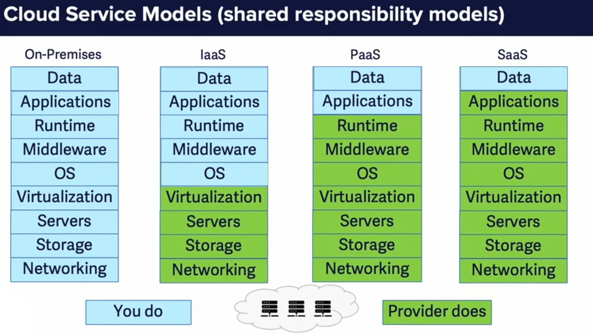
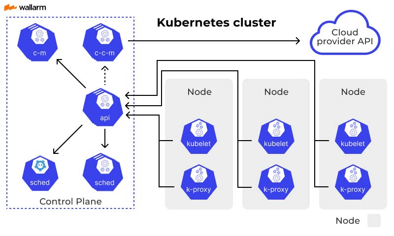
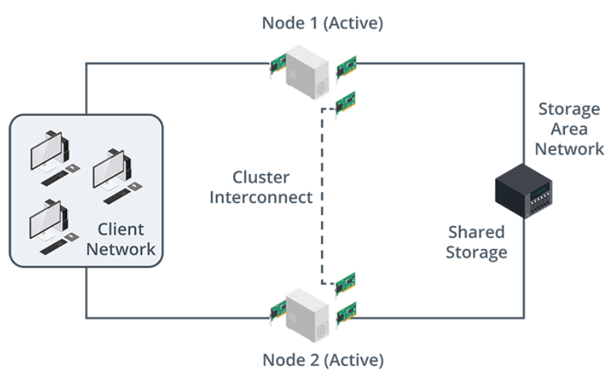
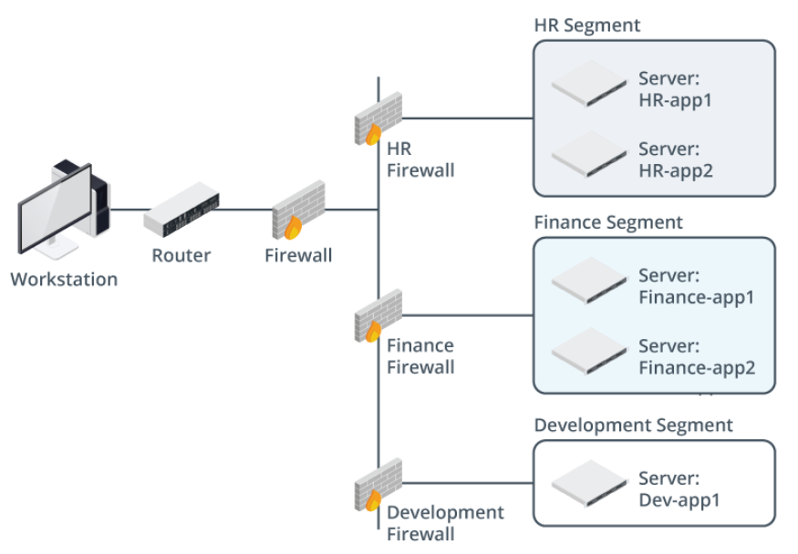
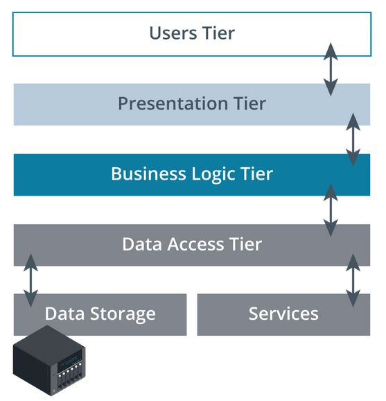
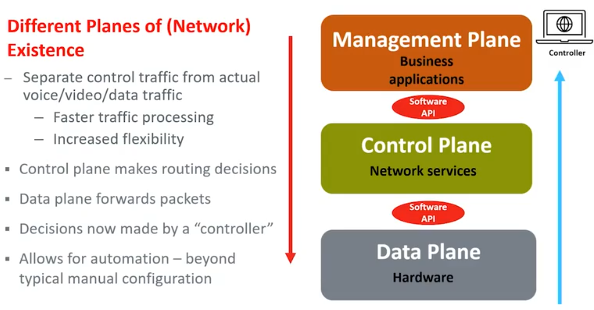

# WGU D318 Cloud Applications CompTIA Cloud+ CV0-003 Exam Objectives

## Tips

- <https://www.youtube.com/playlist?list=PLOYQCApvKhV1K2_jtzPVsPCnEv87piiw5>
- <https://www.reddit.com/r/WGU/comments/10dlfyy/comptia_cloud_cv0003_passed/>
- <https://www.reddit.com/r/CompTIA/comments/136zie0/cloud_cvo003_resources_and_review/>
- [linkedIn cloud+ videos](https://www.linkedin.com/learning/paths/prepare-for-the-comptia-cloud-plus-cv0-003-exam?u=2045532)
- [generic cloud resource](https://github.com/cloud-master-io/cloud-master-io)
- [cloud+ notes](https://dushanthas.github.io/CompTIA-Cloud-plus-notes/)
- [cloud+ pbq](https://wyzguyscybersecurity.com/study-tips-for-comptia-cloud-cv0-003-exam/)
- [ANKI cards](https://ankiweb.net/shared/by-author/938689157)
- Passing score: 750 (on a scale of 100—900)
  - Min Passing score: 75%
  - Min questions correct: 65 of 80 + 10(do not count towards score).
    - This is relative, questions can have different score points depending on difficulty.

| Domain                            | Percentage of Exam |
| --------------------------------- | ------------------ |
| 1.0 Cloud Architecture and Design | 13%                |
| 2.0 Security                      | 20%                |
| 3.0 Deployment                    | 23%                |
| 4.0 Operations and Support        | 22%                |
| 5.0 Troubleshooting               | 22%                |
| Total                             | 100%               |

## 1.1 Compare and contrast the different types of CLOUD MODELS

- Public Cloud
  - A public cloud is a cloud computing model where the infrastructure and services are **owned and operated by a third-party provider**, such as **Amazon Web Services (AWS), Microsoft Azure, or Google Cloud Platform (GCP)**. Users can access these resources over the internet and pay for them on a pay-as-you-go basis.
  - Same as multitenancy
- Private Cloud
  - A private cloud is a cloud computing model where the infrastructure and services are **dedicated to a single organization**. (GovCloud).
  - Private clouds can be hosted on-premises or in a colocation facility.
  - private clouds offer **exclusive access and control over all hardware, software, and data**. This allows organizations to benefit from the flexibility and scalability of cloud computing while maintaining a high level of security and privacy.
- Hybrid Cloud
  - A hybrid cloud is a combination of **public and private clouds**. This allows organizations to leverage the benefits of both models, such as the **scalability and elasticity of public clouds** and the **security and control of private clouds**.
- Community Cloud
  - A community cloud is a cloud computing model where the **infrastructure and services are shared by a group** of organizations with common interests or needs.
  - Community cloud is shared by just the organizations and not open to the public.
- Cloud within a Cloud or Virtual Private Cloud (VPC)
  - A cloud within a cloud is a cloud computing model where resources are provisioned from a **public cloud provider but are then isolated and managed as a private cloud**.
  - Unshared by default and not accessible to other customers.
  - Enables customers to have **single tenancy within a multi-tenant infrastructure**.
- Multicloud
  - Multicloud is the practice of **using multiple cloud computing services from different providers**. This can help organizations **avoid vendor lock-in** and take advantage of the best features and services from each provider.
  - Multi-cloud deployments **reduce reliance on a single vendor**, provide greater service flexibility and choice, **permit improved geographic control of data**, and help manage disaster mitigation.
- Multitenancy
  - Same as public cloud.
  - Multi-tenant architecture: multiple instances of an application operate in a shared environment.
  - Multitenancy is a cloud computing model where the **infrastructure and services are shared by multiple organizations**. This allows the provider to provide economies of scale and reduce the cost for users.
- Infrastructure as a Service (IaaS)

  - IaaS provides users with on-demand access to virtualized **computing resources**, such as servers, storage, and networking. Users have **full control over the operating system**, applications, and data that run on these resources.
  - The CSP manages hardware failures, firmware updates, device drivers, and hardware compatibility.
  - 
  - 

  | Platform | Cloud Provider Includes                                     |
  | -------- | ----------------------------------------------------------- |
  | IaaS     | physical hardware + hardware management software            |
  | PaaS     | IaaS + OS + app development environment(java, python, node) |
  | SaaS     | PaaS + complete app. You bring your data                    |
  | DaaS     | SaaS + desktop virtualization(VDI) software, thin clients   |

- Platform as a Service (PaaS)

  - PaaS **provides users with a platform** for developing, deploying, and managing applications. Users do not have to worry about managing the underlying infrastructure, such as servers and storage.
  - 
  - 

  | Platform | Cloud Provider Includes                                     |
  | -------- | ----------------------------------------------------------- |
  | IaaS     | physical hardware + hardware management software            |
  | PaaS     | IaaS + OS + app development environment(java, python, node) |
  | SaaS     | PaaS + complete app. You bring your data                    |
  | DaaS     | SaaS + desktop virtualization(VDI) software, thin clients   |

- Software as a Service (SaaS)

  - SaaS provides users with access to **applications** that are hosted and managed by the provider. Users typically access these applications through a web browser or mobile app.
  - Responsibility for the hardware where that software runs, the operating system upon which it runs, and the installation and patching of the software itself are all offloaded to the CSP.
  - ex.. Office 365, Salesforce, Gmail, Dropbox, Netflix...
  - 
  - 

  | Platform | Cloud Provider Includes                                     |
  | -------- | ----------------------------------------------------------- |
  | IaaS     | physical hardware + hardware management software            |
  | PaaS     | IaaS + OS + app development environment(java, python, node) |
  | SaaS     | PaaS + complete app. You bring your data                    |
  | DaaS     | SaaS + desktop virtualization(VDI) software, thin clients   |

- Internet of Things (IoT)
  - IoT is the network of physical devices that are embedded with sensors, software, and **network connectivity**, which allows them to collect and exchange data.
- Serverless
  - Serverless computing is a cloud computing model in which the **provider manages the servers and infrastructure that run applications**. Users simply write the code and the provider takes care of the rest.
- Machine Learning/Artificial Intelligence (AI)
  - Machine learning and artificial intelligence are technologies that allow **computers to learn and make decisions without being explicitly programmed**.
  - **AI simulates human intelligence** by providing structured, semi-structured, and unstructured data and **solving complex problems**. AI accomplishes this by using a set of rules to manage its analysis.
  - Machine Learning (ML) is a subset of AI. The **goal of ML** is to **make accurate predictions** by extracting data based on learned information and experience. ML systems are not explicitly programmed to find a particular outcome. Instead, they are programmed to learn from provided data and then make accurate decisions based on what they’ve learned.
- Shared Responsibility Model
  - The shared responsibility model is a cloud computing model where the **provider and the user share responsibility for security and compliance**.
  - The **CSP is responsible for securing the underlying infrastructure**. CSPs will typically provide **physical security** for the datacenter as well as **isolate data** between customers.
  - The **Cloud consumers are responsible for the direct user access security for their own data**.
  - 

## 1.2 Explain the factors that contribute to CAPACITY PLANNING

- Explain Capacity Planning?
  - <https://learn.comptia.org/app/certmaster-learn-for-cloud-exam-cv0-003#read/section/relate-capacity-planning-to-business-goals>
  - Capacity planning involves considering various factors that contribute to **determining the needed resources** for a project or system.
  - One crucial aspect of capacity planning is **understanding** and documenting **requirements**, which can encompass technical, business, and other relevant factors.
  - Understanding what the business hopes to achieve from a cloud infrastructure migration, a cloud application deployment, or a cloud-based disaster recovery solution will make the project far more successful.
  - CapEX: money that will need to be spent(even if not fully paid for) by the business for assets.
  - Questions involved in capacity planning: What do you really need?
    1. Hardware: What is the current baseline or service level?
       1. Are there consolidation opportunities for services, applications, or data sources?
    2. User Density: What is the current capacity?
       1. What future needs can we predict, based on upcoming business initiatives?
    3. Budget: How much can you spend?
       1. What recommendations can be made, and what actions can be taken?
- Capacity Planning: _Hardware_
  - <https://learn.comptia.org/app/certmaster-learn-for-cloud-exam-cv0-003#read/section/relate-capacity-planning-to-business-goals>
  - Hardware requirements specify the **physical infrastructure** and may want **redundancy** with a particular level of **performance**. This includes servers, storage, networking equipment, ect.
- Capacity Planning: _Software_
  - <https://learn.comptia.org/app/certmaster-learn-for-cloud-exam-cv0-003#read/section/relate-capacity-planning-to-business-goals>
  - Software **requirements** might stipulate that the software **manages** a particular process or produces a specific **output format**.
  - Software requirements encompass various software components, which may include off-the-shelf products, custom software, security software, auditing tools, and more.
    - Licensing requirements and costs.
  - Compatibility with the chosen cloud platform and hardware.
- Capacity Planning: _Budgetary_
  - <https://learn.comptia.org/app/certmaster-learn-for-cloud-exam-cv0-003#read/section/relate-capacity-planning-to-business-goals>
  - Budgetary requirements might identify **budget limitations** or subscription fees that control the scope of the project.
  - Estimated costs for hardware, software, cloud services, and ongoing maintenance.
    - Include development budget, operational budget, and security budget, taking into account costs for creating, maintaining, and securing the product or system.
  - Cost of subscriptions.
  - Cost of scaling resources.
  - Budget allocation for different components of the cloud environment.
- Capacity Planning: _Business need analysis_
  - <https://learn.comptia.org/app/certmaster-learn-for-cloud-exam-cv0-003#read/section/relate-capacity-planning-to-business-goals>
  - **What does the business need to reach goal**?
  - This analysis forms the **foundation** for the **entire capacity planning process**.
  - Identifies business needs for which **solutions** must be found to help the organization achieve its strategic **goals**.
  - Such goals might include decreasing costs, increasing revenue, increasing a customer base, or increasing operational effectiveness.
  - Aligning the cloud strategy with business goals and priorities.
    - Does organization have a clear idea of how cloud services will help achieve strategic goals?
    - A business needs analysis will identify a specific business problem for which cloud service might provide a solution.
- Capacity Planning: _Standard Templates_
  - <https://learn.comptia.org/app/certmaster-learn-for-cloud-exam-cv0-003#read/section/templates-1>
  - Consistent **format** for **documenting requirements**.
  - Format example:
    - Project overview
    - Project scope
    - Success factors
    - Stakeholder identification
    - Project constraints
    - System functionality
    - User classes
    - User interface requirements
- Capacity Planning: _Per-user Licensing_
  - <https://learn.comptia.org/app/certmaster-learn-for-cloud-exam-cv0-003#read/section/licensing>
  - **One license per user** that consumes the software or service.
- Capacity Planning: _Socket-based Licensing_
  - <https://learn.comptia.org/app/certmaster-learn-for-cloud-exam-cv0-003#read/section/licensing>
  - **One license per CPU** that attaches to the **socket of a motherboard**, regardless of the number of cores the CPU might contain.
- Capacity Planning: _Volume-based Licensing_
  - <https://learn.comptia.org/app/certmaster-learn-for-cloud-exam-cv0-003#read/section/licensing>
  - **One license** that permits a **specified number of installations**, for example, installation of the software on up to 100 computers.
- Capacity Planning: _Core-based Licensing_
  - <https://learn.comptia.org/app/certmaster-learn-for-cloud-exam-cv0-003#read/section/licensing>
  - **One license per core** in a **CPU** in a server.
- Capacity Planning: _Subscription Licensing_
  - <https://learn.comptia.org/app/certmaster-learn-for-cloud-exam-cv0-003#read/section/licensing>
  - Pay on a **periodic basis (e.g., daily, monthly, yearly)** with potentially easier upgrades and better support.
- Capacity Planning: _User Density_
  - <https://learn.comptia.org/app/certmaster-learn-for-cloud-exam-cv0-003#read/section/user-density>
  - User density refers to the number of **concurrent connections to cloud services** that maintain an acceptable level of **performance**.
    - High concurrent users can lead to capacity challenges.
    - The number of users accessing the cloud environment at a given time.
    - Used to determine the required amount of resources and performance capacity.
- Capacity Planning: _System Load_
  - <https://learn.comptia.org/app/certmaster-learn-for-cloud-exam-cv0-003#read/section/system-load>
  - The system load is a measure of how **busy** the system’s central processing unit (**CPU**) is over a period of **time**.
    - While there are usually counters for CPU utilization itself, the system load is better measured by using **CPU queue length**. That value tracks processes currently being run by the CPU as well as those that are awaiting the CPU’s attention (queued up).
- Capacity Planning: _Trend Analysis_
  - <https://learn.comptia.org/app/certmaster-learn-for-cloud-exam-cv0-003#read/section/trend-analysis-2>
  - The process of **detecting patterns** within a **dataset** over time, and using those patterns to make **predictions** about future events or better understand past events.
    - Studying historical data to identify patterns and predict future trends in resource usage, performance, and costs.
    - Establish baselines of normal behavior. Monitor for anomalies that may require capacity adjustments.
    - Optimize resource allocation and budget planning.
- Capacity Planning: _Baselines_
  - <https://learn.comptia.org/app/certmaster-learn-for-cloud-exam-cv0-003#read/section/trend-analysis-2>
  - A **reference point for comparing** current performance and resource usage.
  - Established during initial deployment or after a period of stable operation.
- Capacity Planning: _Patterns_
  - <https://learn.comptia.org/app/certmaster-learn-for-cloud-exam-cv0-003#read/section/trend-analysis-2>
  - **Recurring trends** in resource usage or system behavior.
  - Can be used to identify potential bottlenecks and **predict** future demands.
- Capacity Planning: _Anomalies_
  - <https://learn.comptia.org/app/certmaster-learn-for-cloud-exam-cv0-003#read/section/trend-analysis-2>
  - **Deviations from normal(baseline)** patterns that may indicate a problem or an opportunity.
  - Outliers. Cannot predict.
  - Need to be investigated to identify the root cause and take corrective action.
  - For example, performance degradation for a web app is unexpected, based on the number of users running the application. Further investigation might point to an unrelated process running on the system (such as a backup or data deduplication process) that is consuming resources and negatively impacting the web app.
- Capacity Planning: _Performance Capacity Planning_
  - <https://learn.comptia.org/app/certmaster-learn-for-cloud-exam-cv0-003#read/section/performance-and-capacity-planning>
  - Ongoing **monitoring** of application performance, including user experience quality, CPU, memory, and disk usage, to ensure **optimal resource allocation**.
  - Effective capacity planning considers these licensing models and factors to ensure that resources are allocated efficiently and in line with business needs, user demands, and budget constraints

## 1.3 Explain the importance of HIGH AVAILABILITY and SCALING in cloud environments

- Explain the importance of high availability and scaling in cloud environments?
  - High availability ensures that cloud (and on-premises) resources are **available** to consumers.
  - The primary ways to provide availability are **redundancy**, monitoring, and failover capabilities.
  - High availability and scaling are two fundamental pillars of a robust and efficient cloud environment. They are critical for ensuring **continuous operation**, meeting fluctuating demands, and delivering a seamless **user experience**.
  - High Availability: Minimizing downtime and service disruptions.
  - Scalability: Adding or removing VMs to adapt to growing demands efficiently.
    - elasticity: dynamically adjusting resources based on real-time demand.
  - Cost optimization: Utilizing resources effectively and avoiding unnecessary costs.
  - Enhanced user experience: Delivering consistent and reliable performance.
- High Availability and Scaling Hypervisors: _Affinity_
  - Deliberate **grouping** of VM instances on a **single host** for centralized management.
  - increases performance.
  - **Pros**
    - Ensures that VMs with specific dependencies are placed on the same physical server. This improves performance and reduces latency.
  - **Cons**
    - Creates single point of failure.
    - Hard to scale.
  - Hypervisors are **software** programs that create and **manage virtual machines (VMs)** on a single physical server. They play a crucial role in achieving high availability and scalability.
- High Availability and Scaling in Hypervisors: _Anti-affinity_
  - deliberately **distributes** VM instances across **multiple hosts** to avoid **single points of failure**.
  - increases failover.
  - **Pros**
    - Scaling, redundancy, failover.
  - **Cons**
    - can be more difficult to monitor.
    - slower performance.
- High Availability and Scaling in Oversubscription: _Compute_
  - Oversubscription **allocates more resources** (CPU, RAM, storage) **than** the physical server has **available**.
  - Compute: CPU power and memory space.
  - Monitoring is important to ensure that all available compute resources are not actually consumed and that scaling is configured.
- High Availability and Scaling in Oversubscription: _Network_
  - Network over-allocation offers **more network bandwidth** for use **than** is actually **available**.
  - Can be avoided with Virtual Private Networks(VPN).
- High Availability and Scaling in Oversubscription: _Storage_
  - Storage capacity may be oversold to consumers by CSPs.
  - Storage capacity is usually easy to add, however, so the larger concern is **IOPS and overall read/write speed** for storage resources.
- High Availability and Scaling: _Regions and Zones_
  - Cloud providers offer services across multiple geographically **distributed** regions and zones. This provides **redundancy** and ensures that applications are **available** even if there is an outage in one region.
  - Each Region are geographically distinct areas with two or more zones(data centers).
  - Each region supports a number of availability zones.
  - Availability zones are datacenters with dedicated and redundant power and network connectivity.
  - Fulfill legal requirements if you must be in some region.
- High Availability and Scaling: _Applications_
  - High availability for applications requires **replicating** them **across multiple servers and regions**. This ensures that if one instance fails, another can seamlessly take over.
  - Scalability: Auto-scaling.
  - High Availability: Availability zones.
- High Availability and Scaling: _Containers_
  - Containerization is a form of virtualization, but it is significantly different than VMs. **Containers virtualize at the OS layer**, rather than the hardware layer.
  - A container holds a **single application and everything it needs to run**.
  - Containers are lightweight and portable units of software that share an operating system kernel. They are becoming increasingly popular in cloud environments due to their fast startup times and resource efficiency.
  - Containerization: Packaging applications and their dependencies into containers.
  - Container orchestration: Managing the deployment, scaling, and networking of containers.
  - Highly available containers:
    - Scalability: Auto-scaling
    - High Availability: Docker Swarm or Kubernetes
      - Scale horizontally with VM cluster of redundant nodes.
  - AWS: Elastic Container Service and Elastic Container Registry.
  - 
  - 
- High Availability and Scaling: _Clusters_
  - Server failover clusters are a group of two or more integrated servers and often use the same data storage source.
  - Each cluster member is referred to as a node, and all of the nodes are all configured the same way.
  - Each node does the same tasks as the other nodes.
  - Each server is an independent device within the cluster.
  - A cluster of servers is treated as a single entity by clients, and their network identity is a single IP address.
  - They are fundamental for **scaling** applications and workloads **horizontally**.
  - The **purpose** behind server clusters is to provide **high availability** of services and data, **scalability**, **redundancy**, and **load balancing**.
  - Scalability: Auto-scaling
  - High Availability: Clusters
  - 
- High Availability and Scaling of Network Functions: _Avoid Single Point Failures: Switches, Routers, Load Balancers, Firewalls_
  - Physical infrastructure needs to be turned off, components upgraded, then brought back online. To slow.
  - High Availability is instantly spinning up more infrastructure as needed.
  - Virtual instances can be spread across multiple availability zones.
  - Avoiding Single Point Failures:
    - NIC teaming: Aggregates network connectivity for servers by using two or more NICs
    - Switch: Provides connectivity within network segments
    - Router: Provides connectivity between network segments and filters some traffic
    - Load balancer: Distributes workload requests among servers
    - Firewall: Filters traffic between networks or network segments
    - Proxy: Provides indirect connectivity to network services such as websites
    - VPN: Provides connectivity between remote hosts and business sites, between business sites, or between business sites and cloud networks
- High Availability and Scaling: _Avoiding single points of failure_
  - **Redundancy** to prevent outages.
  - **Availability Zones** are fault tolerant and unlikely to fail simultaneously.
  - Single point failure causes:
    - A server with one power supply
    - A server with one NIC
    - A single server hosting a website
    - A single server hosting a database
    - A single backup job stored on one piece of media
    - A single copy of a critical document
    - A single router or switch providing connectivity to a segment
- High Availability and Scaling in Scalability: _Auto-Scaling_
  - **Automatic scaling** of resources(VMs) to match work load.
- High Availability and Scaling in Scalability: _Horizontal scaling_
  - **Scaling additional instances(Adding VMs)** to meet the workload. Also known as scaling out.
- High Availability and Scaling in Scalability: _Vertical scaling_
  - **Upgrading|Adding** additional resources to VMs. Compute, memory, NICs to **existing** instances.
- High Availability and Scaling in Scalability: _Cloud bursting_
  - **Redirecting on-premises traffic**(ex.. to cloud) when current resources are at 100% utilization.

## 1.4 Given a scenario, analyze the solution DESIGN in support of the BUSINESS REQUIREMENTS

- Requirement analysis: _Software_
  - [Certmaster Cloud+](https://learn.comptia.org/app/certmaster-learn-for-cloud-exam-cv0-003#read/section/understand-business-requirements-analysis)
  - **Users**
    - What software applications and platforms are included in the solution?
    - Meets **functional and technical requirements**.
      - Requirements that may vary by business roles (accounting, sales, developers, and IT)
      - **Specialized software** that is not cloud native (such as accounting or human resources software)
      - Management of **unique data formats**
    - Compatibility with existing systems and applications.
      - **Easy** IT cloud administration tools
      - Easy cloud billing, reporting, and accounting user interface
      - **Familiar** user interface for applications
      - **Consistent** software versions
    - **Availability** of support and maintenance.
      - **Training** for IT cloud administrators
  - **Business**
    - Specialized line of business or custom in-house developed software
    - Software that is cloud only or is not portable to the cloud
    - Software **scalability**
    - **CSP's** offer of SaaS, PaaS, and IaaS **solutions**
- Requirement analysis: _Hardware_
  - **Users**
    - **Access** from any device
  - **Business**
    - **Reliable** and fast Internet connectivity
    - Constructing and supporting a datacenter for private and hybrid cloud **deployments**
    - What hardware infrastructure is required?
    - High **availability** and **redundancy** to minimize downtime.
    - Hardware **scalability** by the CSP
    - Reliability of the CSP's hardware
    - **Security** features to protect against cyber threats.
- Requirement analysis: _Integration_
  - **Users**
    - Efficient exchange of data and **information between systems**.
      - Integration with existing data sources (SQL and NoSQL databases, big data, and business partners)
    - **Standardized** interfaces and protocols.
    - **Integration** of new cloud-native software with legacy on-premises software
    - Integration with business partner systems
    - Support by the CSP during integration and cloud migration
  - **Business**
    - Seamless integration with **minimal disruption** to ongoing operations.
      - Integration with existing data sources (SQL and NoSQL databases, big data, and business partners)
    - Integration of new cloud-native software with **legacy on-premises software**
    - Integration with **business partner** systems
    - **Support** by the cloud service provider during integration and cloud migration
- Requirement analysis: _Budgetary_
  - **Users**
    - Whether the cloud service provider offers managed services for user applications
    - Clear and **transparent pricing model**.
  - **Business**
    - Cost-effective solution that aligns with financial constraints.
      - **Cost** of subscriptions
      - Cost of scaling resources
      - Cost of moving data out of a provider’s cloud
    - A shift from capital expenditures to operations expenditures
    - **Return on investment (ROI)** analysis.
- Requirement analysis: _Compliance_
  - Adherence to all relevant **industry regulations** and standards.
    - Security and **data privacy compliance**.
    - Industry requirements (such as HIPAA, PCI DSS, and PII).
    - Regular **audits** and assessments.
  - CSP certificates of compliance.
  - Research compliance with other businesses in the same industry.
- Requirement analysis: _Bugetary_
  - **Guarantees** a certain level of service **availability and performance**.
  - **Clearly defined metrics** and service level objectives (SLOs).
  - Compensation for breaches of the SLA.
- Requirement analysis: _User and business Needs_
  - **Meets the specific needs and requirements** of the users and the business.
  - User-friendly and intuitive interface.
  - **Accessibility** and inclusivity.
- Requirement analysis: _Security_
  - **Users**
    - Straightforward security interfaces for users
    - Security **easy** for cloud administrators to implement
  - **Business**
    - Secure data **encryption** and access controls.
    - Regular vulnerability scanning and penetration testing.
    - Robust security measures to protect against cyber **threats**.
    - Virtual private cloud (VPC) options
    - Whether data is stored at multiple datacenters for **regional** security
    - Encryption for data at rest and in transit
    - **How the CSP protects data**.
- Requirement analysis for Networks: _Sizing_
  - **Users**
    - Performance and **availability**
  - **Business**
    - Reliable and **secure** network infrastructure.
    - High-bandwidth connectivity to **support data flow**.
    - **Scalability** to accommodate future growth.
    - Encrypted connectivity/Virtual private network
    - Performance and availability
    - **Cost** of redundancy
    - Available virtual network options (such as network size, subnetting/segmentation, and routing)
    - Connectivity to the existing on-premises network
    - Appropriate infrastructure sizing to meet **current and future needs**.
    - Resource utilization monitoring and optimization.
    - Scalable architecture to adapt to changing demands.
- Requirement analysis for Networks: _Subnetting_
  - **divide** larger networks into smaller **networks**, for performance or security (or both).
- Requirement analysis for Networks: _Routing_
  - Optimal routing configuration for **efficient data flow**.
  - Minimization of **latency** and network congestion.
  - **Redundancy and Load balancing** across multiple paths.
- _Development_ Environments
  - [Certmaster Cloud+](https://learn.comptia.org/app/certmaster-learn-for-cloud-exam-cv0-003#read/section/understand-how-business-requirements-affect-it-environments-2)
  - Environment for developers to **design, build, and test** the solution.
  - Programmers code projects, detect bugs, manage code versions, implement code-level security.
- _Quality Assurance (QA)_ Environments
  - Environment for **testing** the functionality and performance of the solution.
  - Typically done in 'Staging'.
- _Staging_ Environments
  - Environment for **simulating production** conditions and testing the solution with real-world data.
  - QA testers validate applications.
- _Blue-green_ Environments
  - Deployment strategy where the **new version of the solution is deployed alongside the existing version** and then switched over to once verified.
- _Production_ Environments
  - Environment where the solution is deployed and used by **end users**.
- Disaster Recovery (DR) Environments
  - **Backup** and **recovery infrastructure** to ensure business continuity in case of an outage.
  - Many DR concerns are addressed by the cloud’s scalability and inherent availability through availability zones and regions.
- Testing Techniques: _Vulnerability testing_
  - Identifies **existing** weaknesses in the solution that could be exploited by attackers.
  - The goal is to identify the vulnerability so that it can be mitigated.
- Testing Techniques: _Penetration testing_
  - Simulates real-world attacks to test the **effectiveness of the security** measures.
  - **authorized** attempt to **identify security misconfigurations**.
  - Such testing begins with an **analysis** of available resources, looking for older, unpatched, or vulnerable software.
- Testing Techniques: _Performance testing_
  - Test **responsiveness** and **stability** of the solution **under load**.
  - For cloud services, this information is useful for determining scalability settings. For example, scaling can be done via scale-up (more resources, such as memory, given to a VM) or scale-out (more VMs deployed).
- Testing Techniques: _Regression testing_
  - Also called **Post**-deployment validation.
  - Verifying changes do not effect other dependencies, **after** the update has been **deployed**.
  - Otherwise, the application has fallen back, or “regressed,” to an earlier stage of functionality.
- Testing Techniques: _Functional testing_
  - **Tests** against specified **requirements**.
  - Does it **do** what it’s **supposed to do**?
- Testing Techniques: _Usability testing_
  - Assesses how easy and intuitive the solution is for users to interact with.
  - Performed by the **end-users** and provides direct **feedback** on the interface, features, and practical use.

## 2.1 Given a scenario, configure IDENTITY and ACCESS MANAGEMENT

- Explain Authentication, Authorization, Auditing and IAM?
  - **AAA**
    - Authentication : A user proves their identity(password, something only you know).
    - Authorization : The identity is permitted a specified level of access to a resource.
    - Auditing : A record is kept of what the identity did and when.
  - **Identification**:
    - The process of **verifying the identity** of a user or system attempting to access resources.
    - Common methods include usernames, passwords, multi-factor authentication (MFA), biometrics, and Security Assertion Markup Language (SAML).
  - **Authorization**:
    - The process of determining **what resources** a user or system is allowed to **access** and what actions they are permitted to perform.
    - IAM is Based on user roles, permissions, and access control lists (ACLs) for access to data or running programs.
    - Ultimately, the goal is for a user to have one identity that provides access to all resources they are authorized to use.
- IDENTITY and ACCESS MANAGEMENT: _Privileged access management (PAM)_
  - **Principle of least privilege**: minimum level of access to accomplish assigned tasks.
  - Just-in-Time access. Just when you need it.
  - Granular: time limited, highly targeted.
  - **Physical access control**: include managing physical security, including locked doors, man cages, guest badges, and other physical means of denying access to unauthorized persons.
  - **Logical access control**: are software-based management practices. Examples include basic authentication (name and password), Windows and Linux permissions, and firewall rules.
- IDENTITY and ACCESS MANAGEMENT: _Logical access management (LAM)_
  - Management using remote access securely.
  - HTTPS, SSH, IPSEC and tunneling.
  - Can include:
    - username/password, private keys, biometrics.
  - Must meet security and compliance company rules.
- IDENTITY and ACCESS MANAGEMENT: _Account life-cycle management::Provision and Deprovision Accounts_
  - CRUD: Create, Review/Update, Deactivate.
  - Day 1 access to job assignment.
  - Governs the **creation**, use, and **termination** of **user accounts** throughout their lifecycle.
  - Automates tasks like provisioning, deprovisioning, and password resets.
  - Creating and removing user accounts as needed.
  - Automating account creation based on predefined roles and workflows.
- IDENTITY and ACCESS MANAGEMENT Access Controls: _Role-based access control (RBAC)_
  - Grants **access** based on predefined **roles** and associated permissions. Given to **groups**.
- IDENTITY and ACCESS MANAGEMENT Access Controls: _Discretionary access control (DAC)_
  - **Owner access** controls.
  - Allows **users** to **control access** to their **own resources**.
  - Access is managed with an access control list (ACL) that lists who has access and what level of access they have.
- IDENTITY and ACCESS MANAGEMENT Access Controls: _Non-discretionary access control (N-DAC)_
  - **Rule based access control**.
  - Access controlled by an **administrator** or system based on rules and policies.
- IDENTITY and ACCESS MANAGEMENT Access Controls: _Mandatory access control (MAC)_
  - **Access via security model**.
  - **Labels** set on objects (files) by the administrator. Users cannot manipulate these labels.
  - Users are given matching classifications. If both match, user is granted access.
- IDENTITY and ACCESS MANAGEMENT: _Directory Services::Lightweight Directory Access Protocol (LDAP)_
  - Store(x500-like directory) and **manage**(lifecycle) information about **users**, groups, devices, and other resources.
    - the x.500-like database is used to centralize information about clients, access, privileges on the network
  - Enable **centralized** authentication and authorization.
  - Examples include Active Directory, OpenLDAP, and Azure AD.
  - GCP offers Secure LDAP.
- IDENTITY and ACCESS MANAGEMENT: _Federation_
  - Allows users to access multiple organizations and services using a single set of credentials.
    - Defines a system of trust between an IdM provider and a resource provider.
  - SSO experience for the user.
  - Simplifies user management and reduces password fatigue.
  - Examples include SAML and OpenID Connect. AWS Single Sign-On and AWS IDENTITY and ACCESS MANAGEMENT.
- IDENTITY and ACCESS MANAGEMENT: _Certificate management_
  - Securely generates, issues, and manages digital certificates for authentication and encryption.
  - Public/Private key management(PKI).
  - Provides trust and integrity for secure communication.
  - Examples include Let's Encrypt and AWS Certificate Manager.
- IDENTITY and ACCESS MANAGEMENT: _Multifactor authentication (MFA)_
  - What you know (such as a password)
  - What you have (such as a token or a smart card)
  - Who you are (measuring biometrics through a fingerprint scanner or similar device)
  - Requires an additional factor beyond a password to verify user identity.
  - Increases security and reduces the risk of unauthorized access.
  - Examples include SMS codes, push notifications, and hardware tokens.
- IDENTITY and ACCESS MANAGEMENT: _Single sign-on (SSO)::Security Assertion Markup Language (SAML)_
  - **SAML**
    - The protocol used perform SSO.
    - User **authenticates** to an identity management service (IdM), and their verified **identity** information is **passed** to the service or **application** provider.
    - Allows SSO.
  - **Single Sign-On**
    - Allows users to authenticate **once** and **access multiple applications** without re-entering their credentials.
    - Improves user experience and reduces password fatigue.
    - Examples include Okta, Azure AD Connect, and Ping Identity.
      - AWS Identity and Access Management
      - Google Identity Platform
      - Azure Active Directory
- IDENTITY and ACCESS MANAGEMENT: _Public key infrastructure (PKI)_
  - Protect data, insure identity. **Key Pair Encryption**.
  - Framework for issuing, **managing**, and using **digital certificates**(signed public/private keys).
  - The actual certificates are handled by _certificate authority_ servers that create, manage, expire, renew, and revoke certificates.
  - Provides secure communication and strengthens authentication.
  - Examples include OpenSSL and Microsoft Certificate Services.
- IDENTITY and ACCESS MANAGEMENT: _Secret management_
  - Securely **stores** and manages sensitive information like passwords, API **keys**, and encryption keys.
  - Ensures confidentiality and integrity of sensitive data.
  - Examples include HashiCorp Vault and AWS Secrets Manager.
- IDENTITY and ACCESS MANAGEMENT: _Key management_
  - Manages the **lifecycle**(renewed or reissued) of encryption **keys** used for data protection.
    - not to be confused with secret management, specifically covers the management of public and private keys within the PKI(renewed or reissued).
  - Provides secure storage, rotation, and access control for encryption keys.
  - Examples include AWS Key Management Service (KMS) and Azure Key Vault.

## 2.2 Given a scenario, SECURE a NETWORK in a cloud environment

- Secure a Network in a Cloud Environment: _Network Segmentation::Virtual LAN (VLAN)/Virtual Extensible LAN (VXLAN)/Generic Network Virtualization Encapsulation (GENEVE)_
  - **VLAN**
    - Network at Layer 2 (the data link layer of the OSI model). This is accomplished by tagging data frames with VLAN membership information.
    - Switch isolates the traffic to the appropriate VLAN.
    - Router routes traffic between VLANs.
    - **Advantages**
      - Limit blast radius: A security breach in one segment is contained and doesn't impact others.
      - Granular access control: Define specific access rules for each segment.
      - Improved resource utilization: Optimize resource allocation within each segment.
      - Create logically separate networks within a shared physical network.
  - **VXLAN**
    - Improvements over VLAN.
      - 16 million network segments(VLAN 4096). CSPs will have more than 4096 customers.
      - Provides Tunneling services.
      - Better Link aggregation and Layer 3 routing.
    - **Advantages**
      - Greater scalability.
      - Stretching: VXLAN traffic crosses between the local network and the cloud network using a bi-directional tunnel.
      - Traffic mirroring: traffic and be sent to another network for auditing.
  - **GENEVE**
    - Microsoft approach to overcome VLAN limitations.
    - Encapsulate packet to create compatibility with VLAN and Stateless Transfer Tunnel.
    - Usually required across multi-cloud deployments.
- Secure a Network in a Cloud Environment: _Network Segmentation::Micro-segmentation_
  - **Zero Trust**.
  - **Dividing** a **network** at the **workload**(application) level.
  - Network level segmentation segments the network, but does not manage security within segments.
  - Three Aspects of Microsegmentation:
    - Visibility: The entire workflow of the application must be available for configuration.
    - Granularity: Each workflow is isolated from all others, allowing it to be governed independently.
    - Dynamic: The configuration is mobile and able to follow the application through changes or scaling.
  - **Advantages**
    - Reduced attack surface
    - Increased containment of security breaches
    - Increase compliance
    - Easier management via policies
  - AWS security groups(virtual firewalls) and Azure Application Security Groups allow microsegmentation.
  - 
- Secure a Network in a Cloud Environment: _Network Segmentation::Tiering_
  - Organize network resources into layers based on function (e.g., public, private, DMZ).
  - 
- Secure a Network in a Cloud Environment: _Protocols::Domain Name Service (DNS)::DNS over HTTPS (DoH)/DNS over TLS (DoT)_
  - Securely **encrypt communications** between clients and **DNS**(resolves domain names to IP addresses).
- Secure a Network in a Cloud Environment: _Protocols::Domain Name Service (DNS)::DNS Security (DNSSEC)_
  - Cryptographically **verifies** the **authenticity** and integrity of **DNS** responses.
- Secure a Network in a Cloud Environment: _Protocols::Network Time Protocol (NTP)::Time Security (NTS)_
  - Synchronizes clocks across devices in the network.
  - Secures NTP communication against spoofing and manipulation through key exchange.
- Secure a Network in a Cloud Environment: _Protocols::Encryption::IPSec_
  - Encrypts communication at the IP layer(Layer 3), securing the entire network stack.
  - HTTPS only allows web-based communications to be encrypted.
  - IPsec uses two different modes:
    - Transport mode: The original header is not encrypted, but payload is. There is small bandwidth savings. This mode is usually used with host-to-host connections.
    - Tunnel mode: The entire packet is encrypted (header and payload). This mode is usually used in router-to-router connections.
  - Originally used as a VPN protocol, but once security professionals began defining internal networks as "untrusted," then IPsec was used to protect the internal traffic.
- Secure a Network in a Cloud Environment: _Protocols::Encryption::Transport Layer Security (TLS) Encryption_
  - **Encrypts communication** between applications, protecting data in transit.
  - Combination of symmetric and asymmetric encryption.
  - Identity of the web server is confirmed by the client.
- Secure a Network in a Cloud Environment: _Protocols::Encryption::Hypertext Transfer Protocol Secure (HTTPS)_
  - **Secures** communication between **web browsers** and servers.
  - Uses digital certificates to prove the identity of the web server(prevent man-in-the-middle attacks).
  - Certificates and encryption are part of the TLS structure.
  - HTTPS encryption occurs at the application layer of the TCP/IP stack.
- Secure a Network in a Cloud Environment: _Protocols::Tunneling::Secure Shell (SSH)_
  - Encrypted remote administration protocol.
- Secure a Network in a Cloud Environment: _Protocols::Tunneling::Layer 2 Tunneling Protocol (L2TP)/Point-to-Point Tunneling Protocol (PPTP)_
  - **Layer 2 tunneling protocol (L2TP)/IPsec**
    - VPN protocol that relies on IPsec for encrypted site-to-site connections.
  - **Point-to-point tunneling protocol (PPTP)**
    - legacy protocol that should be avoided for its vulnerabilities.
- Secure a Network in a Cloud Environment: _Protocols::Tunneling::Generic Routing Encapsulation (GRE)_
  - Tunneling protocol that does not use encryption unless combined with IPsec and should be avoided for any secure communications.
- Secure a Network in a Cloud Environment: _Network Services::Firewalls::Stateful_
  - Keeps track of connections from layer 3,4,5.
  - Allows advanced firewall rules.
  - Stateful firewalls are powerful and understand the entire network connection, but are slower than Stateless.
- Secure a Network in a Cloud Environment: _Network Services::Firewalls::Stateless_
  - Uses ACL(simple permit/deny rules) to filter traffic.
  - Stateless firewalls are faster, especially for high workloads, but they don't check traffic content.
- Secure a Network in a Cloud Environment: _Network Services::Web Application Firewall (WAF)_
  - Work at Layer 7 to protect web applications from common attacks like cross-site scripting, cross-site forgery, SQL injections and DDoS.
- Secure a Network in a Cloud Environment: _Network Services::Application Delivery Controller (ADC)_
  - **Load balances traffic** across multiple servers and provides additional security features like URL filtering and denial-of-service (DoS) protection.
  - Typically, these devices are placed in a DMZ.
- Secure a Network in a Cloud Environment: _Network Services::Intrusion Protection System (IPS)/Intrusion Detection System (IDS)_
  - **IDS**
    - **Monitors** network traffic for malicious activity and prevents or **alerts** on detected threats.
    - Passive devices that match network traffic and patterns against known vulnerabilities.
    - Monitor/alert the network environment but do not stop.
  - **IPS**
    - **Monitor and Prevent** malicious activity.
    - Dynamically blocks the connection and traffic identified as a threat.
- Secure a Network in a Cloud Environment: _Network Services::Data Loss Prevention (DLP)_
  - Detects/Prevents data exfiltration.
- Secure a Network in a Cloud Environment: _Network Services::Network Access Control (NAC)_
  - Combine several aspects of security into a single unit.
    - Workstation security (endpoints): anti-virus, anti-spyware, patching, and vulnerability scans.
    - Authentication: single sign-on and multifactor authentication.
    - Network security: firewalls, network IDS, patching, and updated anti-virus definitions.
- Secure a Network in a Cloud Environment: _Network Services::Packet brokers_
  - Mirror network traffic to security and monitoring tools for analysis and troubleshooting.
  - Exist between the network infrastructure and infrastructure security tools to gather information and **expose packet** to the appropriate **tools**.
- Secure a Network in a Cloud Environment: _Log and Event Monitoring_
  - Proactively identify and address security incidents by monitoring logs and events generated by various systems and applications.
  - Utilize tools like Security Information and Event Management (SIEM) to collect, analyze, and correlate events across the cloud environment.
- Secure a Network in a Cloud Environment: _Network Flows_
  - <https://learn.comptia.org/app/certmaster-learn-for-cloud-exam-cv0-003#read/section/understand-network-flow-diagrams>
  - **visualize** and understand how data moves through a **network** infrastructure.
  - Detect anomalous behavior and identify potential threats.
  - Use tools like network flow analysis (NFA) to track data flow across the network and identify bottlenecks or suspicious activity.
- Secure a Network in a Cloud Environment: _Hardening and Configuration Management_
  - Hardening can be summed up as "remove what you don’t need, and use the most current version of what’s left."
  - Implement security best practices by hardening operating systems, applications, and cloud services.
    - ex.. Vulnerability Scanning. SIEM, EDR, XDR.
  - Disable unnecessary ports and services to minimize attack surfaces.
    - ex.. nmap, systemctl stop, windows stop services.
  - Disallow weak protocols and ciphers that are vulnerable to exploits.
  - Regularly update firmware and software to address vulnerabilities.
  - Control ingress and egress traffic using firewalls, access control lists (ACLs), and whitelisting or blacklisting.
  - Implement proxy servers to filter and monitor network traffic.
  - Utilize DDoS protection services to mitigate distributed denial-of-service attacks.
    - ex.. Azure Application Gateway WAF

## 2.3 Given a scenario, apply the appropriate OS and APPLICATION SECURITY controls

- OS and APPLICATION SECURITY: _Policy::Password complexity_
  - password **length**, **complexity**(special chars, capitals, numbers), **frequency of change**.
- OS and APPLICATION SECURITY: _Policy::Account lockout_
  - Automatically **locks accounts** after a certain number of **unsuccessful login attempts**.
- OS and APPLICATION SECURITY: _Policy::Application whitelisting_
  - Explicitly identifies the **permitted applications** a user or system can run.
- OS and APPLICATION SECURITY: _Policy::Software feature restrictions_
  - Defines which **software** features will be **installed** and how the feature may be used.
- OS and APPLICATION SECURITY: _Policy::User/group permissions_
  - Defines the user and group **lifecycle**, including **provisioning** and **deprovisioning** of accounts, as well as group membership **rules**.
- OS and APPLICATION SECURITY: _User Permissions_
  - **Policies** and **training** can help **users** set proper **permissions**. Can also implement additional security layers, such as the MAC.
  - Both Linux and Windows users can set permissions on files and folders that they own. The reason is that both Windows NTFS and Linux standard permissions are DAC-oriented permissions structures.
  - Mistakes or deliberate misconfiguration of permission by end-users risk exposing confidential information.
  - Regularly review and update user permissions to ensure they remain appropriate.
- OS and APPLICATION SECURITY: _Antivirus/Anti-Malware/Endpoint Detection and Response (EDR)_
  - Anti-virus, Anti-malware should be installed.
  - **EDR (Endpoint Detection and Response)**:
    - Continually monitor the system for changes that indicate threats or exploits.
    - Data is centralized for more accuracy.
    - EDR systems work by installing an agent on the workstation to manage the collection of information.
- OS and APPLICATION SECURITY: _Host-based Intrusion Detection System (HIDS)/Host-based Intrusion Prevention System (HIPS)_
  - **HIDS detects** malicious activity while **HIPS** actively **prevents** it.
  - organizations have bare-metal or virtual machines.
  - These tools provide valuable insights into system security and can help identify and respond to threats quickly.
- OS and APPLICATION SECURITY: _Hardened Baselines::Single Function_
  - Baseline: Agreed-upon configurations for operating system version and applications that meet specific security requirements.
  - Configuration baseline: defines what services and features will be installed on a newly deployed system.
  - Baselines include configurations for:
    - User and group permissions
    - Services and ports
    - Software features
    - Security settings and policies
    - Patching and vulnerability management
  - Hardened baselines should focus on a single function to avoid unnecessary complexity and vulnerabilities.
- OS and APPLICATION SECURITY: _File integrity_
  - File integrity **monitoring** to detect and **prevent unauthorized changes** to critical system files.
- OS and APPLICATION SECURITY: _Log and event monitoring_
  - **Monitor** system **logs** and events for suspicious activity and potential **security** breaches.
- OS and APPLICATION SECURITY: _Configuration management_
  - Use configuration management tools to automate the deployment and enforcement of security settings across all systems.
- OS and APPLICATION SECURITY: _Builds::Stable_
  - Stable builds are **tested** and proven to be reliable and secure, ideal for production environments.
- OS and APPLICATION SECURITY: _Builds::Long-term support (LTS)_
  - LTS builds receive security **updates and patches for several years**, providing long-term stability and support.
- OS and APPLICATION SECURITY: _Builds::Beta_
  - Beta builds offer **early access** to new **features** and functionalities but may contain bugs and require additional testing.
- OS and APPLICATION SECURITY: _Builds::Canary_
  - Canary builds are **deployed** to a **small subset of users** to **test new features** and identify potential issues before a wider rollout.
- OS and APPLICATION SECURITY: _Operating System (OS) Upgrades_
  - Regularly upgrade operating systems to **address** known **vulnerabilities** and improve **security**.
  - Consider using rolling upgrades or blue-green deployments to minimize downtime and risk during upgrades.
- OS and APPLICATION SECURITY: _Encryption::Application Programming Interface (API) Endpoint_
  - Encrypt Communication: HTTPS or Transport Layer Security (TLS).
- OS and APPLICATION SECURITY: _Encryption::Application_
  - encrypt at application layer.
  - Data encryption: in transit on the network, at rest in storage, and in data structures such as databases.
- OS and APPLICATION SECURITY: _Encryption::OS_
  - Encrypt drive: BitLocker, FileVault, Linux Unified Key Setup (LUKS).
- OS and APPLICATION SECURITY: _Encryption::Storage_
  - encrypt data at rest within cloud storage services.
  - Often provided by cloud providers (e.g., Amazon S3 encryption, Azure Storage Service Encryption).
- OS and APPLICATION SECURITY: _Encryption::Filesystem_
  - encrypt data stored on individual filesystems.
  - Options: eCryptfs, TrueCrypt, VeraCrypt.
- OS and APPLICATION SECURITY: _Mandatory Access Control (MAC)_
  - Restricts access specific resources based on security labels assigned to subjects and objects.
  - Examples: SELinux, AppArmor, TrustedBSD.
- OS and APPLICATION SECURITY: _Software Firewall_
  - Two kind of firewall: network(perimeter) and host-based(local).
  - default: if no rule match, 'block' incoming.
  - Examples: Windows Firewall, iptables (Linux), PF (FreeBSD).

## 2.4 Given a scenario, apply DATA SECURITY and COMPLIANCE CONTROLS in cloud environments

- DATA SECURITY and COMPLIANCE CONTROLS: _Encryption_
  - **Confidentiality**: Data is encrypted such that only **authorized** users with the decryption key can view the data. Confidentiality provides privacy and is a common use of encryption.
  - **Integrity**: generate a **hash**, provides a simple way of checking data has changed.
  - **Non-repudiation**: **digitally signed data**, by using a public-private key pair.
- DATA SECURITY and COMPLIANCE CONTROLS: _Integrity::Hashing algorithms_
  - Ensures data remains **unaltered** and trustworthy.
  - Utilizes hashing algorithms like SHA-256 or MD5 to generate unique digital fingerprints of data.
- DATA SECURITY and COMPLIANCE CONTROLS: _Integrity::Digital signatures_
  - Cryptographically verify the **authenticity** and **integrity** of **data** origin.
  - **Non-repudiation**: can only be signed by private key holder.
  - If any data changed, corrupted, will fail.
  - manage digital signatures is OpenSSL, AWS Key Management Service (KMS).
- DATA SECURITY and COMPLIANCE CONTROLS: _Integrity::File integrity monitoring (FIM)_
  - Continuously monitors files for modifications and alerts on unauthorized changes.
  - Linux: tripwire.
- DATA SECURITY and COMPLIANCE CONTROLS: _Classification_
  - Categorizes data based on its sensitivity and security requirements.
  - Helps prioritize security controls and access restrictions based on data classification.
  - Typical **classifications**: **Public**, **Internal**, **Confidential**, **Highly Confidential**.
- DATA SECURITY and COMPLIANCE CONTROLS: _Segmentation_
  - **Divides environments** into logically separated segments to isolate and **protect** sensitive data.
  - Utilizes network segmentation, virtual networks, and storage segmentation techniques.
  - Limits the blast radius of potential security breaches.
  - Limiting access to specific segments based on user roles and permissions.
- DATA SECURITY and COMPLIANCE CONTROLS: _Access Control_
  - **role-based access control (RBAC)**: assign role permissions.
  - **Groups**: assign group permissions and assign to someone.
- DATA SECURITY and COMPLIANCE CONTROLS: _Impact of Laws and Regulations::Legal Hold_
  - legal hold: preserve relevant data for legal or regulatory purposes.
  - data residency restrictions: adhering to relevant laws and regulations governing data privacy and security like GDPR, HIPAA, CCPA, etc.
- DATA SECURITY and COMPLIANCE CONTROLS: _Records Management::Versioning_
  - **Records management**: the process of controlling data throughout its lifecycle.
  - Implementing a robust records management program for data retention, versioning, and destruction.
  - **labeling data/file** when modified.
- DATA SECURITY and COMPLIANCE CONTROLS: _Records Management::Retention_
  - Defining clear policies for document retention periods based on regulatory requirements and business needs.
- DATA SECURITY and COMPLIANCE CONTROLS: _Records Management::Destruction_
  - how to dispose of data.
  - CSPs and their customers face unique challenges in this area. Storage drives are shared and reshared among tenants.
- DATA SECURITY and COMPLIANCE CONTROLS: _Records Management::Write Once Read Many_
  - **Data** that require **immutability**.
  - Long-term storage, legal, financial, and other data types benefit from WORM storage.
- DATA SECURITY and COMPLIANCE CONTROLS: _Data Loss Prevention (DLP)_
  - DLP has three primary goals:
    1. Identify confidential data in use, in storage, and in transit, and then understand how that data is used.
    2. Apply protection automatically to data by using technology.
    3. Conduct exfiltration monitoring, detection, and response.
- DATA SECURITY and COMPLIANCE CONTROLS: _Cloud Access Security Broker (CASB):_
  - CASBs act as intermediaries(proxy) between cloud applications and users, providing additional security and compliance controls.
  - CASBs offer features like data encryption, access control, threat detection, and compliance reporting.
- DATA SECURITY and COMPLIANCE CONTROLS: _Effective Implementation:_
  - Conduct regular risk assessments to identify and prioritize security risks.
  - Develop a comprehensive data security and compliance strategy.
  - Implement appropriate security controls based on data classification and compliance requirements.
  - Regularly monitor and audit data security controls to ensure their effectiveness.
  - Train employees on data security policies and procedures.
  - Stay informed about evolving threat landscape and adapt security controls accordingly.

## 2.5 Given a scenario, implement measures to MEET SECURITY REQUIREMENTS

- MEET SECURITY REQUIREMENTS: _Tools::Vulnerability Scanners_
  - <https://learn.comptia.org/app/certmaster-learn-for-cloud-exam-cv0-003#read/section/understand-security-management-concepts>
  - <https://learn.comptia.org/app/certmaster-learn-for-cloud-exam-cv0-003#read/section/use-security-management-tools>
  - Identify known vulnerabilities in systems and applications.
  - Cloud administrators are responsible for IaaS instances and containers they deploy, as well as any virtual network configurations. This responsibility is held for public, private, community, and hybrid cloud models.
  - Examples: Burp Suite, Nessus, Qualys, OpenVAS, GCP Container Analysis, AWS Amazon Inspector, Azure Defender
- MEET SECURITY REQUIREMENTS: _Tools::Port Scanners_
  - Discover open ports and potential vulnerabilities in network services.
  - Examples: Nmap, Zenmap, Angry IP Scanner.
- MEET SECURITY REQUIREMENTS: _Vulnerability Assessment::Default and Common Credential Scans_
  - Attempt logins using commonly used or default credentials.
- MEET SECURITY REQUIREMENTS: _Vulnerability Assessment::Credentialed Scans_
  - Authenticate to systems to conduct deeper vulnerability probes.
- MEET SECURITY REQUIREMENTS: _Vulnerability Assessment::Network-Based Scans_
  - Assess vulnerabilities from a network perspective.
- MEET SECURITY REQUIREMENTS: _Vulnerability Assessment::Agent-Based Scans_
  - Use software agents installed on systems for more comprehensive scanning.
- MEET SECURITY REQUIREMENTS: _Vulnerability Assessment::Service Availabilities_
  - Scan for services that should not be accessible publicly.
- MEET SECURITY REQUIREMENTS: _Security Patches::Hot Fixes_
  - Address critical vulnerabilities urgently.
- MEET SECURITY REQUIREMENTS: _Security Patches::Scheduled Updates_
  - Regularly apply security patches from vendors.
    -MEET SECURITY REQUIREMENTS: _Security Patches::Virtual Updates_
  - Mitigate vulnerabilities without direct system modification.
- MEET SECURITY REQUIREMENTS: _Security Patches::Signature Updates_
  - Update security tools to detect new threats.
- MEET SECURITY REQUIREMENTS: _Security Patches::Rollups_
  - Bundle multiple patches for efficient deployment.
- MEET SECURITY REQUIREMENTS: _Risk Register_
  - Maintain a comprehensive record of identified vulnerabilities, their associated risks, and planned mitigation strategies.
  - Prioritize vulnerabilities based on their severity, exploitability, and potential impact on business operations.

| Risk                 | Likelihood | Impact | Severity | Mitigation                  | Status      |
| :------------------- | :--------- | :----- | :------- | :-------------------------- | :---------- |
| Flood                | Low        | High   | High     | Remote failover site        | In progress |
| Internet interrupted | Medium     | High   | High     | Redundant Internet services | Complete    |
| Data interception    | High       | High   | Medium   | VPN deployment              | Complete    |

- MEET SECURITY REQUIREMENTS: _Prioritization of Patch Application_
  - Prioritize patching critical vulnerabilities first, followed by high-risk and moderate-risk vulnerabilities.
  - Consider the impact of patching on system stability and availability when prioritizing patch application.
- MEET SECURITY REQUIREMENTS: _Deactivate Default Accounts_
  - **Disable** **default** or **unused accounts** to prevent unauthorized access.
  - Audit regularly.
- MEET SECURITY REQUIREMENTS: _Impacts of Security Tools on Systems and Services_
  - Security tools can have an impact on network bandwidth and system performance.
- MEET SECURITY REQUIREMENTS: _Effects of Cloud Service Models on Security Implementation_
  - Understand the shared responsibility model for each cloud service model (SaaS, PaaS, IaaS) to ensure appropriate security measures are implemented by both the cloud provider and the customer.
  - The CSP is responsible for far more of the security stance in the SaaS model than the IaaS model.

## 2.6 Explain the importance of INCIDENT RESPONSE procedures

Preparation:

- INCIDENT RESPONSE: _Preparation::Documentation_
  - <https://learn.comptia.org/app/certmaster-learn-for-cloud-exam-cv0-003#read/section/prepare-for-incident-response-in-the-cloud>
  - Disaster recovery documentation organizes and prepares responders for incidents.
- INCIDENT RESPONSE: _Preparation::Call Trees_
  - Call trees are a way of ensuring that the appropriate people are contacted during an incident.
- INCIDENT RESPONSE: _Preparation::Training_
  - dedicated training to prepare personnel for incident response and disaster recovery.
- INCIDENT RESPONSE: _Preparation::Tabletop Exercises_
  - The disaster recovery procedures are implemented on a limited scale. Participants engage in role-playing to ensure comprehension and realism.
- INCIDENT RESPONSE: _Preparation::Documented Incident Types/Categories_
  - Categorizing potential incidents based on severity and impact enables a more tailored response. This allows teams to prioritize resources and allocate them effectively based on the nature and scope of the incident.

| Attack Category             | Incident Type                    | Severity Level                       |
| :-------------------------- | :------------------------------- | :----------------------------------- |
| Malware                     | Insider                          | Critical (employee or public safety) |
| Data breach                 | Hacktivism                       | High (employee, business data)       |
| Unsuccessful Access attempt | Advanced persistent threat (APT) | Medium (computer,servers,network)    |
| Physical breach             | Unknown                          | Low (business or service disruption) |
| Natural disaster            |                                  | Varies                               |

- INCIDENT RESPONSE: _Preparation::Roles and Responsibilities_
  - **Incident response documentation** will also outline various **roles and responsibilities**.
  - Which will change depending on the incident type and the disruption level.
- INCIDENT RESPONSE: _Incident Response Procedures::Identification::Scope_
  - Once a potential issue is discovered, it needs to be declared as an incident and its scope defined.
- INCIDENT RESPONSE: _Incident Response Procedures::Investigation_
  - Some investigation may be necessary before an incident can be identified and categorized.
- INCIDENT RESPONSE: _Incident Response Procedures::Containment, Eradication, and Recovery (CER)::Isolation_
  - **Isolation**: While **investigating** incidents, it may be valuable to have an **active or unaltered** example of the **malware**, defacement, or breaching approach.
  - **Containment**: Keep malware, viruses, and spyware from spreading to additional servers, workstations, or other devices.
  - **Eradication**: Eliminate the malware, website defacement, or other visible components.
  - **Recovery**: Return applications and services to their regular workload.
- INCIDENT RESPONSE: _Incident Response Procedures::Containment, Eradication, and Recovery (CER)::Evidence Acquisition_
  - **Collecting and preserving evidence** in a **forensically** sound manner is essential for investigation and potential legal proceedings.
  - Cloud-based incidents are different from digital forensics methods used with physical servers and datacenters.
- INCIDENT RESPONSE: _Incident Response Procedures::Containment, Eradication, and Recovery (CER)::Chain of Custody_
  - Tracking potential evidence throughout the incident response and evidence acquisition processes.
  - Specifies who has custody and control of access at all times or other interaction with the evidence.
- INCIDENT RESPONSE: _Incident Response Procedures::Post-Incident and Lessons Learned::Root Cause Analysis_
  - A written incident response plan will include a section that analyzes all aspects of the incident with the goal of improving.
  - Identifying **how** an **attacker** was able to **achieve** their **goals** or how an accidental action created a security incident provides the organization with the opportunity to mitigate it.

## 3.1 Given a scenario, INTEGRATE COMPONENTS: into a cloud solution

- Explain Cloud Solution Subscription Services?
  - <https://learn.comptia.org/app/certmaster-learn-for-cloud-exam-cv0-003#read/section/understand-subscription-services>
  - organization pays a **fee** on a regular schedule (usually monthly or annually) and gets **access** to a resource through the term of the **subscription**.
  - **pay-per-identity** (user or organization) model
- INTEGRATE COMPONENTS: _Subscription Services::File Subscriptions_
  - <https://learn.comptia.org/app/certmaster-learn-for-cloud-exam-cv0-003#read/section/manage-subscription-services-2>
  - Integrate cloud storage solutions like Dropbox, Google Drive, or OneDrive, Apple iCloud.
- INTEGRATE COMPONENTS: _Subscription Services::Communications::Email_
  - <https://learn.comptia.org/app/certmaster-learn-for-cloud-exam-cv0-003#read/section/manage-subscription-services-2>
  - Utilize cloud email services like Gmail, Microsoft Exchange Online, or G Suite.
- INTEGRATE COMPONENTS: _Subscription Services::Communications::Voice over IP (VoIP)_
  - <https://learn.comptia.org/app/certmaster-learn-for-cloud-exam-cv0-003#read/section/manage-subscription-services-2>
  - Implement VoIP solutions like Skype for Business, Google Voice, or RingCentral.
- INTEGRATE COMPONENTS: _Subscription Services::Communications::Messaging_
  - <https://learn.comptia.org/app/certmaster-learn-for-cloud-exam-cv0-003#read/section/manage-subscription-services-2>
  - Integrate cloud messaging solutions like Slack, Microsoft Teams, or WhatsApp for instant messaging.
- INTEGRATE COMPONENTS: _Subscription Services::Collaboration_
- INTEGRATE COMPONENTS: _Subscription Services::Virtual Desktop Infrastructure (VDI)_
  - <https://learn.comptia.org/app/certmaster-learn-for-cloud-exam-cv0-003#read/section/manage-subscription-services-2>
  - Utilize VDI solutions like Citrix Virtual Apps and Desktops, AWS WorkSpaces or Microsoft Azure Virtual Desktop.
- INTEGRATE COMPONENTS: _Subscription Services::Directory and Identity Services_
  - <https://learn.comptia.org/app/certmaster-learn-for-cloud-exam-cv0-003#read/section/manage-subscription-services-2>
  - Integrate cloud directory services like Azure Active Directory or Okta for **centralized user management**, single sign-on (SSO), and **access control** across all cloud resources and applications. Evaluate features like multi-factor authentication (MFA), user provisioning, and integration with other cloud services.
- INTEGRATE COMPONENTS: _Subscription Services::Cloud Resources::IaaS (Infrastructure as a Service)_
  - Utilize IaaS platforms like AWS EC2, Microsoft Azure VMs, or Google Cloud.
- INTEGRATE COMPONENTS: _Subscription Services::Cloud Resources::PaaS (Platform as a Service)_
  - Leverage PaaS platforms like AWS Elastic Beanstalk, Azure App Service, or Google App Engine.
- INTEGRATE COMPONENTS: _Subscription Services::Cloud Resources::SaaS (Software as a Service)_
  - Integrate SaaS solutions like Salesforce, Microsoft Office 365, or Google Workspace.
- INTEGRATE COMPONENTS: _Provisioning Resources::Compute_
  - <https://learn.comptia.org/app/certmaster-learn-for-cloud-exam-cv0-003#read/section/provision-cloud-resources>
  - In cloud architecture, the resources that provide processing functionality and services, often in the context of an isolated container or **VM**.
  - Compute resources encompass CPU, memory, storage, and network allocations.
  - Utilize cloud APIs or management tools to provision **virtual machines, containers, and serverless functions**.
- INTEGRATE COMPONENTS: _Provisioning Resources::Storage_
  - <https://learn.comptia.org/app/certmaster-learn-for-cloud-exam-cv0-003#read/section/provision-cloud-resources>
  - Choose between various storage options like **object storage, block storage, or file storage** depending on your data access needs, performance requirements, and cost considerations.
  - Some data needs to be available very quickly, with no latency. Other data is archived and may be held only to satisfy data retention industry requirements.
- INTEGRATE COMPONENTS: _Provisioning Resources::Network_
  - <https://learn.comptia.org/app/certmaster-learn-for-cloud-exam-cv0-003#read/section/provision-cloud-resources>
  - Configure **virtual networks(switches, routers), subnets, and firewalls** to secure your cloud environment, manage network traffic flow, and control user access to resources.
  - cloud-based virtual network can be combined with an on-premises physical network, as well as the creation of one or more virtual networks that exist entirely in the cloud.
- INTEGRATE COMPONENTS: _Application::Serverless_
  - Serverless application development, also known as **FaaS**.
  - Utilize serverless platforms like AWS Lambda, Azure Functions, or Google Cloud Functions to **deploy code without managing servers or infrastructure**. This option is ideal for **event-driven applications** and simplifies deployment and management.
- INTEGRATE COMPONENTS: _Deploying Virtual Machines (VMs) and Custom Images_
  - <https://learn.comptia.org/app/certmaster-learn-for-cloud-exam-cv0-003#read/section/administer-virtual-machines-and-vm-templates>
  - **Hypervisor** controls and **manages** hardware allocation to **VMs**.
  - Using **templates** allows you to **re-create** specific software and configurations to deploy **VMs** quickly and consistently.
- INTEGRATE COMPONENTS: _Templates::OS Templates_
  - Leverage OS and solution templates to **simplify deployment** of **common configurations** and applications. This option saves time and ensures consistency across deployments.
  - Help prevent configuration mistakes.
  - A virtual machine template is a master copy of a virtual machine that usually includes the guest OS, a set of applications, and a specific VM configuration. Virtual machine templates are used when you need to deploy many VMs and ensure that they are **consistent and standardized**.

```xml
<Hardware>
  <CPU>
    <PAE enabled="false"/>
    <LongMOde enabled="true"/>
  </CPU>
  <Memory RAMSize="4096">
  ...
</Hardware>
```

- INTEGRATE COMPONENTS: _Templates::Solution Templates_
  - complete solution that includes multiple virtual servers, various services, and network configurations.
  - Solution Templates: provide a collection of VMs, storage, and network configurations built from a template.
- INTEGRATE COMPONENTS: _Identity Management_
  - makes it easier for cloud administrators to **authorized** new **users** (or existing users whose roles have changed).
  - Microsoft AD, LDAP, SSO. Assigned preconfigured roles.
  - Roles created based on Least Privilege.
- INTEGRATE COMPONENTS: _Containers::Configure Variables_
  - A **container** is a **complete, portable** solution. It contains the application code, runtime, libraries, settings, and other components—everything needed for the software to run.
  - Containers are running instances of container virtualization, built from configuration files called images.
  - Images are customized by using environment variables.
- INTEGRATE COMPONENTS: _Containers::Configure Secrets_
  - confidential variables passed to a container.
- INTEGRATE COMPONENTS: _Containers::Persistent Storage_
  - Docker containers do not persistently store data.
  - **Volumes**: stored on the host in a directory that is only modified by Docker.
  - **Bind**: mounts stored anywhere on the host in locations that may be modified by processes other than Docker.
  - **tmpfs**: stored in memory. These are a good choice for data that you don’t want to persist, such as security-sensitive information.
- INTEGRATE COMPONENTS: _Auto-Scaling_
  - adjusts **compute** power **up or down** based on the current **workload**.
  - Saves **money**.
- INTEGRATE COMPONENTS: _Post-Deployment Validation_
  - applies to both development and infrastructure projects.
  - ensure that newly deployed resources meet the requirements defined in the project.

## 3.2 Given a scenario, PROVISION STORAGE in cloud environments

- PROVISION STORAGE: _Types::Block::Storage Area Network (SAN)::Zoning_
  - Data is divided into chunks called **blocks**.
  - Block storage is not reliant on a server’s filesystem, and data chunks may be distributed across several storage devices.
  - Block storage organizes the data for the benefit of the data itself (where file storage organizes data for the system’s benefit).
  - Block storage is used with SANs, which can also be difficult and expensive to implement.
- PROVISION STORAGE: _Types::File::Network Attached Storage (NAS)_
  - <https://learn.comptia.org/app/certmaster-learn-for-cloud-exam-cv0-003#read/section/understand-storage-types-1>
  - **Data** is **stored** as a discrete **file**, such as a document, a spreadsheet, or an image file.
  - This type of storage is **inexpensive** and useful for relatively small pieces of data.
  - NAS devices use file storage.
  - AWS Elastic File System (EFS), Azure File Storage, GCP Filestore
- PROVISION STORAGE: _Types::Object::Tenants_
  - Many organizations have **concerns** regarding data **security** and **privacy** in multi-tenant public cloud infrastructures.
  - One key security factor is the **tenant identifier** that uniquely labels the consumer and helps filter access to resources.
  - Multi-tenancy: allows sharing of storage resources while maintaining data isolation and security.
- PROVISION STORAGE: _Types::Object::Buckets_
  - Buckets are the primary **storage** unit for **data** objects.
  - Virtual containers within object storage systems used to organize and manage large data volumes.
  - Buckets are given a **globally unique name** and location when they are created.
- PROVISION STORAGE: _Tiers::Flash_
  - Highest performance tier with the fastest access times and lowest latency, ideal for demanding workloads.
- PROVISION STORAGE: _Tiers::Hybrid_
  - Offers a balance of performance and cost by combining flash and spinning disk storage.
- PROVISION STORAGE: _Tiers::Spinning disks_
  - Affordable option for cold storage or less frequently accessed data.
- PROVISION STORAGE: _Tiers::Long-term_
  - Low-cost storage designed for long-term data retention and compliance requirements.
- PROVISION STORAGE: _Input/Output Operations per Second (IOPS) and Read/Write_
  - <https://learn.comptia.org/app/certmaster-learn-for-cloud-exam-cv0-003#read/section/understand-input-output-per-second-iops>
  - **IOPS**: Time taken from start to finish to complete read/write operations.
  - **Throughput**: data transfer speed(MBps). Impacts performance.
  - Both are needed to find best drive for data transfer needs.
- PROVISION STORAGE: _Protocols::Network File System (NFS)_
  - Popular choice for file sharing across Unix and Linux systems.
- PROVISION STORAGE: _Protocols::Common Internet File System (CIFS)_
  - Widely used for file sharing between Windows and other operating systems.
  - Protocol called SMB(Server Message Block).
- PROVISION STORAGE: _Protocols::Internet Small Computer System Interface (iSCSI)_
  - <https://learn.comptia.org/app/certmaster-learn-for-cloud-exam-cv0-003#read/section/explain-san-storage-solutions>
  - Block-level storage protocol for accessing storage over IP networks.
  - IP tunneling protocol that enables the transfer of SCSI data over an IP-based network to create a SAN.
  - **Storage Area Network (SAN)**: devices provide greater scalability, fault tolerance, and performance than do NAS devices. SANs, however, are also significantly more complex and more expensive.
- PROVISION STORAGE: _Protocols::Fibre Channel (FC)_
  - High-performance protocol for SAN environments, offering low latency and high throughput.
  - Fibre Channel protocols carry SCSI commands(block-level data transfers) over fiber optic cables.
  - This implementation requires specialized network devices. This is the most common SAN structure.
- PROVISION STORAGE: _Protocols::Non-Volatile Memory Express over Fabrics (NVMe-oF)_
  - Emerging protocol connecting NVMe devices over Ethernet networks for high performance and scalability.
  - The original NVMe was developed for direct **attached** storage internal **SSD** devices.
  - **NVMe-oF adds network** protocol functionality, exposing the storage to Fibre Channel or IP network infrastructures.
- PROVISION STORAGE: _Redundant Array of Inexpensive Disks::RAID 0, 1, 5, 6, 10_

  - Employs multiple disks to store data redundantly, ensuring data availability in case of disk failure. Different RAID levels offer varying redundancy and performance levels.
  - Replication: Creates copies of data across different storage locations for disaster recovery and data availability.

  | Raid | Min Drives | Lose | Description                                                                     |
  | ---- | ---------- | ---- | ------------------------------------------------------------------------------- |
  | 0    | 2          | 0    | **Striped**. Splits writes between multiple disk. No redundancy. Fastest        |
  | 1    | 2          | 1    | **Mirrored**. Duplicate write. Full Redundancy. Slowest                         |
  | 5    | 3          | 1    | **Striped with Parity**. Split. XOR Data. fast and redundant                    |
  | 6    | 4          | 2    | **Striped with Double Parity**. fast and high redundancy                        |
  | 10   | 4          | 1    | **Striping + Mirroring**. Fast. Raid 1 within a Raid 0. Best for offsite backup |

  - **Parity**: fault tolerance by calculating data on the two drives and storing results on third. XOR'ing bit from drive 1 with a bit from drive 2. Storing the results on drive 3. Any one drive can fail and be rebuilt from the other two.

| Drive1, Drive2 | XOR Drive3(Parity drive) |
| -------------- | ------------------------ |
| 0, 0           | 0                        |
| 0, 1           | 1                        |
| 1, 0           | 1                        |
| 1, 1           | 0                        |

- PROVISION STORAGE: _Storage System Features::Compression_
  - represents the original **data** in a **format** containing **fewer bits**.
  - particularly useful for stored data that is **not frequently accessed** because decompressing the information **takes CPU time**.
- PROVISION STORAGE: _Storage System Features::Deduplication_
  - Eliminates redundant data copies, replacing the content with pointers.
- PROVISION STORAGE: _Storage System Features::Thin Provisioning_
  - Allocates storage dynamically based on actual usage, minimizing upfront costs.
  - The organization will be billed only for the quantity of storage in use.
  - The general trade-off between the thin and thick is cost savings versus performance.
- PROVISION STORAGE: _Storage System Features::Thick Provisioning_
  - Allocates all storage space upfront, ensuring consistent performance.
  - Business is charged for full storage allocation, even though less may be used.
  - The general trade-off between the thin and thick is cost savings versus performance.
- PROVISION STORAGE: _Storage System Features::Replication_
  - Data may be replicated in multiple ways:
    - **SAN replication**: replication between SAN storage structures
    - **VM replication**: replication of VMs between host servers
    - **Content delivery network (CDN) replication**: replication of cloud-stored data to datacenters near users to provide quicker access
    - **Distributed file system replication**: replication of server-stored data to servers near the anticipated users to provide quicker access
    - **Availability zone replication**: replication among datacenters in a regional environment to provide availability if a specific datacenter becomes inaccessible
- PROVISION STORAGE: _User Quotas_
  - Sets limits on storage usage for individual users or groups.
- PROVISION STORAGE: _Hyperconverged_
  - **Hyperconverged**: Cloud-like infrastructure on premises.
    - Integrates compute, storage, and networking resources into a single platform for simplified management and scalability.
    - x86 compute + Storage(SSD's) + VM software: emulate multiple cloud VM's for efficient scaling.
    - [Hyperconvergence - Simple Is Beautiful](https://www.youtube.com/watch?v=rxoL-WTNvLc)
    - [Why Hyperconverged Infrastructure is Important? | vSAN](https://www.youtube.com/watch?v=jOewMqQlxo8)
    - 
- PROVISION STORAGE: _Software-Defined Storage (SDS)_
  - Offers flexibility and cost-efficiency by leveraging **software** to **manage storage resources**.
  - A storage architecture that separates the management software from the storage hardware.
  - SDS resides between the data request and the hardware, abstracting the hardware, allowing storage control of SAN, NAS, or traditional storage.

## 3.3 Given a scenario, deploy CLOUD NETWORKING solutions

- CLOUD NETWORKING: _Services::Dynamic Host Configuration Protocol (DHCP)_
  - **Assigns IP addresses and network configurations automatically** to devices, simplifying network management and ensuring consistent operation.
  - less prone to mistakes and less time consuming for administrators.
- CLOUD NETWORKING: _Services::Network Time Protocol (NTP)_
  - **Synchronizes clocks across all devices**, guaranteeing accurate timekeeping for critical applications and processes.
- CLOUD NETWORKING: _Services::Domain Name System (DNS)_
  - Translates **domain names to IP addresses**, enabling users to access resources by familiar names instead of cumbersome numerical addresses.
  - Public zones provide name resolution for Internet-facing services, such as your organization’s public website.
  - Private zones manage internal resources, such as your company’s VPC of internal servers, printers, and databases.
  - AWS Route 53 DNS, Google Cloud DNS
- CLOUD NETWORKING: _Services::Content Delivery Network (CDN)_
  - **Distributes content across geographically dispersed servers**, optimizing website performance and enhancing user experience, particularly for geographically diverse audiences.
- CLOUD NETWORKING: _Services::IP Address Management (IPAM)_
  - Software consolidating **management** of multiple **DHCP** and **DNS** services to provide oversight into **IP address** allocation across an cloud enterprise **network**.
- CLOUD NETWORKING: _Virtual Private Networks (VPNs)::Site-to-site_
  - encrypted connection between two or more physical sites.
- CLOUD NETWORKING: _Virtual Private Networks (VPNs)::Point-to-point_
  - older, poor security, should be avoided.
- CLOUD NETWORKING: _Virtual Private Networks (VPNs)::Point-to-site_
  - encrypted **connection** from **single workstation** or device to **business** network.
- CLOUD NETWORKING: _Virtual Private Networks (VPNs)::IPSec_
  - A suite of **protocols** that **encrypts data** traffic and establishes authentication procedures, ensuring the security and integrity of VPN connections.
  - Layer 2 encryption.
- CLOUD NETWORKING: _Virtual Private Networks (VPNs)::Multiprotocol Label Switching (MPLS)_
  - Directs data traffic across private networks based on predefined **labels**, offering **high performance** and reliability for mission-critical applications.
- CLOUD NETWORKING: _Virtual Routing::Dynamic and Static Routing_
  - Dynamic routing protocols like BGP automatically determine the best path for data traffic, while static routing requires manual configuration for specific routes.
- CLOUD NETWORKING: _Virtual Routing::Virtual Network Interface Controller (vNIC)_
  - Acts as a virtual network adapter for **VMs**, enabling their connection to the cloud network and facilitating **communication between resources**.
  - Allow network access.
- CLOUD NETWORKING: _Virtual Routing::Subnetting_
  - **Divides** a large **network** into smaller, more manageable segments, improving network **efficiency** and **security**.
- CLOUD NETWORKING: _Network Appliances::Load Balancers_
  - **Distribute** incoming **traffic** across **multiple servers**, optimizing resource utilization, preventing overload, and ensuring smooth application performance.
- CLOUD NETWORKING: _Network Appliances::Firewalls_
  - Implement security policies and control traffic flow, protecting the network from unauthorized access and malicious activities.
  - WAFs examine network traffic, apply rules, and then either permit or deny traffic—to protect cloud resources.
  - configure access control lists (ACLs) that consist of rules establishing criteria for accepted or blocked connections.
  - AWS WAF, Azure WAF, Google Cloud Armor.
- CLOUD NETWORKING: _Virtual Private Cloud (VPC)::Hub and Spoke_
  - Provides a logically isolated network within the cloud environment, offering greater control over resources and improved security.
  - SDNs design, Hub and spoke, which allows for centralized management.
  - Azure Active Directory and DNS. All traffic passes through this network and can be governed by it.
  - Connects multiple VPCs to a central hub VPC, enabling secure communication between them and promoting efficient network management.
- CLOUD NETWORKING: _Virtual Private Cloud (VPC)::Peering_
  - Establishes **direct communication between VPCs** without traversing the public internet, minimizing latency and enhancing performance and security.
  - Appear to customer as single network.
  - Peering is used in the **hub-and-spoke model** to connect the spoke networks with the hub network. Note that the spoke networks are not peered to each other in the hub-and-spoke model.
- CLOUD NETWORKING: _VLAN/VXLAN/GENEVE_
  - Create virtualized networks within a single physical network, enabling isolation and resource allocation for specific applications or teams.
  - **Virtual Local Area Network**:
    - using software rules to isolate traffic to only the ports that are a member of the VLAN.
    - Network frames are tagged with a VLAN identifier.
    - The result is data isolation within a VLAN without having to maintain physically separate networks. VLANs are limited to 4094 networks.
  - **Virtual Extensible Local Area Network**:
    - Virtual extensible local area networks (VXLANs) extend the functionality of VLANs by adding increased scalability that is appropriate for cloud, on-premises, and hybrid networks. VXLANs support up to 16 million separate networks.
  - **Generic Network Virtualization Encapsulation**:
    - combined standard for **VXLANs** and **network virtualization** using generic routing encapsulation (NVGRE).
- CLOUD NETWORKING: _Single Root Input/Output Virtualization (SR-IOV)_
  - <https://learn.comptia.org/app/certmaster-learn-for-cloud-exam-cv0-003#read/section/identify-network-configurations>
  - Allows VMs to **directly access physical network adapters**, **bypassing the hypervisor** and achieving superior network performance.
- CLOUD NETWORKING: _Software-defined Network (SDN)_
  - <https://learn.comptia.org/app/certmaster-learn-for-cloud-exam-cv0-003#read/section/understand-software-defined-network-sdn-2>
  - Virtualize network management.
  - **Decouples** the network **control plane** from the **data plane**, enabling centralized management and programmatic **control** of the **network**, enhancing agility and responsiveness.
  - permits network administrators to manage/automate configurations for multiple devices, such as routers, switches, and load balancers.
  - 

## 3.4 Given a scenario, configure the appropriate COMPUTE SIZING for a deployment

- COMPUTE SIZING: _Virtualization::Hypervisors::Type 1_
  - Hypervisor is software that talks directly to the hardware and manages the physical resources: memory, processor, storage, allowing software to create the illusion of physical hardware.
  - Allowing multiple virtual machines (VMs) to run concurrently on a single physical server.
  - Runs directly on **bare metal** hardware(program that **talks directly to the kernel** without going through the OS), providing low overhead and superior performance.
  - Microsoft(Hyper-V, Windows 10+), VMWare ESXi(server environment), Citrix's XEN Server, KVM(Linux open source).
  - Manages virtual machines and resources without relying on an underlying operating system.
- COMPUTE SIZING: _Virtualization::Hypervisors::Type 2_
  - Install **on top of an existing operating system (OS)**, offering greater flexibility but potentially **lower performance**. Examples include Oracle VirtualBox and VMware Workstation.
- COMPUTE SIZING: _Virtualization::Simultaneous Multithreading (SMT)_
  - Enables a **single** CPU **core** to **process multiple threads simultaneously**, boosting performance for multi-threaded applications. However, effectiveness depends on application characteristics.
- COMPUTE SIZING: _Virtualization::Dynamic Allocations_
  - Cloud providers dynamic **allocation** of resources, including **CPU, memory, storage**, and even network **bandwidth** to **VMs** based on real-time demand, ensuring efficient resource utilization and cost savings.
- COMPUTE SIZING: _Virtualization::Oversubscription_
  - **allocating more resources** to the VMs than the physical **server actually has**.
  - Allows allocating more virtual CPUs (vCPUs) than available physical cores, relying on SMT and the assumption that not all VMs will require their full CPU allocation concurrently. While cost-effective, oversubscription can lead to performance degradation under high load.
- COMPUTE SIZING: _Central Processing Unit (CPU)/Virtual CPU (vCPU)_
  - **CPU**: The physical hardware component responsible for executing instructions and processing data.
  - **vCPU**: A virtual representation of a physical CPU core allocated to VMs. The number of vCPUs required depends on your application's workload and resource demands.
- COMPUTE SIZING: _Graphics Processing Unit (GPU)::Virtual::Shared_
  - **vGPU**: Multiple VMs share a single physical GPU, offering cost-efficiency but potentially lower performance.
- COMPUTE SIZING: _Graphics Processing Unit (GPU)::Pass-through_
  - Assign a **dedicated** physical **GPU** to a **single VM**, providing exceptional performance for demanding workloads.
- COMPUTE SIZING: _Clock Speed/Instructions Per Cycle (IPC)_
  - Measured in **GHz**, it indicates **how often a CPU core can execute instructions**. Higher **clock speed**s generally lead to better performance.
  - Measures the number of instructions a CPU core can process per clock cycle. Higher IPC indicates better performance even at a lower clock speed.
- COMPUTE SIZING: _Hyperconverged_
  - Combines compute, memory, storage, and networking resources into a single platform, simplifying management, scalability, and resource utilization.
  - Combines such that they cannot be separated. Creates a cloud like infrastructure on-prem.
  - Hyperconverged deployments use off-the-shelf hardware, making them ideal for private clouds and organizational datacenters.
- COMPUTE SIZING: _Memory::Dynamic Allocation_
  - **RAM**: Temporary storage used by applications for data and instructions. Efficient allocation is crucial.
- COMPUTE SIZING::\_
  - Cloud providers dynamically allocate memory to VMs based on their need, optimizing resource utilization and cost-effectiveness.
- COMPUTE SIZING: _Memory::Ballooning_
  - A technique used to **reclaim unused memory from VM**s, ensuring efficient memory utilization and **preventing performance bottlenecks**.
  - only critical if the host hardware does not have enough memory to support the VMs running on it.

## 3.5 Given a scenario, perform CLOUD MIGRATIONS

- CLOUD MIGRATIONS: _Physical to virtual (P2V)_
  - <https://learn.comptia.org/app/certmaster-learn-for-cloud-exam-cv0-003#read/section/migrate-physical-systems-to-virtual-p2v>
  - Facilitates **migrating physical servers** and **applications** to virtual machines (**VMs**) within the cloud, enhancing agility, scalability, and resource management.
  - **Virtualization** in general makes far **more efficient** use of hardware resources than traditional physical servers.
- CLOUD MIGRATIONS: _Virtual to virtual (V2V)_
  - **Moving VMs** from one cloud **platform to another**.
- CLOUD MIGRATIONS: _Cloud-to-Cloud Migrations::Vendor Lock-In_
  - <https://learn.comptia.org/app/certmaster-learn-for-cloud-exam-cv0-003#read/section/migrate-systems-between-clouds-1>
  - Lock-in occurs when the **cost** (whether time, money, or resources) is **too high to switch** from the current CSP to a different desired provider.
  - **Avoiding** dependence on a specific **vendor's proprietary** solutions or APIs is crucial.
  - **Choose cloud-agnostic** technologies and tools to ensure flexibility and portability across platforms, mitigating lock-in risks.
- CLOUD MIGRATIONS: _Cloud-to-Cloud Migrations::PaaS or SaaS Migrations::Access Control List (ACLs)_
  - **Planning** the **infrastructure** requires meticulous **mapping of features**, functionalities, and data compatibility.
  - Carefully review and adapt ACLs within the new cloud environment to guarantee secure access and resource allocation, ensuring **compliance** with user access **policies** and data **security** regulations.
- CLOUD MIGRATIONS: _Cloud-to-Cloud Migrations::PaaS or SaaS Migrations::Firewalls_
  - Configure firewalls to enforce security policies and control network traffic flow within the new cloud environment, protecting your migrated resources and data from unauthorized access and security breaches.
- CLOUD MIGRATIONS: _Storage Migrations::Block Storage_
  - Typically **expensive** but **fast** and **efficient**. Data is divided into chunks and may be **distributed** across various storage media.
- CLOUD MIGRATIONS: _Storage Migrations::File Storage_
  - **Simple** and **not** very **scalable**. It is **inexpensive**, relies on the computer’s filesystem, and is commonly used for basic file servers.
  - Network accessibility is provided by services such as NFS or CIFS.
- CLOUD MIGRATIONS: _Storage Migrations::Object Storage_
  - Very **efficient** for **reading** but **not for writing** tasks and is **not** suitable for **databases**.
  - Scalable and cost effective.
- CLOUD MIGRATIONS: _Database Migrations::Cross-service Migrations_
  - <https://learn.comptia.org/app/certmaster-learn-for-cloud-exam-cv0-003#read/section/migrate-databases>
  - This involves **moving databases** between different cloud platforms or database **providers**.
  - **Cross-service migrations**: **data conversions** between two different database engines. ex.. Oracle to Amazon Aurora.
    - This process requires careful consideration of data formats, compatibility, and potential schema changes to ensure data integrity and application functionality.
- CLOUD MIGRATIONS: _Database Migrations::Relational Database Migrations_
  - Can be very large and very complex.
    - ex.. moving on-prem MySQL or Oracle, to cloud-based relational database services like Amazon RDS or Azure SQL Database.
  - Queried by using the Structured Query Language (SQL).
- CLOUD MIGRATIONS: _Database Migrations::Non-relational Database Migrations_
  - Non-relational databases are designed to hold unstructured information that is organized by type.
  - This design leads to a great deal of flexibility and scalability.
  - ex.. MongoDB or Cassandra, to cloud-based NoSQL database services like Amazon DynamoDB or Azure Cosmos DB.

## 4.1 Given a scenario, configure logging, monitoring, and alerting to MAINTAIN OPERATIONAL STATUS

- MAINTAIN OPERATIONAL STATUS: _Logging::Collectors::Simple Network Management Protocol (SNMP)_
  - <https://learn.comptia.org/app/certmaster-learn-for-cloud-exam-cv0-003#read/section/configure-logging-1>
  - SNMP is a **protocol** used to monitor and manage network devices.
  - SNMP uses **collectors**(programs running on clients that send back data) to **aggregate** log data from various sources, facilitating **centralized** analysis and storage.
- MAINTAIN OPERATIONAL STATUS: _Logging::Collectors::Syslog_
  - Syslog is a standard protocol for sending and receiving log messages across a network. It enables the centralization of log data, aiding in analysis and monitoring.
  - Linux collector(centralize data) is syslog.
  - Can forward log data over the network.
- MAINTAIN OPERATIONAL STATUS: _logging::Analysis_
  - Log analysis involves **examining** log data to identify **patterns, anomalies, and potential issues**.
- MAINTAIN OPERATIONAL STATUS: _logging::Severity Categorization_
  - Log entries are often categorized by severity levels (e.g., info, warning, error) to prioritize responses based on the criticality of events.
- MAINTAIN OPERATIONAL STATUS: _logging::Audits_
  - Audits maintain an **entire record of what occurred** on a server.
- MAINTAIN OPERATIONAL STATUS: _logging::Types::Access/Authentication_
  - View file creation and access:
    - Event Viewer Security log: Windows
    - /var/log/secure: Linux
- MAINTAIN OPERATIONAL STATUS: _logging::Types::System_
  - view system logs:
    - Event Viewer System log: Windows
    - /var/log: central storage area for Linux log files
- MAINTAIN OPERATIONAL STATUS: _logging::Types::Application_
  - Logging what applications installed/running.
    - Event Viewer Application log: Windows
    - /var/log/apache: Apache (installed on Linux)
    - /var/log/samba: Samba (installed on Linux)
- MAINTAIN OPERATIONAL STATUS: _logging::Automation_
  - Logging automation allows an **action to be taken on logged events**.
  - ex.. Log indicates drive almost full, automate script to launch another storage drive.
- MAINTAIN OPERATIONAL STATUS: _logging::Trending_
  - Trending involves **analyzing historical data** to identify patterns and trends, helping predict potential issues and plan for system improvements or optimizations.
  - It aids in proactive maintenance and capacity planning.
- MAINTAIN OPERATIONAL STATUS: _Monitoring::Baselines_
  - Baselines establish normal operating conditions by recording key performance metrics over time. Deviations from baselines can indicate potential issues or changes in system behavior.
- MAINTAIN OPERATIONAL STATUS: _Monitoring::Thresholds_
  - **Trigger events** within performance **monitoring**.
  - When thresholds are exceeded, alerts are triggered, allowing for proactive intervention before issues escalate.
- MAINTAIN OPERATIONAL STATUS: _Monitoring::Tagging_
- **Uniquely identify** resources for **tracking**.
- Tagging involves associating metadata with resources for better organization and identification.
- MAINTAIN OPERATIONAL STATUS: _Monitoring::Log Scrubbing_
  - Log scrubbing is the process of **removing sensitive** or unnecessary **information from log files** to ensure compliance with security and privacy regulations.
- MAINTAIN OPERATIONAL STATUS: _Monitoring::Performance Monitoring::Applications_
  - Monitoring application performance ensures optimal user experience, identifies bottlenecks, and supports timely improvements.
- MAINTAIN OPERATIONAL STATUS: _Monitoring::Performance Monitoring::Infrastructure Components_
  - Monitoring hardware and software components, such as servers and databases, helps maintain their efficient operation.
- MAINTAIN OPERATIONAL STATUS: _Monitoring::Resource Utilization_
  - Tracking resource utilization (CPU, memory, storage) ensures efficient use and prevents resource exhaustion.
- MAINTAIN OPERATIONAL STATUS: _Monitoring::Availability::SLA-Defined Uptime Requirements_
  - Allows administrators to **discover service outages** quickly.
  - Continuous monitoring of system availability ensures that services are accessible and meet user expectations.
  - Monitoring uptime aligns with Service Level Agreement (**SLA**) commitments, ensuring **compliance** with agreed-upon service levels.
- MAINTAIN OPERATIONAL STATUS: _Monitoring::Verification of Continuous Monitoring Activities_
  - Deliberate, ongoing, and automated system for verifying that systems are adhering to expected service levels.
- MAINTAIN OPERATIONAL STATUS: _Monitoring::Service Management Tool Integration_
  - **Syslog** and **Event Viewer** can centralize entries within their own systems and **forward data to cloud monitoring tools**.
- MAINTAIN OPERATIONAL STATUS: _Alerting::Common Messaging Methods_
  - <https://learn.comptia.org/app/certmaster-learn-for-cloud-exam-cv0-003#read/section/configure-alerting>
  - Auto-scaling and configuration management help with automation, however, in some cases, human sysadmin intervention is required.
  - Alert communication methods include email notifications and SMS-based text messages and integration with collaboration platforms like Slack or Microsoft Teams.
- MAINTAIN OPERATIONAL STATUS: _Alerting::Enable/Disable Alerts::Maintenance Mode_
  - Enable/disable alerts testing or deploying a service to avoid overwhelming (and potentially false) information during the initial configuration stages.
  - Maintenance mode provides a mechanism to **suppress alerts** during planned **maintenance** activities, preventing false alarms and minimizing disruptions.
- MAINTAIN OPERATIONAL STATUS: _Alerting::Appropriate Responses_
  - Once alerts are received, an appropriate response must be selected.
  - Defining **appropriate responses** to **different alert levels** ensures that the right actions are taken based on the severity of the alert.
  - This may include automated responses, escalation procedures, or manual intervention.
- MAINTAIN OPERATIONAL STATUS: _Alerting::Policies for Categorizing and Communicating Alerts_
  - Alerting administrators to changes in administrative privileges, malware, phishing, and unusual file management (deletions or copies).
  - Severity Levels: Assigning severity levels (e.g., critical, major, minor) to alerts helps prioritize responses and allocate resources efficiently.

## 4.2 Given a scenario, MAINTAIN EFFICIENT OPERATION of a cloud environment

- MAINTAIN EFFICIENT OPERATION: _Confirm Completion of Backups_
  - <https://learn.comptia.org/app/certmaster-learn-for-cloud-exam-cv0-003#read/section/confirm-backup-completions>
  - Backups **managed** via consoles provided by the **CSP**, application **APIs**, or **command line** environments.
  - Regularly **confirming the completion of backups** ensures data integrity and facilitates disaster recovery. Verification processes should include testing data restoration.
- MAINTAIN EFFICIENT OPERATION: _Lifecycle Management::Roadmaps_
  - **Tracks** the **lifecycle phases** of one or more hardware, service, or software systems in your organization.
  - The roadmap is organized as a Gantt chart and displays all of the related systems for **comparison**.
  - The chart is a useful reference for planning, budgeting, and understanding the overall position of deployments in the IT infrastructure.
  - Phases: Development, Deployment, Maintenance, Deprecation.
- MAINTAIN EFFICIENT OPERATION: _Lifecycle Management::Old/Current/New Versions_
  - Managing versions involves transitioning from old to current and planning for the adoption of new versions of software, services, or infrastructure components.
  - Phase: development, deployment.
- MAINTAIN EFFICIENT OPERATION: _Lifecycle Management::Upgrading and Migrating Systems_
  - Maintenance Phase: **services migrated** to physical to virtual (P2V) or on premises to the **cloud**.
- MAINTAIN EFFICIENT OPERATION: _Lifecycle Management::Deprecations or End of Life_
  - Support is usually still offered, but new deployments are discouraged.
  - Identifying and managing deprecated or end-of-life components helps prevent security vulnerabilities and ensures compatibility.
- MAINTAIN EFFICIENT OPERATION: _Change Management_
  - <https://learn.comptia.org/app/certmaster-learn-for-cloud-exam-cv0-003#read/section/change-management>
  - Preparing, supporting, and **managing** new or updated business **processes** or technology.
- MAINTAIN EFFICIENT OPERATION: _Asset Management::Configuration Management Database (CMDB)_
  - <https://learn.comptia.org/app/certmaster-learn-for-cloud-exam-cv0-003#read/section/asset-management-1>
  - Effective asset management ensures that budget money is spent efficiently and responsibly.
  - Security also depends on asset management, because you can't secure what you don't know about.
  - **CMDB stores information about hardware and software deployed throughout the company**. **Entries** in the database are referred to as **configuration items**.
- MAINTAIN EFFICIENT OPERATION: _Patching::Features or Enhancements_
  - <https://learn.comptia.org/app/certmaster-learn-for-cloud-exam-cv0-003#read/section/patching>
  - Patching includes applying **updates** for **new features** or **enhancements** to improve functionality.
- MAINTAIN EFFICIENT OPERATION: _Patching::Fixes for Broken or Critical Infrastructure or Applications_
  - Three primary motivators for patching are security flaws, service or application bugs.
  - Apply the **vendor patch** system.
  - Acquire **third-party solution**s from the **CSP marketplaces**.
  - **Audit** the dashboard, **log files**, or other reports.
- MAINTAIN EFFICIENT OPERATION: _Patching::Scope of Cloud Elements to be Patched::Hypervisors_
  - **Updates to the hypervisor layer** on which VMs run.
  - The core software that manages virtual machines (VMs) requires regular patching to address security vulnerabilities and improve performance.
- MAINTAIN EFFICIENT OPERATION: _Patching::Scope of Cloud Elements to be Patched::VMs_
  - Individual VMs need to be patched with updates for their operating systems, applications, and other software components.
- MAINTAIN EFFICIENT OPERATION: _Patching::Scope of Cloud Elements to be Patched::Virtual Appliances_
  - Preconfigured software applications running on VMs also require patching for their specific software versions.
- MAINTAIN EFFICIENT OPERATION: _Patching::Scope of Cloud Elements to be Patched::Networking Components_
  - Routers, switches, and other **network devices** are usually Patched via Infrastructure as Code (**IaC**).
- MAINTAIN EFFICIENT OPERATION: _Patching::Scope of Cloud Elements to be Patched::Applications_
  - **Vendor-specific patching software**.
- MAINTAIN EFFICIENT OPERATION: _Patching::Scope of Cloud Elements to be Patched::Storage Components_
  - Firmware and driver **updates** possibly required for private **cloud datacenters**.
- MAINTAIN EFFICIENT OPERATION: _Patching::Scope of Cloud Elements to be Patched::Firmware_
  - Patches hardware devices, such as BIOS or UEFI firmware. Must be tested carefully.
- MAINTAIN EFFICIENT OPERATION: _Patching::Scope of Cloud Elements to be Patched::Software_
  - Patches for operating systems, applications, and other software components.
- MAINTAIN EFFICIENT OPERATION: _Patching::Scope of Cloud Elements to be Patched::OS_
  - Patched via the OS vendor’s own services or the CSP.
- MAINTAIN EFFICIENT OPERATION: _Patching::Policies::n-1_
  - Following n-1 policies ensures **one version behind the latest** for **stability**.
- MAINTAIN EFFICIENT OPERATION: _Patching::Rollbacks_
  - **Return** the **system** to an **earlier state** is to restore from a backup.
  - should be **planned** and **tested** in case of issues **post-patching**.
- MAINTAIN EFFICIENT OPERATION: _Impacts of Process Improvements on Systems_
  - The goal of process improvement is to provide better service at a better price.
  - This can be accomplished by **reviewing current business practices** and finding ways to make those practices **more efficient**.
- MAINTAIN EFFICIENT OPERATION: _Upgrade Methods::Rolling Upgrades_
  - <https://learn.comptia.org/app/certmaster-learn-for-cloud-exam-cv0-003#read/section/upgrade-methods-1>
  - Gradually update individual instances while others keep running.
  - Pros: Minimal downtime, easy rollback.
  - Cons: Time-consuming, requires careful planning.
- MAINTAIN EFFICIENT OPERATION: _Upgrade Methods::Blue-Green Deployment_
  - Have **two identical environments**: production (green) and copy of production (blue).
    - **Update copy with changes**. Once tested, **switch** traffic to the copy.
  - Pros: Fast and safe, allows testing, no rollback risk.
  - Cons: Double the resources, complex setup.
- MAINTAIN EFFICIENT OPERATION: _Upgrade Methods::Canary Deployment_
  - Deploy the **update** to a **small group** of users or a dedicated environment first.
  - Monitor and test before wider rollout.
  - Pros: Low risk impact, valuable feedback, quick rollbacks.
  - Cons: Not ideal for complex applications, requires careful analysis.
- MAINTAIN EFFICIENT OPERATION: _Upgrade Methods::Active-Passive Deployment_
  - Have two environments, active and passive(same as blue/green?).
  - Upgrade the passive environment, test it, then switch roles.
  - Pros: High availability, planned maintenance, no downtime.
  - Cons: Double the resources, complex setup.
- MAINTAIN EFFICIENT OPERATION: _Upgrade Methods::Development/QA/Production/DR_
  - **Development environment**: Developers create and test applications.
  - **Quality assurance**: Software undergoes formal testing by automated and/or manual methods.
  - **Production**: Software is in place for the intended consumers.
  - **Disaster recovery**: An environment designed to be used when the production environment is offline.
- MAINTAIN EFFICIENT OPERATION: _Dashboard and Reporting::Tagging_
  - **Labels** assigned to **resources**.
  - Utilizing tagging enables efficient categorization and **tracking** of resources in the cloud environment.
- MAINTAIN EFFICIENT OPERATION: _Dashboard and Reporting::Costs::Chargebacks_
  - **Monitoring costs** helps in optimizing resource usage and staying within budget.
  - **Assigning costs to specific departments** or projects facilitates transparent **cost allocation**.
- MAINTAIN EFFICIENT OPERATION: _Dashboard and Reporting::Costs::Showbacks_
  - Report the utilization of services without billing the business unit.
  - Providing cost breakdowns fosters awareness of resource consumption.
- MAINTAIN EFFICIENT OPERATION: _Dashboard and Reporting::Elasticity Usage_
  - **Tracking** annual **usage**, seasonal **growth**, regular changes in **demand**, and other **forecasting** information that helps ensure OpEx budget resources are available.
  - Tracking elasticity usage helps optimize resource allocation.
- MAINTAIN EFFICIENT OPERATION: _Dashboard and Reporting::Connectivity_
  - Monitoring where consumers are located geographically, network traffic patterns change over a day, week, month, or year.
- MAINTAIN EFFICIENT OPERATION: _Dashboard and Reporting::Latency_
  - **Delay** between when **information is sent** on a network until it **arrives** at its destination.
  - High latency indicates network congestion, inefficient routing, and overwhelmed devices.
- MAINTAIN EFFICIENT OPERATION: _Dashboard and Reporting::Capacity_
  - How much of a **workload** the **infrastructure can maintain** for the services.
  - Monitoring capacity usage ensures scalability and prevents resource shortages.
- MAINTAIN EFFICIENT OPERATION: _Dashboard and Reporting::Incidents_
  - **Displays the status of services**. Are they down? Is AWS having technical problems?
  - Tracking incidents helps in identifying and resolving issues promptly.
- MAINTAIN EFFICIENT OPERATION: _Dashboard and Reporting::Health_
  - Monitoring system health provides insights into the overall well-being of the cloud environment.
  - AWS Service Health Dashboard, Azure Service Health Dashboard, Google Cloud Status Dashboard
- MAINTAIN EFFICIENT OPERATION: _Dashboard and Reporting::Overall Utilization_
  - CSPs provide dashboard of information for a holistic view of service availability, instance and network performance, capacity planning, and incident management.
  - Assessing overall utilization helps in resource planning and optimization.
  - AWS CloudWatch, Azure Monitor, GCP Cloud Monitoring.
- MAINTAIN EFFICIENT OPERATION: _Dashboard and Reporting::Availability_
  - CSP shows you what services are currently available.

## 4.3 Given a scenario, OPTIMIZE CLOUD ENVIRONMENTS

- OPTIMIZE CLOUD ENVIRONMENTS: _Right-Sizing::Auto-Scaling_
  - <https://learn.comptia.org/app/certmaster-learn-for-cloud-exam-cv0-003#read/section/understand-the-right-sizing-concept>
  - With traditional servers, administrators tended to over-purchase hardware, assuming demand for the service or application would increase over time. Often, this led to inefficient spending.
  - **Right-Sizing**: **increase or decrease compute** capacity to **match** actual **demand**.
    - The goal is to neither over-allocate resources (which can be expensive) nor under-allocate (which can reduce performance).
  - **Auto-scaling**: adjusts the **compute** capabilities of instances **dynamically**.
- OPTIMIZE CLOUD ENVIRONMENTS: _Right-Sizing::Horizontal Scaling_
  - Adding **more instances**(physical or virtual) of resources, such as servers, to distribute the workload and improve performance.
  - also called: Scaling-Out.
- OPTIMIZE CLOUD ENVIRONMENTS: _Right-Sizing::Vertical Scaling_
  - Increasing the capacity of individual resources, such as **upgrading** CPU or memory, to handle increased demand.
- OPTIMIZE CLOUD ENVIRONMENTS: _Right-Sizing::Cloud Bursting_
  - **Extending workloads to the cloud** during **peak demand** to avoid resource constraints.
- OPTIMIZE CLOUD ENVIRONMENTS: _Compute::CPUs_
  - Aligning the number of **CPUs** with **workload** requirements prevents over-provisioning.
- OPTIMIZE CLOUD ENVIRONMENTS: _Compute::GPUs_
  - **Utilizing Graphics Processing Units for parallel processing** tasks like AI and machine learning.
  - **GPU benefit**:
    - Machine learning
    - High-performance computing
    - Graphics intensive
    - Data analysis
- OPTIMIZE CLOUD ENVIRONMENTS: _Compute::Memory_
  - Allocating the **right amount of memory** to applications ensures optimal performance.
  - **Workloads benefit**:
    - Databases
    - Big data analytics
    - In-memory caches such as webapps
- OPTIMIZE CLOUD ENVIRONMENTS: _Compute::Containers_
  - Resources such as **CPU and memory** can be individually optimized to these **instances**.
  - Container **instances benefit from auto-scaling**.
  - **Services benefit**:
    - Microservices
    - Service-based applications
    - Drupal
    - WordPress
    - CouchDB
- OPTIMIZE CLOUD ENVIRONMENTS: _Storage::Tiers::Adaptive Optimization_
  - Utilizing different storage classes based on performance and cost requirements.
  - Storage features such as SSD versus HDD storage, IOPS transactions, and cost optimization.
  - **Tiers**:
    - **S**tandard:General-purpose tier using object storage and appropriate for frequent access
    - **Intelligent tiering**: Useful for unknown or frequently changing data storage
    - **Standard infrequent**:Long-term storage that is rarely accessed but must perform well when needed (backups)
    - **Glacier**:Low-cost storage for very infrequently access data such as long-term archives
  - **Adaptive Optimization**: **automatically adjusting** storage **tiers** to balance cost with performance based on demand.
    - automatically **moving data between frequent and infrequent storage** media to optimize cost.
- OPTIMIZE CLOUD ENVIRONMENTS: _Storage::IOPS_
  - **Input-output per second (IOPS)**: how quickly data can be read/write the drive.
  - Optimization: selecting the appropriate storage disk type(SSD, HDD) for the instance.
- OPTIMIZE CLOUD ENVIRONMENTS: _Storage::Capacity_
  - Not overpay for storage. **Scaling storage capacity** based on **data** growth and access patterns.
  - **Thin provisioning**: storage grows dynamically up to that maximum size, consuming only what it needs.
  - **Thick provisioning**: storage capacity that is then reserved for the instance, whether needed or not.
  - **Cloud bursting**: Configure supplementary public cloud storage for when the organization’s private cloud storage is full.
- OPTIMIZE CLOUD ENVIRONMENTS: _Storage::Deduplication_
  - **Remove duplicate blocks of data** from storage, replacing the data with **pointers** to a single instance.
  - **Files benefit**:
    - Files that are infrequently accessed or changed
    - General-purpose file servers
    - Backup storage locations
    - Deployment image storage locations
  - **Deduplication considerations**:
    - Configure policies to govern when files become eligible for deduplication (infrequently accessed files).
    - Configure deduplication well before a migration from on-premises to cloud storage.
    - Configure deduplication to run periodically after the migration.
- OPTIMIZE CLOUD ENVIRONMENTS: _Storage::Compression_
  - Reduce overall file size, but increasing compute to read data.
- OPTIMIZE CLOUD ENVIRONMENTS: _Network::Bandwidth_
  - **Understand the current network topology, performance, and bandwidth**.
  - Streamline communications paths within the network by removing unnecessary filters, proxies, or other devices that might slow performance (be sure to retain critical security appliances, however).
  - Consider ways to optimize data, such as compression, and remove unnecessary data from the network.
  - **Network segmentation** provides security, but it also provides performance **benefits by separating traffic**.
- OPTIMIZE CLOUD ENVIRONMENTS: _Network::Network Interface Controllers (NICs)_
  - **MTU**: maximum transmission unit. Maximum amount of bytes that can be sent in each packet over the local network.
  - **NIC Teaming**: multiple NICs for fault tolerance.
  - CSPs offer network-optimized instances for various workloads.
    - Applications that can use 100Gbps
    - Databases
    - Collaboration services
    - High-performance web servers
- OPTIMIZE CLOUD ENVIRONMENTS: _Network::Latency_
  - Round-trip time.
  - Optimizing network performance with settings and components such as MTU, NICs, network media, and devices.
  - Placing data nearer to the users(CDN).
  - Cache frequently used data.
- OPTIMIZE CLOUD ENVIRONMENTS: _Network::SDN_
  - Same as latency.
  - Configure shorter, more efficient paths and remove unneeded devices from the path.
- OPTIMIZE CLOUD ENVIRONMENTS: _Network::Edge Computing::CDN_
  - Processing **data closer to the source** to reduce latency.
  - Using Content Delivery Networks for **fast and reliable** content delivery.
- OPTIMIZE CLOUD ENVIRONMENTS: _Placement::Geographical_
  - Edge locations are **placed near major metropolitan areas** for resilience and **reduced latency**.
- OPTIMIZE CLOUD ENVIRONMENTS: _Placement::Cluster Placement_
  - **Grouping related resources** for improved **performance** and reliability.
  - **Cluster optimization**:
    - Use placement groups to create instances with low-latency connections.
    - Select VM instances designed for cluster services.
    - Select storage optimized for cluster services.
- OPTIMIZE CLOUD ENVIRONMENTS: _Placement::Redundancy_
  - Redundancy **ensures high availability** and is a major benefit of cloud computing.
  - In case of a natural disaster, man-made interference, or other outages that keep consumers from accessing cloud services.
- OPTIMIZE CLOUD ENVIRONMENTS: _Placement::Colocation_
  - Colocation is a term describing a shared datacenter.
  - The datacenter may be a private cloud, a hybrid cloud, or a managed service provider’s location.
  - Companies that provide colocation services may offer **multiple geographically dispersed sites**. These sites may provide CDN and edge networking services as well as geographic redundancy.
- OPTIMIZE CLOUD ENVIRONMENTS: _Device Drivers and Firmware::Generic_
  - While may be available, use vendor-created for best results.
- OPTIMIZE CLOUD ENVIRONMENTS: _Device Drivers and Firmware::Vendor_
  - **Best** option is usually to use **vendor-created drivers** because rigorous testing by manufacturer.
  - Updated device drivers fix bugs and expose new functionality.
- OPTIMIZE CLOUD ENVIRONMENTS: _Device Drivers and Firmware::Open Source_
  - Created for very **specialized hardware** devices or frequently **changing OSs**.
  - **Test** the drivers **extensively** before placing them into **production**.

## 4.4 Given a scenario, apply proper AUTOMATION and ORCHESTRATION techniques

- AUTOMATION and ORCHESTRATION: _Infrastructure as Code::Infrastructure Components and Their Integration_
  - In older network management models, devices such as routers and firewalls were configured manually on a per-device basis. Such a practice is error prone and inefficient.
  - Infrastructure as Code involves **managing and provisioning infrastructure** through machine-readable **script** files. It provides a **consistent and reproducible** way to deploy and configure infrastructure components.
  - Define infrastructure components, such as servers, networks, and databases, and integrate them through code to ensure **consistency and reliability**.
- AUTOMATION and ORCHESTRATION: _Continuous Integration/Continuous Deployment (CI/CD)_
  - CI/CD is a set of practices that involve **automatically testing and deploying code changes**.
  - Help with configuration drift and decentralized management.
  - **Manual changes** should **never** be made directly on individual devices.
  - Enhances the speed, reliability, and efficiency of the development and deployment processes.
- AUTOMATION and ORCHESTRATION: _Version Control_
  - Version control systems, like Git, enable **tracking changes to code**, configurations, and infrastructure.
  - Ensures collaboration, rollback capabilities, and a history of modifications.
- AUTOMATION and ORCHESTRATION: _Configuration Management::Playbook_
  - A playbook is a set of **instructions specifying the desired state** of the system.
  - Tools like Ansible use playbooks for configuration management.
  - Ansible is agentless; it connects via SSH to the managed nodes to manage configurations.
- AUTOMATION and ORCHESTRATION: _Containers_
  - Containers encapsulate applications and their dependencies, providing a lightweight and consistent environment for deployment across various computing environments.
- AUTOMATION and ORCHESTRATION: _Automation Activities::Routine Operations_
  - **Repetitive tasks**. These can include log file archiving, software deployments, or even account management jobs.
- AUTOMATION and ORCHESTRATION: _Automation Activities::Updates_
  - Automate the process of **updating software, applications, and configurations**.
- AUTOMATION and ORCHESTRATION: _Automation Activities::Scaling_
  - Automatically **adjust resources** to handle varying **workloads** through scaling.
  - Combining automation tools with IaC practices gives a **predictable configuration**.
- AUTOMATION and ORCHESTRATION: _Automation Activities::Shutdowns_
  - Schedule automated shutdowns for non-peak hours to save resources.
- AUTOMATION and ORCHESTRATION: _Automation Activities::Restarts_
  - **Agent** must be configured to **start automatically** on the system so that it becomes available again after the **reboot**.
- AUTOMATION and ORCHESTRATION: _Automation Activities::Create Internal APIs_
  - **Permit access to resources**. Quicker development by drawing from a pool of existing resources.
- AUTOMATION and ORCHESTRATION: _Secure Scripting::No Hardcoded Passwords_
  - **Avoid storing passwords directly in scripts**.
- AUTOMATION and ORCHESTRATION: _Secure Scripting::Use of Individual Service Accounts_
  - Utilize service accounts with **limited privileges** for automation tasks.
- AUTOMATION and ORCHESTRATION: _Secure Scripting::Password Vaults_
  - **Store and retrieve passwords securely** from **centralized** password vaults.
- AUTOMATION and ORCHESTRATION: _Secure Scripting::Key-Based Authentication_
  - Best for **secure access** to systems.
- AUTOMATION and ORCHESTRATION: _Orchestration Sequencing_
  - Orchestration sequencing involves **coordinating and sequencing automated tasks** to ensure they run in the correct order.

## 4.5 Given a scenario, perform appropriate BACKUP and RESTORE operations

- BACKUP and RESTORE: _Backup Types::Incremental_
  - Backs up **only the data that has changed since the last backup**, reducing backup time and storage requirements.
  - **Resets the archive bit**, so only changes are backed up. Slowest to restore.
- BACKUP and RESTORE: _Backup Types::Differential_
  - Backs up all changes since the last full backup, simplifying the restoration process compared to incremental backups.
  - Does **not reset archive bit**, so each day includes everything from last complete backup.
- BACKUP and RESTORE: _Backup Types::Full_
  - **Complete backup** of the system. Fastest to restore.
- BACKUP and RESTORE: _Backup Types::Synthetic Full_
  - **Combines incremental and differential backups** to create a full backup without directly copying all data.
- BACKUP and RESTORE: _Backup Types::Snapshot_
  - Captures the state of a system at a specific point in time, providing a quick recovery option.
  - Read-only **copy of data(state) at a specific point in time**.
  - Also be referred to as images.
- BACKUP and RESTORE: _Backup Objects::Application-level Backup_
  - **Program**’s essential **configuration files**, executables, and supporting files.
  - Backup before migration application to new version.
- BACKUP and RESTORE: _Backup Objects::Filesystem Backup_
  - Backing up entire filesystems(user data) or specific directories.
  - Usually runs more often, because files change regularly.
- BACKUP and RESTORE: _Backup Objects::Database Dumps_
  - Backing up **databases** to capture their structure and **content**.
  - **Dump** can be executed without **stopping database**.
  - Dump gathers metadata into SQL statements that can recreate the database.
- BACKUP and RESTORE: _Backup Objects::Configuration Files_
  - Backing up configuration settings to **restore system configurations**.
- BACKUP and RESTORE: _Backup Targets::Tape_
  - Tapes often have a **good cost-to-capacity ratio**, have **excellent long-term archive ability**, and are easy to move and store.
- BACKUP and RESTORE: _Backup Targets::Disk_
  - **Fast** and accessible storage for **quick backup and recovery**.
- BACKUP and RESTORE: _Backup Targets::Object_
  - Cloud-based object storage solutions for **scalable** and **cost efficient**.
- BACKUP and RESTORE: _Backup and Restore Policies::Retention_
  - <https://learn.comptia.org/app/certmaster-learn-for-cloud-exam-cv0-003#read/section/implement-backup-and-restore-policies>
  - **Duration** for which **backup data is retained** before being purged.
  - Retention Policies govern hwo long data must be stored.
- BACKUP and RESTORE: _Backup and Restore Policies::Schedules_
  - Defined times for **automated backup processes**.
- BACKUP and RESTORE: _Backup and Restore Policies::Location_
  - Specifying where **backup** copies are stored, whether **on-site or off-site**.
- BACKUP and RESTORE: _Backup and Restore Policies::SLAs_
  - **Adherence** to Service Level Agreements **governing backup and recovery processes**.
- BACKUP and RESTORE: _Backup and Restore Policies::Recovery Time Objective (RTO)_
  - **Maximum** acceptable **downtime** for **restoring services**.
- BACKUP and RESTORE: _Backup and Restore Policies::Recovery Point Objective (RPO)_
  - **Maximum** allowable **data loss** during a system outage.
- BACKUP and RESTORE: _Backup and Restore Policies::Mean Time to Recovery (MTTR)_
  - **Average** time required to **recover** from a **system failure**.
- BACKUP and RESTORE: _Backup and Restore Policies::3-2-1 Rule::Three Copies of Data_
  - **Three Copies of Data**: Keep at least three copies of your important data. This includes the original data and two additional copies.
- BACKUP and RESTORE: _Backup and Restore Policies::3-2-1 Rule::Two Different Media_
  - **Two Different Media**: Store the copies on two different types of media or storage devices. For example, you might have one **copy** on a primary server, another on **external hard drives**, and a third on **cloud storage**.
- BACKUP and RESTORE: _Backup and Restore Policies::3-2-1 Rule::One Copy Off Site_
  - **One Copy Off Site**: Keep **one** of the **copies** in an **off-site** or remote location. This provides protection against local disasters such as fires, floods, or other events that could affect the primary and secondary copies stored in the same physical location.
- BACKUP and RESTORE: _Restoration Methods::In Place_
  - **Overwrites** existing data with the restored data.
- BACKUP and RESTORE: _Restoration Methods::Alternate Location_
  - **Recovers** data onto a **different storage device** than its original location.
- BACKUP and RESTORE: _Restoration Methods::Restore Files_
  - **Recovers** specific individual **files** or folders from a backup or snapshot.
- BACKUP and RESTORE: _Restoration Methods::Snapshot_
  - Replicates the **state** of data at a **specific point in time**, allowing for rollback to that state.

## 4.6 Given a scenario, perform DISASTER RECOVERY tasks

- DISASTER RECOVERY: _Failovers_
  - <https://learn.comptia.org/app/certmaster-learn-for-cloud-exam-cv0-003#read/section/configure-clusters-for-high-availability>
  - Failovers involve **switching from a primary system to a secondary** or backup system to maintain continuous operations in the event of a failure. This can be automatic (auto-failover) or manually triggered.
- DISASTER RECOVERY: _Failback_
  - Failback is the process of **returning operations to the primary system** after a failover event.
  - Ensures a smooth transition back to the original environment once the issue causing the failover is resolved.
- DISASTER RECOVERY: _Restore Backups_
  - Restoring backups is a critical aspect of disaster recovery, involving the retrieval and deployment of backed-up data to resume normal operations.
  - Should have **one copy off site**.
- DISASTER RECOVERY: _Replication_
  - Replication **creates and maintains duplicate copies of data** and infrastructure components to ensure availability and minimize data loss in the event of a disaster.
  - Can also be VMs. Redundant VMs(cloned copies) that can take over in event of failure.
- DISASTER RECOVERY: _Network Configurations_
  - Network configurations play a crucial role in disaster recovery, defining how data and traffic flow between primary and secondary sites during failover and failback.
  - **NIC Teaming**: one or more NIC into a vNIC. Network redundancy.
  - **Load Balancing**: Distributing load and redundancy.
- DISASTER RECOVERY: _On-Premises and Cloud Sites::Hot Site_
  - A **fully operational and redundant site** that is ready to take over instantly.
  - building, equipment, full up to date copy of data.
- DISASTER RECOVERY: _On-Premises and Cloud Sites::Warm Site_
  - A **partially configured site with essential infrastructure** that can be quickly brought online when needed.
  - Building and equipment, no data.
- DISASTER RECOVERY: _On-Premises and Cloud Sites::Cold Site_
  - A **site with minimal infrastructure** and equipment that requires more time for setup and configuration during a disaster.
  - building.
- DISASTER RECOVERY: _Requirements::RPO (Recovery Point Objective)_
  - The **maximum acceptable data loss measured in time** before a disaster occurs.
- DISASTER RECOVERY: _Requirements::RTO (Recovery Time Objective)_
  - The **maximum allowable downtime** for systems and applications to be restored after a disaster.
  - Time needed to maintain an organization’s **business continuity**.
- DISASTER RECOVERY: _Requirements::SLA (Service Level Agreement)_
  - **Agreed-upon** levels of **service** that the organization commits to maintaining during disaster recovery.
  - Set the service requirements and **expectations** between a **consumer** and a **provider**.
- DISASTER RECOVERY: _Requirements::Corporate Guidelines_
  - Internal policies and guidelines that shape disaster recovery planning based on business priorities.
- DISASTER RECOVERY: _Documentation::DR Kit_
  - A collection of **essential documents**, contact information, and **procedures** needed **during a disaster**.
- DISASTER RECOVERY: _Documentation::Playbook_
  - A comprehensive guide detailing step-by-step procedures for responding to different disaster scenarios.
  - **Specific actionable procedures to address particular events**.
- DISASTER RECOVERY: _Documentation::Network Diagram_
  - **Visual representation** of the **organization's network architecture**, aiding in quick and accurate recovery.
- DISASTER RECOVERY: _Geographical Datacenter Requirements_
  - Organizations may need data centers in different geographical locations to **mitigate the impact of regional disasters**.

## 5.1 Given a scenario, use the TROUBLESHOOTING METHODOLOGY to resolve cloud-related issues

- TROUBLESHOOTING METHODOLOGY: 1. Identify the Problem

  - <https://learn.comptia.org/app/certmaster-learn-for-cloud-exam-cv0-003#read/section/introduction-understand-the-troubleshooting-methodology-1>
  - **Gather information** about the symptoms of the problem.
    - **Question the user** and identify any recent changes made to the cloud environment.
  - Identify the affected users, systems, and applications.
    - Inquire about **environmental or infrastructure changes**. ex.. someone working on electrical system, hvac, physical security.
    - Perform backups before implementing any changes to ensure data integrity.
  - Determine the time of onset and **any recent changes** by **reviewing logs** and monitoring systems for any relevant errors or warnings.
  - Mnemonic: "**I Do Eat Three Eggs In Virginia IP Daily**"

1. Identify the problem.
2. Determine the scope of the problem.
3. Establish a theory of probable cause, or question the obvious.
4. Test the theory to determine the cause.
5. Establish a plan of action.
6. Implement the solution, or escalate.
7. Verify full system functionality.
8. Implement preventive measures.
9. Perform a root cause analysis.
10. Document findings, actions, and outcomes throughout the process.

- TROUBLESHOOTING METHODOLOGY: 2. Establish a Theory of Probable Cause (Question the Obvious)
  - **Analyze information** to identify potential causes of the problem. It is essential to keep this step as simple as possible.
    - Conduct internal or external **research based on symptoms**.
  - Consider all possible factors, including hardware, software, network, configuration issues, and user error.
    - Question assumptions and validate any hypotheses regarding the root cause.
  - Prioritize the most likely causes based on the severity of the problem and the available evidence.
- TROUBLESHOOTING METHODOLOGY: 3. Test the Theory to Determine Cause
  - Perform specific tests to **verify the suspected cause** of the problem.
    - If the theory is confirmed, proceed to determine the next steps for problem resolution.
  - This may involve collecting additional data, isolating the issue, or using diagnostic tools.
  - Document the results of the tests to confirm or disprove the theory.
    - If the theory is **not confirmed**, reevaluate and **establish a new theory or escalate** the issue for further investigation.
- TROUBLESHOOTING METHODOLOGY: 4,5. Establish a Plan of Action to Resolve the Problem and Implement the Solution
  - **Establish a Plan of Action**
    - Develop a **step-by-step plan** outlining actions to be taken for issue resolution.
    - Consider the potential impact of the solution and any necessary **downtime**, **considering corporate policies and procedures**.
    - Prioritize the tasks and **resources needed** to implement the solution.
  - **Implement the Solution**
    - **Follow the plan of action** and do not deviate.
    - Make only one change at a time, then test the result.
- TROUBLESHOOTING METHODOLOGY: 6. Verify Full System Functionality and Implement Preventive Measures
  - After implementing the solution, **thoroughly test** the cloud environment to ensure full functionality.
  - Perform a **root cause** analysis why the problem occurred.
  - Identify and implement **preventive measures** to mitigate the risk of similar issues in the future.
- TROUBLESHOOTING METHODOLOGY: 7. Document Findings, Actions, and Outcomes
  - Maintain **detailed documentation** throughout the entire problem resolution process.
  - Document findings, actions taken, and the outcomes of each step.
  - This documentation serves as a reference for future troubleshooting and analysis.

## 5.2 Given a scenario, TROUBLESHOOT SECURITY issues

- TROUBLESHOOT SECURITY: _Privilege::Missing_
  - **User should have access but does not**.
  - Check:
    - Member of necessary group.
    - Correct role assigned.
    - Correct subscription associated.
- TROUBLESHOOT SECURITY: _Privilege::Incomplete_
  - Review access policies and ensure comprehensive coverage.
  - Validate that users have all required privileges for their roles.
- TROUBLESHOOT SECURITY: _Privilege::Escalation_
  - Cannot escalate privileges.
  - Check:
    - do they need to escalate privilege?
    - role assigned have correct privileges?
    - are they in sudo group?
    - runas privileges?
- TROUBLESHOOT SECURITY: _Privilege::Keys_
  - SSH keys problem
  - Check:
    - has correct key?
    - public key on destination?
    - identity changed?
- TROUBLESHOOT SECURITY: _Authentication_
  - Cannot login.
  - Check:
    - user account exist?
    - user approved to login?
    - correct credentials?
- TROUBLESHOOT SECURITY: _Authorization_
  - Cannot access
  - Check:
    - subscription expired?
    - group access?
    - IAM policy blocking?
    - resource running?
- TROUBLESHOOT SECURITY: _Security Groups::Network Security Groups_
  - Cannot access instance.
  - Check:
    - security group rule permits connectivity?
    - network acl permit connectivity?
- TROUBLESHOOT SECURITY: _Security Groups::Directory Security Groups_
  - User cannot access file/folder
  - Check:
    - member of group?
    - explicit permissions?
    - inherited permissions?
    - explicitly denied?
- TROUBLESHOOT SECURITY: _Keys and Certificates::Expired_
  - check expiration date of cert.
- TROUBLESHOOT SECURITY: _Keys and Certificates::Revoked_
  - role change?
  - user not with company.
  - different position.
  - certificate compromised.
- TROUBLESHOOT SECURITY: _Keys and Certificates::Trust_
  - CA has the trust. Validates the identity of subordinate.
  - The root CA is self-trusted. You must trust root for the chain to be trusted.
- TROUBLESHOOT SECURITY: _Keys and Certificates::Compromised_
  - No longer trusted cert.
    - smart card lost.
    - device lost with cert installed.
    - website exploited.
    - infrastructure expoited.
- TROUBLESHOOT SECURITY: _Keys and Certificates::Misconfigured_
  - client not configured to trust root CA.
  - cert expired.
  - identity changed.
- TROUBLESHOOT SECURITY: _Misconfigured or Misapplied Policies_
  - policy with wrong group or vm not member of group.
  - not a member.
  - typo in configuration.
- TROUBLESHOOT SECURITY: _Data Security Issues::Unencrypted Data_
  - unencrypted network traffic.
  - unencrypted data at rest.
- TROUBLESHOOT SECURITY: _Data Security Issues::Data Breaches_
  - data labeled with poor access restrictions.
  - permissions misconfigured.
  - unencrypted network traffic.
  - unencrypted data at rest.
- TROUBLESHOOT SECURITY: _Data Security Issues::Misclassification_
  - is data classification automated?
  - data classified correctly.
  - data going to correct storage area?
  - roles configured correctly?
- TROUBLESHOOT SECURITY: _Data Security Issues::Lack of Encryption in Protocols_
  - IPSec configured to encrypt all network protocols.
  - no http connections
  - ftp limited. sftp, scp, ftps required.
  - no telnet. ssh required.
- TROUBLESHOOT SECURITY: _Data Security Issues::Insecure Ciphers_
  - hash algorithms to confirm identity.
- TROUBLESHOOT SECURITY: _Exposed Endpoints_
  - rate limit exceeded.
  - incorrect credentials.
  - incorrect endpoint.
  - DNS resolution problem.
  - VPC endpoint policy incorrectly configured.
  - gateway policy incorrectly configured.
- TROUBLESHOOT SECURITY: _Misconfigured or Failed Security Appliances::IPS (Intrusion Prevention System)_
  - True positive tells you the system detected a vulnerability when it actually does exist.
  - False positive tells you the system detected a vulnerability when the action was actually legitimate.
  - False negative tells you the system did not detect a vulnerability when it actually does exist.
- TROUBLESHOOT SECURITY: _Misconfigured or Failed Security Appliances::IDS (Intrusion Detection System)_
  - True positive tells you the system detected a vulnerability when it actually does exist.
  - False positive tells you the system detected a vulnerability when the action was actually legitimate.
  - False negative tells you the system did not detect a vulnerability when it actually does exist.
- TROUBLESHOOT SECURITY: _Misconfigured or Failed Security Appliances::NAC (Network Access Control)_
  - devices are excluded from checks.
  - entry point excluded.
- TROUBLESHOOT SECURITY: _Misconfigured or Failed Security Appliances::WAF (Web Application Firewall)_
  - positioned correctly in front of web server?
  - WAF rules correct.
- TROUBLESHOOT SECURITY: _Unsupported Protocols_
  - using secure protocols that protect data confidentiality, integrity, and authenticity through the transmission process.
  - Most organizations will standardize on HTTPS for web-based traffic, IPsec for general network traffic, and SSH for remote administration.
- TROUBLESHOOT SECURITY: _External/Internal Attacks_
  - understand what data has been taken.
  - notify impacted parties/legal.
  - update virus definitions.
  - reimage workstation.

## 5.3 Given a scenario, troubleshoot DEPLOYMENT ISSUES

- DEPLOYMENT ISSUES: _Connectivity Issues::Cloud Service Provider (CSP) or Internet Service Provider (ISP) Outages_
  - Verify the status of the CSP or ISP.
  - Check for any reported outages or incidents.
  - Investigate logs, cloud instance tags.
  - misconfiguration of load balancer/network device.
- DEPLOYMENT ISSUES: _Performance Degradation::Latency_
  - misconfiguration of load balancer/network device.
  - storage capacity, oversubscription.
- DEPLOYMENT ISSUES: _Configurations::Scripts_
  - Review and debug scripts for errors.
  - Ensure scripts align with intended configurations.
- DEPLOYMENT ISSUES: _Applications in Containers_
  - image valid.
  - container engine running.
  - hosting app running.
  - adequate compute resources.
- DEPLOYMENT ISSUES: _Misconfigured Templates_
  - check template for configuration errors.
- DEPLOYMENT ISSUES: _Missing or Incorrect Tags_
  - Inspect resource tags for accuracy.
  - Update tags as needed for proper resource management.
- DEPLOYMENT ISSUES: _Insufficient Capacity::Scaling_
  - Assess scaling configurations for resource adequacy.
  - Address capacity issues by adjusting scaling settings.
- DEPLOYMENT ISSUES: _Insufficient Capacity::Compute_
  - Ensure sufficient compute resources for workloads.
- DEPLOYMENT ISSUES: _Insufficient Capacity::Storage_
  - Review storage configurations and capacity.
- DEPLOYMENT ISSUES: _Insufficient Capacity::Bandwidth Issues_
  - Analyze and optimize network bandwidth.
- DEPLOYMENT ISSUES: _Insufficient Capacity::Oversubscription_
  - Check for oversubscription of resources and adjust if needed.
- DEPLOYMENT ISSUES: _Licensing Issues_
  - billing and accounting dashboard.
  - licensing agreements are for the proper department.
- DEPLOYMENT ISSUES: _Vendor-Related Issues::Migrations of Vendors or Platforms_
  - legacy app don't always function in cloud environment.
  - misconfigured migration script.
  - OS version compatibility.
- DEPLOYMENT ISSUES: _Vendor-Related Issues::Integration of Vendors or Platforms_
  - Validate integration configurations.
  - Troubleshoot issues arising from vendor integrations.
- DEPLOYMENT ISSUES: _Vendor-Related Issues::API Request Limits_
  - Monitor API usage and ensure it adheres to limits.
  - Request API limit increases if necessary.
- DEPLOYMENT ISSUES: _Vendor-Related Issues::Cost or Billing Issues_
  - Review billing statements for accuracy.
  - Investigate unexpected costs and adjust resource usage if needed.

## 5.4 Given a scenario, troubleshoot CONNECTIVITY ISSUES

- CONNECTIVITY ISSUES: _Network Security Group Misconfigurations::ACL (Access Control List)_
  - Review ACL configurations for proper access permissions.
  - Adjust ACL rules to align with security requirements.
- CONNECTIVITY ISSUES: _Network Security Group Misconfigurations::Inheritance_
  - Verify inheritance settings for network security groups.
  - Confirm that rules are inherited correctly from parent groups.
- CONNECTIVITY ISSUES: _Common Networking Configuration Issues::Peering_
  - Validate peering configurations between network components.
  - Ensure peering relationships are established and functioning.
- CONNECTIVITY ISSUES: _Common Networking Configuration Issues::Incorrect Subnet_
  - Check and correct any misconfigured subnet settings.
  - Ensure subnets align with intended network architecture.
- CONNECTIVITY ISSUES: _Common Networking Configuration Issues::Incorrect IP Address_
  - Verify IP addresses for accuracy.
  - Correct any misconfigured IP addresses.
- CONNECTIVITY ISSUES: _Common Networking Configuration Issues::Incorrect IP Space_
  - Confirm that IP spaces are correctly allocated.
  - Resolve conflicts in IP space assignments.
- CONNECTIVITY ISSUES: _Common Networking Configuration Issues::Routes::Default_
  - Verify the correct default gateway IP address and subnet mask are configured on network devices.
- CONNECTIVITY ISSUES: _Common Networking Configuration Issues::Routes::Static_
  - Double-check the accuracy of static route entries, including destination network, subnet mask, and next-hop gateway.
- CONNECTIVITY ISSUES: _Common Networking Configuration Issues::Routes::Dynamic_
  - Verify the correct routing protocol configuration parameters, including metric values, timers, and network advertisements.
- CONNECTIVITY ISSUES: _Common Networking Configuration Issues::Firewall::Incorrectly Administered Micro-Segmentation_
  - Validate micro-segmentation configurations.
  - Ensure that segmentation policies align with security requirements.
- CONNECTIVITY ISSUES: _Common Networking Configuration Issues::Network Address Translation (NAT)::VPN_
  - Verify NAT settings on both ends of the VPN connection.
  - Ensure port forwarding rules are configured for required VPN protocols/ports.
  - Adjust NAT timeouts or consider alternative VPN options.
- CONNECTIVITY ISSUES: _Common Networking Configuration Issues::Network Address Translation (NAT)::Source_
  - Review NAT rules for affected applications and ensure proper translation.
  - Clear and refresh the NAT table to eliminate outdated entries.
  - Check for duplicate IP addresses and resolve conflicts.
- CONNECTIVITY ISSUES: _Common Networking Configuration Issues::Network Address Translation (NAT)::Destination_
  - Verify NAT rules for desired destinations and add missing entries if needed.
  - Analyze network routing tables and address any routing loops.
  - Review firewall rules and ensure they allow access to the desired destinations.
- CONNECTIVITY ISSUES: _Common Networking Configuration Issues::Load Balancers::Methods_
  - Health checks: Verify that the load balancer is performing health checks on backend servers and removing unhealthy ones from the pool.
  - Logs: Analyze load balancer logs for errors or warnings that may indicate the source of the problem.
  - Traffic monitoring: Monitor load balancer traffic patterns to identify any anomalies or inconsistencies.
  - Test connections: Manually test connections to individual backend servers to pinpoint issues with specific servers or network connections.
- CONNECTIVITY ISSUES: _Common Networking Configuration Issues::Load Balancers::`Headers_
  - Host header: Ensure the host header is correctly configured in the load balancer and backend servers.
  - X-Forwarded- headers: **Verify that X-Forwarded-** headers are correctly forwarded to backend servers to ensure proper routing.
  - Custom headers: Check for any custom headers used by your application and ensure they are properly handled by the load balancer.
- CONNECTIVITY ISSUES: _Common Networking Configuration Issues::Load Balancers::Protocols_
  - HTTP/HTTPS: Verify the load balancer is listening on the correct ports for HTTP and HTTPS traffic.
  - SSL certificates: Ensure valid and properly configured SSL certificates are installed on the load balancer and backend servers.
  - Application protocols: Check if your application uses any specific application protocols and ensure the load balancer supports them.
- CONNECTIVITY ISSUES: _Common Networking Configuration Issues::Load Balancers::Encryption_
  - SSL configuration: Verify the SSL configuration for both the load balancer and backend servers.
  - Cipher suites: Ensure compatible cipher suites are chosen for SSL encryption.
  - Certificate chains: Check for missing or invalid intermediate certificates in the certificate chain.
- CONNECTIVITY ISSUES: _Common Networking Configuration Issues::Load Balancers::Back Ends_
  - Server health: Check the health and status of individual backend servers.
  - Server configuration: Verify the configuration of backend servers, including firewall rules and port settings.
  - Resource utilization: Monitor resource utilization on backend servers to identify any overloaded servers causing bottlenecks.
- CONNECTIVITY ISSUES: _Common Networking Configuration Issues::Load Balancers::Front Ends_
  - DNS configuration: Verify the DNS configuration is correct and pointing to the load balancer.
  - Firewall rules: Check firewall rules on the front end to ensure they allow incoming traffic to the load balancer.
  - Network connectivity: Test the network connectivity between the front end and the load balancer.
- CONNECTIVITY ISSUES: _Common Networking Configuration Issues::DNS Records_
  - Verify the accuracy of DNS records for the affected domain name.
  - Flush the DNS cache on affected devices.
  - Check the status and accessibility of the DNS server.
  - Utilize online tools like MXToolbox to diagnose DNS issues.
- CONNECTIVITY ISSUES: _Common Networking Configuration Issues::VLAN / VXLAN / GENEVE_
  - Verify VLAN IDs and trunk ports are configured correctly.
  - Check tunnel configuration parameters (e.g., source/destination endpoints, encapsulation type).
  - Ensure consistent MTU settings across all devices involved in the communication.
  - Analyze spanning-tree protocol logs for potential loop issues.
- CONNECTIVITY ISSUES: _Common Networking Configuration Issues::Proxy_
  - Verify the proxy address, port, and authentication credentials.
  - Check if the desired websites are explicitly blocked by the proxy.
  - Contact the proxy server administrator if overloaded or experiencing technical issues.
- CONNECTIVITY ISSUES: _Common Networking Configuration Issues::Maximum Transmission Unit (MTU)_
  - Determine the optimal MTU size for the network path.
  - Configure all devices to use the same MTU setting.
  - Enable jumbo frames on network interfaces if needed.
- CONNECTIVITY ISSUES: _Common Networking Configuration Issues::Quality of Service (QoS)_
  - Verify QoS settings for affected traffic types and priorities.
  - Monitor network traffic and identify bandwidth bottlenecks.
  - Adjust QoS parameters or upgrade network infrastructure if necessary.
- CONNECTIVITY ISSUES: _Common Networking Configuration Issues::Time Synchronization Issues_
  - Verify system clocks on all devices are synchronized with a reliable NTP server.
  - Check the NTP server itself for any connectivity or configuration problems.
  - Investigate potential sources of clock drift, such as hardware issues or software bugs.
- CONNECTIVITY ISSUES: _Network Troubleshooting Tools::ping_
  - Tests the reachability of a specific IP address and measures the response time.
- CONNECTIVITY ISSUES: _Network Troubleshooting Tools::tracert/traceroute_
  - Traces the route packets take to reach a specific destination, identifying potential bottlenecks or routing issues.
- CONNECTIVITY ISSUES: _Network Troubleshooting Tools::flushdns_
  - Clears the local DNS cache, potentially resolving issues caused by outdated or corrupted entries.
- CONNECTIVITY ISSUES: _Network Troubleshooting Tools::ipconfig/ifconfig/ip_
  - Provides information about the network configuration of your device, including IP addresses, subnet masks, and default gateways.
- CONNECTIVITY ISSUES: _Network Troubleshooting Tools::nslookup/dig_
  - Resolves domain names to IP addresses and vice versa, helping identify DNS configuration issues.
- CONNECTIVITY ISSUES: _Network Troubleshooting Tools::netstat/ss_
  - Lists active network connections and provides information about their status, protocols, and ports.
- CONNECTIVITY ISSUES: _Network Troubleshooting Tools::route_
  - Displays the routing table, which defines how packets are routed through the network.
- CONNECTIVITY ISSUES: _Network Troubleshooting Tools::arp_
  - Shows the Address Resolution Protocol (ARP) cache, which maps IP addresses to MAC addresses.
- CONNECTIVITY ISSUES: _Network Troubleshooting Tools::curl_
  - Sends HTTP requests to a specified URL, helping diagnose web server connectivity and configuration issues.
- CONNECTIVITY ISSUES: _Network Troubleshooting Tools::Packet capture_
  - Captures all network traffic flowing through a specific interface, allowing for detailed analysis of network behavior and troubleshooting of complex issues.
- CONNECTIVITY ISSUES: _Network Troubleshooting Tools::Packet analyzer_
  - Analyzes captured network traffic, providing insights into protocols, packet contents, and potential network problems.
- CONNECTIVITY ISSUES: _Network Troubleshooting Tools::OpenSSL client_
  - Tests the connection to an SSL/TLS server and verifies the server's certificate, helping identify SSL/TLS configuration issues.

## 5.5 Given a scenario, troubleshoot common PERFORMANCE ISSUES

- PERFORMANCE ISSUES: _Resource Utilization::CPU_
  - High CPU Utilization:
  - Resolution: Identify resource-intensive processes and optimize their execution. Consider load balancing and, if necessary, upgrade the CPU.
- PERFORMANCE ISSUES: _Resource Utilization::GPU_
  - GPU Bottleneck:
  - Resolution: Optimize GPU-intensive applications, explore parallelization techniques, or consider upgrading to a more powerful GPU.
- PERFORMANCE ISSUES: _Resource Utilization::Memory_
  - Memory Exhaustion:
  - Resolution: Identify and optimize memory-hungry processes. Consider increasing physical or virtual memory capacity.
- PERFORMANCE ISSUES: _Resource Utilization::Storage::I/O (Input/Output)_
  - I/O Bottleneck:
  - Resolution: Optimize I/O-intensive processes, distribute I/O load, or consider upgrading storage solutions for improved performance.
- PERFORMANCE ISSUES: _Resource Utilization::Storage::Capacity_
  - Overcapacity:
  - Resolution: Identify and optimize resource usage, consider load balancing strategies, and plan for capacity upgrades.
- PERFORMANCE ISSUES: _Resource Utilization::Network Bandwidth_
- PERFORMANCE ISSUES: _Resource Utilization::Network Latency_
  - High Network Latency:
  - Resolution: Identify and resolve network bottlenecks, optimize routing configurations, and consider Quality of Service (QoS) settings for reduced latency.
- PERFORMANCE ISSUES: _Resource Utilization::Replication_
  - Replication Lag:
  - Resolution: Optimize replication configurations, ensure adequate network bandwidth, and monitor for potential issues in replication processes to reduce lag.
- PERFORMANCE ISSUES: _Resource Utilization::Scaling_
  - Inefficient Scaling:
  - Resolution: Reevaluate scaling configurations, consider load balancing strategies, and ensure resources are effectively distributed across scaled instances.
  - Scaling Bottleneck:
  - Resolution: Identify and address bottlenecks in the scaling architecture, optimize scaling configurations, and ensure the scalability of underlying infrastructure for smoother scaling processes.
- PERFORMANCE ISSUES: _Application::Memory Management_
  - Memory Leaks: Identify and fix memory leaks. Use memory profiling tools for pinpointing issues.
  - Excessive Memory Usage: Optimize memory usage, employ efficient data structures, and scale resources if needed.
  - Garbage Collection Delays: Optimize code to reduce object creation, fine-tune garbage collection settings, and practice good memory management.
- PERFORMANCE ISSUES: _Application::Service Overload_
  - High Request Volume: Implement load balancing, scale resources horizontally, and optimize code for increased traffic.
  - Long Response Times: Optimize slow code paths, enhance database queries, and consider caching for frequently accessed data.
  - Concurrency Issues: Implement proper concurrency controls, use thread pools efficiently, and consider asynchronous processing.
  - Database Bottlenecks: Optimize database queries, create indexes, and consider database caching to reduce server load.
  - Resource Contentions: Implement connection pooling, optimize resource usage, and consider rate limiting for external API calls.
  - Inefficient Code Paths: Profile and optimize critical code paths, identify bottlenecks, and refactor for better performance.
  - Insufficient Scalability: Design for horizontal scalability, use cloud auto-scaling, and ensure dynamic resource scaling.
  - Faulty Load Balancing: Verify load balancing configurations, consider session affinity, and monitor load balancer performance.
- PERFORMANCE ISSUES: _Incorrectly Configured or Failed Load Balancer_
  - Verify Load Balancer Configurations: Double-check load balancer settings for correctness, ensuring proper distribution of traffic among servers.
  - Consider Session Affinity: If applicable, implement session affinity to ensure consistent user sessions by directing requests to the same server.
  - Monitor Load Balancer Performance: Regularly monitor load balancer performance, identify potential issues, and address them promptly.
  - Check Health Checks: Ensure health checks are configured correctly to detect and route traffic away from unhealthy servers.
  - Scale Resources Appropriately: If the load balancer is struggling, consider scaling resources horizontally or upgrading to handle increased demand.

## 5.6 Given a scenario, troubleshoot AUTOMATION or ORCHESTRATION ISSUES

- AUTOMATION or ORCHESTRATION ISSUES: _Account Mismatches_
  - Verify credentials, username, password, API key, or access role.
  - Ensure proper permissions are granted and account is active.
- AUTOMATION or ORCHESTRATION ISSUES: _Change Management Failures_
  - Review change management records.
  - Verify automation scripts reflect recent changes.
  - Implement a robust change communication process.
- AUTOMATION or ORCHESTRATION ISSUES: _Server Name Changes_
  - Update scripts with the latest server names.
  - Consider using hostnames or DNS records instead of IP addresses.
  - Implement automated server name updates where feasible.
- AUTOMATION or ORCHESTRATION ISSUES: _IP Address Changes_
  - Update scripts with the latest IP addresses.
  - Adjust routing configurations for the changes.
  - Ensure dependencies are met in the new location.
- AUTOMATION or ORCHESTRATION ISSUES: _Location Changes_
  - Review and update scripts for location changes.
  - Adjust routing configurations.
  - Ensure dependencies are met in the new location.
- AUTOMATION or ORCHESTRATION ISSUES: _Version/Feature Mismatch_
  - Verify software versions are consistent across all servers.
  - Update scripts to be compatible with the current environment.
  - Install and activate required features.
- AUTOMATION or ORCHESTRATION ISSUES: _Automation Tool Incompatibility::Deprecated Features_
  - Identify and update scripts to use the latest features.
  - Find alternatives for deprecated functions or APIs.
  - Stay informed about upcoming deprecations.
- AUTOMATION or ORCHESTRATION ISSUES: _Automation Tool Incompatibility::API Version Incompatibility_
  - Verify API versions are compatible.
  - Update scripts to use the correct API version.
  - Check for any known compatibility issues with the specific API implementation.
- AUTOMATION or ORCHESTRATION ISSUES: _Job Validation Issue_
  - Carefully review job inputs and parameters.
  - Ensure data formatting is correct.
  - Verify all required information is provided.
- AUTOMATION or ORCHESTRATION ISSUES: _Patching Failure_
  - Review patching scripts for errors.
  - Verify patch compatibility.
  - Ensure sufficient system resources are available.
  - Check network connectivity during the patching process.
