# AWS Solution Architect Associate (SAA-C03)

## Tips

- **WGU Chatter**
  - **Spencer G**: heavy focus on security so know your encryption types (at Rest, In Transit, Client\Server.) Know KMS and CloudHSM. Know your IAM policies and review policies in general. Also understand your Databases - Aurora, DynamoDB, RDBMS. Know your EFS, FSx, EBS, S3 + lifecycles. Try to look for keywords like "Serverless". Exam Dojo and Udemy can be used but I feel like they're harder than the OA since they involve connecting 2-3 services together while the OA is mainly just 1 service at a time but with more depth on that specific service. I used the Course Material Section review questions and Percipio Testprep as the bulk of study for my practice questions.
  - **JW M**: knowing S3 and its Lifecycle policies, what CloudHSM is, The different VPC Endpoints and what each one does, CloudFront, and how Aurora and NoSQL are DIFFERENT from other databases.
  - **Denise W**: heavy on encryption and the differences between Relational vs Non-relational databases.
- **YouTube**
  - [FreeCodeCamp AWS exam tutorial (2020)](https://www.youtube.com/watch?v=Ia-UEYYR44s)
  - [FreeCodeCamp AWS exam tutorial (2024)](https://www.freecodecamp.org/news/pass-the-aws-certified-solutions-architect-associate-certification/)
- **Udemy Training**
  - [Udemy Practice Exams](https://wgu.udemy.com/course/practice-exams-aws-certified-solutions-architect-associate/)
  - [Udemy Practice Exams](https://wgu.udemy.com/course/aws-certified-solutions-architect-associate-practice-tests-k/)
  - [Udemy AWS SAA-C03](https://wgu.udemy.com/course/aws-certified-solutions-architect-associate-saa-c03/)
- **Github**
  - <https://github.com/Ernyoke/certified-aws-solutions-architect-associate>
- **AWS**
  - 100–1,000. The minimum passing score is 720.
  - [AWS Exam Guide](https://d1.awsstatic.com/training-and-certification/docs-sa-assoc/AWS-Certified-Solutions-Architect-Associate_Exam-Guide.pdf)
  - [AWS FAQ](https://aws.amazon.com/faqs/)
  - [AWS Documentation](https://docs.aws.amazon.com/)
  - [AWS Architecture Solutions Videos](https://aws.amazon.com/architecture/this-is-my-architecture/?tma.sort-by=item.additionalFields.airDate&tma.sort-order=desc&awsf.category=*all&awsf.industry=*all&awsf.language=*all&awsf.show=*all&awsf.product=*all)
  - [AWS YouTube Channel](https://www.youtube.com/@amazonwebservices)
  - [AWS Cloud Adoption Framework (CAF)](https://aws.amazon.com/cloud-adoption-framework/)
  - [AWS Quick Starts](https://aws.amazon.com/quickstart/?solutions-all.sort-by=item.additionalFields.sortDate&solutions-all.sort-order=desc&awsf.filter-content-type=*all&awsf.filter-tech-category=*all&awsf.filter-industry=*all)
  - [AWS Getting Started Tutorials](https://aws.amazon.com/getting-started/)
  - [AWS White Paper and Guides](https://aws.amazon.com/whitepapers/?whitepapers-main.sort-by=item.additionalFields.sortDate&whitepapers-main.sort-order=desc&awsf.whitepapers-content-type=*all&awsf.whitepapers-global-methodology=*all&awsf.whitepapers-tech-category=*all&awsf.whitepapers-industries=*all&awsf.whitepapers-business-category=*all)
  - [AWS Design Architecture](https://explore.skillbuilder.aws/learn/public/learning_plan/view/1044/solutions-architect-knowledge-badge-readiness-path)
  - [AWS Exam Prep](https://explore.skillbuilder.aws/learn/course/external/view/elearning/14760/exam-prep-standard-course-aws-certified-solutions-architect-associate-saa-c03)
  - [AWS Exam Practice Questions](https://explore.skillbuilder.aws/learn/course/internal/view/elearning/13266/aws-certified-solutions-architect-associate-official-practice-question-set-saa-c03-english)

## Table of Contents

1. <a href="#AWS-Bash-CLI-Login">AWS Bash CLI Login</a>
2. <a href="#AWS-Well-Architected-Framework-Six-Pillars">AWS Well-Architected Framework (Six Pillars)</a>
3. <a href="#Best-Practices">Best Practices</a>
4. <a href="#Authentication-Authorization-and-Security">Authentication, Authorization and Security</a>
5. <a href="#Automation">Automation</a>
6. <a href="#Caching">Caching</a>
7. <a href="#Compute">Compute</a>
8. <a href="#Database">Database</a>
9. <a href="#Disaster-Backup-and-Recovery">Disaster, Backup and Recovery</a>
10. <a href="#Geography-Region-Availability-Zone">Geography, Region, Availability Zone</a>
11. <a href="#Messaging">Messaging</a>
12. <a href="#Monitoring">Monitoring</a>
13. <a href="#Network">Network</a>
14. <a href="#Reactive-Architecture">Reactive Architecture</a>
15. <a href="#Serverless-and-Microservices">Serverless and Microservices</a>
16. <a href="#S3-Storage">S3 Storage</a>

## AWS Bash CLI Login

- **Install**
  - <https://docs.aws.amazon.com/cli/latest/userguide/getting-started-install.html>
  - `aws --version` // check if installed correctly.
- **Create AWS User**
  - <https://docs.aws.amazon.com/streams/latest/dev/setting-up.html>
  - create new user. assign to IAM group with admin privileges.
  - create access keys. copy access key and secret key.
- **Login**
  - <https://medium.com/@nickjabs/installing-and-configuring-the-aws-cli-on-windows-with-wsl2-72f2b72d21bc>

```sh
# login -get access and secret key from IAM portal.
# Create new user besides root credentials.
# caution! this is for personal development.
# Do not load your credentials on EC2 instances. Create policy and attach to EC2 instance.
# This copies the secret key to your computer.
aws configure # copy paste access and secret key.

# check your logged in.
aws sts get-caller-identity
```

## AWS Well-Architected Framework (Six Pillars)

- <a href="#Table-of-Contents">Table of Contents</a>
- <https://docs.aws.amazon.com/wellarchitected/latest/framework/the-pillars-of-the-framework.html>
- **Operational excellence**
  - run **workloads effectively**.
  - **gain insight** into their operations(**monitoring**, **logging**).
  - **continuously improve**(small adjustments often).
- **Security**
  - **protect** at all layers(**data, systems, assets**).
  - enable **traceability**(log of all changes and access).
  - **risk** assessment and mitigation strategies.
- **Reliability**
  - **workload** will perform its intended function **correctly** and **consistently**.
  - **test** through its total **lifecycle**.
  - **recover**(automatic scale, failover) from infrastructure or service disruption.
  - manage change with automation(**IaC**).
- **Performance efficiency**
  - use **cloud resources efficiently** to meet performance requirements.
    - **democratize**: use ready made solutions for advanced problems.
    - **mechanical sympathy**: understand best way to take advantage of services, resources.
- **Cost optimization**
  - **measure** efficiency.
  - **eliminate** unneeded expense(delete unused resources).
  - reduce employee overhead with **managed services**.
- **Sustainability**
  - **environmental impacts**, especially **energy consumption** and **efficiency**.

## Best Practices

- <a href="#Table-of-Contents">Table of Contents</a>
- **Automate your environment**
  - dynamic increase/decrease infrastructure.
  - automate monitoring/notifying when resources change.
- **Avoid single points of failure**
  - create secondary systems to avoid single point failure.
  - 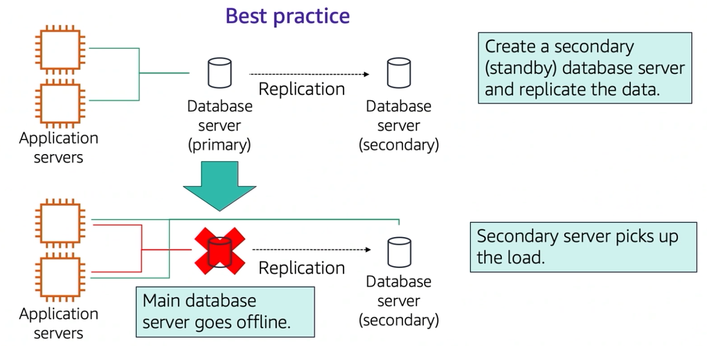
- **Choose the right database solutions**
  - acceptable latency, max concurrent users, data integrity.
- **Design services, not servers**
  - use AWS services to connect your infrastructure.
  - containers(docker), ephemeral(IaC), Queues handle communication between applications.
  - static assets stored in S3.
- **Enable Scalability**
  - dynamic scale based on load. increase availability.
- **Optimize for cost**
  - CapEx: capital expense. One-time investments in long-term assets. (e.g. hardware servers)
  - OpEx: operational expense. Ongoing costs associated with running the project. (e.g. software license, pay-as-you-go).
- **Secure your entire infrastructure**
  - encrypt data transit and rest.
  - network isolation.
  - least privilege access. MFA.
  - traceability(log every change, access).
  - IaC. automation ensures consistent security.
- **Treat resources as disposable**
  - Infrastructure as Code (IaC). declarative control infrastructure.
  - terminate resources not in use.
- **Use loosely-coupled components**
  - avoid tightly-coupled resources.
  - 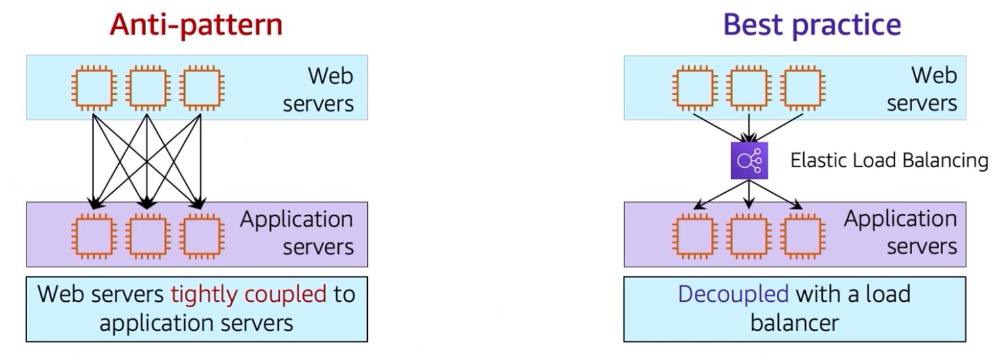
- **Use Caching**
  - request are faster, increase data throughput.
  - 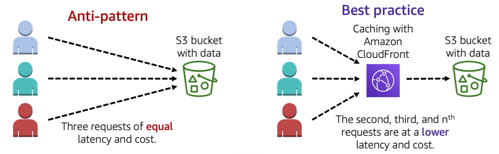

## Authentication, Authorization and Security

- <a href="#Table-of-Contents">Table of Contents</a>
- **ABAC**
  - Attribute-Based Access Control. If both principal(user, group, role) have same tag as resource, policy is applied.
  - combine with **Tagging** to define permissions.
  - **Create ABAC**
    1. create identities(user, roles). Tag with labels.
    2. tag new resources. create policy that new resources must have certain tags. (e.g. 'project' tag and 'team' tag).
    3. configure permissions.
  - 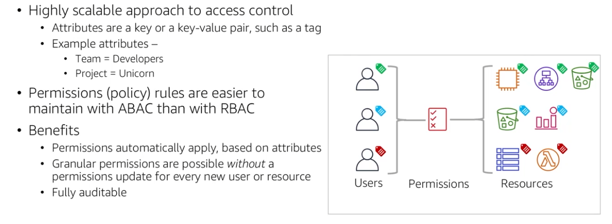
- **Network Access Control List (ACL)**
  - stateless firewall. scoped at the **subnet level**.
  - **allow inbound/outbound traffic** by default.
  - **Network ACL**: one-to-many subnets.
  - **subnet**: one-to-one Network ACL.
  - 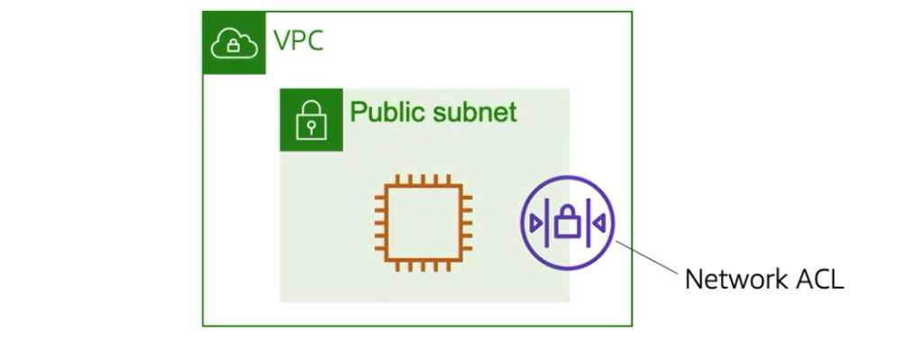
  - 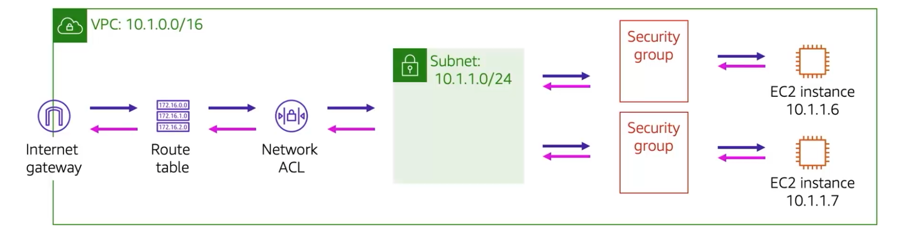
  - **Custom Network ACL**
    - default **deny in/outbound traffic**.
    - very rare use cases. not advised to use.
- **Bastion Hosts**
  - public entrypoint. typically firewalled, out to private network.
  - minimize entry points.
  - bastion security group must add **allow in** from **internet**.
  - private subnet security group must **allow in** from **bastion**.
  - 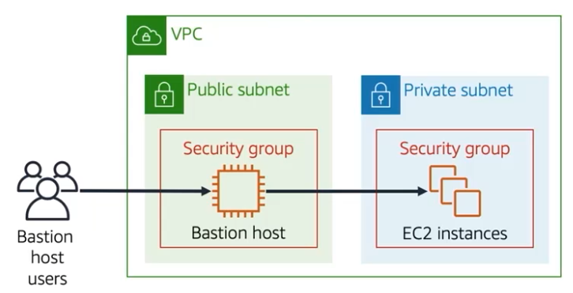
- **Certificate Manager (AWS)**
  - <https://docs.aws.amazon.com/acm/latest/userguide/acm-overview.html>
  - ACM can be used to obtain an **SSL/TLS certificate** and **attach** it to the **AWS services**(e.g. ALB).
    - This allows **encrypted communication(data in transit)** between the clients and the AWS service.
  - **Secure communication between connected resources** on private networks, such as servers, mobile and IoT devices, and applications.
  - Provision and manage SSL/TLS certificates(X.509 certificates and keys) with AWS services and connected resources.
- **IAM**
  - Identity and Access Management. Authentication(prove identity) and Authorization(**permissions**(CRUD)).
  - supports **Active Directory** and standard identity providers.
  - fine-grained access
  - **root user**: full access. **avoid using for common task**. enable **MFA**. least privilege.
  - IAM Federation -> combine existing user accounts with AWS, uses SAML, Active Directory.
  - 
- **IAM Group**
  - **IAM users** granted identical authorization.
- **IAM Policy**:
  - <https://docs.aws.amazon.com/service-authorization/latest/reference/list_awsidentityandaccessmanagementiam.html>
  - **JSON** list of defined permissions of what IAM user can and cannot do.
  - **principal**: privileges are granted to principals(IAM user, role, AWS services).
  - default **deny**. **allow** must be **explicit** or **everything denied**.
  - **explicit** deny **overrides allow**.
  - 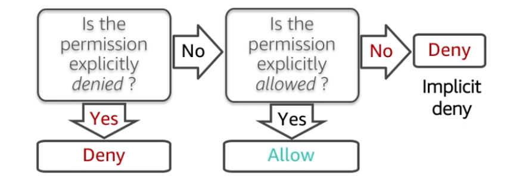
  - **Identity-Based Policy**: attach to IAM principal(user, group, role).
    - define what actions that identity can perform, on which resources, and under what conditions.
    - **AWS managed**: standalone, administered by **AWS**.
    - **Customer managed**: standalone, administered by **you**.
      - Suggested to use managed policies, not inline, to view all policies in the console.
    - **Inline Policy**: you create and manage. embedded in a single IAM identity (user, group, role), exists only on IAM Identity-Based Policy.
  - **Resource-Based Policy**: attach to **AWS resource**. **always inline**. **no managed** policies. (e.g. EC2 read access S3 bucket).
    - define which actions a specified principal can perform on that resource and under what conditions.
  - 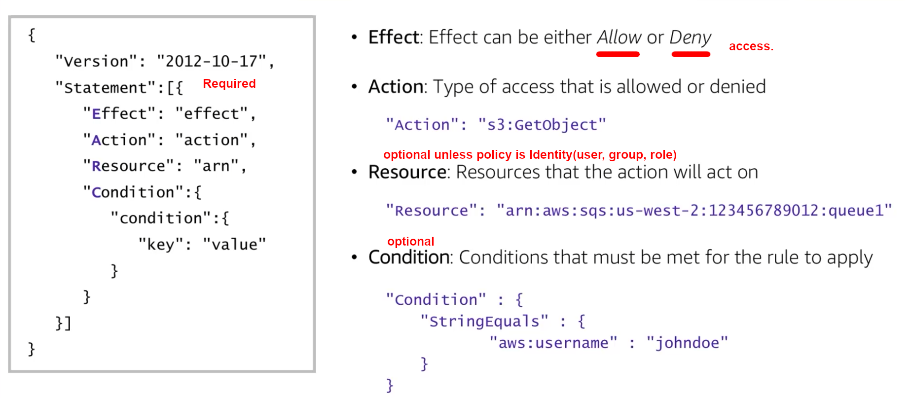
  - 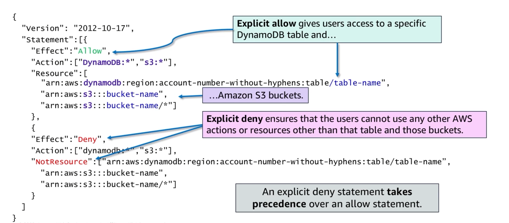
  - **ARNs**
    - Amazon Resource Name. identifies resources.
    - Syntax: `arn:partition:service:region:account:resource`
    - (e.g. `arn:aws:iam::123456:user/mmajor`)
  - **Wildcards**: `*` include all. (e.g. `s3:*`, `iam:*AccessKey*`)
- **IAM Role**
  - tool for granting **temporary** access to AWS resources.
  - **assumable** by a **person, application, or service**.
  - you must be **granted permission to switch to the role**.
  - **AWS STS**
    - Security Token Service. enables request of **temporary limited-privilege credentials**.
    - cross account or **federated** access.
- **IAM User**
  - authentication, assumed programmatically, credentials do expire.
  - IAM user is **person** or **application** that must make **API calls** to AWS products.
  - Each user **must have a unique name** (with no spaces in the name).
- **Identity Federation**
  - user is authenticated by system external to the AWS account.
  - allow access without having to create IAM users.
  - 
  - **Identity Federation: Three Options**
    1. **AWS STS**: Security Token Service. enables request of **temporary limited-privilege credentials**.
       1. **identity service providers (IdPs)**: Microsoft Active Directory, or custom identity broker.
       2. 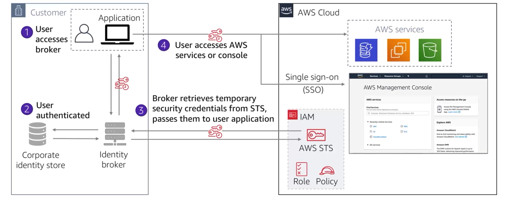
    2. **SAML**: security assertion markup language.
       1. 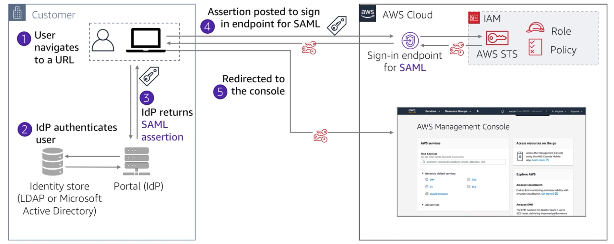
    3. **Amazon Cognito**: web identity provider.
       1. fully managed, **authentication**, **authorization**, and **user management** for **web** and **mobile** apps.
       2. creates **user pools** and **identity pools**.
       3. **OpenID Connect (OIDC)**: open source identity management. (e.g. Facebook, Google or SAML auth).
       4. 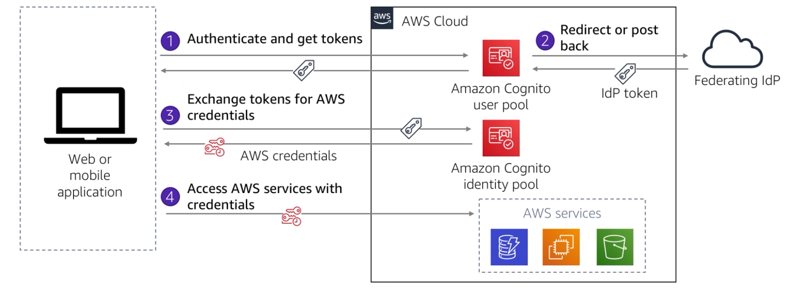
- **KMS (AWS)**
  - <https://docs.aws.amazon.com/kms/latest/developerguide/overview.html>
  - Key Management Service. create/manage **cryptographic keys** that are used to **encrypt** your **data** at **rest**.
  - **AWS CloudTrail**: log use of your KMS keys for auditing, regulatory, and compliance needs.
    - monitor and investigate how and when your KMS keys have been used and who used them.
  - **KMS HSM**: hardware security modules (HSM) to protect and validate your AWS KMS keys under the FIPS 140-2.
  - **Symmetric Keys**: **default** key. most common type. encryption at **rest**.
  - **Asymmetric Keys**: **public** key and **private** key pair. **SSL/TLS**(**HTTPS**) in **transit**.
    - <https://docs.aws.amazon.com/kms/latest/developerguide/symmetric-asymmetric.html>
  - **Custom Key Stores**:
    - <https://docs.aws.amazon.com/kms/latest/developerguide/concepts.html#keystore-concept>
    - custom key manager outside of AWS KMS that **you own and manage**.
- **Organizations (AWS)**
  - large organizations typically isolate business departments with multiple accounts.
  - AWS Organizations centralize management, consolidate billing, and enforce policies across multiple AWS accounts.
  - **SCPs**: service control policies. create top level policy that **cannot be overridden** by local account admins.
    - **explicit allow** or it's denied.
    - **cannot** be **overridden** by local AWS **account admins**.
  - 
- **RBAC**
  - Role Based Access Control. you create admin role, developer role... then assign them to user. time consuming.
- **Security Groups**
  - **Stateful Firewalls**: instance level. policy with **allow/deny rules** to ports and IPv4/IPv6.
  - stand alone policy and can be **attached** to **multiple instances** or **combined** with **other security groups**.
  - **default** inbound:block, outbound:allow.
  - **Scope**: region/VPC.
  - **Errors**
    - **Timeout**: blocked by security group.
    - **Connection Refused**: application error. traffic went through to EC2, but EC2 did not respond.
- **Root User**
  - highest level of privileges. Only one with **default** access to billing information.
  - best practice to not use root.
- **Tagging**
  - use tagging to label users. **50** tags per resource.
  - key = value.

## Automation

- <a href="#Table-of-Contents">Table of Contents</a>
- **Automation**
  - **without** automation it is a long **manual process** to build architecture.
  - 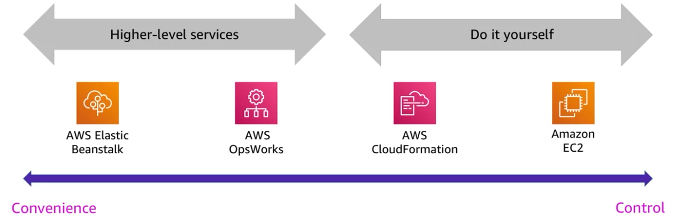
- **CloudFormation (AWS)**
  - IaC. simplify infrastructure management. **model, create,** and **manage AWS resources** .
  - **Stack**: YAML or JSON format. creates a 'stack'(becomes the running environment).
    - **Update Stack**: update change to template.
    - **Delete Stack**: remove all template resources.
    - **Detect Drift**: detects modified infrastructure outside the CloudFormation template.
  - **Version control**: when uploaded to S3, Github, or AWS CodeCommit.
  - **AWS CloudFormation Designer**: GUI drag-n-drop design tool.
  - 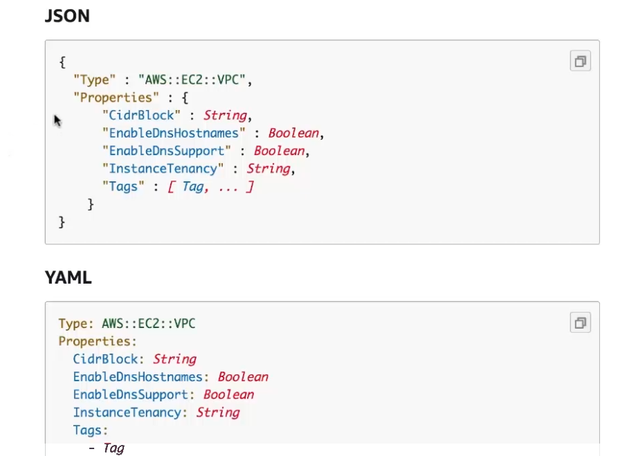
  - 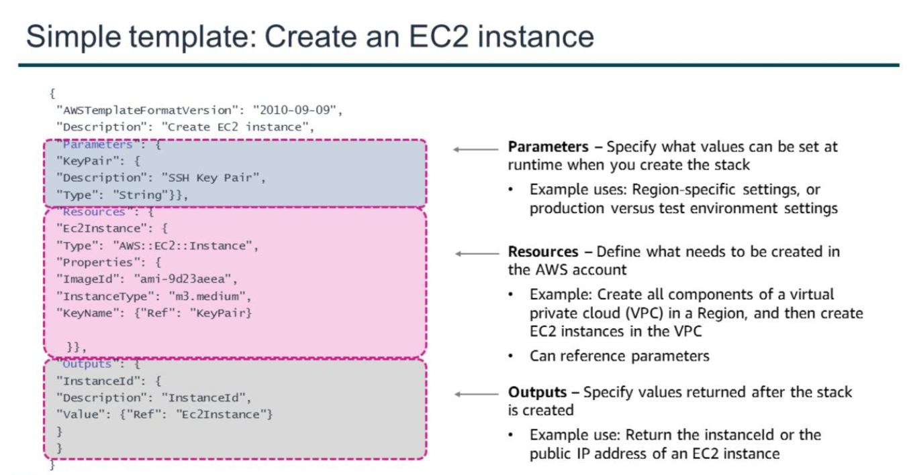
  - **Change Set**: preview changes **before** implementing them.
  - 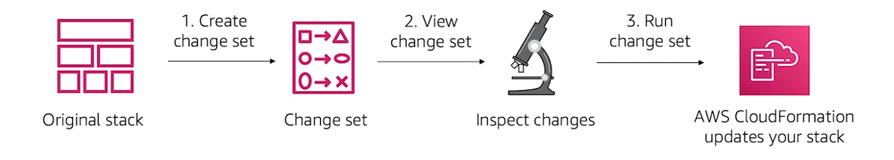
  - **Scope**: **Region** scoped.
  - Organize templates the same you would a website: frontend, backend, network, security...
  - **AWS Quick Starts**: template examples maintained by AWS.
    - develope your infrastructure using **patterns and practices** from Quick Start.
    - provides code with **best practices**.
- **Elastic Beanstalk (AWS)**
  - **managed service** to quickly get **Web Applications** up-and-running.
  - automatically handles: deployment, load balancing, scaling, health monitoring, analysis and debugging, logging.
  - you pay for resources used.
  - 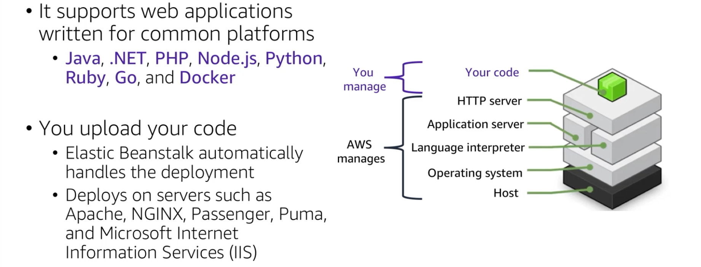
  - 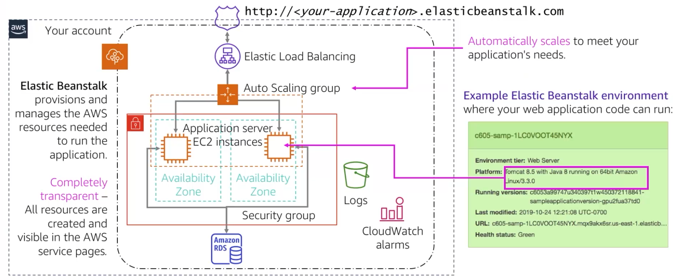
- **IaC**
  - Infrastructure as Code. rapid deployment, consistency, reusable, repeatable, maintainability.
  - 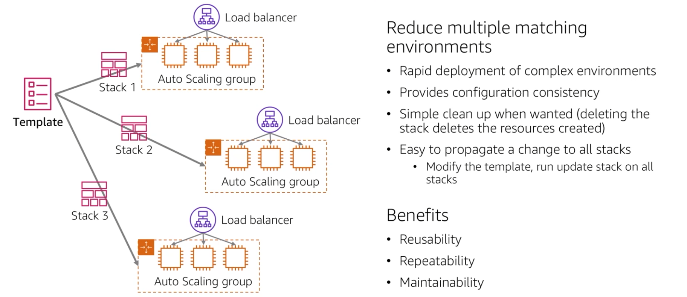
- **OpsWorks (AWS)**
  - **End of Life: May 26, 2024**. should not be testing or training you for it! Update your training material!!!!!
  - <https://docs.aws.amazon.com/opsworks/latest/userguide/welcome.html>
  - <https://docs.aws.amazon.com/opsworks/latest/userguide/stacks-eol-faqs.html>
  - Replaced by **AWS Systems Manager**.
  - **configuration management service**. provides **Chef, Puppet, Stacks** for automation tools.
  - **Chef Recipes**: implement individual stack layers.
  - **CloudFormation and OpWorks** compliment each other.
  - 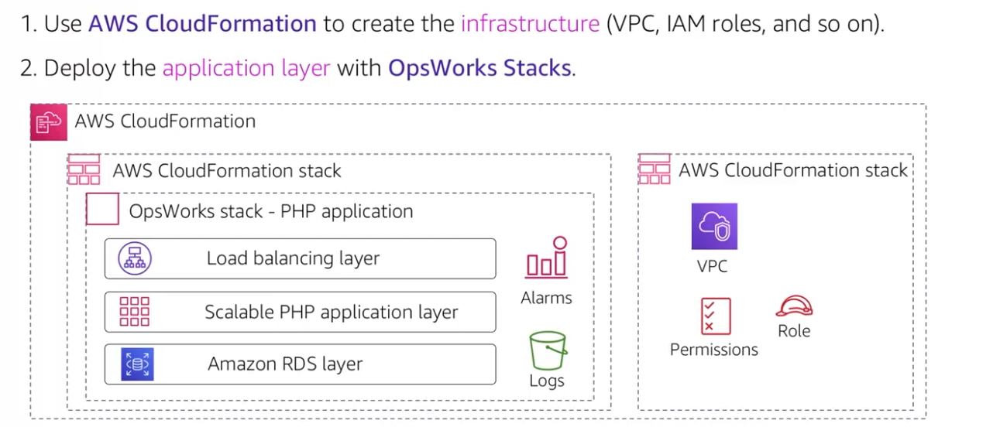
- **Systems Manager (AWS)**
  - AWS version of **Ansible**. for managing massive scale of instances. updates/patches. on-prem/cloud.
  - **SSM Agent**: install on **EC2** instance or **on-prem** computer.
    - data is sent back to Systems Manager.
    - Run commands, update/patch **remotely** without needing a Bastion Host.
  - 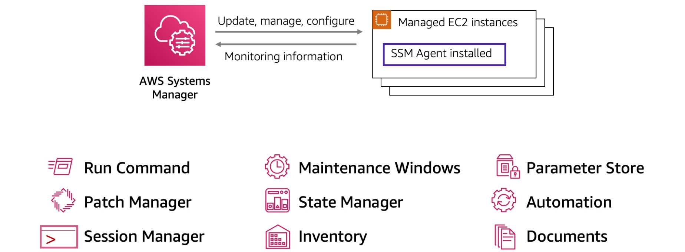

## Caching

- <a href="#Table-of-Contents">Table of Contents</a>
- **Caching**
  - **high speed data storage layer**.
  - distance from **origin server** to client induces latency.
  - improve performance(high **throughput**) of data retrieval and reduce **latency**. using edge locations.
  - **Best Practice**
    - data that requires **slow, expensive query**.
    - **frequent** request for **static data** that can be **stale** for some time.
  - 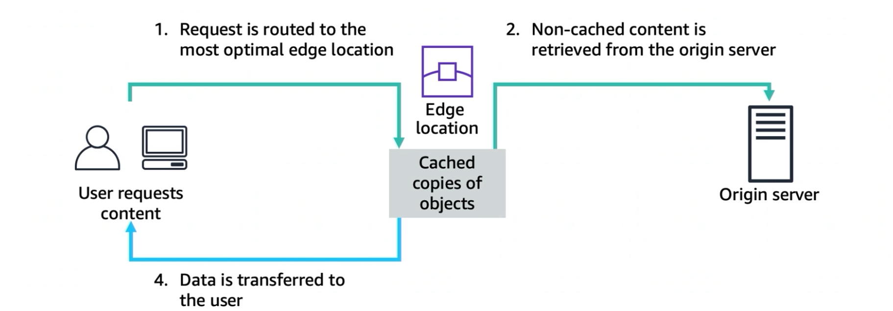
- **CloudFront**
  - **Content Delivery Network**: globally distributed system of caching servers.
  - AWS CDN(content delivery network) edge network. supports **websockets** and **HTTPS**.
  - **AWS Shield Standard**: extra layer of security(DDOS). resilient. -no extra cost.
  - **AWS Certificate Manager**: create/manage **SSL** certs. -no extra cost.
  - **Resilient**: DDOS protection and DNS Route 53(distribute across Edge locations).
  - over 200 points-of-presence (PoP), edge locations and **edge caches**. (e.g. share S3 assets all over the world).
  - 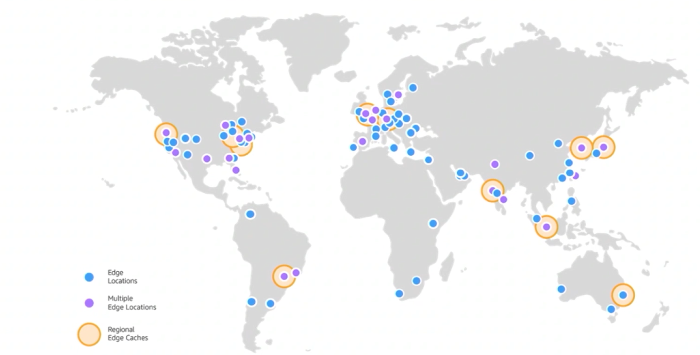
  - **Setup**: specify **origin server**, configure **distribution**.
  - 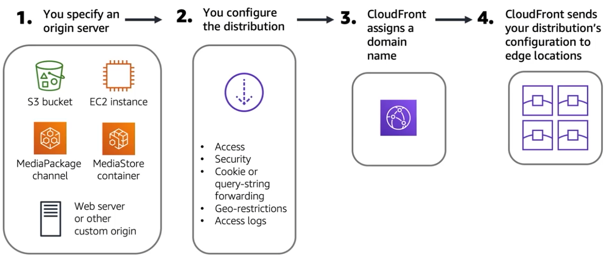
  - **Edge Cache**: sometimes called **PoP (point of presence)**. **frequent** content, **close** to your users.
  - **Regional Edge Cache**: larger cache so **longer shelf life**. **origin** to Edge Caches.
  - **Expire Content**
    - **TTL**: time-to-live. specify length of time.
    - **Change Object Name**: use versions.
    - **Invalidate Objects**: not recommended. you force delete objects from CDN.
- **Caching Databases**
  - reduce cost, latency, volume of DB reads.
  - **Amazon DynamoDB Accelerator (DAX)**: extremely performant(microsecond-scale response time).
    - adds **in-memory**(RAM) acceleration.
  - 
  - **Remote or Side Cache**: adjacent to database.
    - key:value NoSQL in-memory store. typically for **Redis** or **Memcached**. read-heavy workloads.
  - 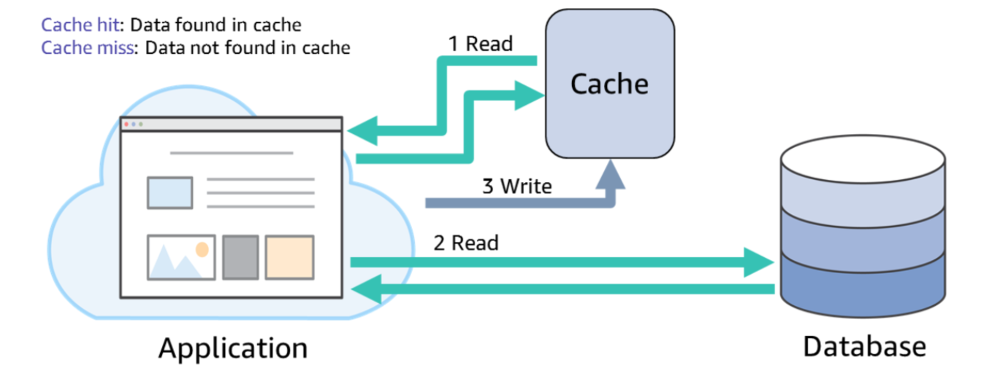
  - **Elasticache**: fully managed, **side cache**. web application(web sessions, state) in-memory data store.
    - supports **engines**: Memcached(**20** cache nodes, horizontal scale, no multiple AZs) and Redis(**250** cache nodes, complex memory types).
    - **node**: smallest block of **network-attached RAM**. each node is independent, has own **DNS name** and **port**.
    - **cluster**: logical group of nodes.
    - **Scope**: region. multiple AZs.
    - **Lazy Load**: app request Elasticache data. If not exist, app ask database. app writes data to Elasticache.
      - advantages: only requested data is cached. **stale data**.
    - **Write-through**: data is written to database and Elasticache. **real-time data updates**.
    - **TTL**: stale data is updated when TTL expires.
  - 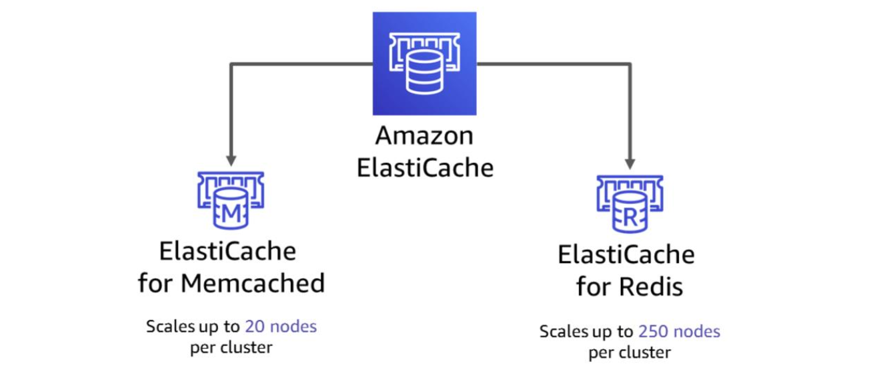
  - 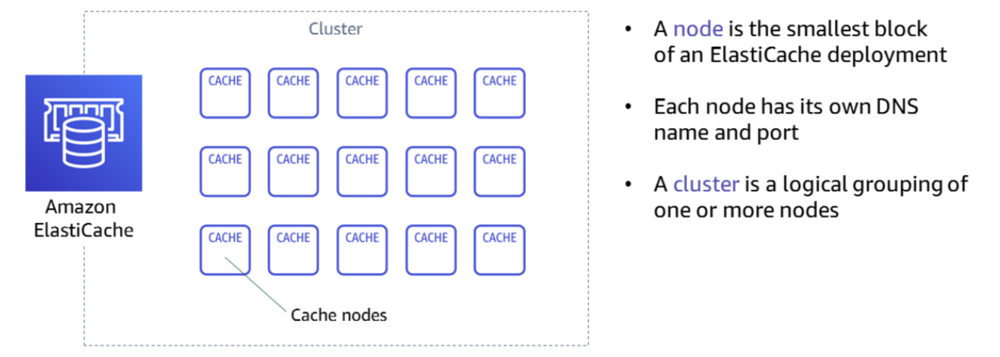
- **Caching Web Sessions**
  - **sessions**: manage user **authentication** and store **data** while user interacts with application.
  - **Sticky Sessions**: ELB uses cookies to route traffic to instance with session.
    - by default an ELB will route to smallest load, but with sticky sessions, ELB routes to same instance.
    - if instance fails, session is lost.
    - prevents ELB from truly balancing the load.
  - **Distributed Cache**: store session data in cache. solves single-point-failure and load balancing sessions.
    - can also use **DynamoDB** to persist sessions.
  - 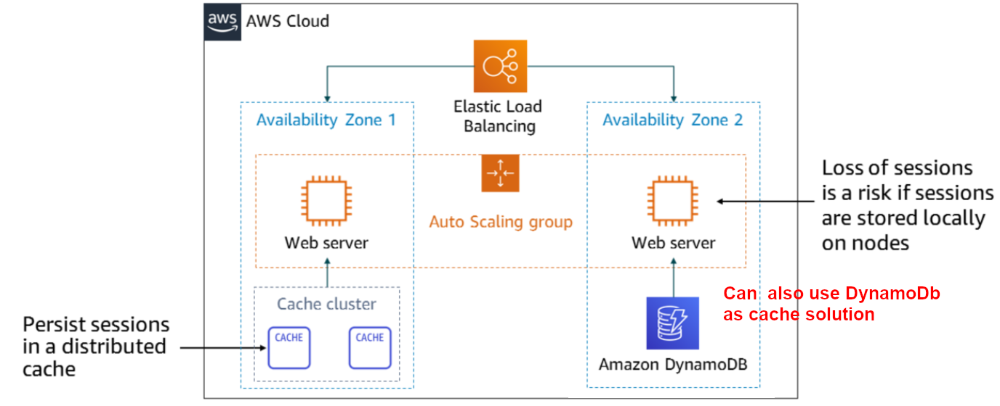
  - 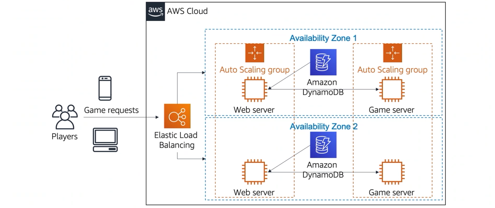

## Compute

- <a href="#Table-of-Contents">Table of Contents</a>
- **Compute**
  - higher infrastructure customization <--> faster deployment.
  - 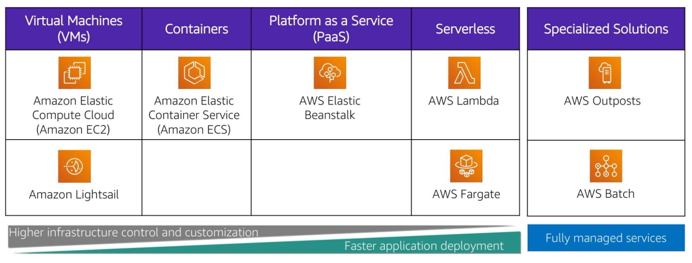
  - 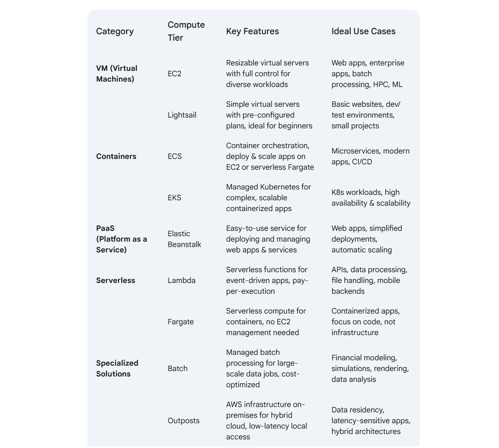
- **Containers**
  - **ECS**
- **PaaS**
  - **AWS Elastic Beanstalk**
- **Serverless**
  - **AWS Lambda**: only pay when runs.
  - **AWS Fargate**: run serverless containers.
- **Specialized**
  - fully managed
  - **AWS Outposts**: run AWS services on-prem.
  - **AWS Batch**: any scale batch(background) jobs.
- **Virtual Machines**
  - **EC2**
    - <https://docs.aws.amazon.com/AWSEC2/latest/UserGuide/concepts.html>
    - resizable VM instance. pay-as-you-go(CPU, memory, EBS, networking). when stopped, only pay **EBS**.
    - **Amazon Machine Image (AMI)**: the blueprint of VM instance. **region specific**.
      - **HVM**: hardware virtual machine. best performance.
    - you can only stop/start **EBS** backed AMI.
    - Storing data on virtual drives (EBS)
    - Distributing load across multiple machines (ELB)
    - Scaling the services using an auto-scaling group (ASG)
  - 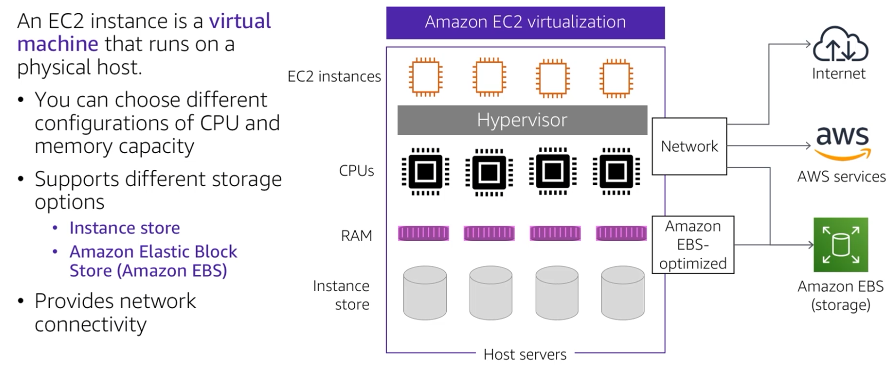
  - 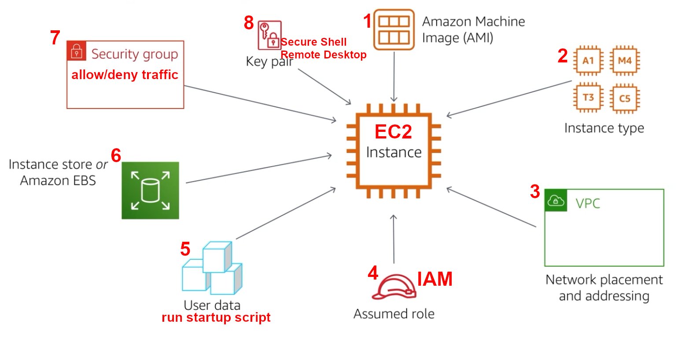
  - **EC2 Instance Type**
    - <https://aws.amazon.com/ec2/instance-types/>
    - <https://docs.aws.amazon.com/ec2/latest/instancetypes/instance-type-names.html>
    - **EC2 Instance type**:
      - **General Purpose**: **cheapest** of all options. balance of compute, memory, network.
      - **Compute**: **high CPU** usage. media transcoding, high performance web server.
      - **Memory**: large **dataset in-memory**.
      - **Accelerated Computing**: **GPU**. floating point number calculations. AI.
      - **Storage**: high **read/write** access to large datasets. **Database**.
      - **HPC**: high performance computing. **deep learning models**.
    - **New Generation Instance types**: better price-to-performance ratio.
    - **AWS Compute Optimizer**: analyze running instances. recommends 'right-sized' EC2.
    - 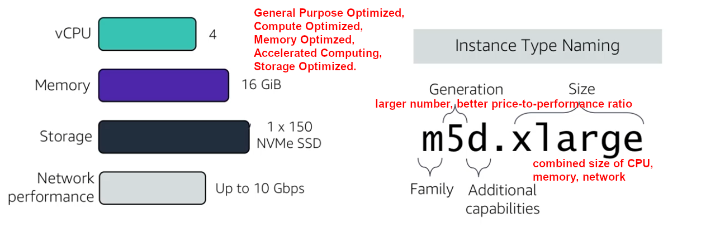
  - **EC2 Placement Groups**
    - control Availability Zone where instances run. logical grouping to create **low latency** between running **instances**.
    - instance can launched in only one placement group. **dedicated host** **cannot** run in placement group.
    - **Cluster**: lowest-latency and high packet-per-second network. **same server rack**.
    - **Partition**: low-latency with reduced correlated hardware failure risk. **same or different server racks**.
      - good for low-latency with large volume of instances.
    - **Spread**: low-latency. at least one instance is in **another Availability Zone**.
  - **EC2 Storage**
    - **instance store**. default. create with EC2. ephemeral storage. **cannot stop, only terminate**. (e.g. buffers, cache, scratch data).
    - **EBS**: elastic block store. **persistent** block-storage volumes. **root volume**
      - **single instance** only. can be detached and **moved** to **any single instance** in same **Availability Zone**.
      - **AWS KMS** can be used to **encrypt** the **EBS** at **rest**.
      - **EC2 with EBS** can be placed in **hibernation** and shutdown. preserves **RAM memory**.
      - **EBS Optimized**: dedicated network, higher I/O.
      - 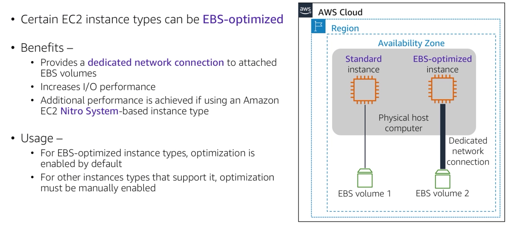
    - **EFS**: elastic file system. **data volume** that serves **multiple Linux instances**. **NFS** protocol.
      - must be mounted: `sudo mount -t nfs4 mount-target-DNS:/ ~/efs.mount-point`
    - **FSx**: Windows file server. **data volume** that serves **multiple Windows instances**. **SSD** only.
      - **NTFS, SMB, DFS, Active Directory, ACLs**.
    - **FSx for Lustre**: ML or AI. access big data analytics. connects to **HCP** compute.
  - **EC2 Elastic IP**
    - fixed IP address. avoid due to 'pool' architecture.
    - use **DNS** mapped to random IP's.
  - **EC2 Tiers**
    - **per-second billing**: only on **Linux/Ubuntu**. others per-hour.
    - **On-Demand**: short, unpredictable workload.
    - **Reserved**: 1 - 3 year commitment. **EC2 only**.
    - **Savings Plan**: same discounts as Reserved. 1 - 3 year commitment.
      - flexible: **EC2, Fargate, Lambda, instance family, size, OS, tenancy, region**.
    - **Spot Instance**: cheapest. for short ephemeral workloads. risk of losing the instance while running.
    - **Dedicated Hosts**: physical servers(hardware) dedicated to you. single tenancy.
    - **Best Practice**: use **combination** reserved, savings-plan, on-demand, spot to save money.
    - 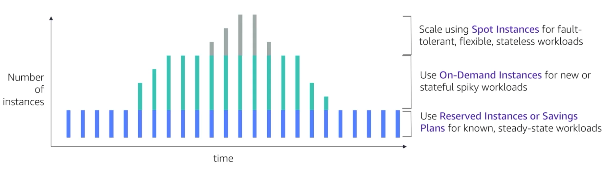
    - 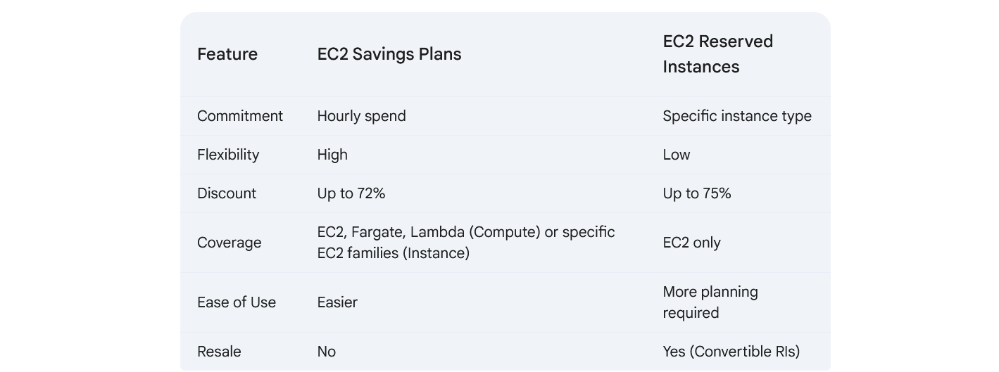
  - **EC2 User Data**
    - script run as **root** only once during the **initial EC2 instance start**.
    - **Instance Metadata URL**: must run from inside instance.
    - **Baking**: custom AMI(decrease boot time) <--> just enough AMI(decrease build time).
    - 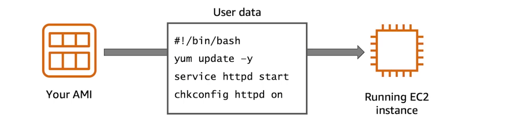
    - 
    - 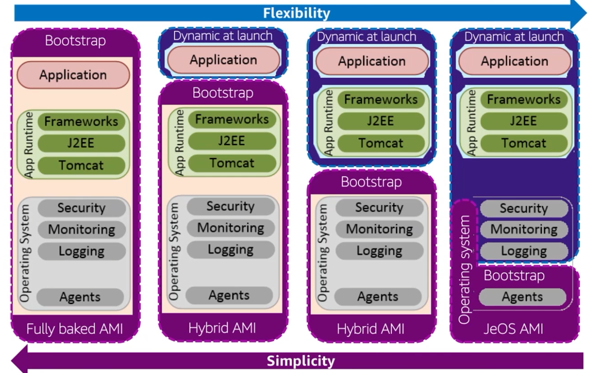

## Database

- <a href="#Table-of-Contents">Table of Contents</a>
- **Database**
  - **choose database**: scalability, storage requirements, type and size of objects, durability.
  - **AWS KMS**: can be used to **encrypt** database storage at **rest**.
  - **ACM**: AWS Certificate Manager. used to obtain an **SSL/TLS certificate** and attach it to the ALB. This **encrypts** the **data in transit** between the clients and the ALB.
  - 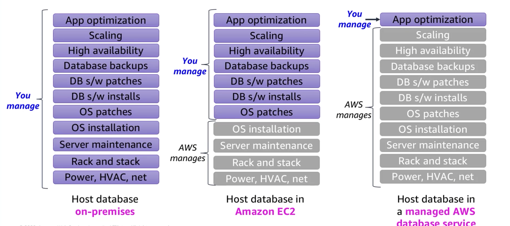
- **Relational Database**
  - strict schema rules. provide data integrity. SQL.
- **Non-Relational Database**
  - scale horizontally. higher flexibility. semi-structured and unstructured data.
- **Database Migration Service (DMS)**
  - **migrate** or **continuous replication** of **on-prem** database to AWS.
  - can **transform** data into desired AWS format. (e.g. on-prem MySQL to Amazon Aurora format).
  - 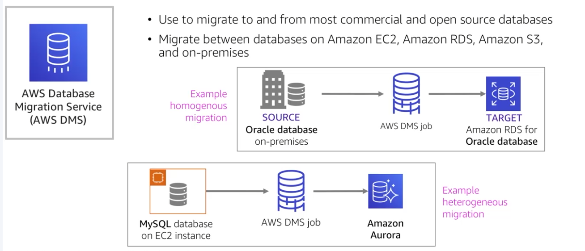
  - **AWS Schema Conversion Tool (AWS SCT)**
    - change database engine between source and target.
  - **AWS Snowball Edge**: migrate multi-terabyte data.
  - 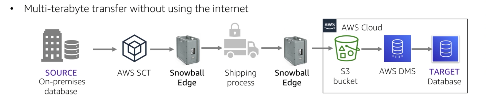
- **Read Replica**
  - continuous **read-only copy** of database. immutable. **RDS** max **five** read replicas.
  - **primary**: read/write. **secondary**: read-only.
  - allow scale out for heavy **read** workloads.
  - 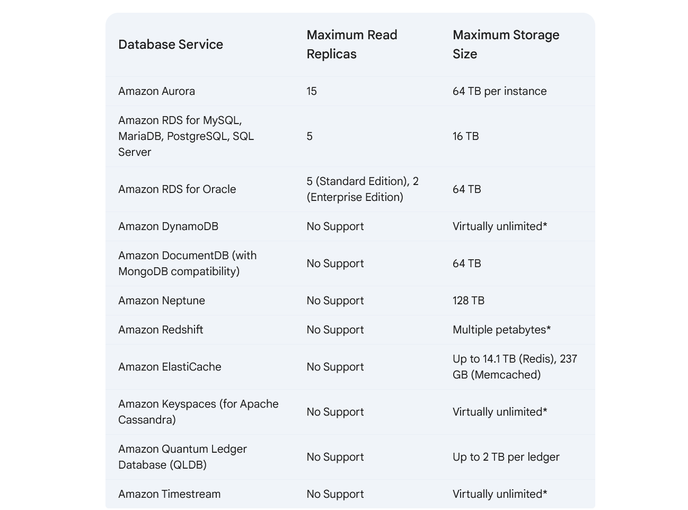
- **Relational Database Service (RDS)**
  - fully AWS managed, SQL database. you bring the data.
  - options: **Microsoft SQL Server, Oracle, MySQL, PostgreSQL, Aurora, MariaDB**.
  - multi-AZ deployments provide high availability.
  - 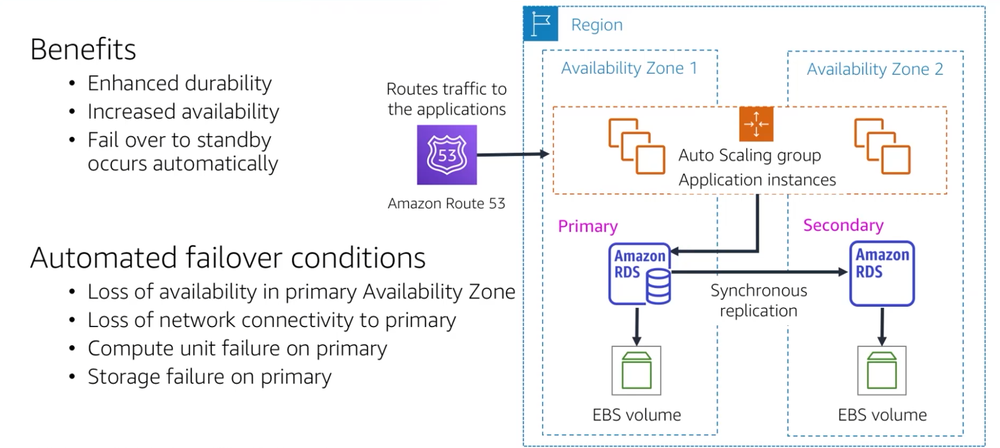
  - **Backup**
    - snapshot to S3 bucket.
  - 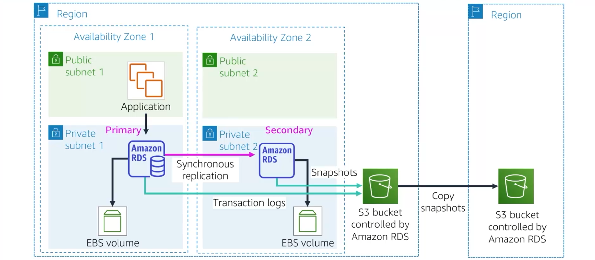
  - **Aurora**
    - AWS 'flagship' SQL database. 5x faster, S3 continuous backup, **15** read replicas, **3** Availability Zones.
    - fully managed MySQL, PostgrSQL compatible, **OLTP**(high concurrent users) database.
    - auto scaling database when combined with RDS.
  - **Security**
    - run RDS in **VPC**(isolation and firewall).
    - **AWS IAM policies** for **access**. **built-in security features of DB engine** control **login**.
    - **security groups**(firewall) control allowed IP addresses.
    - **SSL** encryption in **transit**.
    - enable **encryption** at rest.
    - enable alerts for important RDS events.
- **Amazon Redshift**
  - petabyte scale **data warehousing** service(highly structured, frequently accessed). does **NOT** run on **RDS**.
  - **does not support read replicas**
  - **OLAP**: online analytical processing.
- **Amazon DynamoDB**
  - **fully managed**, **serverless**, non-relational, **key-value**, and document **NoSQL** database service.
  - multi-AZ/Region, **horizontal scaling**, **low latency**. (e.g. gaming, adtech(shopping cart), mobile).
  - does not enforce fixed schema(cannot JOIN).
  - **Primary Key**: also known as **partition or hash key**. uniquely identify row. only **required** attribute.
  - **Partition**: key:value section. allows easier scale/replication.
  - 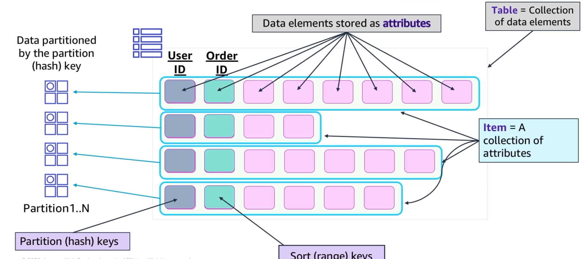
  - **Global Tables**
    - replicate Database across multiple regions(geographies).
    - **multi-master**: all data tables are fully managed and kept in sync.
  - 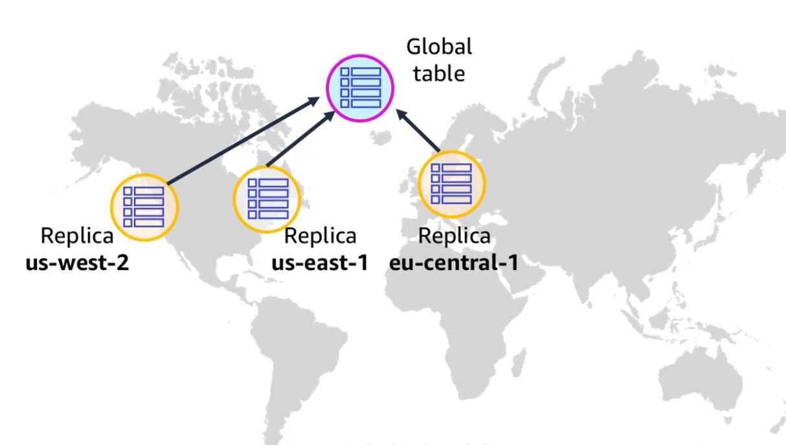
  - **Consistency**
    - **Eventually**: default. read-write within 1 second.
    - **Strongly**: all databases write operations must complete, before read of data is allowed.
  - 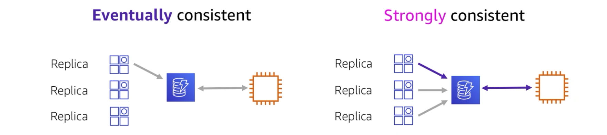
  - **Security**
    - **IAM roles** for access.
    - **IAM policies** for fine-grain access to DynamoDB APIs. least privilege.
    - **VPC endpoints**. limit traffic to only defined routes. limits API access.
    - **client-side encryption**. confidential data is encrypted close as possible to its origin.
    - **encryption in transit and at rest**. default. DynamoDB uses **HTTPS** in transit.

## Disaster, Backup and Recovery

- <a href="#Table-of-Contents">Table of Contents</a>
- **AWS Backup**
  - policy that determines when and how you want your AWS resources backed up.
- **DataSync**
  - <https://docs.aws.amazon.com/datasync/latest/userguide/how-datasync-transfer-works.html>
  - data transfer and discovery service. one-time or recurring.
  - secure data migration of file or object data **to**, **from**, and **between** AWS storage services.
  - 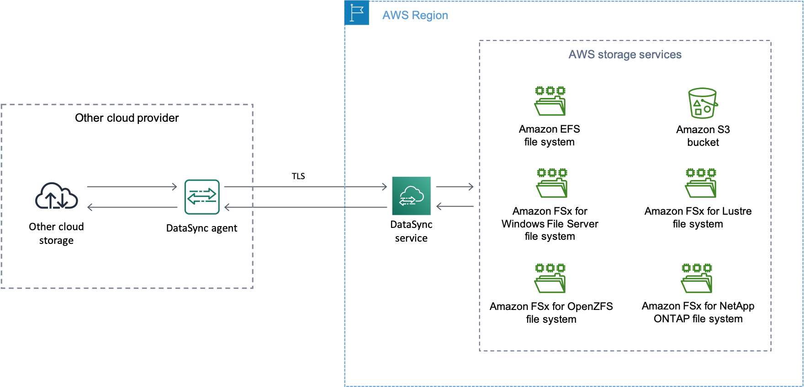
- **Disaster Recovery**
  - each option below is based on RPO/RTO and cost-effectiveness.
  - start simple: create backups. practice Game Day: run test to verify redundancy.
  - 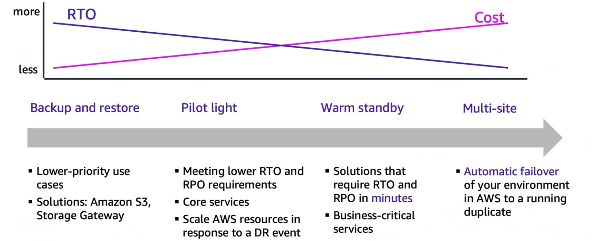
  - **Backup and Restore**: backup to S3. time consuming to transfer data from storage.
  - **highest RTO, highest cost-effective**.
  - recover within a **day**.
  - 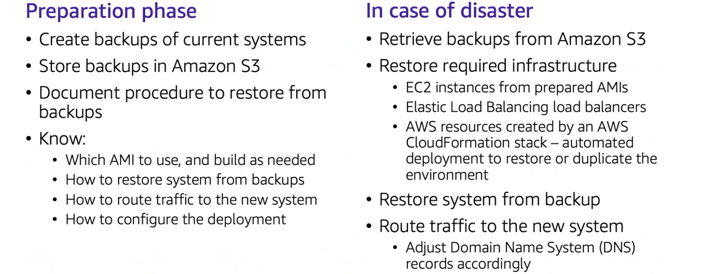
  - **Pilot Light**: run secondary database as backup in another Region.
    - the most time consuming is restoring data. with data already in place, quickly restore infrastructure.
    - recover in an **hour**.
  - 
  - 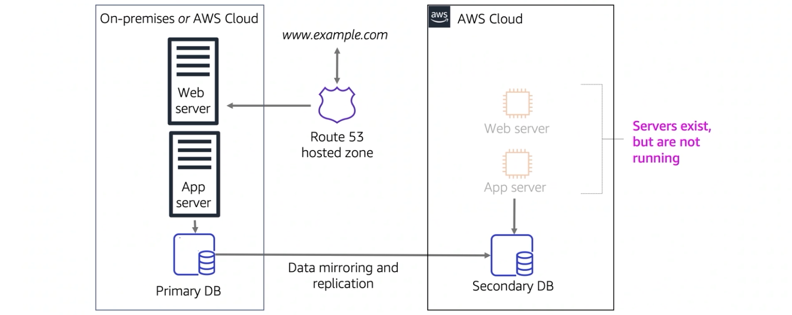
  - **Warm Standby**: scaled down version. business critical resources always running.
    - recover in **minutes**.
    - similar to pilot light, but keep critical business.
  - 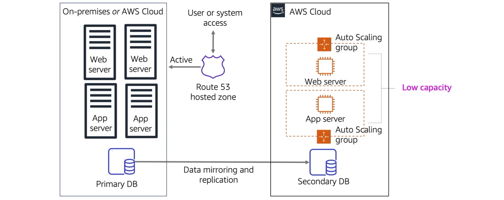
  - **Multi-site**: complete copy of infrastructure.
    - **Fastest RTO**, most expensive.
    - recover **instantly**.
  - 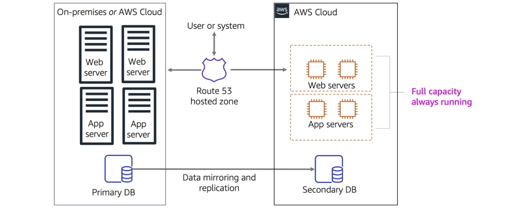
- **RPO (Recovery Point Objective)**
  - maximum data loss measured in **time**. (e.g. 8 hrs from last backup).
- **RTO (Recovery Time Objective)**
  - time it takes to recover from disaster/failure. (e.g. 1 hour to get systems restored).
  - 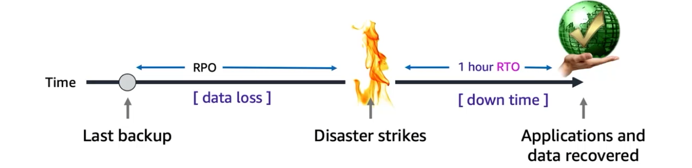
- **Storage Gateway**
  - See <a href="#Network">Network</a>
- **Strategies for Disaster Planning**
  - **High Availability**: minimize how often apps become unavailable. redundancy, failover, scaling.
  - **Backup**: data is safe from deletion/lose.
  - **Disaster Recovery**: IaC and data backups to get back online fast.
  - **Storage and Backup**
    - S3: cross region.
    - EBS: snapshots(incremental only what has changed since last snapshot).
    - EFS/EFX: **DataSync** Region.
  - 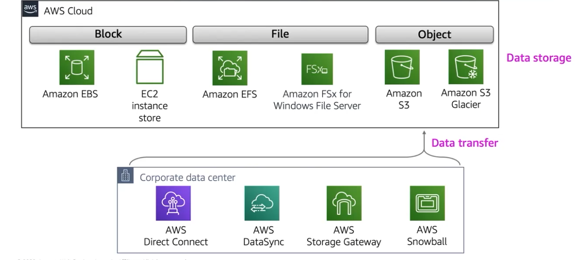
  - **Routing Services**
  - 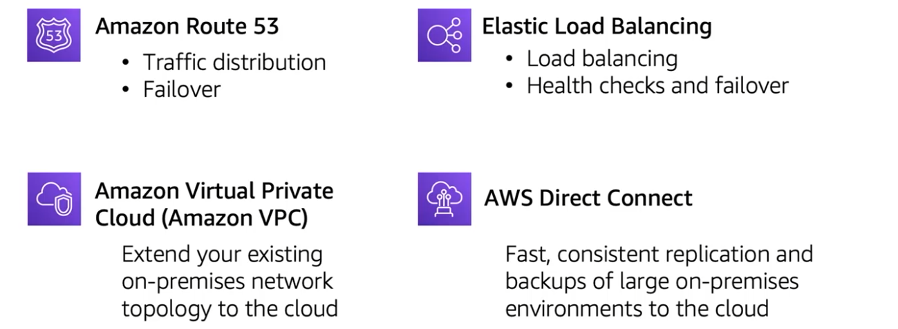
  - **Databases**
  - 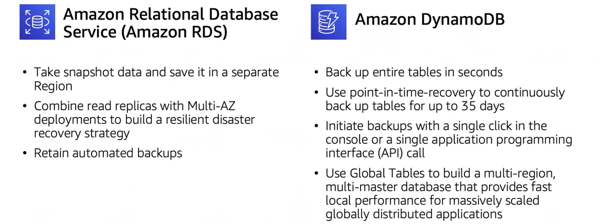
  - **IaC**
  - 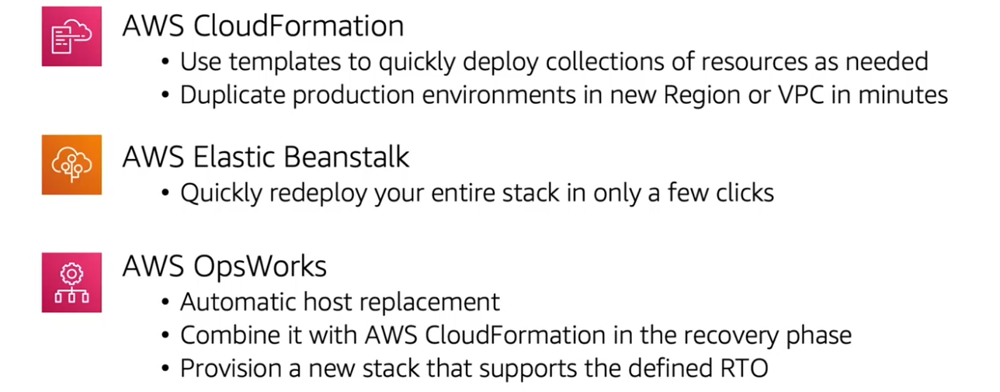

## Geography, Region, Availability Zone

- <a href="#Table-of-Contents">Table of Contents</a>
- **Cloud Architecture**
  - applying cloud-based technology to meet technical and business requirements.
- **Region**
  - Geographical location with **two or more availability zones**. (e.g us-east-1, eu-west-1).
  - Most services provided by AWS are **region scoped**. (e.g. data for a service used in one region is not replicated in another region).
  - China and GovCloud regions have restricted access.
  - **Best Practices**
    - use region with lowest latency to end users.
    - complies with local government law. (e.g. where data is stored, who can access data center...).
- **Availability Zone (AZ)**
  - **one or more data centers** in same Region, separated from each other with redundant power, and networking.
  - networked together through the **AWS backbone network**.
  - **Best Practice**
    - choose AZ that protects against natural disasters.
    - latency reduction for end user.
  - 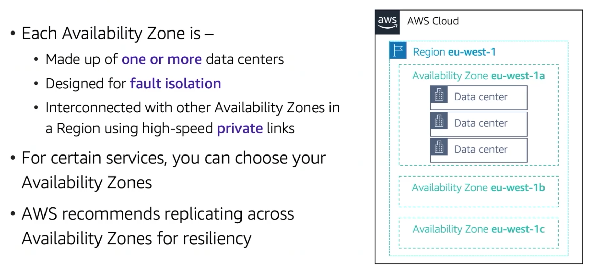
- **AWS Local Zone**
  - extension of Region that is closer to end user(edge). invitation only.
  - compute, storage, database **closer to large populations** where **no Region exist**. (e.g. Los Angeles Local Zone).
- **Data Centers**
  - location of physical servers. redundant hardware, power, cooling, and networking.
  - networked to other data centers through the **AWS PrivateLink(backbone) network**.

## Messaging

- <a href="#Table-of-Contents">Table of Contents</a>
- **Coupled Architecture**
  - tightly coupled architecture is difficult to scale.
  - 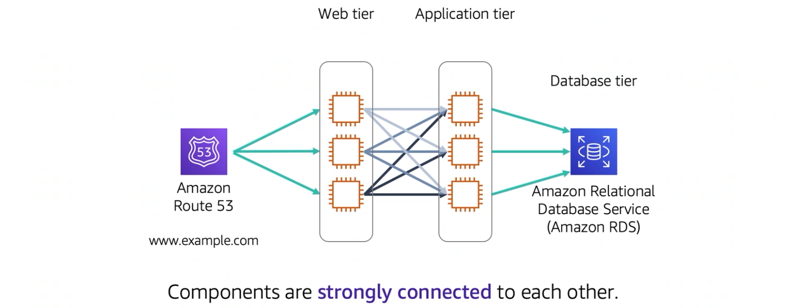
  - **loose coupling**: ELB external and internal can loose couple architecture.
  - 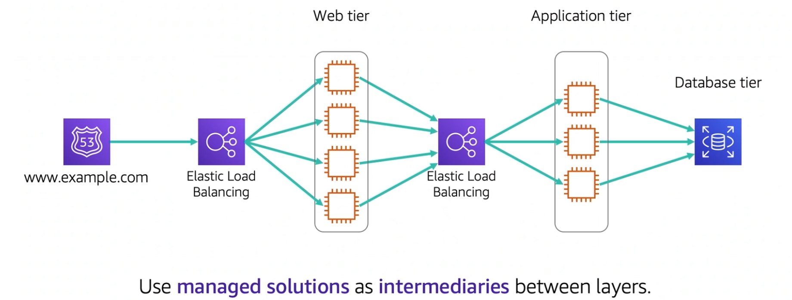
- **SQS**
  - **Simple Queue Service**. temporary repository(default **4** days up to 14 days) for messages waiting to be processed. encrypted.
    - buffer between producer and consumer.
    - max message size: **256 kb**. (e.g. upload large item to S3, send item link to SQS).
  - **single subscriber**: ideal for workflows where **order** and **loss prevention** are **critical**.
  - **Producer**: sender of message.
  - **Consumer**: recipient of message. **polls**(continuous ask Queue) for new message. processes and deletes message during visibility timeout.
  - **Long polling**: batch message delivery.
    - SQS queries all Queue servers for messages, then sends back all messages in single request.
    - reduce Queue congestion.
  - **Visibility Timeout**: default **30 seconds**. period of time no other consumer can 'see' message. allows time for message to be processed and deleted from Queue.
  - **LifeCycle**
    1. producer sends message to SQS.
    2. consumer retrieves message. visibility timeout starts.
    3. consumer processes message and deletes from Queue.
  - **Scope**: region. multiple AZs.
  - **Queue Types**
    - **Standard Queue**: at-least-once delivery. best-effort ordering. nearly unlimited throughput.
    - **First In, First Out (FIFO)**: high throughput. exactly once processing.
    - **Dead-Letter Queue (DLQ)**: no consumer response. send to DLQ storage.
- **SNS**
  - <https://docs.aws.amazon.com/sns/latest/dg/welcome.html>
  - **Simple Notification Service**. pub/sub messaging. notification: email, text message.
  - publishers to send **messages** to **multiple subscribers** through **topics**
  - **FIFO**: first-in-first-out. ensure strict message ordering.
  - **publisher**: sends message to topic.
  - **topic**: holds subscriptions. **pushes** message to subscriber. supports encrypted topics.
  - **subscriber**: subscribes to topic. receives all messages.
  - **Scope**: Region scoped. multiple AZs.
  - 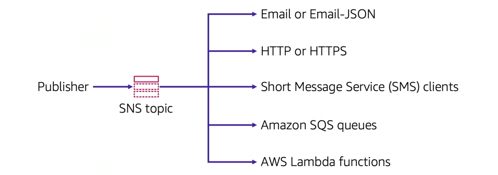
  - **SNS vs SQS**
  - 
- **MQ**
  - hybrid **on-prem** to **message broker** cloud solution. **lift-and-shift**.
  - **message broker**: allows distributed applications communicate.
  - **Apache ActiveMQ**, JMS, NMS, AMQP, STOMP, MQTT, and WebSockets.
  - 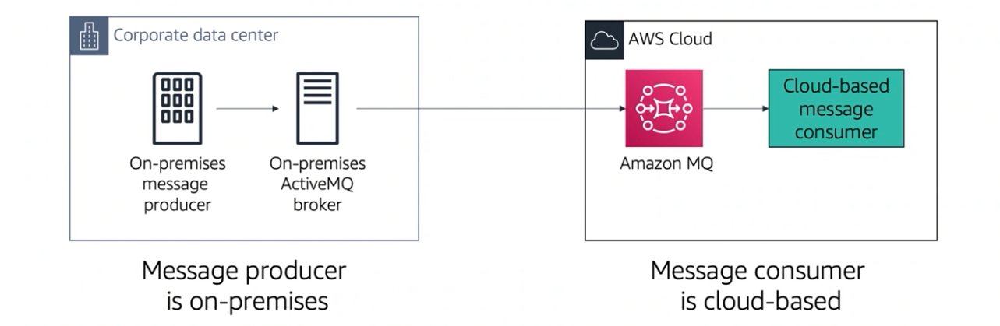
  - 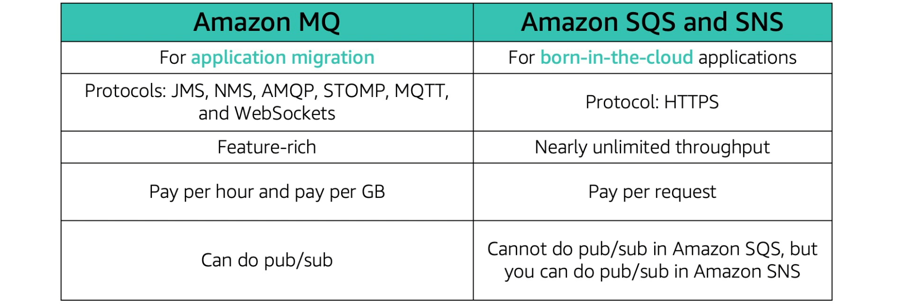

## Monitoring

- <a href="#Table-of-Contents">Table of Contents</a>
- **CloudWatch**
  - collects operational data in the form of **logs**(log files), **metrics**(CPU usage...), and **events**(EventBridge).
  - create **alarms**. send **notifications**. (e.g. **monitor** infrastructure and send alerts to **Auto Scaling** or **SNS**).
  - visualize data through dashboard. can include data from on-prem. **unified view**.
  - **CloudWatch Logs**: monitor EC2 logs.
  - 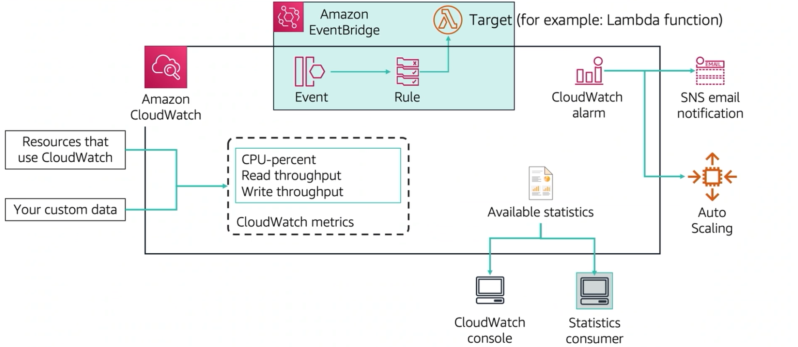
- **CloudTrail (AWS)**
  - enables governance, compliance, and **auditing** of your AWS **account**.
  - provides an **event history of account activity**, including actions taken through the AWS Management Console, AWS SDKs, and command line tools.
  - simplifies **security analysis**, resource change tracking, and troubleshooting.
  - log and monitor activity. default **90-day** history. who, what, when, where.
  - integrates with **EventBridge**. (e.g. S3 bucket made public, CloudTrail notifies EventBridge).
- **EventBridge**
  - serverless event bus. stream of real-time resource data. routed to targets.
    - (e.g. EC2 state change(running -> stopped), Auto Scaling change, EBS volume creation...).
  - **Rules**: JSON. route events to targets.
  - **Targets**: process events.
  - 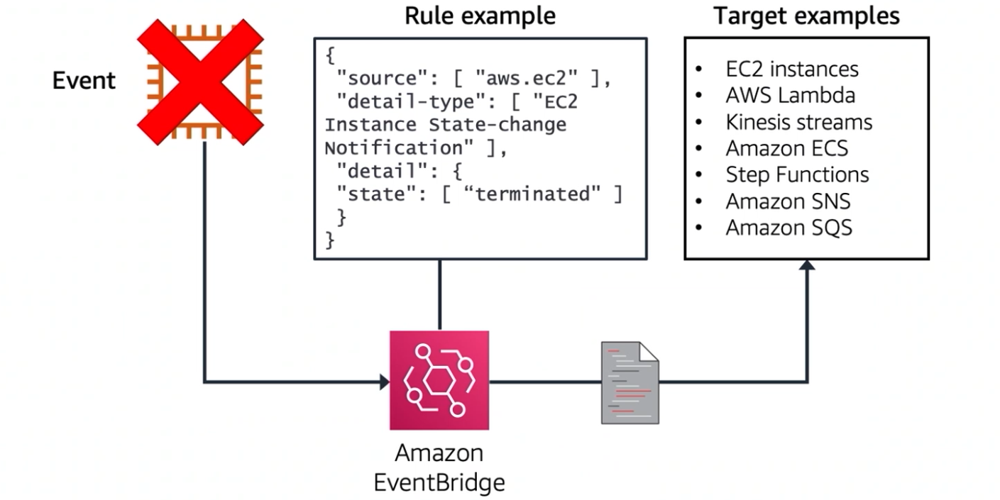
- **Monitoring**
  - track: health, app performance, resource utilization, security auditing.
  - manage **cost of AWS infrastructure**.
  - 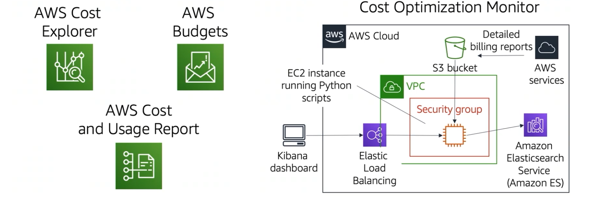
  - **Budgets**
    - set custom **budget alerts**.
  - **Cost and Usage Report**
    - **comprehensive report** about usage. includes **metadata** about AWS service, pricing, and reservations.
  - **Cost Explorer**
    - **visualize** and manage cost and usage. daily, monthly. **know where your spending money**.
  - **Cost Optimization Monitor**
    - customizable **dashboard** to **monitor** usage and cost. breakdown by period, account, resource, or tags.

## Network

- <a href="#Table-of-Contents">Table of Contents</a>
- **CloudHub**
  - <https://docs.aws.amazon.com/whitepapers/latest/aws-vpc-connectivity-options/aws-vpn-cloudhub.html>
  - works **with** or **without** VPN.
  - **mesh connects** multiple **branch offices** and VPG.
  - **low-cost hub-and-spoke model** for primary or **backup connectivity** **between** these **remote offices**.
  - 
- **Elastic IP**
  - fixed IPv4 address. map to **instance** or elastic network **interface**.
- **Direct Connect (DX)**
  - <https://docs.aws.amazon.com/directconnect/latest/UserGuide/Welcome.html>
  - dedicated **private** network connection. **consistent performance**. (e.g. use on-prem database with AWS).
  - **dedicated throughput**: 1 Gbps or 10 Gbps.
  - access any VPC or AWS service in **any Region** from any supported **DX location**.
  - 802.1q VLANs '_dot1q_'. encapsulation and tagging for VLAN over Ethernet.
  - 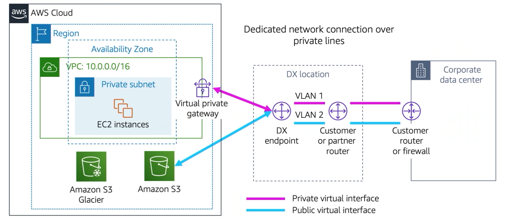
  - **High Availability**
    - highly available with redundant DX connections.
  - 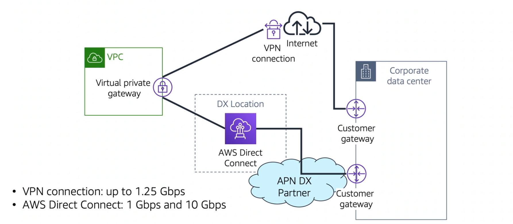
    - high resilient, fault tolerant architecture. multiple datacenters.
  - 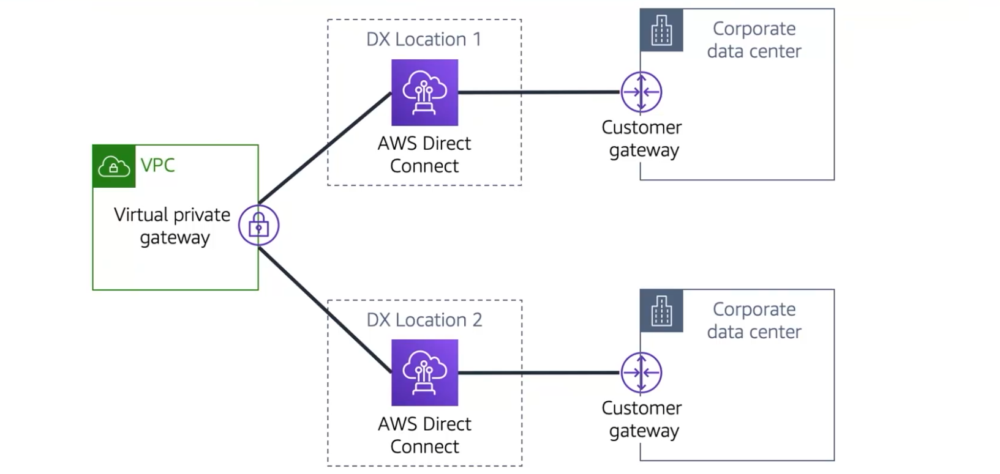
- **Endpoints**
  - interface connected to network that can **send/receive data**.
  - **Gateway Endpoint**: specific for **S3** and **DynamoDB**. **does not use PrivateLink**.
    - cannot be accessed from outside VPC.
  - **VPC/Interface Endpoint**: highly available, scalable technology that you can use to privately connect your VPC to services as if they were in your VPC.
    - <https://docs.aws.amazon.com/vpc/latest/privatelink/what-is-privatelink.html>
    - **fully managed**, interface to AWS service through AWS **PrivateLink**(backbone) to AWS services or AWS Partners **without requiring an internet gateway, NAT gateway, or public IP addresses**.
  - 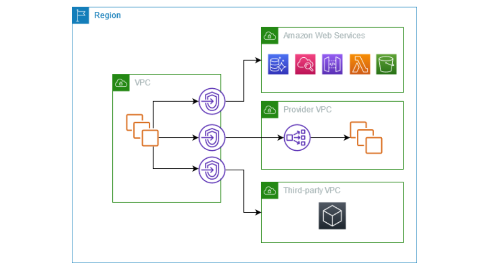
  - 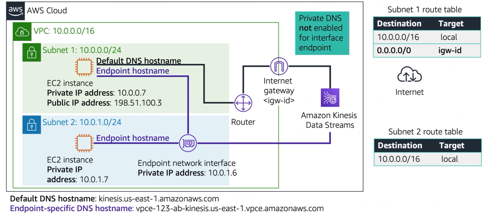
- **Internet Gateway (Virtual Private Gateway)**
  - internet communication to VPC resources.
- **Multi-VPC and Multi-Accounts**
  - **Multi-VPC**
    - **single team/organization** with multiple VPC is **most** use cases. max **5 VPC** per Region.
  - 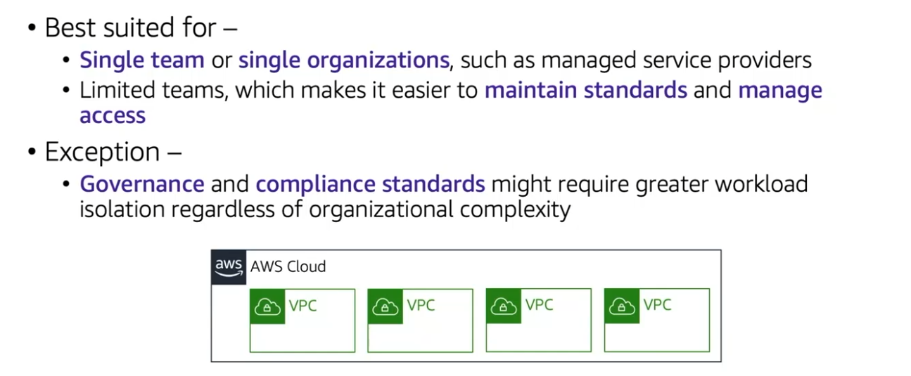
  - **Multi-account**
    - **enterprise or large organizations** or **multiple IT teams**. **medium-sized**, anticipate rapid growth.
    - **Governance** and **compliance standards** might require greater isolation.
  - 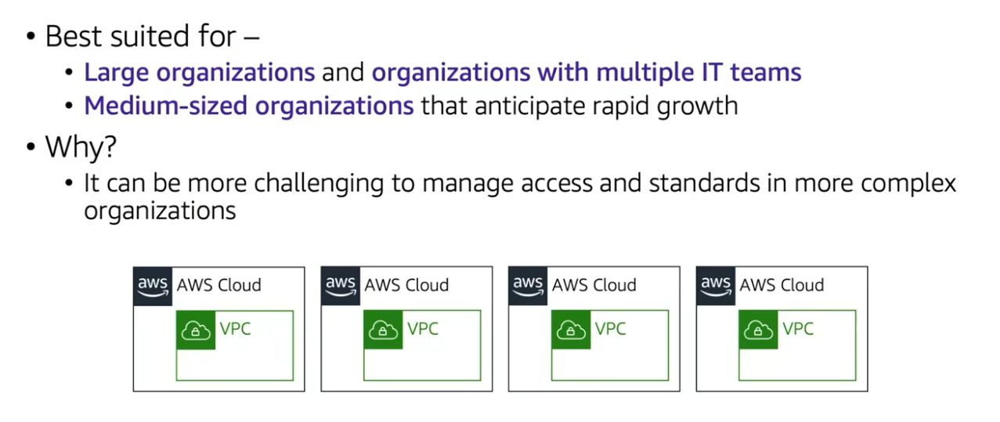
- **NAT Gateway**
  - enable **private subnets outbound communication** with Internet Gateway. **no inbound request**.
  - must be placed in **public subnet**.
  - requires an **Elastic IP**. `0.0.0.0/0` is gateway to internet.
  - 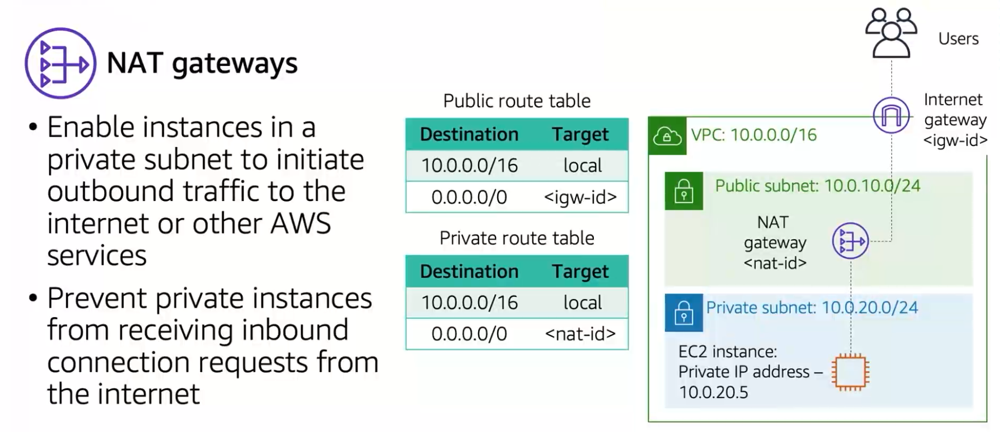
  - 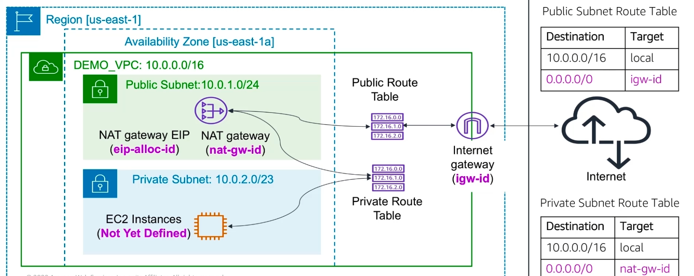
- **Peering (VPC)**
  - **one-to-one** network connection between **two VPCs**. no other infrastructure needed.
  - traffic stays on AWS backbone. **no bottlenecks or single point of failure**.
  - **Route**: each peered VPC must add route to route table, ACL and Security Groups updated.
    - **No overlap in CIDR**.
    - not transitive(A <-> B, A <-> C, B and C cannot communicate with each other).
      - to connect all VPCs requires **full-mesh network**. `n*(n-1)` (e.g. 6 VPCs fully connected = 30 connections).
    - only one active VPC peering between VPCs. (e.g. A <-> B, another redundant peering A <-> B not allowed).
  - 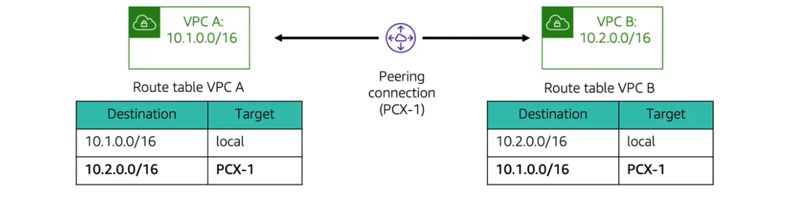
  - **Scope**: any AWS VPC. in another **VPC account**, or **Region**(Inter-Region VPC peering).
  - **Best Practices**
    - isolate workloads with different VPCs. peer them to transfer data.
- **Route Table**
  - **control** traffic from subnet or gateway. can create **custom** route table.
  - all **subnets** must be associated with a route table.
  - **route table**: one-to-many. can have **multiple subnets**.
  - **subnet**: one-to-one. can have only **one route table**.
- **Site-to-Site VPN**
  - <https://docs.aws.amazon.com/vpn/latest/s2svpn/VPC_VPN.html>
  - connect **on-prem to VPC**. **IPSec encryption**. creates **two**(default) or **more** encrypted 'tunnels' between networks.
  - charged per connection-hour.
  - **Customer Gateway Device**: physical or software appliance that you own or manage in your **on-premises** network.
    - <https://docs.aws.amazon.com/vpn/latest/s2svpn/your-cgw.html#DevicesTested>
    - hardware that connect to VPN endpoint(VPG virtual private gateway).
  - 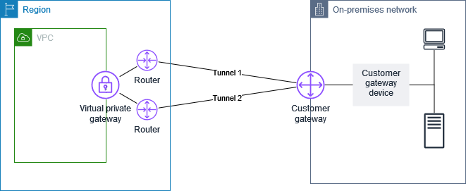
  - **Static Routing**: if your Customer Gateway Device does not support 'Dynamic', you must manually update route table.
  - **Dynamic Routing**: BGP(border gateway protocol) dynamically finds route.
  - 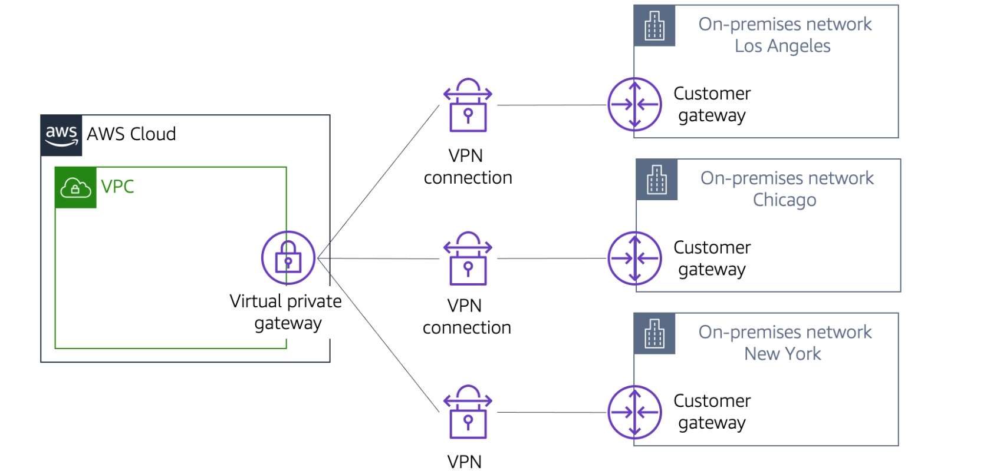
- **Storage Gateway**
  - hybrid storage between on-prem and AWS cloud.
  - **Three Interfaces**
    - **File Gateway**: storage objects. **NFS, SMB, iSCSI**.
    - **Volume Gateway**: server snapshots. **EBS** snapshot storage.
    - **Tape Gateway**: tape drive backup from on-prem. **VTL-iSCI**. S3 stored as Virtual Tape Library.
  - 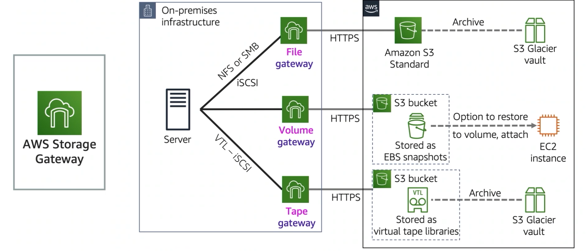
- **Subnet**
  - segment of VPC ip address range. **not isolation boundaries**.
  - **subset** of CIDR(classless inter domain routing, `/28`) block. **cannot overlap**
  - subnet **mapped** to **one Availability Zone**.
  - AWS **reserves five (first four, then last ip) ip addresses** in each subnet.
  - 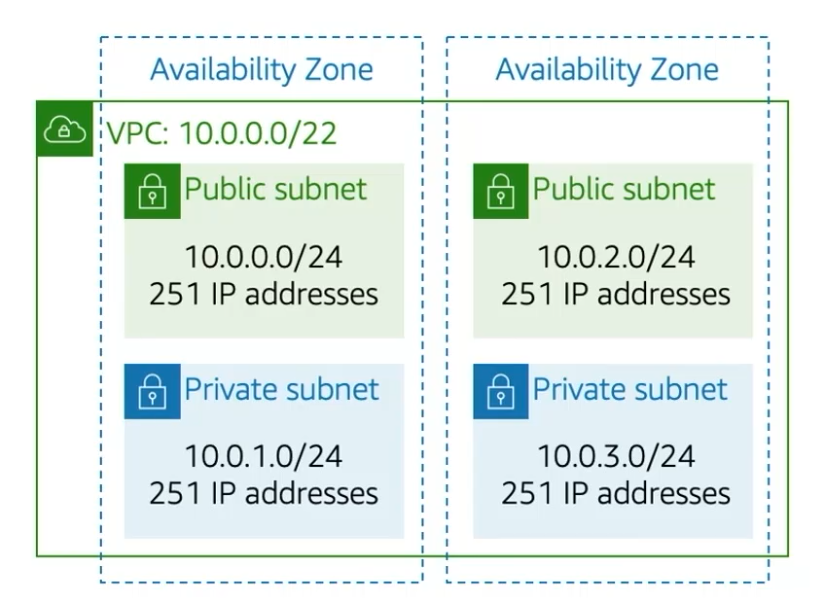
  - **Private Subnet**
    - no internet access(unless you have a NAT Gateway). internal VPC access.
    - for outbound only internet access: NAT gateway and Elastic IP is required.
    - route table entry `0.0.0.0/0` with `nat-gq-id` is the gateway to internet.
  - **Public Subnet**
    - connect resources to internet.
    - 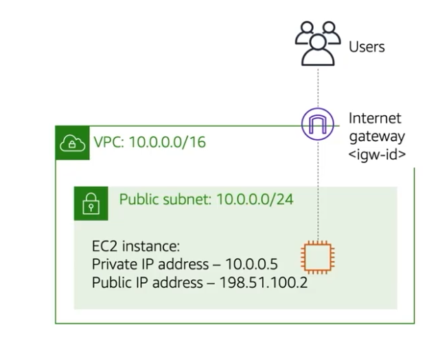
- **Transit Gateway (AWS)**
  - avoid large scale **peering**. simplify with Transit Gateway. **hub-and-spoke model**.
  - connect multiple **VPCs** and **on-prem** with **single gateway**.
  - 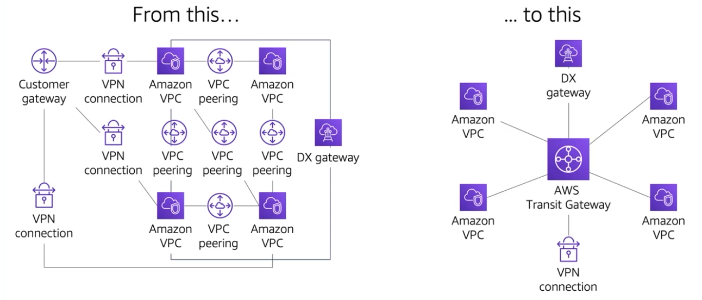
  - **Routes**: the Transit Gateway route table enables VPC connection or external.
    - each VPC must have a route to Transit Gateway in it's route table.
    - Transit Gateway must have routes to each VPC to enable VPC-to-VPC communication.
  - 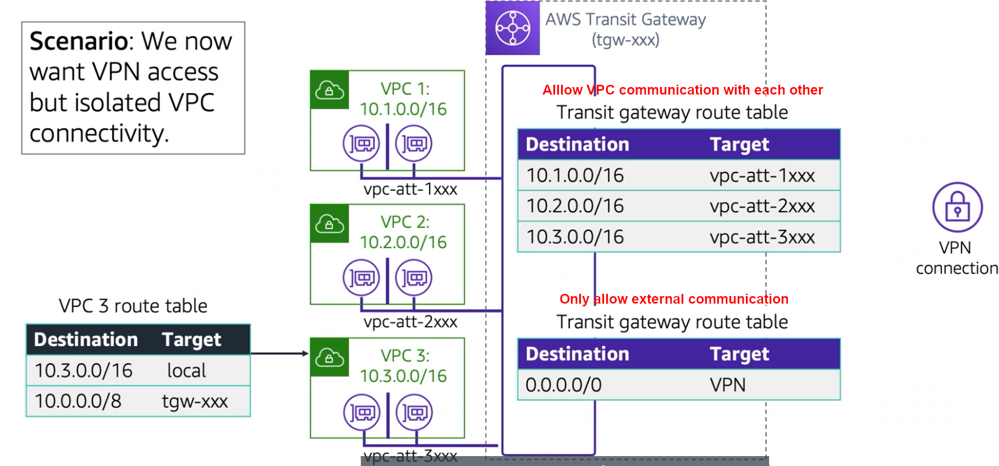
- **VPC**
  - virtual private cloud. **logically isolated section** of AWS Cloud for the **virtual network that you define**.
  - 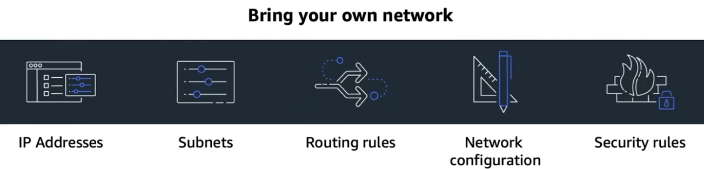
  - **Scope**: **single region**.
    - spans **all AZs** in a Region. can host supported resources from any **Availability Zone** within it's Region.
  - **Best Practices**
    - **one subnet per AZ** for **each group of hosts** with unique routing requirements.
    - **divide VPC network range evenly** across all AZs in a Region.
    - **reserve extra address space** for future use. CIDR, VPC size.
    - **VPC CIDR range cannot overlap** other ranges.
- **VPG (Virtual Private Gateway)**
  - VPC endpoint for VPN setup. See Network/Site-to-Site VPN.

## Reactive Architecture

- <a href="#Table-of-Contents">Table of Contents</a>
- **Reactive Architecture**
  - scale into the millions. responsive, highly available.
- **Database Autoscaling**
  - **RDS and Aurora**
    - **Vertical Scaling**: **push-button scaling**. change instance class(**micro <-> 24xlarge**). must stop database.
      - **Database Storage Autoscaling**: change SSD to IOPS SSD or automatically add more capacity.
    - **Horizontal Scaling**: **read-heavy** workloads. read replicas scale horizontal. **asynchronous** replication.
      - **Primary** and **Read Replica**.
    - **Aurora Serverless**: default autoscale with demand. set min, max capacity. you **pay ACUs**(aurora capacity units). best for **unpredictable** workloads.
    - **Sharding**: split database into separate chunks(horizontal scaling). based on key. (e.g. split on employeeID odd/even).
      - improves **write** performance. read performance is impacted. (e.g. **JOIN** multiple databases shards).
  - **DynamoDB On-Demand**: pay-per-request pricing.
    - NoSQL spiky unpredictable workloads.
    - **Autoscaling**: default. set min, max limits.
      - can read and write **without throttling**.
      - **auto increase throughput capacity**.
  - 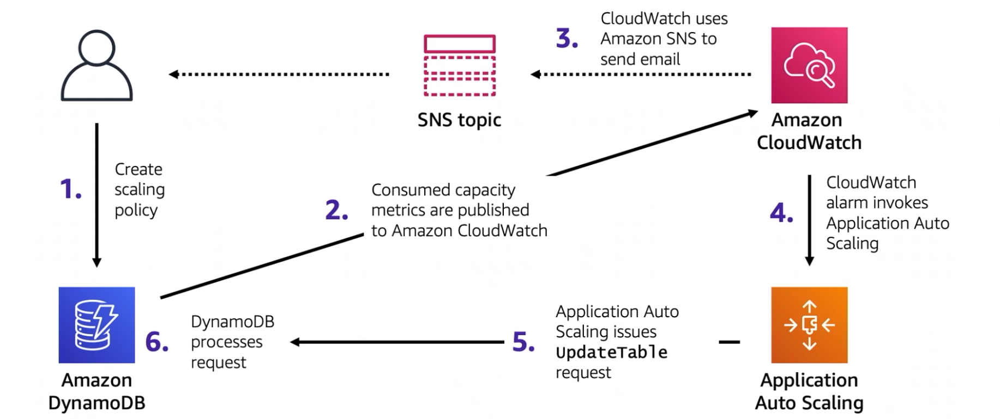
- **EC2 Autoscaling**
  - **launch or terminate instances**. launch **across AZs**.
  - works with load balancers to automatically **register new instances**.
  - scale from policies that you define, schedules, and health checks.
  - **Scaling Options**
    - **Scheduled**: performed at set date and time. (e.g. turn off dev EC2 at night).
    - **Dynamic**: define parameters that control scaling. (e.g. add another EC2 instance when CPU high).
    - **Predictive**: ML models predict compute requirements. can be used with **Dynamic**.
  - **Scaling Policy**
    - **Simple Scaling**: based on cloudwatch alarms. (e.g. new workloads, spiky workloads).
    - **Step Scaling**: based on avg metric from cloudwatch. (e.g. predictable workloads).
    - **Target Tracking Scaling**: based on specific metric and target. (e.g. keep metric at target levels).
  - **Autoscaling Group**: specify **EC2 instance types** and the **pricing models** that it uses.
    - you define **min capacity, max capacity, and desired capacity**.
- **Elastic Infrastructure**
  - expand or contract as capacity needs change.
- **Elastic Load Balancing (ELB)**
  - managed. distributes load across containers, EC2 instances, IP addresses, and Lambda functions.
  - external/internal facing.
  - **DNS name**: has own DNS name.
  - **Health-Check**: recognizes and responds to unhealthy instances.
  - **Scope**: across multiple AZs.
  - **Types**
    - **Application**: HTTP(S). layer 7. Web Apps. **Recommended**.
    - **Network**: TCP, UDP, TLS. layer 4. **Recommended**.
    - **Classic**: EC2 instances. request/connection level.
  - 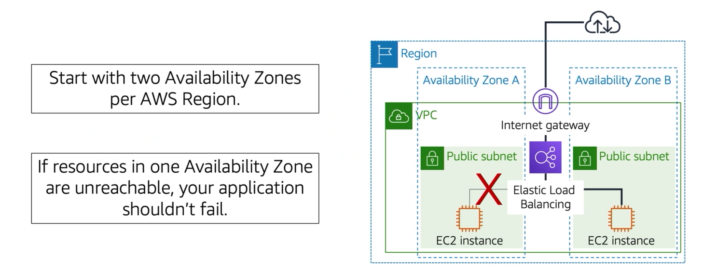
  - **Creating High Availability Web App**
    - highly available, elastic scaling web app.
    - **Create ELB**: **EC2 console**/Load Balancers/Create Load Balancer/**Create Application Load Balancer**.
      - **create target group**: select at least **two availability zones** for high availability.
      - **create security group**: allow ports(80, 443...).
    - **Create AutoScaling Group**:
      - collection of EC2 instances that AWS can automatically adjust in size based on demand or predefined schedules.
      - **launch template**: choose AMI. security group. user data: script to install HTTP server and webpage.
      - select the same **two AZs** of ELB.
      - min, max EC2s. tags.
- **Highly Available**
  - minimized downtime. minimal human intervention. recover from failure or roll over to secondary backup.
  - avoid single points of failure.
- **Route 53 (Amazon)**
  - Domain Name System. translates names into IP addresses.
  - DNS failover(redirect to healthy endpoints). low-latency, fault-tolerant.
  - **Routing Policies**
    - **Simple**: **single resource**. (e.g. web server that serves content for the example.com website).
    - **Failover**: active-passive **failover**.
    - **Geolocation**: route traffic based on the **location**. (e.g. change currency symbol and price based on US or Europe location).
    - **Latency**: resources in multiple AWS Regions. route traffic to the Region that provides the **best latency**.
    - **Multivalue answer**: Route 53 to respond to DNS queries with up to **eight healthy records(IP addresses)**.
      - (e.g. **client to choose another IP** if **no response**).
    - **Weighted**: route traffic to **multiple resources** in proportions that you specify. (e.g. send small random 'canary' version responses for testing.)
  - **Simple Load Balance**
    - copy and **paste both IP addresses** into the '**create record set**' value input.
    - routing policy is **simple**.
    - 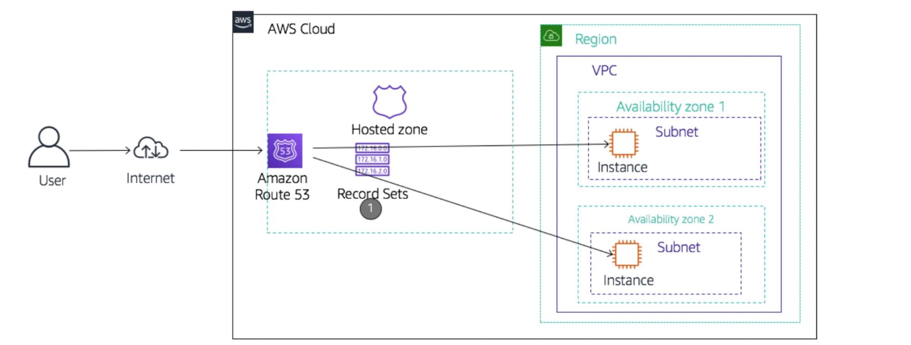
    - 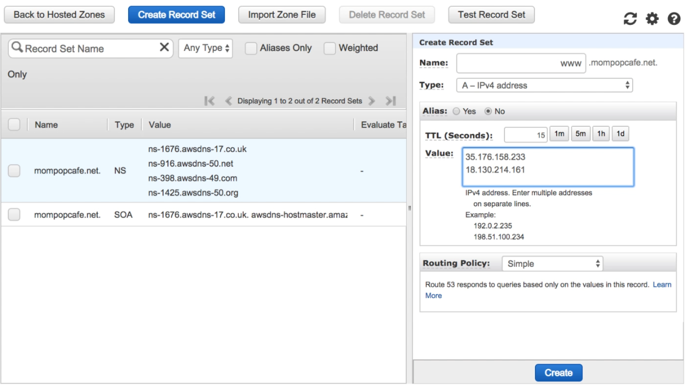
  - **Failover**
    - **create health check**. setup notifications.
    - **Create Record Set**: add Primary IP. Routing Policy: Failover. Mark as Primary and choose health-check you just created.
    - **Create Record Set**: add Secondary IP. same as above, mark as secondary.
    - 
    - 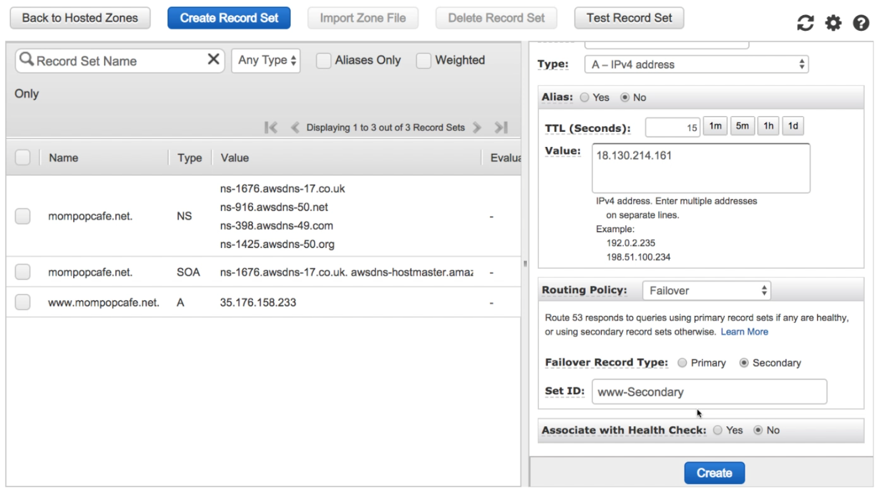
  - **Geolocation**
    - create two record sets for each region.
    - routing policy: Geolocation. choose your continent.
    - 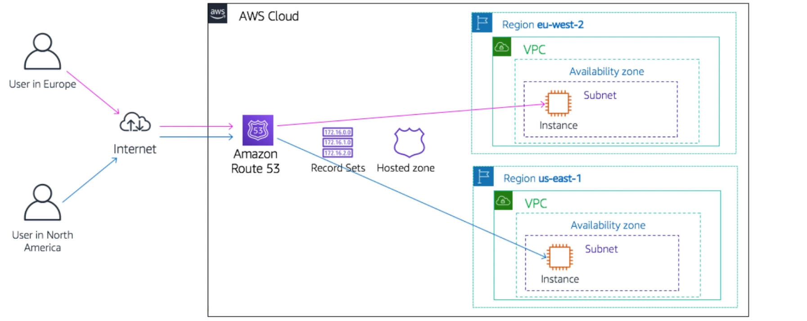
    - 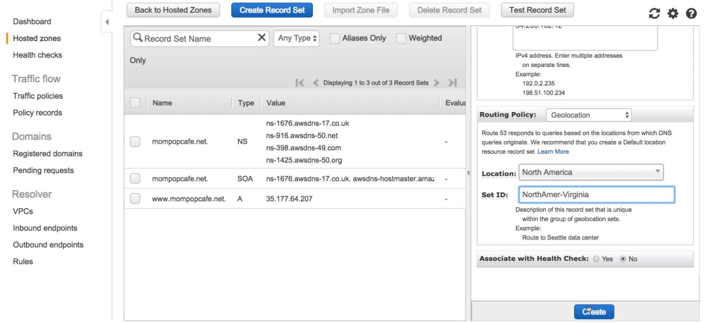
- **Scaling**
  - achieve elasticity.
  - **horizontal scaling**: add more resources. (e.g. create new EC2 instance)
  - **vertical scaling**: increase compute, memory, storage size. must restart instance.
  - 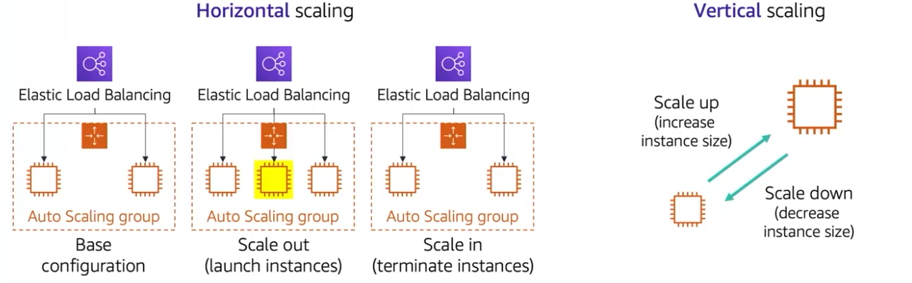
- **Load Balancing**
  - scale without interruption.

## Serverless and Microservices

- <a href="#Table-of-Contents">Table of Contents</a>
- **API Gateway (Amazon)**
  - **fully managed API service**. secure APIs. version control/stages. custom rate limit.
  - **entrypoint** to backend resources.
  - deeply integrated with Lambda.
  - **cost**: api call + data transferred.
  - **Security**: require APIs authorization.
    - **AWS Signature Version 4**: setup your own token. OAuth.
    - **Lambda Authorizers**: OAuth tokens.
    - **Amazon Cognito**: create temporary credentials.
    - **VPC Endpoint**: resource policy on VPC Endpoint to restrict access.
  - 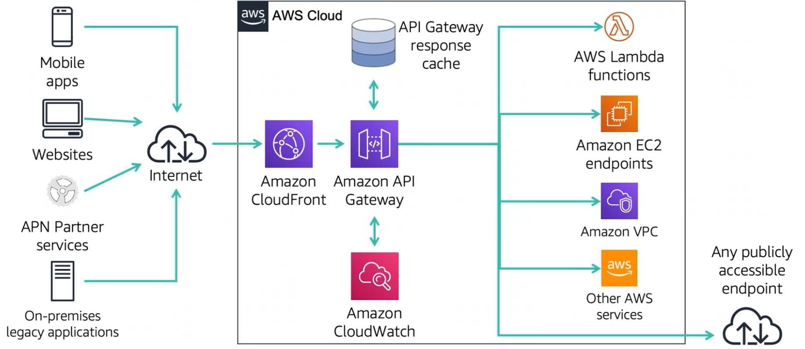
- **App Mesh (AWS)**
  - capture metrics, logs, traces from all microservices. export to CloudWatch, X-Ray, or any APN(AWS partner network).
  - control traffic flow between microservices for high availability.
- **Cloud Map (AWS)**
  - fully managed. assign custom names for **dynamically** changing resources.
  - maps name to dynamically changing resources.
- **ECS (Elastic Container Service)**
  - **container orchestration service**(AWS version of kubernetes).
  - build microservices. container contains everything needed to run: code, runtime engine, dependencies, configurations.
  - **cluster**: logical grouping of resources.
  - **task definition**: JSON. describes the containers that form the application. blueprint.
  - **Host your ECS**
    - **Fargate**. AWS managed.
    - **EC2 cluster**: run ECS on **EC2 instances you manage**, with an ECS container agent(**container instance**).
  - **Auto Scaling Group**: uses **CloudWatch alarms** to scale instances up/down(vertical) in/out(horizontal).
  - **ECS Cluster Auto Scaling**: uses **ECS** to scale Auto Scaling Group automatically.
    - **advantages**: increase speed, reliability of scale-out. automatically manage instance termination on scale-in.
    - **capacity providers**: **link** ECS cluster to Auto Scaling Group.
      - capacity provider can have only **on**e Auto Scaling Group.
      - Auto Scaling Group can have **many** capacity providers.
  - 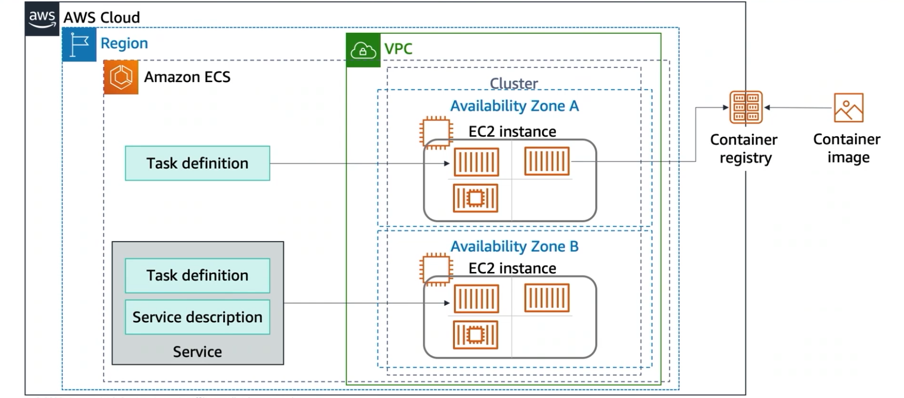
- **Fargate**
  - fully managed **container** service. **serverless** host for ECS or EKS.
  - manage(containers and runtime environment), scale, provision container clusters.
- **Lambda Functions (AWS)**
  - **fully managed** compute service. runs code in response to **events**.
  - runs code in response to **events**. S3, DynamoDB...
  - Java, Go, PowerShell, Node.js, C#, Python, Ruby, and Runtime API.
  - **cost**: memory usage + function request \* duration.
    - (e.g. fun1 + 256 MB memory cost twice as much as func2 + 128 MB memory running the same duration).
  - **Timeout**: max time function can run. you control.
  - **Lambda at the edge**: reduce latency. runs in response to **CDN** at **edge** locations.
  - **Lambda Layers**: upload complete stack(custom code or libraries). share/reuse stack with functions.
    - up to **five layers** or **250 MB**.
  - 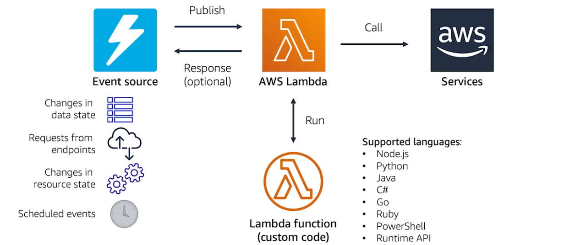
  - **Handler**: function to be run. takes two objects.
  - **event object**: contains information about the **event that triggered handler()**.
    - code that **triggers the function**. AWS defined or custom defined JSON stream.
  - **context object**: always generated by AWS. **metadata about runtime environment**.
    - (e.g. getRemainingTimeInMillis(), number of milliseconds remaining before function time runs out).
  - 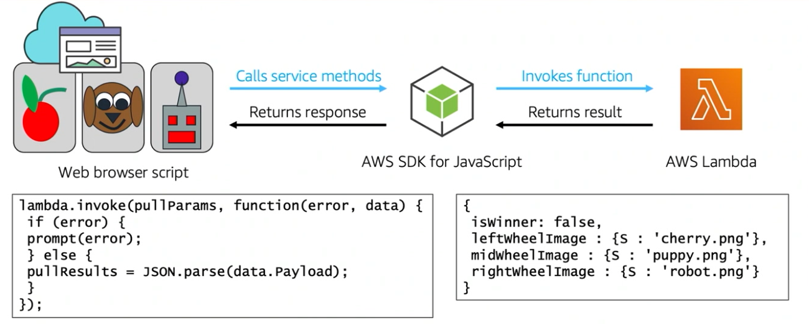
  - 
- **Microservices (AWS)**
  - **independent services** that communicate over **well-defined APIs**.
  - 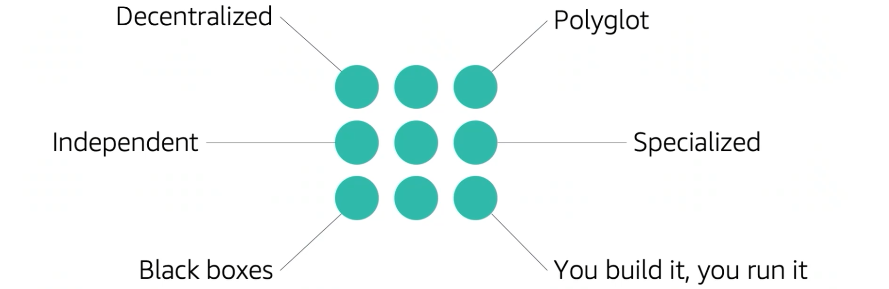
- **Monolithic to Microservices**
  - Step 1: create image for each service.
  - 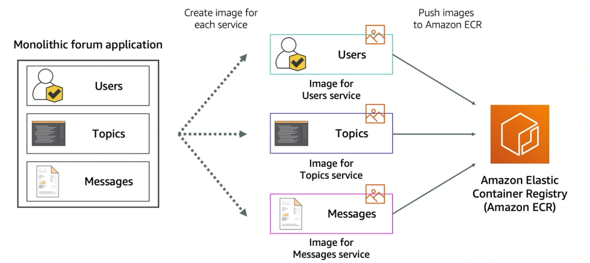
  - Step 2: create **task definition** for each group
  - 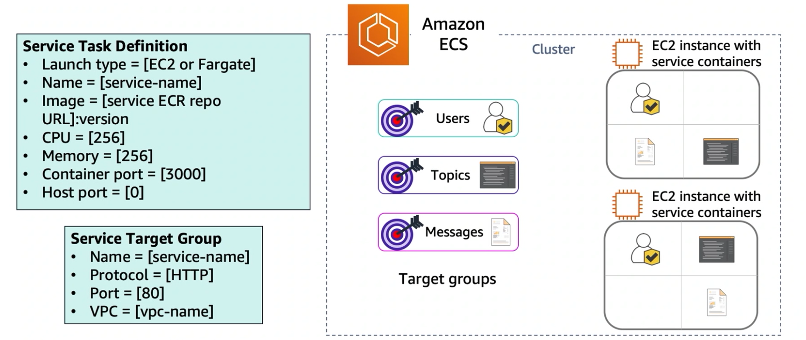
  - Step 3: create ELB with routes to ECS cluster.
  - 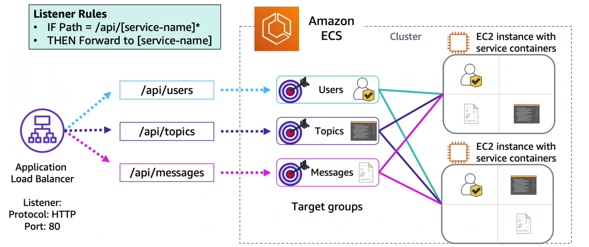
- **Serverless**
  - **build and run applications without thinking about servers**. AWS does all server related task.
  - no infrastructure to provision or manage.
  - **advantages**: highly available and secure. automatic scaling. build microservices.
    - lower TCO: total cost ownership. pay only for run duration.
    - agility: focus on business not infrastructure.
  - 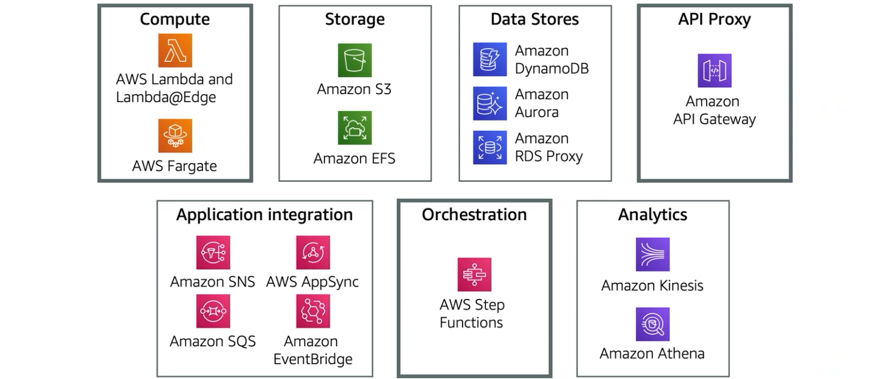
- **Step Functions (AWS)**
  - coordinates microservices through visual workflows.
  - orchestrate Lambda Functions. run Functions in parallel or series.
  - scale with workload, **handle errors and timeouts**, maintain state. visibility into functions for performance/error handling.
  - **create and automate your own state machines**.
  - 
  - **State Machine**
    - handle each 'state' your app could be in.
    - **States Language**: define state machine in JSON.
  - 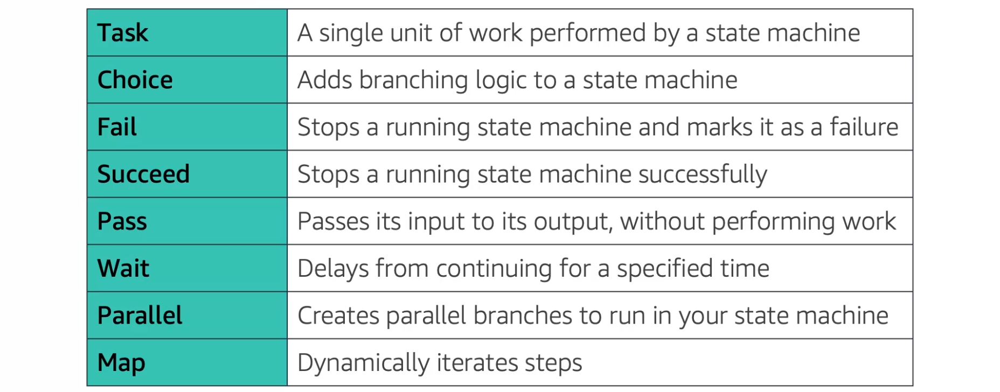

## S3 Storage

- <a href="#Table-of-Contents">Table of Contents</a>
- **S3**
  - immutable **object** storage service.
  - global REST URL access.
  - Eleven 9's of **durability**(not lost). 99.999999999% uptime.
  - Four 9's of **availability**(can access). 99.99% available.
  - **bucket**: name is **globally unique**. storage container.
  - **object**: asset. max single object size **5 TB**.
    - **Object Properties**
      - **key**: name used to retrieve object.
      - **version ID**: together with key uniquely identify object.
      - **value**: data you store. immutable(you **cannot change value**).
      - **metadata**: key:value properties about the object.
      - **subresources**: object specific information.
  - **New Objects**: **Read-After-Write**. new objects are available immediately.
  - **Overwrite PUTS and DELETES**: **eventual consistency**. changed objects take time to propagate.
  - **Create**
    1. name: (globally unique)
    2. region: (e.g. us-east-1)
    3. permissions: (block all public access | allow public access)
  - **Best Practices**
    - **cache** frequently accessed objects.
    - tune **retry and timeout logic** for high traffic objects.
    - **scale horizontally** for high **throughput** across network.
    - often used as a **data store** for analytics and **backup and archive** service for critical data.
- **S3 Object Access**
  - **private** and **protected** by **default**.
  - **Block Public Access**: lock bucket and objects from being accessed.
  - **IAM Policies**: good when users can authenticate using IAM.
  - **Bucket Policies**: define access to specific object or bucket.
  - **Access Control List (ACL)**: legacy access. not recommended. **Not the same as Network ACL**.
  - **S3 Access Point**: configure access with names and permissions.
  - **Presigned URLs**: time-limited access with temporary URLs.
  - **AWS Trusted Advisor**: free feature. bucket permission check.
  - **encryption**:
    - server-side: data encrypted on save, decrypted on download.
    - client-side: client uploads encrypted data.
  - 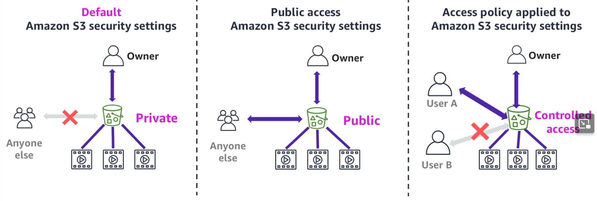
  - **Best Practices**
    - give least privilege access. (e.g. create **presigned URL** to object that **expires in 24 hours**).
- **S3 Object Deletion**
  - deletions are hidden but not removed. to remove you must delete again.
- **S3 Pricing**
  - transferring data **in** or inside **region** is free.
  - transferring data **out** or other **regions** cost.
- **S3 How to Choose Region**
  1. choosing region is based on **local governance laws**.
  2. **proximity**(latency) of users.
  3. features and **availability**. not all AWS services available in all regions.
  4. **cost** effectiveness. some regions are more expensive.
- **S3 Tiers**
  - **S3 Standard**: frequently accessed data. across **three AZ**.
  - **S3 Standard-IA(infrequent access)**: same as S3 Standard. **30 storage penalty**. **higher cost** to retrieve.
  - **S3 One Zone IA**: **single AZ**. non-critical data.
  - **S3 Glacier**: archiving rarely accessed data.
    - **Expedited**: retrieve data 1-5 min.
    - **Standard**: retrieve data 3-5 hours.
    - **Bulk**: retrieve data 5-12 hours.
  - **S3 Glacier Deep Archive**: least expensive. data access once or twice a year. Eleven 9's of durability.
    - stored across **three geographical(Regions) areas**.
    - data is restored within 12 hours.
  - 
  - **S3 Intelligent Tiering**:
    - option to remove cost. automatically moves objects to the most cost-effective access tier.
    - fee to use.
  - **S3 Lifecycle Policy**
    - delete or move objects based on ag**e**.
  - 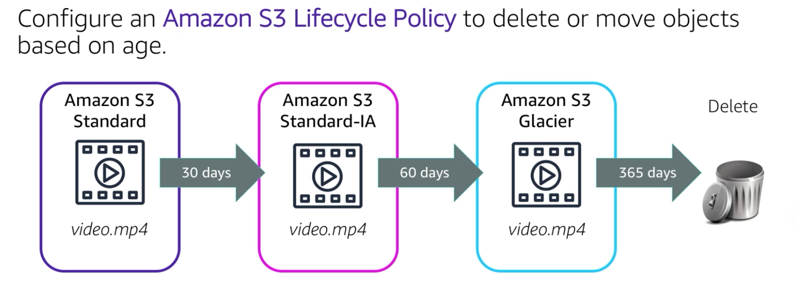
- **S3 Transfer Acceleration**
  - takes advantage of the **globally distributed edge** locations in Amazon **CloudFront**.
- **S3 Uploading**
  - **aws cli**: `aws s3 cp file.txt s3://BUCKET-NAME/file.txt`
  - **Multipart**: tool that splits data into smaller size. `> 100 MB`. network connectivity inconsistent.
  - **Transfer Acceleration**: uses CloudFront edge location, then AWS backbone.
  - **Snowball**: **Petabytes** disk storage. physical device shipped to you.
  - **Snowmobile**: **Exabytes** disk storage. 18 wheeler shipping container picks up data.
- **S3 versioning**
  - enabled through bucket properties.
  - **Versioning Not Enabled**: default. no versioning.
  - **Versioning-Enabled**: once enabled, cannot change back to non-version state, only suspend.
    - **prevents deletion**. S3 objects are 'hidden', but still recoverable when deleted.
  - **Versioning-Suspended**: bucket has been versioned, but suspended.
- **S3 Website**
  - static only(no server). low cost solution to web hosting.
  - **CORS (cross-origin resource sharing)**
    - XML document with rules that identify the origins that are allowed to access your bucket.
  - 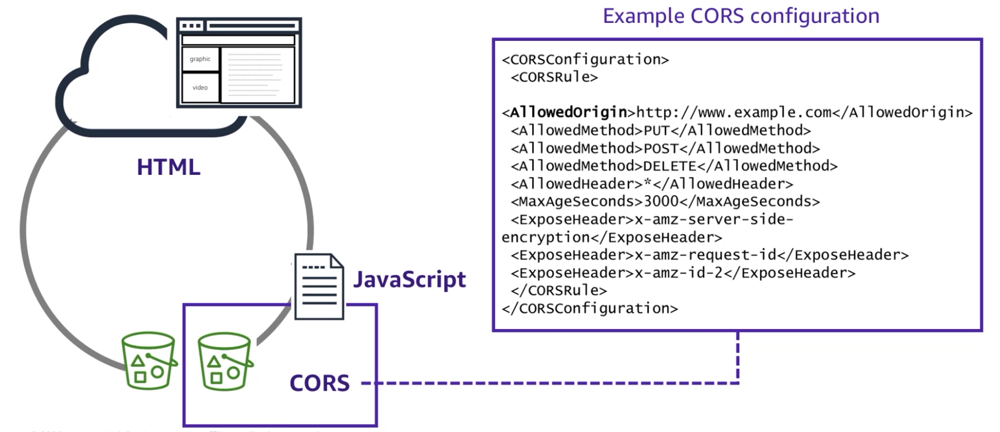
  - **Best Practices**
    - enable versioning.
  - 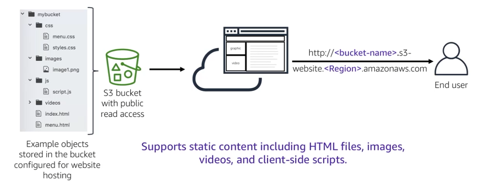

```sh
# Create Transfer Accelerate S3 upload.
export AWS_BUCKET_NAME="AWS_BUCKET_NAME_$(openssl rand -base64 20 | tr -dc 'a-z0-9')"
export AWS_REGION="us-east-1"
# create 1G 'file.dat' in current directory.
time dd if=/dev/zero of=file.dat bs=1G seek=1 count=0

# cp file to s3 through CloudFront edge location.
aws s3 cp file.dat s3://${AWS_BUCKET_NAME}/file.dat -- region $AWS_REGION  --endpoint-url http://s3-accelerate.amazonaws.com

# check if file in s3
aws s3api get-bucket-accelerate-configuration --bucket $AWS_BUCKET_NAME --query 'Status'
```
