# CompTIA Project+ PK0-005

## Definitions

- **Acceptance**
  - Formally acknowledging that a deliverable meets the agreed-upon requirements and can be integrated into the project or handed over to the client.
- **Action Items**
  - Specific tasks assigned to individuals or teams to address identified issues, complete required work, or move the project forward.
- **Addition**
  - Introducing new features, functionalities, or scope to the project, potentially impacting timelines, resources, and budgets.
- **Balanced Scorecard**
  - A performance measurement framework that considers various aspects beyond just financial metrics, such as customer satisfaction, internal processes, and learning and growth.
- **Cause-and-Effect Diagram** (Fishbone Diagram)
  - A visual tool used to identify and analyze the potential causes of a problem or issue.
- **Common Causes of Variances**
  - Deviations from planned performance metrics (e.g., schedule, budget) can be caused by factors like resource constraints, inaccurate estimations, or changes in requirements.
- **Control Chart**
  - A statistical tool used to monitor a process over time and identify potential deviations from acceptable ranges, enabling proactive corrective action.
- **Data Structured/Unstructured, Data Warehouse, RDBMS, Primary Key, Foreign Key, EDRMS, CMS**
  - Structured: labeled for easy searching. Modified to conform to standards.
  - Unstructured: also called 'blob'. bulk data not labeled.
  - Data Warehouse: gather multiple data sources together for analysis and decision-making.
  - RDBMS: relational database. collection of structured data related to other data.
  - Primary Key: unique key to identify data row.
  - Foreign Key: when primary key is included as a column of another table. Used to relate two tables.
  - EDM/ERM: electronic document and record management. Manages access, create and delete of data. Signing.
  - CMS: content management system. create website without technical knowledge.
- **Decision Trees**
  - Visual representations of possible choices and their consequences, helping to make informed decisions in complex situations.
- **End-to-End Testing**
  - Testing a complete system or application from beginning to end, ensuring its functionality and performance across all components and integrations.
- **ESG (Environmental, Social, and Governance)**
  - Environmental: project impact to environment.
  - Social: project impact among stakeholders, team members, customers.
  - Governance: project monitoring, performance, changes, budget...
- **Extinction**
  - Ignoring or not reinforcing a behavior, leading to its eventual decrease or disappearance. Used in project management to address undesirable behaviors or recurring issues.
- **Functional, Matrix, and Projectized Management**
  - 

| Management Style | About                                                                 |
| ---------------- | --------------------------------------------------------------------- |
| Functional       | Specialized managers for each department                              |
| Matrix           | PM's that assign work(weak), up to control pay, hiring/firing(strong) |
| Projectized      | PM's have full control over pay, hiring/firing                        |

- **Flowcharts**
  - Visual diagrams depicting the steps or processes involved in a task or workflow, aiding in understanding and optimizing procedures.
- **Integration**
  - Combining individual components or modules into a functioning system, ensuring seamless communication and data exchange.
- **Lessons Learned**
  - Capturing and analyzing valuable insights gained from project experiences, both successful and unsuccessful, to improve future projects.
- **Pareto Diagram (80/20 Rule)**
  - A graphical representation highlighting that a small percentage of factors (e.g., 20%) often contributes to a large majority of the effects (e.g., 80%). Used to prioritize issues or areas for improvement.
- **Prevention**
  - Taking proactive measures to avoid problems or issues before they occur, minimizing risks and disruptions.
- **Rework**
  - Correcting errors or deficiencies in work that has already been completed, leading to additional time and resource costs.
- **Scope**
  - project scope: boundaries of project. Outlines what work will and won't be done.
  - Deliverables, Task/Activities, Timeline/Milestones, Budget, Quality Standards, Resource, Exclusions.
- **Starvation**
  - Depriving a process of resources it needs to function effectively, leading to delays, inefficiency, and potential failures.
- **Statistical Sampling**
  - Collecting and analyzing data from a representative sample of a population to draw inferences about the entire population, reducing the need to test everything.
- Be able to name the purpose for controlling quality.
  - Quality control involves monitoring work results to determine whether they comply with the standards set in the quality management plan.
- Name the types of testing performed on technology projects.
  - The types are smoke, unit, integration, end- to- end, regression, stress, performance, and user acceptance testing.
  - Be able to explain a histogram.
    - A histogram displays data distributed over time. It is a type of bar chart.
  - Be able to explain a fishbone diagram.
    - A fishbone diagram is a cause-and-effect diagram, also known as an Ishikawa diagram.
  - Be able to explain a Pareto chart. A Pareto chart is a histogram that rank-orders data by frequency over time.
- Be able to explain a run chart.
  - A run chart displays data as plots on a timeline.
- Be able to explain a control chart.
  - Control charts measure and display the variance of several samples of the same process over time.
- Be able to explain a decision tree.
  - Decision trees are diagrams that show the sequence of interrelated decisions and the expected results of choosing one alternative over the other.
- Be able to explain a scatter diagram.
  - A scatter diagram displays the relationship between two numerical variables and determines whether they are related to each other. It can also be used to prove or disprove cause-and-effect relationships. Scatter diagrams are also known as correlation charts.
- Name the three common causes of variance.
  - These are random variances, known or predictable variances, and variances that are always present in the process.
- Name three actions that you can take when quality is not as expected.
  - Three actions are rework, process adjustments, and acceptance.
- Be able to describe an issue.
  - An issue is something that could impact the project or delay the completion of deliverables. Risks become issues once they occur.
- Be able to describe the issue log.
  - The issue log is where information about issues are logged and may include an identification number, description, priority ranking, resolution plan, and other information.
- Name the performance measurement tools that can be used for quality assessments.
  - They are key performance indicators (KPIs), balanced scorecards, key objectives and results, and cost and schedule performance measures.
- Name the four reasons for project endings.
  - They are addition, starvation, integration, and extinction.
- Understand the steps involved in closing a project.
  - The steps are verification and validation of deliverables, obtaining sign-off, transition plan creation, revoking access, releasing project resources, closing out contracts, archiving documents, lessons learned, closure meeting, closeout report, celebration, and post-implementation support and warranty period.
- Explain the purpose of obtaining formal customer or stakeholder sign-off.
  - The formal sign-off documents that the customer accepts the project work and that the project meets the defined requirements. It also signals the official closure of the project and the transfer of the final product of the project to the organization.
- Describe lessons learned.
  - Lessons learned describe the successes and failures of the project.

## Agile

- **Agile**
  - Agile: iterative, incremental. delivers value early and often. Teams small (3-10 members).
    - Iterative: make improvements, get feedback.
    - Incremental: small improvements at a time.
  - cross-functional group that stays with project entire lifecycle.
  - members fill multiple roles and have broad experience.
  - Backlog breaks work into smaller units.
  - Agile Methodologies: SCRUM, Lean, XP, Feature Driven, Dynamic Systems Dev Model, Agile Unified Process, Hybrid.
  - 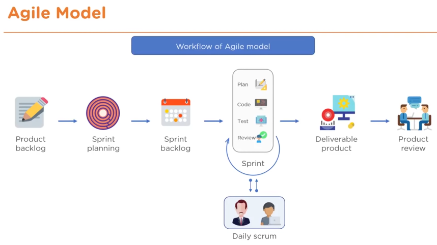
- **Agile Communication: Stakeholder, Customer, Changes**
  - Stakeholder: engage stakeholder all phases of project.
  - Customer: customer communication with developer is vital.
  - Communication Changes: embrace change. encourage communication.
- **Agile Requirements**
  - requirements dictate how the project looks and behaves.
  - only need basic requirements at start of project.
  - Collection of Requirements -> Product Creation -> Customer Review
- **Agile Budget and Schedule**
  - Budget: flexible. Good for **custom tailored work**.
  - Schedule: loose and flexible. Only one iteration is planned in advance.
- **Agile Environmental Factors: Culture, Development Processes, Industry Standards**
  - Culture: cross-functional. Team needs strong commitment(iterative, incremental design), good collaboration skills.
  - Development Processes: customer review after each iteration(small batches), continuous testing can be expensive.
  - Industry Standards: iterative and incremental.
- **Agile Strengths**
  - expected change.
- **Agile Weakness**
  - scope creep, missed deadlines and less documentation.
- **Agile Use**
  - project requirements will change often. Team is stable and self organized.
  - agile is flexible. continually improvements through sprints.
- **Agile Three Question: Daily Standup**
  - What did I accomplish yesterday? What will I do today? What obstacles prevent progress?

## Backlog

- **Backlog, Backlog Owner**
  - backlog: body of work team will complete. Good for when there are too many unknowns to create a WBS.
    - creates deliverables. Leave the execution details to the team.
    - project backlog uses agile ceremonies to fix time and cost.
    - scope of work remains flexible; a backlog-based team will deliver as much of the scope as they can fit into an iteration.
  - backlog owner: refines the backlog, moving high priorities to top.
- **Backlog: Epics, Features, User Stories, Task**
  - Epics: main deliverable.
  - Features: major feature.
  - User Stories: smallest deliverable. same as 'WBS' work package.
  - Task: action you take to complete the deliverable.
  - 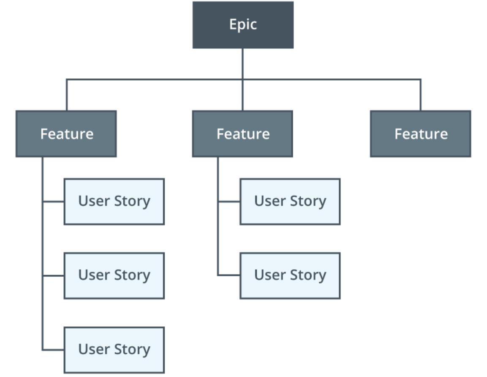
- **WBS vs Product Backlog vs Project Backlog**
  - product backlog: alive as long as the product is active.
  - project backlog: have start and end dates.

|                         | WBS               | Project Backlog             | Product Backlog              |
| :---------------------- | :---------------- | :-------------------------- | :--------------------------- |
| Duration                | Length of project | Length of project           | As long as product is viable |
| Scope                   | Fixed             | Flexible                    | Flexible                     |
| Resources               | Fixed             | Fixed                       | Fixed                        |
| Time                    | Fixed             | Fixed                       | Fixed                        |
| Deliverable or Activity | Deliverable       | Deliverable                 | Deliverable                  |
| Hierarchy               | Numbered Levels   | Epic > Feature > User Story | Epic > Feature > User Story  |
| When Created            | Planning Phase    | All Phases                  | Entire Life Cycle            |

## Business Case

- **Business Case**
  - **Justifies the project**'s viability(most important) and alignment with business goals.
  - summarizes project and is first project proposal. Determines if project should proceed.
  - created in discovery phase. Often includes details about budget and timelines(start, end).
  - key stakeholders come together and discuss how much will cost vs benefit. All group input is added to business case.
  - **Analyzes**:
    - Problem or opportunity the project addresses.
    - Alternative solutions and their costs/benefits.
    - Projected financial impact on the organization.
    - Risks and mitigation strategies.
  - **Function**:
    - Secures executive buy-in and funding for the project.
    - Demonstrates the value proposition and return on investment.
    - Guides project prioritization and decision-making.
    - Provides ongoing performance benchmarks and justification.
- **Business Case Creation**:
  - mnemonic: 'Executive Statements Offer Financial Projects Recommendation'
  - Executive Summary: brief summary. problem statement, solution, result.
    - Justification: benefits to organization.
    - Alignment to the Strategic Plan: project aligns with organizations overall strategy.
    - Analysis of the Problem or Opportunity: gap analysis: compare where we are and where we want to go.
    - Financial Overview: cost-benefit on investment.
  - Problem Statement: problem trying to solve.
  - Project Definition: more info. scope, resources, milestones, timeline.
  - Options: pros and cons of multiple solutions.
    - Feasibility Study Results: determine if project is doable and likely to succeed.
  - Recommendation: analysis which option is best for organization objectives.
  - Stakeholders: anyone/organization with vested interest.
  - High-Level Risk Analysis: known risk documented.

## Charts

- **Burnup/Burndown Chart**
  - Purpose: track work progress.
  - Compares **activities** with **time**.
  - Both charts plot **target work** and **actual work**.
  - **Burnup**
    - show total amount of work completed each day.
    - 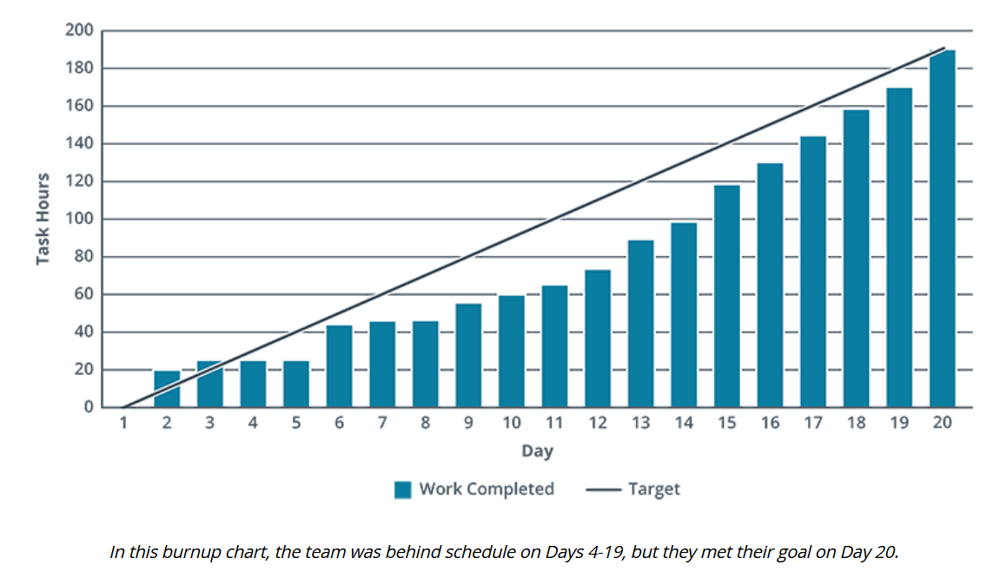
  - **Burndown**
    - shows remaining time and work in each scrum sprint iteration.
    - 
- **Control/Behavior Chart**
  - Purpose: monitor process **stability**.
  - Track the variation in a process over time.
  - center line is 'mean'.
  - upper line is upper control limit.
  - lower line is lower control limit.
  - **Rule of seven** says seven **consecutive** data points fall on either side of the mean, process is **out of control** and needs adjustment.
  - 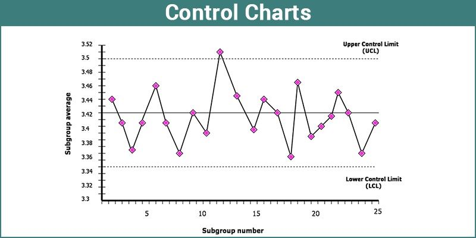
- **Critical Path Method (CPM)**
  - Purpose: project planning and execution.
  - shows how delay time will effect project. This image uses a Gantt chart to display critical path method.
  - add all activities with dependencies to find longest path on chart.
  - Float: the down time an activity can have and can still be completed on time.
  - 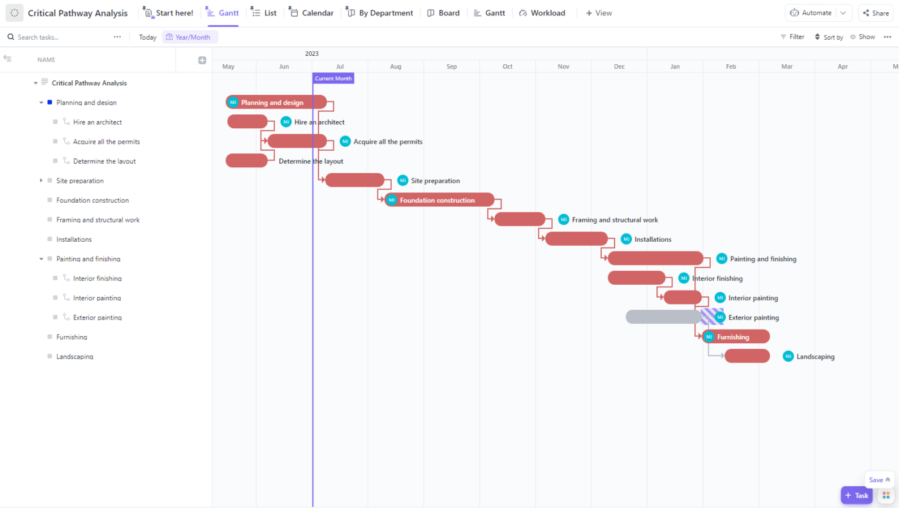
- **Decision Tree**
  - Purpose: evaluate multiple possible outcomes.
  - Helps when making choices based on specific criteria.
  - 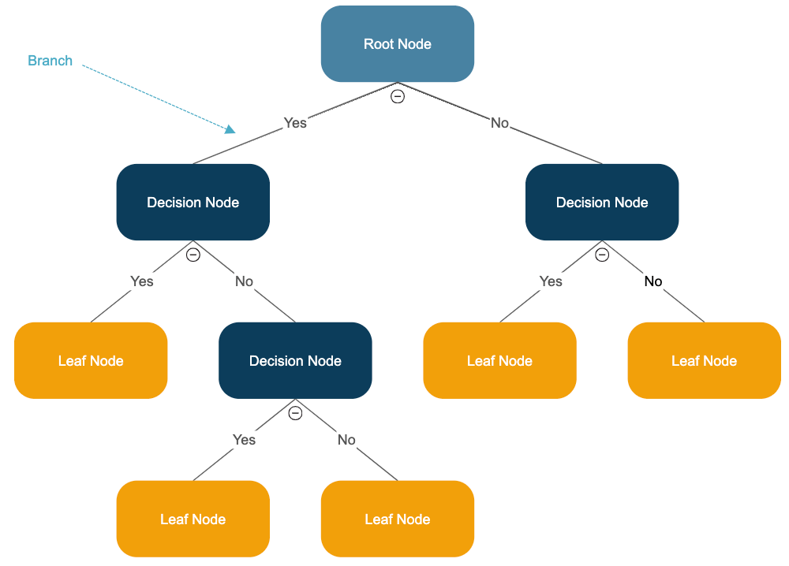
- **Fishbone/Ishikaawa Diagrams**
  - Purpose: visualize multiple **potential causes** of a problem.
  - **cause and effect diagram**. Part of gap analysis.
  - shows how various factors(fish bones) impact single outcome(fish head).
  - 
- **Gantt Chart**
  - Purpose: focus on project planning and execution.
  - compares relationship and dependencies between task.
  - 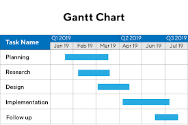
- **Milestone or Timeline Chart**
  - Purpose: focus on project planning and execution.
  - Timeline chart of project milestones.
  - 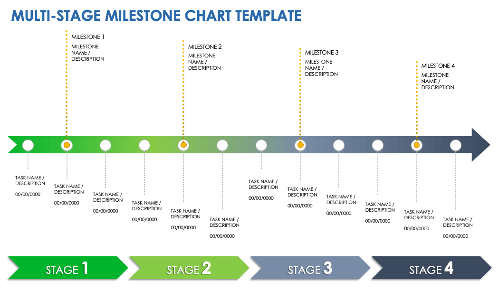
  - Milestone chart
  - 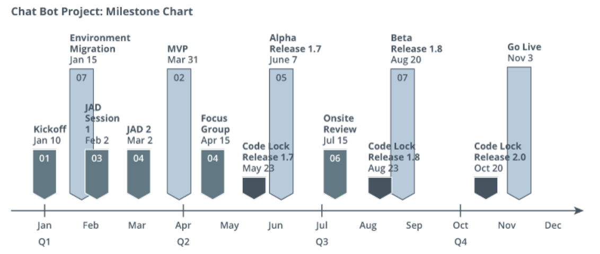
- **Project Organizational Chart**
  - Purpose: focus on project planning and execution.
  - Project Organizational Chart: once you know project scope, the organizational chart helps to pick your team members.
  - 
- **Histogram**
  - Purpose: shows data distribution.
  - Monitor process over time. Shows varying frequency.
  - 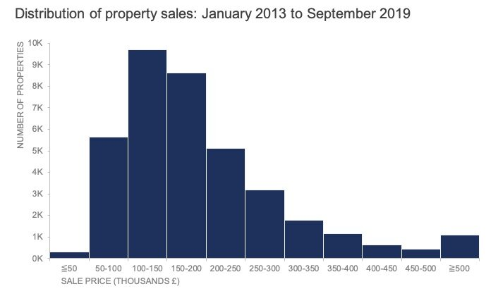
- **Pareto Chart**
  - Purpose: quickly identify the most significant areas to focus on for improvement.
  - 80/20 rule. 80% problems solved with 20% cause.
  - specifically ranks and visualizes causes based on their frequency or impact.
  - 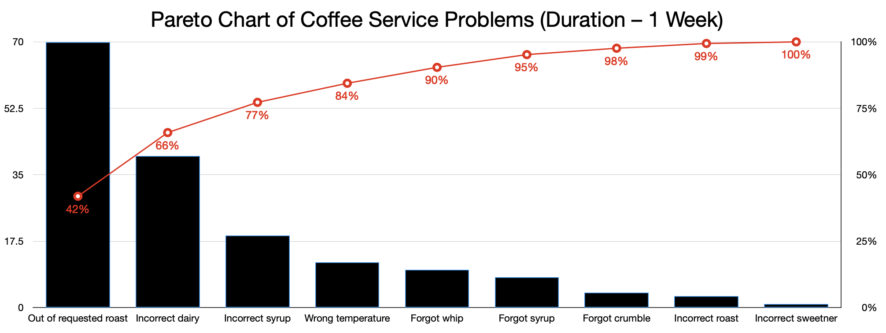
- **Program Evaluation Review Technique (PERT) Chart**
  - Purpose: estimates project timelines.
  - Improved planning and scheduling: By visualizing the tasks and their dependencies.
  - Risk Identification: show critical path.
  - Nodes: milestones. Checkpoints as team progresses through project.
  - Arrow: show dependency. Task will need to be completed before next task.
  - Time for each task uses the **three point estimate** method:
    - `estimated time = optimistic time + pessimistic time + (4 * average time) / 6`
  - 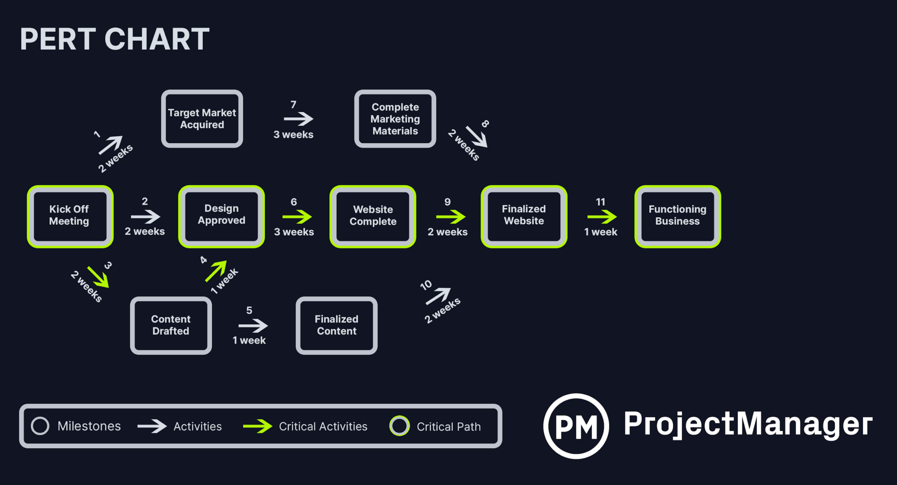
- **Project Network Diagram**
  - Purpose: shows project dependencies(sequence).
  - visual model of the project schedule that shows sequence of activities and the dependencies.
  - 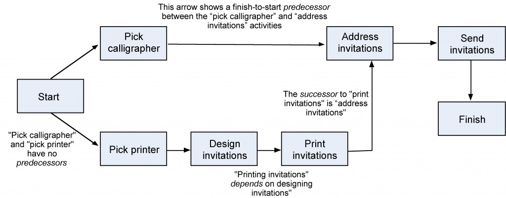
- **Run Chart**
  - Purpose: tracks data over time.
  - time or sequence on the horizontal axis. Corresponding data is measured on the vertical axis.
  - 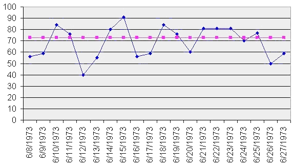
- **Scatter Diagrams**
  - Purpose: identify relationships between variables.
  - helps with root cause analysis.
  - 
- **Velocity Chart**
  - Purpose: measures team output over time.
  - ex.. How many story points completed per iteration.
  - 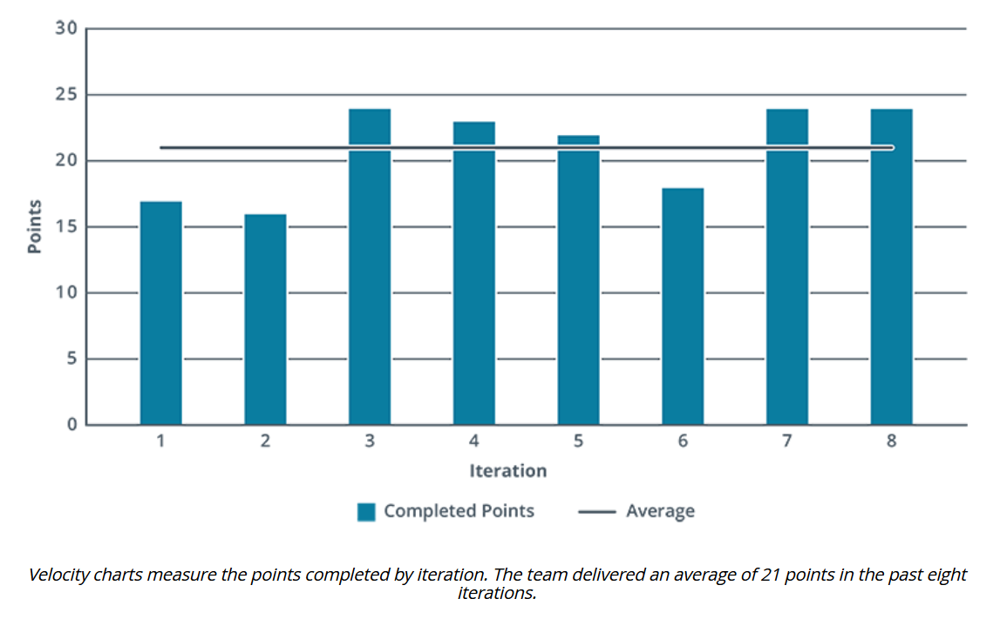

## Change Control Steps

- **Change Management Plan**
  - processes and procedures for introducing and managing changes to a project or organization in a controlled and effective manner.
- **Change Control Steps**
  - Change control in project management helps ensure that any modification to the project baseline (scope, schedule, budget) is evaluated, approved, and implemented in a controlled manner.
  - mnemonic: Initiate Examine Decide Integrate.
  - **CompTIA Four Steps of Change Control**
    1. Initiate the request
    2. Evaluate impacts
    3. Decide on an outcome
    4. Implement the change
- **The change request process uses two documents**
  - **change request form**: information about change(project name, date, description, reason...).
  - **change log**: all change request for project.
  - 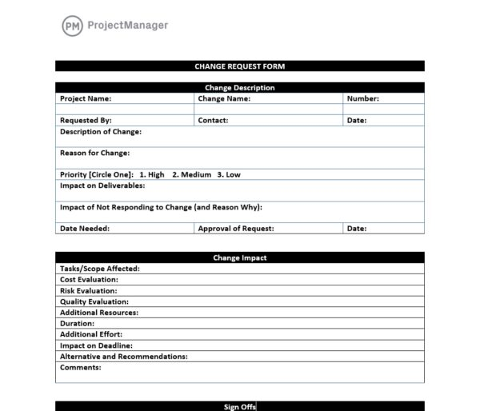
- **Initiate the request**
  - requester initiates by submitting a **change request form** to the project manager.
- **Evaluate impacts**
  - conduct a thorough impact assessment.
  - analyze how the change will effect the project’s constraints: **scope, cost and time**.
  - PM will create an information package outlining the change request, schedule changes, scope changes, risks, resource requirements, and notable impacts.
  - PM will document change recommendations directly in the **change log**.
- **Decide on an outcome**
  - identify and get sign-off from the decision makers(authority to make change).
    - Operational Change: little impact. Normal day-to-day business. PM, functional manager, or CCB.
    - Strategic Change: effects all aspects of business. project sponsor, CCB, and PMO.
    - Risk Owner: If risk is involved, risk owner will contribute to decision.
    - Technical Changes: SMEs will be involved in decision.
    - Software Changes: Technical, Product Owner, and Architectural approval is needed.
- **Implement the change**
  - Communicate Change: stakeholders, project requester, team.
  - Update project plan and if needed the RACI, business case, or stakeholder management plan.
  - Capture the project **baselines before and after** changing the project plan.
  - Validate Change:
    - Project manager: evaluates impact and verifies if as expected.
    - Change Requester: validates results meet requirements.
    - Change Reviewer: compare outcome against business requirements. In agile its product owner. could also be SME or functional manager.
  - PM notifies stakeholders of completed change.
  - Update status in change log.
- **Organizational Change Management**
  - best practices and processes to make changes in an organization.
  - employees and companies are resistant to change.
    - employees: habits, fear, lack of understanding, persoanl values.
    - companies: structural rigidities, resource limitations, cultural, political.
- **OCM: Strategies to manage Resistance**
  - communication: actively listen, be transparent about why change is needed.
  - participation: involve stakeholders, employees. Empower them to contribute.
  - training and support: coaching/mentoring, training resources.
  - incentives: reward those who embrace change.
- **Organizational Change Management: Training, New Knowledge Base, New Process, Communication, Documentation, Ensure Adoption, Reinforce Adoption Over Time**
  - Training: learn how to use deliverable.
  - New Knowledge Base: info about deliverable.
  - New Process: processes are updated to reflect current deliverable. Processes are documented instructions that describe how to complete tasks.
  - Communication: underpins every aspect of OCM. Start early and often.
  - Documentation: allows maintenance team maintain deliverable over time.
  - Ensure Adoption: must make concerted effort to promote user adoption. Extra support for new adopters.
  - Reinforce Adoption Over Time: create plan to sustain adoption. Communication is key.
- **Change Control Orders**
  - Scope: project is over/under delivering(timeline, budget). Brings back into alignment with project management plan.
  - Product Change: product is finished, but new features or changes are wanted.
  - Team Improvement: phase gate, lessons learned. Team keeps improving systems and processes.
  - Strategic Change: company direction changes, this keeps project in alignment without being canceled.

## Communication Management and Meetings

- **Synchronous Communication**
  - real-time communication. Face-to-face(in person, phone or videoconference) with all parties.
- **Asynchronous Communication**
  - delay in communication. email, SMS. Leaves documentation notes.
- **Written Communication**
  - exchanges occur through handwritten/typed messages.
- **Verbal Communication**
  - oral communication
- **Nonverbal Communication**
  - body language and appearance. Signals sent when in person.
- **Formality Communication**
  - company channels to communicate. Official record.
- **Informal Communication**
  - unofficial communication. Casual conversation between coworkers, group chatter before meeting. Nonverbal communication during meeting.
- **Internal Communication**
  - recipients work inside the business.
- **External Communication**
  - recipients work outside the business.
- **Communication Tools: Email, Messaging, Telephone, Meeting face-to-face, Video, Enterprise Social Media**
  - Email: allow response at leisure.
  - Messaging: SMS: text. Chat: exchange via internet. response at leisure.
  - Telephone: fastest for large geographical boundaries.
  - Meeting face-to-face: most information. body language, facial expressions, voice tone change.
  - Video: blend face-to-face with telephone.
  - Enterprise Social Media: internal communication network.
- **Target Audience**
  - who needs to be at the meeting.
- **Facilitator**
  - guides meeting progress. redirect flow if meeting off track.
- **Scribe**
  - records meeting minutes, action items, and follow-ups.
  - mandatory for meeting on the official record.
  - not needed for training sessions.
- **Demonstrations and Presentations Meetings**
  - video, slide show, actual product.
- **Status Meeting**
  - meetings to update progress of project.
  - Initiating: Fewer status meetings might be needed as the project scope and goals are being defined.
  - Planning: More frequent meetings might be necessary to finalize plans, schedules, and resource allocation.
  - Executing: Regular status meetings are crucial to monitor progress, track milestones, and identify issues early.
  - Closing: Fewer meetings might be required as the project wraps up and final deliverables are completed.
- **Gate/Phase Gate Meeting**
  - A checkpoint review of project deliverables and performance at the end of each lifecycle phase or sub-phase.
  - ensure project feasibility, alignment, and readiness before moving forward.
  - These meetings involve key stakeholders and serve as critical decision points throughout the project lifecycle.
  - management review or sign-off may be required.
  - Examples:
    - After the **Initiating phase**: This gate meeting, often called the "**Go/No Go**" meeting, focuses on whether the project remains feasible and aligns with strategic goals.
    - After the **Planning phase**: This gate meeting, sometimes called the "**Stage Gate" or "Baselining**" meeting, reviews the detailed project plan, budget, schedule, and risk assessments to ensure everything is ready for execution.
    - After **key milestones or control points**: Throughout the project execution phases, additional gate meetings can be held to assess progress against deliverables, identify and address emerging risks, and determine if adjustments are needed before proceeding further.
- **Stand-ups**
  - focused, quick meeting. Popular in Scrum Daily stand-ups. Sometimes doing it standing up.
  - **Three Questions covered**:
    - What did I accomplish yesterday?
    - What will I do today?
    - What obstacles prevent progress?
- **Decisive Meetings**
  - decision-making meeting.
- **Decisive Meeting: Task Setting**
  - after decision is made, task are assigned to be completed.
- **Decisive Meeting: Project Steering**
  - keeping project on track(schedule) and successful(approved project task deliverables).
  - includes the PM and executive stakeholders and can represent voice of the customer.
  - support and guidance throughout project lifecycle.
- **Refinement Meeting**
  - also called: **product refinement** or **backlog refinement**.
  - meetings to bring the most valuable ideas to the top(e.g. backlog. Top items have higher priority).
    - top item are then broken down into small tasks and prioritized.
- **Collaborative Meeting**
  - interactive, problem solving meeting.
- **Focus Groups**
  - Project manager runs meeting to gather experiences, needs, problems from customers.
  - gather **qualitative**(customer preference) data and opinions about a particular product, service, or concept.
  - stakeholders can see real-time, genuine reactions to their products from real customers.
  - **dual-moderator focus group**: two moderators. One lead facilitator. Other ensures covering all the content.
  - **dueling-moderator focus group**: two moderators. moderators are actively engaged and take opposite views.
  - **two-way focus group**: one group to observe another focus group’s session.
  - **respondent-moderator focus group**: participants as moderators, creating dynamic energy with many new ideas.
- **Workshops**
  - group with shared interest gather to exchange information and conduct research.
  - solve problems or increase knowledge(skill development).
- **Joint Application Development (JAD)**
  - also called: **joint application review (JAR)**.
  - specific type of workshop that **involves the customer in the design process**.
  - **early feedback**.
- **Brainstorming: Rapid, Reverse, Stop-and-Go, Round-Robin**
  - Rapid: group rapidly generates many ideas. everybody can participate. Quantity over quality.
  - Reverse: look at problem from different angles. ex.. Why you couldn't solve problem.
  - Stop-and-Go: brainstorm short duration then refine ideas. Quality over Quantity.
  - Round-Robin: everyone gets equal voice.
- **Meeting Agenda**
  - meeting schedule, purpose and expectation. Shared in advance.
- **Meeting Timeboxing**
  - controls duration and cadence of meeting.
  - each meeting agenda item will have defined start and stop times.
- **Meeting Action Items**
  - specific tasks or deliverables assigned to individuals or teams as a result of a project meeting.
- **Meeting Minutes**
  - written record of key points.
- **Meeting Follow-up**
  - after meeting email with minutes(meeting recap).
- **Special Needs for Meeting: Language Barriers, Time Zones, Geographical Factors**
  - interpreters, appropriate communication formats.
  - Time Zones and Geographical Factors: what works best for them?
- **Meeting Problems: Technology Factors**
  - slower internet, older hardware. Project manager can provide tools needed.
- **Cultural Differences**
  - any group with social customs, behavior, habits, beliefs.
  - foster respect for each others beliefs. Team bonding.
- **Team Lifecycle: Forming, Storming, Norming, Performing, Adjourning**
  - teams will have a performance ebb and flow.
  - Teams need different types of support and leadership through different positions of lifecycle.
  - Forming: team first time together.
  - Storming: team figure out roles and initial friction from each others flaws.
  - Norming: positive exchange and cohesiveness between team members(team building).
  - Performing: max cohesiveness and performance.
  - Adjourning: team breaks apart.
  - 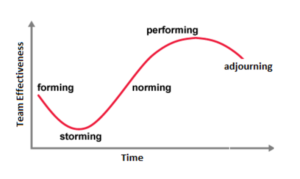
- **Conflict Managing: Smoothing**
  - redirect attention away from conflict. Usually temporary fix.
  - ex.. your both right.
  - 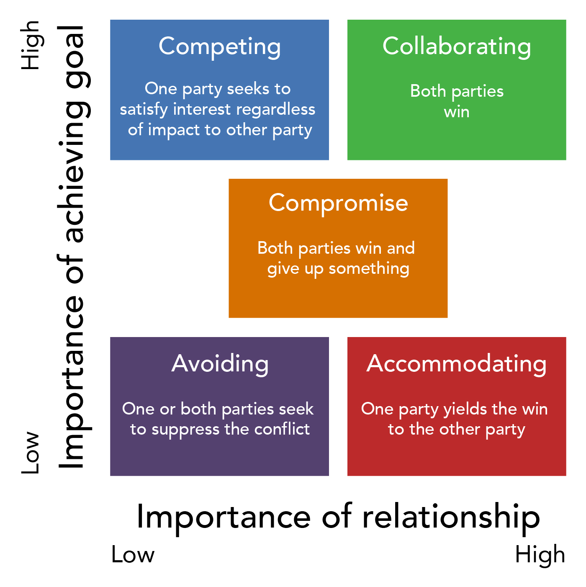
- **Conflict Managing: Forcing**
  - make the decision without discussing it or use your authority to override others.
  - ex.. in a fire, just put it out, don't form a committee.
  - ex.. parents tell their children 'because I told you so!'
  - 
- **Conflict Managing: Compromise**
  - both parties gives up something and meet in the middle.
  - 
- **Conflict Managing: Confronting**
  - fact finding, data driven. Data makes the decision. win-win for everybody.
- **Conflict Managing: Collaboration/Negotiating**
  - both parties collaborate new idea that works as a win-win for both parties.
  - 
- **Conflict Managing: Avoiding**
  - ignore the conflict. Problem is small or not affecting performance.
  - 
- **Conflict Managing: Getting Help for Disgruntled Team Members**
  - minor: open communication between members. one-on-one's to find their fears.
  - major: HR/Legal, Company Policies. Make sure to get the facts.

## Data Confidentiality and Security

- **Access Data, Remote Access, MFA, Removable Media, Mobile Devices, Facility Access, Background Screening, Security Clearance**
  - access data: typically use roles. least privilege.
  - remote access policy: who can connect and how.
  - multi-factor authentication (MFA): two or more credentials.
    - something you know(password), something you are(biometrics), something you have(key card).
  - removable media: usb restrictions.
  - mobile devices: Mobile Device Management (MDM) software.
  - facility access: prevent unauthorized access. Key cards, biometric locks...
  - background screening: checks education, certificates, references, criminal history.
  - security clearance: anyone who accesses national security information must pass credit and criminal investigation.
- **Confidential Data**
  - limited access to authorized users only.
- **Data Confidentiality**
  - protecting sensitive data that identify individuals personal information.
- **Internal Data**
  - within company only. Exposing would not violate laws or trust.
- **Intellectual Property**
  - company owned data. Patents, copyrights, trademarks, trade secrets.
- **Public Data**
  - no restrictions
- **Top Secret**
  - exposure could damage national security.
- **Trade Secrets**
  - competitive advantage. Leaked data could result in great harm to business.
- **Restricted Data**
  - only those authorized. need-to-know only with business justification.
- **GDPR (General Data Protection Regulation)**
  - EU PII data handling requirements. Also adds to NIST, classifying: cookies, radio frequency tags, IP addresses as PII.
- **PII (Personally Identifiable Information)**
  - any information about an individual (social security number, date of birth, mothers maiden name, medical, biometric, financial, educational, employment...)
  - organizations should develope policies and procedures(educate, train) to handle PII and data breaches.
  - Anonymize sensitive data before sharing.
- **Linkable PII**
  - personal identifiable info that can be linked together to create SPII.
  - name, address, email, MAC, phone, race, age, credit card...
- **SPII (Sensitive Personally Identifiable Information)**
  - subset of PII. Any single piece of data that could identify and cause harm or embarrassment.
  - SSN, Passport, Drivers License, Biometric.
- **PHI (Personal Health Information)**
  - IIHI (Individually Identifiable Health Information)
  - past, present, and future health or mental condition.
- **HIPAA (Health Insurance Portability and Accountability Act of 1996)**
  - provides regulations for safekeeping persons personal health records.
  - **(ePHI) electronic Personal Health Information**.
- **NIST (National Instituted of Standards and Technology)**
  - federal agency creates frameworks and process to help protect information.
  - describes 3 levels: low, medium, high impact.

## DevOps, DevSecOps and CI/CD

- **DevOps**
  - automating checks and tests along with development and operations.
  - Problem: Siloed development and operations teams create communication barriers, inefficiencies, and slow code delivery.
  - Solution: DevOps integrates these teams, practices, and tools to optimize the entire software delivery process.
  - Automation: CI/CD automates builds, tests, and deployments for faster releases.
  - Continuous feedback: Early detection and fix of bugs through frequent integration and monitoring.
- **DevOps Strengths**
  - Faster delivery of quality software by eliminating the barrier between development and operations.
  - Improved operational support and cross-functional collaboration.
  - Reduced friction and project risks.
- **DevOps Weaknesses**
  - Requires specialized skills and cultural shift.
  - Difficult to implement for large/legacy systems with minimal automation.
- **DevOps Use Cases**
  -Teams striving for CI/CD and faster releases w/ automation.
  -Companies with resources for cross-functional teams and automation tools.
- **DevOps 4 Phases**
  - plan, code, build, test.
- **DevSecOps**
  - Baking Security into DevOps(entire software development lifecycle) for Faster, **Secure Software Delivery**
  - Importance: Secure systems are crucial for consumer trust, competitive advantage, and regulatory compliance.
- **DevSecOps Strengths**
  - Faster delivery, continuous security feedback, and reduced risk of breaches.
- **DevSecOps Weaknesses**
  - Users may need support and training, security teams must relinquish control, and frequent deployments create higher security demands.
- **CI/CD**
  - Individual developers check their code into the main branch frequently, and automated tests run against the new code.
- **Continuous Integration**
  - Developers merge code frequently, triggering automated tests for early feedback.
- **Continuous Delivery**
  - Code automatically prepared for release but deployment is manual.
- **Continuous Deployment**
  - Code automatically prepared for release and deployment is automatic.

## Extreme Programming

- **Extreme Programming**
  - agile framework. software development. pair programming, emphasis on simplicity.
  - XP: close collaboration, iterative development, and continuous testing.
- **Extreme Programming Pair programming**
  - Two developers work together on code, promoting continuous review and knowledge sharing.
- **Extreme Programming Ten-minute build**
  - Ensures rapid feedback and keeps code clean through fast builds and tests.
- **Extreme Programming Continuous integration**
  - Frequent merging of code to prevent conflicts and enable automated builds/tests.
- **Extreme Programming Test-first programming**
  - Writing tests before code drives simplicity and quality.
- **Extreme Programming Incremental design**
  - Small, frequent improvements over delayed releases.
- **Extreme Programming Open workspace**
  - Fosters communication and teamwork by removing physical barriers(walls). Everyone in same room.
- **Extreme Programming On-site customer**
  - Integrates the customer into the team for direct feedback and collaboration.
- **Extreme Programming 40-hour workweeks**
  - Prioritizes developer well-being and avoids burnout.
- **Extreme Programming User stories**
  - Clear and concise requirements format for effective communication.
- **Extreme Programming Weekly and quarterly cycles**
  - Regular planning, adaptation, and reflection.
- **Extreme Programming Built-in flexibility**
  - Slack in weekly plans allows for adjustments and unforeseen situations.
- **3 Roles in Extreme Programming**
  - Customer: decide features and priority.
  - Tracker: capture metrics, progress, improvements.
  - Coach: mentor team members.
- **Extreme Programming Strengths**
  - Highly efficient and adaptable.
  - Prioritizes essential features and continuous improvement.
  - Strong team cohesion and reduced project failure.
  - Values developer well-being.
- **Extreme Programming Weaknesses**
  - Limited scope to software development (not ideal for non-software projects).
  - Potential for design neglect due to code-centric practices.
  - Rapid pace and minimal documentation can be stressful and hinder onboarding.
  - Reliance on face-to-face interaction (can be challenging for remote teams).
- **Extreme Programming Use Cases**
  - Small, collocated teams with changing requirements and tight deadlines.
  - Projects with strong test automation capabilities.

## Financial and Performance Analysis

- **Cost Estimation Techniques: Analogous, Parametric, Bottom-Up, Three Point**
  - Analogous: same as Top-Down. Entire project. Expert judgement, historical information(past projects).
  - Parametric: `units x cost`. augments either bottom-up or top-down estimates with **historical data**.
  - Bottom-Up: estimating the total cost of individual tasks with the lowest level of detail(WBS).
  - Three Point: optimistic, pessimistic, average. Factors multiple scenarios, creates averages.
- **Budgeting**
  - work closely w/team. define type of estimate(analogous, bottom-up, three point).
  - SMEs and acutal workers
  - templates from PMO.
  - document assumptions.
- **Tracking Expenses**
  - label categories: labor, supplies, hardware, software, travel...
- **Earned Value Management: PV, AV, EV, CV, CPI, SV, SPI**
  - EVM: measures actual expenses to date against 'Cost Baseline'.
  - PV: planned value. estimating budgeted expense for time period. ex.. This month we plan to spend 'x'.
  - AC: actual value. Amount spent in a time period. ex.. Currently we have spent 'x'.
  - EV: earned value. `actual work completed x planned`. ex.. We are ahead of schedule.
  - CV: cost variance. Money. expenses ahead/behind vs. actual expenses. `CV = EV-AC`. <0 bad. >0 good.
  - CPI: cost performance index. `CPI = EV/AC`. Same as CV, shown as ratio.
  - SV: schedule variance. Time. schedule ahead/behind vs. planned time. `SV = EV-PV`
  - SPI: schedule performance index. `SPI = EV/PV`. Same SV show as ratio.
- **Burn Rate**
  - how fast are spending the budget. `burn rate = total budget / monthly money spent`
  -
- **Assumptions**
  - future factors you state as true to present a financial plan.
- **Benefit**
  - money generated or saved from project.
  - also called 'financial value' or 'revenue'.
- **Cost**
  - anything related to project that causes money to flow out of company.
- **Cost-Benefit Analysis**
  - cost to produce vs benefit.
  - timeline of how quickly money can be recouped.
- **Financial Analysis**
  - assigning hard numbers to future events.
- **Net Profit**
  - NET = `benefit - cost`
- **Revenue**
  - money flowing into company as result of project.
- **Scoring Model**
  - rating/weight each project or alternative solution from predefined list of criteria.
  - often includes a 'minimum' rating. Project discarded if not meet minimum.
- **Payback Period**
  - time to recover from all cost of producing product.
- **FV (Future Value) vs PV (Present Value)**
  - include inflation into the cost.
  - Future Value = Present Value(1+interest)^years
- **ROI**
  - percentage of gain for investment.
  - ROI = `(net profit / cost) * 100` // same
  - ROI = `(revenue - cost) * 100` // same
  - ROI = `((Financial Value - cost) / cost) * 100` // same
- **IRR**
  - Internal Rate of Return: profitability of an investment as an average percent over the life of the investment.
  - Higher better.
- **Current State vs Future State or as is-to be, Performance Analysis**
  - how change will effect the business in the future.
  - as is-to-be(also called performance analysis): means same.
- **Discounted Cash Flow**
  - total value of each years expected cash inflow, in 'todays' dollars.
- **NPV**
  - net present value.

## IT Infrastructure and Software

- **Describe: Computing Services, Multitiered Architecture, Networking and Connectivity, Storage, Data Wharehouse, Documentation**
  - Computing Services: any IT infrastructure a project may need. Software(ERP), hardware(laptop, pc), services(IaaS, PaaS).
  - Multitiered Architecture: divide software into tiers and layers. allows for redundancy, enterprise solutions.
    - three-tier design uses presentation, application, and data.
  - Networking and Connectivity: how various components connect(networking).
  - Storage: data location, security, redundancy.
  - Data Wharehouse: extensive database for reporting and analytics.
  - Documentation: documentation about IT infrastructure.
- **IaaS, PaaS, SaaS, XaaS**

  - Infrastructure as a Service:
  - Platform as a Service:
  - Software as a Service:
  - Anything as a Service:

  | Platform | Cloud Provider Includes                                     |
  | -------- | ----------------------------------------------------------- |
  | IaaS     | physical hardware + hardware management software            |
  | PaaS     | IaaS + OS + app development environment(java, python, node) |
  | SaaS     | PaaS + complete app. You bring your data                    |
  | XaaS     | any third party service.                                    |

- **Ticketing or Case Management System**
  - manages customer problem tickets. Automated workflow route customer problem to person who can help.
- **Project Management Scheduling Tools**
  - schedule, plan, and track project timeline.
- **Meeting Tools: Calendaring, Real-Time Survey Poll, Print Media, Conference Platforms, Word Processing, Spreadsheet, Presentation, Diagramming, Real-Time Multi-Authoring Editing Software, File Sharing Platform, Wiki and Knowledge Base, Whiteboard**
  - Calendaring: manage multiple calendar, schedules, time zones, alerts.
  - Real-Time Survey Poll: quickly gather information from groups of people.
  - Print Media: create posters, flip charts, brochures, manuals.
  - Conference Platforms: video(zoom, teams).
  - Word Processing: text document editor.
  - Spreadsheets: data in tables.
  - Presentation: slide show.
  - Diagramming: visually represent process.
  - Real-Time Multi-Authoring Editing Software: multiple people can collaborate at same time.
  - File Sharing Platform: grant file access to multiple users.
  - Wiki: everyone can contribute content. Best when multiple people contribute.
  - Knowledge Base: specific authors contribute. Best for when appearance and simplicity matter(FAQ's).
  - Whiteboard: virtual creative space.
- **ERP (Enterprise Resource Planning)**
  - back office software to coordinate: accounting, human resources, procurement...
  - centralizes management and access for data sharing between roles. Data and API(functionality) centralized.
- **Financial Systems**
  - subset of ERP for the financial budget, spending, and cost estimates.
- **Electronic Document Management System (EDMSs) and Records Management System (RMS)**
  - both are the same thing.
  - software that manages records(artifacts, documents, contracts) lifecycle.
  - enforces government regulations, retention policies.
- **Content Management System (CMS)**
  - interface that hides code complexity from end-user.
  - ex.. create website without technical knowledge.
- **Customer Relationship Management (CRM)**
  - manage relationship w/customers and future customers.
  - Allows for tech support(notes, tracking problems).

## Kanban

- **Kanban**
  - agile framework.
  - Kanban board: Visualizes work, WIP(work in progress) limits, and workflow policies.
  - track task flow and optimize workflow.
  - Simplest agile framework to learn and can be applied to any industry.
  - 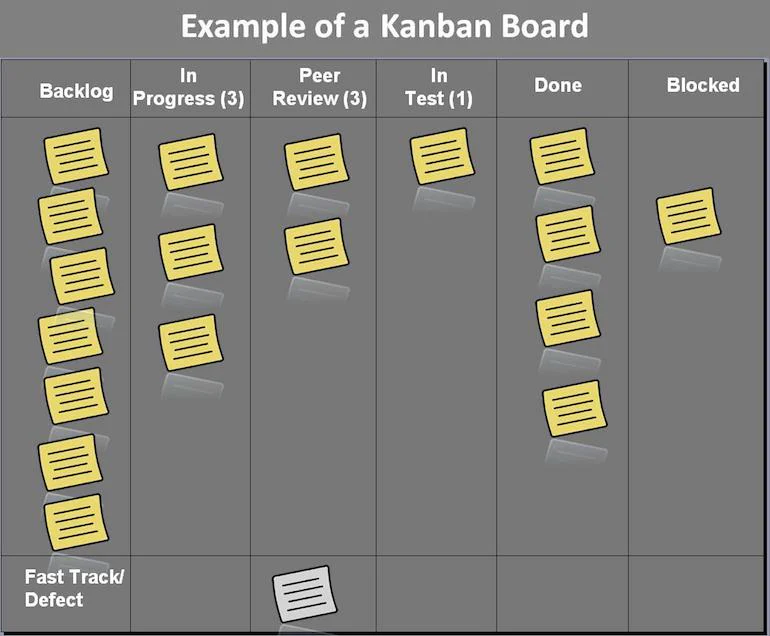
- **Kanban 3 basic phases**
  - To Do, In Progress, Done (can be customized).
- **Kanban 6 Core Practices**
  1. Visualize work: show phase work is in.
  2. Limit WIP: prevent overwhelm, increase product quality by restricting active tasks.
  3. Make policies explicit: clearly define how work moves through phases.
  4. Manage flow: Identify and eliminate workflow bottlenecks for efficiency.
  5. Implement feedback loops: Measure workflow performance and use data for improvement.
  6. Improve collaboratively: Experiment and continuously evolve the workflow.
- **Kanban 4-part workflow**
  - Prioritize backlog, pull work into progress, move through phases, start new work.
- **Kanban Strengths**
  - Simple to learn, flexible, applicable to any industry with routine tasks.
  - Lightweight, focuses on reasonable amount of work and clear policies.
- **Kanban Weaknesses**
  - Requires stable work environment, can struggle with large teams or high turnover.
  - Cycle times may lengthen without set iterations and proper performance management.
- **Kanban Use Cases**
  - Teams with frequently changing backlogs (e.g., ticketing systems)
  - Teams comfortable with less structure and stable workflows.

## PRINCE2

- **PRINCE2**
  - process-based methodology. Common in UK, EU, Canada, Australia.
  - focus on clear project phases, roles, and responsibilities.
  - originally waterfall methodology, but has embraced the agile model.
  - has 7 principles, 7 themes, 7 processes.
- **PRINCE2 Team Manager**
  - management team member focused on helping project manager.
- **PRINCE2 Project Board**
  - authorizes resources and funding in support of project manager.
- **PRINCE2 Project Board Three Roles**
  1. **Executive**: member of upper management represents business perspective, owns project business case.
  2. **Senior User**: represents customer perspective.
  3. **Senior Supplier**: represents supplier perspective.
- **PRINCE2 Strengths**
  - very flexible with any project.
  - greater upper management involvement.
  - constant communication between project board, manager, and teams.
- **PRINCE2 Weaknesses**
  - extensive documentation.

## Projects and Members

- **Project**
  - temporary organization created to deliver one or more business products according to the business-case.
- **What Makes it a Project**
  - mnemonic: 'STU'
  - **Unique**: meet specific business objective.
  - **Temporary**: start and end date.
  - **Stakeholder Satisfaction**: ends when stakeholder is satisfied.
- **Needs and demands of why projects come about**
  - Market Demand, Organizational Need, Customer Request, Technological Advance, Legal Requirement, Ecological Impact, Social Need.
- **Architect**
  - part of the IT team. design. Make sure project interoperates with business goals.
  - Responsibilities:
    - Solution design
    - System blueprints
    - Evaluating systems against organizational standards
- **Artifacts**
  - preexisting knowledge, documentation(lessons learned) or vetted vendors to be used in project planning.
- **Business Analyst**
  - **gathering and documenting** requirements for project.
  - works between the business side and the IT side.
  - Responsibilities:
    - Helping to define the project
    - Gathering business and technical requirements
    - Ensuring requirements stay aligned to needs
    - Interpreting business requirements
    - Verifying deliverables against requirements
    - Assisting with testing and validation of products
- **Business Storytelling: Current State vs Future State**
  - either tell a good story of Current state vs. Future state with descriptive words or charts.
  - both sides must use same metrics.
  - Current State: whats going on right now.
  - Future State: what will change after project.
- **Core Team Members**
  - also called 'operational' team members because they focus on day-to-day operations.
- **Customers: Internal, External, End-User**
  - Internal: inside organization. easy feedback.
  - External: outside organization. typically pay for product.
  - End-User: physical user of final product. Can also provide insight on usability and functionality.
- **Decision Model**
  - apples-to-apples way of comparing projects and which one is the most benefit to company needs.
  - **Rewards**
    - Cost-benefit analysis, Scoring models, Payback period, Discounted cash flow, Net present value, Internal rate of return, Return on investment.
  - **Constrained Optimization Model**
    - mathmatical model for highly complex projects.
- **Developer/Engineer**
  - writing program frontend/backend code.
  - Responsibilities:
    - Writing code to standards
    - Building products according to the project plan or sprint backlog
    - Reporting development progress to the project manager or product owner
- **Expert Judgement**
  - expertise of stakeholder or other subject matter expert to make project decisions.
  - Danger lies with relying on single technique to make selection.
- **Extended Team Member**
  - work part time on multiple projects.
- **Key Performance Indicator (KPI)**
  - operational metrics, that measures only the most crucial project points.
- **Key Performance Indicator (KPI): Lagging and Leading Indicators**
  - Lagging: captured only after work is done.
  - Leading: predictive measures.
- **Milestone and Sprint Goals**
  - Milestone:
    - critical checkpoint in a project. Date dependant event.
    - short milestones help keep project momentum, too many cause fatigue.
  - Sprint Goals:
    - at the start of agile sprint, sprint goal is created that reflects the expected outcome.
- **Objective and Key Results (OKR)**
  - aspirational, slightly out of reach goals to drive teams value further than they thought possible.
  - less is more. focus on the critical needs.
  - Two parts:
    - Objective: goal and why it matters.
    - Key Result: what you need to do to meet the goal.
  - 
- **PMO (Project Management Office)**
  - Functional department for all project managers.
  - manages flow of projects and provides guidance to project managers with organization resources.
- **PMO Supportive Project Management Office**
  - Provides support when it is requested.
- **PMO Controlling Project Management Office**
  - actively monitors project performance. However, this PMO does not have full authority.
- **PMO Directive Project Management Office**
  - Has full authority over projects, standards, and procedures
  - It focuses on organizational strategy and will start, cancel, or adjust projects to ensure strategic alignment
- **Portfolios**
  - prioritize and execute multiple projects/programs more efficiently.
  - support strategic business goals or objectives.
  - Portfolios may consist of multiple projects/programs without related objectives.
- **Portfolios Enterprise**
  - contain all programs/projects.
  - can be broken down into sub-portfolios at division or branch level.
- **Portfolio Management**
  - strategy to maintain and prioritize maximum programs/projects.
- **Preliminary Scope**
  - Preliminary scope statement defines the objectives of the project and explains the business reason the project is trying to solve.
- **Product Owners**
  - help agile teams stay on track with cost, scope, and time.
  - **creating a valuable product and identifying how to improve a product**. Keeping to product vision.
  - create work, but do not manage. Act as customer proxy.
- **Product Manager**
  - **define product strategy**, create roadmap on how product will improve and change over time.
- **Programs**
  - group projects with related objectives to achieve a larger objective.
  - bring about benefits that wouldn’t be achievable if the projects were managed separately.
- **Program Manager**
  - lead groups of projects. Operates at a more strategic level.
  - helps capitalize on the resources of multiple projects.
  - project managers report to them(makes them a stakeholder and your boss).
- **Project Baseline**
  - approved cost, schedule, scope, plans, and documents.
  - used to measure performance/progress. Determine if on schedule, within budget or on target.
- **Project Management Office (PMO)**
  - central location for guidance, standards, artifacts to project managers, programs and portfolios.
  - allows organization to capitalize on the collective benefits of all projects.
  - Functions:
    - organized standards and processes.
    - coordination of resources, templates, artifacts.
    - governance and setting priorities.
    - KPI, performance standards and nonperformance consequences.
- **Project Manager**
  - runs day-to-day management of teams in any framework as long as the project is active.
  - explains benefits of project to stakeholder. All stakeholders(something to gain or lose) must be sold and sign-off, otherwise project may be blocked.
  - keeps project sponsor notified of status, conflicts and risk.
  - responsibilities: **planning, scheduling, documents, progress, risk, fixed time, cost and scope**.
  - completes project goals to stakeholder/company satisfaction.
  - Responsibilities:
    - Building the project team and securing resources
    - Building the project charter and defining the project’s scope
    - Creating required project logs and processes, including the issue log, change log, and risk register
    - Ensuring project deliverables are met which includes making sure team members have the right skills and resources for activity completion on the activity list
    - Preparing and delivering project status updates
    - Tracking the project’s progress and status when compared to the schedule and budget
    - Managing vendor relationships
- **Project Manager Skills**
  - leadership, communication, problem-solving, negotiation, organization, time management.
- **Project Manager: Managing a Project Team**
  - manage team and resources for team.
- **Project Manager: Communicating with Stakeholders and Team Members**
  - sponsors, stakeholders, team members up-to-date. Start -> Finish.
- **Project Manager Scope**
  - goals, deliverables, and requirements of the project.
- **Project Manager Risk**
  - identify, manage, track, monitor risk.
- **Project Manager Budget**
  - alert if cost higher than expected or funds running out.
- **Project Manager Schedule**
  - key deliverables are performed on time.
- **Project Manager Quality Assurance**
  - quality of deliverables meet standards
- **Project Manager Project Artifacts**
  - documents, templates, agendas, diagrams. Project charter is artifact.
- **Project Selection Method**
  - senior members choose project based on documents provided (market share, financial benefits, return on investment, customer satisfaction, and public perception).
- **Project Sponsor**
  - the stakeholder that gives you the go-no go.
  - ultimately responsible for the success or failure of project. Delegates operations to project manager.
  - usually **senior executive** that assigns **money** and **resources** to project.
  - approves project charter by **signing**.
  - **Tie-breaker, champion, adviser of project**.
  - Responsibilities:
    - find/provide funding
    - sign charter. Approve baseline(starting point of project, schedule, scope), high-level requirements.
    - define business case.
    - authorize assignment of human resources.
    - assigns project manager and define their authority.
    - negotiate support from key stakeholders. Champion and market project.
    - enforce milestones by removing road blocks.
- **Resource Pool**
  - list of all the resources that are available to the project team. This includes people, equipment, and materials.
- **Senior Management**
  - highest level of leadership.
  - control organizational goals, communicate with shareholders and board members.
  - prioritize projects, authorize spending, assign team members.
- **SMART Objective**
  - Specific: define exactly what is needed.
  - Measurable: what change to look for.
  - Achievable: realistic goal.
  - Relevant: align with business goals.
  - Time-Bound: target end date.
- **Sponsors**
  - single senior manager reviews/validates initial business case.
  - secures funding and removes barriers.
- **SMEs (Subject Matter Experts)**
  - team members performing the work. have the specific knowledge and experience to do the work.
- **Team Member and Extended Team Member**
  - **Team Member**: knowledgeable person either full time.
    - keep timeline, cost of project.
    - communicate with project manager risk, updates.
  - **Extended Team Member**: also called Fractional Team Member.
    - Only available part time. Typically Subject Matter Expert.
- **Tester/Quality Assurance**
  - ensure requirements are met. help prevent errors.
- **Validate a Project**
  - write business case, identify and analyze stakeholders.
- **Vendor**
  - third party provides resources.
  - Responsibilities:
    - Provide work outlined in contracts
    - Maintain service level agreements
    - Keep clear lines of communication open for business relationships

## Project Charter

- **Project Charter**
  - source of truth for the project. It describes the vision and direction of the entire project and once signed by project sponsor, it's the first official document recognizing project has begun.
  - written by product manager and delivered to all stakeholders, but signed and approved by project sponsor.
  - **Purpose**:
    - outlines projects purpose, scope, and key stakeholders.
    - defines project goals, objectives and success criteria.
    - outlines project scope(what will and won't be done), boundaries, and deliverables.
    - identifies key stakeholders(anyone with vested interest, good or bad).
    - documents initial assumptions(unknown), constraints(blockers), and risk(known).
- **Project Charter Functions**:
  - Objective and deliverables: clearly define desired result, deliverables and start, end date.
  - Scope and boundaries: clarifies project manager and team members(needed skills) roles and authority level.
  - Assumptions: based on previous experience, you can expect similar.
  - Timeline and milestones: tracking(on schedule) details on each stage of project.
  - Requirements and budget: List all blockers, and high-level resource estimation.
  - Stakeholder Register: clarifies roles, contact, and expectation for stakeholders.
  - Constraints and Risk: Something fixed(must be worked around). Threat to project(missed deadline).
  - Success criteria: delivered on time, within budget, meets goals(fit, regulations, quality, performance).
  - Signatures: Project sponsor must review and sign off.
- **Project Charter Creation**:
  - business case is the starter for charter creation.
  - check the PMO: for artifacts, lessons learned, and templates.
  - after project charter is signed, identify people who will do the work and have the right skills.

## Project Lifecycle Phase 1 Discovery

- **Discovery/Concept Phase**
  - first phase. determine whether project is worthwhile/justified.
  - business case is created.
  - high level estimate of cost and time.
- **Discovery: Business Case**
  - Looks for ways(artifacts) to speed up the project: prequalified vendors, clients, contracts.
  - **If project considered risky**
    - Perform **feasibility study**: new projects, complex projects, risky projects.

## Project Lifecycle Phase 2 Initiating

- **Initiating Project**
  - after business case is approved, formal authorization for a new project to begin.
  - Next: preliminary scope statement, project charter, team assembled.
  - Project Charter
  - High Level Scope
  - RACI: Responsible, Accountable, Consulted, Informed.
  - Project kickoff meeting.
  - feasibility studies, cost-benefit analysis, risk assessment, project charter development, and obtaining stakeholder buy-in. Validating the business case is a key activity within these.
  - Steps:
    1. business case is validated and project is authorized.
    2. determining budget constraints happens before or alongside project team identification.
    3. once project team is identified, PM consults their ideas into the project charter.
    4. project schedule is created with input from team.
    5. Project charter is updated with all the new information.
- **Initiating Project: Preliminary Scope Statement**
  - **clearly defines how the work will be done**.
  - after business case, preliminary scope statement is **first artifact created** and will become part of the project charter.
  - preliminary scope statement and the scope statement are the same. Only difference is maturity.
  - document grows with project becomes more mature. This document will be the reference for the planning phase.
  - Functions:
    - Scope Description: summary project intent and purpose.
    - Acceptance Criteria: description of successful project.
    - Deliverables: project boundaries and what team will deliver.
    - Exclusions: what team will not deliver.
    - Assumptions: the project unknowns as known.
    - Constraints: what has to be worked around and could delay project.
- **Initiating Project: Stakeholder**
  - engage stakeholder to build and manage relationship throughout project.
  - Engagement Plan:
    - Stakeholder: List the person or group.
    - Point of Contact: If the stakeholder is not a person, list the person who represents the stakeholder.
    - Power: List the power level from the Power/Impact Grid
    - Influence: List their impact level from the Power/Impact Grid.
    - Project Phase: List the project phases that you will need to engage with them
    - Engagement Needs: Describe what they need or why they are a key stakeholder
    - Engagement Approach: List the type of engagement you will conduct from the
    - Power/Impact Grid
      - 
    - Methods: Capture how you will communicate with them
    - Frequency: List a descriptive term of how often you will engage with the stakeholder
- **Initializing Project: Records Management**
  - CRUD(create, read, update, delete) policies for documents and records.
  - where records are stored, liaisons listed, classification.
  - Types of records:
    - Management Artifacts: budget, stakeholder engagement...
    - Artifacts: documents created as project moves along.
    - Legal Documents: contracts.
    - Communications: written communication: meeting notes, status reports.
  - **Records Management System (RMS)**: software that manages record lifecycle.
    - enforces government regulations, retention policies.
- **Initializing Project: Access Requirements**
  - software that manages employees can access. Typically based on roles.
  - access is least privilege(only what is required).
- **Initiating Project: Kickoff**
  - live meeting with team. Discuss project purpose, goals, plan.
  - signifies start of the project work. Team roles identified.
- **Validate Business Case**
  - assessing the project's projected benefits, costs, risks, and alignment with organizational goals. It ensures the project is worthwhile and addresses a business need before significant resources are committed.

## Project Lifecycle Phase 3 Planning

- **Planning: Project Management Plan**
  - documents that describes what the team will deliver and how they will deliver them.
- **Planning: Scope Statement**
  - agreement between customer and project team about the deliverables and success criteria.
  - what will and won't be delivered.
- **Planning: Scope Statement Components**
  - living document. This is the preliminary scope statement as it grows to maturity.
  - Functions:
    - Description: summary project intent and purpose.
    - Acceptance Criteria: description of successful project.
    - Deliverables: project boundaries and what team will deliver. Specific and verifiable(measurable).
    - Exclusions: what team will not deliver.
    - Assumptions: believed to be true.
    - Constraints: what has to be worked around and could delay project(weather, laws, budget, time).
- **Planning Functional vs Non-Functional Requirements**
  - Usability: non-functional. is solution user friendly.
  - Compliance: non-functional. comply with regulations.
  - Features: functional. what deliverable does.
  - Implementation: functional. how it works.
- **Planning: Requirements**
  - description of what makes the project a success.
  - can be part of scope statement or separate document.
- **Planning: Project Constraints and Assumptions**
  - constraints: restricts progress(weather, laws, budget, time).
  - assumptions: believed to be true.
- **Planning: Prince2**
  - popular UK, EU methodology. Any size project. Known for step-by-step(small stages) progress.
  - heavy documentation describes milestones of each step.
- **Planning: DevOps and DevSecOps**
  - DevOps: development team and operations team combined into one team. Improves collaboration.
  - DevSecOps: add security responsibilities to team.
- **Planning: SDLC**
  - plan, design, build, test, deploy.
  - waterfall and agile are methodologies of SDLC.
- **Planning: Three Types of SDLC**
  - waterfall, agile, hybrid.
- **Planning: Hybrid SDLC**
  - combining best parts of multiple methodologies(scrum+kanban = scrumban) to fit business goals.
- **Planning: Agile**
  - projects in small incremental portions.
  - continuous stakeholder feedback.
- **Planning: Difference Between Scrum and Kanban**
  - both are agile methods and both are known as 'pull systems'.
  - scrum: short sprints(time-bound).
  - kanban: continuous workflow. Visual board to track progress.
- **Planning: Scrum Team Roles**
  - product owner: voice of the customer.
  - scrum master: enforces scrum principles(daily standups).
  - scrum team: cross-functional team doing short time-bound sprints to create the MVP(minimum viable product).
    - user-stories are kept in backlog.
- **Planning: Scrum Minimum Viable Product**
  - MVP: breaking down features into small task that have enough features for customer to examine and provide feedback. Similar to prototype or mockup.
- **Planning: Scrum Backlog**
  - user stories needed to complete project.
- **Planning: List Agile Methodologies**
  - Extreme Programming(XP), Scrumban, feature-driven development, dynamic systems, Agile unified process.
- **Planning: Solutions Architect in Solutions Design**
  - solutions design: determine best technical solution for business problems.
    - function requirements: must haves from each stakeholder.
    - Non-functional requirements: implied must haves. (clean restaurant if looking for eating place)
  - solutions architect: determines solution, works closely with team and project manager.

## Project Lifecycle Phase 3 Planning: Communication, Escalation Plan, Budget, Purchasing

- **Communication Plan**
  - formed in phase 1, Initiating. Further refined in planning phase.
  - keep everyone involved in a project informed, engaged and aligned.
  - how team/stakeholders will receive project updates.
- **Develop a Communication Plan: Meeting Cadence and Methodologies**
  - depending on project size, stakeholder needs, urgency of project.
  - Cadence: frequency and format of meetings.
    - daily stand-up, weekly meetings, bi-weekly meetings.
    - meet more, faster burn-out and scope creep. Meet less, harder to share progress or change plans.
  - Methodology: most suitable type of communication based on project needs and audience.
    - In-person meetings, video conferencing, phone calls, Asynchronous communication(email, sms, chat...)
  - How To Do It:
    - identify team/stakeholders, best meeting methodology and cadence(time zones, urgency), basic personal preferences, communication preference.
    - project team:
  - 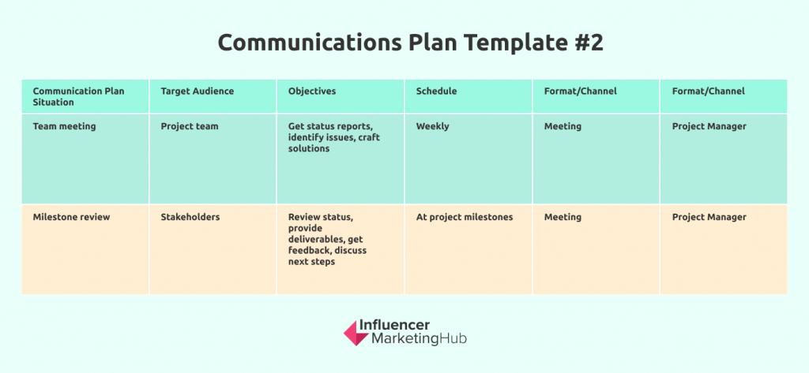
- **Communication Records**
  - all the artifacts, meeting notes throughout the project.
- **Communication Records: Security**
  - proper classifying artifacts as company property.
    - Public data: no restrictions.
    - Confidential: authorized only.
    - Critical: top secret. Authorized only. Could include criminal charges.
- **Communication Records: Integrity**
  - artifacts and messages are not missing or changed.
  - proper meeting minutes by scribe.
  - preventing artifacts from being deleted.
- **Communication Records: Archiving**
  - keeping artifacts per business or government law requirements.
- **Escalation Plan**
  - formed in phase 1, Initiating(sponsor). Further refined in planning phase(key stakeholders).
  - artifact that outlines when event should be escalated and to whom.
  - 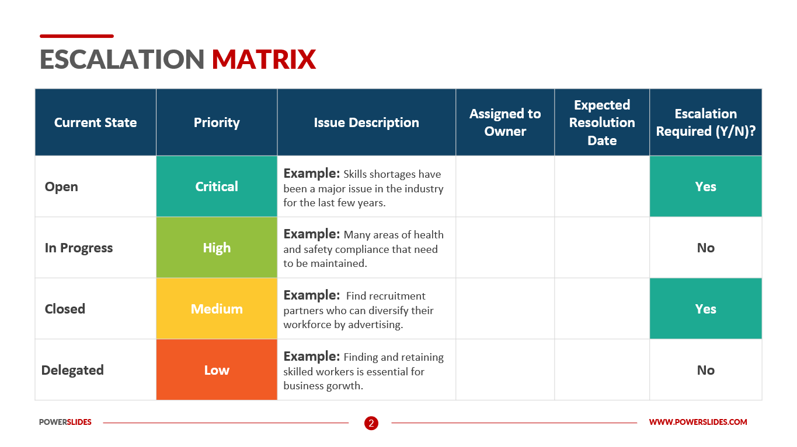
- **Budget: Manage Reserves, Documentation, Update**
  - Budget: summary of all resource cost.
  - Manage Reserves: know how much reserves you have.
    - 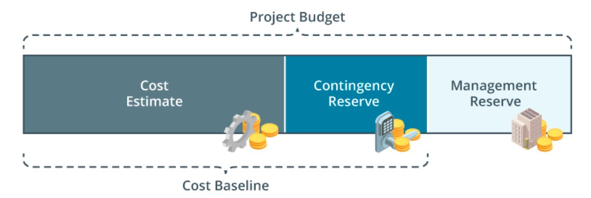
  - Document: document each estimate for future review.
  - Update: update budget when changes occur.
- **Purchasing: Build, Buy, Lease, Subscription**
  - Build: you create it in-house.
  - Buy: third party purchase.
  - Lease: fixed-term contract.
  - Subscription: flat fee for service.
- **Purchasing: RFI, RFP, RFB, RFQ, SOW, SLA, PO, TOR, Non-Disclosure, Warranty**

  - Request for Information (RFI): planning. **learn more** about **solutions** vendor offers. Qualify and shortlist vendors.
  - Request for Proposal (RFP): when you clearly understand your needs, solicit **multiple vendors** proposed **solutions** to your problem.S
    - vendors return their qualifications, approach, methodology, pricing.
  - Request for Bid (RFB): solicit **proposals** while vendors **compete** on **price**. competitive bids for a **well-defined project** with specific requirements.
  - Request for Quote (RFQ): formal document requesting **pricing quotes** for **clearly defined goods** or services.
  - Statement of Work: formal document that outlines the work a vendor needs to deliver. (work activities, timeframes, milestones, pricing).
  - Service Level Agreement (SLA): service contract that specifies performance expectations and consequences.
  - Purchase Order: request for specific goods or services.
  - Terms of Reference: shared understanding of a group’s scope of work or expectations.
  - Non-Disclosure Agreement: won’t share specific information with others.
  - Warranty: vendor’s commitment to resolving defects.

| Feature            | RFI                   | RFP                   | RFB                   | RFQ                |
| :----------------- | :-------------------- | :-------------------- | :-------------------- | :----------------- |
| Issued at          | Planning stage        | Planning stage        | Procurement stage     | Procurement stage  |
| Purpose            | Clarification, info   | Detailed proposal     | Competitive pricing   | Pricing comparison |
| Level of detail    | Low                   | High                  | Moderate              | Low                |
| Emphasis           | Information gathering | Vendor qualifications | Specific specs, price | Price              |
| Selection criteria | Not applicable        | Qualifications, price | Price, qualifications | Price              |

- **Purchasing: Price vs Value, Cost-Benefit, Market Research, Competitive Analysis, Qualifications, Pre-qualified Vendors, Demonstration, Technical Approach, Financial Capacity, References**
  - Price vs. Value:
    - Best Value: features, quality, service, and long-term impact on your product.
    - Lowest Cost: Useful for standard items where quality differences are minimal.
  - Cost-Benefit Analysis: Quantify the costs and benefits associated with each vendor option.
  - Market Research: insights through industry reports, expert opinions, and user reviews.
  - Competitive Analysis: Compare the strengths and weaknesses of different vendors.
  - Qualifications: Ensure they have the skills and resources to deliver on your project requirements.
  - Pre-qualified Vendors/Sellers: existing lists of approved vendors.
  - Demonstration: Request a live demonstration of the vendor's product or service.
  - Technical Approach: Assess their ability to integrate with your existing systems.
  - Physical and Financial Capacity: vendor has the physical resources and financial stability to deliver.
  - References: Contact existing customers or partners of the vendor.
- **Purchasing: Time and Material, Unit Price, Fixed Price, Cost Plus**
  - Time and Material: You pay for the vendor's time and actual materials used.
  - Unit Price: fixed price per unit.
  - Fixed Price: single price, up-front.
  - Cost Plus: pay vendor cost plus fixed fee.

## Project Lifecycle Phase 3 Planning: Scheduling, Dependencies, Estimation, Baselines, Testing

- **Scheduling**
  - defining units of work, cost, resources for a project.
- **Scheduling: Define and Create WBS**
  - Work Breakdown Structure: deliverable-oriented hierarchy that describes required work.
    - waterfall.
  - major deliverables are broken down into smaller components, for time and cost estimation.
  - 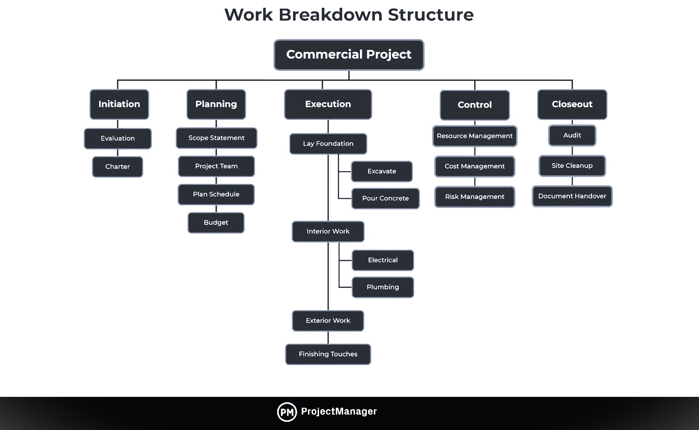
- **Scheduling: WBS levels**
  - highest level: project name.
  - second level: major deliverables.
  - sub levels: subprojects.
  - lowest level: work package.
  - 
- **Scheduling: WBS Dictionary**
  - describes each deliverable, resources, tracking code(for accounting), criteria for success.
  - similar to 'scope'.
- **Scheduling: Analogous Estimating vs Bottom-Up Estimating**
  - Analogous: estimating top-Down. Expert judgement, historical information(past projects).
  - Bottom-Up: estimating the total cost of individual tasks with the lowest level of detail.
- **Scheduling: Task Sequencing**
  - identify proper scheduling order of project activities.
- **Scheduling: Two Major Relationships between Dependent Task**
  - predecessor: project that must be completed before task.
  - successor: project that must be completed after task.
- **Scheduling: Three Most Common Activity Estimators**
  - Expert Judgement: someone experienced.
  - Analogous or Top-Down: artifact(similar activities) from previous project.
  - Parametric: quantitatively-based estimates (rate x quantity).
- **Scheduling: CPM**
  - Critical Path Method: finding the longest stretch to dependencies(sequential activities).
  - exposes task that risk missing the finish date.
  - Three things needed:
    - list of all project task.
    - project dependencies.
    - time each task will take.
- **Scheduling: Calculate Critical Path**
  - which path adds up to the longest. Any delay will result in missing the finish date.
  - 
- **Scheduling: Responsibility Assignment Matrix (RAM)**
  - created in the initiation phase. Activities are added in the planning phase.
  - clarifies team member assignment(ownership roles) and who to work with.
  - every activity must have one and only one accountable person.
  - **RACI**: (what role does team member fall into?)
    - responsible: do the work.
    - accountable: manager.
    - consulted: Subject Matter Experts.
    - informed: receive updates only(stakeholder, senior manager...).
    - 
- **Define Critical Path Task**
  - critical path task activity with zero or negative float.
- **Dependencies and Sequencing. Predecessor and Successor. Four Types of Logical Relationships: FS, SS, SF, FF**
  - Dependency: relationship between activities. One activity cannot start until other is finished.
  - Sequencing: order the work must be completed in.
  - predecessor: before task.
  - successor: after task.
  - finish-to-start (FS): predecessor must finish before successor can start.
  - start-to-start (SS): predecessor must start before successor can start.
  - start-to-finish (SF): predecessor must start before successor can finish.
  - finish-to-finish (FF): predecessor must finish before successor finishes.
- **Dependency: Mandatory, Discretionary, External, Internal**
  - Mandatory Dependency: Hard logic. unavoidable. must have due to legal, contracts...
  - Discretionary Dependency: Soft logic. preference only.
  - External Dependency: outside organization control.
  - Internal Dependency: inside organization.
- **Estimation: Top-Down, Bottom-Up, Three Point**
  - Top-Down: estimate entire project.
  - Bottom-Up: estimate smallest task first, then add up.
  - Three Point: `optimistic time + pessimistic time + (4 * average time) / 6 = estimated time.`.
- **Estimation: Story Points, Task**
  - Story Points: use size to visualize cost relative to other User Stories. That is translated into numbers.
  - 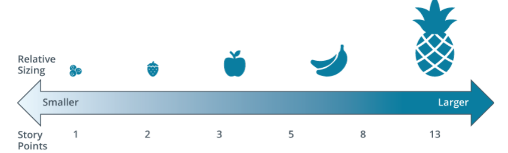
  - Task: break down into user stories or work packages.
- **Estimation: Indirect Cost, Resource Cost, Contingency Reserve**
  - Indirect Cost: not related to specific activity. Overhead cost(building and supplies expense, insurance).
  - Resource Cost: tangible items or activities.
  - Contingency Reserve: financial reserve when things go wrong. Buffer of time, money, and resources.
- **Estimation: Reserve Analysis**
  - decision tree analysis.
- **Baselines**
  - project starting point. Track project progress.
- **Baseline: Setup**
  1. Scope Baseline: review scope statement, identify critical deliverables.
     1. WBS
     2. WBS dictionary.
  2. Schedule Baseline: review project duration and deadline.
  3. Cost Baseline: total project cost plus total contingency reserve.
  - Obtain stakeholder approval.
- **Testing: Automation, Manual, Unit, Regression, Smoke, User Acceptance, Performance, Stress**
  - Automation Testing: enables continuous integration.
  - Manual Testing: time consuming and expensive. person must complete every step.
  - Unit Testing: smallest piece of functionality in software.
  - Regression Testing: change did not effect existing code.
  - Smoke Testing: run before deploy. Confirms main features are working.
  - User Acceptance Testing: Does user like it? Final test.
  - Performance Testing: stable under workloads.
  - Stress Testing: performance test exceeding expected conditions.
- **Service after Go-Live: SLA, Post-Implementation Support, Warranty**
  - Service Level Agreement: contract guaranteeing a level of service.
  - Post-Implementation Support: support after go-live.
  - Warranty: guarantees that a product will meet specific requirements.

## Project Lifecycle Phase 4 Executing

- **Executing Phase**
  - where work is performed, monitored, and tracked. If product does not conform, change request are created.
    - Producing and verifying deliverables
    - Implementing change management
    - Managing vendors
    - Tracking and reporting project results
    - Updating project elements such as budget, risk, and timelines
    - Managing conflict
    - Risks and issues log
    - Performing quality assurance/governance activities such as coordinating phase gate reviews
    - Monitoring the budget
    - Conducting project meetings and updates
- **MVP**
  - Minimum viable product: early version of product. Quick to get feedback.
  - MVP looks at the feature list and defines the bare minimum requirements for testing a product.
- **Requirements Traceability Matrix (RTM)**
  - document that links project requirements and the deliverables. maps how well project meets initial goal.
  - Tracks how design documents, test cases, and deliverables align with specific requirements.
  - Demonstrates that all requirements are addressed and tested.
  - Provides a audit trail to show compliance and manage changes.
  - 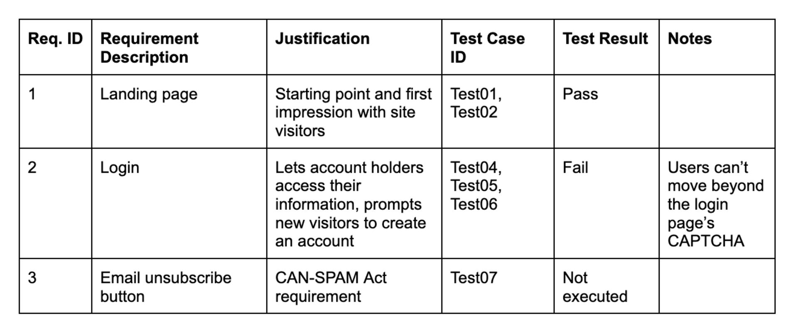
- **Tools: Time-Tracking, Task Board, Version Control, Issue Log, Defect Log, Change Log**
  - Time-Tracking: tracks how long to complete task. Set realistic goals.
  - Task Board: similar to kanban board. show each work item as a card.
    - 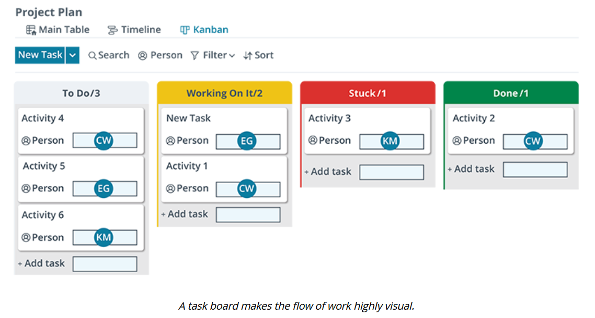
  - Version Control: traceability tool for source code. ex.. git.
  - Issue Log: problem arises you have no control of. Record problem, who found it, date.
  - Defect Log: fails to meet specification. Record problem, resolution, date, found by, impact.
  - Change Log: project activities differ from project plan. Record description, impact, date, who.
- **Meetings: Team Touch Point, Sprint, Stakeholder, Conditional, Phase Gate Review, Change Control, Ad Hoc**
  - Team Touch Point: update projects overall progress and solve problems(brainstorm solutions).
  - Sprint Meetings: discuss progress. Add, prioritize backlog.
  - Stakeholder Meetings: projects overall progress. Gather feedback. Highlight what's next.
  - Conditional Meetings: meetings on request when you need support from a specific group.
  - Phase Gate Review Meeting: checkpoint review of project deliverables and performance at the end of each phase or sub-phase.
    - a management review or sign-off may be required.
  - Change Control Meeting: review change request.
  - Ad Hoc Meeting: unscheduled meeting to deliver project updates.
- **Feedback**
  - all feedback(negative or positive) help create better product.
- **Issue Management**
  - Identify: find and record issue.
  - Analyze: determine cause of issue.
  - Resolve: decide what to do.
  - Monitor: confirm issue resolved.
- **Issue Tracking: Severity, Urgency, Impact, Escalation**
  - Issue Tracking: project manager maintains list of issues.
  - Severity:
    - Critical: system is down.
    - Major: system working, one or more features down.
    - Minor: not working as expected.
    - Low: cosmetic defects.
  - Urgency:
    - Critical: resolve immediately.
    - Major: resolve within hours.
    - Minor: resolve within days.
    - Low: resolve when convenient.
  - Impact:
    - High: project may not finish.
    - Medium: project delayed.
    - Low: project will be fine.
  - Escalation:
    - High: plan in place, escalated.
    - Medium: plan in place, not escalated.
    - Low: no plan to escalate.
- **Issues Resolution Plan**
  - Verify Issue Resolution: make sure fix did not cause other problems.
  - Remove Workarounds: should be temporary.
  - Complete Outcome Documentation: update issue log.
- **Root Cause Analysis**
  - Root Cause Analysis: technique used to determine the true cause of the problem.
    - use scatter diagram to find root cause.
    - use run chart.
- **Root Cause Analysis Five Whys, Fishbone**
  - Asking why five times to determine root cause.
  1. why is problem happening?
  2. why...
  - Fishbone: multiple potential causes to problem.
- **Change Control, Scope Creep, Change Request Form, Change Log**
  - Change Control: the channel to request, record and get approval for.
    - Change control improves traceability for project requirements.
    - The purpose of change control is to manage changes to the scope, time, and cost baselines.
  - Scope Creep: Scope creep is an unapproved change.
  - Change Request Form: information about change request.
  - Change Log: all change request for project.
- **Change Request: Evaluate Impact, Determine Decision Maker, CCB, Communicate Change Status, Update Project Plan, Validate Change Implementation, Communicate Change Deployment**
  - Evaluate Impact: project manager conducts impact assessment for every change request.
    - how change would affect the project’s resources, budget, scope, and schedule.
  - Determine Decision Maker: person/group with authority to approve change.
  - Change Control Board (CCB): owns project changes.
  - Communicate Change Status: let relevant parties know about change.
  - Update Project Plan: reflect new change, scope, deliverable, budget.
  - Validate Change Implementation: project manager, change requester, and change reviewer will validate the change implementation.
  - Communicate Change Deployment: After validation, PM notifies stakeholders of the completed change.
- **Change Request IT: Infrastructure and Maintenance Window, Standard, Normal, Emergency**
  - Infrastructure Changes: require advanced notice if they disrupt customer.
  - Maintenance Window: system may be offline. Changes are planned downtime events.
  - Customer Notifications: notification sent out to customers.
  - Standard Change: recurring routine change.
  - Normal Change: no set process. Does not happen often.
  - Emergency Change: unplanned. no advance notice.
- **Change Request IT: Rollback Plan, Validation Checks**
  - Rollback Plans: undo change if it doesn't have expected outcome.
  - Validation Checks: confirm behaves as expected. If problem, record in defect log.
- **Tiered Architecture**
  - the different 'tier' environments: development, testing, production.
- **Performance Monitoring: Cost Variance, Schedule Variance**
  - Track Permformance: burndown chart, gap analysis.
  - Cost Variance: difference between Earned Value and Actual Cost. Monitor if project is on schedule and budget.
  - Schedule Variance: monitor if project is on schedule.
  - 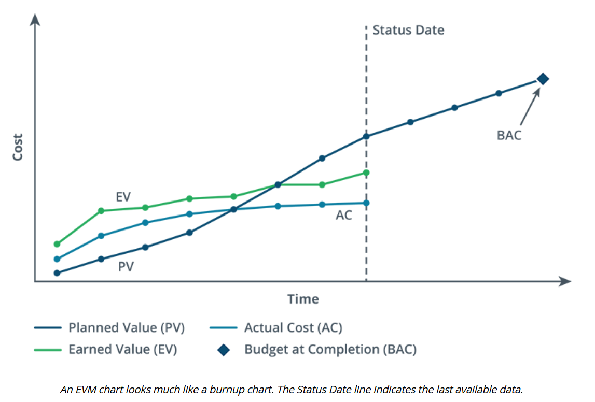
- **Project Schedule: Rebaseline, Dashboard**
  - Rebaseline: if project strays so far from baseline, it's no longer usable.
    - ex.. project gets two weeks behind, all the post work will always be two weeks behind.
  - Dashboard: typically one screen with KPI show most important.

## Project Lifecycle Phase 5 Closing

- **Closing Phase**
  - project closeout. contracts closed, team members released.
  - Project teams can use **organizational change management (OCM)** to reduce the strain caused by change.
  - validate deliverables, document acceptance of project work.
    - Project Sign-off: formal written sign-off from project sponsor.
    - Transfer Product: pass operations testing and final customer.
    - Releasing resources: team members. Removing access.
    - Closing contracts: make sure all terms and conditions are satisfied.
    - Administrative Closure: writing the project closeout report.
    - Archiving project documents: PMO. Retention policies.
    - Lessons Learned: project closure meeting, obtaining feedback and lesson learned. Rewards and celebration.
  - **The closing phase deliverables include the following:**

| Activities             | Artifacts               | Meetings                | Outcomes          |
| :--------------------- | :---------------------- | :---------------------- | :---------------- |
| Project evaluation     | Reconciled budget       | Project closure meeting | Approval to close |
| Deliverable validation | Project closeout report | Celebration             | Closed contracts  |
|                        | Document archive        |                         | Project sign-off  |

- **Closing: Project Endings**
  - Addition: evolve into operations. Maintaining the deliverable.
  - Starvation: canceled, resources pulled, other projects take priority.
  - Integration: merge into another project.
  - Extinction: natural death. completes.
- **Closing: OCM**
  - Organizational Change Management (OCM): structured change.
  - think about how a project affects people in the organization.
  - what you need them to do differently to make the project’s outcome successful.
  - provide the necessary artifacts and support to help them.
  - monitor and reinforce adoption.
  - 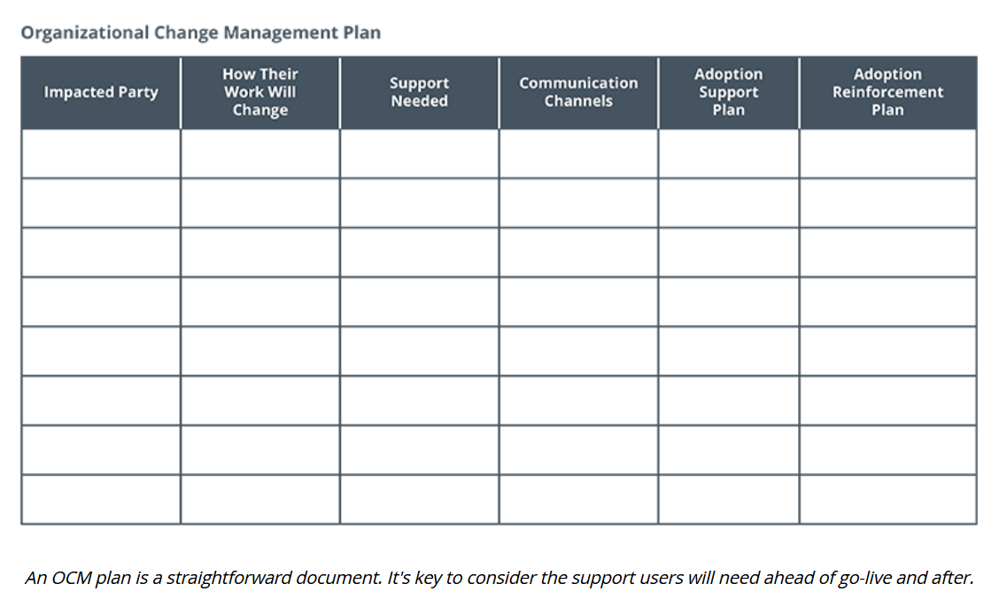
- **Closing: Validation of Deliverables, Closing Contracts, Removing Access, Releasing Resources**
  - Validation of Deliverables: deliverables transfer to owners. Confirm met objective and completed deliverable.
  - Closing Contracts: after stakeholder approval, confirm deliverables.
  - Reconcile the Budget: after all contracts paid. Research and resolve any discrepancies.
  - 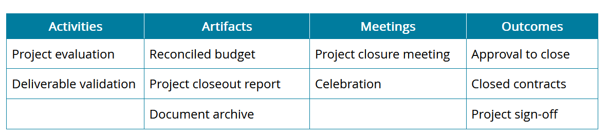
- **Closing: Project Evaluation, Project Closeout Report, Collect Feedback from Stakeholders, Remove Access, Release Resources, Archive Documentation**
  - Project Evaluation: lessons learned. What could we do better.
  - develop summary report of KPI.
  - Project Closeout Report: document closure meeting.
    - Project Overview, highlights, performance analysis, challenges, future considerations, lessons learned, financial summary, transition summary, closure approval request.
  - Collect Feedback from Stakeholders: send survey after close.
  - Remove Access: unnecessary access. keys, badges, logins.
  - Release Resources: formally acknowledge end of project. Notify all involved.
  - Archive Documentation: project documentation(notes, recordings, documents, contracts).

## Project Management Documents

- **Business case**
  - Discovery
  - Justification for the project.
- **Cost benefit analysis**
  - Discovery
  - is expense justified by return investment.
- **Statement of Work (SOW)**
  - Initiating
  - SOW is crucial in establishing preliminary scope statement. Gets created after business case approval.
  - SOW will define what is the 'go live' or end phase of project.
- **Preliminary scope statement**
  - Initiating
  - Project objectives are defined; business problem the project will address is stated.
  - Using the SOW statement and business case.
- **Project charter**
  - Initiating
  - Authorizes the project to begin.
- **Stakeholder Register/Matrix**
  - Initiating
  - Chart that defines stakeholder role, contact, and involvement in project.
- **Responsibility assignment matrix (RAM)**
  - Initiating
  - Also called RACI matrix.
  - table that clearly defines the roles and responsibilities of each individual or team involved in a project.
  - RACI is a way to define responsibilities on the project and stands for responsible, accountable, consult, and inform.
- **Communication plan**
  - Planning
  - how project information will be shared among stakeholders throughout the project lifecycle.
  - defines which stakeholders needs information, when do they need it, and how the information will be delivered.
  - Communication plan is a chart that shows:
    - stakeholder contact info, roles, responsibilities.
    - their preferred communication channel(email, text, phone), cadence, escalation procedures.
- **Project schedule**
  - Planning
  - Determines the start and finish dates for project activities and assigns resources to the activities.
- **Scope statement**
  - Planning
  - Documents the product description, key deliverables, success and acceptance criteria, key performance indicators, exclusions, assumptions, and constraints.
- **Project management plan**
  - Planning
  - Consists of all the project planning documents such as charter, scope statement, schedule, and more.
- **Action Plan**
  - Planning
  - Create task from WBS.
  - Describe tasks or activities that need to be completed within a project.
- **Escalation Plan**
  - Planning
  - escalation plan is crucial for handling unforeseen issues that require involvement beyond the immediate team.
  - who do you contact and at what threshold of risk? The project sponsor? stakeholders?
- **Issue log**
  - Executing
  - A list of issues, containing list numbers, descriptions, and owners.
- **Change log**
  - Executing
  - Describes change requests and their disposition for the project.
- **Risk register**
  - Executing
  - A list of risks and their descriptions.
- **Status report**
  - Executing
  - A report to stakeholders on the status of the project deliverables, schedule, risks, issues, and more.
- **Dashboard information**
  - Executing
  - An electronic reporting tool that lets users choose elements of the project to monitor project health and status.
- **Meeting agenda/meeting minutes**
  - Executing
  - Meeting agendas describe the items to be discussed and addressed at upcoming meetings, and minutes recap what was discussed and the decisions made at the meeting.
- **Project closeout report**
  - Closing
  - Reports on the final closeout of all phases of the project.

## Project Management Plan

- **Planning: Project Management Plan**
  - documents that describes what the team will deliver and how they will deliver them.
  - Prepare for the work of the project.
  - Objectives broken down into manageable units of work. Creation of plans or documents that are used throughout the project to ensure that goals of the project are being met.
    - Scope Statement
    - WBS or Backlog
    - Resource Plan
    - Project Schedule (Gantt chart, PERT chart)
    - Quality Management Plan
    - Risk Management Plan
    - Communication Plan: how to communicate project to stakeholders.
    - Stakeholder Management Plan
    - Project Baseline
    - Project Budget
    - Project Plan Approval.
    - Change management plan

## Project Schedule

- **Creating Project Schedule**
  1. Define units of work
     1. Milestones
     2. WBS: work packages -> tasks or AGILE: backlog -> sprints.
  2. Sequence activities
     1. Find dependencies: mandatory, discretionary, external, internal.
  3. Assign Resources. RACI matrix. Which resources are responsible for which tasks.

## Quality Assurance

- **Quality Assurance**
  - ensuring that project deliverables meet defined standards and requirements.
  - QA plan is created during planning phase and refined throughout the project.
  - QA is a **proactive, preventative** approach, focusing on identifying and preventing potential defects **throughout the project lifecycle** not just testing after development.
  - Quality Control is always monitoring and it's meant to be a "course correction" to the project if things are veering off task.
  - QA activities are **independent of project teams** and often performed by a dedicated QA team or external auditors.
- **Quality Assurance: Verification, Validation, Lessons Learned, Inspection, Audit**
  - QA: Policies, procedures, and tools designed to ensure defect-free development and delivery.
  - Verification: confirms product meets specifications. Internal quality. Does project satisfy scope?
  - Validation: product meets customer satisfaction. Desirability. Does product do what customer wants?
  - Lessons Learned: reflect how change can improve product quality.
  - Inspection: examine finished product.
  - Audit: review processes for quality assurance issues.
- **QA Plan Contents and Questions**:
  - Quality Standards: document any industry or regulatory standards that apply to the project, such as health codes.
  - Quality Objectives: create a list of measurable quality targets. The project will have multiple quality metrics, such as on-time delivery and the number of defects.
  - Roles and Responsibilities: identify the people responsible for managing the program, adhering to standards, and evaluating products against the standards.
  - Deliverables and Approach: identify all deliverables and processes subject to QA activities. Then, list the necessary QC activities, standards, and when they will occur for each deliverable or process.
  - **QA Plan Questions**:
    - how to prevent risk from escaping?
    - how verify meet expectations?
    - how prevent defects?
    - how to recognize and improve process?
    - how to handle defects from customer?
- **QA: Creating a Test Plan**
  - document that describes how a project will verify that the project’s outputs meet the expected quality.
- **QA: Testing, Automated, Unit, Regression, Smoke, UAT, Performance, Stress, Integration**
  - **Testing**: Verifying that a system, component, or function meets its intended requirements and performs as expected.
  - **Unit Testing**: Testing individual units(smallest piece of functionality) of code (e.g., functions, modules) in isolation to ensure they work properly before integration into the larger system.
  - **Regression Testing**: Re-testing previously tested functionality after changes or updates to ensure they haven't introduced new bugs or regressions.
  - **Smoke Testing**: Basic testing to verify that the core functionalities of a system are working before more in-depth testing begins.
  - **User Acceptance Testing (UAT)**: Final testing conducted by end users or stakeholders to ensure the system meets their needs and expectations before being deployed or released.
  - **Performance Testing**: Evaluating the system's ability to handle expected load and stress, ensuring it meets performance requirements under various conditions.
  - **Stress Testing**: Testing a system beyond its expected load or capacity to identify its breaking point and ensure it can handle peak demand or unexpected situations.
  - **Integration Testing**: Testing the functionality and compatibility of different modules or components after they have been integrated into a system.

## Resources

- **Project Resource, Human, Physical, Capital Resources**
  - Project Resource: any useful material, object or person.
  - Human: people.
  - Physical: anything but people and money(including equipment, office supplies, buildings, and other assets).
  - Capital: money.
  - Procured: external resources. Part of procurement plan(Find and manage suitable vendors).
- **Internal vs External, Shared vs Dedicated**
  - Internal: inside the company.
  - External: outside the company.
  - Shared: shared across multiple projects.
  - Dedicated: project team has item or team member full time.
- **Resource Lifecycle Acquisition, Maintenance, Hardware Decommissioning, End-of-Life Software, Successor Planning**
  - Acquisition: procure the goods. Hiring.
  - Maintenance: updates(software), people(feedback, motivation support).
  - Hardware Decommissioning: update tracking system, dispose of sensitive data.
  - End-of-Life Software: vendor will no longer maintain software.
  - Successor Planning: plan to replace critical roles if person leaves company.
    - Identifies knowledge, skill, and responsibilities, then documents process and training of someone who would fit the role.
- **Needs Assessment**
  - defines what resources project needs. Skill, software, equipment...
  - understand: project requirements, current resources, resource gaps.
- **Gap Analysis: Feature/Functionality, Skills, Utilization**
  - Gap Analysis: current state vs future state.
  - Feature/Functionality: feature and functionality of resource should match needs.
  - Skills: what employees(resource) have needed skill.
  - Utilization: KPI effectiveness of resource utilization. Under 100% is underutilized, over 100% is overallocated.
- **Resource Smoothing and Leveling**
  - Smoothing: shifting schedule around to even out schedule.
  - Leveling: adding more time to timeline.
- **Resource Management Plan**
  - Retirement: begins before resource fails. Allows time to prepare.
  - Maintenance and Improvement: runs simultaneously together. adjusted, reconfigured, training.
  - Acquisition: company brings resources into the company. Procurement of goods, recruitment and hiring employees.

## Risk and Transition Planning

- **Risk Management**
  - identifying, assessing, and mitigating potential threats to a project's success.
  - helps project managers proactively address uncertainties and minimize their negative impact on cost, schedule, and scope.
  - **Risk Identification**: actively searching for potential risks, both positive and negative.
  - Risk Assessment: evaluated based on their likelihood of occurrence and the potential severity of their impact.
    - **Qualitative and quantitative methods** are used to assign probability and impact scores, helping prioritize risks.
  - **Risk Response Planning**: different strategies are chosen to address each risk:
    - Avoid: Modify the project plan to eliminate the risk entirely.
    - Mitigate: Implement actions to reduce the probability or impact of the risk.
    - Transfer: Share the risk with another party (e.g., insurance).
    - Accept: Monitor the risk and be prepared to react if it occurs.
  - **Risk Monitoring and Control**: continuously monitored, with their status and response plans updated as needed.
    - Regular risk reviews and communication with stakeholders are crucial for effective control.
- **Common Risk Identification Techniques**
  - Brainstorming: Brainstorming sessions with stakeholders to identify potential risks.
  - Historical analysis: Reviewing past projects for similar risks and their impacts.
  - Expert judgment: Leveraging the knowledge and experience of subject matter experts.
  - Checklist approaches: Using standardized checklists of project-specific risks.
  - Delphi technique: Gathering anonymous expert opinions through multiple rounds of questionnaires.
- **Qualitative and Quantitative Risk Assessment Methods**
  - Qualitative: base on how people perceive risk.
    - Probability scoring: Assigning subjective scores (e.g., high, medium, low) to the likelihood of a risk occurring.
    - Impact scoring: Assigning subjective scores (e.g., high, medium, low) to the severity of a risk's impact.
    - Risk matrix: Utilizing a grid to map probability and impact scores, visualizing risk priority.
  - Quantitative: based on data.
    - Monte Carlo simulation: Performing statistical simulations to model possible future outcomes and risk impact.
    - Expected monetary value (EMV): Calculating the average cost of a risk based on its probability and impact.
    - Cost-benefit analysis: Comparing the potential costs and benefits of different risk response strategies.
- **Risk Assessment Meeting**
  - Planning Phase. Prioritize risk and create plan(risk analysis).
  - Brainstorm **'What if'** questions with: Project team, key stakeholders, SMEs, project sponsor.
  - Questions:
    - What if key team member left?
    - What if storm takes power out?
    - What if we find SaaS solution and don't have to build it?
    - What if vendor can take over training?
- **Risk: Register, Owner, Manager, Analysis, Report**
  - Risk Register: document of all known organization/project risk and impact.
  - 
  - Risk Owner: Hold the 'Accountable' role on the RACI chart. Develops a response strategy for an individual risk. Identifying when the risk occurs and reacting appropriately.
    - senior management own organization risk and delegates risk management throughout organization.
  - Risk Manager: oversees risk register. Project Manger is risk manager of project.
  - Risk Analysis: likelihood and impact of risk. Usually done in a 'Risk Assessment Meeting'.
  - 
  - Risk Report: documentation about the organization risk management process.
- **Risk vs Issues vs Changes**
  - Risk: something you think will happen.
  - Issues: something already happened.
  - change: risk that could develope from change(software feature, person leaves company).
- **Risk: New Projects, New Management, Regulatory Environment Change, Digital Transformation, Infrastructure End-of-Life, Merger and Acquisition, Reorganization, Major Cyber Event**
  - Risk: something you think will happen outside your control.
  - New Project: might need the resources you already allocated to other projects.
  - New Management: organization priorities may change.
  - Regulatory Environment Change: laws may change.
  - Digital Transformation: technology stack update breaks stack.
  - Infrastructure End-of-Life: no longer supported/maintained.
  - Merger and Acquisition: company culture may change.
  - Reorganization: restructure may disrupt team.
  - Major Cyber Event: ransomware, data-breach.
- **Risk Monitoring and Control**
  - Regularly review and update the risk register as the project progresses.
  - Monitor key risk indicators to identify early signs of potential problems.
  - Implement contingency plans if predicted risks occur.
  - Communicate risk updates and mitigation actions to stakeholders.
  - Conduct regular risk reviews to assess the effectiveness of response strategies.
  - **Risk Handling: ex.. vendor resource depletion**
    1. talk to function managers about work around.
    2. inform stakeholders.
    3. if necessary issue change request(is project behind schedule?) for a new vendor(last resort).
    4. escalation meeting with sponsor(last resort).
- **Different Negative Risk Response Strategies: Accept, Avoid, Mitigate, Transfer**
  - Negative: cause harm organization.
  - Accept: do nothing. accept consequences.
  - Avoid: detour around risk.
  - Mitigate: reduce impact.
  - Transfer: third party(insurance).
- **Positive Risk: Accept, Enhance, Exploit, Share**
  - Positive: benefit organization.
  - Accept: do nothing. accept positive risk.
  - Enhance: increase positive effect of risk.
  - Exploit: take steps to guarantee event will happen.
  - Share: find others who would benefit.
- **Quantitative Simulation, Risk Interconnectivity and Detectability**
  - Quantitative Simulation: predicts risk from input data.
  - Interconnectivity: how risk will effect more than one single event.
  - Detectability: how quick risk is identified if it were to occur.
- **Risk Impact Analysis**
  - identify and assess the potential consequences of various events or changes on a project.
  - proactively evaluating potential impacts, project managers can make informed decisions, mitigate risks, and ensure project success.
- **Risk Probability, Impact and Scenario Analysis**
  - Probability: measure chance of risk occurring.
  - Impact: how risk will effect business.
  - Scenario Analysis: what-if analysis. brainstorming to find new risk.
- **Risk: SWOT Analysis**
  - strategic planning tool used to assess a project's internal and external environment.
  - SWOT analysis is typically conducted during the Planning phase of the project lifecycle.
  - Strengths/weakneesses are internal, opportunities/threats external to organization.
    - Strengths: Positive internal factors that give the project an advantage.
    - Weaknesses: Negative internal factors that hinder the project's success.
    - Opportunities: External factors that can be leveraged to benefit the project.
    - Threats: External factors that could negatively impact the project.
  - It can be applied to various aspects of a project, including resource allocation, risk management, and stakeholder engagement.
  - Project managers should consider both quantitative and qualitative factors when performing a SWOT analysis.
  - The results of a SWOT analysis should be documented and communicated to stakeholders.
- **Contingency Planning**
  - if initial risk plan fails, fallback plan to mitigate risk.
- **Transition Plan: Operational Training, Go Live, Operational Handoff, Internal and External Audience**
  - Transition Plan: project is transferred within organization to functional group or outside organization.
  - Operational Training: education to use, maintain, product long term.
  - Go Live: project moves from test environment to production.
  - Operational Handoff: transition work to permanent owners. They will oversee day-to-day activities.
  - Internal Audience: current employees.
  - External Audience: vendors or clients.

## Roles and Responsibilities

- **Architect**
  - part of the IT team. design. Make sure project interoperates with business goals.
  - Responsibilities:
    - Solution design
    - System blueprints
    - Evaluating systems against organizational standards
- **Business Analyst**
  - deeply understands company priorities and is also familiar with project.
  - **gathering and documenting** requirements for project.
  - Translates between business and IT.
  - Responsibilities:
    - Helping to define the project
    - Gathering business and technical requirements
    - Ensuring requirements stay aligned to needs
    - Interpreting business requirements
    - Verifying deliverables against requirements
    - Assisting with testing and validation of products
- **Project Manager**

  - Once the PM has defined tasks, durations, resources, and costs, they need to seek baseline approval from the project stakeholders. This is a formal process that ensures that everyone is on the same page and that there is a clear understanding of the project scope, schedule, budget, and risks.
  -
  - **Project Schedule**

    - define project scope: identify key deliverables and objectives.
    - define units of work: breaking work items into small, estimable pieces. WBS(waterfall) or project backlog(agile).
    - milestones:
    - sequence activities: logical order task must be completed in.
    -
    - Sequence Activities:

    Determine the logical order in which tasks and activities should be performed. Identify dependencies between different tasks.

    - Estimate Resource Requirements:

    Determine the resources (human, material, equipment) required for each task. Consider the availability and skills of team members.

Estimate Task Durations:

    Estimate the time needed to complete each task. Use historical data, expert judgment, or other estimation techniques.

Develop a Gantt Chart:

    Create a Gantt chart to visually represent the project schedule. This chart shows tasks, durations, dependencies, and timelines.

Allocate Resources:

    Assign resources to specific tasks based on their availability, skills, and the project requirements.

Identify Critical Path:

    Determine the critical path, which is the sequence of tasks that, if delayed, would affect the project's overall duration.

Consider Contingency:

    Include contingency time for unexpected delays or issues. This helps manage project risks and uncertainties.

Adjust Based on Constraints:

    Consider any constraints such as budget limitations, resource constraints, or regulatory requirements when finalizing the schedule.

Review and Get Approval:

    Review the project schedule with stakeholders and obtain their approval. Ensure alignment with project objectives.

Communicate the Schedule:

    Clearly communicate the finalized schedule to all project team members. Ensure everyone understands their roles and responsibilities.

Monitor and Control:

    Continuously monitor the project schedule throughout the project lifecycle. Make adjustments as needed to accommodate changes or unforeseen circumstances.

Document Changes:

    Document any changes to the schedule and ensure that stakeholders are informed. Use a change control process to manage modifications.

Close Out the Schedule:

    Once the project is completed, analyze the schedule's performance and document lessons learned for future projects.
    -

- create project schedule: define task, WBS(task duration, phases, sequence, CPM), validate constraints,
-
- runs day-to-day management of teams in any framework as long as the project is active.
- explains benefits of project to stakeholder. All stakeholders(something to gain or lose) must be sold and sign-off, otherwise project may be blocked.
- keeps project sponsor notified of status, conflicts and risk.
- responsibilities: **planning, scheduling, documents, progress, risk, fixed time, cost and scope**.
- completes project goals to stakeholder/company satisfaction.
- Responsibilities:
  - Building the project team and securing resources
  - Building the project charter and defining the project’s scope
  - Creating required project logs and processes, including the issue log, change log, and risk register
  - Ensuring project deliverables are met which includes making sure team members have the right skills and resources for activity completion on the activity list
  - Preparing and delivering project status updates
  - Tracking the project’s progress and status when compared to the schedule and budget
  - Managing vendor relationships
- **Stakeholder**
  - Anyone/Organization with vested interest(positive or negative) in the project.
  - **Waterfall**: detailed requirements given to team. No further communication until project completion.
  - **Agile**: communication between team and stakeholder throughout the project.
  - Responsibilities:
    - Must understand the project’s purpose and how it will affect them.
    - Be transparent about their support or lack of support
    - Provide timely feedback on the project’s progress
- **Stakeholder Analysis**
  - Initiating Phase. Foundation for entire project.
  - asking questions to gather role(level of involvement, influence), needs/concerns.
  - Questions:
    - What is your interest in project?
    - expectations of outcome?
    - what is do you anticipate as your level of involvement?
    - knowledge level in project? What do you see as special skills needed for successful outcome?
    - what contributions are you anticipating making?
    - How will project impact your organization positively/negatively?
    - Are there other stakeholders expectations that conflict with yours?
    - Use these questions to fill out the Stakeholder Analysis Grid:
      - 
- **Stakeholder Register**
  - roster with name, phone, role(level of involvement, influence), needs/concerns. Tracks multiple stakeholders.
- **Subject Matter Experts (SMEs)**
  - Knowledgeable team members performing the work.
  - Responsibilities:
    - have the specific knowledge and experience needed to do the work.
- **Team Member and Extended Team Member**
  - **Team Member**: knowledgeable person either full time.
    - keep timeline, cost of project.
    - communicate with project manager risk, updates.
  - **Extended Team Member**: also called Fractional Team Member.
    - Only available part time. Typically Subject Matter Expert.
- **Tester/Quality Assurance**
  - ensure requirements are met.
  - Responsibilities:
    - perform thorough testing to ensure product meets approval.
    - offer feedback to help prevent future errors.
- **Vendor**
  - third party provides resources.
  - Responsibilities:
    - Provide work outlined in contracts
    - Maintain service level agreements
    - Keep clear lines of communication open for business relationships

## Scaled Agile Framework

- **SAFe (Scaled Agile Framework)**
  - expand agile practices across multiple teams to work together.
  - Agile Release Team (ART): related groups of agile teams to simplify communication, planning, schedules.
  - Iteration: short term planning cycle.
  - Program Increment: longer-term planning cycle.
- **SAFe Strengths**
  - allows scaling and project organization in bigger organizations with multiple agile teams.
- **SAFe Weakness**
  - adds layers of overhead to organization.
- **SAFe Use**
  - multiple agile teams that need to collaborate more effectively.

## Scrum

- **Scrum**
  - iterative and incremental agile framework doing short sprints and team collaboration with daily stand-ups.
  - emphasizes empiricism(**learn from doing not just guessing**) and lean thinking(**focus on value**), promoting continual improvement.
  - Scrum is an **all-or-nothing framework**, requiring the use of all its parts for optimal results.
  - It introduces roles like the Scrum team(3-9 members), product owner(backlog owner), Scrum master(implement scrum principles), and developers(remaining team).
  - Self organized, self directed. Flexible, Daily Stand-ups, short sprints(each deliver a project. ~1 week)
- **Scrum 5 Values**
  - Commitment, focus, openness, respect, courage.
- **Scrum 3 Pillars**
  - Transparency(clear goals), inspection(asses work), adaptation(make adjustments from feedback).
- **Scrum Events**
  - Sprint: iteration and all scrum events.
  - Epic: large project
  - User Stories: smaller units of work stored in the backlog.
  - Backlog: list of all the work that needs to be done in order to complete the project. User Stories are stored, higher is more priority.
  - Sprint planning: backlog created.
  - Daily Scrum: review progress, plan next 24 hours(daily stand-up).
  - Sprint review: uncover issues early, confirm on track.
  - Sprint retrospective: find improvement opportunities(improve scrum flow) from previous sprint.
- **Scrum Key Artifacts**
  - Product Backlog: list of changes.
  - Product Goal: long term target.
  - Sprint Backlog: plan for upcoming sprint.
  - Sprint Goal: summarize value of sprint.
  - Increment: meets the 'done' definition and move to next product goal.
- **Scrum Strengths**
  - short cycles allow responsive learning, complex problem solving fro unpredictable work.
- **Scrum Weakness**
  - teams must be highly cohesive, cross-functional. No large groups.

## Software Development Lifecycle SDLC

- **SDLC (Software Development Lifecycle)**
  - produce high-quality, low-cost, thoroughly tested software.
- **SDLC 7 phases**
  1. Planning: outline project scope and purpose.
  2. Requirements: define resources needed and software purpose.
  3. Design & Prototyping: specifications of software: language, security, interface.
  4. Development: write code.
  5. Testing: software compatibility and performs as expected.
  6. Deployment: deploy to production environment.
  7. Operations and Maintenance: support software.
- **SDLC Waterfall Model**
  - sequential model, good for short task or well defined, no change projects.
- **SDLC Iterative Model**
  - hybrid. combines iterative with sequential models.
- **SDLC Spiral Model**
  - risk-centric iterative model.
  - most complex and resource-intensive model. Projects can 'spiral' out of control with cost and scope.
- **SDLC Agile Model**
  - similar to iterative model, but with more customer feedback.
  - helps with fast time-to-market projects.
- **SDLC Strengths**
  - comprehensive framework.
- **SDLC Weaknesses**
  - project success depends on time spent on advanced planning.

## System Development Life Cycle SDLC

- SDLC
  - classic way of looking at system and development.
  - planning -> analysis -> design -> implementation -> maintenance.

## Waterfall

- **Waterfall**
  - follows linear sequence. Work only flows one way. Teams any size.
  - documentation heavy. Steps known in advance. Scope and deliverables defined in advance.
  - Regular on/off boarding(highly specialized members flow in and out of project as needed).
  - Resources are typically fixed(backend, get python developer).
  - Work Breakdown Structure (WBS) breaks work into smaller units.
- **Waterfall 6 phases**
  1. requirements: project requirements.
  2. design: actionable specifications.
  3. implementation: do work.
  4. testing: verify.
  5. delivery: deploy to customer.
  6. maintenance: customer support.
- **Waterfall Communication: Stakeholder, Customer, Changes**
  - Stakeholder: provides comprehensive requirements at start, then review finished product.
  - Customer: customer does not communicate with developer.
  - Communication Changes: very few changes.
- **Waterfall Requirements**
  - requirements dictate how the project looks and behaves.
  - requirements must all be stated at start of project.
  - Collection of Requirements -> Product Creation -> Customer Review -> Maintenance Phase(fix after customer review).
- **Waterfall Budget and Schedule**
  - Budget: fixed, strict, predictable. Good for 'limited' budget.
  - Schedule: predictable. Entire project is planned in advance.
- **Waterfall Environmental Factors: Culture, Development Processes, Industry Standards**
  - Culture: favors vast knowledge and role specialization.
  - Development Processes: customer receives finished product.
  - Industry Standards: linear and sequential. Heavy documentation.
- **Waterfall Use**
  - when you have clear objectives, heavy documentation, and high change cost.

## Work Breakdown Structure

- **WBS**
  - waterfall way of breaking down large projects into deliverables.
  - find the Business **WHAT** not the 'how'. What do we need?
  - find Functional Requirements: what does the project need to do?
  - find Non-Functional Requirements: color, size...
  - project charter -> scope statement -> business,functional,non-functional -> WBS.
  - **Purpose**:
    - The structure helps identify all necessary tasks and ensures no crucial work is missed.
    - It facilitates work estimation and resource allocation based on the size and complexity of each unit.
    - each level of the WBS clarifies the work required at that level.
    - lower levels provide more detail and granularity on how the higher-level work will be accomplished.
  - **Creation Process**:
    - Determine Scope: review Statement of Work (SOW), Business 'WHAT', Function/Non-Functional requirements.
    - Each WBS Level: brief description, resources, cost, time.
      - WBS Level 1: Project (totality of entire project)
    - Identify deliverables, team members, resources.
      - WBS Level 2: Main catagories. Breaks down the project into major deliverables or phases.
      - WBS Level 3: Further breaks down each deliverable/phase into smaller sub-deliverables/sub-phases.
      - WBS Level 4 on onward: breaking down units of work until you reach the level of **Work Packages**.
  - 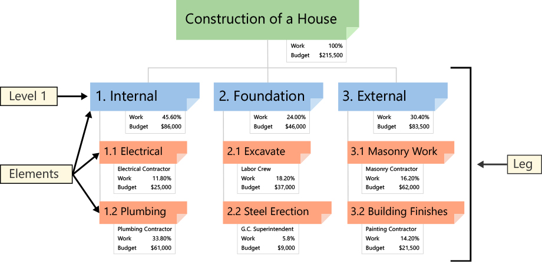
- **Creating the Work Package**
  - work package (WP): requirements are decomposed until time and money can be accurately estimated.
  - decomposing. Breaking each requirement into smaller and smaller manageable pieces.
- **WBS vs Backlog**
  - WBS assumes that scope, time, and cost are fixed and works to control them.
  - WBS has more structure than a backlog in its design. The WBS has specific numbering conventions and design rules, including MECE and the 100% rule.

|                         | WBS               | Project Backlog             | Product Backlog              |
| :---------------------- | :---------------- | :-------------------------- | :--------------------------- |
| Duration                | Length of project | Length of project           | As long as product is viable |
| Scope                   | Fixed             | Flexible                    | Flexible                     |
| Resources               | Fixed             | Fixed                       | Fixed                        |
| Time                    | Fixed             | Fixed                       | Fixed                        |
| Deliverable or Activity | Deliverable       | Deliverable                 | Deliverable                  |
| Hierarchy               | Numbered Levels   | Epic > Feature > User Story | Epic > Feature > User Story  |
| When Created            | Planning Phase    | All Phases                  | Entire Life Cycle            |

- **WBS Dictionary, Work Package, Task**
  - Dictionary: itemized list with id number. Includes more information about item.
    - 
    - 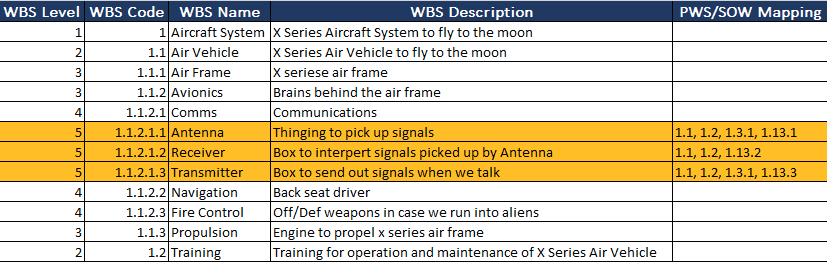
  - Work Package: one or more deliverables that need to be created together.
    - collectively develop deliverable.
  - Task: many little activities to create the project.
- **WBS MECE**
  - Mutually Exclusive: no overlaps. each label no repeated.
  - Collectively Exhaustive: Together, all work packages encompass the entire project.
- **WBS Rules**
  - can estimate cost, time, resources.
  - 8/80. Element should last at least 8hrs but no more than 80hrs.
  - will fit in reporting period(report on project status).
  - produces measurable deliverable.
  - breaking down further wouldn't help project.
