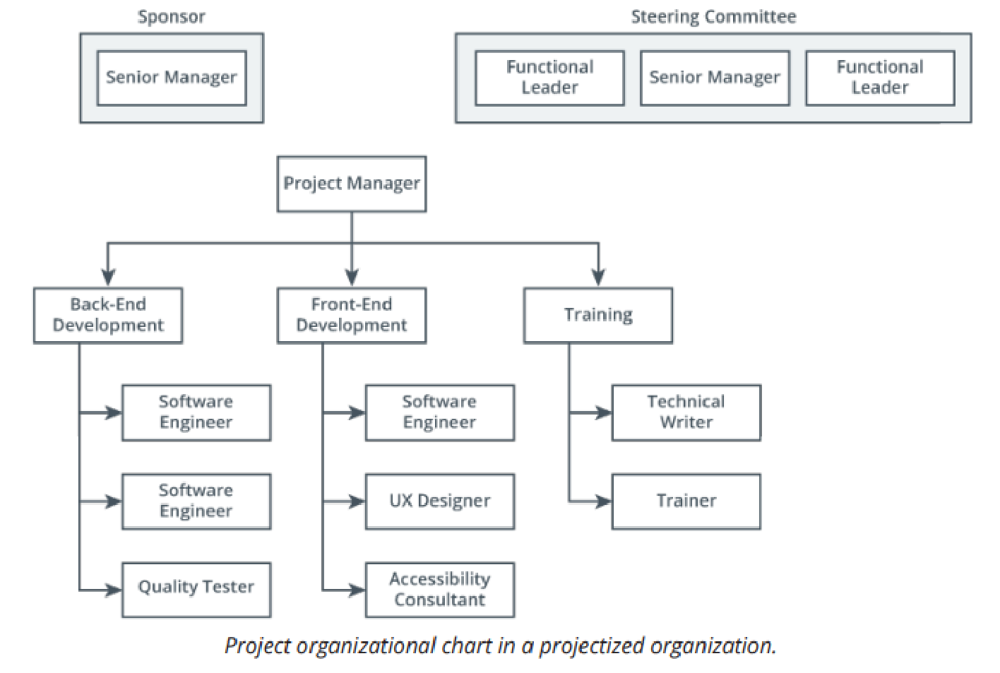
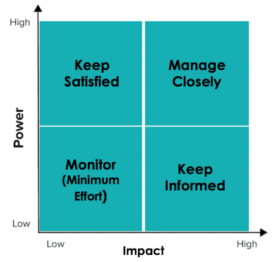
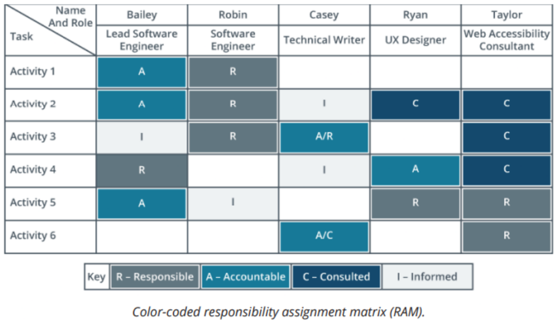

# CompTIA Project+ PK0-005 Quick Study

## Definitions

- **Acceptance**
  - Formally acknowledging that a deliverable meets the agreed-upon requirements and can be integrated into the project or handed over to the client.
- **Action Items**
  - Specific tasks assigned to individuals or teams to address identified issues, complete required work, or move the project forward.
- **Addition**
  - Introducing new features, functionalities, or scope to the project, potentially impacting timelines, resources, and budgets.
- **Balanced Scorecard**
  - A performance measurement framework that considers various aspects beyond just financial metrics, such as customer satisfaction, internal processes, and learning and growth.
- **Cause-and-Effect Diagram** (Fishbone Diagram)
  - A visual tool used to identify and analyze the potential causes of a problem or issue.
- **Common Causes of Variances**
  - Deviations from planned performance metrics (e.g., schedule, budget) can be caused by factors like resource constraints, inaccurate estimations, or changes in requirements.
- **Control Chart**
  - A statistical tool used to monitor a process over time and identify potential deviations from acceptable ranges, enabling proactive corrective action.
- **CRM (Customer Relationship Management)**
  - manage relationship w/customers and future customers.
  - Allows for tech support(notes, tracking problems).
- **Data Structured/Unstructured, Data Warehouse, RDBMS, Primary Key, Foreign Key, EDRMS, CMS**
  - Structured: labeled for easy searching. Modified to conform to standards.
  - Unstructured: also called 'blob'. bulk data not labeled.
  - Data Warehouse: gather multiple data sources together for analysis and decision-making.
  - RDBMS: relational database. collection of structured data related to other data.
  - Primary Key: unique key to identify data row.
  - Foreign Key: when primary key is included as a column of another table. Used to relate two tables.
  - EDRMS: electronic document and record management system. Manages access, create and delete of data.
  - CMS: content management system. create website without technical knowledge.
- **Decision Trees**
  - Visual representations of possible choices and their consequences, helping to make informed decisions in complex situations.
- **End-to-End Testing**
  - Testing a complete system or application from beginning to end, ensuring its functionality and performance across all components and integrations.
- **ERP (Enterprise Resource Planning)**
  - back office software to coordinate: accounting, human resources, procurement...
  - centralizes management and access for data sharing between roles. Data and API(functionality) centralized.
- **ESG (Environmental, Social, and Governance)**
  - Environmental: project impact to environment.
  - Social: project impact among stakeholders, team members, customers.
  - Governance: project monitoring, performance, changes, budget...
- **Extinction**
  - Ignoring or not reinforcing a behavior, leading to its eventual decrease or disappearance. Used in project management to address undesirable behaviors or recurring issues.
- **Functional, Matrix, and Projectized Management**
  - 

| Management Style | About                                                                 |
| ---------------- | --------------------------------------------------------------------- |
| Functional       | Specialized managers for each department                              |
| Matrix           | PM's that assign work(weak), up to control pay, hiring/firing(strong) |
| Projectized      | PM's have full control over pay, hiring/firing                        |

- **Flowcharts**
  - Visual diagrams depicting the steps or processes involved in a task or workflow, aiding in understanding and optimizing procedures.
- **Integration**
  - Combining individual components or modules into a functioning system, ensuring seamless communication and data exchange.
- **Integration Testing**
  - Testing the functionality and compatibility of different modules or components after they have been integrated into a system.
- **Lessons Learned**
  - Capturing and analyzing valuable insights gained from project experiences, both successful and unsuccessful, to improve future projects.
- **Pareto Diagram (80/20 Rule)**
  - A graphical representation highlighting that a small percentage of factors (e.g., 20%) often contributes to a large majority of the effects (e.g., 80%). Used to prioritize issues or areas for improvement.
- **Performance Testing**
  - Evaluating the system's ability to handle expected load and stress, ensuring it meets performance requirements under various conditions.
- **Prevention**
  - Taking proactive measures to avoid problems or issues before they occur, minimizing risks and disruptions.
- **Regression Testing**
  - Re-testing previously tested functionality after changes or updates to ensure they haven't introduced new bugs or regressions.
- **Rework**
  - Correcting errors or deficiencies in work that has already been completed, leading to additional time and resource costs.
- **Run Charts**
  - Visualizing data points over time to identify trends, patterns, and potential areas for improvement.
- **Smoke Testing**
  - Basic testing to verify that the core functionalities of a system are working before more in-depth testing begins.
- **Scope**
  - project scope: boundaries of project. Outlines what work needs to be done and what won't be done to achieve the project's goals.
- **Starvation**
  - Depriving a process of resources it needs to function effectively, leading to delays, inefficiency, and potential failures.
- **Statistical Sampling**
  - Collecting and analyzing data from a representative sample of a population to draw inferences about the entire population, reducing the need to test everything.
- **Stress Testing**
  - Testing a system beyond its expected load or capacity to identify its breaking point and ensure it can handle peak demand or unexpected situations.
- **Testing**
  - Verifying that a system, component, or function meets its intended requirements and performs as expected.
- **Unit Testing**
  - Testing individual units of code (e.g., functions, modules) in isolation to ensure they work properly before integration into the larger system.
- **User Acceptance Testing (UAT)**
  - Final testing conducted by end users or stakeholders to ensure the system meets their needs and expectations before being deployed or released.
- Be able to name the purpose for controlling quality.
  - Quality control involves monitoring work results to determine whether they comply with the standards set in the quality management plan.
- Name the types of testing performed on technology projects.
  - The types are smoke, unit, integration, end- to- end, regression, stress, performance, and user acceptance testing.
  - Be able to explain a histogram.
    - A histogram displays data distributed over time. It is a type of bar chart.
  - Be able to explain a fishbone diagram.
    - A fishbone diagram is a cause-and-effect diagram, also known as an Ishikawa diagram.
  - Be able to explain a Pareto chart. A Pareto chart is a histogram that rank-orders data by frequency over time.
- Be able to explain a run chart.
  - A run chart displays data as plots on a timeline.
- Be able to explain a control chart.
  - Control charts measure and display the variance of several samples of the same process over time.
- Be able to explain a decision tree.
  - Decision trees are diagrams that show the sequence of interrelated decisions and the expected results of choosing one alternative over the other.
- Be able to explain a scatter diagram.
  - A scatter diagram displays the relationship between two numerical variables and determines whether they are related to each other. It can also be used to prove or disprove cause-and-effect relationships. Scatter diagrams are also known as correlation charts.
- Name the three common causes of variance.
  - These are random variances, known or predictable variances, and variances that are always present in the process.
- Name three actions that you can take when quality is not as expected.
  - Three actions are rework, process adjustments, and acceptance.
- Be able to describe an issue.
  - An issue is something that could impact the project or delay the completion of deliverables. Risks become issues once they occur.
- Be able to describe the issue log.
  - The issue log is where information about issues are logged and may include an identification number, description, priority ranking, resolution plan, and other information.
- Name the performance measurement tools that can be used for quality assessments.
  - They are key performance indicators (KPIs), balanced scorecards, key objectives and results, and cost and schedule performance measures.
- Name the four reasons for project endings.
  - They are addition, starvation, integration, and extinction.
- Understand the steps involved in closing a project.
  - The steps are verification and validation of deliverables, obtaining sign-off, transition plan creation, revoking access, releasing project resources, closing out contracts, archiving documents, lessons learned, closure meeting, closeout report, celebration, and post-implementation support and warranty period.
- Explain the purpose of obtaining formal customer or stakeholder sign-off.
  - The formal sign-off documents that the customer accepts the project work and that the project meets the defined requirements. It also signals the official closure of the project and the transfer of the final product of the project to the organization.
- Describe lessons learned.
  - Lessons learned describe the successes and failures of the project.

## Agile

- **Agile**
  - Agile: iterative, incremental. delivers value early and often. Teams small (3-10 members).
    - Iterative: make improvements, get feedback.
    - Incremental: small improvements at a time.
  - cross-functional group that stays with project entire lifecycle.
  - members fill multiple roles and have broad experience.
- **Agile Communication: Stakeholder, Customer, Changes**
  - Stakeholder: engage stakeholder all phases of project.
  - Customer: customer communication with developer is vital.
  - Communication Changes: embrace change. encourage communication.
- **Agile Requirements**
  - requirements dictate how the project looks and behaves.
  - only need basic requirements at start of project.
  - Collection of Requirements -> Product Creation -> Customer Review
- **Agile Budget and Schedule**
  - Budget: flexible. Good for **custom tailored work**.
  - Schedule: loose and flexible. Only one iteration is planned in advance.
- **Agile Environmental Factors: Culture, Development Processes, Industry Standards**
  - Culture: team needs strong commitment(iterative, incremental design), good collaboration skills.
  - Development Processes: customer review after each iteration, continuous testing can be expensive.
  - Industry Standards: iterative and incremental.
- **Agile Strengths**
  - expected change.
- **Agile Weakness**
  - scope creep, missed deadlines and less documentation.
- **Agile Use**
  - project requirements will change often. Team is stable and self organized.
  - agile is flexible. continually improvements through sprints.

## Charts

- **Project Organizational Chart**
  - once you know project scope, the organizational chart helps to pick your team members.
  - 
- **Impact Grid -Stakeholder**
  - 

## Data Confidentiality

- **Data Confidentiality**
  - protecting sensitive data that identify individuals personal information.
- **GDPR (General Data Protection Regulation)**
  - EU PII data handling requirements. Also adds to NIST, classifying: cookies, radio frequency tags, IP addresses as PII.
- **PII (Personally Identifiable Information)**
  - any information about an individual (social security number, date of birth, mothers maiden name, medical, biometric, financial, educational, employment...)
  - organizations should develope policies and procedures(educate, train) to handle PII and data breaches.
  - Anonymize sensitive data before sharing.
- **Linkable PII**
  - personal identifiable info that can be linked together to create SPII.
  - name, address, email, MAC, phone, race, age, credit card...
- **SPII (Sensitive Personally Identifiable Information)**
  - subset of PII. Any single piece of data that could identify and cause harm or embarrassment.
  - SSN, Passport, Drivers License, Biometric.
- **PHI (Personal Health Information)**
  - IIHI (Individually Identifiable Health Information)
    - past, present, and future health or mental condition.
- **HIPAA (Health Insurance Portability and Accountability Act of 1996)**
  - provides regulations for safekeeping **(ePHI) electronic Personal Health Information**.
- **NIST (National Instituted of Standards and Technology)**
  - federal agency creates frameworks and process to help protect information.
  - describes 3 levels: low, medium, high impact.

## DevOps, CI/CD and DevSecOps

- **DevOps**
  - automating checks and tests along with development and operations.
  - Problem: Siloed development and operations teams create communication barriers, inefficiencies, and slow code delivery.
  - Solution: DevOps integrates these teams, practices, and tools to optimize the entire software delivery process.
  - Automation: CI/CD automates builds, tests, and deployments for faster releases.
  - Continuous feedback: Early detection and fix of bugs through frequent integration and monitoring.
- **DevOps Strengths**
  - Faster delivery of quality software by eliminating the barrier between development and operations.
  - Improved operational support and cross-functional collaboration.
  - Reduced friction and project risks.
- **DevOps Weaknesses**
  - Requires specialized skills and cultural shift.
  - Difficult to implement for large/legacy systems with minimal automation.
- **DevOps Use Cases**
  -Teams striving for CI/CD and faster releases w/ automation.
  -Companies with resources for cross-functional teams and automation tools.
- **DevOps 4 Phases**
  - plan, code, build, test.
- **CI/CD**
  - Individual developers check their code into the main branch frequently, and automated tests run against the new code.
- **Continuous Integration**
  - Developers merge code frequently, triggering automated tests for early feedback.
- **Continuous Delivery**
  - Code automatically prepared for release but deployment is manual.
- **Continuous Deployment**
  - Code automatically prepared for release and deployment is automatic.
- **DevSecOps**
  - Baking Security into DevOps(entire software development lifecycle) for Faster, **Secure Software Delivery**
  - Importance: Secure systems are crucial for consumer trust, competitive advantage, and regulatory compliance.
- **DevSecOps Strengths**
  - Faster delivery, continuous security feedback, and reduced risk of breaches.
- **DevSecOps Weaknesses**
  - Users may need support and training, security teams must relinquish control, and frequent deployments create higher security demands.

## Extreme Programming

- **Extreme Programming**
  - agile framework. software development. pair programming, emphasis on simplicity.
  - XP: close collaboration, iterative development, and continuous testing.
- **Extreme Programming Pair programming**
  - Two developers work together on code, promoting continuous review and knowledge sharing.
- **Extreme Programming Ten-minute build**
  - Ensures rapid feedback and keeps code clean through fast builds and tests.
- **Extreme Programming Continuous integration**
  - Frequent merging of code to prevent conflicts and enable automated builds/tests.
- **Extreme Programming Test-first programming**
  - Writing tests before code drives simplicity and quality.
- **Extreme Programming Incremental design**
  - Small, frequent improvements over delayed releases.
- **Extreme Programming Open workspace**
  - Fosters communication and teamwork by removing physical barriers(walls). Everyone in same room.
- **Extreme Programming On-site customer**
  - Integrates the customer into the team for direct feedback and collaboration.
- **Extreme Programming 40-hour workweeks**
  - Prioritizes developer well-being and avoids burnout.
- **Extreme Programming User stories**
  - Clear and concise requirements format for effective communication.
- **Extreme Programming Weekly and quarterly cycles**
  - Regular planning, adaptation, and reflection.
- **Extreme Programming Built-in flexibility**
  - Slack in weekly plans allows for adjustments and unforeseen situations.
- **3 Roles in Extreme Programming**
  - Customer: decide features and priority.
  - Tracker: capture metrics, progress, improvements.
  - Coach: mentor team members.
- **Extreme Programming Strengths**
  - Highly efficient and adaptable.
  - Prioritizes essential features and continuous improvement.
  - Strong team cohesion and reduced project failure.
  - Values developer well-being.
- **Extreme Programming Weaknesses**
  - Limited scope to software development (not ideal for non-software projects).
  - Potential for design neglect due to code-centric practices.
  - Rapid pace and minimal documentation can be stressful and hinder onboarding.
  - Reliance on face-to-face interaction (can be challenging for remote teams).
- **Extreme Programming Use Cases**
  - Small, collocated teams with changing requirements and tight deadlines.
  - Projects with strong test automation capabilities.

## Financial and Performance Analysis

- **Assumptions**
  - future factors you state as true to present a financial plan.
- **Benefit**
  - money generated or saved from project.
  - also called 'financial value' or 'revenue'.
- **Cost**
  - anything related to project that causes money to flow out of company.
- **Cost-Benefit Analysis**
  - cost to produce vs benefit.
  - timeline of how quickly money can be recouped.
- **Financial Analysis**
  - assigning hard numbers to future events.
- **Net Profit**
  - NET = `benefit - cost`
- **Revenue**
  - money flowing into company as result of project.
- **Scoring Model**
  - rating/weight each project or alternative solution from predefined list of criteria.
  - often includes a 'minimum' rating. Project discarded if not meet minimum.
- **Payback Period**
  - time to recover from all cost of producing product.
- **FV (Future Value) vs PV (Present Value)**
  - include inflation into the cost.
  - Future Value = Present Value(1+interest)^years
- **ROI**
  - percentage of gain for investment.
  - ROI = `(net profit / cost) * 100` // same
  - ROI = `(revenue - cost) * 100` // same
  - ROI = `((Financial Value - cost) / cost) * 100` // same
- **IRR**
  - Internal Rate of Return: profitability of an investment as an average percent over the life of the investment.
  - Higher better.
- **Current State vs Future State or as is-to be, Performance Analysis**
  - how change will effect the business in the future.
  - as is-to-be(also called performance analysis): means same.
- **Discounted Cash Flow**
  - total value of each years expected cash inflow, in 'todays' dollars.
- **NPV**
  - net present value.

## Kanban

- **Kanban**
  - agile framework.
  - Kanban board: Visualizes work, WIP(work in progress) limits, and workflow policies.
  - track task flow and optimize workflow.
  - Simplest agile framework to learn and can be applied to any industry.
- **Kanban 3 basic phases**
  - To Do, In Progress, Done (can be customized).
- **Kanban 6 Core Practices**
  1. Visualize work: show phase work is in.
  2. Limit WIP: prevent overwhelm, increase product quality by restricting active tasks.
  3. Make policies explicit: clearly define how work moves through phases.
  4. Manage flow: Identify and eliminate workflow bottlenecks for efficiency.
  5. Implement feedback loops: Measure workflow performance and use data for improvement.
  6. Improve collaboratively: Experiment and continuously evolve the workflow.
- **Kanban 4-part workflow**
  - Prioritize backlog, pull work into progress, move through phases, start new work.
- **Kanban Strengths**
  - Simple to learn, flexible, applicable to any industry with routine tasks.
  - Lightweight, focuses on reasonable amount of work and clear policies.
- **Kanban Weaknesses**
  - Requires stable work environment, can struggle with large teams or high turnover.
  - Cycle times may lengthen without set iterations and proper performance management.
- **Kanban Use Cases**
  - Teams with frequently changing backlogs (e.g., ticketing systems)
  - Teams comfortable with less structure and stable workflows.

## PRINCE2

- **PRINCE2**
  - process-based methodology. Common in UK, EU, Canada, Australia.
  - focus on clear project phases, roles, and responsibilities.
  - originally waterfall methodology, but has embraced the agile model.
  - has 7 principles, 7 themes, 7 processes.
- **PRINCE2 Team Manager**
  - management team member focused on helping project manager.
- **PRINCE2 Project Board**
  - authorizes resources and funding in support of project manager.
- **PRINCE2 Project Board Three Roles**
  1. **Executive**: member of upper management represents business perspective, owns project business case.
  2. **Senior User**: represents customer perspective.
  3. **Senior Supplier**: represents supplier perspective.
- **PRINCE2 Strengths**
  - very flexible with any project.
  - greater upper management involvement.
  - constant communication between project board, manager, and teams.
- **PRINCE2 Weaknesses**
  - extensive documentation.

## Projects and Members

- **Project**
  - temporary organization created to deliver one or more business products according to the business-case.
- **What Makes it a Project**
  - mnemonic: 'STU'
  - **Unique**: meet specific business objective.
  - **Temporary**: start and end date.
  - **Stakeholder Satisfaction**: ends when stakeholder is satisfied.
- **Needs and demands of why projects come about**
  - Market Demand, Organizational Need, Customer Request, Technological Advance, Legal Requirement, Ecological Impact, Social Need.
- **Architect**
  - part of the IT team. design. Make sure project interoperates with business goals.
  - Responsibilities:
    - Solution design
    - System blueprints
    - Evaluating systems against organizational standards
- **Artifacts**
  - preexisting knowledge or vetted vendors to be used in project planning.
- **Business Analyst**
  - gathering and documenting requirements for project.
  - works between the business side and the IT side.
  - Responsibilities:
    - Helping to define the project
    - Gathering business and technical requirements
    - Ensuring requirements stay aligned to needs
    - Interpreting business requirements
    - Verifying deliverables against requirements
    - Assisting with testing and validation of products
- **Business Case**
  - **Justifies the project**'s viability(most important) and alignment with business goals.
  - summarizes project and is first project proposal.
  - created in discovery phase. Often includes details about budget and timelines(start, end).
  - mnemonic: 'Executive Statements Offer Financial Projects Recommendation'
    - Executive Summary: brief summary. problem statement, solution, result.
    - Problem Statement: problem trying to solve.
      - Problem Analysis: more details about why project should be prioritized.
    - Options: pros and cons of multiple solutions.
    - Financial Overview: cost-benefit on investment.
    - Project Definition: more info. scope, resources, milestones, timeline.
    - Recommendation: analysis which option is best for organization objectives.
    -
  - Analyzes the:
    - Problem or opportunity the project addresses.
    - Alternative solutions and their costs/benefits.
    - Projected financial impact on the organization.
    - Risks and mitigation strategies.
  - Function:
    - Secures executive buy-in and funding for the project.
    - Demonstrates the value proposition and return on investment.
    - Guides project prioritization and decision-making.
    - Provides ongoing performance benchmarks and justification.
  - mnemonic: 'JAFAR DASH'
  - **Justification**: benefits to organization.
  - **Alignment to the Strategic Plan**: project aligns with organizations overall strategy.
  - **Feasibility Study Results**: determine if project is doable and likely to succeed.
  - **Analysis of the Problem or Opportunity**: gap analysis: compare where we are and where we want to go.
  - **Recommended Solutions**: expected results and impact.
  - **Description**: describe the project.
  - **Alternative Solutions**: expected results and impact from alternative solution.
  - **Stakeholders**: anyone/organization with vested interest.
  - **High-Level Risk Analysis**: known risk documented.
- **Business Storytelling: Current State vs Future State**
  - either tell a good story of Current state vs. Future state with descriptive words or charts.
  - both sides must use same metrics.
  - Current State: whats going on right now.
  - Future State: what will change after project.
- **Core Team Members**
  - also called 'operational' team members because they focus on day-to-day operations.
- **Customers: Internal, External, End-User**
  - Internal: inside organization. easy feedback.
  - External: outside organization. typically pay for product.
  - End-User: physical user of final product. Can also provide insight on usability and functionality.
- **Decision Model**
  - apples-to-apples way of comparing projects and which one is the most benefit to company needs.
  - **Rewards**
    - Cost-benefit analysis, Scoring models, Payback period, Discounted cash flow, Net present value, Internal rate of return, Return on investment.
  - **Constrained Optimization Model**
    - mathmatical model for highly complex projects.
- **Developer/Engineer**
  - writing program frontend/backend code.
  - Responsibilities:
    - Writing code to standards
    - Building products according to the project plan or sprint backlog
    - Reporting development progress to the project manager or product owner
- **Expert Judgement**
  - expertise of stakeholder or other subject matter expert to make project decisions.
  - Danger lies with relying on single technique to make selection.
- **Extended Team Member**
  - work part time on multiple projects.
- **PMO (Project Management Office)**
  - Functional department for all project managers.
  - manages flow of projects and provides guidance to project managers with organization resources.
- **PMO Supportive Project Management Office**
  - Provides support when it is requested
- **PMO Controlling Project Management Office**
  - Monitors project performance and coordinates resource selection while allocating project managers to projects
  - The controlling PMO coordinates communications and sets some project standards
- **PMO Directive Project Management Office**
  - Has full authority over projects, standards, and procedures
  - It focuses on organizational strategy and will start, cancel, or adjust projects to ensure strategic alignment
- **Portfolios**
  - prioritize and execute multiple projects/programs more efficiently.
  - support strategic business goals or objectives.
  - Portfolios may consist of multiple projects/programs without related objectives.
- **Portfolios Enterprise**
  - contain all programs/projects.
  - can be broken down into sub-portfolios at division or branch level.
- **Portfolio Management**
  - strategy to maintain and prioritize maximum programs/projects.
- **Preliminary Scope**
  - Preliminary scope statement defines the objectives of the project and explains the business reason the project is trying to solve.
- **Product Owners**
  - help agile teams stay on track with cost, scope, and time.
  - **creating a valuable product and identifying how to improve a product**. Keeping to product vision.
  - create work, but do not manage. Act as customer proxy.
- **Product Manager**
  - **define product strategy**, create roadmap on how product will improve and change over time.
- **Programs**
  - group projects with related objectives to achieve a larger objective.
  - bring about benefits that wouldn’t be achievable if the projects were managed separately.
- **Program Manager**
  - lead groups of projects. Operates at a more strategic level.
  - helps capitalize on the resources of multiple projects.
  - project managers report to them(makes them a stakeholder and your boss).
- **Project Baseline**
  - approved cost, schedule, scope, plans, and documents.
  - used to measure performance/progress. Determine if on schedule, within budget or on target.
- **Project Management Office (PMO)**
  - central location for guidance, standards, artifacts to project managers, programs and portfolios.
  - allows organization to capitalize on the collective benefits of all projects.
  - Functions:
    - organized standards and processes.
    - coordination of resources, templates, artifacts.
    - governance and setting priorities.
    - KPI, performance standards and nonperformance consequences.
- **Project Manager**
  - runs day-to-day management of teams in any framework as long as the project is active.
  - explains benefits of project to stakeholder. All stakeholders(something to gain or lose) must be sold and sign-off, otherwise project may be blocked.
  - keeps project sponsor notified of status, conflicts and risk.
  - responsibilities: **planning, scheduling, documents, progress, risk, fixed time, cost and scope**.
  - completes project goals to stakeholder/company satisfaction.
  - Responsibilities:
    - Building the project team and securing resources
    - Building the project charter and defining the project’s scope
    - Creating required project logs and processes, including the issue log, change log, and risk register
    - Ensuring project deliverables are met which includes making sure team members have the right skills and resources for activity completion on the activity list
    - Preparing and delivering project status updates
    - Tracking the project’s progress and status when compared to the schedule and budget
    - Managing vendor relationships
- **Project Manager Skills**
  - leadership, communication, problem-solving, negotiation, organization, time management.
- **Project Manager: Managing a Project Team**
  - manage team and resources for team.
- **Project Manager: Communicating with Stakeholders and Team Members**
  - sponsors, stakeholders, team members up-to-date. Start -> Finish.
- **Project Manager Scope**
  - goals, deliverables, and requirements of the project.
- **Project Manager Risk**
  - identify, manage, track, monitor risk.
- **Project Manager Budget**
  - alert if cost higher than expected or funds running out.
- **Project Manager Schedule**
  - key deliverables are performed on time.
- **Project Manager Quality Assurance**
  - quality of deliverables meet standards
- **Project Manager Project Artifacts**
  - documents, templates, agendas, diagrams. Project charter is artifact.
- **Project Selection Method**
  - senior members choose project based on documents provided (market share, financial benefits, return on investment, customer satisfaction, and public perception).
- **Project Sponsor**
  - ultimately responsible for the success or failure of project. Delegates operations to project manager.
  - usually senior executive that assigns money and resources to project.
  - approves project charter by signing.
  - Tie-breaker, champion, adviser of project.
  - Responsibilities:
    - find/provide funding
    - sign charter. Approve baseline(starting point of project, schedule, scope), high-level requirements.
    - define business case.
    - authorize assignment of human resources.
    - assigns project manager and define their authority.
    - negotiate support from key stakeholders. Champion and market project.
    - enforce milestones by removing road blocks.
- **Senior Management**
  - highest level of leadership.
  - control organizational goals, communicate with shareholders and board members.
  - prioritize projects, authorize spending, assign team members.
- **Sponsors**
  - single senior manager reviews/validates initial business case.
  - secures funding and removes barriers.
- **Stakeholder**
  - Anyone/Organization with vested interest in the project.
  - **Waterfall**: detailed requirements given to team. No further communication until project completion.
  - **Agile**: communication between team and stakeholder throughout the project.
  - Responsibilities:
    - Must understand the project’s purpose and how it will affect them.
    - Be transparent about their support or lack of support
    - Provide timely feedback on the project’s progress
- **Stakeholder Analysis**
  - asking questions to gather role(level of involvement, influence), needs/concerns.
  - Questions:
    - What is your interest in project?
    - expectations of outcome?
    - what is do you anticipate as your level of involvement?
    - knowledge level in project? What do you see as special skills needed for successful outcome?
    - what contributions are you anticipating making?
    - How will project impact your organization positively/negatively?
    - Are there other stakeholders expectations that conflict with yours?
      - Use these questions to fill out the Stakeholder Analysis Grid:
      - 
- **Stakeholder Register**
  - roster with name, phone, role(level of involvement, influence), needs/concerns. Tracks multiple stakeholders.
- **SMEs (Subject Matter Experts)**
  - team members performing the work. have the specific knowledge and experience to do the work.
- **Team Member**
  - knowledgeable person either full time or part time on a project.
  - keep timeline, cost of project.
  - communicate with project manager risk, updates.
- **Tester/QA**
  - ensure requirements are met. help prevent errors.
- **Validate a Project**
  - write business case, identify and analyze stakeholders.
- **Vendor**
  - third party provides resources.
  - Responsibilities:
    - Provide work outlined in contracts
    - Maintain service level agreements
    - Keep clear lines of communication open for business relationships

## Project Lifecycle Phase 1 Initialize

- **Initiating Project**
  - after business case is approved, formal authorization for a new project to begin.
  - Next: preliminary scope statement, project charter, team assembled.
- **Initiating Project: Preliminary Scope Statement**
  - after business case, preliminary scope statement is **first artifact created** and will become part of the project charter.
  - **clearly defined reasons and objectives**(the problem trying to solve) and a high level description of the deliverables.
    - objectives should be clear, measurable, actionable.
    - questioning project requestor to ensure problem is clearly understood.
- **Initiating Project: Project Charter**
  - officially recognizes the project has begun. First official document of Approved project.
  - written by product manager and delivered to all stakeholders, but signed and approved by project sponsor.
    - check PMO for template or required format. some answers can be taken from business case.
  - Describes the project's:
    - Objective and deliverables: desired result. reference point: parameters, purpose, expectations and vision.
    - Scope and boundaries: clarifies project manager and team members roles and authority level.
    - Resources and budget: Enables resource allocation and project tracking.
    - Timeline and milestones
    - Key stakeholders and roles: clarifies purpose and expectation for stakeholders.
    - Approval process and signatures
- **Initiating Project: Team Roles and Responsibilities**
  - after project scope is finalized, identify people who will do the work and have the right skills.
  - build team, roles identified.
- **Initiating Project: Stakeholder**
  - engage stakeholder to build and manage relationship throughout project.
  - Engagement Plan:
    - Stakeholder: List the person or group.
    - Point of Contact: If the stakeholder is not a person, list the person who represents the stakeholder.
    - Power: List the power level from the Power/Impact Grid
    - Influence: List their impact level from the Power/Impact Grid.
    - Project Phase: List the project phases that you will need to engage with them
    - Engagement Needs: Describe what they need or why they are a key stakeholder
    - Engagement Approach: List the type of engagement you will conduct from the
    - Power/Impact Grid
      - 
    - Methods: Capture how you will communicate with them
    - Frequency: List a descriptive term of how often you will engage with the stakeholder
- **Initiating Project: RAM (Responsibility Assignment Matrix)**
  - clarifies who is responsible for completing/managing activities in project.
  - team members know assignment and who to work with.
  - RACI:
    - responsible: do the work.
    - accountable: manage.
    - consulted: Subject Matter Experts.
    - informed: receive updates.
    - 
- **Initiating Project: Records Management**
  - starts the generation of documentation.
- **Initiating Project: Establishing accepted communication channels**
- **Initiating Project: Documents (Artifacts)**
  - use artifacts to observe lessons learned from past experiences.
  - Reviewing existing artifacts
- **Initiating Project: Performance Objectives**
  - KPI (Key Performance Indicators): Measure project success.
    - leading(predictive work)/lagging(past work) indicators.
  - SMART Objectives: Project Goals: Specific, Measurable, Achievable, Relevant, Timebound.
  - OKRs (Objective and Key Results): Aspirational goals(drive teams to achieve goals slightly out of reach). Generate change. 'Less is more' approach.
  - Project Roadmap: high-level progress points. Objective summaries.
  - Milestone Chart: project checkpoints. Timeline or plot deadlines.
  - Gantt Chart: relationship and dependencies between task. planning, execution, closing phase.
- **Initiating Project: Defining access requirements**
  - dd
- **Initiating Project: Kickoff**
  - live meeting with team. Discuss project purpose, goals, plan.

## Project Life Cycle Phases

- **Discovery/Concept Phase**
  - first phase. determine whether project is worthwhile.
  - **Business Case created(project is justified)**.
  - Looks for ways(artifacts) to speed up the project: prequalified vendors, clients, contracts.
  - **If project considered risky**
    - Perform **feasibility study**: new projects, complex projects, risky projects.
- **Planning Phase**
  - Prepare for the work of the project.
  - Objectives broken down into manageable units of work. Creation of plans or documents that are used throughout the project to ensure that goals of the project are being met.
    - Develop a detailed project scope statement
    - Develop a project schedule
    - Determine budget considerations
    - Develop a quality assurance plan
    - Develop a communication plan
    - Assess and assign project resources
    - Perform an initial risk assessment
    - Assess the resource pool and assign project resources
    - Develop a project management plan
    - Train project team members
    - Define units of work Develop a transition plan/release plan
- **Executing Phase**
  - where work is performed, monitored, and tracked. If product does not conform, change request are created.
    - Producing and verifying deliverables
    - Implementing change management
    - Managing vendors
    - Tracking and reporting project results
    - Updating project elements such as budget, risk, and timelines
    - Managing conflict
    - Monitoring the risks and issues log
    - Performing quality assurance/governance activities such as coordinating phase gate reviews
    - Monitoring the budget
    - Conducting project meetings and updates
- **Closing Phase**
  - project closeout. contracts closed, team members released.
  - validate deliverables, document acceptance of project work.
    - Validating deliverables
    - Closing contracts
    - Removing access
    - Releasing resources
    - Holding the project closure meeting
    - Writing the project closeout report
    - Obtaining feedback and lesson learned
    - Project sign-off
    - Handing off the product to the organization
    - Evaluating the project
    - Archiving project documents
    - Rewards and celebration

## Project Management Documents

- **Business case**
  - Discovery
  - Justification for the project.
- **Preliminary scope statement**
  - Initiating
  - Project objectives are defined; business problem the project will address is stated.
- **Project charter**
  - Initiating
  - Authorizes the project to begin.
- **Responsibility assignment matrix (RAM)**
  - Initiating
  - Defines stakeholder responsibilities. Incorporates the use of a RACI chart.
  - RACI is a way to define responsibilities on the project and stands for responsible, accountable, consult, and inform.
- **Communication plan**
  - Planning
  - Documents the types of information needs the stakeholders have, when the information should be distributed, and how the information will be delivered.
- **Project schedule**
  - Planning
  - Determines the start and finish dates for project activities and assigns resources to the activities.
- **Scope statement**
  - Planning
  - Documents the product description, key deliverables, success and acceptance criteria, key performance indicators, exclusions, assumptions, and constraints.
- **Project management plan**
  - Planning
  - Consists of all the project planning documents such as charter, scope statement, schedule, and more.
- **Issue log**
  - Executing
  - A list of issues, containing list numbers, descriptions, and owners.
- **Change log**
  - Executing
  - Describes change requests and their disposition for the project.
- **Risk register**
  - Executing
  - A list of risks and their descriptions.
- **Status report**
  - Executing
  - A report to stakeholders on the status of the project deliverables, schedule, risks, issues, and more.
- **Dashboard information**
  - Executing
  - An electronic reporting tool that lets users choose elements of the project to monitor project health and status.
- **Meeting agenda/meeting minutes**
  - Executing
  - Meeting agendas describe the items to be discussed and addressed at upcoming meetings, and minutes recap what was discussed and the decisions made at the meeting.
- **Project closeout report**
  - Closing
  - Reports on the final closeout of all phases of the project.

## Scaled Agile Framework

- **SAFe (Scaled Agile Framework)**
  - expand agile practices across multiple teams to work together.
  - Agile Release Team (ART): related groups of agile teams to simplify communication, planning, schedules.
  - Iteration: short term planning cycle.
  - Program Increment: longer-term planning cycle.
- **SAFe Strengths**
  - allows scaling and project organization in bigger organizations with multiple agile teams.
- **SAFe Weakness**
  - adds layers of overhead to organization.
- **SAFe Use**
  - multiple agile teams that need to collaborate more effectively.

## Scrum

- **Scrum**
  - iterative and incremental agile framework doing short sprints and team collaboration with daily stand-ups.
  - emphasizes empiricism(**learn from doing not just guessing**) and lean thinking(**focus on value**), promoting continual improvement.
  - Scrum is an **all-or-nothing framework**, requiring the use of all its parts for optimal results.
  - It introduces roles like the Scrum team(3-9 peeps), product owner(backlog owner), Scrum master(implement scrum principles), and developers(remaining team).
- **Scrum 5 Values**
  - Commitment, focus, openness, respect, courage.
- **Scrum 3 Pillars**
  - Transparency(clear goals), inspection(asses work), adaptation(make adjustments from feedback).
- **Scrum Events**
  - Sprint: iteration and all scrum events.
  - Sprint planning: backlog created.
  - Daily Scrum: review progress, plan next 24 hours(daily stand-up).
  - Sprint review: uncover issues early, confirm on track.
  - Sprint retrospective: find improvement opportunities(improve scrum flow) from previous sprint.
- **Scrum Key Artifacts**
  - Product Backlog: list of changes.
  - Product Goal: long term target.
  - Sprint Backlog: plan for upcoming sprint.
  - Sprint Goal: summarize value of sprint.
  - Increment: meets the 'done' definition and move to next product goal.
- **Scrum Strengths**
  - short cycles allow responsive learning, complex problem solving fro unpredictable work.
- **Scrum Weakness**
  - teams must be highly cohesive, cross-functional. No large groups.

## Software Development Lifecycle SDLC

- **SDLC (Software Development Lifecycle)**
  - produce high-quality, low-cost, thoroughly tested software.
- **SDLC 7 phases**
  1. Planning: outline project scope and purpose.
  2. Requirements: define resources needed and software purpose.
  3. Design & Prototyping: specifications of software: language, security, interface.
  4. Development: write code.
  5. Testing: software compatibility and performs as expected.
  6. Deployment: deploy to production environment.
  7. Operations and Maintenance: support software.
- **SDLC Waterfall Model**
  - sequential model, good for short task or well defined, no change projects.
- **SDLC Iterative Model**
  - hybrid. combines iterative with sequential models.
- **SDLC Spiral Model**
  - risk-centric iterative model.
  - most complex and resource-intensive model. Projects can 'spiral' out of control with cost and scope.
- **SDLC Agile Model**
  - similar to iterative model, but with more customer feedback.
  - helps with fast time-to-market projects.
- **SDLC Strengths**
  - comprehensive framework.
- **SDLC Weaknesses**
  - project success depends on time spent on advanced planning.

## Waterfall

- **Waterfall**
  - follows linear sequence. Work only flows one way. Teams any size.
  - documentation heavy.
  - Regular on/off boarding(highly specialized members flow in and out of project as needed).
  - Resources are typically fixed(backend, get python developer).
- **Waterfall 6 phases**
  1. requirements: project requirements.
  2. design: actionable specifications.
  3. implementation: do work.
  4. testing: verify.
  5. delivery: deploy to customer.
  6. maintenance: customer support.
- **Waterfall Communication: Stakeholder, Customer, Changes**
  - Stakeholder: provides comprehensive requirements at start, then review finished product.
  - Customer: customer does not communicate with developer.
  - Communication Changes: very few changes.
- **Waterfall Requirements**
  - requirements dictate how the project looks and behaves.
  - requirements must all be stated at start of project.
  - Collection of Requirements -> Product Creation -> Customer Review -> Maintenance Phase(fix after customer review).
- **Waterfall Budget and Schedule**
  - Budget: fixed, strict, predictable. Good for 'limited' budget.
  - Schedule: predictable. Entire project is planned in advance.
- **Waterfall Environmental Factors: Culture, Development Processes, Industry Standards**
  - Culture: favors vast knowledge and role specialization.
  - Development Processes: customer receives finished product.
  - Industry Standards: linear and sequential. Heavy documentation.
- **Waterfall Use**
  - when you have clear objectives, heavy documentation, and high change cost.
