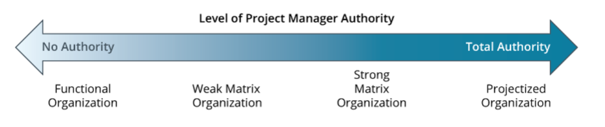

# CompTIA Project+ PK0-005 Quick Study

## Quick Study

- Before you take the exam, be certain you are familiar with the following terms: acceptance, action items, addition, balanced scorecard, cause-and-effect diagram, common causes of variances, control chart, decision trees, end-to-end testing, extinction, flowcharts, integration, integration testing, lessons learned, Pareto diagram, performance testing, prevention, regression testing, rework, run charts, smoke testing, starvation, statistical sampling, stress testing, testing, unit testing, user acceptance testing (UAT).

  - **Acceptance**: Formally acknowledging that a deliverable meets the agreed-upon requirements and can be integrated into the project or handed over to the client.
  - **Action Items**: Specific tasks assigned to individuals or teams to address identified issues, complete required work, or move the project forward.
  - **Addition**: Introducing new features, functionalities, or scope to the project, potentially impacting timelines, resources, and budgets.
  - **Balanced Scorecard**: A performance measurement framework that considers various aspects beyond just financial metrics, such as customer satisfaction, internal processes, and learning and growth.
  - **Cause-and-Effect Diagram** (Fishbone Diagram): A visual tool used to identify and analyze the potential causes of a problem or issue.
  - **Common Causes of Variances**: Deviations from planned performance metrics (e.g., schedule, budget) can be caused by factors like resource constraints, inaccurate estimations, or changes in requirements.
  - **Control Chart**: A statistical tool used to monitor a process over time and identify potential deviations from acceptable ranges, enabling proactive corrective action.
  - **Decision Trees**: Visual representations of possible choices and their consequences, helping to make informed decisions in complex situations.
  - **End-to-End Testing**: Testing a complete system or application from beginning to end, ensuring its functionality and performance across all components and integrations.
  - **Extinction**: Ignoring or not reinforcing a behavior, leading to its eventual decrease or disappearance. Used in project management to address undesirable behaviors or recurring issues.
  - **Flowcharts**: Visual diagrams depicting the steps or processes involved in a task or workflow, aiding in understanding and optimizing procedures.
  - **Integration**: Combining individual components or modules into a functioning system, ensuring seamless communication and data exchange.
  - **Integration Testing**: Testing the functionality and compatibility of different modules or components after they have been integrated into a system.
  - **Lessons Learned**: Capturing and analyzing valuable insights gained from project experiences, both successful and unsuccessful, to improve future projects.
  - **Pareto Diagram (80/20 Rule)**: A graphical representation highlighting that a small percentage of factors (e.g., 20%) often contributes to a large majority of the effects (e.g., 80%). Used to prioritize issues or areas for improvement.
  - **Performance Testing**: Evaluating the system's ability to handle expected load and stress, ensuring it meets performance requirements under various conditions.
  - **Prevention**: Taking proactive measures to avoid problems or issues before they occur, minimizing risks and disruptions.
  - **Regression Testing**: Re-testing previously tested functionality after changes or updates to ensure they haven't introduced new bugs or regressions.
  - **Rework**: Correcting errors or deficiencies in work that has already been completed, leading to additional time and resource costs.
  - **Run Charts**: Visualizing data points over time to identify trends, patterns, and potential areas for improvement.
  - **Smoke Testing**: Basic testing to verify that the core functionalities of a system are working before more in-depth testing begins.
  - **Starvation**: Depriving a process of resources it needs to function effectively, leading to delays, inefficiency, and potential failures.
  - **Statistical Sampling**: Collecting and analyzing data from a representative sample of a population to draw inferences about the entire population, reducing the need to test everything.
  - **Stress Testing**: Testing a system beyond its expected load or capacity to identify its breaking point and ensure it can handle peak demand or unexpected situations.
  - **Testing**: Verifying that a system, component, or function meets its intended requirements and performs as expected.
  - **Unit Testing**: Testing individual units of code (e.g., functions, modules) in isolation to ensure they work properly before integration into the larger system.
  - **User Acceptance Testing (UAT)**: Final testing conducted by end users or stakeholders to ensure the system meets their needs and expectations before being deployed or released.

- Manager Types: Functional, Matrix, Projectized
  - 

| Management Style | About                                                                 |
| ---------------- | --------------------------------------------------------------------- |
| Functional       | Specialized managers for each department                              |
| Matrix           | PM's that assign work(weak), up to control pay, hiring/firing(strong) |
| Projectized      | PM's have full control over pay, hiring/firing                        |

- Be able to name the purpose for controlling quality.
  - Quality control involves monitoring work results to determine whether they comply with the standards set in the quality management plan.
- Name the types of testing performed on technology projects.
  - The types are smoke, unit, integration, end- to- end, regression, stress, performance, and user acceptance testing.
  - Be able to explain a histogram.
    - A histogram displays data distributed over time. It is a type of bar chart.
  - Be able to explain a fishbone diagram.
    - A fishbone diagram is a cause-and-effect diagram, also known as an Ishikawa diagram.
  - Be able to explain a Pareto chart. A Pareto chart is a histogram that rank-orders data by frequency over time.
- Be able to explain a run chart.
  - A run chart displays data as plots on a timeline.
- Be able to explain a control chart.
  - Control charts measure and display the variance of several samples of the same process over time.
- Be able to explain a decision tree.
  - Decision trees are diagrams that show the sequence of interrelated decisions and the expected results of choosing one alternative over the other.
- Be able to explain a scatter diagram.
  - A scatter diagram displays the relationship between two numerical variables and determines whether they are related to each other. It can also be used to prove or disprove cause-and-effect relationships. Scatter diagrams are also known as correlation charts.
- Name the three common causes of variance.
  - These are random variances, known or predictable variances, and variances that are always present in the process.
- Name three actions that you can take when quality is not as expected.
  - Three actions are rework, process adjustments, and acceptance.
- Be able to describe an issue.
  - An issue is something that could impact the project or delay the completion of deliverables. Risks become issues once they occur.
- Be able to describe the issue log.
  - The issue log is where information about issues are logged and may include an identification number, description, priority ranking, resolution plan, and other information.
- Name the performance measurement tools that can be used for quality assessments.
  - They are key performance indicators (KPIs), balanced scorecards, key objectives and results, and cost and schedule performance measures.
- Name the four reasons for project endings.
  - They are addition, starvation, integration, and extinction.
- Understand the steps involved in closing a project.
  - The steps are verification and validation of deliverables, obtaining sign-off, transition plan creation, revoking access, releasing project resources, closing out contracts, archiving documents, lessons learned, closure meeting, closeout report, celebration, and postimplementation support and warranty period.
- Explain the purpose of obtaining formal customer or stakeholder sign-off.
  - The formal sign-off documents that the customer accepts the project work and that the project meets the defined requirements. It also signals the official closure of the project and the transfer of the final product of the project to the organization.
- Describe lessons learned.
  - Lessons learned describe the successes and failures of the project.

## Notes

- Projects begin with gap analysis. We compare where we are and where we want to go.

## Project Life Cycle Phases

- **Discovery Phase**
  - first phase. determine whether project is worthwhile.
  - **Business Case**: created here. Report that helps executives and stakeholders determine benefit or rewards.
    - often includes: details about budget and timelines.
  - Looks for ways to speed up the project: prequalified vendors, clients, contracts.
- **Initiating Phase**
  - formal authorization for a new project to begin.
  -
