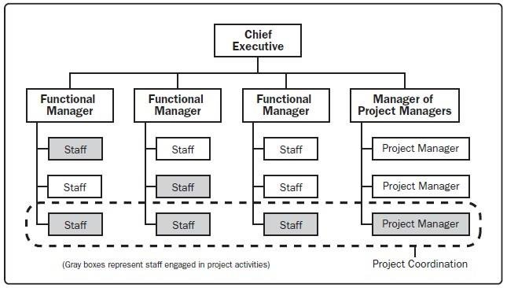
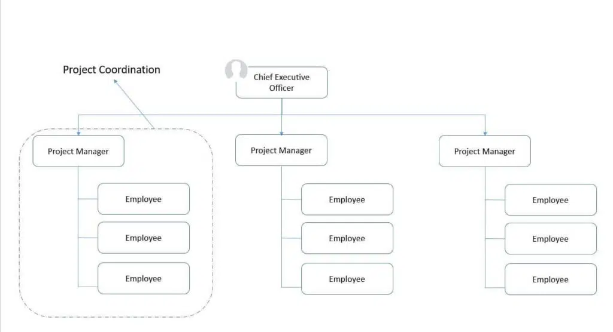
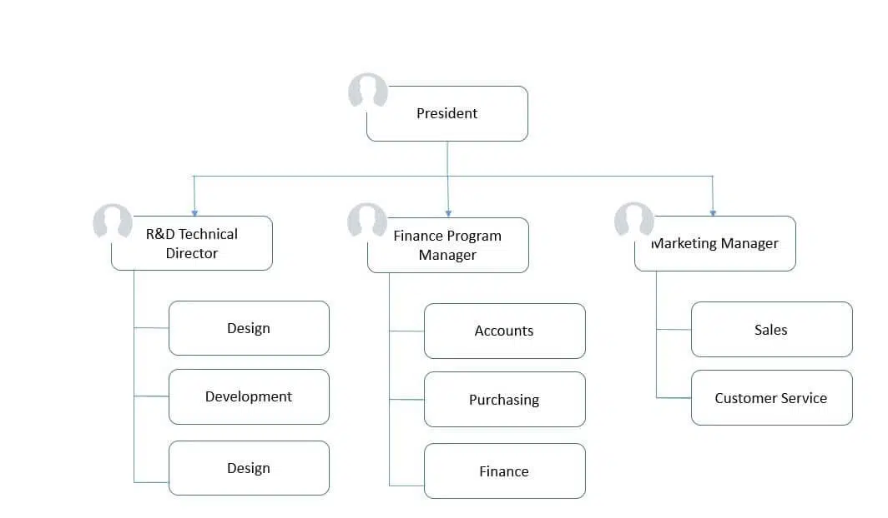

# D324 Business of IT. Project+ PK0-005 Exam Objectives

## Tips

- Know all **phases and what Doc's** go in what phase.
  - Order of things (Initiating, Planned...etc.).
  - know how to read the diagrams, charts and graphs.
  - Make sure you understand the definitions of all the material.
  - Most of my questions contained a scenario of "what step is next?" or "what step is this task in?" -Know the **Change Control Steps** backward and forwards and what is in each step (Documents, Tasks)
- Know the **change management** process steps.
- understand the process control change and what phase documents/artifacts fall under.
- Get a basic understanding of what information the **charts/tools are meant for**.
- **role responsibilities**, and **order of operations** for situations.
- <https://quizlet.com/406758061/pk0-004-project-best-study-guide-2019-flash-cards/>
- <https://quizlet.com/698573077/project-exam-study-questions-flash-cards/>
- <https://wgu.hosted.panopto.com/Panopto/Pages/Viewer.aspx?id=55e10158-bd60-4564-9a45-af300116ced0>
- <https://wgu.webex.com/recordingservice/sites/wgu/recording/53c657ca5726103bb6fa00505681e571/playback>
- <https://wgu.hosted.panopto.com/Panopto/Pages/Viewer.aspx?id=8063f5b9-b20e-4b3e-9d84-af84017b5aa1>
- <https://srm--c.vf.force.com/apex/FDP/CommonsExpandedSearch?courseCode=D324>
- <https://wgu.libguides.com/c.php?g=949093&p=9426624>
- <https://wgu.hosted.panopto.com/Panopto/Pages/Viewer.aspx?id=cb2964e4-cc12-4ce0-a706-af23014b3e93>

- <https://www.reddit.com/r/CompTIA/comments/vgue64/project_passed_barelywhat_i_did/>
  - The **process of how change is brought up and put into play**. Know every. single. step. front and back, had a lot of questions regarding what to be done after a certain step
  - Know what happens during all the **steps of a project beginning with Initiation all the way to Closing**.
  - Know differences and **characteristic between functional, projectized, matrix structures**. Given a scenario, be able to say "this is a functional structure" or "this is projectized", etc.
  - Really know the different **roles**, what they can and cant do.
  - What encompasses the charter, scope, WBS.
  - Know the different **risk strategies** and be able to assign them to an example (accept, mitigate, transfer, avoid, exploit).
  - Know the different **communication methods**, I had a ton of these which kind of surprised me. Know which one is appropriate for certain scenarios (this was a very annoying part of the test because the questions didn't have much context at all so I really had to guess at times)
  - I memorized the formulas for **CV, SV, CPI, SPI and literally had 0 questions** on them which was unfortunate, I know some people get questions on them so may be valuable for you. Wasn't for me
- CompTIA Project+ Study Guide, 3rd Edition by Kim Heldman (ISBN 978-1-119-89245-8)
  - Wiley/Sybex
- BARD: briefly explain each topic from the book CompTIA Project+ Study Guide, 3rd Edition ISBN 978-1-119-89245-8:

- <https://www.reddit.com/r/WGU/comments/10z838f/passed_business_of_it_project_management_d324/>
  - There are lots of questions on what is the BEST or what is the FIRST thing you should do in a situation.
  - You have to know the **order of actions in the processes for change control**, scheduling management, etc.
  - Know what **roles** within the project are responsible for what actions/management.
  - Know all the **types of charts and what they are used for**.
  - Know the **phases and what occurs in each phase** of a project.
  - **Conflict resolution types**.
  - Methods of dealing with **risks**.
  - Terminology and acronyms such as **SOW, RFP, RFQ, RFI, WBS, SLA, LOI, MOU, ERG,** etc.
  - Know differences between **dependency types**.
  - Know **functional, projectized, and the various matrix types** of organizations.
  - What **documents are updated** when certain **events happen**.
  - What is contained within project management **plan, scope management plan**, etc.

| DOMAIN                          | PERCENTAGE OF EXAMINATION |
| ------------------------------- | ------------------------- |
| 1.0 Project Management Concepts | 33%                       |
| 2.0 Project Life Cycle Phases   | 30%                       |
| 3.0 Tools and Documentation     | 19%                       |
| 4.0 Basics of IT and Governance | 18%                       |
| Total                           | 100%                      |

- Passing Score: 710 (on a scale of 100-900 from max 90 questions).

## 1.01 Explain the basic CHARACTERISTICS of a PROJECT and various METHODOLOGIES and FRAMEWORKS used in IT projects

- Characteristics of a project::Start and finish
  - Start and Finish: Every project has a defined beginning and end, with measurable deliverables.
  - Every project must meet three criteria: it is unique, has a specific reason or purpose, and is temporary, meaning it must have a start and finish.
- Characteristics of a project::Unique
  - Unique: Each project is distinct, with specific goals, requirements, and resources.
- Characteristics of a project::Reason/purpose
  - Reason/Purpose: A project addresses a particular need or solves a problem, aiming to achieve a valuable outcome.
- Characteristics of a project::Project as part of a program
  - Project as part of a Program: Programs group related projects that collectively contribute to a broader strategic objective.
  - A program gathers several related projects to accomplish a big goal. Programs last longer than projects because they **run from the start of the first project to the end of the last project**.
  - You must collaborate with other project teams and the program manager.
  - You need to ensure your deliverables and schedule align with the program's plan and requirements.
- Characteristics of a project::Project as part of a portfolio
  - Project as part of a Portfolio: A portfolio **manages all the organization's projects**, balancing resources and optimizing their contribution to **strategic goals**.
  - The main **difference between portfolios and programs** is that **projects within a program are related to the program's objective**. Projects **within a portfolio do not need to be related**; they share a portfolio because they exist in the same arbitrary group of approved projects.
- Methodologies and frameworks::DevSecOps
  - DevSecOps: Integrates security considerations into the entire software development lifecycle.
- Methodologies and frameworks::DevOps
  - DevOps: Promotes collaboration and communication between development and operations teams to streamline software delivery.
- Methodologies and frameworks::Kanban
  - Kanban: Uses a visual kanban board to track task flow and optimize workflow.
  - **Main Focus:** Control work in progress (WIP) levels and manage workflows.
  - 6 Core Practices:
    1. Visualize work: Use a Kanban board to track work progress through stages.
    2. Limit WIP: Reduce context switching and increase focus by restricting active tasks.
    3. Make policies explicit: Define rules for moving work through stages for clarity.
    4. Manage flow: Identify and eliminate workflow bottlenecks for efficiency.
    5. Implement feedback loops: Measure workflow performance and use data for improvement.
    6. Improve collaboratively: Experiment and continuously evolve the workflow.
  - Key Features:
    - Kanban board: Visualizes work, WIP limits, and workflow policies.
    - 3 basic phases: To Do, In Progress, Done (can be customized).
    - 4-part workflow: Prioritize backlog, pull work into progress, move through phases, start new work.
  - Strengths:
    - Simple to learn, flexible, applicable to any industry.
    - Lightweight, focuses on routine work and clear policies.
  - Weaknesses:
    - Requires stable work environment, can struggle with large teams or high turnover.
    - Cycle times may lengthen without set iterations and proper performance management.
  - Use Cases:
    - Teams with frequently changing backlogs (e.g., ticketing systems)
    - Teams comfortable with less structure and stable workflows.
- Methodologies and frameworks::PrRojects IN Controlled Environments (PRINCE2)
  - PRINCE2: A structured project management methodology emphasizing control and accountability.
- Methodologies and frameworks::Software Development Life Cycle (SDLC)
  - SDLC: Defines a standardized approach to software development, guiding the process from planning to deployment.
- Methodologies and frameworks::Scrum
  - **Scrum**: An iterative and incremental agile framework emphasizing short sprints and team collaboration.
  - **Main Focus:** Delivering a potentially shippable product at the end of each iteration (sprint).
  - Most common agile framework. Scrum **helps teams learn and get better by doing things and not just guessing**.
  - The framework emphasizes empiricism and lean thinking, promoting continual improvement.
  - Scrum is an all-or-nothing framework, requiring the use of all its parts for optimal results.
  - It introduces roles like the Scrum team, product owner, Scrum master, and developers.
  - Key Concepts:
    - **Empiricism**: Decisions based on what is seen and known.
    - **Lean thinking**: Minimize waste and inefficiency
    - **All-or-nothing framework**: Use all elements or it's not Scrum
    - **5 Values**: Commitment, focus, openness, respect, courage
    - **3 Pillars**: Transparency, inspection, adaptation
    - **4 Events**: Sprint planning, daily Scrum, sprint review, sprint retrospective
  - Process:
    - Product owner prioritizes work in product backlog.
    - Team selects top items for sprint backlog.
    - Team reviews results and adapts for next sprint.
    - Repeat until backlog is empty.
  - Roles:
    - Scrum Team: Delivers increments of value (3-10 members)
    - Product Owner: Owns and manages product backlog
    - Scrum Master: Coaches team and improves Scrum usage
    - Developers: Complete backlog items (not limited to software)
  - Artifacts:
    - Product Backlog: Ordered list of product changes
    - Sprint Backlog: Team's plan for upcoming sprint
    - Increment: Completed work that moves toward product goal
  - Events:
    - Sprint: Fixed-length iteration (1 week - 1 month)
    - Sprint Planning: Discussing priorities and creating sprint backlog
    - Daily Scrum: Developers review progress and plan next 24 hours
    - Sprint Review: Sharing progress with stakeholders and adjusting backlog
    - Sprint Retrospective: Team inspects how they worked and identifies improvements
  - Strengths:
    - Flexible, applicable to any industry
    - Short cycles for feedback and responsiveness
    - Customer-centric, early product delivery
    - Pacing and task breakdown for large projects
    - Continuous improvement and adaptation
  - Weaknesses:
    - Relies on trust in product owner's decisions
    - Designed for single, high-performing teams
    - Scaling up can be difficult
    - Meeting schedule and pace might overwhelm some teams
  - Use Cases:
    - Highly cohesive, cross-functional teams
    - Large, complex projects with unpredictable workflows
    - Adaptable projects with unknown requirements
- Methodologies and frameworks::Scaled Agile Framework (SAFe)
  - **Agile**: Iterative and Incremental Development(IID). Features are completed and released often throughout the project.
    - Software development typically benefits from this type of framework. Constant feedback from incremental builds, help deliver an improved final product.
    - Strengths: expected change.
    - Weakness: scope creep creating missed deadlines.
    - Use: project requirements will change often. Team is stable and self organized.
  - **SAFe**: Scaled Agile Framework for large-scale agile projects, adapting agile principles to enterprise teams.
- Methodologies and frameworks::Extreme programming (XP)
  - XP: Extreme Programming emphasizes close collaboration, iterative development, and continuous testing.
- Methodologies and frameworks::Waterfall
  - Waterfall: A linear, sequential methodology and project framework where phases follow a strict order, like planning, design, development, testing, and deployment.
  - Strengths: simplest, easy to learn and use.
  - Weakness: not flexible. Change, starts project over from beginning(expensive).
  - Use: when you have fixed requirements, no unknowns, and high change cost.

## 1.02 Compare and contrast AGILE vs. WATERFALL concepts

- AGILE vs. WATERFALL::Criteria for selecting a method::Tolerance for change/flexibility::Requirements
  - Requirements: Highly changeable requirements favor agile methods like Scrum or Kanban, where adaptations happen easily. Waterfall methodology may struggle with frequent changes.
- AGILE vs. WATERFALL::Criteria for selecting a method::Tolerance for change/flexibility::Budget
  - Budget: Agile methods typically work within flexible budgets, adapting features based on available resources. Waterfall requires a fixed budget with clear scope.
- AGILE vs. WATERFALL::Criteria for selecting a method::Tolerance for change/flexibility::Schedule
  - Schedule: Agile methods embrace iterative development, potentially adapting deadlines with each iteration. Waterfall follows a predefined schedule with less room for adjustment.
- AGILE vs. WATERFALL::Criteria for selecting a method::Environmental factors::Cultural
  - Cultural: Collaborative cultures thrive in agile settings, while top-down structures work better with Waterfall.
- AGILE vs. WATERFALL::Criteria for selecting a method::Environmental factors::Developmental
  - Developmental: Complex projects or unfamiliar technology might benefit from Waterfall's structured approach. Agile methods excel in iterative development for evolving technologies.
- AGILE vs. WATERFALL::Criteria for selecting a method::Environmental factors::Industry standards
  - Industry Standards: Some industries (e.g., government) may have regulations impacting methodology choice.
- AGILE vs. WATERFALL::Team composition::Product ownership::Roles and responsibilities
  - Product Ownership: Agile methods rely on a designated product owner to prioritize backlog items and represent business needs. Waterfall focuses on project managers defining deliverables.
  - Roles and Responsibilities: Agile teams involve cross-functional members with shared responsibility. Waterfall often has designated roles with distinct tasks.
- AGILE vs. WATERFALL::Team composition::Product ownership::Team size
  - Team Size: Smaller teams tend to fit agile methods well due to close collaboration. Waterfall can manage larger teams with defined roles and communication structure.
- AGILE vs. WATERFALL::Team composition::Product ownership::Resource allocation and commitment
  - Resource Allocation and Commitment: Agile methods require flexible resource allocation, adapting to changing task priorities. Waterfall expects pre-determined resource commitment based on the fixed plan.
- AGILE vs. WATERFALL::Differences in communication methods
  - Agile: Frequent, informal communication through daily stand-up meetings, backlog updates, and collaborative tools.
  - Waterfall: More formal communication through reports, documentation, and structured meetings.

## 1.03 Given a scenario, apply the CHANGE CONTROL process throughout the project life cycle

briefly explain each topic from the book CompTIA Project+ Study Guide, 3rd Edition ISBN 978-1-119-89245-8:

- CHANGE CONTROL::Project-specific change control::Create/receive change requests
  Change Conrtol: A formal process for managing any alterations to the project baseline (approved plan). It ensures proper evaluation, approval, and implementation of changes while minimizing disruption.
  - Create/Receive Change Requests: Anyone can propose changes through a formal request document.
- CHANGE CONTROL::Project-specific change control::Document requests in the change control log
  - Document Requests: Log all requests in a Change Control Log (CCL) for tracking and analysis.
- CHANGE CONTROL::Project-specific change control::Conduct a preliminary review
  - Preliminary Review: Assess the request's validity, completeness, and potential impact on the project.
- CHANGE CONTROL::Project-specific change control::Conduct impact assessments
  - Impact Assessments: Analyze the effect of the change on various aspects like schedule, budget, resources, and risks.
- CHANGE CONTROL::Project-specific change control::Document change recommendations
  - Document Change Recommendations: Based on the assessment, recommend approval, rejection, or modification of the request.
- CHANGE CONTROL::Project-specific change control::Determine decision makers
  - Determine Decision Makers: Identify the individuals or committee (Change Control Board, CCB) authorized to approve or reject changes.
- CHANGE CONTROL::Project-specific change control::Escalate to the change control board (CCB), if applicable
  - Escalate to CCB: If needed, formally present the request and recommendations to the CCB for final decision.
- CHANGE CONTROL::Project-specific change control::Document the status of approval in the change control log
  - Document Status: Update the CCL with the approved decision (approve, reject, defer).
- CHANGE CONTROL::Project-specific change control::Communicate the change status
  - Communicate Change Status: Inform stakeholders about the decision and its implications.
- CHANGE CONTROL::Project-specific change control::Update the project plan
  - Update Project Plan: If approved, integrate the change into the project plan, adjusting schedules, tasks, resources, and budgets.
- CHANGE CONTROL::Project-specific change control::Implement changes
  - Implement Changes: Execute the approved change using proper procedures and controls.
- CHANGE CONTROL::Project-specific change control::Validate the change implementation
  - Validate Change Implementation: Verify that the change was implemented correctly and meets expectations.
- CHANGE CONTROL::Project-specific change control::Communicate change deployment
  - Communicate Change Deployment: Inform stakeholders about the successful implementation of the change.
- CHANGE CONTROL::Project change management::Product change vs. project change
  - Product Change vs. Project Change: Distinguishing between changes affecting the final product's features (product change) and those affecting the project's execution (project change).
- CHANGE CONTROL::Project change management::Manage scope creep/scope change
  - Managing Scope Creep/Scope Change: Addressing situations where the project's scope (planned deliverables) unintentionally expands (scope creep). This may involve formal change control, negotiation with stakeholders, or potentially re-baselining the project.

## 1.04 Given a scenario, perform RISK MANAGEMENT activities

RISK MANAGEMENT

briefly explain each topic from the book CompTIA Project+ Study Guide, 3rd Edition ISBN 978-1-119-89245-8:

- RISK MANAGEMENT::General risks::New projects
  - New projects: Lack of experience, undefined requirements, or unrealistic planning can introduce risks.
- RISK MANAGEMENT::General risks::New management
  - New management: Changes in leadership might disrupt established processes and communication.
- RISK MANAGEMENT::General risks::Regulatory environment changes
  - Regulatory environment changes: Compliance burdens or unexpected restrictions can impact project execution.
- RISK MANAGEMENT::General risks::Digital transformation
  - Digital transformation: Implementing new technologies can pose risks related to integration, adoption, and security.
- RISK MANAGEMENT::General risks::Infrastructure end-of-life
  - Infrastructure end-of-life: Aging hardware or software nearing retirement can create operational instability.
- RISK MANAGEMENT::General risks::Merger and acquisition
  - Merger and acquisition: Integrating two organizations can pose cultural challenges, resource conflicts, and integration complexities.
- RISK MANAGEMENT::General risks::Reorganization
  - Reorganization: Restructuring can disrupt established teams, communication paths, and project momentum.
- RISK MANAGEMENT::General risks::Major cybersecurity event
  - Major cybersecurity event: Data breaches, malware attacks, or system disruptions can severely impact project goals and reputation.
- RISK MANAGEMENT::Known risk vs. unknown risk
  - Known risks: Identified and anticipated threats with some understanding of their probability and impact.
  - Unknown risks: Unforeseen threats with little to no information about their potential occurrence or effect.
- RISK MANAGEMENT::Common risk responses::Development of contingency/fallback plans
  - Contingency/fallback plans: Predefined actions to mitigate or recover from potential risks.
- RISK MANAGEMENT::Common risk responses::Risk management strategies::Negative risks::Accept
  - Accept: Acknowledge the risk and its potential consequences but choose not to act.
- RISK MANAGEMENT::Common risk responses::Risk management strategies::Negative risks::Avoid
  - Avoid: Modify the project plan to eliminate the risk entirely.
- RISK MANAGEMENT::Common risk responses::Risk management strategies::Negative risks::Mitigate
  - Mitigate: Implement measures to reduce the likelihood or impact of the risk.
- RISK MANAGEMENT::Common risk responses::Risk management strategies::Negative risks::Transfer
  - Transfer: Shift the responsibility or financial burden of the risk to another party (e.g., insurance).
- RISK MANAGEMENT::Common risk responses::Risk management strategies::Positive risks::Accept
  - Accept: Leverage the positive outcome without actively pursuing it.
- RISK MANAGEMENT::Common risk responses::Risk management strategies::Positive risks::Enhance
  - Enhance: Increase the likelihood or benefit of the positive outcome.
- RISK MANAGEMENT::Common risk responses::Risk management strategies::Positive risks::Exploit
  - Exploit: Actively pursue the positive outcome to maximize its benefits.
- RISK MANAGEMENT::Common risk responses::Risk management strategies::Positive risks::Share
  - Share: Partner with others to share the benefits or responsibilities associated with the positive risk.
- RISK MANAGEMENT::Risk analysis::Qualitative::Interconnectivity
  - Qualitative: Evaluating risks based on subjective assessments of their likelihood and impact (e.g., high/medium/low).
  - Interconnectivity: Analyzing how interconnected risks are and how one might escalate another.
- RISK MANAGEMENT::Risk analysis::Qualitative::Detectability
  - Detectability: Assessing the ease of identifying and monitoring a risk before it materializes.
- RISK MANAGEMENT::Risk analysis::Quantitative::Simulation
  - Quantitative: Using data and mathematical models to estimate the probability and impact of risks (e.g., simulations).
- RISK MANAGEMENT::Risk analysis::Impact analysis::Probability vs. impact
  - Impact analysis: Evaluating the potential severity of a risk on project goals (e.g., cost, schedule, quality).
  - Probability vs. impact: Balancing the likelihood of a risk occurring with its potential severity to prioritize responses.
- RISK MANAGEMENT::Risk analysis::Situational/scenario analysis
  - Situational/scenario analysis: Exploring different possible future scenarios to understand the range of potential outcomes due to various risks.
- RISK MANAGEMENT::Connections between risks and issues
  - Risks are potential problems, while issues are actual problems that have already occurred. Risks can inform strategies to prevent or mitigate issues, and managing issues effectively helps learn from and address similar risks in the future.
- RISK MANAGEMENT::Connection between risks and changes
  - Changes to the project plan or environment can introduce new risks, while addressing existing risks may require changes to the project approach.
- RISK MANAGEMENT::Roles and responsibilities::Points of escalation
  - Points of escalation: Defining clear escalation paths for identifying and reporting identified risks to appropriate stakeholders.
- RISK MANAGEMENT::Roles and responsibilities::Ownership
  - Ownership: Assigning specific individuals or teams the responsibility for monitoring, analyzing, and responding to various risks.

## 1.05 Given a scenario, perform ISSUE MANAGEMENT activities

- ISSUE MANAGEMENT::Roles and responsibilities::Escalation path
  - Points of escalation: Clearly defined paths for reporting identified issues to the appropriate individuals or teams based on their severity, impact, and expertise.
- ISSUE MANAGEMENT::Roles and responsibilities::Ownership
  - Ownership: Assigning specific individuals or teams the responsibility for managing and resolving different types of issues. This ensures accountability and efficient problem-solving.
- ISSUE MANAGEMENT::Issue tracking
  - Implementing a system to log, track, and manage issues throughout the project lifecycle. This system allows for:
    - Centralized repository: Tracking all issues in one place for easy reference and analysis.
    - Status updates: Monitoring progress towards resolution and identifying any delays.
    - Assignment and communication: Assigning ownership and facilitating communication between stakeholders involved in resolving the issue.
    - Trend analysis: Identifying recurring issues and potential areas for improvement in the project's processes or environment.
- ISSUE MANAGEMENT::Connections between issues and changes
  - Addressing issues often necessitates changes to the project plan, scope, or resources. Conversely, changes introduced during the project can lead to new issues. Effective project management requires understanding and managing these interdependencies.
- ISSUE MANAGEMENT::Resolution plan::Execute contingency plans
  - Execute contingency plans: If applicable, implementing pre-defined plans for handling specific types of issues.
- ISSUE MANAGEMENT::Resolution plan::Root cause analysis
  - Root cause analysis: Investigating the underlying reason behind the issue to prevent similar occurrences in the future.
- ISSUE MANAGEMENT::Resolution plan::Prioritization::Issue severity
  - Prioritization: Determining the order in which to address issues based on various factors, such as:
  - Issue severity: High-impact issues causing significant disruption or risk should be prioritized.
- ISSUE MANAGEMENT::Resolution plan::Prioritization::Impact to project
  - Impact to project: Issues affecting critical project goals or timelines take precedence.
- ISSUE MANAGEMENT::Resolution plan::Prioritization::Urgency
  - Urgency: Time-sensitive issues requiring immediate attention should be addressed first.
- ISSUE MANAGEMENT::Resolution plan::Prioritization::Scope of impact to organization
  - Scope of impact to organization: Issues with wider organizational consequences might need higher priority.
- ISSUE MANAGEMENT::Resolution plan::Prioritization::Issue escalation
  - Issue escalation: Following the established escalation path for critical or complex issues requiring attention from higher levels of management.
- ISSUE MANAGEMENT::Resolution plan::Work-arounds
  - Temporary solutions or alternative approaches to circumvent the issue and minimize its impact on the project while a permanent fix is developed and implemented.
- ISSUE MANAGEMENT::Outcome documentation
  - Documenting the resolution process, including the identified issue, root cause analysis, implemented solution, and any changes made to the project plan or procedures. This helps with:
    - Knowledge sharing and future reference.
    - Identifying patterns and trends in issues.
    - Improving future project planning and risk mitigation strategies.

## 1.06 Given a scenario, apply schedule DEVELOPMENT and MANAGEMENT activities and techniques

- DEVELOPMENT and MANAGEMENT::Upcoming milestones and activity identification::Sprint goals
  - Defining specific objectives and goals for each sprint, ensuring focused efforts and measurable progress.
  - Ordering activities within a sprint based on dependencies and priorities, optimizing workflow and resource allocation.
- DEVELOPMENT and MANAGEMENT::Sequencing::Dependencies::Hard logic/mandatory
  - Hard Logic/Mandatory: Strict dependencies that must be followed for successful project execution.
- DEVELOPMENT and MANAGEMENT::Sequencing::Dependencies::Soft logic/discretionary
  - Soft Logic/Discretionary: Preferred order, but some flexibility exists in sequencing.
- DEVELOPMENT and MANAGEMENT::Sequencing::Dependencies::External
  - External: Dependencies on factors outside the team's control (e.g., vendor deliveries).
- DEVELOPMENT and MANAGEMENT::Sequencing::Dependencies::Internal
  - Internal: Dependencies between team activities.
- DEVELOPMENT and MANAGEMENT::Sequencing::Dependencies::Issue escalation
  - Issue Escalation: Dependencies related to resolving identified issues before proceeding.
- DEVELOPMENT and MANAGEMENT::Sequencing::Successor/predecessor relationships::Start-to-start
  - Start-to-Start: Both activities begin at the same time.
- DEVELOPMENT and MANAGEMENT::Sequencing::Successor/predecessor relationships::Start-to-finish
  - Start-to-Finish: One activity starts when the other finishes.
- DEVELOPMENT and MANAGEMENT::Sequencing::Successor/predecessor relationships::Finish-to-finish
  - Finish-to-Finish: Both activities finish at the same time.
- DEVELOPMENT and MANAGEMENT::Sequencing::Successor/predecessor relationships::Finish-to-start
  - Finish-to-Start: One activity starts when the other finishes.
- DEVELOPMENT and MANAGEMENT::Resource loading
  - Assigning team members to specific activities based on their skills, availability, and workload capacity.
- DEVELOPMENT and MANAGEMENT::Estimating techniques::Determine contingency reserves/buffers
  - Allocating additional time or resources within the sprint to handle unforeseen challenges or fluctuations in workload.
- DEVELOPMENT and MANAGEMENT::Story estimation/story points::Epics
  - Breaking down larger user stories into smaller, more manageable tasks and assigning point values based on complexity and effort.
  - High-level user stories representing broader features or functionalities, further broken down into smaller stories.
- DEVELOPMENT and MANAGEMENT::Story estimation/story points::Tasks
  - Individual, well-defined units of work assigned to team members within a story.
- DEVELOPMENT and MANAGEMENT::Scheduling tools
  - Software applications used to visualize and manage the project schedule, track progress, and identify potential issues.
- DEVELOPMENT and MANAGEMENT::Schedule maintenance::Contingency reserves/buffer utilization
  - Contingency reserves/buffer utilization: Adapting buffer usage based on actual needs.
- DEVELOPMENT and MANAGEMENT::Schedule maintenance::Critical path analysis
  - Critical path analysis: Identifying the sequence of activities with no slack time, critical for project completion.
- DEVELOPMENT and MANAGEMENT::Schedule maintenance::Impacts to cadence
  - Impacts to cadence: Adjusting the schedule to maintain consistent sprint duration if necessary.
- DEVELOPMENT and MANAGEMENT::Schedule maintenance::Forecasting
  - Forecasting: Predicting future progress and potential challenges to adapt the schedule proactively.
- DEVELOPMENT and MANAGEMENT::Schedule maintenance::Publication and sharing
  - Publication and sharing: Communicating the updated schedule to stakeholders.
- DEVELOPMENT and MANAGEMENT::Schedule maintenance::Sprint planning
  - Collaborative session at the beginning of each sprint to define the scope, goals, and tasks for the upcoming iteration.
- DEVELOPMENT and MANAGEMENT::Schedule maintenance::Backlog prioritization
  - Ordering user stories and tasks within the backlog based on their importance, urgency, and dependencies.
- DEVELOPMENT and MANAGEMENT::Revise baseline vs. rebaseline
  - Revise Baseline: Updating the project baseline (initial plan) within a sprint to reflect minor changes or adjustments.
  - Rebaseline: More significant changes requiring a complete overhaul of the baseline, impacting future sprints and potentially requiring stakeholder approval.

## 1.07 Compare and contrast QUALITY MANAGEMENT concepts and PERFORMANCE MANAGEMENT concepts

- QUALITY and PERFORMANCE MANAGEMENT::Retrospective/lessons learned
  - A collaborative session at the end of each sprint to reflect on what went well, what could be improved, and capture valuable insights for future projects (lessons learned).
- QUALITY and PERFORMANCE MANAGEMENT::Sprint review
  - A meeting at the end of each sprint to showcase completed work to stakeholders, gather feedback, and confirm alignment with project goals.
- QUALITY and PERFORMANCE MANAGEMENT::Service-level agreement
  - A formal contract outlining the expected performance and quality of service for a project or system, typically between internal teams or with external vendors.
- QUALITY and PERFORMANCE MANAGEMENT::Key performance indicators—objectives and key results
  - A framework for setting measurable goals (objectives) and specific, time-bound targets (key results) to track progress and evaluate the success of the project or service.
- QUALITY and PERFORMANCE MANAGEMENT::Cost and schedule performance::Cost variance
  - Cost Variance: The difference between the actual cost incurred and the budgeted cost for a specific activity or the entire project.
- QUALITY and PERFORMANCE MANAGEMENT::Cost and schedule performance::Schedule variance
  - Schedule Variance: The difference between the actual time taken to complete an activity or the project and the planned timeframe.
- QUALITY and PERFORMANCE MANAGEMENT::Audits and inspections
  - Formal assessments of the project's processes, documentation, and deliverables to identify potential issues, ensure compliance with regulations, and improve overall quality.
- QUALITY and PERFORMANCE MANAGEMENT::Test plan and testing cycles::Unit testing
  - Unit Testing: Testing individual units of code (e.g., functions, modules) in isolation to ensure they work properly.
- QUALITY and PERFORMANCE MANAGEMENT::Test plan and testing cycles::Smoke testing
  - Smoke Testing: Basic testing to verify the core functionalities of a system are working before more in-depth testing begins.
- QUALITY and PERFORMANCE MANAGEMENT::Test plan and testing cycles::Regression testing
  - Regression Testing: Re-testing previously tested functionality after changes or updates to ensure they haven't introduced new bugs or regressions.
- QUALITY and PERFORMANCE MANAGEMENT::Test plan and testing cycles::Stress testing
  - Stress Testing: Testing a system beyond its expected load or capacity to identify its breaking point and ensure it can handle peak demand or unexpected situations.
- QUALITY and PERFORMANCE MANAGEMENT::Test plan and testing cycles::Performance testing
  - Performance Testing: Evaluating the system's ability to handle expected load and stress, ensuring it meets performance requirements under various conditions.
- QUALITY and PERFORMANCE MANAGEMENT::Test plan and testing cycles::User acceptance testing
  - User Acceptance Testing (UAT): Final testing conducted by end users or stakeholders to ensure the system meets their needs and expectations before being deployed or released.
- QUALITY and PERFORMANCE MANAGEMENT::Verification and validation
  - Verification: Ensuring the system is built right (meets specifications and requirements).
  - Validation: Ensuring the system is built to meet the actual needs of users and stakeholders.
- QUALITY and PERFORMANCE MANAGEMENT::Post-implementation support/warranty period
  - Providing ongoing support and maintenance for the delivered system after deployment, addressing any issues or bugs that may arise during the warranty period.

## 1.08 Compare and contrast COMMUNICATION MANAGEMENT concepts

COMMUNICATION MANAGEMENT

- COMMUNICATION MANAGEMENT::Assess methods::Synchronous and asynchronous communication
  - Synchronous: Real-time interaction like meetings, calls, or video conferences.
  - Asynchronous: Communication with a time delay, like emails, messages, or project management tools.
- COMMUNICATION MANAGEMENT::Assess methods::Written and verbal
  - Written and Verbal: Choosing the appropriate format based on formality, complexity, and audience reach.
- COMMUNICATION MANAGEMENT::Assess methods::Formal and informal
  - Formal and Informal: Balancing professional structure with casual interaction for building rapport and fostering collaboration.
- COMMUNICATION MANAGEMENT::Assess methods::External and internal
  - External and Internal: Tailoring communication styles and platforms to stakeholders within and outside the project team.
- COMMUNICATION MANAGEMENT::Develop communication platforms/modalities
  - Selecting and implementing appropriate communication tools based on project needs, team preferences, and budget.
  - This could include collaboration platforms, video conferencing solutions, project management software, instant messaging, and email.
- COMMUNICATION MANAGEMENT::Manage project communication::Overcoming communication challenges::Language barriers
  - Language barriers: Utilize translation tools, clarify terminology, and promote inclusive language.
- COMMUNICATION MANAGEMENT::Manage project communication::Overcoming communication challenges::Time zones/geographical factors
  - Time zones/geographical: Schedule meetings at convenient times, employ asynchronous communication channels, and consider cultural sensitivities.
- COMMUNICATION MANAGEMENT::Manage project communication::Overcoming communication challenges::Technological factors
  - Technological factors: Ensure reliable internet access, provide training on communication tools, and troubleshoot technical issues.
- COMMUNICATION MANAGEMENT::Manage project communication::Overcoming communication challenges::Cultural differences
  - Cultural differences: Adapt communication styles, show respect for diverse perspectives, and consider non-verbal cues.
- COMMUNICATION MANAGEMENT::Manage project communication::Maintaining communication records::Communication security
  - Communication security: Utilize secure platforms, implement access controls, and train on cybersecurity best practices.
- COMMUNICATION MANAGEMENT::Manage project communication::Maintaining communication records::Communication integrity
  - Communication integrity: Ensure accuracy, timeliness, and transparency in communication.
- COMMUNICATION MANAGEMENT::Manage project communication::Maintaining communication records::Communication archiving
  - Communication archiving: Document and store communication records for future reference and audit purposes.
- COMMUNICATION MANAGEMENT::Controlling project communication::Escalating communication issues
  - Define clear escalation paths for addressing communication breakdowns or complex issues.
  - Involve relevant stakeholders at appropriate levels based on the severity of the issue.
- COMMUNICATION MANAGEMENT::Controlling project communication::Revising the communication plan
  - Monitor and evaluate the effectiveness of the communication plan throughout the project.
  - Adapt and update the plan as needed to address changes in the project, team, or communication needs.

## 1.09 Given a scenario, apply effective meeting MANAGEMENT TECHNIQUES

- MANAGEMENT TECHNIQUES::Meeting types::Collaborative::Workshops
  - Collaborative: Meetings designed to generate ideas, solve problems, and reach consensus.
  - Workshops: Intensive sessions focused on specific topics or tasks, often involving hands-on activities.
- MANAGEMENT TECHNIQUES::Meeting types::Collaborative::Focus groups
  - Focus groups: Gathering feedback and insights from a targeted group of stakeholders.
- MANAGEMENT TECHNIQUES::Meeting types::Collaborative::Joint application development/joint application review sessions
  - Joint Application Development/Review Sessions: Collaborative sessions to develop or review applications with external partners.
- MANAGEMENT TECHNIQUES::Meeting types::Collaborative::Brainstorming
  - Brainstorming: Generating creative ideas in a free-flowing, open-minded environment.
- MANAGEMENT TECHNIQUES::Meeting types::Informative::Demonstrations/presentations
  - Demonstrations/Presentations: Showcasing features, functionalities, or progress on specific aspects of the project.
- MANAGEMENT TECHNIQUES::Meeting types::Informative::Stand-ups
  - Stand-ups: Short, daily meetings to update on progress and identify blockers.
- MANAGEMENT TECHNIQUES::Meeting types::Informative::Status
  - Status Meetings: Sharing project updates and addressing open issues.
- MANAGEMENT TECHNIQUES::Meeting types::Decisive::Refinement
  - Refinement Meetings: Prioritizing and defining scope for upcoming work.
- MANAGEMENT TECHNIQUES::Meeting types::Decisive::Task setting
  - Task Setting Meetings: Assigning tasks and responsibilities to team members.
- MANAGEMENT TECHNIQUES::Meeting types::Decisive::Project steering committee meeting
  - Project Steering Committee Meetings: High-level decision-making involving key stakeholders.
- MANAGEMENT TECHNIQUES::Agenda settings/publishing
  - Creating a clear agenda outlining the meeting's goals, topics, and expected outcomes.
  - Publishing the agenda beforehand to inform attendees and ensure focus.
- MANAGEMENT TECHNIQUES::Roles::Facilitator
  - Facilitator: Guides the meeting discussion, keeps track of time, and ensures participation from all attendees.
- MANAGEMENT TECHNIQUES::Roles::Scribe
  - Scribe: Documents key points, action items, and decisions made during the meeting.
- MANAGEMENT TECHNIQUES::Roles::Attendees/target audience
  - Attendees/Target Audience: Individuals involved in or impacted by the meeting's topic, invited to contribute actively or receive information.
- MANAGEMENT TECHNIQUES::Timeboxing
  - Allocating specific time slots for agenda items to improve efficiency and prevent meetings from running over.
- MANAGEMENT TECHNIQUES::Action items
  - Clear and actionable tasks assigned to individuals or teams during the meeting, with due dates and ownership accountability.
- MANAGEMENT TECHNIQUES::Meeting minutes
  - A concise written record summarizing key discussions, decisions, action items, and next steps.
- MANAGEMENT TECHNIQUES::Follow-ups
  - Ensuring assigned action items are completed and reported on in subsequent meetings.

## 1.10 Given a scenario, perform basic activities related to TEAM and RESOURCE MANAGEMENT

- TEAM and RESOURCE MANAGEMENT::Organizational structures::Matrix
  - Matrix: Teams report to both project managers and functional managers, creating cross-functional collaboration but potential for conflicting priorities.
  - Project Manager is responsible for assigning work but does not have official authority over the people doing the work.
  - **Weak matrix**: The functional manager retains all budget and staff management responsibilities. In this sense, the PM has less control over the project.
  - **Strong matrix**: A PM has substantial control over the project. They may have management responsibilities for the budget and staff.
  - Cons: employees feel like they have two bosses.
  - 
  - 
- TEAM and RESOURCE MANAGEMENT::Organizational structures::Projectized
  - Projectized: Project managers have full authority over dedicated teams focusing on specific projects, offering flexibility but potentially siloed knowledge.
  - Organization that pools resources around projects.
  - PM leads a group of people as long as a project exists. When the project ends, the team disbands and reforms around new projects.
  - The PM owns the budget and line manager responsibilities. Therefore typically has more HR responsibilities.
  - Looks similar to a functional organization. However, it will have PMs instead of specialized managers leading each team.
  - 
- TEAM and RESOURCE MANAGEMENT::Organizational structures::Functional
  - Functional: Teams are organized by specialized skills or departments, offering efficiency but limited visibility across projects.
  - A single leader(president) with a few direct reports.
  - Suits small businesses. Easier to communicate, but easy to become siloed from other departments.
  - Will have 'specialized roles' of functional managers.
  - Ex.. all human resources personnel report to a Human Resources head(manager), who then reports to the president. Their primary teammates are people with similar job responsibilities and expertise.
  - 
- TEAM and RESOURCE MANAGEMENT::Resource life cycle::Acquisition::Needs assessment
  - Acquisition: Identifying and securing needed resources through hiring, purchasing, or contracting.
  - Needs assessment: Analyzing project requirements to determine necessary resources.
- TEAM and RESOURCE MANAGEMENT::Resource life cycle::Maintenance
  - Maintenance: Upgrading, repairing, and ensuring resource availability throughout the project.
- TEAM and RESOURCE MANAGEMENT::Resource life cycle::Hardware decommissioning
  - Hardware Decommissioning: Safely retiring and disposing of outdated hardware.
- TEAM and RESOURCE MANAGEMENT::Resource life cycle::End-of-life software
  - End-of-Life Software: Migrating or transitioning away from outdated software solutions.
- TEAM and RESOURCE MANAGEMENT::Resource life cycle::Successor planning
  - Succession Planning: Identifying and developing backups for critical roles to avoid disruptions.
- TEAM and RESOURCE MANAGEMENT::Resource types and criticality::Human resources
  - Human Resources: Skilled individuals assigned to project tasks.
- TEAM and RESOURCE MANAGEMENT::Resource types and criticality::Physical resources
  - Physical Resources: Equipment, facilities, and materials needed for project activities.
- TEAM and RESOURCE MANAGEMENT::Resource types and criticality::Capital resources
  - Capital Resources: Financial investments and funding allocated to the project.
- TEAM and RESOURCE MANAGEMENT::Resource types and criticality::Internal vs. external
  - Internal vs. External: Resources obtained from within or outside the organization.
- TEAM and RESOURCE MANAGEMENT::Resource types and criticality::Shared vs. dedicated
  - Shared vs. Dedicated: Resources used by multiple projects or exclusively assigned to one.
- TEAM and RESOURCE MANAGEMENT::Gap analysis::Feature/functionality
  - Gap Analysis: Identifying discrepancies between the current state and desired state of a project in terms of:
  - Feature/functionality: Comparing existing capabilities with required functionality.
- TEAM and RESOURCE MANAGEMENT::Gap analysis::Skills
  - Skills: Assessing team skills against project requirements.
- TEAM and RESOURCE MANAGEMENT::Gap analysis::Utilization
  - Utilization: Analyzing how efficiently resources are being used.
- TEAM and RESOURCE MANAGEMENT::Team performance considerations::Maintaining project momentum
  - Maintaining Project Momentum: Addressing motivational challenges and fostering a positive team environment.
- TEAM and RESOURCE MANAGEMENT::Team performance considerations::Assessing team life cycle::Forming
  - Characteristics: This initial stage is marked by introductions, establishing roles, and getting familiar with the project. There might be uncertainty and dependence on the project manager for guidance.
  - Leadership approach: Focus on building trust, defining expectations, and fostering open communication. Provide clear direction and support team members as they learn about the project.
- TEAM and RESOURCE MANAGEMENT::Team performance considerations::Assessing team life cycle::Storming
  - Characteristics: This stage can involve disagreements, competition for roles, and potential conflict as team members adjust to working together. Power dynamics might be tested.
  - Leadership approach: Facilitate healthy conflict resolution, encourage collaboration, and actively manage team dynamics. Foster a safe space for open communication and address any underlying issues.
- TEAM and RESOURCE MANAGEMENT::Team performance considerations::Assessing team life cycle::Norming
  - Characteristics: The team starts to establish cohesion, develop shared goals, and agree on working methods. Communication improves, and trust begins to build.
  - Leadership approach: Delegate tasks, empower team members, and provide opportunities for individual and team growth. Monitor progress and address any remaining challenges.
- TEAM and RESOURCE MANAGEMENT::Team performance considerations::Assessing team life cycle::Performing
  - Characteristics: The team is at its peak efficiency, working effectively towards goals. Communication is open and collaborative, and members are confident and motivated.
  - Leadership approach: Continue to provide support and guidance as needed, but focus on facilitating team autonomy and celebrating successes. Monitor performance metrics and adjust the plan as needed.
- TEAM and RESOURCE MANAGEMENT::Team performance considerations::Assessing team life cycle::Adjourning
  - Characteristics: The project nears completion, and team members start to prepare for disbanding. There might be mixed emotions as closure approaches.
  - Leadership approach: Focus on ensuring a smooth project handover, finalizing deliverables, and providing proper closure for team members. Acknowledge their contributions and celebrate the project's achievements.
- TEAM and RESOURCE MANAGEMENT::Team performance considerations::Providing project team performance feedback
  - Providing Project Team Performance Feedback: Guiding and motivating team members through constructive feedback and recognition.
- TEAM and RESOURCE MANAGEMENT::Roles and responsibilities::Functional/extended vs. operational/core team members
  - Functional/Extended: Individuals contributing from their primary department to specific project tasks.
    - Ex.. The functional manager retains the budget and people management responsibilities in a functional organization. The PM coordinates the project, but they have little relative authority over people or cost.
  - Operational/Core: Members dedicated full-time to the project team.
- TEAM and RESOURCE MANAGEMENT::Roles and responsibilities::Sponsor
  - Sponsor: Provides project funding and high-level direction.
  - Accountable for a project. Provide vision, insight, and guidance throughout the project. The sponsor also serves in a governance role in most project frameworks.
  - The sponsor will amplify the project’s visibility.
  - Build support with other senior managers and advertise the project’s benefits throughout the organization.
  - Secure funding and remove resource-related barriers.
  - Approves deliverables and decides when a project starts and ends.
- TEAM and RESOURCE MANAGEMENT::Roles and responsibilities::Stakeholders
  - Stakeholders: Individuals or groups with vested interest in the project's success.
- TEAM and RESOURCE MANAGEMENT::Roles and responsibilities::Senior management
  - Senior Management: Offers strategic guidance and decision-making support.
  - Highest level of leadership.
- TEAM and RESOURCE MANAGEMENT::Roles and responsibilities::Product owner
  - Product Owner (Agile): Prioritizes and defines product backlog for development.
- TEAM and RESOURCE MANAGEMENT::Roles and responsibilities::Scrum master
  - Scrum Master (Agile): Facilitates agile ceremonies and removes roadblocks for the team.
- TEAM and RESOURCE MANAGEMENT::Roles and responsibilities::Project manager (PM)
  - Project Manager (PM): Plans, executes, and controls the project to meet objectives.
  - Lead Projects.
- TEAM and RESOURCE MANAGEMENT::Roles and responsibilities::Program manager
  - Program Manager: Oversees multiple related projects and ensures program-level goals are met.
  - Lead programs.
- TEAM and RESOURCE MANAGEMENT::Roles and responsibilities::Product manager
  - Gathering and managing product requirements: The PM acts as the voice of the customer, capturing their needs and translating them into actionable requirements for the development team. They prioritize features and functionalities based on impact, feasibility, and market needs.
- TEAM and RESOURCE MANAGEMENT::Roles and responsibilities::Testers/quality assurance (QA) specialists
  - Testers/QA Specialists: Evaluate and report on software quality.
- TEAM and RESOURCE MANAGEMENT::Roles and responsibilities::Business analyst
  - Business Analyst: Analyzes business requirements and translates them into project specifications.
- TEAM and RESOURCE MANAGEMENT::Roles and responsibilities::Subject matter expert (SME)
  - Subject Matter Expert (SME): Provides specialized knowledge and expertise to the project.
- TEAM and RESOURCE MANAGEMENT::Roles and responsibilities::Architect
  - Architect: Designs the overall system architecture and technical solutions.
- TEAM and RESOURCE MANAGEMENT::Roles and responsibilities::Developers/engineers
  - Developers/Engineers: Build and implement the project deliverables.
- TEAM and RESOURCE MANAGEMENT::Roles and responsibilities::Project management office (PMO)
  - Project Management Office (PMO): Provides project management support, templates, and best practices.
  - Manages the flow of projects.
  - Tracks metrics for projects throughout the organization.
- TEAM and RESOURCE MANAGEMENT::Roles and responsibilities::End users
  - End Users: Individuals who will ultimately use the project's deliverables.

## 1.11 Explain important PROJECT PROCUREMENT and VENDOR SELECTION concepts

- PROJECT PROCUREMENT and VENDOR SELECTION::Resource procurement methods::Build
  - Build: Develop the resources in-house using existing staff and equipment.
- PROJECT PROCUREMENT and VENDOR SELECTION::Resource procurement methods::Buy
  - Buy: Purchase the resources from external vendors.
- PROJECT PROCUREMENT and VENDOR SELECTION::Resource procurement methods::Lease
  - Lease: Rent the resources for a specific period.
- PROJECT PROCUREMENT and VENDOR SELECTION::Resource procurement methods::Subscription/pay-as-you-go
  - Subscription/Pay-as-you-go: Access resources on a subscription basis, paying for what you use.
- PROJECT PROCUREMENT and VENDOR SELECTION::Exploratory documents::Request for proposal (RFP)
  - Request for Proposal (RFP): Issued to solicit proposals from multiple vendors for complex projects, detailing project requirements and evaluation criteria.
- PROJECT PROCUREMENT and VENDOR SELECTION::Exploratory documents::Request for bid (RFB)
  - Request for Bid (RFB): Used for well-defined projects with standardized requirements, where vendors submit bids based on price and specifications.
- PROJECT PROCUREMENT and VENDOR SELECTION::Exploratory documents::Request for quote (RFQ)
  - Request for Quote (RFQ): Used for simple purchases, requesting price quotes from multiple vendors for specific equipment or services.
- PROJECT PROCUREMENT and VENDOR SELECTION::Exploratory documents::Request for information (RFI)
  - Request for Information (RFI): Used to gather information from vendors about their capabilities and offerings for a specific need.
- PROJECT PROCUREMENT and VENDOR SELECTION::Vendor evaluation techniques::Best value vs. lowest cost
  - Best Value vs. Lowest Cost: Considering not just price but also factors like quality, reliability, experience, and service to determine the best overall value.
- PROJECT PROCUREMENT and VENDOR SELECTION::Vendor evaluation techniques::Cost-benefit analysis
  - Cost-Benefit Analysis: Assessing the financial impact of a potential resource acquisition, considering both costs and benefits.
- PROJECT PROCUREMENT and VENDOR SELECTION::Vendor evaluation techniques::Market research
  - Market Research: Investigating available vendors and market trends to identify the best options.
- PROJECT PROCUREMENT and VENDOR SELECTION::Vendor evaluation techniques::Competitive analysis
  - Competitive Analysis: Comparing the capabilities and offerings of different vendors to identify the most competitive solution.
- PROJECT PROCUREMENT and VENDOR SELECTION::Vendor evaluation techniques::Qualifications
  - Qualifications: Evaluating the vendor's experience, technical expertise, financial stability, and references.
- PROJECT PROCUREMENT and VENDOR SELECTION::Vendor evaluation techniques::Prequalified vendors/sellers
  - Prequalified Vendors/Sellers: Selecting vendors from a pre-approved list based on specific criteria.
- PROJECT PROCUREMENT and VENDOR SELECTION::Vendor evaluation techniques::Demonstration
  - Demonstration: Requesting a demonstration of the vendor's solution to assess its capabilities and fit for the project.
- PROJECT PROCUREMENT and VENDOR SELECTION::Vendor evaluation techniques::Technical approach
  - Technical Approach: Evaluating the vendor's proposed technical solution for feasibility and effectiveness.
- PROJECT PROCUREMENT and VENDOR SELECTION::Vendor evaluation techniques::Physical and financial capacity
  - Physical and Financial Capacity: Assessing the vendor's ability to deliver the resources within budget and timeframe.
- PROJECT PROCUREMENT and VENDOR SELECTION::Vendor evaluation techniques::References
  - References: Checking references provided by the vendor to verify their performance and reliability.
- PROJECT PROCUREMENT and VENDOR SELECTION::Contract considerations and types::Time and material
  - Time and Material: Vendor charges for labor and materials used, potentially exceeding budget if project scope changes.
- PROJECT PROCUREMENT and VENDOR SELECTION::Contract considerations and types::Unit price
  - Unit Price: Vendor charges a fixed price per unit of resource used, suitable for predictable projects.
- PROJECT PROCUREMENT and VENDOR SELECTION::Contract considerations and types::Fixed price
  - Fixed Price: Vendor charges a pre-determined price for delivering the entire project, offering cost certainty but with limited flexibility.
- PROJECT PROCUREMENT and VENDOR SELECTION::Contract considerations and types::Cost plus
  - Cost Plus: Vendor charges their costs plus a markup, providing transparency but potentially exceeding budget if costs overrun.
- PROJECT PROCUREMENT and VENDOR SELECTION::Contract considerations and types::Maintenance agreement::Warranty
  - Maintenance Agreement: Ongoing support and service agreement for acquired resources, with specific coverage and warranty terms.
  - Warranty: Guarantees the vendor will repair or replace faulty resources within a specific timeframe.
- PROJECT PROCUREMENT and VENDOR SELECTION::Contract considerations and types::Master service agreement::Purchase orders (POs)
  - Master Service Agreement (MSA): Long-term agreement outlining general terms and conditions for future purchases from the vendor.
    - Purchase Orders (POs): Specific orders issued under the MSA for individual purchases.
- PROJECT PROCUREMENT and VENDOR SELECTION::Contract considerations and types::Master service agreement::Terms of reference (TOR)
  - Terms of Reference (TOR): Detailed document outlining project scope, deliverables, and expectations for a specific engagement.
- PROJECT PROCUREMENT and VENDOR SELECTION::Contract considerations and types::Statement of work (SOW)
  - Statement of Work (SOW): Detailed document outlining the specific scope of work, deliverables, and timelines for a specific project.
- PROJECT PROCUREMENT and VENDOR SELECTION::Contract considerations and types::Non-disclosure agreement
  - Non-Disclosure Agreement (NDA): Protects confidential information shared between the project and the vendor.

## 2.1 Explain the VALUE of ARTIFACTS in the discovery/concept preparation phase for a project

- VALUE of ARTIFACTS::Business case or business objective::Return on investment (ROI) analysis
  - Business Case: A formal document outlining the project's justification, benefits, risks, and costs, convincing stakeholders of its value.
  - Business Objective: The overall goal or desired outcome the project aims to achieve, driving its direction and success metrics.
  - Evaluating the financial benefits of the project compared to its costs. Measures like net present value (NPV), payback period, and internal rate of return (IRR) help assess its profitability and feasibility.
- VALUE of ARTIFACTS::Business case or business objective::Current state vs. future state
  - Analyzing the current situation and challenges, then outlining the desired future state the project aims to achieve. This gap analysis helps define project scope and objectives.
- VALUE of ARTIFACTS::Prequalified vendor
  - A vendor who has already met defined criteria and proven their capabilities, making them eligible for further consideration or proposal submission.
- VALUE of ARTIFACTS::Predetermined client
  - A client who has already been identified and agreed upon for the project, potentially influencing its scope and requirements.
- VALUE of ARTIFACTS::Preexisting contracts::Client SOW
  - Existing agreements or obligations that might impact the project, such as vendor contracts, client agreements, or resource limitations.
  - A document outlining the specific tasks, deliverables, and responsibilities expected from the client in the project.
- VALUE of ARTIFACTS::Preexisting contracts::Client TOR
  - A document outlining the project scope, objectives, and expectations from the client's perspective.
- VALUE of ARTIFACTS::Financial concepts::Capital expenses (CapEx) vs. operational expenses (OpEx)
  - Capital Expenses (CapEx): One-time investments in long-term assets like equipment or infrastructure, impacting initial project costs.
  - Operational Expenses (OpEx): Ongoing costs associated with running the project, such as salaries, materials, and maintenance.

## 2.2 Given a scenario, perform activities during the PROJECT INITIATION PHASE

- PROJECT INITIATION PHASE::Develop the project charter::Project objectives
  - This formal document outlines the project's purpose, objectives, scope, stakeholders, and key decisions. It serves as a roadmap and reference point throughout the project lifecycle.
  - Clear and measurable statements defining what the project aims to achieve. These objectives should be SMART (Specific, Measurable, Achievable, Relevant, and Time-bound).
- PROJECT INITIATION PHASE::Develop the project charter::Project success criteria
  - How will you know the project is successful? Define specific metrics or benchmarks that demonstrate achievement of the objectives.
- PROJECT INITIATION PHASE::Develop the project charter::Preliminary scope statement
  - A high-level overview of the project's boundaries, what it includes and excludes. This statement helps manage expectations and prevent scope creep.
- PROJECT INITIATION PHASE::Identify and assess stakeholders
  - Individuals or groups impacted by or interested in the project's success. Analyze their roles, interests, and potential influence.
- PROJECT INITIATION PHASE::Develop a responsibility assignment matrix (RAM)::Responsible, Accountable, Consulted, Informed (RACI)
  - (Also known as RACI Matrix) This matrix clarifies roles and responsibilities for project tasks. Each task is assigned an owner (Responsible), decision-maker (Accountable), consulted party (Consulted), and informed party (Informed).
- PROJECT INITIATION PHASE::Establish accepted communication channels
  - Define the communication methods preferred by stakeholders and project team members. This ensures clear and timely information flow.
- PROJECT INITIATION PHASE::Develop a records management plan::Data
  - Outlines how project data, documents, and other records will be created, stored, secured, accessed, and disposed of. Compliance and future reference are key considerations.
- PROJECT INITIATION PHASE::Develop a records management plan::Documents
  - Outlines how project data, documents, and other records will be created, stored, secured, accessed, and disposed of. Compliance and future reference are key considerations.
- PROJECT INITIATION PHASE::Define access requirements
  - Determine who needs access to specific information and project documents, balancing security and collaboration needs.
- PROJECT INITIATION PHASE::Review existing artifacts
  - Analyze existing documents, reports, or data that could inform the project plan and avoid duplicating efforts.
- PROJECT INITIATION PHASE::Determine solution design
  - Choose the approach for achieving the project objectives. This could be waterfall, agile, hybrid, or another methodology.
- PROJECT INITIATION PHASE::Conduct project kickoff methods
  - Organize an initial meeting or event to introduce the project, team members, and key information to stakeholders. This sets the tone for collaboration and success.

## 2.3 Given a scenario, perform activities during the PROJECT PLANNING PHASE

- PROJECT PLANNING PHASE::Assess the resource pool::Preliminary procurement needs assessment
  - Analyze available human, physical, and financial resources within the organization, considering skills, availability, and potential constraints.
  - Identify any resources not available internally and that might require acquisition through vendors.
- PROJECT PLANNING PHASE::Assign project resources
  - Match team members with tasks based on their skills, experience, and workload capacity. Consider project needs and individual strengths.
- PROJECT PLANNING PHASE::Train project team members
  - Ensure team members have the necessary knowledge and skills to perform their assigned tasks effectively. This might involve workshops, training sessions, or access to resources.
- PROJECT PLANNING PHASE::Develop a communication plan::Meeting cadence and methodologies
  - Define communication channels, frequency, audience, and message content for stakeholders and team members. This ensures clear and timely information flow.
  - Determine the frequency and format of project meetings (e.g., daily stand-ups, weekly status meetings) and choose suitable methodologies (e.g., agile stand-ups, waterfall progress reports).
- PROJECT PLANNING PHASE::Develop a detailed scope statement
  - Expands upon the preliminary statement, clearly defining the project's deliverables, exclusions, limitations, and acceptance criteria.
- PROJECT PLANNING PHASE::Define units of work::Work breakdown structure (WBS)
  - Breakdown project deliverables into smaller, manageable units of work (e.g., tasks, subtasks) for efficient planning and tracking.
  - A hierarchical tree diagram outlining the project's deliverables and subtasks, providing a visual representation of scope and dependencies.
- PROJECT PLANNING PHASE::Define units of work::Backlog
  - A prioritized list of tasks or features in agile methodologies, reflecting the evolving project needs and development direction.
- PROJECT PLANNING PHASE::Develop a project schedule::Establish cadences
  - Estimate the time required for each task and create a timeline for project completion, considering dependencies and resource availability.
  - Define regular checkpoints or review intervals throughout the project to assess progress, identify issues, and make adjustments.
- PROJECT PLANNING PHASE::Determine budget considerations
  - Estimate costs for all project activities, including personnel, equipment, materials, and potential risks. Develop a budget and track expenses to ensure financial control.
- PROJECT PLANNING PHASE::Develop QA plan
  - Define quality assurance processes and procedures to ensure project deliverables meet predefined standards and customer expectations.
- PROJECT PLANNING PHASE::Perform an initial risk assessment
  - Identify potential threats and opportunities that could impact the project, assess their likelihood and impact, and develop mitigation strategies.
- PROJECT PLANNING PHASE::Develop a transition plan/release plan::Operational training
  - Outlines the steps and activities for transitioning the project from development to production or implementation.
  - Train stakeholders and end users on how to use the project's deliverables effectively.
- PROJECT PLANNING PHASE::Develop a transition plan/release plan::Go live
  - Execute the transition plan and release the project to its intended audience.
- PROJECT PLANNING PHASE::Develop a transition plan/release plan::Operational handoff
  - Transfer responsibility for ongoing operation and maintenance of the project deliverables to the appropriate team.
- PROJECT PLANNING PHASE::Develop a transition plan/release plan::Internal audience
  - Stakeholders within the organization who will benefit from or are impacted by the project.
- PROJECT PLANNING PHASE::Develop a transition plan/release plan::External audience
  - Customers, partners, or other stakeholders outside the organization who might use or be affected by the project.
- PROJECT PLANNING PHASE::Develop a project management plan::Establish baselines and milestones
  - A comprehensive document outlining the project's goals, scope, methodology, resources, schedule, budget, communication plan, risks, and change management procedures.
  - Define key checkpoints and reference points for measuring project progress and achievement of objectives.
- PROJECT PLANNING PHASE::Develop a project management plan::Establish minimally viable product
  - Define a basic version of the deliverable with core functionalities, allowing for early feedback and iterative development.

## 2.4 Given a scenario, perform activities during the PROJECT EXECUTION PHASE

- PROJECT EXECUTION PHASE::Execute tasks according to the project management plan
  - Implement the established plan, assign tasks, monitor progress, and ensure deliverables meet required quality standards.
- PROJECT EXECUTION PHASE::Implement organizational change management::Impacts and responses::Training
  - Training: Equip users with skills and knowledge to navigate the change.
- PROJECT EXECUTION PHASE::Implement organizational change management::Impacts and responses::Ensure adoption
  - Ensure Adoption: Encourage and incentivize use of the new solution.
- PROJECT EXECUTION PHASE::Implement organizational change management::Impacts and responses::Reinforce adoption over time
  - Reinforce Adoption Over Time: Provide ongoing support and address lingering concerns.
- PROJECT EXECUTION PHASE::Implement organizational change management::Impacts and responses::Communication
  - Communication: Keep stakeholders informed throughout the change process.
- PROJECT EXECUTION PHASE::Implement organizational change management::Impacts and responses::Documentation
  - Documentation: Update policies, procedures, and other documents to reflect the change.
- PROJECT EXECUTION PHASE::Implement organizational change management::Impacts and responses::New knowledge bases
  - New Knowledge Bases: Establish new resources for users to access information.
- PROJECT EXECUTION PHASE::Implement organizational change management::Impacts and responses::New processes
  - New Processes: Implement and refine revised workflows and practices.
- PROJECT EXECUTION PHASE::Manage vendors::Enforce vendor rules of engagement
  - Enforce Vendor Rules of Engagement: Ensure vendors adhere to agreed-upon contracts and expectations.
- PROJECT EXECUTION PHASE::Manage vendors::Monitor performance
  - Monitor Performance: Track vendor progress, deliverables, and compliance.
- PROJECT EXECUTION PHASE::Manage vendors::Approve deliverables
  - Approve Deliverables: Evaluate vendor work and accept deliverables that meet defined specifications.
- PROJECT EXECUTION PHASE::Conduct project meetings and updates
  - Hold regular meetings (e.g., status updates, team huddles) to share information, troubleshoot issues, and maintain team alignment.
- PROJECT EXECUTION PHASE::Tracking/reporting::Team touch points
  - Team Touch Points: Regularly check in with individual team members to monitor progress and provide support.
- PROJECT EXECUTION PHASE::Tracking/reporting::Risk reporting
  - Risk Reporting: Identify and report potential risks promptly to facilitate mitigation efforts.
- PROJECT EXECUTION PHASE::Tracking/reporting::External status reporting
  - External Status Reporting: Provide stakeholders with updates on project progress and key milestones achieved.
- PROJECT EXECUTION PHASE::Tracking/reporting::Overall progress reporting
  - Overall Progress Reporting: Track and report on overall project progress against baselines and timelines.
- PROJECT EXECUTION PHASE::Tracking/reporting::Gap analysis
  - Gap Analysis: Identify discrepancies between current state and desired state to inform adjustments.
- PROJECT EXECUTION PHASE::Tracking/reporting::Ad hoc reporting
  - Ad Hoc Reporting: Generate specific reports and analyses as needed by stakeholders.
- PROJECT EXECUTION PHASE::Update the project budget
  - Monitor expenses, track deviations from the budget, and adjust allocations as needed to stay within financial constraints.
- PROJECT EXECUTION PHASE::Update the project timeline
  - Track project progress, address delays, and revise the timeline as required to ensure timely completion.
- PROJECT EXECUTION PHASE::Manage conflict::Smoothing
  - Smoothing: Address situations calmly and empathetically, seeking common ground and collaborative solutions.
- PROJECT EXECUTION PHASE::Manage conflict::Forcing
  - Forcing: Assert authority to impose a solution when necessary, but sparingly and with clear justification.
- PROJECT EXECUTION PHASE::Manage conflict::Compromise
  - Compromise: Seek mutually agreeable solutions that address the concerns of all parties involved.
- PROJECT EXECUTION PHASE::Manage conflict::Collaboration
  - Collaboration: Work together to find creative solutions that benefit everyone.
- PROJECT EXECUTION PHASE::Manage conflict::Avoiding
  - Avoiding: Deferring conflict can be detrimental, but consider whether addressing it directly is productive at that specific time.
- PROJECT EXECUTION PHASE::Coordinate a phase gate review
  - Conduct formal reviews at project phase transitions to assess progress, address problems, and approve continued effort before advancing to the next phase.

## 2.5 Explain the importance of activities performed during the CLOSING PHASE

- CLOSING PHASE::Project evaluation
  - Project Evaluation: Assess if the project achieved its objectives, met success criteria, and delivered expected value.
- CLOSING PHASE::Validation of deliverables
  - Validation of Deliverables: Confirm deliverables meet quality standards and acceptance criteria.
- CLOSING PHASE::Closing contracts
  - Closing Contracts: Finalize financial obligations, release vendors, and settle any outstanding invoices.
- CLOSING PHASE::Removing access
  - Removing Access: Revoke user access to project resources and secure sensitive information.
- CLOSING PHASE::Releasing resources
  - Releasing Resources: Reallocate personnel, equipment, and other resources back to the organization or release them as appropriate.
- CLOSING PHASE::Project closure meeting
  - Project Closure Meeting: Gather stakeholders to discuss achievements, lessons learned, and next steps.
- CLOSING PHASE::Project closeout report
  - Project Closeout Report: Compile a comprehensive document summarizing project completion, performance, and key takeaways.
- CLOSING PHASE::Collecting feedback from stakeholders
  - Collecting Feedback from Stakeholders: Gather valuable insights from all parties involved to inform future project planning.
- CLOSING PHASE::Archiving documentation
  - Archiving Documentation: Securely store project documents, records, and artifacts for future reference or legal requirements.
- CLOSING PHASE::Budget reconciliation
  - Budget Reconciliation: Compare final expenses with initial budget and identify variances.
- CLOSING PHASE::Rewards and celebration
  - Rewards and Celebration: Acknowledge team achievements and celebrate project completion to boost morale and foster team spirit.
- CLOSING PHASE::Project sign-off
  - Project Sign-off: Obtain formal approvals from key stakeholders signifying final acceptance and closure.

## 3.1 Given a scenario, use the appropriate TOOLS throughout the project life cycle

- TOOLS::Tracking charts::Gantt chart
  - Gantt chart: Ideal for visualizing project tasks, dependencies, and timelines. Shows overall project roadmap and progress for tasks with well-defined durations.
- TOOLS::Tracking charts::Budget burndown chart
  - Budget burndown chart: Tracks actual spending against the planned budget over time. Helps identify potential budget overruns early.
- TOOLS::Tracking charts::Project network diagram
  - Project network diagram: Visualizes tasks and their dependencies using connected nodes and arrows. Useful for complex projects with intricate relationships between tasks.
- TOOLS::Tracking charts::Milestone chart
  - Milestone chart: Highlights key milestones and their timelines, providing a snapshot of major project achievements.
- TOOLS::Tracking charts::Program Evaluation Review Technique (PERT) chart
  - PERT chart: Estimates task durations with optimistic, most likely, and pessimistic scenarios. Useful for projects with uncertain task durations.
- TOOLS::Tracking charts::Project organizational chart
  - Project organizational chart: Shows the hierarchical structure of the project team, clarifying roles and reporting relationships.
- TOOLS::Tools::Issue log
  - Issue log: Tracks and manages identified problems or potential risks throughout the project.
- TOOLS::Tools::Defect log
  - Defect log: Logs identified bugs or errors in deliverables, facilitating tracking and resolution.
- TOOLS::Tools::Change log
  - Change log: Tracks and manages authorized changes made to the project scope, plan, or deliverables.
- TOOLS::Tools::Risk report
  - Risk report: Summarizes identified risks, their likelihood, impact, and mitigation strategies.
- TOOLS::Tools::Risk register
  - Risk register: Comprehensive documentation of all identified risks, their details, and mitigation plans.
- TOOLS::Tools::Project dashboard
  - Project dashboard: Visually summarizes key project metrics, risks, and progress in a single view.
- TOOLS::Tools::Project status report
  - Project status report: Formal document outlining the project's current status, progress, challenges, and future plans.
- TOOLS::Tools::Version control tools
  - Version control tools: Track and manage changes in documents, code, and other project deliverables.
- TOOLS::Tools::Time-tracking tools
  - Time-tracking tools: Record time spent on tasks and project activities, facilitating accurate budgeting and resource allocation.
- TOOLS::Tools::Task board
  - Task board: Visually manage tasks using cards representing different stages (e.g., to-do, in progress, done) within a Kanban approach.
- TOOLS::Tools::Requirements Traceability Matrix
  - Requirements Traceability Matrix: Links and tracks project requirements to specific deliverables, ensuring all needs are met.

## 3.2 Compare and contrast various project management PRODUCTIVITY TOOLS

- PRODUCTIVITY TOOLS::Communication tools::Email
  - Email: Widely used, formal, asynchronous, good for documentation and archiving, but might lead to information overload.
- PRODUCTIVITY TOOLS::Communication tools::Messaging::Short message service (SMS)
  - Messaging: Real-time, informal, good for quick questions and updates, but can lack organization and context.
  - SMS: Simple, direct, mobile-friendly, but limited to brief messages.
- PRODUCTIVITY TOOLS::Communication tools::Messaging::Chat
  - Chat: Group-oriented, persistent chat history, good for quick discussions, but can be distracting.
- PRODUCTIVITY TOOLS::Communication tools::Telephone
  - Telephone: Efficient for urgent matters, personal touch, but lacks visual cues and documentation.
- PRODUCTIVITY TOOLS::Communication tools::Meetings/face-to-face
  - Meetings/Face-to-Face: Ideal for complex discussions, team building, but time-consuming and not always feasible.
- PRODUCTIVITY TOOLS::Communication tools::Video
  - Video: Combines visuals with real-time interaction, good for remote teams, but requires bandwidth and potentially distracting environments.
- PRODUCTIVITY TOOLS::Communication tools::Enterprise social media
  - Enterprise Social Media: Internal social media platform for collaboration and engagement, but potential for information overload and security concerns.
- PRODUCTIVITY TOOLS::Collaboration tools::Real-time, multi-authoring editing software
  - Real-time, Multi-Authoring Editing Software: Simultaneous document editing, efficient for collaborative writing, but requires discipline to avoid conflicts.
- PRODUCTIVITY TOOLS::Collaboration tools::File sharing platforms
  - File Sharing Platforms: Centralized storage and access to project files, version control, but needs good organization and access management.
- PRODUCTIVITY TOOLS::Collaboration tools::Workflow and e-signature platforms
  - Workflow and E-Signature Platforms: Streamline document approvals and workflows, reduce paper reliance, but might require specific user roles and permissions.
- PRODUCTIVITY TOOLS::Collaboration tools::Whiteboard
  - Whiteboard: Visualize ideas and collaborate in real-time, good for brainstorming and planning, but lacks organization and recording capabilities.
- PRODUCTIVITY TOOLS::Collaboration tools::Wiki knowledge base
  - Wiki Knowledge Base: Collaborative knowledge repository, good for document sharing and reference, but relies on user contributions and maintenance.
- PRODUCTIVITY TOOLS::Meeting tools::Real-time surveys/polling
  - Real-time Surveys/Polling: Gather immediate feedback from participants, good for engagement, but limited in-depth discussion.
- PRODUCTIVITY TOOLS::Meeting tools::Calendaring tools
  - Calendaring Tools: Schedule meetings and appointments, track events, good for visibility and coordination, but requires consistent updates.
- PRODUCTIVITY TOOLS::Meeting tools::Print media
  - Print Media: Physical materials for handouts or presentations, tangible reference, but limited accessibility and updates.
- PRODUCTIVITY TOOLS::Meeting tools::Conferencing platforms
  - Conferencing Platforms: Integrated tools for audio/video meetings, screen sharing, and presentations, ideal for remote collaboration, but can be technically demanding.
- PRODUCTIVITY TOOLS::Documentation and office production tools::Word processing
  - Word Processing: Create and edit text documents, good for reports and proposals, but limited for data analysis or visualizations.
- PRODUCTIVITY TOOLS::Documentation and office production tools::Spreadsheets
  - Spreadsheets: Organize and analyze data, create charts and graphs, good for financial and technical information, but can be complex for non-technical users.
- PRODUCTIVITY TOOLS::Documentation and office production tools::Presentation
  - Presentation: Create impactful presentations with visuals and animations, good for stakeholder communication, but limited interactivity.
- PRODUCTIVITY TOOLS::Documentation and office production tools::Charting/diagramming
  - Charting/Diagramming: Design charts, graphs, and diagrams to visualize data and relationships, good for technical documentation and reports, but might require specific skills.
- PRODUCTIVITY TOOLS::Project management scheduling tools::Cloud-based solutions vs. on-premises solutions
  - Cloud-based Solutions: Accessible from anywhere, automatic updates, centralized data, but might have subscription costs and potential security concerns.
  - On-Premises Solutions: Installed on local servers, full control over data and security, but requires IT infrastructure and maintenance.
- PRODUCTIVITY TOOLS::Project management scheduling tools::Local installation
  - Local Installation: Installed on individual computers, convenient for offline access, but limited data sharing and collaboration.
- PRODUCTIVITY TOOLS::Ticketing/case management system
  - Track issues, requests, and tasks, assign responsibility, monitor progress, good for centralized support and communication, but requires system setup and user training.

## 3.3 Given a scenario, analyze quality and performance charts to inform PROJECT DECISIONS

- PROJECT DECISIONS::Histograms
  - Histograms: Show the frequency distribution of data points, helping identify patterns and potential outliers, e.g., defect frequency in software testing.
- PROJECT DECISIONS::Pareto charts
  - Pareto charts: Highlight the most frequent issues (e.g., bugs, errors) to prioritize improvement efforts based on impact (e.g., severity).
- PROJECT DECISIONS::Run charts
  - Run charts: Track trends over time, allowing you to monitor progress and identify potential deviations from expected quality levels.
- PROJECT DECISIONS::Scatter diagrams
  - Scatter diagrams: Explore relationships between two variables, e.g., defect rate vs. developer experience, to identify potential causes of quality issues.
- PROJECT DECISIONS::Fishbone/Ishikawa diagrams
  - Fishbone/Ishikawa diagrams: Visually identify and analyze the root causes of performance problems, facilitating targeted solutions.
- PROJECT DECISIONS::Control charts
  - Control charts: Monitor key performance indicators (KPIs) like project budget or schedule against predefined control limits, helping identify and address potential deviations early.
- PROJECT DECISIONS::Burnup/burndown chart
  - Burnup/Burndown charts: Track the remaining work (burnup) or completed work (burndown) against time, highlighting potential resource allocation issues or schedule delays.
- PROJECT DECISIONS::Velocity chart
  - Velocity chart: Measure the rate of completed work per iteration in agile projects, helping assess team capacity and predict future progress.
- PROJECT DECISIONS::Decision tree
  - Represent a tree-like structure with decision points and potential outcomes, allowing you to evaluate different options and make informed choices based on expected outcomes and risks.

## 4.1 Summarize basic ENVIRONMENTAL, SOCIAL, and GOVERNANCE (ESG) FACTORS related to project management activities

- ENVIRONMENTAL, SOCIAL, and GOVERNANCE FACTORS::ENVIRONMENTAL, SOCIAL, and GOVERNANCE FACTORS::Project impact to the local and global environment
  - Resource consumption: Analyze energy, water, and material usage, seeking ways to reduce and optimize.
  - Waste management: Minimize waste generation, prioritize recycling and sustainable disposal methods.
  - Pollution control: Understand and mitigate potential air, water, and noise pollution generated by project activities.
  - Biodiversity and ecosystem impacts: Assess potential effects on local flora and fauna, seeking to minimize disruption and promote conservation.
- ENVIRONMENTAL, SOCIAL, and GOVERNANCE FACTORS::Awareness of applicable regulations and standards
  - Identify relevant environmental laws, regulations, and industry standards applicable to project activities.
  - Ensure compliance with regulations to avoid legal risks and environmental damage.
  - Consider adopting voluntary sustainability standards to demonstrate commitment and best practices.
- ENVIRONMENTAL, SOCIAL, and GOVERNANCE FACTORS::Awareness of company vision, mission statements, and values
  - Understand the company's environmental vision, mission, and sustainability goals.
  - Align project activities with these goals, demonstrating commitment to corporate values.
  - Communicate the project's ESG contributions to stakeholders, building trust and positive brand perception.
- ENVIRONMENTAL, SOCIAL, and GOVERNANCE FACTORS::Project impact to company brand value
  - Reputation and public perception: Consumers are increasingly conscious of companies' environmental and social practices.
  - Attracting and retaining talent: Employees value companies committed to sustainability and responsible practices.
  - Access to funding and partnerships: Investors and partners increasingly prioritize ESG-conscious organizations.

## 4.2 Explain relevant information SECURITY CONCEPTS impacting project management concepts

- SECURITY CONCEPTS::Physical security::Mobile device considerations
  - Mobile Device Considerations: Implementing secure storage, encryption, and password policies for sensitive data accessed on mobile devices.
- SECURITY CONCEPTS::Physical security::Removable media considerations
  - Removable Media Considerations: Restricting unauthorized use of removable drives and implementing data wiping procedures.
- SECURITY CONCEPTS::Physical security::Facility access
  - Facility Access: Controlling physical access to project resources through keycards, security cameras, and controlled entry points.
- SECURITY CONCEPTS::Operational security::Background screening
  - Background Screening: Conducting background checks on personnel with access to sensitive information.
- SECURITY CONCEPTS::Operational security::Clearance requirements
  - Clearance Requirements: Ensuring personnel have appropriate security clearances for handling classified information.
- SECURITY CONCEPTS::Digital security::Resource access and permissions
  - Resource Access and Permissions: Granting access to project resources and information on a need-to-know basis with defined permissions.
- SECURITY CONCEPTS::Digital security::Remote access restrictions
  - Remote Access Restrictions: Implementing secure protocols and multifactor authentication for remote access to project data.
- SECURITY CONCEPTS::Digital security::Multifactor authentication
  - Multifactor Authentication: Requiring additional verification factors beyond passwords for accessing sensitive systems.
- SECURITY CONCEPTS::Data security::Data classification
  - Data Classification: Classifying project data based on sensitivity (e.g., confidential, internal, public) to determine appropriate protection measures.
- SECURITY CONCEPTS::Data security::Classification of information based on sensitivity of the data::Intellectual property
  - Intellectual Property: Protecting project-related intellectual property through copyrights, patents, and trade secrets.
- SECURITY CONCEPTS::Data security::Classification of information based on sensitivity of the data::Trade secrets
  - Intellectual Property: Protecting project-related intellectual property through copyrights, patents, and trade secrets.
- SECURITY CONCEPTS::Data security::Classification of information based on sensitivity of the data::National security information
  - National Security Information: Adhering to strict protocols and regulations if handling classified information.
- SECURITY CONCEPTS::Data security::Access on a need-to-know basis
  - Access on a Need-to-Know Basis: Granting access to classified information only to individuals with a legitimate need for it.
- SECURITY CONCEPTS::Corporate IT security policies and restrictions::Branding restrictions
  - Branding Restrictions: Ensuring project materials and communications comply with corporate branding guidelines to avoid trademark infringement.

## 4.3 Explain relevant COMPLIANCE and PRIVACY considerations impacting project management

- COMPLIANCE and PRIVACY::Data confidentiality::Sensitive data types::Personally identifiable information (PII)
  -Protecting Sensitive Data Types: Ensuring the security and privacy of sensitive data like personally identifiable information (PII) and personal health information (PHI).
  -PII Examples: Names, addresses, social security numbers, financial information, biometric data.
- COMPLIANCE and PRIVACY::Data confidentiality::Sensitive data types::Personal health information (PHI)
  -PHI Examples: Medical records, diagnoses, treatment plans, genetic information.
- COMPLIANCE and PRIVACY::Legal and regulatory impacts
  - Country-, State-, Province-Specific Regulations: Complying with relevant privacy regulations like GDPR (EU), CCPA (California), HIPPA (US healthcare).
  - Industry-Specific Considerations: Adhering to regulations specific to your industry, like finance, healthcare, or education.
- COMPLIANCE and PRIVACY::Country-, state-, province-specific privacy regulations
  - Data Classification and Handling: Classifying data based on sensitivity and implementing appropriate security measures.
  - Data Access and Permissions: Granting access to data only on a need-to-know basis with defined permissions and audit trails.
  - Data Breach Response: Having a plan in place for identifying, reporting, and mitigating data breaches.
  - Training and Awareness: Educating team members about relevant regulations and how to handle sensitive data securely.
  - Project Documentation and Communication: Ensuring that documentation and communication comply with privacy regulations.
- COMPLIANCE and PRIVACY::Awareness of industry- or organization-specific compliance concerns impacting a project
  - Identifying project-specific compliance concerns based on internal policies, contracts, and agreements.
  - Implementing necessary compliance measures as part of the project plan.
  - Reporting compliance issues and seeking guidance from legal or compliance teams.

## 4.4 Summarize basic IT CONCEPTS relevant to IT project management

- IT CONCEPTS::Infrastructure::Computing services
  - Computing Services: Servers, desktops, virtual machines, and other hardware/software combinations providing processing power and services.
- IT CONCEPTS::Infrastructure::Multitiered architecture
  - Multitiered Architecture: Breaking down applications into independent, layered components (presentation, business logic, data) for better scalability and maintainability.
- IT CONCEPTS::Infrastructure::Networking and connectivity
  - Networking and Connectivity: Network protocols, devices, and connections enabling communication between system components and users.
- IT CONCEPTS::Infrastructure::Storage
  - Storage: Physical and virtual data storage solutions like hard drives, solid-state drives, and cloud storage for data persistence and access.
- IT CONCEPTS::Infrastructure::Data warehouse
  - Data Warehouse: Centralized repository for historical data extracted from different sources, facilitating data analysis and reporting.
- IT CONCEPTS::Infrastructure::Documentation
  - Documentation: Technical and user-friendly documentation of systems, architecture, and processes for reference and understanding.
- IT CONCEPTS::Cloud models::Platform as a service (PaaS)
  - Platform as a Service (PaaS): Provides the platform (operating system, development tools, database) to build and deploy applications without managing the underlying infrastructure.
- IT CONCEPTS::Cloud models::Infrastructure as a service (Iaas)
  - Infrastructure as a Service (IaaS): Offers on-demand access to virtualized computing resources (servers, storage, networking) for deploying and managing applications.
- IT CONCEPTS::Cloud models::Software as a service (SaaS)
  - Software as a Service (SaaS): Delivers applications over the internet, eliminating the need for local installation and maintenance.
- IT CONCEPTS::Cloud models::Anything as a service (XaaS)
  - Anything as a Service (XaaS): Broad term encompassing any service delivered on-demand over the internet (e.g., Backup as a Service, Security as a Service).
- IT CONCEPTS::Cloud models::Software::Enterprise resource planning
  - Enterprise Resource Planning (ERP): Integrated software suite for managing core business processes like finance, HR, manufacturing, and supply chain.
- IT CONCEPTS::Cloud models::Software::Customer relationship management
  - Customer Relationship Management (CRM): Tools for managing customer interactions, tracking leads, and automating marketing and sales processes.
- IT CONCEPTS::Cloud models::Software::Databases
  - Databases: Structured repositories for storing, organizing, and accessing data efficiently.
- IT CONCEPTS::Cloud models::Software::Electronic document and record management systems
  - Electronic Document and Record Management Systems (EDRMS): Manage the storage, retrieval, and lifecycle of electronic documents and records.
- IT CONCEPTS::Cloud models::Software::Content management systems
  - Content Management Systems (CMS): Web-based platforms for creating, editing, and publishing content on websites and other digital platforms.
- IT CONCEPTS::Cloud models::Software::Financial systems
  - Financial Systems: Industry-specific software for managing financial transactions, accounting, and financial reporting.

## 4.5 Explain operational CHANGE-CONTROL PROCESS during an IT project

- CHANGE-CONTROL PROCESS::IT infrastructure change control::Downtime/maintenance windows schedules
  - Downtime/Maintenance Windows: Schedule planned outages for updates and minimize system disruptions.
- CHANGE-CONTROL PROCESS::IT infrastructure change control::Customer notifications
  - Customer Notifications: Inform customers about upcoming changes, impacts, and expected downtime.
- CHANGE-CONTROL PROCESS::IT infrastructure change control::Rollback plans
  - Rollback Plans: Have contingency plans to revert to a previous state if changes cause issues.
- CHANGE-CONTROL PROCESS::IT infrastructure change control::Validation checks
  - Validation Checks: Verify the functionality and stability of new configurations before deploying them.
- CHANGE-CONTROL PROCESS::Software change control::Requirements definition
  - Requirements Definition: Clearly define and document new software features and functionalities.
- CHANGE-CONTROL PROCESS::Software change control::Risk assessment
  - Risk Assessment: Identify and evaluate potential risks associated with changes.
- CHANGE-CONTROL PROCESS::Software change control::Testing::Automated
  - Testing Automated: Utilize automated testing tools for efficiency and repeatability.
- CHANGE-CONTROL PROCESS::Software change control::Testing::Manual
  - Testing Manual: Conduct manual testing for specific scenarios and user experience validation.
- CHANGE-CONTROL PROCESS::Software change control::Approval
  - Approval: Secure formal approval from stakeholders after successful testing and review.
- CHANGE-CONTROL PROCESS::Software change control::Customer notifications
  - Customer Notifications: Inform customers about new features and functionality updates.
- CHANGE-CONTROL PROCESS::Software change control::Release
  - Release: Deploy the approved changes to production environments.
- CHANGE-CONTROL PROCESS::Differences between cloud vs. on premises in change control
  - Frequency: Cloud environments often allow for more frequent and smaller changes due to the nature of updates and scalability.
  - Impact: Changes on cloud platforms might need additional considerations for security and integration with existing cloud services.
  - Validation: Testing and validation may require specific cloud-based tools and environments.
- CHANGE-CONTROL PROCESS::Continuous integration/continuous deployment (CI/CD) process
  - Automated Process: Streamlines code changes from development to production environments with minimal manual intervention.
  - Faster Releases: Enables frequent deployments of software updates and features.
  - Reduced Risks: Automates testing and validation, potentially reducing deployment issues.
- CHANGE-CONTROL PROCESS::Production vs. beta/staging environments::Tiered architecture
  - Production: Live environment where the final software version runs and serves users.
  - Beta/Staging: Testing environments used to simulate production conditions and validate changes before release.
  - Breaking down systems into independent layers (presentation, business logic, data) facilitates deployment and rollbacks of changes in specific layers without affecting others.
