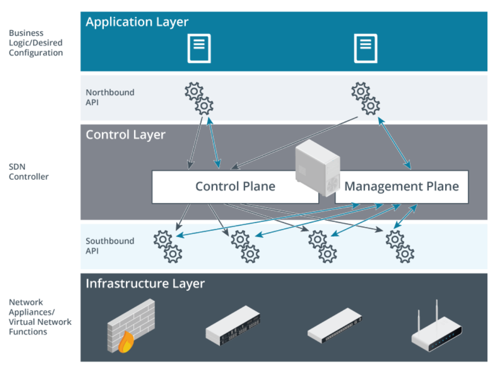
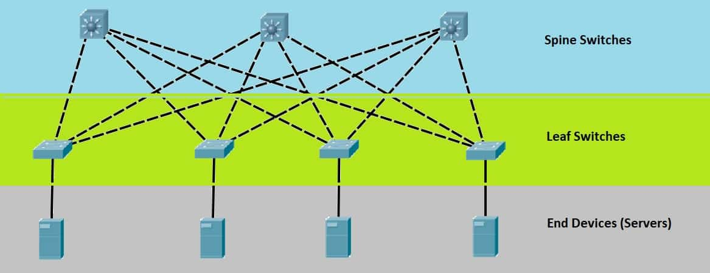
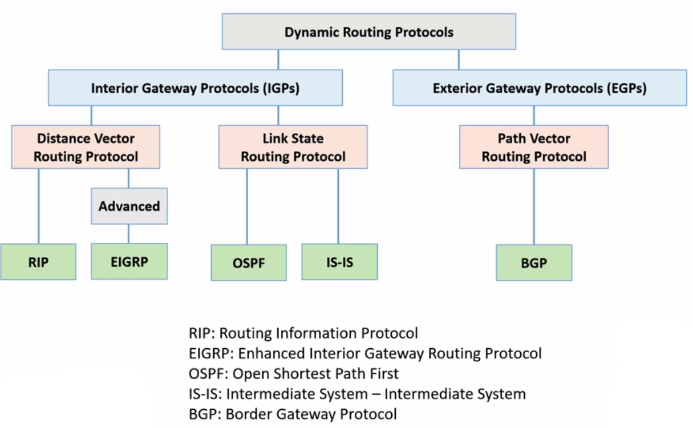

# CompTIA_Network+ N10-008_Guide

- 1.0 Networking Fundamentals 24%
- 2.0 Network Implementations 19%
- 3.0 Network Operations 16%
- 4.0 Network Security 19%
- 5.0 Network Troubleshooting 22%
- 720/900=80 // 720 minimum score.

- **Tips**
  - https://www.reddit.com/r/WGU/comments/w7vhpm/networks_c480network_n101008_passed_first_attempt/
  - https://github.com/PacktPublishing/CompTIA-Network-Cert-N10-007-Full-Course-and-Practice-Exam
  - https://packetlife.net/library/cheat-sheets/
  - https://ankiweb.net/shared/info/1542354670
  - https://www.javatpoint.com/cloud-computing
  - https://www.javatpoint.com/computer-network-tutorial
- **practice exams**
  - https://wgu.udemy.com/course/comptia-network-008-exams/
  - https://wgu.udemy.com/course/total-comptia-network-n10-008-3-practice-tests-270-qs/

<!-- # 1.0 Networking Fundamentals 24% -->

<!-- ## 1.1 Compare and contrast the Open Systems Interconnection (OSI) model layers and encapsulation concepts -->

## 1.1 Compare and contrast the Open Systems Interconnection (OSI) model layers and encapsulation concepts.

- **OSI model**
  - Layer 1 – Physical
  - Layer 2 – Data link
  - Layer 3 – Network
  - Layer 4 – Transport
  - Layer 5 – Session
  - Layer 6 – Presentation
  - Layer 7 – Application
- **Data encapsulation and decapsulation within the OSI model context**
- **Ethernet header**
- **Internet Protocol (IP) header**
- **Transmission Control Protocol (TCP)/User Datagram Protocol (UDP) headers**
- **TCP flags**
- **Payload**
- **Maximum transmission unit (MTU)**

%

- **OSI Model**

| Number | Layer        | Description                                                                      |
| ------ | ------------ | -------------------------------------------------------------------------------- |
| 7      | Application  | Http, DNS, FTP, software apps. What you see/interact with.                       |
| 6      | Presentation | (de)(en)cryption(TLS). (de)(en)code. ex.. jpg, mp4...                            |
| 5      | Session      | Establish,Manage,Terminate. (Request, Response, Auth, VPN)                       |
| 4      | Transport    | Segment/reassemble data. Host-to-Host. Port. Reliable data delivery (TCP/UDP).   |
| 3      | Network      | Packet(datagram). Router, hop-to-hop. layer3 switch. icmp. Logical IP Addressing |
| 2      | Data Link    | Frame. Node-to-Node(MAC). Error detection. switch(WAP), bridge, NIC.             |
| 1      | Physical     | Bit. hub, repeater, modem, cabling/wifi(Bounded/unbounded media).                |

1. physical: transceiver, repeater, hub, media converter, modem.
   1. transceiver: part of the NIC that sends/receives signals.
   2. repeater: boost signal. fiber optical-electrical-optical (OEO) repeater.
   3. media converter: converts one media type to another. ex.. fiber to ethernet.
   4. modem: analog to digital convertor. ex.. cable coax(analog) to ethernet(digital).
   5. Physical topology: larger networks are divided into **segments**. segment is where all nodes share the same media.
   6. physical interface: cable specs. radio transceiver specs.
   7. Signaling: transmit/receiving encoded data over the network medium. timing synchronization. modulation schemes.
   8. Bounded media refers to the fact that some form of shield, cladding, and/or insulation is employed to bind the signal within the core medium.
2. data link: transfer data between 'logical segment'(data is sent using hardware addressing(MAC)).
   1. bridge: legacy. joins physical network segments. each port is a network interface(NIC). separated collision domains with Hubs. replaced by switches. Radio/Microwaves are unbounded.
   2. Extended Unique Identifier (EUI-48, EUI-64). Similar to MAC address.
3. network:
   1. **datagram**: generic term that is often used in describing protocols that function at higher levels of the OSI model. network level and up(layer 3,4,5,6,7).
4. transport: **Post Office layer**. Ports. each segment is tagged with the port number.
   1. advanced firewalls(IDS), layer 3 switches(as load balancers).
   2. allows session multiplexing
5. session:
6. presentation
7. application

- **Data encapsulation and decapsulation within the OSI model context**
  - 
  - **Encapsulation**: how data messages should be packaged for transmission. each node encapsulates and passes down to next level.
  - **PDU**
    - At each level (except the physical layer), the sending node adds a header to the data payload, forming a “chunk” of data called a protocol data unit (PDU).
- **Ethernet header**
  - Ethernet header: layer 2. Frame header and frame trailer (MAC address).
  - EtherType value of 1500 or less is length. Greater than 1536 means ipv4/6.
    - ipv4=0x800 (2048 in decimal)
    - ipv6=0x86DD (34525 in decimal)
  - CRC (Cyclic Redundancy Check)

| Name                      | Description                              | Length            |
| ------------------------- | ---------------------------------------- | ----------------- |
| Preamble                  | sync device clocks                       | 7 bytes (56 bits) |
| SFD Start Frame Delimiter | where data actually starts               | 1 bytes (8 bits)  |
| Destination MAC           | Destination MAC                          | 6 bytes (48 bits) |
| Source MAC                | Source MAC                               | 6 bytes (48 bits) |
| EtherType                 | Layer 3 protocol (ipv4 / ipv6) or length | 2 bytes (16 bits) |
| payload                   | encapsulated layer 3,4,5,6,7 data        | 46-1500 bytes     |
| FCS Frame Check Sequence  | (CRC algorithm) check corrupted data     | 4 bytes (32 bits) |

- **Internet Protocol (IP) header**

| Name            | Bits | Bit Range | Description                                                 |
| --------------- | ---- | --------- | ----------------------------------------------------------- |
| Version         | 4    | 0-3       | ipv4 bit 0100 or ipv6 0110                                  |
| Header Length   | 4    | 4-7       | 'Options' field is variable, Internet Header Length x 4.    |
| DSCP            | 6    | 8-13      | QoS. Prioritize Voice/Video Packets                         |
| ECN             | 2    | 14-15     | Explicit Congestion Notification.                           |
| Total Length    | 16   | 16-31     | Total Length of Packet including layer 4 segment in bytes.  |
| Identification  | 16   | 32-47     | if packet to large, this identifies fragment for reassembly |
| Flags           | 3    | 48-50     | control/identify fragments                                  |
| Fragment Offset | 13   | 51-63     | position of unfragmented packet within the original packet  |
| Time to Live    | 8    | 64-71     | Stops Layer 3 packet storms. drops packet at TTL 0          |
| Protocol        | 8    | 72-79     | protocol of layer 4 PDU. TCP/UDP/ICMP/OSPF/EIGRP/GRE...     |
| Header Checksum | 16   | 80-95     | check for errors in ipv4.                                   |
| Source IP Add   | 32   | 96-127    | source ip address                                           |
| Dst IP Add      | 32   | 128-159   | dst ip address                                              |
| Option          | 320  | 160-287   | optional. 0-320 bits. IHL greater than 5, options exist     |
| Data(payload)   |      |           |                                                             |

- **Transmission Control Protocol (TCP)/User Datagram Protocol (UDP) headers**

| TCP Header             | Explanation                            |
| :--------------------- | :------------------------------------- |
| Source port            | sending host port                      |
| Destination port       | destination host port                  |
| Sequence number        | last byte in segment                   |
| Acknowledgement number | next segment expected                  |
| Flags                  | SYN, SYN-ACK, ACK, FIN                 |
| Window                 | total data host can receive before ACK |
| Checksum               | Payload hash                           |
| Urgent Pointer         | end of data in segment                 |
| Options                | Params, Max segment size               |

| UDP Header       | Explanation                    |
| :--------------- | :----------------------------- |
| Source port      | UDP port of sending host.      |
| Destination port | UDP port of destination host.  |
| Message length   | Size of the UDP packet.        |
| Checksum         | Ensures validity of the packet |

- **TCP flags(layer 4. 6 bit)**
  - SYN: synchronize three way handshake
  - URG: precedence over other data
  - ACK: acknowledge packet arrived
  - PSH: push data to application without buffering
  - FIN: last packet from sender
  - RST: reset connection
- **Payload**
  - every layers payload is the previous encapsulated layer.
- **Maximum transmission unit (MTU)**
  - size of data to send through network.
  - default is 1500 bytes. (includes IP header, TCP header, Application data).
  <!-- - windows: ping -f -l 1472 8.8.8.8 // -f: don't fragment. -l: size bytes=1500. linux: ping -D -s 1472 8.8.8.8 -->

## 1.2 Explain the characteristics of network topologies and network types

- **Mesh**
- **Star/hub-and-spoke**
- **Bus**
- **Ring**
- **Hybrid**
- **Network types and characteristics**
  - Peer-to-peer
  - Client-server
  - Local area network (LAN)
  - Metropolitan area network (MAN)
  - Wide area network (WAN)
  - Wireless local area network (WLAN)
  - Personal area network (PAN)
  - Campus area network (CAN)
  - Storage area network (SAN)
  - Software-defined wide area network (SDWAN)
  - Multiprotocol label switching (MPLS)
  - Multipoint generic routing encapsulation (mGRE)
- **Service-related entry point**
  - Demarcation point
  - Smartjack
- **Virtual network concepts**
  - vSwitch
  - Virtual network interface card (vNIC)
  - Network function virtualization (NFV)
  - Hypervisor
- **Provider links**
  - Satellite
  - Digital subscriber line (DSL)
  - Cable
  - Leased line
  - Metro-optical

%

- **Mesh**
  - all nodes connect to each other. No single point of failure in network.
  - redundancy, load balancing, fault-tolerance.
  - WANs, wifi, IoT use this topology.
- **Star/hub-and-spoke**
  - Star topology: most common. hub or switch in center. LAN only.
  - Hub-and-Spoke: same as Star, but distance is over WAN.
- **Bus**
  - single line of devices connected together by one shared network cable terminated on each end.
  - coaxial cable, Thinnet.
  - not fault tolerant.
- **Ring**
  - Each node connects to exactly two other nodes. Each device will have a 'ring in' and 'ring out' port.
  - Token passed to each node enables talking on network.
  - MAN's, WAN's use them.
    - dual-rings, built-in fault tolerance.
      - If line is severed, the two devices on each side of sever will 'see' it and send communication back the other direction till it reaches destination.
- **Hybrid**
  - more than one topology combined together.
- **Network types and characteristics**
  - **Peer-to-peer (P2P)**
    - two or more PCs are connected and share resources without going through a separate server.
    - no designated client-server. Both act as client-server. residential networks.
    - Bitcoin, Tor, windows 'workgroup'.
    - easy to deploy, low cost.
    - difficult: to secure, administer.
  - **Client-server**
    - distinct client, server. client needs data. server sends data. Business and enterprise networks.
    - Pros: performance, administration
    - Cons: cost, complexity
  - **Local area network (LAN)**
    - a series of computers linked together to form a network with private addressing.
  - **Metropolitan area network (MAN)**
    - Metro Ethernet(City). Larger than single building LAN, but located within a single geographic area.
    - smaller than a WAN.
  - **Wide area network (WAN)**
    - remote networks(office, data center, cloud) to form one logical network. Largest of networks.
  - **Wireless local area network (WLAN)**
    - 802.11. series of computers linked together to form a network with private addressing based on radio transmission rather than wired connections.
  - **Personal area network (PAN)**
    - connects electronic devices within a users immediate area. bluetooth, IR, NFC. automobile, headphones.
  - **Campus area network (CAN)**
    - multiple buildings, fiber. typically used within educational or corporate campus. Smaller than MAN.
  - **Storage area network (SAN)**
    - NAS: Network Attached Storage. file-level access. must change whole file to make changes.
    - SAN: block-level access. large file can just change one block of data. Efficient read write.
      - similar to harddrive on PC.
      - dedicated network: high bandwidth needed.

| Network | Max Distance                     |
| ------- | -------------------------------- |
| PAN     | 10'                              |
| LAN     | 300'                             |
| CAN     | 2-3 miles (campus)               |
| MAN     | 25 miles (city)                  |
| WAN     | 3000-4000 miles (no limits)      |
| SAN     | pools of storage used by servers |

- **Software-defined wide area network (SDWAN)**
  - originally had data center, all routes to data went here.
  - virtual WAN. moving apps, database to cloud and having connections to them and your data center.
  - SD-WAN replaces hub and spoke type designs with more efficient, but still secure with automation and orchestration(software-defined networking (SDN)). Each site has a SD-WAN capable router, gateway, or VPN app.
- **Multiprotocol label switching (MPLS)**
  - WAN providers offer MPLS to establish private links(VPN) with guaranteed service levels.
  - Label Edge Router (LER): connects network to internet. Shim's/Pop's a label in header. At each edge.
  - Label Switch Router (LSR): reads header shim and routes packets to next LSR.
  - Label Switch Path (LSP): shim in header tells LSR where packet is going.
- **Generic Routing Encapsulation (GRE)**: encapsulates any type of packet for routing.
  - Tunnel is created between two routers. IPv6 over IPv4 network. packets larger than MTU(1500 bytes) are fragmented.
  - used with IPSec to create a secure Point-to-Point VPN tunnel.
- **Multipoint Generic Routing Encapsulation (mGRE)**
  - Tunnel is created between more than two routers. Point-to-Multipoint.
  - Used extensively for Dynamic Multipoint VPN (DMVPN).
    - DMVPN creates dynamic links between routers without having to be pre-configured.
- **Service-related entry point**
  - **Demarcation point (demarc)**
    - point where internet company(PSTN) ends and customer private network begins(house, business).
    - if problem on CPE (customer premises equipment) you are responsible.
  - **Smartjack**
    - NIU Network interface unit: specialized equipment at the demarc point that internet provider can remote troubleshoot network problems. built-in diagnostics.
- **Virtual network concepts**
  - **vSwitch**
    - Software-based network switches that operate within virtualized environments.
    - Enable communication between virtual machines and between virtual machines and the physical network.
    - Provide features such as VLAN support, traffic filtering, and QoS.
  - **Virtual network interface card (vNIC)**
    - Software-based network interface cards within virtual machines.
    - Allow virtual machines to connect to virtual networks and communicate with other virtual machines and physical devices.
    - Can be configured with specific network settings and policies.
  - **Network function virtualization (NFV)**
    - virtualizes physical network hardware appliances into software-based solutions running on standard servers and other virtualization infrastructure.
    - Virtual Network Function (VNF): instance of each virtual appliance.
    - NFV infrastructure: hypervisor manages the creation of each VNF on servers in data centers at edge or cloud.
    - Management and orchestration (MANO): NFV lifecycle management and manages the underlying compute, storage, and network resources.
  - **Hypervisor**: creates the virtual hardware for devices.
    - software to create the illusion of physical hardware.
    - manages all physical resources: memory, processor, storage.
    - Must have Hypervisor capable processor to support virtualization.
    - maintains a network connection to the many virtual machines. commonly used on servers.
    - **Type 1**: (bare metal hypervisor). Installed directly on the physical hardware.
      - Hyper-V(Microsoft, Windows 10+), VMWare ESXi(server environment), Citrix's XEN Server, KVM(Linux open source).
      - Manages virtual machines and resources without relying on an underlying operating system.
      - complete access to hardware (no OS to go through).
    - **Type 2**: (hosted). Installed as an app on top of an existing operating system.
      - Requires the host operating system to manage hardware resources. Commonly used on personal computers.
      - Runs virtual machines as processes within the host operating system.
      - Microsoft Virtual, VMware Workstation, Oracle Virtual Box, and MAC Parallels Workstation.
      - Security: VM Escape. Attacker tries to get control of Host OS.
- **Provider links**
  - **Satellite**
    - non terrestrial communication
    - line of sight. problems with rain, snow.
    - **low earth orbit**: lower latency(20-30ms), less coverage = more satellites needed.
      - Lower to earth (340 miles). Typically will have a motor to turn dish to jump to next satellite.
    - **geosynchronous**: high orbit, higher latency, less satellites (22,000 miles).
      - latency 250ms each way. slow due to latency (distance from dish to satellite). Expensive.
      - This is an issue for real-time applications, such as videoconferencing, VoIP, and multiplayer gaming.
  - **Digital subscriber line (DSL)**
    - copper wire. DSL connection will have a port for a telephone-type cable, usually an RJ-11 connector.
    - **ADSL (Asymmetric DSL)**: different speed on the download (8Mbps) vs upload(1.544Mbps).
  - **Cable**
    - broadband. coax cable. Type 'F' screw on connector.
    - Wire: RG-6(new, inside home), RG-11(cable company to house), RG-59(old. inside home).
    - modem: DOCSIS (data over cable service interface specification): encodes high-bandwidth signal over coax.
  - **Leased line**
    - Unlike broadband or DSL connections, which are shared with other users, a leased line is exclusively reserved for the organization's use. dedicated point-to-point connection between two locations. data, voice, internet.
    - Symmetrical bandwidth: upload/download speed same.
    - Guaranteed Reliability: SLA's provide uptime guarantees.
    - scalability: scale to bandwidth needed.
  - **Metro-optical**
    - high-speed fiber communication network infrastructure that operates within a metropolitan or city area.
    - low cost lan-to-lan connectivity in a metro area.
    - **High Bandwidth**: Dense Wavelength Division Multiplexing (DWDM) and Coarse Wavelength Division Multiplexing (CWDM) to carry multiple channels or wavelengths of data simultaneously over a single optical fiber strand.

## 1.3 Summarize the types of cables and connectors and explain which is the appropriate type for a solution

- **Copper**
  - Twisted pair
    - Cat 5
    - Cat 5e
    - Cat 6
    - Cat 6a
    - Cat 7
    - Cat 8
  - Coaxial/RG-6
  - Twinaxial
  - **Termination standards**
    - TIA/EIA-568A
    - TIA/EIA-568B
- **Fiber**
  - Single-mode
  - Multimode
- **Connector types**
  - **Lucent connector (LC), straight tip (ST), subscriber connector (SC), mechanical transfer (MT), registered jack (RJ)**
    - Angled physical contact (APC)
    - Ultra-physical contact (UPC)
  - RJ11
  - RJ45
  - F-type connector
  - Transceivers/media converters
  - **Transceiver type**
    - Small form-factor pluggable (SFP)
    - Enhanced form-factor pluggable (SFP+)
    - Quad small form-factor pluggable (QSFP)
    - Enhanced quad small form-factor pluggable (QSFP+)
- **Cable management**
  - Patch panel/patch bay
  - Fiber distribution panel
  - Punchdown block
    - 66
    - 110
    - Krone
    - Bix
- **Ethernet standards**
  - **Copper**
    - 10BASE-T
    - 100BASE-TX
    - 1000BASE-T
    - 10GBASE-T
    - 40GBASE-T
  - **Fiber**
    - 100BASE-FX
    - 100BASE-SX
    - 1000BASE-SX
    - 1000BASE-LX
    - 10GBASE-SR
    - 10GBASE-LR
    - Coarse wavelength division multiplexing (CWDM)
    - Dense wavelength division multiplexing (DWDM)
    - Bidirectional wavelength division multiplexing (WDM)

%

- **Copper**
  - **Twisted pair**
    - Tx+ Tx- are twisted together to cancel noise.

| Cat/Class       | Cable Type              | Network Application | Max Distance | Frequency | Connector    |
| :-------------- | :---------------------- | :------------------ | :----------- | :-------- | :----------- |
| 5 (obsolete)    | UTP                     | 100BASE-TX          | 100m         | 100 MHz   | RJ-45        |
| 5e (Class D)    | UTP or F/UTP            | 1000BASE-T          | 100m         | 100 MHz   | RJ-45        |
| 6 (Class E)     | UTP, (F/UTP, or U/FTP ) | 10GBASE-T           | 55m (100m)   | 250 MHz   | RJ-45        |
| 6a (Class Ea)   | S/FTP                   | 10GBASE-T           | 100m         | 500 MHz   | RJ-45        |
| 7 (Class F)     | S/FTP or F/FTP          | 10GBASE-T           | 100m         | 600 MHz   | GG45 or TERA |
| 8/8.1 (Class I) | U/FTP or F/UTP          | 40GBASE-T           | 30m          | 2000 MHz  | RJ-45        |
| 8.2 (Class II)  | F/FTP or S/FTP          | 40GBASE-T           | 30m          | 2000 MHz  | GG45 or TERA |

- **Coaxial/RG-6**
  - coax. single conductor. shielded by braided cable. type f connector. replaced RG-59.
- **Twinaxial**: short range high speed(10G). Two conductors in wire. Typically used in SAN.
- **Termination standards**
  - **TIA/EIA-568A**
    - T-568A: 1:Green/White, 2:Green, 3:Orange/White, 4:Blue, 5:Blue/White, 6:Orange, 7:Brown/White, 8:Brown
  - **TIA/EIA-568B**
    - T-568B: 1:Orange/White, 2:Orange, 3:Green/White, 4:Blue, 5:BlueS, 6:Green, 7:Brown/White, 8:Brown.
- **Fiber**
  - immune to emf and radio frequency.
  - led or laser.
  - **Single-mode**
  - **Multi-mode**

| SMF yellow                           | MMF orange                           |
| ------------------------------------ | ------------------------------------ |
| Smaller core (10 micron)             | Larger core (50-100 microns)         |
| Longer distance (100km)              | Shorter distance (2 km or less)      |
| Longer wavelength (higher bandwidth) | Shorter wavelength (lower bandwidth) |
| Laser                                | LED                                  |
| More Expensive                       | Less Expensive                       |

- **Connector types**
  - **Lucent connector (LC)**: duplex push-pull. similar to SC, but smaller form factor.
  - **straight tip (ST)**: no snap-in design. twist connector. used in MMF.
  - **subscriber connector (SC)**: push-pull connector. square block connector. SMF,MMF.
  - **mechanical transfer registered jack (MT-RJ)**: snap-in duplex connector. MMF. Transmit/Receive single connector.
  - **Angled physical contact (APC)**
    - designed to reduce light reflecting back. better than UPC. returned light is angled up out of connector.
  - **Ultra-physical contact (UPC)**
    - straight connector. small amount of light is reflected back.
  - **PC**: Physical Contact. tip polished to curve slightly and fit together better.
  - **RJ11**
    - 6 pin only 2 conductors (6P2C).
    - RJ14 uses 6P4C.
  - **RJ45**
    - 8P8C
  - **F-type connector**
    - Coax cable. DOCSIS standard. screw on.
  - **Transceivers/media converters**
    - Layer 1. Convert light(fiber) to digital ethernet.
  - **Transceiver type**
    - **Small form-factor pluggable (SFP)**
      - same as media converter, just smaller
      - BiDi (bi-directional transceiver. full duplex).
      - 1G
    - **Enhanced form-factor pluggable (SFP+)**
      - 16G
    - **Quad small form-factor pluggable (QSFP)**
      - 4 times the fiber connections. 4 x 1G
    - **Enhanced quad small form-factor pluggable (QSFP+)**
      - 4 x 10G. Their is also BiDi for these.
- **Cable management**
  - **Patch panel/patch bay**
    - office RJ-45 plug to data closet patch panel. Punchdown block on one side/RJ45 on the other. to switch.
    - allows incoming and outgoing connections to be reconfigured by changing the patch cable connections, which is much simpler than reterminating punchdown blocks.
  - **Fiber distribution panel**
    - patch panel for fiber. each connection there is a 'cost'.
  - **Punchdown block**
    - 66: early type. voice. obsolete. pre-Cat 5 cable.
    - 110: replaced 66. At&t.
    - Krone: europe. same as 110.
    - Bix: GigaBIX better than cat6. looks similar to 110.
    - patch panel: most common. IDCs(insulation-displacement connections) one side, other side RJ-45.
- **Ethernet standards**
  - baseband: single frequency. ethernet.
  - broadband: many frequencies.
  - **Copper**
    - 10BASE-T: 802.3 Cat 3
    - 100BASE-TX: Cat 5
    - 1000BASE-T: Cat 5e (enhanced)
    - 10GBASE-T: Cat 6/6a 55m/100m
    - 40GBASE-T: Cat 8
- **legacy STP**: hardest to install. special bonding for wire shielding to ground manually. Connectors have to be shielded.
- **U/FTP**: unshielded/foil around all twisted pairs.
- **F/UTP**: foil/unshielded around all wire.
- **S/FTP**: braided shielding around wires/foil around each individual pair.
- **ScTP**: screened twisted pair. thin outer shield around all pairs.
- **Fiber**

| Specification                  | Optics | Fiber   | Max Distance               |
| :----------------------------- | :----- | ------- | :------------------------- |
| 100BASE-FX (MMF, FDDI)         | laser  | MMF     | 400m half-duplex, 2km full |
| 100BASE-SX (Short Wavelength)  | led    | MMF     | 300m                       |
| 1000BASE-SX (Short Wavelength) | laser  | MMF     | 275m                       |
| 1000BASE-LX (Long Wavelength)  | laser  | MMF,SMF | 550m to 5km                |
| 10GBASE-SR (Short Range)       |        | MMF     | 33m to 400m                |
| 10GBASE-LR (Long Range)        |        | SMF     | 10 km(SMF)                 |

- **Bidirectional wavelength division multiplexing (BiDi WDM)**
  - BiDi. bi-directional communication on same strand of fiber. full duplex.
  - BiDi transceivers must be installed in opposite pairs, so one end of fiber the transceiver would use 1490 nm to Tx(transmit), the other end transceiver will use 1490nm to Rx(receive).
  - sends different wavelengths of light(different colors).
  - **Coarse wavelength division multiplexing (CWDM)**
    - 16 wavelengths.
  - **Dense wavelength division multiplexing (DWDM)**
    - up to 160 wavelengths. 160 wavelengths => 1.6 Tbps.
    - more expensive precision lasers. Longer distance than CWDN.

## 1.4 Given a scenario, configure a subnet and use appropriate IP addressing schemes

- **Public vs. private**
  - **RFC1918**
  - **Network address translation (NAT)**
  - **Port address translation (PAT)**
- **IPv4 vs. IPv6**
  - **Automatic Private IP Addressing (APIPA)**
  - **Extended unique identifier (EUI-64)**
  - **Multicast**
  - **Unicast**
  - **Anycast**
  - **Broadcast**
  - **Link local**
  - **Loopback**
  - **Default gateway**
- **IPv4 subnetting**
  - **Classless (variable-length subnet mask)**
  - **Classful**
    - A
    - B
    - C
    - D
    - E: reserved address.
  - Classless Inter-Domain Routing (CIDR) notation
- **IPv6 concepts**
  - Tunneling
  - Dual stack
  - Shorthand notation
  - Router advertisement
  - Neighbor Solicitation
  - Stateless address autoconfiguration (SLAAC)
- **Virtual IP (VIP)**
- **Subinterfaces**

%

- **Public vs. private**
  - **RFC1918**
    - IANA(internet assinged numbers authority) provides address blocks to RIR (Regional Internet Registries).
    - RIR assigns smaller blocks to ISP(internet service providers).
  - Public
    - routable over the internet. assigned by ISP.
  - Private addresses are defined in **RFC 1918** and sometimes referred to as RFC 1918 address space.
    - RFC 1918 - Private Address are not routable on the public internet.
    - any organization can use private routing without asking permission.
    - 10.x.x.x/8
    - 172.16.x.x/12 (172.16.x.x - 172.31.x.x)
    - 192.168.x.x/16
    - 169.254.x.x/16 (APIPA). First 256 and last 256 address are reserved.
  - **Network address translation (NAT)**
    - NAT is 1:1 mapping between private IPv4 and public IPv4 addresses.
    - NAT is configured on a border device, such as a router, proxy server, or firewall.
  - **Port address translation (PAT)**
    - map multiple private IP addresses to a single public IP address by using different port numbers.
    - PAT is configured on a border device, such as a router, proxy server, or firewall.
- **IPv4 vs. IPv6**
  - **Automatic Private IP Addressing (APIPA)**
    - if DHCP server not found, OS will assign itself an IP. (169.254.1.0-169.254.254.255)
    - first and last 256 address reserved by IETF(Internet Engineering Task Force).
    - can only communicate on local network.
    - computer sends ARP, if no response, computer picks that APIPA IP.
  - **Extended unique identifier (EUI-64)**
    - converts 48bit MAC address into 64bit EUI-64. This method is automatically configure IPv6 host addresses.
      1. MAC address(48bit).
      2. first 24 bits: OUI (Organizationally Unique Identifier). Split here.
      3. `FFFE` are added to middle of MAC(after first 24 bits).
      4. last 24 bits: NIC (Network Interface Card). Added after `FFFE`.
      5. First byte of MAC is converted to binary, 7 bit is flipped.
         1. MAC: `00:60:8C:12:3A:BC` = EUI-64: `0260:8CFF:FE12:3ABC`
         2. This becomes link-local address: `FE80::0260:8CFF:FE12:3ABC`. `FE80::`(64bit) is prefix for link-local.
  - **Multicast**
    - IPv4 and IPv6 only devices must subscribe.
    - IPv4 has reserved thew class D **224.0.0.0 to 239.255.255.255** addresses as a multicast range.
  - **Unicast**
    - one-to-one. one device to another.
  - **Anycast**
    - assigning same ip to multiple servers or network nodes in different geographic locations. These servers provide the same service.
    - packets delivered to closest interface. DNS, CDN servers are setup this way.
  - **Broadcast**
    - one-to-all. broadcast domain. does not leave router. ARP request.
  - **Link local**
    - same as APIPA. private ip address self assigned when DHCP server not found.
  - **Loopback**
    - 127.0.0.1-127.255.255.254
  - **Default gateway**
    - IPv4 protocol compares the source and destination address in each packet against the netmask(255.255.255.0).
    - If masked portion does not match, packet must be routed to another network through the 'default gateway'.
- **IPv4 subnetting**
  - **Classless (variable-length subnet mask)**
    - solved the Class-based network. allows subnetting.
    - allows network administrators to break down an IP address space into subnets of various sizes.

| RFC 1918 Private (Non-Routable) | RANGE                            |
| ------------------------------- | -------------------------------- |
| 0                               | 0.0.0.0 - 0.255.255.255          |
| Loopback                        | 127.0.0.0 - 127.255.255          |
| 10.x.x.x                        | 10.0.0.0 - 10.255.255.255/8      |
| 172.16.x.x                      | 172.16.0.0 - 172.31.255.255/12   |
| 192.168.x.x                     | 192.168.0.0 - 192.168.255.255/16 |
| 169.254.x.x (APIPA)             | 169.254.1.0 - 169.254.254.255/16 |

| CLASS   | STARTING BITS | RANGE                          |
| ------- | ------------- | ------------------------------ |
| Class A | 0             | 1.0.0.0 - 126.255.255.255/8    |
| Class B | 1 0           | 128.0.0.0 - 191.255.255.255/16 |
| Class C | 1 1 0         | 192.0.0.0 - 223.255.255.255/24 |
| Class D | 1 1 1 0       | 224.0.0.0 - 239.255.255.255    |
| Class E | 1 1 1 1       | 240.0.0.0 - 255.255.255.255    |

- **Professor Messer 7 second subnetting**

| 1   | 2   | 3   | 4   | decimal | host-2 | networks |
| --- | --- | --- | --- | ------- | ------ | -------- |
| /1  | /9  | /17 | /25 | 128     | 128    | 2        |
| /2  | /10 | /18 | /26 | 192     | 64     | 4        |
| /3  | /11 | /19 | /27 | 224     | 32     | 8        |
| /4  | /12 | /20 | /28 | 240     | 16     | 16       |
| /5  | /13 | /21 | /29 | 248     | 8      | 32       |
| /6  | /14 | /22 | /30 | 252     | 4      | 64       |
| /7  | /15 | /23 | /31 | 254     | 2      | 128      |
| /8  | /16 | /24 | /32 | 255     | 1      | 256      |

| host | multiples of host up to 256                                                                                      |
| ---- | ---------------------------------------------------------------------------------------------------------------- |
| 128  | 0, 128                                                                                                           |
| 64   | 0, 64, 128, 192                                                                                                  |
| 32   | 0, 32, 64, 96, 128, 160, 192, 224                                                                                |
| 16   | 0, 16, 32, 48, 64, 80, 96, 112, 128, 144, 160, 176, 192, 208, 224, 240                                           |
| 8    | 0,8,16,24,32,40,48,56,64,72,80,88,96,104,112,120,128,136,144,152,160,168,176,184,192,200,208,216,224,232,240,248 |

|           | octet | octet | octet | octet | notes                   |
| --------- | ----- | ----- | ----- | ----- | ----------------------- |
| address   | 192   | 168   | 0     | 123   | /29 mask.               |
| mask      | 255   | 255   | 255   | 248   | 255 bring down octet    |
| network   | 192   | 168   | 0     | 120   | if zero bring down zero |
| broadcast | 192   | 168   | 0     | 127   | if zero bring down 255. |

- **Classful**
  - A: 0-127
  - B: 128-191
  - C: 192-223
  - D: multicast 224-239
  - E: reserved address. 240-255
- **Classless Inter-Domain Routing (CIDR) notation**
  - CIDR was introduced 1993 to slow the usage of IPv4 address exhausting.
  - CIDR addresses use variable length subnet masking (VLSM) to alter the ratio between the network and host address bits in an IP address.
- **IPv6 concepts**
  - 128 bit address. 16 bits as hex, in 8 groups.
  - **Tunneling**
    - 6to4. tunnel IPv6 over the IPv4 network.
    - 4to6. tunnel IPv4 over the IPv6 network. GRE(Generic Routing Encapsulation) protocol.
  - **Dual stack**
    - device can use IPv4 and IPv6. Each protocol has separate routing table.
  - **Shorthand notation**
    - group of zeros: '::' // can only be one double colon.
    - leading zeros optional.
  - **Router advertisement**
    - Client sends RS (router solicitation) and Router responds with RA (router advertisement). sent out as multicast.
    - router can also send unsolicited RA.
  - **Neighbor Solicitation (NS)**
    - no broadcast in IPv6. NS sends multicast. All IPv6 devices will answer back NA (neighbor advertisement) with there MAC address.
  - **Stateless address auto configuration (SLAAC)**: host automatically assigns itself a IPv6 link-local\*\* address and solicits routing and subnet information from network router.
    1. `FE80::` + `EUI-64` (Extended Unique Identifier) becomes the 128 bit link-local address.
    2. sends out an **DAD (duplicate address detection)** as ICMPv6 via Network Discovery Protocol – Network Solicitation (NDP NS). makes sure no duplicate ip on network.
    3. After IPv6 link-local is confirmed as unique. RS(Router solicitation) is sent out asking for router to announce itself with a RA(Router Advertisement).
    4. The RA will include the Global routable prefix. The device will take `first global 64bit + EUI-64` for global address.
    5. This process does not provide DNS server IP. DHCPv6 is used for this.
- **Virtual IP (VIP)**
  - logical ip address assigned to virtual machines.
  - router use this for redundancy, high availability, and fault tolerant.
    - Hot Standby Router Protocol (HSRP) or Virtual Router Redundancy Protocol (VRRP).
- **Subinterfaces**
  - virtual link between VLAN's.
  - Each subinterface is configured with a specific VLAN ID.
  - VLAN traffic is routed from one VLAN subinterface to the destination VLAN subinterface.
  - Layer 3 switches are optimized for VLAN routing.

## 1.5 Explain common ports and protocols, their application, and encrypted alternatives

| Protocols                                                               | Ports |
| :---------------------------------------------------------------------- | ----- |
| File Transfer Protocol (FTP)                                            |       |
| Secure Shell (SSH)                                                      |       |
| Secure File Transfer Protocol (SFTP)                                    |       |
| Telnet                                                                  |       |
| Simple Mail Transfer Protocol (SMTP)                                    |       |
| Domain Name System (DNS)                                                |       |
| Dynamic Host Configuration Protocol (DHCP)                              |       |
| Trivial File Transfer Protocol (TFTP)                                   |       |
| Hypertext Transfer Protocol (HTTP)                                      |       |
| Post Office Protocol v3 (POP3)                                          |       |
| Network Time Protocol (NTP)                                             |       |
| Internet Message Access Protocol (IMAP)                                 |       |
| Simple Network Management Protocol (SNMP)                               |       |
| Lightweight Directory Access Protocol (LDAP)                            |       |
| Hypertext Transfer Protocol Secure (HTTPS) [Secure Sockets Layer (SSL)] |       |
| HTTPS [Transport Layer Security (TLS)]                                  |       |
| Server Message Block (SMB)                                              |       |
| Syslog                                                                  |       |
| SMTP TLS                                                                |       |
| Lightweight Directory Access Protocol (over SSL) (LDAPS)                |       |
| IMAP over SSL                                                           |       |
| POP3 over SSL                                                           |       |
| Structured Query Language (SQL) Server                                  |       |
| SQLnet                                                                  |       |
| MySQL                                                                   |       |
| Remote Desktop Protocol (RDP)                                           |       |
| Session Initiation Protocol (SIP)                                       |       |

- **IP protocol types**
  - **Internet Control Message Protocol (ICMP)**
  - **TCP**
  - **UDP**
  - **Generic Routing Encapsulation (GRE)**
  - **Internet Protocol Security (IPSec)**
    - Authentication Header (AH)/Encapsulating Security Payload (ESP)
- **Connectionless vs. connection-oriented**

%

| Port      | Name                                                                        | Encryption | TCP/UDP |
| --------- | --------------------------------------------------------------------------- | ---------- | ------- |
| 20        | `FTP-Data`                                                                  | no         | TCP     |
| 21        | `FTP-Control-Connecting`                                                    | no         | TCP     |
| 22        | `SSH & SFTP` (Secure Shell) & SFTP (Secure File Transfer Protocol)          | yes        | TCP     |
| 23        | `Telnet` check open ports and connectivity                                  | no         | TCP     |
| 25        | `SMTP` (Simple Mail Transfer Protocol) sending/outgoing email               | no         | TCP     |
| 53        | `DNS` (Domain Name Service)                                                 | no         | TCP/UDP |
| 67/68     | `DHCP` Server/Client listens                                                |            | UDP     |
| 69        | `TFTP` (Trivial File Transfer Protocol)                                     |            | UDP     |
| 80        | `HTTP`                                                                      | no         | TCP     |
| 110       | `POP3` (Post Office Protocol) incoming email.                               | no         | TCP     |
| 123       | `NTP` (Network Time Protocol) Time sync on computer                         |            | UDP     |
| 143       | `IMAP` (Internet Mail Application Protocol) incoming email                  | no         | TCP     |
| 161/162   | `SNMP` (simple network management protocol) manage/monitor,polling          |            | UDP     |
| 389       | `LDAP` (AD, Directory, Replication, Authentication, Group Policy, Trusts.)  | no         | TCP     |
| 443       | `HTTPS` SSL(old) TLS(new encryption protocol)                               |            | TCP     |
| 445       | `SMB` (Server Message Block) windows file/printer sharing. CIFS             |            | TCP     |
| 514       | `Syslog`                                                                    |            | UDP     |
| 587       | `SMTP` encrypted outgoing email SSL/TLS (465 was old way, obsolete)         | yes        | TCP     |
| 636       | `LDAP` encrypted                                                            | yes        | TCP     |
| 993       | `IMAP` encrypted incoming email SSL/TLS                                     | yes        | TCP     |
| 995       | `POP3` encrypted incoming email SSL/TLS                                     | yes        | TCP     |
| 1433      | `SQL` Microsoft Structured Query Language                                   |            | TCP     |
| 1521      | `SQLnet` Oracle SQL Net                                                     |            | TCP     |
| 3306      | `MySQL` Open source                                                         |            | TCP     |
| 3389      | `RDP` Remote Desktop Protocol, graphical interface, proprietary microsoft   | RDG y/no   | TCP     |
| 5060/5061 | `SIP` Session Initiation Protocol (VoIP)                                    |            | TCP     |
| 5004/5005 | `RTP/RTCP` (Real Time Protocol/Real Time Control Protocol) Video/Monitoring |            | UDP     |

- **IP protocol types**
  - **Internet Control Message Protocol (ICMP)**
    - another protocol of IP. not used for data transfer. request/reply, send messages.
    - report errors and send messages about the delivery of a packet.
    - ICMP messages are generated under error conditions in most types of unicast traffic, but not for broadcast or multicast packets.
  - **TCP**
    - Transmission Control Protocol. Transport layer 4 to provide connection-oriented, guaranteed communication using acknowledgements to ensure that delivery has occurred.
    - allows mutiplexingg(many applications at same time), flow control.
  - **UDP**
    - User Datagram Protocol. connectionless, nonguaranteed method of communication
    - no acknowledgments or flow control.
  - **Generic Routing Encapsulation (GRE)**
    - encapsulate and route any layer 2 or 3 packet. No encryption.
  - **Internet Protocol Security (IPSec)**
    - open standard. symmetric key. popular with VPN's. encrypts layer 3 payload.
    - secure IPv4 and/or IPv6 communications on local networks and as a remote access protocol.
    - Each host that uses IPSec must be assigned a policy. only peers that can authenticate with each other can connect.
    - ensures: confidentiality(encrypted), integrity(hash checking for modified in transit), and authenticity(identity is established by peers).
    - An **IPSec policy** sets the authentication mechanism and also the protocols and mode for the connection.
      1. Two peers prove identity(authenticity) by using certificates or pre-shared keys.
      2. **IKE Phase 1**: asymmetric key exchange(Diffie-Hellman). slow. both side will have the same DH key. will be kept.
      3. **IKE Phase 2**: agree encryption methods. use DH to creates the symmetric key. fast. can be torn down and re-established quickly.
    - **Policy Based VPN**: rule sets match traffic that should use vpn tunnel.
      - can have multiple tunnel security methods for each type of interesting traffic match.
    - **Route Based VPN**: target match on prefix. (192.168.0.0/24 -> VPN). single tunnel all traffic flows.
    - **AH (Authentication Header)**: performs hash on packet. provides integrity, no encryption. not popular.
      - adds hash to the AH(integrity check value). both sender receiver hash must match.
    - **ESP (Encapsulating Security Payload)**: confidentiality, integrity, authentication. Most Common.
      - encrypts entire layer 3 packet. adds IP Header, Payload(encrypted data), Trailer, ICV.
      - **Transport Mode**: does not encrypt header.
      - **Tunnel Mode**: encrypts header.
- **Connectionless vs. connection-oriented**
  - Two ways to send data: Connection-Oriented and Connectionless Service.
  - **Connection-oriented**: TCP. service involves the creation and termination of the connection for sending the data between two or more devices.
  - **connectionless**: UDP. service does not require establishing any connection and termination process for transferring the data over a network.

## 1.6 Explain the use and purpose of network services

- **DHCP**
  - DHCP Discover
  - DHCP Offer
  - DHCP Request
  - DHCP Acknowledgement
  - **Scope**
    - Exclusion ranges
    - Reservation
    - Dynamic assignment
    - Static assignment
    - Lease time
    - Scope options
    - Available leases
  - **DHCP relay**
  - **IP helper/UDP forwarding**:
- **DNS**
  - **Record types**
    - Address (A vs. AAAA)
    - Canonical name (CNAME)
    - Mail exchange (MX)
    - Start of authority (SOA)
    - Pointer (PTR)
    - Text (TXT)
    - Service (SRV)
    - Name server (NS)
  - **Global hierarchy**
    - Root DNS servers
  - Internal vs. external
  - Zone transfers
  - Authoritative name servers
  - Time to live (TTL)
  - DNS caching
  - Reverse DNS/reverse lookup/forward lookup
  - Recursive lookup/iterative lookup
- **NTP**
  - synchronize devices with master clock.
  - **Stratum**
  - **Clients**
  - **Servers**

%

- **DHCP**
  - automates the assigning: ip, subnet mask, gateway, dns, ntp...
  - **mnemonic: DORA: Discover, Offer, Request, Acknowledge**.
  - **DHCP Discover**: new device sends 0.0.0.0:68(udp) to 255.255.255.255:67(udp) -all nodes gets broadcast message.
  - **DHCP Offer**: DHCP responds will this address work?: 10.10.10.99:67(udp) to 255.255.255.255:68(udp) -all nodes.
  - **DHCP Request**: new client responds look good: 0.0.0.0:68(udp) to 255.255.255.255:67(udp) -all nodes
  - **DHCP Acknowledgement**: DHCP says ok: 10.10.10.99:67(udp) to 255.255.255.255:68(udp) -all nodes
  - **Scope**: configure DHCP server with options.
    - **Exclusion ranges**: do not assign these addresses.
    - **Reservation**: same as static assignment, but also assigns DNS, Default gateway...
    - **Dynamic assignment**: DHCP chooses IP from pool.
    - **Static assignment**: MAC of new device and IP is added to DHCP server. network admin manually configure.
    - **Lease time**: time till ip address renewal.
      - T1 timer: 50% of lease time, renew.
      - T2 timer: 87.5% of lease time, look for another DHCP server.
    - **Scope options**: dns, ip range(pool), excluded ip address, lease duration, default gateway.
    - **Available leases**: IP address pool.
  - **DHCP relay**: enterprise. access to dhcp server outside broadcast domain.
    - new devices ask broadcast DHCP Discover. Router knows no DHCP server on network, so relays to next subnet.
  - **IP helper/UDP forwarding**:
    - cisco command to setup router DHCP relay.
    - udp forwarding: generic setup on router to forward DHCP, and Network Time Protocol (NTP) and other broadcast-based applications.
- **DNS**
  - translate domain name into ip address.
  - **Record types**
    - **Address (A vs. AAAA)**: maps FQDN(`www.example.com`) to IPv4(A) and IPv6(AAAA) address.
    - **Canonical name (CNAME)**: redirect from one FQDN to another. alias.
    - **Mail exchange (MX)**: email server FQDN(`mail.example.com`) and ip address.
    - **Start of authority (SOA)**: identifies the primary authoritative name server that maintains complete resource records for the zone.
    - **Pointer (PTR)**: allows reverse DNS lookup. IP to FQDN.
    - **Text (TXT)**: DMARC, SPF, DKIM.
    - **Service (SRV)**: points to a specific service on server.
    - **Name server (NS)**: Type of DNS server that stores all the DNS records for a given domain.
  - **Global hierarchy**
    - **Root DNS servers**: 13 globally located. ex.. .com, .org, .net...
  - **Internal vs. external**: lacation of DNS. local network or external network.
  - **Zone transfers**: secondary DNS for redundancy.
    - **DNS Primary Zone**: primary name server. dns record can be edited.
    - **DNS Secondary Zone**: sedondary name server. zone transfer copies original and is read-only dns record.
  - **Authoritative name servers**: DNS response came from DNS authority, not cached.
  - **Time to live (TTL)**: how long cached Domain name is valid.
  - **DNS caching**: local copy of DNS response.
  - **Reverse DNS/reverse lookup/forward lookup**
    - forward: query dns with FQDN, DNS provides IP address.
    - reverse: query dns with IP address, DNS provides FQDN.
  - **Recursive lookup/iterative lookup**
    - Recursive: DNS server does the lookup.
    - Iterative: client keep asking different Name Servers till DNS Authority sever is found.
- **NTP**
  - synchronize devices with master clock.
  - **Stratum**: accuracy of server with atomic clock.
    - stratum 0: atomic clock.
    - stratum 1: primary time server. gets it's time from stratum 0.
  - **Clients**: request time update
  - **Servers**: listen udp/123. responds to ntp request.

## 1.7 Explain basic corporate and datacenter network architecture

- **Three-tiered**
  - Core
  - Distribution/aggregation layer
  - Access/edge
- **Software-defined networking**
  - Application layer/Management plane
  - Control layer/Control Plane
  - Infrastructure layer/Data Plane
- **Spine and leaf**
  - Software-defined network
  - Top-of-rack switching
  - Backbone
- **Traffic flows**
  - North-South
  - East-West
- **Branch office vs. on-premises datacenter vs. colocation**
- **Storage area networks**
  - Connection types
  - Fibre Channel over Ethernet (FCoE)
  - Fibre Channel
  - Internet Small Computer Systems Interface (iSCSI)

%

- **Three-tiered**
  - 
  - **core layer**: network backbone. layer 3 switches. redundant traffic to network. full mesh with distribution layer 3 switches.
  - **distribution/aggregation layer**: redundant layer 3 switches. full or partial mesh link to each layer 3 switch.
    - implement traffic policies, such as routing boundaries, filtering, or quality of service (QoS).
  - **access/edge layer**: allow connection to network. layer 2 switches.
- **Software-defined networking**
  - 
  - enables intelligent network control from central location to be controlled using software.
  - virtualize physical network. Automation and Orchestration.
  - **These 3 layers allow the network to be decoupled from the hardware**:
    - **Application Layer**: focus on the communication resources of the network.
    - **Control Layer**: the how to route,prioritize,forward data packets on network.
    - **Infrastructure Layer**:
  - **Application layer**: business logic. how traffic prioritized(QoS), secured. Segmentation, ACL, traffic shaping.
    - **Northbound API**:
  - **Control layer**: SDN controller implements control layer. exposes API for scripting. every physical device must be able to communicate by an API.
    - **Southbound API**:
    - **Control Plane/Management Plane**: in the control layer. for monitoring. cpu,memory/traffic,network.
  - **Infrastructure layer**: network devices that receive information about where to move packets from the API.
- **Spine and leaf**
  - 
  - Typically found in data centers. Designed to address the increasing demands for bandwidth, low latency, add redundancy.
  - Most traffic is **East/West**. When data in data centers is spread across multiple servers. Helps them communicate more efficiently.
  - good scalability. single hop to backbone.
  - each leaf has redundant paths. load balancing and failover. Equal Cost Multipathing.
  - does not need STP. spine switches do not connect to each other. leaf switches do not connect to each other.
  - servers are connected to multiple leaf switches. redundancy. first hop gateway determines path.
  - **spine**: backbone. each switch connects to all leaf switches(full mesh).
  - **leaf**: no direct connection to one another. top tier leaf switches(**top-of-rack (ToR)**)
  - **ToR**: top-of-rack switches have 10 Gbps access ports and 40/100 Gbps uplink ports.
- **Traffic flows**
  - **North-South**: traffic leaving/entering network.
  - **East-West**: - **East-West**: traffic stays within the datacenter. Security concerns for traffic that increases the zero trust(servers must auth to talk.)
- **Branch office vs. on-premises datacenter vs. colocation**
  - Branch office: remote location. Hub and spoke topology.
  - on-premises: in-house
  - colocation: share data center with others.
- **Storage area networks**
  - block level access. feels like local harddrive. efficient reading/writing. requires lot of bandwidth.
  - dedicated special adapters, cables, switches, NICs. Has own protocol, not Ethernet protocol.
  - Sends SCSI(scuzzy -the same command pc send harddrive) commands over FC network.
  - **HBA Host Bus Adapter**: equivalent of NIC. Not ethernet, so frame is different. HBA on storage server and server.
  - **WWN World Wide Name**: 8 byte address.`15:00:00:F0:8C:08:95:DE`. Similar to MAC address, but 64bit.
  - **WWNN World wide Node Name**: assigned to a node in the Storage network. one node can have multiple HBA's, but WWNN signifies the node.
  - **WWPN World Wide Port Name**: identifies each HBA on a node. Similar to MAC. assigned to both storage node and server.
  - **Connection types**:
    - **Initiator**: client device asking for data.
    - **Target**: network port of storage device.
      - initiators and targets are identified by 64-bit WorldWide Names (WWN).
    - **FC Switch**: interconnections between initiators and targets.
      - multiple paths between initiators and targets, allow for fault tolerance and load balancing.
      - High performance FC switches are often referred to as **directors**.
  - **Fibre Channel over Ethernet (FCoE)**:
    - delivering Fibre Channel packets over Ethernet cabling and switches.
    - requires special 10/40/100G adapters that combine the function of NIC and HBA, referred to as converged network adapters (CNAs).
    - FCoE uses a special frame type, identified by the EtherType value 0x8096. The protocol maps WWNs onto MAC addresses.
  - **Fibre Channel**:
    - high speed network to SAN. SCSI communication.
    - Storage device and Server need HBA in place of NIC and special FC switches.
  - **Internet Small Computer Systems Interface (iSCSI)**:
    - IP tunneling protocol that enables the transfer of SCSI data over an IP-based(Ehternet) network.

## 1.8 Summarize cloud concepts and connectivity options

- **Deployment models**
  - Public
  - Private
  - Hybrid
  - Community
- **Service models**
  - Software as a service (SaaS)
  - Infrastructure as a service (IaaS)
  - Platform as a service (PaaS)
  - Desktop as a service (DaaS)
- **Infrastructure as code**
  - Automation/orchestration
- **Connectivity options**
  - Virtual private network (VPN)
  - Private-direct connection to cloud provider
- **Multitenancy**
- **Elasticity**
- **Scalability**
- **Security implications**

%

- **Deployment models**
  - **Public**: services available over the public internet (AWS, Azure, Google Cloud).
  - **Private**: private access to resources (GovCloud).
  - **Hybrid**: public cloud and private cloud, including on-premises data centers or “edge” locations.
  - **Community**: resources and cost shared by multiple organizations who have a common need.
- **Service models**

| Platform | Cloud Provider Includes                                   |
| -------- | --------------------------------------------------------- |
| IaaS     | hardware + management software                            |
| PaaS     | IaaS + app development environment(java, python, node).   |
| SaaS     | PaaS + complete app. you bring your data                  |
| DaaS     | SaaS + desktop virtualization software(VDI), thin clients |

- **Infrastructure as code**: define all hardware(servers, network, applications) as software.
  - automation and orchestration fully replace manual configuration.
  - **Automation/orchestration**:
    - Automation: scripts to configure or build single parts of network.
    - Orchestration: sequence of automated task.
    - Avoid vendor lock-in.
- **Connectivity options**
  - Virtual private network (VPN)
  - Private-direct connection to cloud provider
- **Multi-Tenancy**: same resource used by multiple organizations (cheaper, less secure).
- **Elasticity**: automatically scale up/down as needed.
- **Scalability**: manually scale up/down as needed.
- **Security implications**:
  - If security breach, client will still be responsible for stolen data.
  - potentially confidential or commercially secret data may be transferred over links that extend beyond the enterprise’s infrastructure and direct control.
  - service level agreement (SLA) as a cloud responsibility matrix should identify precisely which risks you are transferring; to identify which responsibilities the service provider is undertaking.
  - legal implications of using a cloud provider if its servers are in a different country.
  - insider threat, where the insiders are administrators working for the service provider.
  - data is in proximity to other, unknown virtual servers and that some sort of attack could be launched on your data from another virtual server.

<!-- # 2.0 Network Implementations 19% -->

## 2.1 Compare and contrast various devices, their features, and their appropriate placement on the network

- **Networking devices**
  - Layer 2 switch
  - Layer 3 capable switch
  - Router
  - Hub
  - Access point
  - Bridge
  - Wireless LAN controller
  - Load balancer
  - Proxy server
  - Cable modem
  - DSL modem
  - Repeater
  - Voice gateway
  - Media converter
  - Intrusion prevention system (IPS)/intrusion detection system (IDS) device
  - Firewall
  - VPN headend
- **Networked devices**
  - Voice over Internet Protocol (VoIP) phone
  - Printer
  - Physical access control devices
  - Cameras
  - Heating, ventilation, and air conditioning (HVAC) sensors
  - Internet of Things (IoT)
  - Industrial control systems/supervisory control and data acquisition (SCADA)

%

- **Networking devices**
  - **Layer 2 switch**: layer 2. frame forwarding decisions with MAC address. PoE. Vlan, QoS.
    - ASIC: Applcation Specific Integrated Circuit. Switch makes forwarding decisions in hardware. faster.
    - POE: power over ethernet.
  - **Layer 3 capable switch**: layer 3. forwarding by ASIC(layer 2), but also routing decisions in software. better for vlan traffic.
  - **Router**: layer 3. routing decisions. separates networks(broadcast domains).
  - **Hub**: layer 1. repeater. half-duplex. traffic increase, efficiency decrease(collision domain).
  - **Access point**: layer 2. same as bridge. Typically wireless.
  - **Bridge**: layer 2. makes forwarding decisions. separate collision domains. WAP.
  - **Wireless LAN controller**: centralized management and monitoring of the APs on the network.
    - manage: configuration, policy, security and monitoring.
    - fat AP: has enough processor logic to function autonomously.
    - thin A: requires wireless LAN controller.
  - **Load balancer**: distribute load across servers. fault tolerance. caching. encryption. QoS. content switching.
    - content switching: distributes based on which server can respond to application.
  - **Proxy server**: sit between user and external network(man-in-the-middle).
    - send request on behalf of user.
    - examine response and cache or security decisions. enforce policy.
    - Explicit proxy: each client has to be configured to go through proxy.
    - Implicit proxy: transparent. only gateway out.
  - **Cable modem**: layer 1. broadband(multiple frequencies). frequencies separated by DOCIS.
    - DOCIS: Data over cable service interface specification.
  - **DSL modem**: layer 1. telephone line. download faster than upload. ADSL.
    - ADSL: Asymmetric digital subscriber line. Download speeds faster than upload.
  - **Repeater**: layer 1. regenerate signal to boost it. copper,fiber. can also convert fiber to ethernet.
  - **Voice gateway**: PBX (private branch exchange). Converts: Phone Line(analog) <-> VoIP(digital).
  - **Media converter**: layer 1. fiber to ethernet...
  - **Intrusion prevention system (IPS)/intrusion detection system (IDS) device**:
    - IDS: alerts only. tap.
    - IPS: alerts, blocks. Inline.
  - **Firewall**: layer 3,4. NGFW: layer 3-7(application smart, encryption).
  - **VPN headend**: the conentrator. encrypts/decrypts packets. often inside firewall, can be software.
- **Networked devices**
  - **Voice over Internet Protocol (VoIP) phone**: each device is computer. POE.
  - **Printer**: scanner, fax, ethernet/wifi/usb/bluetooth/infrared.
  - **Physical access control devices**: card reader, biometric: mathmatical representation of body.
  - **Cameras**: CCTV, object detection. ip addressable.
  - **Heating, ventilation, and air conditioning (HVAC) sensors**: integrated into fire system.
    - physical access control system (PACS): monitoring of smart devices in building, including hvac, lighting, fire.
  - **Internet of Things (IoT)**: Smart devices equipped with sensors, software, and network connectivity.
    - Machine to Machine (M2M): IoT devices communicating with each other.
    - Hub/control system: user interface to control, monitor IoT devices.
    - vulnerable to internet attacks. should run on a segmented network(isolated from main network).
  - **Industrial control systems/supervisory control and data acquisition (SCADA)**:
    - ICS: enables workflow and process automations. Using actuators, motors, circuit breakers and sensors.
    - Distributed Control System (DCS): software to manages many ICS.
    - SCADA: software to manage several DCS and ICS.

## 2.2 Compare and contrast routing technologies and bandwidth management concepts

- **Routing**
  - **Dynamic routing protocols**
    - Routing Internet Protocol (RIP)
    - Open Shortest Path First (OSPF)
    - Enhanced Interior Gateway Routing Protocol (EIGRP)
    - Border Gateway Protocol (BGP)
  - Link state vs. distance vector vs. hybrid
  - Static routing
  - Default route
  - Administrative distance
  - Exterior vs. interior
  - Time to live
- **Bandwidth management**
  - Traffic shaping
  - Quality of service (QoS)

%

- **Routing**
  - **Dynamic routing protocols**
    - 
    - algorithm and metrics to build and maintain a routing information database(route table).
    - routers use dynamic routing protols to add learned routes to their routing table.
    - **Routing Internet Protocol (RIP)**: distance vector(hop count). Max size 15 hops. known as 'routing by rumor'.
      - v1: classful(port UDP:520), v2: classless(port UDP:520), RIPng: IPv6(port UDP:521).
      - sends entire database to neighbor every 30 seconds.
      - When a router receives an update from a neighbor, it adds unknown routes to its own routing table.
    - **Open Shortest Path First (OSPF)**: link-state.
      - hierarchical(routers are grouped into OSPF areas).
        - **Area border routers**: connect the different areas.
        - ABRs: autonomous system border router. connects to internet. ABR's elect backbone(Area 0).
      - LSA: each entry in database(LSDB).
      - LSDB: complete database of topology.
    - **Enhanced Interior Gateway Routing Protocol (EIGRP)**: cisco. distance vector/hybrid(hops + bandwidth + delay).
    - **Border Gateway Protocol (BGP)**: Path Vector. uses EGP. network connects to any external network (ISP, Internet).
  - **Link state vs. distance vector vs. hybrid**:
    - **link state**: router knows the state of every link(interface) on every router. considers bandwidth(speed) of link(cost). scalable.
    - **distance vector**: best route based on hops. only knows direct neighbor. doesn't scale. doesn't factor speed of connection.
    - **hybrid**: combine hops and link speed. EIGP and BGP(border gateway protocol).
  - **Static routing**: route table is updated manually.
  - **Default route**:
    - if packet does not match route in routing table, send to this ip. 0.0.0.0/0
    - prevents router from dropping packet when IP is not in routing table.
  - **Administrative distance**: trustworthiness(best) of the protocol.
    - metric value given to each routing protocol(rip, ospf...). lower number better.
    - longest prefix match: most specific ip match to route. If more than one route with identical prefix match, use least-cost path(metric).

| Route Source           | Default AD |
| ---------------------- | ---------- |
| Direct Connected Route | 0          |
| Static Route           | 1          |
| BGP (External)         | 20         |
| EIGRP                  | 90         |
| OSPF                   | 110        |
| RIP                    | 120        |
| Unusable route         | 255        |

- **Exterior vs. interior (Gateway Protocols)**:
  - AS: Autonomous Systems. Network under the administrative control of single owner.
  - Exterior: Routing between AS(autonomous system; ex.. ISP, Internet). Tuned for stability, security.
  - Interior: Routing within an AS. Tuned for speed and responsiveness.
- **Time to live**: layer 3. reduced by one each hop. at zero, packet is discarded.
- **Bandwidth management**
  - improve the overall network performance, reduce latency, and provide a better user experience.
  - **Traffic shaping**: delay based on content. store lower priority packets till network idle.
  - **Quality of service (QoS)**: priority over other packets(VoIP, video). marked in the packet header.
    - **Management Plane**: monitor traffic conditions.
    - **Control Plane**: decisions about traffic priority and where it should be switched.
    - **Data Plane**: does the actual switching of traffic. ex.. forwarding, trunking, NAT, encrypting. switch ports.

## 2.3 Given a scenario, configure and deploy common Ethernet switching features

- Data virtual local area network (VLAN)
- Voice VLAN
- **Port configurations**
  - Port tagging/802.1Q
  - **Port aggregation**
    - Link Aggregation Control Protocol (LACP)
  - Duplex
  - Speed
  - Flow control
  - Port mirroring
  - Port security
  - Jumbo frames
  - Auto-medium-dependent interface crossover (MDI-X)
- Media access control (MAC) address tables
- Power over Ethernet (PoE)/Power over Ethernet plus (PoE+)
- Spanning Tree Protocol
- Carrier-sense multiple access with collision detection (CSMA/CD)

%

- **Data virtual local area network (VLAN)**: logical broadcast domain separation.
- **Voice VLAN**: QoS. use separate vlans. one for voice, other for data.
- **Port configurations**
  - **Port tagging/802.1Q**: trunking. main path between switches all vlans can take.
    - switch adds tag to ethernet header showing what vlan packet is on.
  - **Port bonding/Link aggregation (LAG)**: combining two or more separate cabled links between a host and a switch into a single logical channel. increase bandwidth, redundancy. 802.3ad,802.3ax.
    - **Link Aggregation Control Protocol (LACP)**: detect configuration errors and recover from the failure of one of the physical links.
  - **Duplex**: half/full
  - **Speed**: 10M/100M/1000M/10G
  - **Flow control**: 802.3x. pause frame. slows down. CoS(class of service).
  - **Port mirroring**: copy traffic from one or more ports to another port. Helps observer port traffic.
    - IPS watches traffic
  - **Port security**: prevent unauthorized users from access to network by plugging in.
  - **Jumbo frames**: layer 2 frame payload bigger than 1500 bytes. up to 9216 bytes. as long as all devices support jumbo frames, this will increase efficiency of traffic.
  - **Auto-medium-dependent interface crossover (MDI-X)**: auto detect for transmit/receive. no crossover cable.

|       | Device   | Transmit | Receive Pins |
| ----- | -------- | -------- | ------------ |
| MDI   | PC       | 1,2      | 3,6          |
| MDI   | Firewall | 1,2      | 3,6          |
| MDI   | Router   | 1,2      | 3,6          |
| MDI-X | Switch   | 3,6      | 1,2          |

- **Media access control (MAC) address tables**: MAC to port mapping. layer 2 switch.
- **Power over Ethernet (PoE)/Power over Ethernet plus (PoE+)**: power device.

| POE RJ-45      | Wattage                                     |
| -------------- | ------------------------------------------- |
| 802.3af (2003) | 15.4w, 350mA, oldest                        |
| 802.3at (2009) | POE+, 25.5w 600mA                           |
| 802.3bt (2018) | POE++, 51w,600mA(Type 3), 73w,960mA(Type 4) |

- **Spanning Tree Protocol:**: prevents loops. switches plugged into each other will loop.
  - Blocking: blocks ports a loop could happen.
  - Listening: not forwarding, cleans MAC table.
  - Learning: not forwarding, adding MAC table.
  - Forwarding: full operational.
  - Disabled: admin turned off port.
  - Rapid STP has faster convergence.
  - STP
    - Switch sends **Hello BPDU's**(asking for switches) every 2 seconds.
    - **Root Bridge** is choosen. Sends **bridge protocol data unit (BPDU)**(topology of the network)
    - each switch wil choose **designated port(DP)**, **root port**, **Blocking Port**
  - RSTP: evolution of STP. improves convergence time.
  - MSTP: multiple spanning trees in network.

| Name                                       | IEEE   | Description                             |
| ------------------------------------------ | ------ | --------------------------------------- |
| STP (Spanning Tree Protocol)               | 802.1D | original tree, one tree for all vlan    |
| PVST+ (Per VLAN Spanning Tree Plus)        | 802.1D | Cisco, add separate tree for every vlan |
| RSTP (Rapid Spanning Tree Protocol)        | 802.1w | STP + improve convergence               |
| RPVST+ (Rapid Per VLAN Spanning Tree Plus) | 802.1W | Cisco, PVST + increase convergence time |
| MVSP (Multiple Spanning Tree Protocol)     | 802.1s | RSTP + each vlan has tree               |

- **Carrier-sense multiple access with collision detection (CSMA/CD)**: detects packet collisions, resends packet.
  - Data, check network, transmit data, collision, wait, retransmit. // for half-duplex switches.

## 2.4 Given a scenario, install and configure the appropriate wireless standards and technologies

- **802.11 standards**
  - a
  - b
  - g
  - n (WiFi 4)
  - ac (WiFi 5)
  - ax (WiFi 6)
- **Frequencies and range**
  - 2.4GHz
  - 5GHz
- **Channels**
  - Regulatory impacts
- **Channel bonding**
- **Service set identifier (SSID)**
  - Basic service set
  - Extended service set
  - Independent basic service set (Ad-hoc)
  - Roaming
- **Antenna types**
  - Omni
  - Directional
- **Encryption standards**
  - WiFi Protected Access (WPA)/WPA2 Personal [Advanced Encryption Standard (AES)/Temporal Key Integrity Protocol (TKIP)]
  - WPA/WPA2 Enterprise (AES/TKIP)
- **Cellular technologies**
  - Code-division multiple access (CDMA)
  - Global System for Mobile Communications (GSM)
  - Long-Term Evolution (LTE)
  - 3G, 4G, 5G
- **Multiple input, multiple output (MIMO) and multi-user MIMO (MU-MIMO)**

%

- **802.11 standards**
  - a
  - b
  - g
  - n (WiFi 4) channel bonding 40Mhz mode 4 antenna.
  - ac (WiFi 5)
  - ax (WiFi 6)

| Standard                | MHz                | Band          | Max Per Stream | Max Throughput                      |
| ----------------------- | ------------------ | ------------- | -------------- | ----------------------------------- |
| 802.11a (1999)          | 20                 | 5GHz          | 54Mbps         | 54Mbps                              |
| 802.11b (1999)          | 22                 | 2.4GHz        | 11Mbps         | 11Mbps                              |
| 802.11g (2003)          | 20                 | 2.4GHz        | 54Mbps         | 54Mbps                              |
| 802.11n (Wifi 4) (2009) | 20,40,80           | 2.4GHz, 5 GHz | 150Mbps        | 600Mbps (4 Streams x MIMO)          |
| 802.11ac (Wifi 5)       | 20,40,80,80+80,160 | 5 GHz         | 867Mbps        | 6.9Gbps (8 x DL, MU-MIMO)           |
| 802.11ax (Wifi 6)       | 20,40,80,80+80,160 | 2.4GHz, 5GHz  | 1201Mbps       | 9.6Gbps (8 x DL/UL, MU-MIMO, OFDMA) |

- **Frequencies and range**
  - 2.4GHz: only has 93Mhz total bandwidth. 3 channels(1,6,11).
    - baby monitors, corless phones, microwaves, bluetooth all operate in the 2.4Ghz range.
    - each channel needs ~25MHz(5MHz \* 5) bandwidth. That's why channel 1,6,11 don't overlap(one channel is 5MHz wide).
    - bonding 2 channels: 40MHz takes 80% of bandwidth. You will have overlap if you have more than one 40MHz on 2.4GHz.
  - 5GHz: ~500MHz total bandwidth. It is not consecutive, but that's why you can bond multiple channels and get larger bandwidth
  - each person that connects, consumes some of the bandwidth. more bandwidth, more people can stream without interruption.
- **Channels**
  - **Regulatory impacts**: strict limit on wifi(2.4,5GHz) power output and constraining the range of Wi-Fi devices.
- **Channel bonding**: connecting multiple channels to increase bandwidth(pipe size) for better throughput.
- **Service set identifier (SSID)**
  - **Basic service set**: Acts like the MAC address of an AP.
  - **Extended service set**: using the wireless name allows you to move from AP to AP as you walk around the building. When you share a name across multiple AP, your using ESSID.
  - **Independent basic service set (Ad-hoc)**: direct communication between two devices.
  - **Roaming**: moving from one AP to another without interruption.
- **Antenna types**
  - **Omni**: like a bubble, radiates out from all sides, lower signal strength. Placed higher is better.
  - **Directional**: focused signal. increase distance. 3db doubles signal gain.
    - yagi: directional, high gain.
    - parabolic: highest gain. focus to single point.
- **Encryption standards**
  - **WiFi Protected Access (WPA)/WPA2 Personal [Advanced Encryption Standard (AES)/Temporal Key Integrity Protocol (TKIP)]**

| Best | Name         | Auth Handshake        | Key Bit size | Encryption    |
| ---- | ------------ | --------------------- | ------------ | ------------- |
| 1    | WPA3         | SAE (Dragonfly)       | 256          | AES-GCMP, MIC |
| 2    | WPA2         | PSK (4-way-handshake) | 128          | AES-CCMP, MIC |
| 3    | WPA          | TKIP, 24-bit IV, PSK  | 128          | RC4           |
| 4    | WEP          | obsolete PSK          | 24           |               |
| 5    | Open Network | (no security at all)  | 0            | -             |

- **WPA/WPA2 Enterprise (AES/TKIP)**: use a RADIUS server. Each user has separate username/password.
- **Cellular technologies**
  - **Code-division multiple access (CDMA)**: Cellular technology that uses code division to split up the channel.
  - **Global System for Mobile Communications (GSM)**: Cellular technology that takes the voice during a call and converts it into a digital format. Removable SIM card and most popular around the world.
  - **Long-Term Evolution (LTE)**: supported by both the GSM and CDMA. LTE devices must have a SIM card issued by the network provider.
  - **3G, 4G, 5G**:

| Technology   | Frequency     | Transfer Speed     |
| ------------ | ------------- | ------------------ |
| 1G           | 30KHz         | 2Kbps              |
| 2G           | 1800MHz       | 14.4Kbps - 64 Kbps |
| 3G WCDMA     | 1.6 - 2 GHz   | 144Kbps - 2Mbps    |
| 3G HSPA      | 1.6 - 2 GHz   | 14.4Mbps           |
| 3G HSPA+     | 1.6 - 2 GHz   | 50Mbps             |
| 4G LTE       | 2 GHz         | 100Mbps            |
| 4G LTE-A     | 8 GHz         | 1Gbps              |
| 5G Low-band  | 600 - 850 MHz | 30Mbps - 250Mbps   |
| 5G Mid-band  | 2.5 - 3.7 GHz | 100Mbps - 900Mbps  |
| 5G High-band | 25 - 39 GHz   | 10Gbps             |

- **Multiple input, multiple output (MIMO) and multi-user MIMO (MU-MIMO)**
  - **MIMO**: multiple streams send/receive to many devices, but only one device at a time.
    - multiple antenna's on both client and router.
    - TxR:S // Transmit antennna, Receive Antenna, Max streams.
  - **MU-MIMO**: multiple user. stream to multiple devices at the same time.

<!-- # 3.0 Network Operations 16% -->

## 3.1 Given a scenario, use the appropriate statistics and sensors to ensure network availability

- **Performance metrics/sensors**
  - **Device/chassis**
    - Temperature
    - Central processing unit (CPU) usage
    - Memory
  - **Network metrics**
    - Bandwidth
    - Latency
    - Jitter
- **SNMP**
  - Traps
  - Object identifiers (OIDs)
  - Management information bases (MIBs)
- **Network device logs**
  - **Log reviews**
    - Traffic logs
    - Audit logs
    - Syslog
  - Logging levels/severity levels
- **Interface statistics/status**
  - Link state (up/down)
  - Speed/duplex
  - Send/receive traffic
  - Cyclic redundancy checks (CRCs)
  - Protocol packet and byte counts
- **Interface errors or alerts**
  - CRC errors
  - Giants
  - Runts
  - Encapsulation errors
- **Environmental factors and sensors**
  - Temperature
  - Humidity
  - Electrical
  - Flooding
- **Baselines**
- **NetFlow data**
- **Uptime/downtime**

%

- **Performance metrics/sensors**
  - **Device/chassis**
    - **Temperature**: over 120°C may have problem. 180°C is overheating.
    - **Central processing unit (CPU) usage**: performance of the processors.
    - **Memory**: if you run out, will start using pagefiles(virtual memory).
  - **Network metrics**: snmp, netflow, sflow, ipfix, all will tell you about network stats.
    - **Bandwidth**: how big pipe is.
    - **Latency**: time it takes packet to arrive from src.
    - **Jitter**: delay between packets. sensitive to delay. voice,video.
- **SNMP**: allows monitor network, interfaces. UDP/161
  - v1: in clear
  - v2: bulk transfers
  - v3: auth, encrypt, integrity.
  - **Traps**: instead of polling to collect info for graphs, can configure device to send alert when OID reaches threshold.
  - **Object identifiers (OIDs)**: MIB database entry object being monitored has an OID number. PIDs you can monitor.
    - `1.3.6.1.2.1.11.19.0` // .iso.org.dod.internet.mgmt.mib-2.snmp.snmpOutTraps.0
    - manufacturer can have custom OID.
  - **Management information bases (MIBs)**: each device will have a database that holds performance stats.
  - **SNMP Manager**: oversee network activity. Uses **Master Agent** to collect OID from agents.
- **Network device logs**: traffic flow, summary.
  - **Log reviews**
    - **Traffic logs**: what was on the network. traffic summary.
    - **Audit logs**: records use of authentication and authorization privileges.
    - **Syslog**: standarized process to log system information. Enterprise logs: SIEM(Security Info Event Manager).
  - **Logging levels/severity levels**: mnemonic: "Everyone always complains even when nothing is different"
    <!-- - prettier-ignore -->
    0. emergency: System is unusable
    1. alert: Immediate action needed
    2. critical: Critical condition
    3. error: Error condition
    4. warning: Warning condition
    5. notification: Normal but significant condition
    6. informational: Informational message only
    7. debugging: Appears during debugging only
- **Interface statistics/status**: monitor problems with data on network.
  - **Link state (up/down)**: interface is up/down turned off.
  - **Speed/duplex**: speed should match on both switch port. both switch ports should be full-duplex.
  - **Send/receive traffic**: data transferred over a period. percentage of the available bandwidth.
  - **Cyclic redundancy checks (CRCs)**: frames. detect errors in transmitted or stored data.
  - **Protocol packet and byte counts**: monitor both packet counts and bandwidth consumption. High packet counts: high processing load on the CPU and system memory.
- **Interface errors or alerts**
  - **CRC errors**: corrupted data does not match the CRC number. cause: interference. bad cable or connector. attenuation.
  - **Giants**: frames larger than 1518 bytes.
  - **Runts**: runts: frame smaller than 64 bytes. collision has occured.
  - **Encapsulation errors**: frame type mismatch. configuration mismatch(ISL vs 802.1Q).
- **Environmental factors and sensors**
  - **Temperature**: constant cooling needed.
  - **Humidity**: constant low humidity
  - **Electrical**: proper voltage. power conditioner. battery backup. generator.
  - **Flooding**: make sure water does not get close to equipment. fire system is chemical based.
- **Baselines**: for graphs. helps you see when something changes.
- **NetFlow data**: gather stats from traffic. add 'tap' to analyze raw traffic. probe and collector(server listening).
- **Uptime/downtime**: status page from network provider to view up/down time.

## 3.2 Explain the purpose of organizational documents and policies

- **Plans and procedures**
  - Change management
  - Incident response plan
  - Disaster recovery plan
  - Business continuity plan
  - System life cycle
  - Standard operating procedures
- **Hardening and security policies**
  - Password policy
  - Acceptable use policy
  - Bring your own device (BYOD) policy
  - Remote access policy
  - Onboarding and offboarding policy
  - Security policy
  - Data loss prevention
- **Common documentation**
  - Physical network diagram
  - Floor plan
  - Rack diagram
  - Intermediate distribution frame (IDF)/main distribution frame (MDF) documentation
  - Logical network diagram
  - Wiring diagram
  - Site survey report
  - Audit and assessment report
  - Baseline configurations
- **Common agreements**
  - Non-disclosure agreement (NDA)
  - Service-level agreement (SLA)
  - Memorandum of understanding (MOU)

%

- **Plans and procedures**
  - **Change management**: Change can break other things. have clear policy on steps to make change. upgrade software, change firewall config, modify switch port.
  - **Incident response plan**: NIST: (1)prep, (2)detect/analyze, (3)contain/eradicate, (4)recovery.
  - **Disaster recovery plan**: many types of disasters. comprehensive. data recovery, recovery location.
  - **Business continuity plan**: collection of processes and resources that enable an organization to maintain normal business operations in the face of some adverse event.
    - Continuity of operations (COOP): alternative plan if system goes down.
    - Business impact analysis (BIA): identifies mission essential and primary business functions and the risks that would arise if the organization cannot fulfill them.
    - IT contingency planning (ITCP) or IT service continuity planning (ITSCP): mitigate all single points of failure.
  - **System life cycle**: how to dispose of old tech, information. Can it legally be destroyed? dumpster diving?
  - **Standard operating procedures**: process, procedures. who to contact, what to do when disaster occurs.
- **Hardening and security policies**
  - **Password policy**: length of characters(entropy, 14 chars) or time pasword valid.
  - **Acceptable use policy**: company assets, how you use them. dismiss someone, what they did wrong is documented in the AUP.
  - **Bring your own device (BYOD) policy**: device meets company policy. how data is protected. MDM(Mobile Device Management) is used to protect data on device.
  - **Remote access policy**: policy on accessing building/data. includes third-party access. The hardware/software required.
  - **Onboarding and offboarding policy**:
    - onboarding: new hires. IT agreements, accounts created. hardware provided.
    - offboarding: pre-planned how leave organizatin. accounts deactivated, hardware returned, data?
  - **Security policy**: policy for the organization. remote access, building security, incident response. constantly change.
    - Background Check: they are who they say they are.
    - Identity and access management (IAM): access to necessary systems.
    - asset allocation: provision devices to perform work. laptop, phone.
    - training: security awareness. role relevant training.
    - offboarding: IAM(disable access), return assets(laptop, phone).
  - **Data loss prevention**: watch and blocks sensitive data before gets transferred out of network. credit card numbers, social security numbers, medical records. Allow only if encrypted.
- **Common documentation**
  - **Physical network diagram**: how each device connects to other devices overlaid on floor blueprints.
  - **Floor plan**: where wires are, room plans, patch panel to room code locations.
  - **Rack diagram**: shelving system for patch panels, switches and routers. service tags and port IDs and links. power outlets on the uninterruptible power supply (UPS).
  - **Intermediate distribution frame (IDF)/main distribution frame (MDF) documentation**:
    - distribution frame: cable termination blocks, punch down blocks, patch panels. all transport media: voice,fiber,copper,data.
    - MDF: main distribution frame. main area all wire connections go.
    - IDF: intermediate distribution frame. closest to user. each IDF connects to MDF.
  - **Logical network diagram**: layer 3. vlans, static ip address, net mask, dhcp scope.
  - **Wiring diagram**: labels and codes to areas in buildings.
  - **Site survey report**: wifi spectrum. AP coverage. heat maps.
  - **Audit and assessment report**: are we following rules? self-imposed checks. ex.. verify user accounts, validate permissions. can be done by third party.
  - **Baseline configurations**: allows you see outliers. point of reference. used for planning.
- **Common agreements**
  - **Non-disclosure agreement (NDA)**: Legally enforceable contracts that create a confidential relationship between a person who has sensitive information and a person who will gain access to that information.
  - **Service-level agreement (SLA)**: min terms, uptime, response time. Commonly used between customer and service provider.
  - **Memorandum of understanding (MOU)**: Informal letter of intent. not a signed contract. Defines the responsibilities of each party in an agreement, provides the scope and authority of the agreement, clarifies terms, and outlines compliance issues.

## 3.3 Explain high availability and disaster recovery concepts and summarize which is the best solution

- **Load balancing**
- **Multipathing**
- **Network interface card (NIC) teaming**
- **Redundant hardware/clusters**
  - Switches
  - Routers
  - Firewalls
- **Facilities and infrastructure support**
  - Uninterruptible power supply (UPS)
  - Power distribution units (PDUs)
  - Generator
  - HVAC
  - Fire suppression
- **Redundancy and high availability (HA) concepts**
  - Cold site
  - Warm site
  - Hot site
  - Cloud site
  - **Active-active vs. active-passive**
    - Multiple Internet service providers (ISPs)/diverse paths
    - Virtual Router Redundancy Protocol (VRRP)/First Hop Redundancy Protocol (FHRP)
  - Mean time to repair (MTTR)
  - Mean time between failure (MTBF)
  - Recovery time objective (RTO)
  - Recovery point objective (RPO)

%

- **Load balancing**: multiple servers providing same function. distributes request. fault tolerant, DDoS attacks.
  - layer 4: basic load-balancer.
  - layer 7: decisions based on packet content.
- **Multipathing**: network node has more than one physical link to another node. link redundancy.
  - SAN multipathing: iSCSI. more than one dedicated link to SAN. Nic Teaming is used for switches.
  - Multiple ISPs: more than one path to internet.
- **Network interface card (NIC) teaming**: multiple NICs. bandwidth link1 + bandwidth link2 = total bandwidth.
- **Redundant hardware/clusters**: fault tolerance. backup if something fails. running configs are same as startup configs and backed up.
  - **Switches**: each one of these will cause the system to go down if there is no redundancy. backup config, MAC tables, security settings.
  - **Routers**: virtual IP shared with all redundant routers.
  - **Firewalls**: virtual MAC shared with all redundant switches.
- **Facilities and infrastructure support**
  - **Uninterruptible power supply (UPS)**: temporary backup power for powerloss. batteries and inverter.
  - **Power distribution units (PDUs)**: cleans the signal of incoming power. spikes, surges, brownouts.
  - **Generator**: whole building power. needs UPS. cannot be brought online fast enough if powerloss.
  - **HVAC**: prevent overheating by controlling temperture and humidity.
  - **Fire suppression**: protect equipment.
    - wet-pipe: water under pressure.
    - dry-pipe: water only flows in freezing area when fire detected.
    - pre-action: whole system only fills with water when triggered.
    - halon: gas-based system. banned. ozone depleting. existing systems grandfathered in.
    - clean agent: alternative to halon. non-toxic.
- **Redundancy and high availability (HA) concepts**: 5 "9's" = 99.99999% uptime.
  - high availablilty: systems always available. automatic switchover.
  - **Cold site**: empty building that will need equipment and data to be installed.
  - **Warm site**: same as hot, but needs current data set.
  - **Hot site**: ready to deploy. building in another location with live data set and equipment.
  - **Cloud site**: move processing and data storage. most cost effective.
  - **Active-active vs. active-passive**: Redundant Hardware/Clusters
    - active-active: both nodes are processing connections concurrently.
    - active-passive: sharing same virtual MAC/IP, when one is active, the other is passive. advantage: failure node not adversely affected.
    - **Multiple Internet service providers (ISPs)/diverse paths**: multiple internet connections. redundancy.
    - **Virtual Router Redundancy Protocol (VRRP)/First Hop Redundancy Protocol (FHRP)**: default gateway is served by multiple routers. they share virtual ip and virtual MAC.
    - VRRP: open standard. if failure, new default gateway(master router) is selected. does not require each router to have unique IP. All routers can share virtual IP.
  - **Mean time to repair (MTTR)**: estimated time to recover from fault. `Total repair time / number of incidents`.
  - **Mean time between failure (MTBF)**: expected lifetime of device before failure. `Total time(devices x hours)/devices failures`.
  - **Mean time to failure (MTTF)**: nonrepairable assets(harddrives). `Total time(device * hours) / device failures`.
  - **Recovery time objective (RTO)**: period following disaster that system may remain offline.
  - **Recovery point objective (RPO)**: amount of data loss a system can sustain, measured in time units.
    - example: virus destoys database. RPO is 24 hours. data can be recovered from backup no more than 24 hours before the infection.

<!-- # 4.0 Network Security 19% -->

## 4.1 Explain common security concepts

- **Confidentiality, integrity, availability (CIA)**
- **Threats**
  - Internal
  - External
- **Vulnerabilities**
  - Common vulnerabilities and exposures (CVE)
  - Zero-day
- **Exploits**
- **Least privilege**
- **Role-based access**
- **Zero Trust**
- **Defense in depth**
  - Network segmentation enforcement
  - Perimeter network [previously known as demilitarized zone (DMZ)]
  - Separation of duties
  - Network access control
  - Honeypot
- **Authentication methods**
  - Multifactor
  - Terminal Access Controller Access-Control System Plus (TACACS+)
  - Single sign-on (SSO)
  - Remote Authentication Dial-in User Service (RADIUS)
  - LDAP
  - Kerberos
  - Local authentication

%

- **Confidentiality, integrity, availability (CIA)**
  - **Confidentiality** means that certain information should only be known to certain people.
    - encryption, access controls, steganography(hiding information in an image).
  - **Integrity** means that the data is stored and transferred as intended and that any modification is authorized.
    - hashing, digital signature, certificates, non-repudiation(data sent by originating person).
  - **Availability** means that information is accessible to those authorized to view or modify it.
    - redundancy, fault tolerance, patching(close security holes).
- **Threats**: potential for someone or something to exploit a vulnerability and breach security.
  - **Internal**: granted permissions on the system. employee,contractor,business partner. zero-trust, least-privilege.
  - **External**: one that has no account or authorized access. malware and/or social engineering. remotely or on-premises.
- **Vulnerabilities**: weakness that could be accidentally triggered or intentionally exploited to cause a security breach.
  - **Common vulnerabilities and exposures (CVE)**: dictionary of vulnerabilities. used to develop test in pentesting.
  - **Zero-day**: vulnerability discovered before developer knows.
- **Exploits**
  - **Least privilege**: user granted sufficient rights to perform job. Authorization creep: user acquires more and more rights.
  - **Role-based access**: rights are assigned by role. Only admin has power to change role rights.
  - **Zero Trust**: continuous authentication and conditional access to mitigate privilege escalation. microsegmentation: applying policies to a single node.
- **Defense in depth**: physical controls(locks), technical controls(firewalls), admin controls(policy).
  - **Network segmentation enforcement**: segmenting the network into clearly defined areas. virtual LANs and subnets. segment is a separate broadcast domain. Any traffic between segments must be routed.
  - **Perimeter network [previously known as demilitarized zone (DMZ)]**:
    - network with two firewalls. also called **screened subnet**.
      - choke firewall: internal firewall to private network
      - edge firewall: external to internet.
  - **Separation of duties**: separates duties and responsibilities against critical systems that could be compromised from insiders(split knowlege).
  - **Network access control**: authenticating endpoints. ethernet ports, wifi AP, VPN's. EAP and RADIUS.
    - **802.1X**: port based access control integrated with EAP.
  - **Honeypot**: trap that attracts attacker. decoy. early warning.
- **Authentication methods**
  - **Multifactor**:
    - two **different** types of credentials.
    - Something you know: password
    - Something you are: fingerprint, eyscan
    - Something you have: yubikey, credit card
    - Something you do: sign name
    - Somewhere you are: location
  - **Terminal Access Controller Access-Control System Plus (TACACS+)**: better for admin credentials.
  - **Single sign-on (SSO)**: password or pin to authenticate.
  - **Remote Authentication Dial-in User Service (RADIUS)**: better for AP authentication for users.
  - **LDAP**: protocol to access X.500 like database.
  - **Kerberos**: used by Active Directory(Microsoft). Authenticate one time, no need to re-authenticate. KDC returns a 'ticket granting ticket'.
  - **Local authentication**: login or logon to gain access to device. passwords stored on local device.

## 4.2 Compare and contrast common types of attacks

- **Technology-based**
  - **Denial-of-service (DoS)/distributed denial-of-service (DDoS)**
    - Botnet/command and control
  - On-path attack (previously known as man-in-the-middle attack)
  - DNS poisoning
  - VLAN hopping
  - ARP spoofing
  - Rogue DHCP
  - Rogue access point (AP)
  - Evil twin
  - Ransomware
  - Password attacks
  - Brute-force
  - Dictionary
  - MAC spoofing
  - IP spoofing
  - Deauthentication
  - Malware
- **Human and environmental**
  - Social engineering
  - Phishing
  - Tailgating
  - Piggybacking
  - Shoulder surfing

%

- **Technology-based**
  - **Denial-of-service (DoS)/distributed denial-of-service (DDoS)**: force service to fail.
    - **Botnet/command and control**: hacker open backdoor(zombie), network between handlers(original infected host) and bots.
    - **command and control (C-and-C or C2)**: network hacker use to control bots.
    - mitigate with updates and scans. monitor traffic.
  - **On-path attack (previously known as man-in-the-middle attack)**: compromise connection between hosts.
    - **arp posioning/spoofing**(trick network that your the gateway).
    - **MAC/IP spoofing**(duplicate MAC/IP address to incercept traffic and DoS).
    - **DHCP/DNS posioning/spoofing**: give false lookup information to redirect clients.
    - mititgate: encryption.
  - **DNS poisoning**: compromise name resolution process. or modify HOST file.
  - **VLAN hopping**: gain access to unauthorized vlan by double tagging or switch spoofing trunk port.
    - mitigate double tagging by native vlan using different ID to any user accessible vlan.
    - mitigated by not allowing auto-configure trunk ports.
  - **ARP spoofing**: gratuitous ARP with source address that spoofs legitimate host(so they update their APR table with hacker MAC). target is to become the network default gateway.
    - mitigate: packet filtering firewall that looks for duplicate ip.
  - **Rogue DHCP**: rogue DHCP server on network.
    - mitigate: enable DHCP snooping. Authorize DHCP in Active Directory.
  - **Rogue access point (AP)**: AP installed on network without authorization(backdoor).
    - mitigate: NAC(802.1X) all traffic on network must be authenticated. Zero Trust.
  - **Evil twin**: rogue AP masquerading as legitimate AP. harvest credentials.
    - mitigate with EAP-TLS, WIDS(wireless intrusion detection)
  - **Ransomware**: extort money from victim.
  - **Password attacks**: hacker able to obtain credentials. password in clear.
  - **Brute-force**: every combination.
  - **Dictionary**: list of commonly used passwords.
  - **MAC spoofing**: fake MAC address to circumvent ACL filter.
  - **IP spoofing**: fake IP. Mask origin of attack.
  - **Deauthentication**: attacker sends 'deauth' frame to AP w/spoofed MAC address. DoS.
  - **Malware**: malicious software. Generic term for: viruses, ransomware, worms, and trojans.
- **Human and environmental**: obtain information by tricking person.
  - **Social engineering**: trick individual into revealing confidential information.
  - **Phishing**: imatation site. email link.
  - **Tailgating**: authorized person allows unauthorized person to gain access to building.
  - **Piggybacking**: tricking person into allowing you in.
  - **Shoulder surfing**: viewing information over shoulder.

## 4.3 Given a scenario, apply network hardening techniques

- **Best practices**
  - Secure SNMP
  - Router Advertisement (RA) Guard
  - Port security
  - Dynamic ARP inspection
  - Control plane policing
  - Private VLANs
  - Disable unneeded switchports
  - Disable unneeded network services
  - Change default passwords
  - Password complexity/length
  - Enable DHCP snooping
  - Change default VLAN
  - Patch and firmware management
  - Access control list
  - Role-based access
  - **Firewall rules**
    - Explicit deny
    - Implicit deny
- **Wireless security**
  - MAC filtering
  - Antenna placement
  - Power levels
  - Wireless client isolation
  - Guest network isolation
  - Preshared keys (PSKs)
  - EAP
  - Geofencing
  - Captive portal
- **IoT access considerations**

%

- **Best practices**
  - **Secure SNMP**: monitor switches. use v3.
  - **Router Advertisement (RA) Guard**: IPV6 Neighbor Discovery. attacker could pretend to be router.
  - **Port security**: individual switch ports to allow only a specified number of source MAC addresses to communicate.
  - **Dynamic ARP inspection**: stops ARP posioning. switch creates it own table, if something odd happens, switch drops packet.
  - **Control plane policing**: QoS traffic has to be processed. Malware masquerading as QoS can create a DoS.
    - mitigate: policy that uses ACL to allow/deny types of QoS traffic.
    - block non-management traffic that is tagged QoS.
  - **Private VLANs**: port isolation: limit or prevent device to device communication.
  - **Disable unneeded switchports**: prevent gaining access to network. 802.1X(EAP,RADIUS).
  - **Disable unneeded network services**: every service on network needs an open port. close all ports except required ports.
    - control with NGFW. remove any unknown services.
    - scan for open ports with nmap.
  - **Change default passwords**: default passwords are well known.
  - **Password complexity/length**: increase entropy. uppper/lower/special chars. more than 8 chars.
  - **Enable DHCP snooping**: add additional security to prevent rogue DHCP from network. filters out invalid ip.
  - **Change default VLAN**: by default all ports assigned access(not trunk) will be assigned to the single default vlan. This makes it easier for attackers to know what vlan to target.
    - separate management traffic.
    - honeypot default vlan.
  - **Patch and firmware management**: update to fix security patches. always have a rollback plan, backup binaries.
  - **Access control list**: allow/deny traffic based on tuples(grouping of categories: source ip, dest ip, port).
  - **Role-based access**: least privilege. assign role, roles come preconfigured with necessary access.
  - **Firewall rules**: allow/deny traffic. firewall will log any rule match. adding explicit deny: any | deny, will log all traffic denied.
    - **Explicit deny**: if match deny.
    - **Implicit deny**: if nothing matches, drop.
- **Wireless security**:
  - **MAC filtering**: limit access by matching MAC address. easily defeated.
  - **Antenna placement**: focus coverage on needed areas. limit access outside building. adjust power levels. 802.1X.
  - **Power levels**: not so strong signals reach outside building.
  - **Wireless client isolation**: devices can't communicate with each other. public areas. hotels.
  - **Guest network isolation**: on a subnet. no access to your network.
  - **Preshared keys (PSKs)**:
  - **EAP**: 802.1X format of authentication(about 5 types). Used with RADIUS server.
  - **Geofencing**: only allow device features in a specific area. MDM.
  - **Captive portal**: message that appears when you connect to the network.
- **IoT access considerations**: lights, door locks, smart devices. Security problems. IoT should be on separate network. vlan or guest network.
  - screened subnet(DMZ) is designed to be access from the internet.

## 4.4 Compare and contrast remote access methods and security implications

- **Site-to-site VPN**
- **Client-to-site VPN**
  - Clientless VPN
  - Split tunnel vs. full tunnel
- **Remote desktop connection**
- **Remote desktop gateway**
- **SSH**
- **Virtual network computing (VNC)**
- **Virtual desktop**
- **Authentication and authorization considerations**
- **In-band vs. out-of-band management**

%

- **Site-to-site VPN**: always-on. vpn conentrator on both sides. Concentrator handles encryption, security, typically built into firewall.
- **Client-to-site VPN**: on-demand. client software encrypts/decrypts data to send directly to vpn concentrator.
  - **Clientless VPN**: HTML5 has cryptography API. connect to vpn tunnel without separate application.
  - **Split tunnel vs. full tunnel**:
    - full: all traffic goes through tunnel. traffic from client goes to vpn, then sent to internet.
    - split: some data is sent to vpn tunnel.
- **Remote desktop connection**: windows RDP. share desktop remote location. VNC(virtual network computing): open source.
- **Remote desktop gateway**: typically connect client with virtual desktop through vpn. Encrypts traffic to remote desktop. port 3389(RDP).
- **SSH**: terminal screen encrypted on other computer.
- **Virtual network computing (VNC)**: alternative to RDP(windows). share desktop(remote access). many OS's.
- **Virtual desktop**: VDI(cloud virtual desktop infrastructure). pre built desktop client connects to.
- **Authentication and authorization considerations**: remote access connection occurs through intermediate network. greater opportunity for remote logins to be exploited.
  - restrict access to defined users or groups.
  - restrict access to defined time of day.
  - restrict privileges to part of the network.
  - logging and auditing: logons, attempted logons.
  - latest update/patches.
- **In-band vs. out-of-band management**:
  - in-band: shares traffic with other communications on the "production" network.
  - out-of-band: dedicated port(console.port). management access is on separate network. more secure.

## 4.5 Explain the importance of physical security

- **Detection methods**
  - Camera
  - Motion detection
  - Asset tags
  - Tamper detection
- **Prevention methods**
  - Employee training
  - Access control hardware
  - Badge readers
  - Biometrics
  - Locking racks
  - Locking cabinets
  - Access control vestibule (previously known as a mantrap)
  - Smart lockers
- **Asset disposal**
  - Factory reset/wipe configuration
  - Sanitize devices for disposal

%

- **Detection methods**:
  - **Camera**: PTZ(pan-tilt-zoom). replace physical guards. object detection(face, license plate). motion detection(radio,infrared).
    - CCTV connect to multiplexer(coax cable). multiple image on screen. record video.
  - **Motion detection**: microwave radio reflection (similar to radar) or passive infrared (PIR), which detect moving heat sources.
  - **Asset tags**: RFID. detected at entry/exit points.
  - **Tamper detection**: hardware tamperning(identifies if someone removes case.)
- **Prevention methods**
  - **Employee training**: vulerable to social engineering, malware attacks, careless with sensitive data.
    - orgaization security policy.
    - incident reporting procedures.
    - data handling, password management, social engineering, secure use of email, browsing.
  - **Access control hardware**:
  - **Badge readers**: RFID. chip with antenna.
  - **Biometrics**: fingerprint, retina scan, voiceprint. Mathmatical representation.
  - **Locking racks**: hold hardware(router,switch...)
  - **Locking cabinets**: safe storage for individual items(media with cryptographic keys, password list).
  - **Access control vestibule (previously known as a mantrap)**: record who enter/left building. forces only one person at a time. turnstile or enclosed space protected by another gateway.
  - **Smart lockers**: deliveries made to locker. your given code to pick them up.
- **Asset disposal**: make sure legal to dispose of data.
  - **Factory reset/wipe configuration**: switch,router,firewall. deletes all personal information.
  - **Sanitize devices for disposal**: people go through trash. 3 pass wipe(all 0, 1, random).

<!-- # 5.0 Network Troubleshooting 22% -->

## 5.1 Explain the network troubleshooting methodology

- **Identify the problem**
  - Gather information
  - Question users
  - Identify symptoms
  - Determine if anything has changed
  - Duplicate the problem, if possible
  - Approach multiple problems individually
- **Establish a theory of probable cause**
  - Question the obvious
  - Consider multiple approaches
  - Top-to-bottom/bottom-to-top OSI model
  - Divide and conquer
- **Test the theory to determine the cause**
  - If the theory is confirmed, determine the next steps to resolve the problem
  - If the theory is not confirmed, reestablish a new theory or escalate
- **Establish a plan of action to resolve the problem and identify potential effects**
- **Implement the solution or escalate as necessary**
- **Verify full system functionality and, if applicable, implement preventive measures**
- **Document findings, actions, outcomes, and lessons learned**

%

- Mnemonic: "I Eat Three Eggs In Virginia Daily"

1. Identify the problem
2. Establish a theory of probable cause
3. Test the theory to determine the cause
4. Establish a plan of action to resolve the problem and implement the Solution
5. Implement the solution or escalate as necessary
6. Verify full system functionality
7. Document the findings, actions, and outcomes

- **Identify the problem**
  1. **Gather information**: get as many details as possible.
  2. **Question users**: best source of details.
  3. **Identify symptoms**: may be more than single symptom
  4. **Determine if anything has changed**: any work done?
  5. **Duplicate the problem, if possible**:
  6. **Approach multiple problems individually**: break down problem.
- **Establish a theory of probable cause**
  1. Question the obvious
  2. Consider multiple approaches
  3. Top-to-bottom/bottom-to-top OSI model
  4. Divide and conquer
- **Test the theory to determine the cause**
  - If the theory is confirmed, determine the next steps to resolve the problem
  - If the theory is not confirmed, reestablish a new theory or escalate
- **Establish a plan of action to resolve the problem and identify potential effects**
  - minimum of impact to uptime/availability.
  - backup plan
- **Implement the solution or escalate as necessary**
  - try fix. escalate if not enough resources.
- **Verify full system functionality and, if applicable, implement preventive measures**
  - circle back to customer to see if problem fixed.
- **Document findings, actions, outcomes, and lessons learned**

## 5.2 Given a scenario, troubleshoot common cable connectivity issues and select the appropriate tools

- **Specifications and limitations**
  - Throughput
  - Speed
  - Distance
- **Multiplexing Technique**
- **Cable considerations**
  - Shielded and unshielded
  - Plenum and riser-rated
- **Cable application**
  - Rollover cable/console cable
  - Crossover cable
  - Power over Ethernet
- **Common issues**
  - Attenuation
  - Interference
  - Decibel (dB) loss
  - Incorrect pinout
  - Bad ports
  - Open/short
  - Light-emitting diode (LED) status indicators
  - Incorrect transceivers
  - Duplexing issues
  - Transmit and receive (TX/RX) reversed
  - Dirty optical cables
- **Common tools**
  - Cable crimper
  - Punchdown tool
  - Tone generator
  - Loopback adapter
  - Optical time-domain reflectometer (OTDR)
  - Multimeter
  - Cable tester
  - Wire map
  - Tap
  - Fusion splicers
  - Spectrum analyzers
  - Snips/cutters
  - Cable stripper
  - Fiber light meter

%

- **Specifications and limitations**
  - **Throughput**: actual data transfer(size of pipe) over time. bps.
  - **Speed**: expected performance of link. bps.
  - **Distance**: Attenuation and noise enforce distance limitations.
- **Multiplexing Technique**
  - **BiDi**: bidirectional. transmit/receive over same strand. uses WDM to transmit/receive signals over slightly shifted wavelengths.
  - **CWDM**: course wavelength division multiplexing. up to 16 wavelengths. typically 4-8 bidirectional channels over single fiber strand.
  - **DWDM (Dense Wavelength Division Multiplexing)**
    - multiple optical signals at different wavelengths(color) share same fiber strand(20,40,80,160).
    - more precise, expensive lasers to do this.
    - allows more capacity/bandwidth without upgrading infrastructure.
    - uses long haul connectivity.
  - **WDM**: wavelength division multiplexing. transmit/receive more than one channel at a time on single strand.
- **Cable considerations**
  - **Shielded and unshielded**: -S: braided shielding, -F: foil sheilding, -U: unsheilded(U/UTP).
    - braided sheild around cable, foil around pairs. (S/FTP).
    - foil around cable, unsheilded pairs. (F/UTP)
  - **Plenum and riser-rated**: outter coating(FEP|Low smoke PVC, marked CMP/MMP) is fire/smoke resistant(orange). not flexible.
    - non-plenum: no forced are circulating through.
    - plenum: forced air(supply/return) where wires run.
      - plenty of airflow and no fire breaks make it a fire hazard.
    - riser: passes between floors. similar to plenum, but not as strict.
- **Cable application**
  - **Rollover cable/console cable**:
    - console: DB-9,DB-25. RS-232 signal. management port of router/switch. (9600 baud rate)
    - rollover: yost cable, console cable. 1,8;2,7;3,6;4,5;5,4;6,3;7,2;8,1; 12345678 -> 87654321
  - **Crossover cable**:
    - 568B: 1(o/w),3; 2(o),6; 3(g/w),1; 4(bl),7; 5(bl/w),8; 6(g),2; 7(br/w),4; 8(br),5; 12345678 -> 361-78-245

| Device   | Transmit Pins | Receive Pins |
| -------- | ------------- | ------------ |
| PC       | 1,2           | 3,6          |
| Firewall | 1,2           | 3,6          |
| Router   | 1,2           | 3,6          |
| Switch   | 3,6           | 1,2          |

- **Power over Ethernet**: power supply to device from switch(endspan). Midspan(power from injector).
  - pure copper and bigger conductor will produce less heat(better data rates).
  - Mode A: power on data pairs
  - Mode B: power on spare pairs
  - 4-pair: power on all pairs -common with gigabit ethernet.
  - **Power Injector**: plugs into wall outlet. Two RJ45 ports, one to switch, other to device.
  - **Midspan**: power injector provides power to device.
  - **Endspan**: power from switch port.
  - **PSE**: power sourcing equipment. provide PoE.
  - PoE are more efficient than AC wall outlet. Power schemes(sleep), power capping.

| POE RJ-45      | Wattage                                     |
| -------------- | ------------------------------------------- |
| 802.3af (2003) | 15.4w, 350mA, oldest                        |
| 802.3at (2009) | POE+, 25.5w 600mA                           |
| 802.3bt (2018) | POE++, 51w,600mA(Type 3), 73w,960mA(Type 4) |

- **Common issues**
  - **Attenuation**: signal loss over distance(radio wave, light, electrical).
  - **Interference**:
  - **Decibel (dB) loss**: one-tenth of a bel. signal strength(power|magnitude of an electric field). closer to 0 better. -65dBm good signal. -80dBm packet loss.
    - dB loss: poor signal, CRC errors, data corruption. EMI(electromagnetic interference).
    - cable handling: no metal staples. bend radius.
  - **Incorrect pinout**: makes sure wires are made correctly(pinout circuit tester)..
  - **Bad ports**: check interface error report on switch. speed, vlan, duplex match.
  - **Open/short**: poor wiring connector or damaged wires. TDR(time domain reflectometer) tells you how far down wire problem is.
  - **Light-emitting diode (LED) status indicators**: interface status.
    - solid green: no traffic.
    - flickering green: normal
    - no light: port off, interface problem
    - blinking amber: fault (speed/duplex mismatch, excessive collisions, CRC errors).
    - solid amber: port blocked by spanning tree protocol.
  - **Incorrect transceivers**: match fiber type(SMF, MMF). Wavelength match(850nm, 1310nm), Speed(1G, 10G), fiber types(OM1, OM2, OM3, OM4, OM5).
  - **Duplexing issues**:
    - speed: 10/100/1000/auto; less than expected throughput.
    - duplex: half/full/auto; late collision counter increase.
  - **Transmit and receive (TX/RX) reversed**: test with ethernet cable tester. Auto-MDI-X will auto correct. no connectivity.
  - **Dirty optical cables**: connections are not dirty. dust caps on end of connection.
- **Common tools**
  - **Cable crimper**: ethernet RJ-45.
  - **Punchdown tool**: punchdown block. trims wire. tool specific to block type(66,110 block).
  - **Tone generator**: find other end of wire.
  - **Loopback adapter**: check ports. ethernet: 1,3; 2,6; 4,7; 5,8;
  - **Optical time-domain reflectometer (OTDR)**: estimate cable length. identify splice, cable impedance, signal loss, locate breaks. finde layer 1 problems.
  - **Multimeter**: voltage tester.
  - **Cable tester**: opens, correct RJ-45 build.
  - **Wire map**: test each wire with led output.
  - **Tap**: allow see network traffic.
  - **Fusion splicers**: connect fiber together.
  - **Spectrum analyzers**: frequency analyzer.
  - **Snips/cutters**: cut wire.
  - **Cable stripper**: strip outer jacket without harming wire.
  - **Fiber light meter**: shows impedance. measure light on other end.

## 5.3 Given a scenario, use the appropriate network software tools and commands

- **Software tools**
  - WiFi analyzer
  - Protocol analyzer/packet capture
  - Bandwidth speed tester
  - Port scanner
  - iperf
  - NetFlow analyzers
  - Trivial File Transfer Protocol (TFTP) server
  - Terminal emulator
  - IP scanner
- **Command line tool**
  - ping
  - ipconfig/ifconfig/ip
  - nslookup/dig
  - traceroute/tracert
  - arp
  - netstat
  - hostname
  - route
  - telnet
  - tcpdump
  - nmap
- **Basic network platform commands**
  - show interface
  - show config
  - show route

%

- **Software tools**
  - **WiFi analyzer**: 2.4Ghz, 5Ghz spectrum analyzer.
  - **Protocol analyzer/packet capture**: wireshark.
  - **Bandwidth speed tester**: through ISP.
  - **Port scanner**: nmap. open, active ports.
  - **iperf**: do it your self bandwidth speed tester with two local computers.
  - **NetFlow analyzers**: gather traffic stats. probe and collector. 'tap' to see traffic.
  - **Trivial File Transfer Protocol (TFTP) server**: store firmware and file on local system.
  - **Terminal emulator**: putty. ssh client.
  - **IP scanner**: looking for rogue device or who is own local network.
- **Command line tool**
  - **ping**: Determine IP address connectivity and latency in network. (ICMP echo request).
  - **ipconfig/ifconfig/ip**: shows/renew: ip, subnet mask, default gateway. /all adds MAC, DHCP, Lease time.
  - **nslookup/dig**: domain name information. canonical name, ip address, cache timer...
  - **traceroute/tracert**: (unix,Linux,MacOS/Windows) shows router hops and latency to destination.
  - **arp**: show/clear arp(IP to MAC mapping) cache:
  - **netstat**: basic ports information: open, active on a network
  - **hostname**: show pc/server name.
  - **route**: show/configure routing table(Windows).
  - **telnet**: legacy remote terminal. tcp/23. no encryption.
  - **tcpdump**: tcp/ip packet info over the network. sniffer.
  - **nmap**: in-depth information about ports, hosts, services running and current OS.
- **Basic network platform commands**
  - **show interface**: show interface on device: router,switch
  - **show config**: show device configuration file
  - **show route**: view routing table.

## 5.4 Given a scenario, troubleshoot common wireless connectivity issues

- **Specifications and limitations**
  - Throughput
  - Speed
  - Distance
  - Received signal strength indication (RSSI) signal strength
  - Effective isotropic radiated power (EIRP)/power settings
- **Considerations**
  - **Antennas**
    - Placement
    - Type
    - Polarization
  - Channel utilization
  - AP association time
  - Site survey
- **Common issues**
  - **Interference**
    - Channel overlap
  - Antenna cable attenuation/signal loss
  - RF attenuation/signal loss
  - Wrong SSID
  - Incorrect passphrase
  - Encryption protocol mismatch
  - Insufficient wireless coverage
  - Captive portal issues
  - Client disassociation issues

%

- **Specifications and limitations**
  - **Throughput**: amount of data successfully transfered over time.
  - **Speed**: maximum bandwidth
  - **Distance**: strength of signal -65dBm(good), -80dBm(bad)
  - **Received signal strength indication (RSSI) signal strength**: radio signal. dBm. decibel-milliwatt. spectrum analyzer.
  - **Effective isotropic radiated power (EIRP)/power settings**: signal strength.
    - transmit strength + antenna gain - cable loss.
    - 2.4GHz max EIRP +36dBm(4W).
- **Considerations**:
  - **Antennas**
    - **Placement**: higher(better). no signal obstruction.
    - **Type**:
      - omni-directional(like bubble, radiates out).
      - focused signal: yagi, parabolic(greater gain).
    - **Polarization**: orientation relative to surface of earth(flat, vertical). both(transmit,receive) need same polarization.
  - **Channel utilization**: multiple AP in range of each other on same wavelength can cause problems.
  - **AP association time**: access points are configured with different channels so that where BSAs overlap, there is no interference.
  - **Site survey**: look at blueprints. see what would cause interference. AP needs ethernet port and power. wifi analyzer to see all frequencies in area.
    - heap map: software on laptop. walk around building and map signal strength with laptop.
- **Common issues**
  - **Interference**:
    - **Channel overlap**: channel 1,6,11 give you 25MHz bandwidth each channel. 2.4GHz has 90MHz total bandwidth.
  - **Antenna cable attenuation/signal loss**: further from destination, weaker signal. attenuation. dBm.
    - can increase power to send signal further, but client device may not have enough power to send signal back.
    - signal loss can happen in the coax connected to antenna.
  - **RF attenuation/signal loss**:
  - **Wrong SSID**: service set identifier. security concern because no-login connections means everything is in the open.
  - **Incorrect passphrase**: psk(everyone uses same password). enterprise everyone has separate pw. 802.1X has to be trouble-shooted for problems. check communication.
    - legacy device cannot connect to modern enterprise hardware.
  - **Encryption protocol mismatch**:
  - **Insufficient wireless coverage**: place AP at edge and different channels where they overlap.
  - **Captive portal issues**: sent from AP. login/welcome screen.
  - **Client disassociation issues**: DoS attack. deauth attack. sending disassociation frames. wireshark can find them. remove device causing problem or upgrade to 802.11 standard.

## 5.5 Given a scenario, troubleshoot general networking issues

- **Considerations**
  - Device configuration review
  - Routing tables
  - Interface status
  - VLAN assignment
  - Network performance baselines
- **Common issues**
  - Collisions
  - Broadcast storm
  - Duplicate MAC address
  - Duplicate IP address
  - Multicast flooding
  - Asymmetrical routing
  - Switching loops
  - Routing loops
  - Rogue DHCP server
  - DHCP scope exhaustion
  - **IP setting issues**
    - Incorrect gateway
    - Incorrect subnet mask
    - Incorrect IP address
    - Incorrect DNS
  - Missing route
  - Low optical link budget
  - Certificate issues
  - Hardware failure
  - Host-based/network-based firewall settings
  - Blocked services, ports, or addresses
  - Incorrect VLAN
  - DNS issues
  - NTP issues
  - BYOD challenges
  - Licensed feature issues
  - Network performance issues

%

- **Considerations**
  - **Device configuration review**: review configuration before modifying .
  - **Routing tables**: make sure routes to network are good. static routes you can easily create loop. make sure default gateway for traffic not matching routing table.
  - **Interface status**: how interface is configured. speed/duplex mismatch.
  - **VLAN assignment**: incorrect vlan configuration will not be able to communicate on network. access vlan or trunk vlan. make sure port your plugged into is on the correct vlan.
  - **Network performance baselines**: compare for spikes in traffic. troubleshooting problems. collection of data you can view in GUI.
- **Common issues**
  - **Collisions**: half-duplex problems with collision. full-duplex(no collisions). bad hardware.
  - **Broadcast storm**: on same network. to many broadcast can cause performance problems. separate network into small subnets(broadcast domains).
  - **Duplicate MAC address**: burned-in address. on-path attack is a duplicate MAC address. It's rare manufacture create device with duplicate MAC. Take packet capture, should see ARP contention(same MAC, IP keeps changing)
  - **Duplicate IP address**: more common. cause intermittent connectivity. OS detect it, will disable itself. ping network to make sure IP is not in use. If get a response, look at ARP table to see MAC address of device.
  - **Multicast flooding**: one-to-many. switches forward multicast out every port. routers do not. only those that subscribe to multicast address will read packet.
    - IGMP snooping: Internet Group Management Protocol. inteligent descisions about who is subscribed to multicast address. only floods those ports.
  - **Asymmetrical routing**: retrun path(packet) is different from forward path.
    - load balancers or multiple redundant routers/switches. return path has higher latency than forward path.
    - firewalls may drop sessions, if packet left from one firewall and is sent back through different firewall.
    - traceroute to compare per-hop latency.
  - **Switching loops**: solved by Spanning Tree Protocol. traffic gets stuck in a loop between switches. There is no TTL on frames.
  - **Routing loops**: misconfigured routers think each other is best path. packet goes back and forth to each router like a ping pong.
    - traceroute.
  - **Rogue DHCP server**: clients can be assigned duplicate IP(connectivity issues). enable DHCP snooping. authorize DHCP in Active Directory.
    - Disable rogue DHCP, renew IP addresses.
  - **DHCP scope exhaustion**: depleted IP pool addresses. check DHCP server.
    - IPAM(IP address management): monitor and report IP shortages.
    - lower lease time to have more available IP address on network.
  - **IP setting issues**:
    - check device settings: IP address, subnet mask, gateway, dns. Monitor traffic.
    - Not sure what the settings should be: check other devices on network.
    - traceroute ping.
    - **Incorrect gateway**:
    - **Incorrect subnet mask**:
    - **Incorrect IP address**:
    - **Incorrect DNS**:
  - **Missing route**: no destination in routing table, router will discard packet.
    - ICMP host unreachable will show up.
    - ping: check for connectivity. make sure correct routes for both ingress/egress traffic.
  - **Low optical link budget**: block light, no traffic can flow.
    - Attenuation: drop in signal over long distance, dirty connection.
    - check with light meter.
  - **Certificate issues**: something wrong with cert. domain name, expired, signed by recognized authority.
    - on-path attack, problem with server, problem with cert.
  - **Hardware failure**: no response, device could be bad. check lights. power?
  - **Host-based/network-based firewall settings**: filter good traffic. packet capture.
  - **Blocked services, ports, or addresses**: traceroute, packet capture, ping.
  - **Incorrect VLAN**: check settings. wrong vlan port assignment on switch.
  - **DNS issues**: web browser not working. ping works, but can't browse. can reach by ip but not domain name.
    - check dns ip configuration.
    - nslookup, dig.
  - **NTP issues**: kerbos uses timestamps to see how old tickets are. if timestamp wrong, client will not be able to login with correct credentials.
  - **BYOD challenges**: employees own device. difficult to secure.
    - MDM sets policy about what can and cannot be used on device.
  - **Licensed feature issues**: pay for license, you can use feature.
    - When working on lab device, if your features are enabled but in production there not, your settings will fail when you roll out changes to all devices.
  - **Network performance issues**:
    - I/O bus, CPU speed, storage access speed, network throughput.
    - monitor all metrics to find where slow down is occuring.
