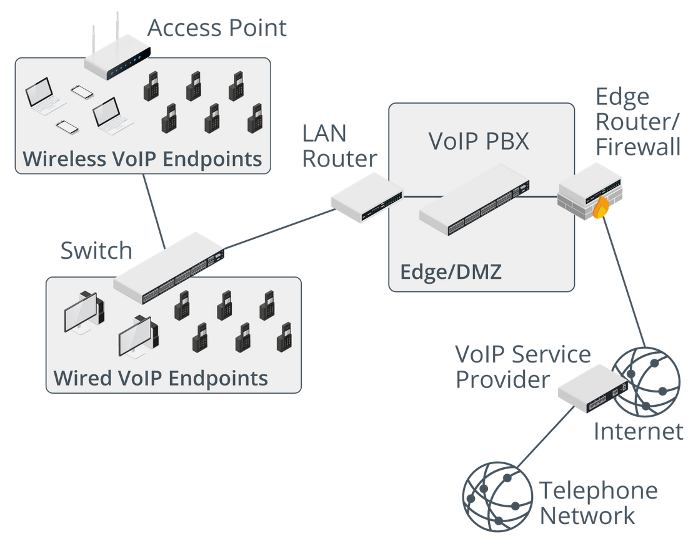

# D325 CompTIA Network+ (N10-008) Charts

## Wi-Fi & Wi-Fi Auth

| Standard                | MHz                | Band          | Max Per Stream | Max Throughput                      |
| ----------------------- | ------------------ | ------------- | -------------- | ----------------------------------- |
| 802.11a (1999)          | 20                 | 5GHz          | 54Mbps         | 54Mbps                              |
| 802.11b (1999)          | 22                 | 2.4GHz        | 11Mbps         | 11Mbps                              |
| 802.11g (2003)          | 20                 | 2.4GHz        | 54Mbps         | 54Mbps                              |
| 802.11n (Wifi 4) (2009) | 20,40,80           | 2.4GHz, 5 GHz | 150Mbps        | 600Mbps (4 Streams x MIMO)          |
| 802.11ac (Wifi 5)       | 20,40,80,80+80,160 | 5 GHz         | 867Mbps        | 6.9Gbps (8 x DL, MU-MIMO)           |
| 802.11ax (Wifi 6)       | 20,40,80,80+80,160 | 2.4GHz, 5GHz  | 1201Mbps       | 9.6Gbps (8 x DL/UL, MU-MIMO, OFDMA) |

| Best | Name         | Auth Handshake        | Key Bit size | Encryption    |
| ---- | ------------ | --------------------- | ------------ | ------------- |
| 1    | WPA3         | SAE (Dragonfly)       | 256          | AES-GCMP, MIC |
| 2    | WPA2         | PSK (4-way-handshake) | 128          | AES-CCMP, MIC |
| 3    | WPA          | TKIP, 24-bit IV, PSK  | 128          | RC4           |
| 4    | WEP          | obsolete PSK          | 24           |               |
| 5    | Open Network | (no security at all)  | 0            | -             |

## OSI Model & TCP/IP

| Number | Layer        | Description                                                                    |
| ------ | ------------ | ------------------------------------------------------------------------------ |
| 7      | Application  | Http, DNS, FTP, software apps. What you see/interact with.                     |
| 6      | Presentation | (de)(en)cryption(TLS). (de)(en)code. ex.. jpg, mp4...                          |
| 5      | Session      | Establish,Manage,Terminate. (Request, Response, Auth, VPN)                     |
| 4      | Transport    | Segment/reassemble data. Host-to-Host. Port. Reliable data delivery (TCP/UDP). |
| 3      | Network      | Packet(datagram). Router, hop-to-hop. layer3 switch. Logical IP Addressing     |
| 2      | Data Link    | Frame. Node-to-Node(MAC). Error detection. switch(WAP), bridge, NIC.           |
| 1      | Physical     | Bit. hub, repeater, modem, cabling/wifi(Bounded/unbounded media).              |

| TC/IP Model      | Protocols and Services                  | OSI Model                                   |
| :--------------- | :-------------------------------------- | :------------------------------------------ |
| Application      | HTTP, SSH, FTP, Telnet, NTP, DHCP, PING | 7. Application, 6. Presentation, 5. Session |
| Transport        | Segment. TCP, UDP                       | 4. Transport                                |
| Internet/Network | Packet. IP, ARP, ICMP, IGMP             | 3. Network                                  |
| Network Access   | Ethernet (physically sent), Frame       | 2. Data Link, 1. Physical                   |

## CIDR

| RFC 1918 Private (Non-Routable) | RANGE                            |
| ------------------------------- | -------------------------------- |
| 0                               | 0.0.0.0 - 0.255.255.255          |
| Loopback                        | 127.0.0.0 - 127.255.255          |
| 10.x.x.x                        | 10.0.0.0 - 10.255.255.255/8      |
| 172.16.x.x                      | 172.16.0.0 - 172.31.255.255/12   |
| 192.168.x.x                     | 192.168.0.0 - 192.168.255.255/16 |
| 169.254.x.x (APIPA)             | 169.254.1.0 - 169.254.254.255/16 |

| CLASS   | STARTING BITS | RANGE                          |
| ------- | ------------- | ------------------------------ |
| Class A | 0             | 1.0.0.0 - 126.255.255.255/8    |
| Class B | 1 0           | 128.0.0.0 - 191.255.255.255/16 |
| Class C | 1 1 0         | 192.0.0.0 - 223.255.255.255/24 |
| Class D | 1 1 1 0       | 224.0.0.0 - 239.255.255.255    |
| Class E | 1 1 1 1       | 240.0.0.0 - 255.255.255.255    |

- **Professor Messer 7 second subnetting**

| 1   | 2   | 3   | 4   | decimal | host-2 | networks |
| --- | --- | --- | --- | ------- | ------ | -------- |
| /1  | /9  | /17 | /25 | 128     | 128    | 2        |
| /2  | /10 | /18 | /26 | 192     | 64     | 4        |
| /3  | /11 | /19 | /27 | 224     | 32     | 8        |
| /4  | /12 | /20 | /28 | 240     | 16     | 16       |
| /5  | /13 | /21 | /29 | 248     | 8      | 32       |
| /6  | /14 | /22 | /30 | 252     | 4      | 64       |
| /7  | /15 | /23 | /31 | 254     | 2      | 128      |
| /8  | /16 | /24 | /32 | 255     | 1      | 256      |

|     |     |  8  |     |     |     |
| :-: | :-: | :-: | :-: | :-: | :-: |
|  0  |  8  | 16  | 24  | 32  | 40  |
|     | 48  | 56  | 64  | 72  | 80  |
|     | 88  | 96  | 104 | 112 | 120 |
|     | 128 | 136 | 144 | 152 | 160 |
|     | 168 | 176 | 184 | 192 | 200 |
|     | 208 | 216 | 224 | 232 | 240 |
|     | 248 |     |     |     |     |

## Syslog Error codes

- **Logging levels/severity levels**: mnemonic: Everyone always complains even when nothing is different.
  <!-- - prettier-ignore -->
  0. emergency: System is unusable
  1. alert: Immediate action needed
  2. critical: Critical condition
  3. error: Error condition
  4. warning: Warning condition
  5. notification: Normal but significant condition
  6. informational: Informational message only
  7. debugging: Appears during debugging only

## CompTIA troubleshooting steps

- Mnemonic: "I Eat Three Eggs In Virginia Daily"

1. Identify the problem
2. Establish a theory of probable cause
3. Test the theory to determine the cause
4. Establish a plan of action to resolve the problem and implement the Solution
5. Implement the solution or escalate as necessary
6. Verify full system functionality
7. Document the findings, actions, and outcomes

## PoE

| POE RJ-45      | Wattage                                     |
| -------------- | ------------------------------------------- |
| 802.3af (2003) | 15.4w, 350mA, oldest                        |
| 802.3at (2009) | POE+, 25.5w 600mA                           |
| 802.3bt (2018) | POE++, 51w,600mA(Type 3), 73w,960mA(Type 4) |

## Acronyms

- CPE,IXE, PSK, SIEM
- **Disaster Recovery**
  - MTBF, MTTR, RTO, RPO
- **Fiber**
  - OEO, SFP, SMF,
- **Layer 2**
  - BPDU, CSMA/CD, EUI, LACP, MAC, MDI-X, STP
- **Layer 3**
  - HSRP, IANA, OSPF, VRRP
- **Routing**
  - BGP, EIGRP, MPLS, OSPF
- **Security**
  - EAP, NAC, RADIUS, TACACS+, UTM
- **SNMP**
  - Agent, Baseline, MIB, OID, Trap
- **Telephone**
  - PSTN, POTS, SIP
- **Tools**
  - IDC, OTDR,
- **Wi-Fi**
  - DMZ, MIMO, MU-MIMO, OFDM, WPS

%

- **CPE**: Customer Premise Equipment. what internet provider calls your router.
- **IXE**: Internet eXchange Points. backbone of internet(high bandwidth trunks) connects to this.
- **PSK**: Pre-shared key. cryptography. secret key(password) that has been established between the parties.
- **SIEM**: deploy multiple agents to monitor and log security related events from firewalls, IPS, antivirus to central location.

- **Disaster Recovery**
  - **MTBF**: Mean time between failure. expected lifetime of product before failure.
  - **MTTR**: Mean time to repair. estimated time to recover from fault.
  - **RPO**: Recovery point objective. Maximum amount of time that 100% data can be recovered from a backup. (ex.. 24h).
  - **RTO**: Recovery time objective. Maximum allowable time a system may remain offline following a disaster.
- **Fiber**
  - **OEO**: optical-electrical-optical. fiber repeater.
  - **SFP**: Small Form-factor Pluggable: fiber optic to digital bit convertors. Must match ethernet standard and wavelength.
  - **SMF**: Single Mode Fiber: type of long distance fiber wire.
- **Layer 2**
  - **BPDU**: Bridge protocol data units. frames contain information about STP.
  - **CSMA/CD**: Carrier Sense Multi Access/Collision Domain. Switch detects frame collisions.
  - **EUI**: extended unique identifier. IEEE name for MAC address
  - **LACP**: Link Aggregation Control Protocol. Combine multiple physical links into one logical link(bonding).
  - **MAC**: media access controller. 48 bit unique address assigned to all interface ports.
    - Also called BIA(burned in address).
  - **MDI-X**: Medium Dependent Interface Crossover. automatically detect transmit/receive pins. No crossover cable needed.
  - **STP**: Spanning Tree Protocol. Prevent loops when switches have multiple path to each other.
- **Layer 3**
  - **HSRP**: Hot standby router protocol. Cisco Proprietary(router redundancy). multiple routers share virtual IP.
  - **IANA**: Internet Assigned Numbers Authority. manages all IP's.
  - **OSPF**: Open shortest path first. routing protocol to find best path to destination.
  - **VRRP**: virtual router redundancy protocol. multiple routers with virtual IP/MAC address.
- **Routing**
  - **BGP**: Border Gateway Protocol. enables the internet to exchange routing information between AS(Autonomous Systems).
  - **EIGRP**: Enhanced Interior Gateway Routing Protocol. advanced distance-vector routing protocol. Cisco.
  - **MPLS**: Multi-protocol label switching. adding labels to packets to speed up time it takes to flow from one node ot another. Can flow on any protocol.
  - **OSPF**: Open Shortest Path First. link-state routing protocol that was developed for IP networks and is based on the Shortest Path First (SPF) algorithm.
- **Security**
  - **EAP**: Extensible Authentication Protocol. authentication framework.
  - **NAC**: Network Access Control. Authorization before allowed on network. EAP + RADIUS. 802.1X
  - **RADIUS**: Remote Access Dial-In User Service. open source AAA server. often used in 802.1X Wireless Auth.
  - **TACACS+**: Terminal Access Controller Access Control System. Cisco. Enterprise admin authentication.
  - **UTM**: Unified Threat Management. multiple security features combine into one device.
- **SNMP**
  - **Agent**: runs on each client to create OID's in the MIB.
  - **Baseline**: the normal operation specs.
  - **MIB**: Management Information Database. ASCII text file that describes elements as a list of data objects.
  - **OID**: Object identifier. database entry(MIB) object being monitored has an OID number. PIDs you can monitor.
  - **Trap**: instead of polling to collect info for graphs, can configure device to send alert when OID reaches threshold.
- **Telephone**
  - **PSTN**: Public Switched Telephone Network. sometimes called 'POTS' Line. internet access through phone company.
  - **POTS**: old phone line T1 connection.
  - **SIP**: Sesion Initiation Protocol. VoIP. video calls, instant messaging.
- **Tools**
  - **IDC**: Insulation Displacement Connector. punchdown tool on patch panels. holds the wire.
  - **OTDR**: Optical Time Domain Reflectometer. Tool analyze fiber wire. certifying,maintaining,troubleshooting.
- **Wi-Fi**
  - **DMZ**: demilitarized zone(screened subnet). physical or logical subnetwork.
  - **MIMO**: multiple streams send/receive to many devices, but only one device at a time.
    - multiple antenna's on both client and router.
    - TxR:S // Transmit antenna, Receive Antenna, Max streams.
  - **MU-MIMO**: multiple user. stream to multiple devices at the same time.
  - **OFDM**: Orthogonal frequency-division multiplexing. split stream into segments.
  - **WPS**: Wi-Fi Protected Setup. Security risk. Allows router connection without password.

## Electromagnetic Radiation

- amplitude, attenuation, bandwidth, baud rate, bps, electromagnetic radiation, encoding, frequency, hertz, interference, jitter, latency, modulation, noise, signal, spectrum, speed, throughput,

%

- **Amplitude**: distance between low and high states of waveform.
- **Attenuation**: loss of signal strength, expressed in decibels (dBm). strength at origin and signal strength at destination.
- **Bandwidth**: theoretical size of pipe. The narrow definition of bandwidth is a **frequency** range measured in cycles per second or Hertz (Hz), but the term is very widely used in data networking to mean the amount of data that can be transferred, measured multiples of bits per second (bps). Encoding methods mean that, for instance, a signal with 100 MHz frequency bandwidth can transfer much more than 100 Mbps.
- **baud rate**: any signal high to low(called **symbol**) per second.
  - A symbol could be something like a pulse of higher voltage in an electrical current or the transition between the peak and the trough in an electromagnetic wave.
- **bps**: bits per second. data link layer. Can be more than one bit per symbol, so bit rate can be higher than baud rate.
- **Electromagnetic radiation**: means transmitting signals as electric current, infrared light, or radio waves.
- **Encoding**: transitioning between low and high voltage states in an electrical circuit, making use of a characteristic of the wave called amplitude.
- **Frequency**: how many times a second a signal goes from high to low to high.
- **Hertz**: frequency range measured in cycles per second.
- **Interference**: obstruction thats causes signal quality to decrease.
- **Jitter**: delay between packets.
- **Latency**: time it takes packet to arrive from src.
- **Modulation**: encoding information into a transmitted signal.
- **noise**: anything that gets transmitted that isn't the intended signal. expressed as **SNR(signal to noise ratio)**.
- **signal**: Electromagnetic radiation means transmitting signals as electric current, infrared light, or radio waves.
- **Spectrum**: range of radio waves.
- **speed**: is the expected performance of a link. measured in ms. sometimes called latency or delay.
- **throughput**: the tested average data rate achieved over time. actual data transfer.

## Contracts

- AUP, defense in depth, DLP, least privilege, MOU, MSDS, password policy, remote access policy, SLA, SOW, zero trust.

%

- **Acceptable Use Policy**: agreement to use corporate network according to terms.
- **Defense In Depth**: is a strategy that leverages multiple security measures to protect an organization's assets.
- **DLP**: Data Loss Prevention Policy. Defines how organizations can share and protect data.
- **Least Privilege**: a user or entity should only have access to the specific data, resources and applications needed to complete a required task.
- **MOU**: Memorandum of Understanding. Informal letter of intent. not a signed contract. Defines the responsibilities of each party in an agreement, provides the scope and authority of the agreement, clarifies terms, and outlines compliance issues.
- **MSDS**: Material Safety Data Sheet. potential hazards (health, fire, reactivity and environmental) and how to work safely with the chemical product.
- **NDA**: Non Disclosure Agreement. Legally enforceable contracts that create a confidential relationship between a person who has sensitive information and a person who will gain access to that information.
- **Password Policy**: acceptable password length, chars. Enforced by Group Policy.
- **Remote Access Policy**: outlines and defines acceptable methods of remotely connecting to the internal network. (includes password policy, and requiring employees to install software such as antivirus and antimalware programs).
- **SLA**: Service Level Agreement. commitment between a service provider and a client for particular aspects of the service, such as quality, availability, or responsibilities.
- **SOW**: Statement of Work. business agreement that outlines deliverables and project goals. Helps clients and vendors to stay aligned.
- **Zero Trust**: all users in/out organization to be authenticated, authorized and validated. Secure Infrastructure.

## Ethernet Pinout

- 568B pinout
- Gigabit Crossover cable pinout
- Rollover/Yost cable pinout
- Transmit/Receive pins: PC, router, firewall, switch

%

- **Straight Through/Patch Cable**

| 568B  | 1   | 2   | 3   | 4   | 5    | 6   | 7    | 8   |
| ----- | --- | --- | --- | --- | ---- | --- | ---- | --- |
| color | o/w | o   | g/w | bl  | bl/w | g   | br/w | br  |

- **Gigabit Pinout**

| pin  | End 1 | End 2 |
| ---- | ----- | ----- |
| 1, 3 | o/w   | g/w   |
| 2, 6 | o     | g     |
| 3, 1 | g/w   | o/w   |
| 4, 7 | bl    | br/w  |
| 5, 8 | bl/w  | br    |
| 6, 2 | g     | o     |
| 7, 4 | br/w  | bl    |
| 8, 5 | br    | bl/w  |

- **Rollover/Yost Cable**
- Rollover cables, sometimes referred to as **Yost** cables are most commonly used to connect to a device's console port to make programming changes to the device.

| pin  | End 1 | End 2 |
| ---- | ----- | ----- |
| 1, 8 | o/w   | br    |
| 2, 7 | o     | br/w  |
| 3, 6 | g/w   | g     |
| 4, 5 | bl    | bl    |
| 5, 4 | bl/w  | bl/w  |
| 6, 3 | g     | g/w   |
| 7, 2 | br/w  | o     |
| 8, 1 | br    | o/w   |

- **Transmit/Receive Pins**

| Device   | Transmit Pins | Receive Pins |
| -------- | ------------- | ------------ |
| PC       | 1,2           | 3,6          |
| Firewall | 1,2           | 3,6          |
| Router   | 1,2           | 3,6          |
| Switch   | 3,6           | 1,2          |

## Fiber

| Specification                  | Optics | Fiber   | Max Distance               |
| :----------------------------- | :----- | ------- | :------------------------- |
| 100BASE-FX (MMF, FDDI)         | laser  | MMF     | 400m half-duplex, 2km full |
| 100BASE-SX (Short Wavelength)  | led    | MMF     | 300m                       |
| 1000BASE-SX (Short Wavelength) | laser  | MMF     | 275m                       |
| 1000BASE-LX (Long Wavelength)  | laser  | MMF,SMF | 550m to 5km                |
| 10GBASE-SR (Short Range)       |        | MMF     | 33m to 400m                |
| 10GBASE-LR (Long Range)        |        | SMF     | 10 km(SMF)                 |

## Ethernet Cable

| Cat/Class       | Cable Type                  | Network Application | Max. Distance  | Frequency | Connector |
| :-------------- | :-------------------------- | :------------------ | :------------- | :-------- | :-------- |
| 3 (obsolete)    | UTP                         | 10BASE-T            | 100 m (328 ft) | 16 MHz    | RJ-45     |
| 5 (obsolete)    | UTP                         | 100BASE-TX          | 100 m (328 ft) | 100 MHz   | RJ-45     |
| 5e (Class D)    | UTP or F/UTP                | 1000BASE-T          | 100 m (328 ft) | 100 MHz   | RJ-45     |
| 6 (Class E)     | UTP, F/UTP, or U/FTP        | 1000BASE-T          | 100 m (328 ft) | 250 MHz   | RJ-45     |
| 6a (Class Ea)   | UTP, F/UTP, U/FTP, or S/FTP | 10GBASE-T           | 100 m (328 ft) | 500 MHz   | RJ-45     |
| 7 (Class F)     | S/FTP or F/FTP              | 10GBASE-T           | 100 m (328 ft) | 600 MHz   | GG45/TERA |
| 8/8.1 (Class I) | U/FTP or F/UTP              | 40GBASE-T           | 30 m (100 ft)  | 2000 MHz  | RJ-45     |
| 8.2 (Class II)  | F/FTP or S/FTP              | 40GBASE-T           | 30 m (100 ft)  | 2000 MHz  | GG45/TERA |

- **Cat 5** cable is no longer available. Cat 5e is tested at frequencies up to 100 MHz (like Cat 5 was) but to higher overall specifications for attenuation and crosstalk, meaning that the cable is rated to handle Gigabit Ethernet throughput. Cat 5e would still be an acceptable choice for providing network links for workstations.
- **Cat 6A** is an improved specification cable that can support 10 Gbps over 100 m. Cat 6A cable is bulkier than Cat 5e, and the installation requirements more stringent, so fitting it within pathways designed for older cable can be problematic. TIA/EIA standards recommend Cat 6A for use in health care facilities, with Power over Ethernet (PoE) 802.3bt installations, and for horizontal connections to wireless access points.
  - if you are installing Cat 6A wiring, you must also install Cat 6A patch panels, wall plates, and connectors.
- **Cat 7** cable is always of a screened/shielded type and is rated for 10GbE applications up to 100 m (328 feet). Cat 7 is not recognized by TIA/EIA but appears in the cabling standards created by the ISO (ISO/IEC 11801). It must be terminated with GG45 or TERA connectors rather than standard RJ-45 connectors.
- **Cat 8** is intended for use in datacenters only for short patch cable runs that make top-of-rack connections between adjacent appliances. ISO defines two variants; 8.1 (Class I) is equivalent to TIA/EIA Cat 8 and uses RJ-45 connectors while 8.2 (Class II) must use outer shielding or screening and GG-45 or TERA connectors.

## Wireless Networks

- GSM, CMDA
- Cellular chart

%

- **GSM (Global System For Mobiles)**: Cellular technology that takes the voice during a call and converts it into a digital format. Removable SIM card and most popular around the world. In US, used by AT&T and T-Mobile.
- **CDMA (Code-Division Multiple Access)**: Cellular technology that uses code division to split up the channel.
  - CDMA is a more powerful and flexible technology than GSM.
    - W-CDMA
      - Wideband CDMA
    - UMTS
      - Universal Mobile Telecommunications System
  - Cannot remove SIM, but new electronic SIM is a cheaper way of getting a data service when overseas.
  - The **preferred roaming list (PRL)** is a database built by CDMA service and most important to connect to network while traveling.

| Technology   | Frequency     | Transfer Speed     |
| ------------ | ------------- | ------------------ |
| 1G           | 30KHz         | 2Kbps              |
| 2G           | 1800MHz       | 14.4Kbps - 64 Kbps |
| 3G WCDMA     | 1.6 - 2 GHz   | 144Kbps - 2Mbps    |
| 3G HSPA      | 1.6 - 2 GHz   | 14.4Mbps           |
| 3G HSPA+     | 1.6 - 2 GHz   | 50Mbps             |
| 4G LTE       | 2 GHz         | 100Mbps            |
| 4G LTE-A     | 8 GHz         | 1Gbps              |
| 5G Low-band  | 600 - 850 MHz | 30Mbps - 250Mbps   |
| 5G Mid-band  | 2.5 - 3.7 GHz | 100Mbps - 900Mbps  |
| 5G High-band | 25 - 39 GHz   | 10Gbps             |

## Cisco Three-tiered network hierarchy

- access/edge layer
- distribution/aggregation layer
- core layer
- Traffic Flow: North-South, East-West.

%

- 
- access/edge layer: allow connection to network. layer 2 switches.
- distribution/aggregation layer: redundant layer 3 switches. full or partial mesh link to each layer 3 switch.
  - implement traffic policies, such as routing boundaries, filtering, or quality of service (QoS).
- core layer: network backbone. layer 3 switches. redundant traffic to network. full mesh with distribution layer 3 switches.

- Traffic flow:
  - North-South: data travels outside the network.
  - East-West: traffic travels inside the network.

## Legacy Voice

- **Demarc/smartjack/NIU**: Network Interface Unit.
  - where PTSN ends and customers personal network(private network) begins.
  - **CSU/DSU**: Channel Service Unit/Data Service Unit. connects to smartjack.
- **PBX**: Private Branch Exchange. automated switchboard providing a single connection point for an organizations voice lines.
  - **TDM PBX**: hardware.
  - **VoIP PBX**: software on router, pc.
- **PTSN**:
- **POTS**: plain old telephone service. Analog interface phone line terminates at home in. Each line is incoming or outgoing voice. Large business would require hundreds of lines for voice.
- **T-Carrier**: multiplex voice on single line. digitized voice. based on TDM.
  - **TDM**: Time Division Multiplexing. The trunk line for large business that multiplex separate voice and data channels over a single cable.
  - each channel(**DS0**) gets a time slot. 64kbs.
  - **DS1(T1)**: 1.544Mbps = 24\*64Kbps channels. can be multiplexed increase bandwidth.
- **Legacy voice and VoIP**: Voip PBX would be placed on edge router.

%

- 
