# D330 Data System Administrations

## Tips

- <https://quizlet.com/780746658/data-systems-administration-d330-all-questions-from-chapter-8-10-12-15-and-17-flash-cards/?x=1jqt>
- <https://quizlet.com/785412169/d330-data-systems-administration-flash-cards/>
- <https://www.linkedin.com/learning/oracle-12c-database-administration/welcome?u=2045532>
- <https://www.reddit.com/r/WGU/comments/11m6rf5/data_systems_administration_d330_pass/>
- In the "Exam Essentials" section of the book, there are 20 questions for each chapter and at the end of the book there are answers to the questions.
- <https://www.reddit.com/r/WGU/comments/158vszg/d330_data_systems_administration_pass/>
- **D330 help.docx**
  - **50% Database Management Tools**:
    - Explain the differences betwen pfile and spfile.
    - What is the Prefix for dynamic performance views?
    - Describe the Background processes and tell what they are for?
    - How do you connect to a user SQL from the command line (john with a password of ‘jyoung123’)?
    - What is the Log mode for recovery to a specific point in time?
    - What tool do you use for backup/recovery what types of backups can it do?
    - What is the Storage location for backup files?
    - What does Block change tracking do?
    - Where is the Location of the alert log file?
    - What are two advantages of transportable tablespaces (TTS)?
  - **20% Managing User Accounts**:
    - What is the privilege for starting up and shutting down database?
    - What happens at each level of startup?
    - What is the Minimum number of control files for database startup?
    - How do you allow users to viewing data without modifying table data?
    - Explain the Configuration requirement for data communication between 2 databases.
    - What is the content of a temporary tablespace?
    - What is the Information stored by undo tablespace?
    - What is the difference between USER, PROFILE, and ROLE?
    - Define storage of password objects.
    - What is Difference between WITH GRANT and WITH ADMIN options?
    - What is the command for granting minimum database access?
    - Difference between public and private schemas?
    - How to Enable a role for the current session.
    - Parameter for password complexity enforcement.
    - What are the parts and purpose of the SGA?
    - How to Configure automatic shared memory management.
  - **20% Oracle Upgrades and Migrations**:
    - Specifying external file name.
    - Identifying problems with Automatic Database Diagnostic Monitor (ADDM).
    - How to Resize components after incident start.
    - Automatically sizing components for workload management.
    - Modifying frequency of performance snapshots.
    - Parameter for password complexity enforcement.
  - **10% Backup and Restore**:
    - What is the purpose of the Shrink operation?
    - How can transaction be restored?
    - What is the DMBS_ADVISOR package?
    - What is the Purpose of storing undo data?
    - What is the purpose of the rollback segment and tablespace?
    - What does the segment advisor do?
    - What is the Resumable space feature all about?
    - How to identify and resolve deadlocks?
    - Why use Flash recovery vs. traditional backup and recovery with rman?
    - How can you prevent overwriting of undo data?
    - What is the Dynamic view and/or join for locked sessions?
- **WGU Chatter**
  - <https://www.reddit.com/r/WGU/comments/158vszg/d330_data_systems_administration_pass/>
  1. Watch these LinkedIn courses to get a basic grasp:
     1. <https://www.linkedin.com/learning/oracle-12c-database-administration>
     2. <https://www.linkedin.com/learning/oracle-database-12c-backup-and-recovery>
  2. Read the textbook **chapters 8-10,12-15,17**. Highlight stuff as necessary.
  3. Watch Dr. William Sewell's webinar that summarizes important stuff:
     1. <https://wgu.hosted.panopto.com/Panopto/Pages/Viewer.aspx?id=667f1502-63b8-4662-a097-b044000cbef6>
  4. Take the pre-assessment. You will have many incorrect answers.
  5. Go through the flash cards below. First 70-ish are the pre-assessment questions, the rest are chapter end questions. I went through first 150, that should be enough. Make sure you are able to at least get all the pre-assessment questions right. <https://quizlet.com/780746658>
  6. Take pre-assessment again (should get 95% correct). I say this because there are some questions worded similarly to the pre-assessment on the OA, so making sure you score a 100% here will definitely help.
  7. Schedule the exam immediately, or if necessary, schedule after an hour or so and skim through the textbook for review in the meanwhile.
  8. I passed, but god forbid if you fail - contact the instructor. There is also a "d330 test help.docx" that you can use to brush up on specific questions, but having a solid foundation is really necessary.

## Setting up Oracle 12c Database with Docker

1. create docker file and run:
   1. oracle 12c is no longer on docker hub. To get original, download directly from oracle.
      1. <https://enabling-cloud.github.io/docker-learning/RunningOracleDockerImage.html>
   2. or just use this one:
      1. <https://github.com/MaksymBilenko/docker-oracle-12c>
      2. <https://hub.docker.com/r/truevoly/oracle-12c>
      3. `docker run -d -p 8080:8080 -p 1521:1521 truevoly/oracle-12c`
         1. it takes about 3 minutes to finish loading.
         2. `docker ps` // show container name.
         3. `docker logs CONTAINER_NAME` // should say 100% complete.
            1. `docker logs $(docker container ls | grep tcp | awk '{print $NF}')` // if only one container running.
         4. `docker stop CONTAINER_NAME` // stop docker database.
         5. `docker start CONTAINER_NAME` // after stopping you can restart database.
2. install Oracle SQL Developer for vscode(VSCode extension gives you access to command line only):
   1. <https://marketplace.visualstudio.com/items?itemName=Oracle.sql-developer>
   2. or download the DBCA GUI and sqldeveloper GUI from Oracle.
      1. <https://www.oracle.com/database/technologies/oracle-database-software-downloads.html>
      2. <https://www.oracle.com/database/sqldeveloper/technologies/download/>
   3. Once installed, find database icon in side panel. To connect:
      1. create connection name: `any_name`
      2. username: `system`
      3. password: `oracle`
      4. hostname: `localhost`
      5. port: `1521`
      6. type: `SID`
      7. SID: `xe`
3. Connect To Docker Container -optional
   1. `docker exec -it CONTAINER_NAME bash` # connect to running Oracle container.
   2. or
   3. `docker exec -it $(docker container ls | grep tcp | awk '{print $NF}') bash` # if only one container running.
   4. `sqlplus system/oracle@//localhost:1521/xe` # connect directly to Oracle database command line.
   5. stop docker container:
      1. `docker stop $(docker container ls | grep tcp | awk '{print $NF}')` // stop docker database.
4. Open Oracle Application Express GUI
   1. `http://localhost:8080/apex`
   2. workspace: `INTERNAL`
   3. user: `ADMIN`
   4. password: `0Racle$` // when asked to change password: `0Racle$$$`

## Oracle Overview

- **Oracle Server**
  - data itself is composed of related logical units of information.
  - (DBMS) facilitates the storage, modification, and retrieval of this data.
  - relational database management system (RDBMS) is that the data consists of a set of relational objects.
  - 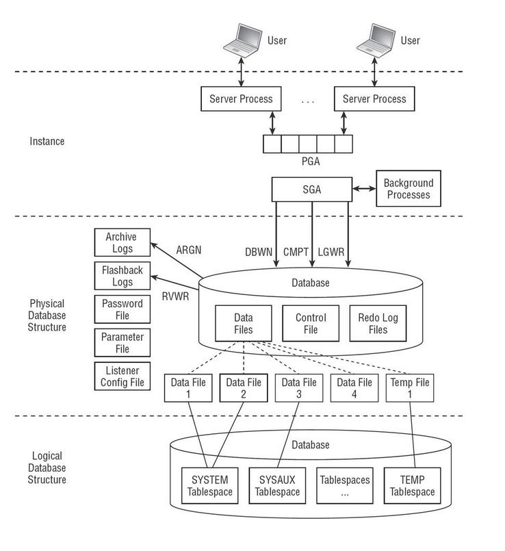
  - all three main processes create the **Oracle Server**.
    1. **Memory** Structure: This and 'process structure' create an 'instance'.
    2. **Process** Structure: background processes reading, writing transactions and queries.
    3. **Storage** Structure: the physical data. aka Database.
  - 
- **Transaction Overview**
  1. Oracle reads the blocks from data file to buffer cache and updates the blocks.
  2. The server process writes the change vectors to the redo log buffer.
  3. The user commits the change.
  4. LGWR flushes the redo log buffer to redo log files.
  5. A checkpoint occurs.
  6. Changed blocks from the buffer cache are written to data files.

## Database and Storage

- **Database Logical Structure Overview**
  - tablespace is highest level of abstraction and must be created before any tables can exist.
    - each tablespace is stored in one or more data files(the physical storage of a database).
    - a data file can belong to only one tablespace, but a tablespace can have multiple data files.
  - tablespace has multiple segments.
  - segments are sql tables.
  - tables are filled with rows, stored in data blocks.
  - Oracle creates 'extents'(multiple consecutive data blocks) for efficiency.
  - 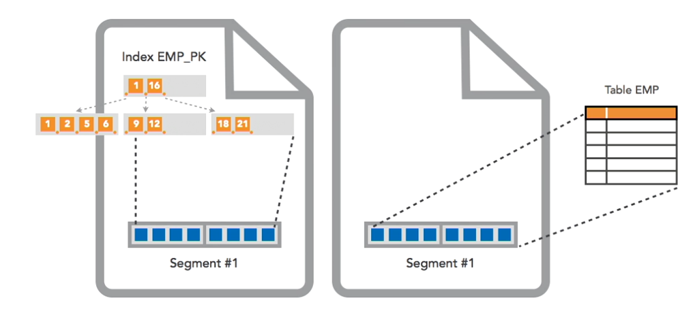
  - 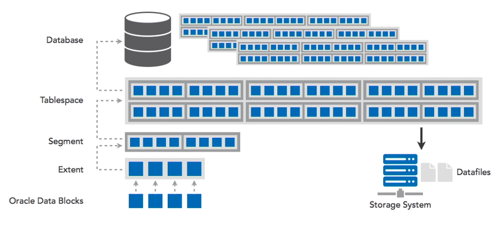
- **Physical Storage Structure**
  - There are three main files that store data to disk:
    - control files, data files, and redo log files.
  - additional files, but not part of database:
    - password file, the parameter file, and any archived redo log files.
- **Backup Files**
  - backup data files, control files, redo log files, archived redo log files, SP file.
  - e.g. backup taken at 2pm. It takes two hours. The backup is only good for everything until 2pm.
    - archived redo log files: hold the transactions after 2pm till current.
  - 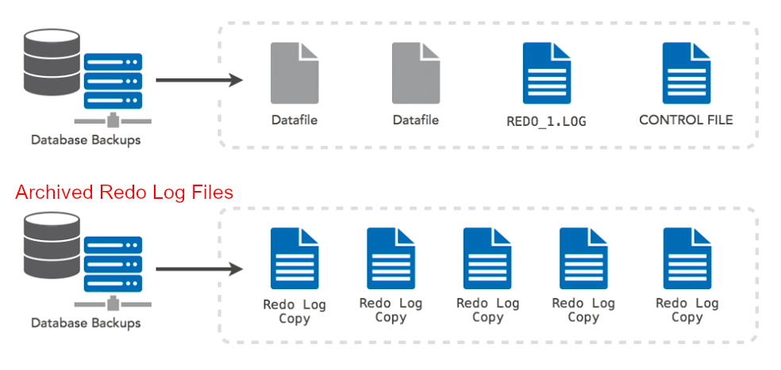
- **Tablespace**
  - A tablespace is a logical storage area within the database. Tablespaces **group logically related segments**.
  - Tablespace is **created first** and are written to data files.
    - A data file can belong to only one tablespace, but a tablespace can have multiple data files.
  - logical storage structure at the highest level of database.
  - e.g. Tablespace `AR_TAB`(accounts receivable tables) is created. All tables related to 'accounts receivable' will be stored under this tablespace.
  - `SYSTEM`, `SYSAUX`, and `TEMP` are mandatory table spaces.
  - `SELECT tablespace_name, file_name FROM dba_data_files ORDER BY tablespace_name;` // view tablespaces.
  - 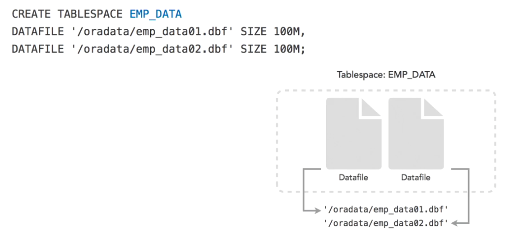
  - 
- **SYSTEM tablespace**
  - oracle system use only.
  - all metadata about database, data dictionary, and PL/SQL code is stored here.
- **UNDO tablespace**
  - oracle system use only.
  - stores previous versions of rows.
  - `ROLLBACK;` command.
- **TEMP tablespace**
  - temporary segments, anything that doesn't need persistent storage.
  - PGA overflow, large sort operations.
- **Data File**
  - **physical files that store data, rows, tables, metadata, indexes** are stored in data files.
  - file structures collectively called the **database**. each 'database' will contain multiple data files.
  - need to be redundant and highly available.
  - NAS or SAN supported.
  - 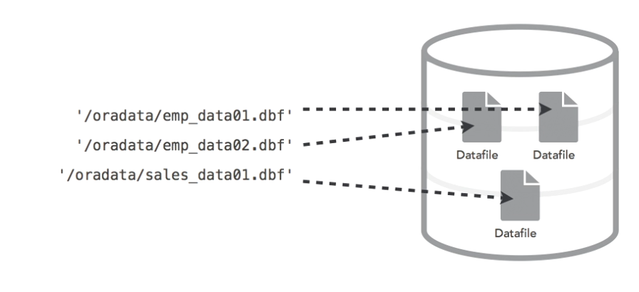
  - 
- **Data Blocks, Extents, Segments**
  - all of these are inside data files.
  - data blocks: 8kb in size. Contains one or more **rows**. Query, database reads blocks and returns relevant info.
  - extents: collection of multiple **contiguous chunks**. It's more **efficient** to allocate relative data in large chunks. Cannot span multiple data files.
  - segment: multiple extents. A **table** will be one segment space, no matter the size.
    - when you create a table, you create an 'oracle segment'.
    - table, index, materialized view, or a clustered table is created.
    - a segment can span multiple data files.
  - 
  - 
- **Control File Database**
  - **location of physical files**, database name, block size, character set, recovery information, checkpoint...
  - when start, loads control file, to find path of other files(data files, redo log files...).
  - multiplexing for redundancy. required to open database.
  - `SELECT type FROM v$controlfile_record_section;` // show all control file information.
  - 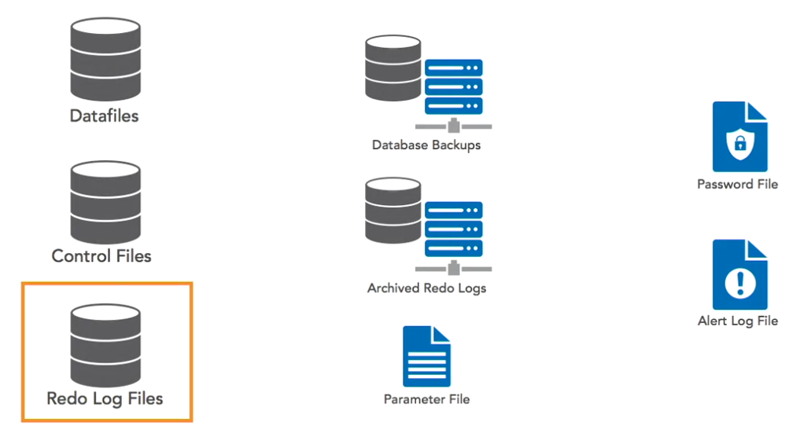
- **Redo Log Files**
  - **all transaction(DML) logs** are stored(INSET, UPDATE, DELETE). Allow you to rebuild database on failure.
  - confirmation of `COMMIT;` is given once transaction is written in redo log.
  - a separate database is used for storing redo log files.
  - cyclic write(fills one file, writes to other, then goes back to first file and writes).
  - multiplexing, write same transaction data to different locations for redundancy. Called: **redo log groups**.
    - Each multiplexed file within the group is called a **redo log group member**.
    - Each database must have a minimum of two redo log groups.
  - once redo log is full, contents are copied to archive log database, then the redo log file is marked for `INACTIVE` for overwriting.
  - extension is `.log`, but they are not log files. Delete them and database cannot start.
  - `SELECT group#, member FROM v$logfile ORDER BY group#;` // view redo log files status
  - 
  - 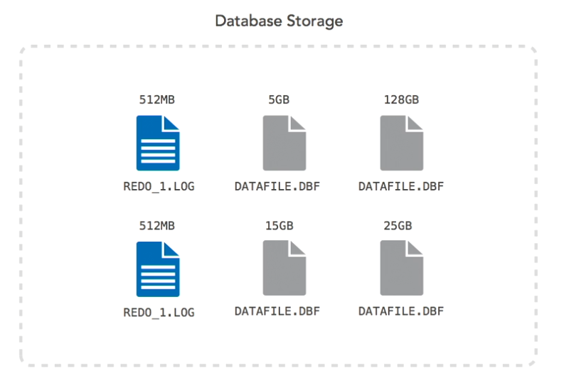
- **Parameter File**
  - Server Parameter(SP) file. Binary file that stores the oracle instance configuration parameters.
  - all your custom parameters are stored here. e.g. `PGA_MAX_SIZE=25G`
  - binary file must be changed with 'oracle commands'. Cannot be done directly.
  - can be rebuilt if lost, but easier just to add to backup plan.
  - 
- **Password File**
  - stores password for users with admin privileges(SYSDBA and SYSOPER).
  - stored outside the database. Admin has complete control of database.
  - non-administrator users passwords are stored inside the database.
  - 
- **Oracle Net File**
  - database listener configuration and client-to-database connectivity details.
- **Flashback Log**
  - if 'flashback' is enabled, files are written to the 'fast recovery area'.
- **Alert Log File**
  - list of alerts, errors, events that occurred during database operation.
  - used when troubleshooting problems.
  - 

## Definitions

- **Child Table**: table where the foreign key column exists.
- **Constraint**: parent-child relationship between tables.
- **Parent Table**: table in a relational database **must have a primary key**.
- **Schema**
  - A user is a defined **database entity** that has a set of abilities to **perform activities** based on their granted rights.
  - A schema, which is associated with a user entity, is more appropriately defined as a collection of **database objects**.
    - e.g. database objects are tables, indexes, and views.
    - DBA might create a schema called SALES and create objects owned by that schema. Then, they can grant access to other database users who need the ability to access the SALES schema.
    - objects associated with an application and is not tied to any specific user.
- **System Identification Name (SID)**
  - Oracle SID. Database Identifier name.

## Oracle Instance

- **Oracle Instance Overview**
  - each DB will have at least one instance.
  - an instance is a combination of memory structures and background processes.
  - when user connects
  - 
  - 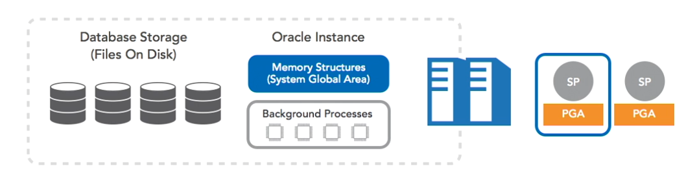
- **Oracle Instance**
  - Logical Memory and background processes created every time you start.
  - stores in memory the database schema(metadata) about tables.
  - runs background processes that cache queries and transactional processing(read/write).
  - each database must have one instance, and can have multiple instances.
  - 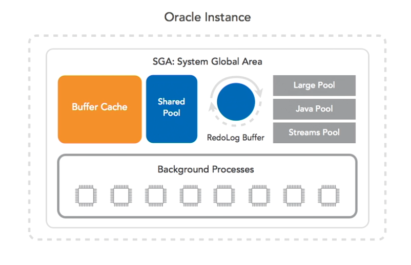
- **PGA Program Global Area**
  - each user has dedicated **PGA**(program global area, private memory) memory cache.
  - SQL work area like SORT or building hash tables.
  - data that should not persist after user session ends, is stored in PGA.
  - Total PGA size is configured automatically or manually. `PGA_AGGREGATE_TARGET=25G` // total size.
  - not efficient for thousands of users. Uses middleware servers that stream the connections to the PGA.
  - 
- **SGA System Global Area**
  - main memory structure. Contains: buffer cache, shared pool, redolog buffer, large pool, java pool, streams pool.
  - shared memory structures used to cache data(waiting to be written to disk).
  - every user shares the same SGA.
  - 
  - 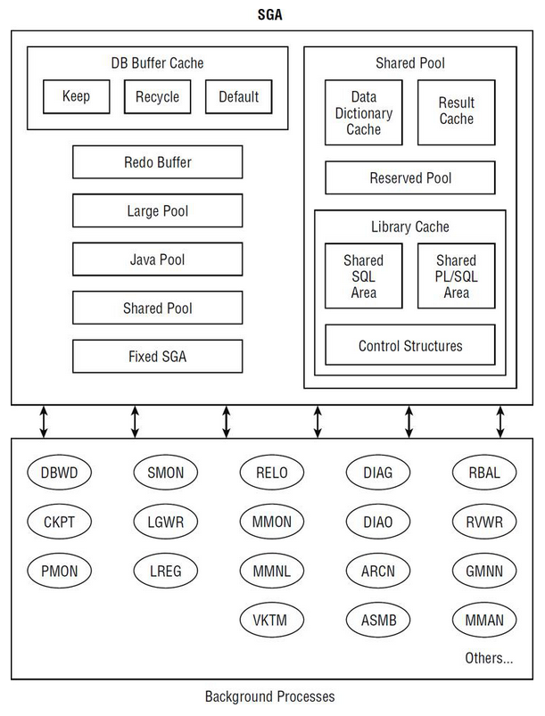
- **Shared Pool**
  - mandatory memory area in SGA. Caches most recent **SQL statements** issued by database users. Constantly tracks and updates the most popular commands.
  - least recently used algorithm(**LRU algorithm**) to manage the contents of the shared pool and database buffer cache.
  - data dictionary: metadata: tables, columns, users, data files.
  - `SGA_TARGET` and `SGA_MAX_SIZE` are memory parameters we can control.
  - `SELECT * FROM v$sgainfo;` // view SGA specs.
  - 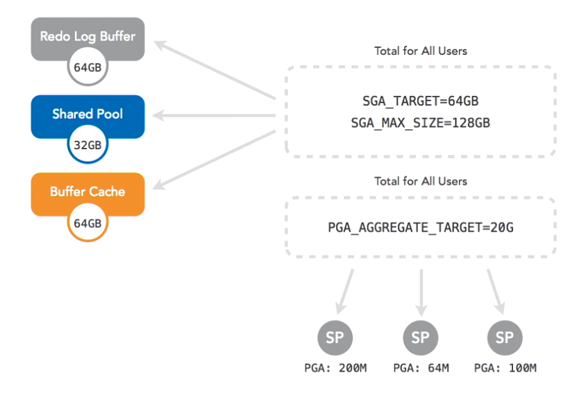
  - cache non-user data. Library cache, data dict cache.
  - **library cache**: metadata about each sequel statement.
    - hard parse: first time statement is executed.
    - soft parse: after statement is executed in library cache.
  - **database dictionary cache**: metadata about database and users.
    - referential integrity, table definitions and structure(schema), indexes.
  - 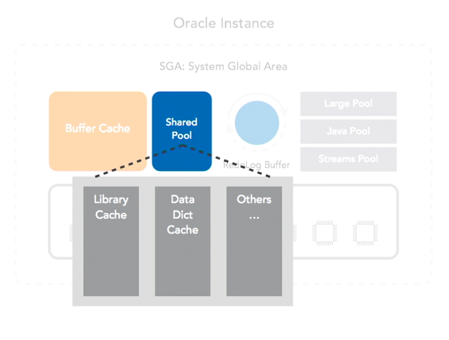
- **Database Buffer Cache**
  - mandatory memory area in SGA. largest part of SGA memory. Stores frequently accessed database data(**rows, tables**) to improve efficiency.
  - stored as **oracle blocks**. Each block contains one or more rows of data.
  - least recently used algorithm(**LRU algorithm**) to manage the contents of the shared pool and database buffer cache.
  - Three types of buffers:
    - dirty: waiting to be written to disk.
    - free: memory that can be used.
    - pinned: blocks waiting to be written or explicitly retained for future use.
  - buffer cache is broken down into three areas:
    - default: must have. all data by default cached here. LRU algorithm.
    - keep: send heavily used tables here to stay longer in memory.
    - recycle: send least used tables here to prevent 'ageing' out good data from default cache.
  - `ALTER TABLE` statement sends table query to preferred cache(keep, recycle).
  - `DB_KEEP_CACHE_SIZE` and `DB_RECYCLE_CACHE_SIZE`
  - 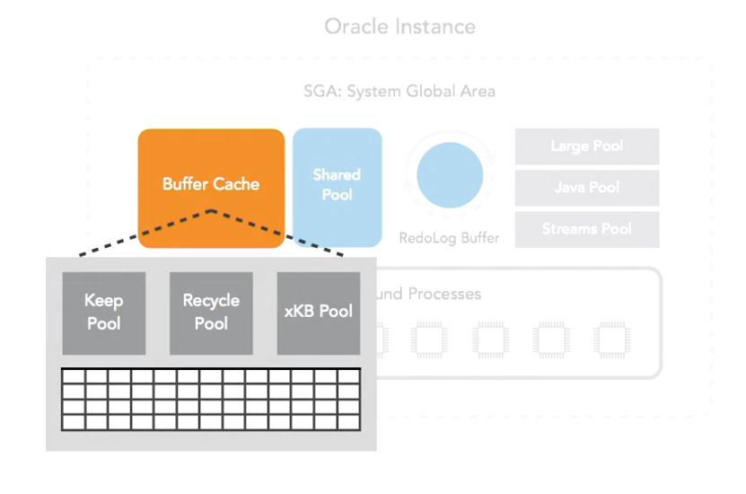
- **Redo Log Buffer**
  - mandatory memory area in SGA. **Transaction logs** records are stored here. Once database started, cannot be configured.
  - changes are known as redo entries or change vectors and are used to redo the changes in case of a failure.
  - when changes are made to database(**UPDATE**), they need to get updated in Buffer Cache and Shared pool.
  - allows recent transactions to be reapplied after database restore from backup.
  - written periodically to file for backup. If lost, oracle database cannot start.
  - multiplexing, write to multiple logs for redundancy.
  - `LOG_BUFFER=25G` // total size of redo log cache.
  - extension is `.log`, but they are not log files. Delete them and lose database.
  - 
- **Optional SGA Memory Area: Java Pool, Large Pool, Streams Pool, Result Cache**
  - Java Pool: most recent java objects.
  - Large Pool: cache for large operations: RMAN backup, Shared Server components.
  - Streams Pool: for advanced queueing.
  - Result Cache: most common query results.

## Oracle Instance Background Processes

- **background processes**
  - functions running in background to ensure data integrity.
  - maintenance task.
  - `ps -ef |grep C12DB1` // view all background processes.
  - 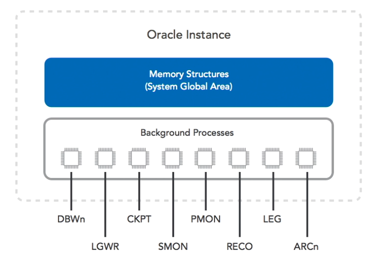
- **Database Writer**
  - DBWn. write the contents of the **dirty buffers to the data files**.
  - transactions like when you `UPDATE` a table are first stored in the **SGA buffer cache**, then written to disk by the DBWn.
  - writes periodically, when buffer cache is full, when redo log switch, when checkpoint event or shutdown(besides shutdown abort).
- **Checkpoint**
  - CKPT. when **all dirty buffers** are **written to data files**, a checkpoint is created.
  - CKPT generates a unique **SCN(sequential change number)**.
  - writes this to the head of the **control file**.
  - because **all data files** headers must be updated and can be extensive, the DBWn writes the checkpoint when it writes dirty buffers to data files.
  - this ensures data consistency. faster recovery process.
  - occur automatically when a redo log file is full(log switch).
  - 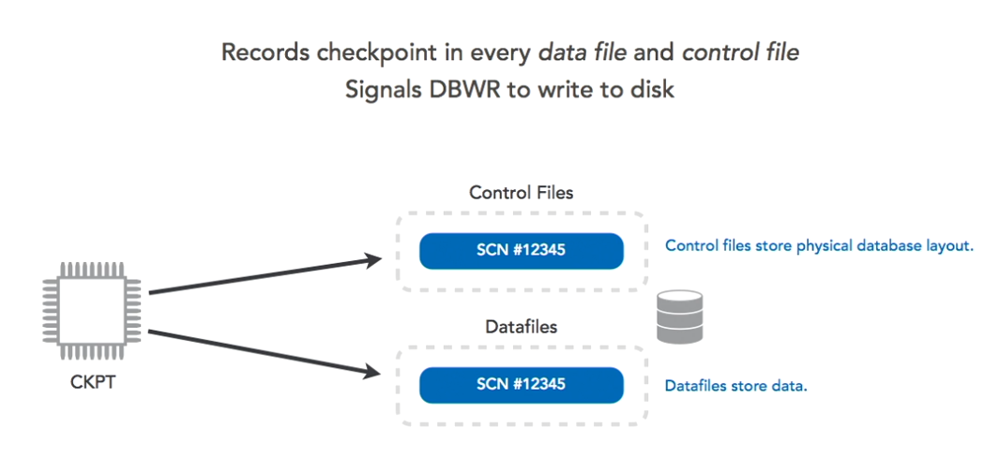
- **Log Writer**
  - LGWR. Writes **RedoLog Buffer cache** to redo log files on disk.
  - When user issues a `COMMIT;` statement, RedoLog Buffer will be written to disk.
  - or every three seconds.
- **System Monitor**
  - SMON. performs **crash recovery** during **startup** instance, if required, from redo logs.
  - clean old memory processes no longer in use and manages space used for sorting.
- **Process Monitor**
  - PMON. when user session fails, cleans up PGA and Buffer Cache resources.
- **Recover Process**
  - RECO. Recovers failed transactions that are distributed across multiple databases.
  - cleans up failed transactions when `UPDATE` fails.
- **Listener Registration**
  - LREG. registers oracle instance with oracle listener.
  - oracle listener: listens for user session connections, starts the process to serve connection.
    - gateway from client to database
    - spawns a new 'Server Process' for user.
    - 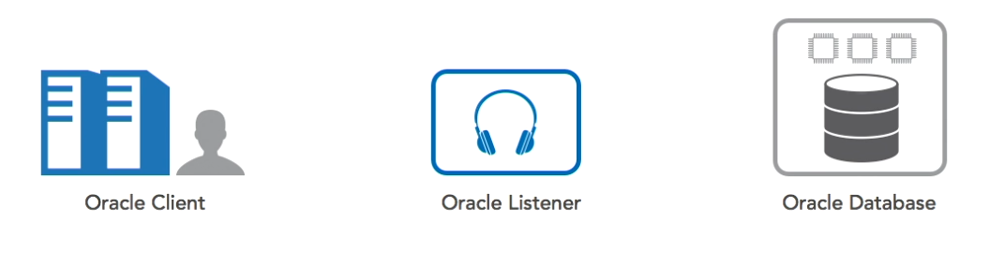
- **Virtual Keeper of Time**
  - VKTM. time keeper to all client, server relationships.
- **Archiver Process**
  - ARCn. Redo Log Archiver. Copy redo log file to storage after 'log switch' has occurred.
  - multiple ARC instances can be used for redundancy to store files in multiple locations.
  - 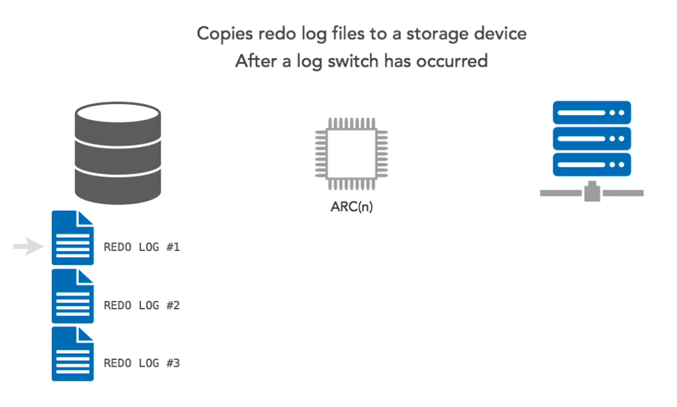

## Server Processes (SP)

- **Server Processes Overview**
  - When a 'user' starts an application, Oracle starts a 'user process' to support the connection. Oracle calls this a 'connection'.
  - Oracle then creates a 'server process'. The 'server process' allows the user to perform task and interact with the database.
  - A PGA(single user memory) is created.
  - 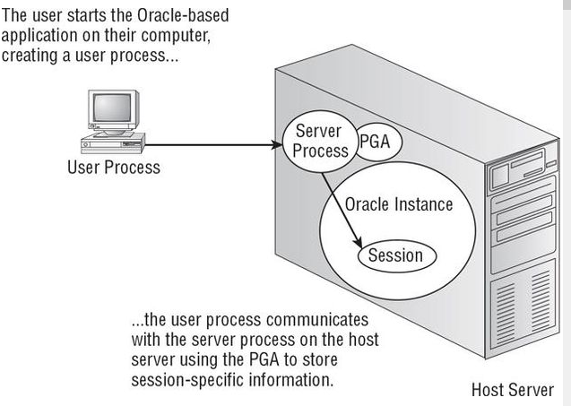
  - read physical file(database), loads into memory(oracle instance buffer cache).
  - listens for request from client(user session) and interacts with oracle instance.
  - verifies syntax of client statements(SELECT statements).
  - 
- **Oracle dedicated server process model**
  - each user has dedicated **PGA**(program global area, private memory) memory cache.
  - data that should not persist after user session ends, is stored in PGA.
  - not efficient for thousands of users. Uses middleware servers that stream the connections to the PGA.
  - 
- **Connection Pooling**
  - additional servers that handle multiple clients PGA.
  - 
- **PGA Program Global Area**
  - dedicated memory allocation available to each user.
  - `PGA_AGGREGATE_TARGET=20G` // control PGA size for all user.
  - 
- **Memory Sizing**
  - value of total memory, allows oracle to self assign needed memory.
  - 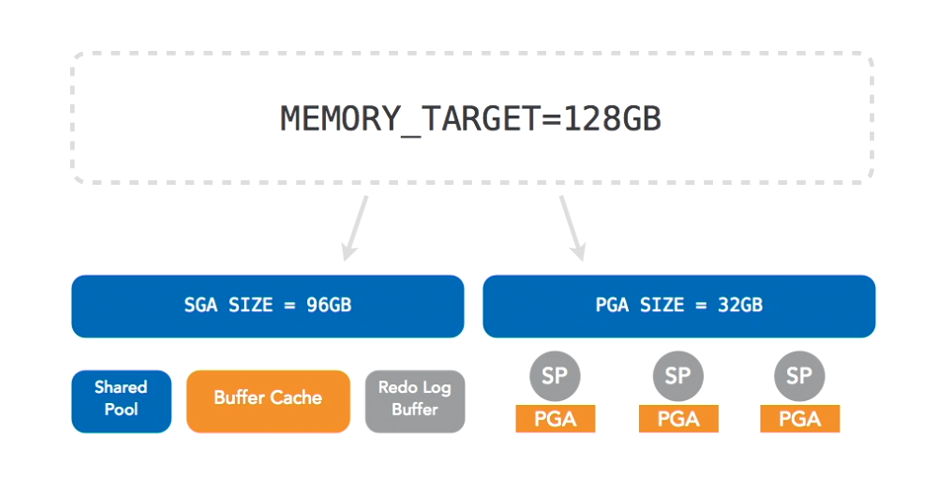

## Startup, Shutdown

- **Startup**
  - `STARTUP`
  - 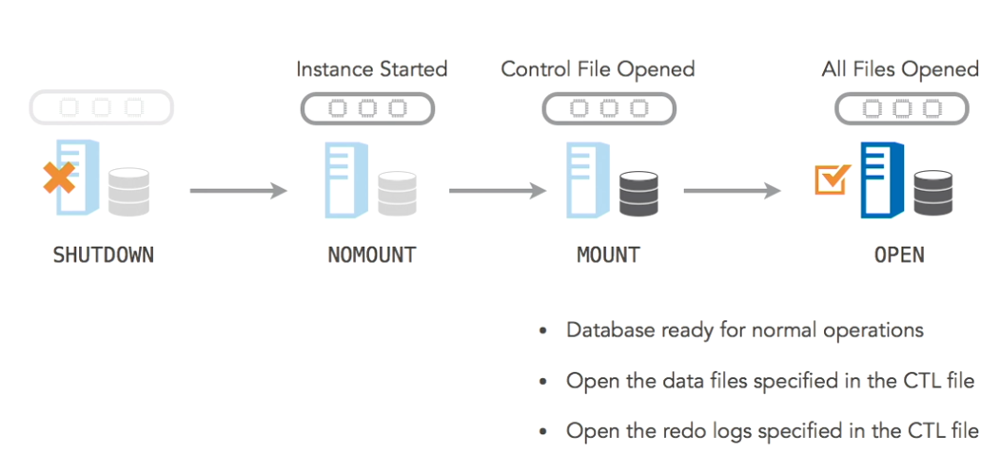
  - 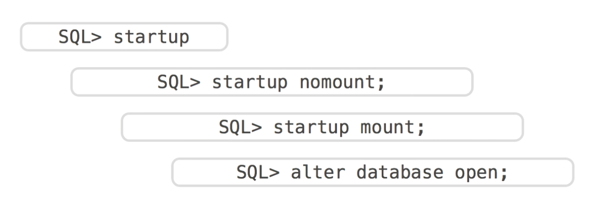
- **Shutdown**
  - shutdown abort. pulls the plug. dirty. terminates immediately.
  - 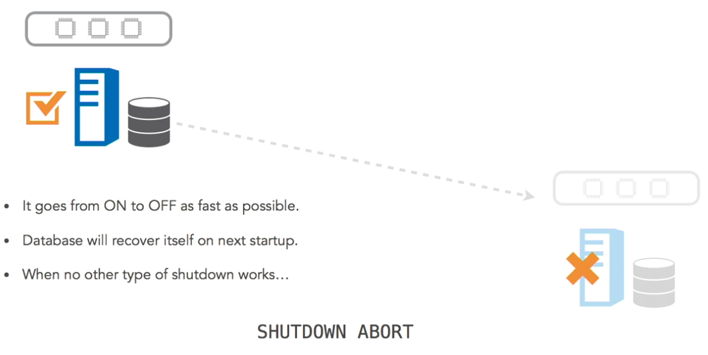
  - `shutdown immediate;`. typical shutdown, uncommitted transactions are rolled back.
  - `shutdown transactional;`. oracle waits for transactions to finish processing. No new connections are allowed.
  - `shutdown;`. wait for all sessions to disconnect.
  - 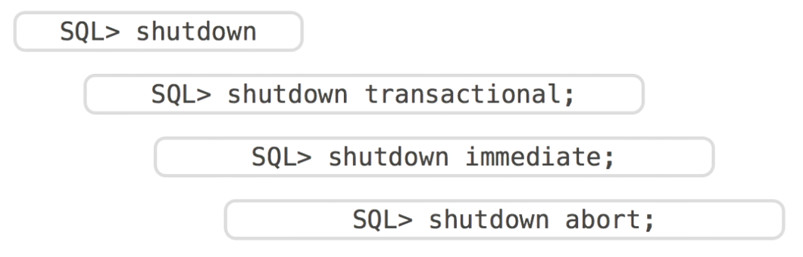
