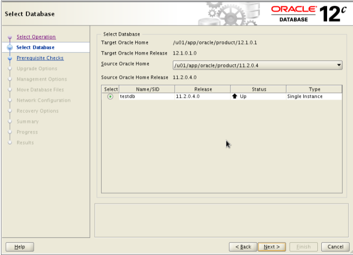

# D330 Data Systems Administrations Test Questions

## D330 Study Questions

- 1 % Which parameter can an administrator enable without restarting a database? % COMPATIBLE,DB_DOMAIN,SGA_TARGET,UNDO_MANAGEMENT
  - Out of the listed parameters, the one an administrator can enable without restarting the database is: **SGA_TARGET**
    - The SGA_TARGET parameter defines the target size for the System Global Area (SGA) in memory.
    - The SGA is a memory region used by the database to store frequently accessed data and control structures.
    - In Oracle Database 11g (and higher), modifications to SGA_TARGET can be applied dynamically without restarting the database.
    - The changes will be gradually incorporated during subsequent database operations, eventually reaching the new target size.
  - Here's why the other options require a database restart to take effect:
    - **COMPATIBLE**: This parameter specifies the database version for which the data files and structures are compatible. Changing it requires restarting the database to activate the new version's functionalities.
    - **DB_DOMAIN**: This parameter defines the database domain used for naming conventions. Modifying it necessitates a restart to ensure consistent naming across the database.
    - **UNDO_MANAGEMENT**: This parameter controls the management of undo data within the database. Changing it typically requires a restart for the new management strategy to take effect.
- 2 % Which view displays database parameters and values modified using the `SCOPE=SPFILE` clause? % `V$SPPARAMETER`,`V$NLS_PARAMETER`,`V$HS_PARAMETER`,`V$PARAMETER`
  - The correct answer is: **`V$SPPARAMETER`**.
    - The `V$SPPARAMETER` view in Oracle Database displays the database parameters and their values that have been modified or set using the `SCOPE=SPFILE` clause.
    - The `SCOPE=SPFILE` clause is used to modify database parameters in the server parameter file (SPFILE) rather than in the instance-level parameter cache. Changes made with this clause persist across database instance restarts and are maintained in the SPFILE.
    - The `V$SPPARAMETER` view shows the parameter values stored in the SPFILE, allowing you to verify the persistent parameter settings that will be used when the database instance is started.
    - By querying the `V$SPPARAMETER` view, administrators can verify the persistent parameter settings stored in the SPFILE, which are separate from any dynamic modifications made to the instance-level parameter cache. This view is particularly useful for confirming the parameter values that will be used when the database instance is restarted or for auditing changes made to the SPFILE using the `SCOPE=SPFILE` clause.
  - The other options you provided are incorrect:
    - **`V$NLS_PARAMETER`**: This view displays the current values of the National Language Support (NLS) parameters for the instance.
    - **`V$HS_PARAMETER`**: There is no such view in Oracle Database. The closest match is V$HS_AGENT, which provides information about the Oracle Heterogeneous Services agents.
    - **`V$PARAMETER`**: This view displays the current values of all initialized parameters for the running instance, including those set from the SPFILE and those modified in the instance-level parameter cache.
- 3 % Which command performs a clean shutdown without waiting for clients to disconnect? % `SHUTDOWN ABORT`,`SHUTDOWN NORMAL`,`SHUTDOWN TRANSACTIONAL`,`SHUTDOWN IMMEDIATE`
  - The command that performs a clean shutdown without waiting for clients to disconnect is: **`SHUTDOWN IMMEDIATE`**
    - Using the SHUTDOWN IMMEDIATE command will shut down the database cleanly without waiting for ongoing transactions to complete or for clients to disconnect. This command rolls back active transactions and closes the database instance promptly.
  - Why the other options are incorrect:
    - **`SHUTDOWN ABORT`**: This command is used to perform an immediate shutdown of the database instance. It does not wait for any transactions to complete or for clients to disconnect. It does not perform a clean shutdown. SHUTDOWN ABORT does not roll back active transactions, potentially leading to instance recovery during the next startup.
    - **`SHUTDOWN NORMAL`**: This command is used to perform a normal shutdown of the database instance. It waits for all client connections to disconnect and for active transactions to complete before shutting down. Therefore, it does not meet the requirement of performing a shutdown without waiting for clients to disconnect.
    - **`SHUTDOWN TRANSACTIONAL`**: This option allows existing user sessions to complete their current transactions but prevents any new connections from being established. Once all current transactions finish, the connections are closed and the database shuts down.
- 4 % Which area is a member of the System Global Area (SGA)? % Java pool,Log writer,Database writer,Process monitor
  - Out of the listed areas, the one that is a member of the System Global Area (SGA) in Oracle Database is: **Java pool**
    - The Java pool is a designated memory area within the SGA specifically allocated for caching frequently accessed Java classes and libraries used by the Java Virtual Machine (JVM) within the database.
    - By caching these Java elements in the SGA, the database can improve the performance of Java-based functionality within Oracle Database.
    - 
  - Here's why the other options are not directly part of the SGA:
    - **Log writer**: The log writer process is a background process responsible for writing redo information to the online redo log files. While it interacts with the SGA to access buffer caches for efficiency, it's not itself a constituent part of the SGA.
    - **Database writer (DBWR)**: Similar to the log writer, the DBWR process manages writing data from the buffer cache to datafiles. It interacts with the SGA but isn't a core component residing within it.
    - **Process monitor**: The process monitor is a conceptual entity that tracks the status of various database processes. It doesn't have a physical memory allocation and wouldn't be considered part of the SGA.
- 5 % Which types of events are recorded in an alert log? % Package creation,User creation,Role creation,Tablespace creation
  - The provided answer: **Tablespace creation**
    - While tablespace creation is a more significant database operation, it wouldn't be automatically logged by default in the alert log.
    - The events recorded in an Oracle alert log are primarily related to errors, warnings, and important status information about the database instance and its components.
    - The alert log does not typically record events related to database object creation or modification, such as package creation, user creation, role creation, or tablespace creation. These types of events are recorded in other logs, such as the audit trail or the database redo logs, depending on the auditing and logging configurations.
    - Types of Events in the Alert Log:
      - Startup and Shutdown Events: Information about database instance startup, shutdown, and abnormal terminations is typically logged.
      - Errors and Exceptions: Various errors encountered during database operations, like disk I/O failures, parsing errors, or resource exhaustion, are recorded.
      - Resource Usage: Significant changes in resource consumption like CPU usage, memory allocation, or redo log file usage might be logged.
      - Background Process Events: Startups, failures, or other notable events related to background database processes like DBWR or log writer are often logged.
      - Maintenance and Recovery Operations: Information about database maintenance activities like archive log switching or recovery operations might be included.
  - Why the other options are incorrect:
    - **Package creation**: Schema object creation like packages wouldn't be routinely logged in the alert log. These actions are considered regular database operations and wouldn't necessarily signify critical events.
    - **User creation**: Similar to package creation, user creation is a standard database operation and wouldn't be automatically logged in the alert log.
    - **Role creation**: Role creation also falls under schema object management and wouldn't be a typical alert log entry.
- 6 % Which initialization parameter sets the location of the alert log? % AUDIT_FILE_DEST,LOG_ARCHIVE_DEST,DIAGNOSTIC_DEST,CORE_DUMP_DEST
  - Out of the listed initialization parameters, the one that sets the location of the alert log in Oracle Database is: **DIAGNOSTIC_DEST**
    - The DIAGNOSTIC_DEST parameter is a crucial parameter in Oracle Database that specifies the base directory for various diagnostic data files, including the alert log.
    - `DIAGNOSTIC_DEST` allows you change alert log path with this parameter. Default is `ORACLE_HOME/rdbms/log`
    - e.g. `DIAGNOSTIC_DEST=/u01/app/oracle/diag`
  - Here's why the other options wouldn't be used for the alert log location:
    - **AUDIT_FILE_DEST**: This parameter specifies the destination directory for audit trail files generated by Oracle Database Auditing. While auditing can capture some events related to the alert log, it doesn't define the alert log location itself.
    - **LOG_ARCHIVE_DEST**: This parameter determines the location where archived online redo log files are stored. The alert log is a separate file that tracks database events, not archived redo information.
    - **CORE_DUMP_DEST**: This parameter defines the directory where core dump files are written in case of unexpected database process crashes. It wouldn't be used for the alert log location.
- 7 % Where is the `listener.ora` file located by default? % `$ORACLE_HOME/RDBMS`,`$ORACLE_HOME/NETWORK/ADMIN`,`$ORACLE_HOME/DATABASE/ADMIN`,`$ORACLE_HOME/DBS/ADMIN`
  - The `listener.ora` file, by default, is located in the: **`$ORACLE_HOME/NETWORK/ADMIN`** directory.
    - The `listener.ora` file serves as the configuration file for the Oracle Listener service.
    - It defines various parameters like listener name, port on which it listens for connections, and service descriptions for databases the listener can route connections to.
    - By placing `listener.ora` in $ORACLE_HOME/NETWORK/ADMIN, it ensures the file is accessible to the listener service for proper configuration.
  - Here's why the other options wouldn't be the default location for `listener.ora`:
    - **`$ORACLE_HOME/RDBMS`**: This directory typically contains core database files like control files and datafiles. It wouldn't house the `listener.ora` file, which is specific to network configuration.
    - **`$ORACLE_HOME/DATABASE/ADMIN`**: While some database administration files might reside here, `listener.ora` is more focused on network listener configuration and wouldn't be placed in this directory by default.
    - **`$ORACLE_HOME/DBS/ADMIN`**: This directory structure might be used in older Oracle versions, but the standard location for `listener.ora` in modern versions is `$ORACLE_HOME/NETWORK/ADMIN`.
- 8 % Which type of connection uses the Oracle Listener to communicate? % Client with database server,Browser with application server,Two application servers,Client with backup tool
  - Out of the listed connection types, the one that uses the Oracle Listener to communicate is: **Client with database server**
    - The Oracle Listener acts as an intermediary between client applications and database servers.
    - It listens on a specific port (usually 1521) for incoming connection requests from client applications.
    - Based on the configuration in `listener.ora`, the listener directs the connection request to the appropriate database server using the service name specified in the connection string.
  - Here's why the other options wouldn't involve the Oracle Listener:
    - **Browser with application server**: This communication typically occurs within a web application framework and wouldn't necessarily involve the Oracle Listener. The application server might connect directly to the database server using its own configuration.
    - **Two application servers**: Application servers might communicate with each other using various protocols or APIs depending on the specific architecture. The Oracle Listener wouldn't be directly involved in this communication.
    - **Client with backup tool**: Backup tools designed for Oracle databases might leverage dedicated libraries or protocols to connect to the database server. The Oracle Listener wouldn't be a mandatory component for such connections.
- 9 % What does the `SERVER=DEDICATED` element in a `tnsnames.ora` file associate with each client connection? % A committed server process,A shared server process,A pooled server process,A dispatched server process
  - The correct answer is: **A committed server process**.
    - `SERVER=[DEDICATED|SHARED]`: parameter in `tnsnames.ora` config. Tells the 'LISTENER' what kind of service it's talking to: directly to database server or dispatcher server(other machine that handles multiple network sessions for one shared process).
    - In a `tnsnames.ora` file, the `SERVER=DEDICATED` element associates each client connection with a dedicated server process.
    - When a client connects to an Oracle database using a network service name that has the `SERVER=DEDICATED` element defined, the Oracle database creates a dedicated server process specifically for that client connection. This dedicated server process is responsible for handling all communication and processing requests for that particular client.
    - The dedicated server process is a separate process that runs on the server and is solely dedicated to serving the requests of a single client connection. It remains associated with the client until the connection is terminated or the server process is terminated.
    - The `SERVER=DEDICATED` element is typically used in environments where each client connection requires dedicated resources or when the client applications are not designed to work with the shared server architecture. However, it can result in higher resource consumption on the server, as a separate server process is created for each client connection.
    - In contrast, the `SERVER=SHARED` element is used to enable the shared server architecture, where server processes are shared among multiple client connections, resulting in better resource utilization and scalability, especially in environments with a large number of concurrent connections.
  - The other options are incorrect:
    - **A shared server process**: This option is incorrect. A shared server process is associated with the SERVER=SHARED element in the `tnsnames.ora` file, which is used for sharing server processes among multiple client connections.
    - **A pooled server process**: This option is incorrect. Oracle does not have a concept of "pooled server processes." The closest concept is the shared server architecture, where server processes are shared among multiple client connections.
    - **A dispatched server process**: This option is incorrect. There is no such term as a "dispatched server process" in Oracle. Server processes can be dedicated or shared, but they are not dispatched.
- 10 % Which net service naming method requires the client to use a fixed port number? % Local,External,Host,Directory
  - The correct answer is: **Host**
  - Here's why:
    - **Local Naming**: This method uses a local file (tnsnames.ora) on the client to store connection information, including the port number. The client can potentially specify a different port number if needed.
    - **External Naming**: Similar to Local Naming, external naming relies on an external directory service to store connection details. This service might include the port number, but the client wouldn't necessarily be restricted to a fixed port.
    - **Host Naming**: This method uses the hostname of the database server to establish a connection. Traditionally, it relies on a well-known default port number (usually 1521 for Oracle) for the specific service. The client cannot specify a different port in this scenario.
    - **Directory Naming**: Similar to External Naming, directory naming utilizes a directory service to locate connection details. This service likely includes the port number, but the client might not be limited to a fixed port configuration.
  - Therefore, Host Naming is the only method that enforces a fixed port number on the client side.
- 11 % A database link named `wgu2021` has been created to link to a remote object in the `test` database. The object is named employee and is owned by `Scott`. % Which reference resolves to the remote object? % `scott.employee@wgu2021`,`scott.employee`,`employee`,`scott.employee@test`
  - Out of the listed options, the reference that resolves to the remote object in the test database is: **`scott.employee@wgu2021`**
    - Database links act as bridges between your local database and a remote database.
    - To access a remote object like scott.employee in the test database, you need to include the database link name (wgu2021) in the reference.
    - The syntax scott.employee@wgu2021 specifies the schema owner (scott), object name (employee), and the database link (wgu2021) that points to the remote database where the object resides.
  - Here's why the other options wouldn't work:
    - **`scott.employee`**: This reference would only work if the employee object existed locally within the current database schema. Since it's a remote object, additional information is needed to specify the database link.
    - **`employee`**: Similar to option B, this would only refer to a local employee object if it existed. It wouldn't access the remote object through the database link.
    - **`scott.employee@test`**: While this reference includes the schema owner (scott) and the object name (employee), it lacks the crucial element specifying the database link (wgu2021).
- 12 % Which information from a remote database is included in the configuration of a database link? % User name,Data files,Tables,Views
  - The information from a remote database included in the configuration of a database link is **User name**.
  - Database links are configured on the local database and specify how to connect to the remote database. The user name is a crucial piece of information required to establish a secure connection and grant access to the remote database.
  - Here's why the other options are not included:
  - **Data files**: The location of data files is specific to the remote database and not relevant to how the local database connects to it.
  - **Tables & Views**: Database links provide a way to access tables and views on the remote database, but their definitions and structures are not stored in the local database link configuration.
- 13 % Which object can be added to an existing bigfile tablespace? % datafiletemp table,table data,tablespacedictionary table,undo data
  - The correct answer is: **table data**
  - Bigfile tablespaces are designed to store large objects (LOBs) efficiently. Here's why the other options are not suitable for bigfile tablespaces:
  - **datafiletemp table**: Temporary tables are typically used for short-lived data and are not ideal candidates for bigfile tablespaces.
  - **tablespacedictionary table**: Dictionary-managed tablespaces are a different type of tablespace and not compatible with bigfile tablespaces.
  - **undo data**: Undo data is used for rollback purposes and has its own dedicated tablespaces, separate from user data.
  - Bigfile tablespaces excel at storing large data objects like:
    - LOBs (Binary Large OBjects) - Can hold multimedia data (images, audio, video) or large text documents.
    - NESTED TABLES - Nested tables allow storing hierarchical data within a single table.
    - VARRAYs - Variable-size arrays can hold collections of elements within a table.
  - By adding table data containing these large objects to a bigfile tablespace, you can leverage its features like:
    - Larger file size limits: Bigfile tablespaces support much larger file sizes compared to traditional tablespaces, accommodating massive data objects.
    - Improved performance: Bigfile tablespaces can optimize storage and retrieval of large objects, enhancing query performance.
- 14 % What is the purpose of the undo tablespace? % To manage space for sort operations,To facilitate the rollback of transactions,To allocate space for SQL cursors,To maintain the Automatic Workload Repository
  - In Oracle Database, the undo tablespace serves a critical purpose: **To facilitate the rollback of transactions**
    - The undo tablespace stores temporary information about database changes made during active transactions.
    - This information allows the database to undo these changes if a transaction needs to be rolled back (e.g., due to errors or user requests).
    - By keeping track of these changes in the undo tablespace, the database can efficiently revert to a consistent state before the transaction was committed.
    - The database automatically manages the undo tablespace and purges older undo information based on a configurable retention period.
    - This ensures the undo tablespace doesn't grow excessively while maintaining sufficient information for potential rollbacks.
  - Here's why the other options are not the primary function of the undo tablespace:
    - **To manage space for sort operations**: Temporary tablespaces are typically used for managing space required during sorting operations. Undo tablespaces don't directly handle temporary data for sorting.
    - **To allocate space for SQL cursors**: SQL cursors might utilize memory or temporary segments within the System Global Area (SGA) for storage. The undo tablespace focuses on transaction rollback information.
    - **To maintain the Automatic Workload Repository (AWR)**: The Automatic Workload Repository (AWR) stores performance data in dedicated tablespaces or segments. The undo tablespace doesn't hold AWR information.
- 15 % Which dictionary view is available in the database to view segment advisor results? % `DBA_ADVISOR_TASKS`,`DBA_ADVISOR_TEMPLATES`,`DBA_ADVISOR_OBJECTS`,`DBA_ADVISOR_USAGE`
  - Out of the listed dictionary views, the one that displays Oracle Segment Advisor results is: **`DBA_ADVISOR_OBJECTS`**
    - This view holds crucial details about objects analyzed by advisors, including the Segment Advisor. It contains information like object schema, type (table, index), and recommendations generated by the advisor for that specific object.
    - By querying `DBA_ADVISOR_OBJECTS`, you can retrieve details about segments analyzed by the Segment Advisor.
    - This information includes:
      - Schema and object name of the analyzed segment (table or index).
      - Type of recommendation provided by the advisor (e.g., shrink, rebuild).
      - Potential space savings estimated by the advisor if the recommendation is applied.
    - You can join `DBA_ADVISOR_OBJECTS` with other relevant views like DBA_TABLES or DBA_INDEXES to obtain additional details about the analyzed segments.
  - Here's a breakdown of the views and why they relate to Segment Advisor results:
    - **`DBA_ADVISOR_TASKS`**: This view provides information about various advisor tasks submitted, including creation time, status, and task name. It wouldn't show specific details about the analyzed segments.
    - **`DBA_ADVISOR_TEMPLATES`**: This view focuses on advisor templates, which are pre-defined configurations for specific advisor functionalities. It wouldn't contain segment-level results.
    - **`DBA_ADVISOR_USAGE`**: This view primarily tracks advisor usage statistics, like the number of times specific advisors have been run or the total time spent on advisor tasks. It wouldn't contain segment-specific findings.
- 16 % A database administrator needs to recover unused space from a tablespace while preventing data loss. % What should the administrator use? % The SHRINK option,The DROP command,The FLASHBACK command,The OFFLINE clause
  - Out of the listed options, the most suitable method for a database administrator to recover unused space from a tablespace while preventing data loss is: **The SHRINK option**
    - The `SHRINK` option, often used with the `ALTER TABLE` command, allows a database administrator to reclaim unused space within a tablespace associated with a table.
  - Here's why the other options wouldn't be ideal for this scenario:
    - **The DROP command**: Dropping a tablespace entirely would eliminate the data within it, leading to data loss. This wouldn't be appropriate for recovering unused space while preserving data.
    - **The FLASHBACK command**: While FLASHBACK commands can be used for historical data recovery, they wouldn't directly reclaim unused space within a tablespace.
    - **The OFFLINE clause**: Taking a tablespace offline makes it unavailable for user access but wouldn't necessarily recover unused space within the tablespace itself.
- 17 % Which package should an administrator use to configure local extent management for tablespaces? % DBMS_SPACE_ADMIN,DBMS_AUDIT_MGMT,DBMS_TRANSFORM,DBMS_METADATA
  - The correct answer is: **DBMS_SPACE_ADMIN**
  - The DBMS_SPACE_ADMIN package provides procedures for managing locally managed tablespaces in Oracle. This includes configuring local extent management, such as:
    - Creating locally managed tablespaces with the AUTOALLOCATE or UNIFORM extent management clauses.
    - Adding datafiles to a locally managed tablespace.
    - Dropping datafiles from a locally managed tablespace.
    - Migrating a tablespace between local and dictionary extent management.
  - The other options listed are not relevant for configuring local extent management:
    - **DBMS_AUDIT_MGMT**: This package is used for managing auditing settings in the database.
    - **DBMS_TRANSFORM**: This package is used for data transformation tasks.
    - **DBMS_METADATA**: This package provides access to metadata information about the database schema, but it's not used for managing tablespace extent allocation.
- 18 % What should an administrator use to identify tables that are fragmented? % Segment Advisor,Automatic Database Diagnostic Monitor,DBMS_SPACE,DBMS_REPAIR
  - The most suitable option for identifying fragmented tables in Oracle is: **Segment Advisor**.
  - Here's why:
  - Segment Advisor: This built-in Oracle utility analyzes tables and indexes to identify potential fragmentation issues. It provides recommendations for reorganizing fragmented objects to improve performance.
  - Segment Advisor offers valuable features for analyzing fragmentation:
    - Identifying Fragmentation Types: It can detect different types of fragmentation, including chained and scattered extents, which can hinder query performance.
    - Estimating Reorganization Benefit: The advisor can estimate the potential performance gains achievable by reorganizing fragmented tables.
    - Recommendation Generation: It suggests appropriate reorganization methods, such as rebuild or truncate/reinsert, to optimize table layout.
  - While other tools have their roles in database management, Segment Advisor stands out as the primary choice for pinpointing fragmented tables in Oracle.
  - The other options listed are the best choice because:
    - **Automatic Database Diagnostic Monitor (ADDM)**: While ADDM can monitor overall database health and identify performance bottlenecks, it doesn't specifically target table fragmentation.
    - **DBMS_SPACE**: This package offers functionalities related to managing tablespace storage, but it doesn't directly assess table fragmentation.
    - **DBMS_REPAIR**: This package focuses on repairing damaged database objects and doesn't provide specific insights into fragmentation.
- 19 % Which parameter determines how long information should be kept before it is overwritten in an undo tablespace? % UNDO_RETENTION,DBA_FLASHBACK_RETENTION_TARGET,SORT_AREA_RETAINED_SIZE,UNDO_MANAGEMENT
  - The correct answer is: **UNDO_RETENTION**
  - The UNDO_RETENTION parameter in Oracle dictates how long the database attempts to retain undo information for transactions before it gets overwritten in the undo tablespace. It essentially sets a minimum threshold for undo data retention.
  - Here's why the other options are not relevant:
  - **DBA_FLASHBACK_RETENTION_TARGET**: This is a data dictionary view that shows the current retention target for flashback operations. It reflects the combined effects of various factors, including UNDO_RETENTION and automatic undo management settings.
  - **SORT_AREA_RETAINED_SIZE**: This parameter manages the memory allocated for sorting operations within the database. It has no bearing on undo data retention.
  - **UNDO_MANAGEMENT**: This parameter specifies whether undo management is automatic or manual. While it influences undo behavior, it doesn't directly control the retention period.
- 20 % How is undo tablespace storage allocated? % Segments are assigned dynamically each time a change is made.,Segments are static and are configured by the database administrator.,Each transaction specifies how many segments are required for the transaction.,Each transaction uses segments that are released from prior transactions.
  - The correct answer is: **Segments are assigned dynamically each time a change is made**.
    - In Oracle Database, undo tablespace storage is allocated dynamically in segments each time a change is made to data that needs to be undone or rolled back.
    - When a transaction modifies data (e.g., INSERT, UPDATE, or DELETE), Oracle generates undo records that represent the previous state of the data before the modification. These undo records are stored in the undo tablespace, which is a dedicated tablespace used for storing undo data.
  - The other options are incorrect:
    - **Segments are static and are configured by the database administrator**: This option is incorrect. Undo segments are not static or pre-configured by the database administrator. Oracle handles the allocation and management of undo segments dynamically.
    - **Each transaction specifies how many segments are required for the transaction**: This option is incorrect. Transactions do not specify or request the number of undo segments they require. Oracle automatically assigns undo segments based on the undo data generated by the transaction.
    - **Each transaction uses segments that are released from prior transactions**: This option is incorrect. Undo segments are not reused across transactions. Each transaction is assigned new undo segments from the available space in the undo tablespace.
- 21 % Given the following transactions and sessions named Session1 and Session2: % At 8:00, Session1 issues the statement: `UPDATE POLICY SET LOB= '16' WHERE status='bound' AND LOB_CAT='cancel';` % At 8:05, Session1 commits the update transaction. % At 8:05, Session2 issues the statement: `UPDATE POLICY SET LOB= '16' WHERE status='submitted' And LOB_CAT='cancel';` % At 8:15, Session1 issues the statement: `UPDATE POLICY SET LOB= '81' WHERE status='bound' AND LOB_CAT='cancel';` % At 8:30, Session2 issues the statement: `UPDATE POLICY SET LOB= '16' WHERE status='bound' AND LOB_CAT='cancel';` % What happens after Session2 issues the statement at 8:30? % A deadlock occurs, and the database cancels Session2.,The database is updated by the second transaction from Session2.,A deadlock occurs, and the database cancels Session1.,The database is not updated, and both sessions are terminated.
  - After Session2 issues the statement at 8:30: **A deadlock occurs, and the database cancels Session2.**
    - Deadlocks occur when two or more sessions are waiting for each other to release resources that they need to proceed. In this case, both Session1 and Session2 are updating the same rows in the POLICY table, which will lead to a deadlock.
    - When Session1 updates rows based on its condition at 8:00, it likely acquires locks on those specific rows, preventing other sessions from modifying them until the transaction commits.
    - By 8:30, when Session2 issues its update, those rows are locked by Session1's transaction.
  - The other options are incorrect:
    - **The database is updated by the second transaction from Session2.**: no because rows will be locked by Session1.
    - **A deadlock occurs, and the database cancels Session1.**: no because Session1 has lock on row.
    - **The database is not updated, and both sessions are terminated.**: no because Session1 already has lock on transaction.
- 22 % Which condition is automatically resolved by Oracle without human intervention? % Deadlocks,"Snapshot too old" error,Resumable space allocation,Flash recovery area
  - Out of the given options, only **Deadlocks** are automatically resolved by Oracle without human intervention.
  - Here's why the other options are not automatically resolved:
    - **"Snapshot too old" error**: This error occurs when a flashback operation attempts to access data from a point in time that is beyond the retention period defined by the database. Human intervention is required to address this by potentially adjusting retention settings or using alternative recovery methods.
    - **Resumable space allocation**: This is a feature that allows Oracle to automatically resume space allocation for objects after encountering certain errors. However, it might not always be successful, and human intervention might be needed to troubleshoot the underlying cause of the allocation failure.
    - **Flash recovery area (FRA)**: The FRA is a designated storage area for backups and archived redo logs. While it plays a crucial role in recovery, it doesn't automatically resolve issues. A human administrator would need to utilize the FRA for recovery purposes.
  - Deadlocks, on the other hand, are a specific scenario where two or more transactions are waiting for resources held by each other, creating a stalemate. Oracle can detect deadlocks and automatically terminate one of the involved transactions to resolve the situation and allow the others to proceed.
- 23 % Which feature allows a failed transaction to be suspended until the problem that caused the failure is resolved? % Resumable space allocation,Segment shrinking,Instance recovery,Oracle managed files
  - Out of the listed options, **Resumable space allocation** is the closest feature that allows a partially failed transaction to be suspended until the issue is resolved.
  - Here's why the other options are not ideal fits:
    - **Segment shrinking**: This feature deals with reclaiming unused space within a segment after data deletion. It doesn't directly address suspending failed transactions.
    - **Instance recovery**: This refers to recovering an entire Oracle instance from an outage or failure, not specific transactions.
    - **Oracle managed files**: This feature automates the management of datafiles, but it doesn't have functionalities to suspend failed transactions.
  - It's important to note that resumable space allocation doesn't guarantee complete suspension of a failed transaction. It might allow resuming the space allocation process if interrupted due to storage-related issues, but it wouldn't necessarily handle other causes of transaction failure.
  - In Oracle, transactions are ACID compliant, meaning they should be Atomic (all or nothing), Consistent, Isolated, and Durable. Once a transaction fails due to any reason, it usually rolls back entirely, and Oracle doesn't have a built-in mechanism to suspend them midway.
- 24 % Which view has space information? % DBA_OBJECTS,V$TABLESPACE,V$SQLTEXT,DBA_DATA_FILES
  - The correct view in Oracle that contains information about database space is: **V$TABLESPACE**
  - Here's why:
    - V$TABLESPACE: This system view provides comprehensive details regarding tablespaces in the database, including:
      - Tablespace name
      - Total space allocated to the tablespace
      - Used space within the tablespace
      - Free space available in the tablespace
      - Whether the tablespace is online or offline
      - The type of tablespace (e.g., permanent, temporary)
    - **DBA_OBJECTS**: This view contains information about database objects like tables, views, and indexes. While it might show the tablespace an object resides in, it doesn't offer dedicated space usage statistics.
    - **V$SQLTEXT**: This view stores the parsed SQL text of statements currently executing in the database. It's not related to space information.
    - **DBA_DATA_FILES**: This view specifically shows details about datafiles associated with the database. While datafiles contribute to the overall space picture, V$TABLESPACE provides a more holistic view of tablespace space usage.
- 25 % An administrator attempts to roll back a transaction from the previous day. The rollback attempt fails. Which action will prevent the failure from recurring? % Enabling the retention guarantee,Setting the session to be resumable,Flushing the log buffer,Restarting the database
  - Answer: **Enabling the retention guarantee**
    - Enabling the retention guarantee ensures that Oracle retains undo information for a minimum specified time period. This guarantee applies to transactions across sessions and would likely cover undo data from the previous day, allowing the rollback to proceed successfully.
  - Here's why the other options are less likely to solve the issue:
    - **Setting the session to be resumable**: Resumable sessions are useful for suspending long-running transactions that might encounter errors. However, this wouldn't impact the ability to rollback a transaction from a previous day.
    - **Flushing the log buffer**: Flushing the log buffer primarily ensures that recently committed data is written to disk. It doesn't influence the availability of undo information needed for a rollback from a previous day.
    - **Restarting the database**: While restarting the database might resolve temporary glitches, it's unlikely to address a scenario where undo information from a previous day is unavailable for rollback.
- 26 % What is the impact of setting the value of the undo retention initialization parameter to 900 in an undo tablespace that uses a fixed size? % Data for committed transactions will be kept for the specified period of time.,Data for committed transactions will be overwritten if an active transaction needs the space.,Up to 900 MB of data will be protected from being overwritten.,Up to 900 transactions will be protected from being overwritten.
  - In an undo tablespace with a fixed size, setting the UNDO_RETENTION parameter to 900 has limited impact. Here's why:
  - Fixed Size Tablespace: When using a fixed-size undo tablespace, Oracle prioritizes utilizing the entire allocated space for undo information.
  - UNDO_RETENTION Suggestion: The UNDO_RETENTION parameter serves as a recommendation in this scenario. Oracle might not strictly adhere to this value and may overwrite undo data even before 900 seconds if space is needed for new transactions.
  - So, the most accurate statement is: **Data for committed transactions will be overwritten if an active transaction needs the space**.
  - In essence, the UNDO_RETENTION parameter has a weaker influence on undo retention in fixed-size tablespaces. Oracle's primary goal is to maximize undo space utilization, and it might overwrite older undo data even before the specified retention period if space demands arise.
  - Here's a breakdown of the other options and why they're not quite correct:
    - **Data for committed transactions will be kept for the specified period of time**: This might not always be true in a fixed-size undo tablespace due to space constraints.
    - **Up to 900 MB of data will be protected from being overwritten**: The parameter value (900) doesn't directly translate to a specific amount of data (MB) being protected.
    - **Up to 900 transactions will be protected from being overwritten**: The parameter doesn't guarantee protection for a specific number of transactions. It relates to the time duration for which undo information should be retained.
- 27 % Which parameter disables conventional path loading when using SQL\*Loader? % PARALLEL,SILENT,DIRECT,RESUMABLE
  - The correct parameter to disable conventional path loading when using SQL\*Loader is: **DIRECT**
  - Here's why:
    - Conventional Path Loading: This is the default method in SQL\*Loader. It uses SQL INSERT statements to load data into the database tables.
    - Direct Path Loading: When the DIRECT parameter is specified, SQL\*Loader bypasses the standard SQL INSERT path. Instead, it formats the data directly into database block structures and writes them efficiently to the datafiles. This method offers significant performance improvements for large data loads.
  - The other options have different purposes:
    - **PARALLEL**: This parameter enables parallel processing for the load job, potentially speeding it up by utilizing multiple CPU cores. However, it doesn't affect the data loading path (conventional or direct).
    - **SILENT**: This parameter suppresses informational messages typically displayed during the load process. It doesn't influence the loading method.
    - **RESUMABLE**: This parameter allows resuming a partially completed load job in case of interruptions. It also doesn't affect the chosen loading path.
- 28 % What allows users to capture data from non-Oracle sources into an Oracle database? % `SQL*Loader`,Recovery Manager,Transportable Tablespaces,Import Transformation
  - The correct answer is **`SQL*Loader`**.
  - `SQL*Loader` is a utility provided by Oracle that allows users to load data from external sources, such as flat files, into Oracle databases. It is designed to efficiently load large volumes of data from various input data sources, including non-Oracle databases, spreadsheets, and other file formats.
  - `SQL*Loader` offers several features and benefits, including:
    1. Data loading from various input sources: `SQL*Loader` can read data from various input sources, such as flat files (delimited or fixed-length), external tables, and even from other databases.
    2. Direct path load: `SQL*Loader` can perform a direct path load, which bypasses the SQL engine and writes data directly to the database files, resulting in faster load times for large data volumes.
    3. Data transformation: `SQL*Loader` allows users to apply data transformations, such as data type conversions, trimming, and data masking, during the load process.
    4. Loading into multiple tables: `SQL*Loader` can load data into multiple tables in a single operation, supporting complex data relationships.
    5. Parallel loading: For large data volumes, `SQL*Loader` can take advantage of parallel processing to improve load performance.
  - The other options you provided are not directly related to loading data from non-Oracle sources into an Oracle database:
    - **Recovery Manager**: This utility is used for backup and recovery operations in Oracle databases.
    - **Transportable Tablespaces**: This feature allows moving tablespaces between Oracle databases, but it does not load data from non-Oracle sources.
    - **Import Transformation**: There is no such utility in Oracle. The closest option would be `SQL*Loader`, which can perform data transformations during the load process.
- 29 % Which SQL statement is allowed with external tables? % UPDATE,DELETE,SELECT,INSERT
  - Out of the listed SQL statements, the only one allowed with external tables is: **SELECT**
  - Here's the reasoning:
    - External Tables: These tables represent data residing in external files or locations outside the Oracle database. They are read-only and cannot be directly modified.
    - Supported statement: The SELECT statement allows you to retrieve data from the external table as if it were a regular table within the database.
  - The other statements are not applicable to external tables:
    - **UPDATE**: This statement is used for modifying existing data in a table. Since external tables are read-only, updates cannot be performed on them.
    - **DELETE**: This statement is used for removing data from a table. Similar to updates, deletes are not allowed on external tables due to their read-only nature.
    - **INSERT**: This statement is used for inserting new data into a table. External tables cannot be directly written to using INSERT as they are pre-populated with data from external sources.
  - Working with External Tables:
    - While you cannot modify data within an external table itself, you can achieve data manipulation indirectly through techniques like:
      - Importing data from the external table into a regular Oracle table: Use INSERT INTO ... SELECT `*` FROM external_table to create a copy of the data in a modifiable table. You can then update or delete records in this table.
      - Using external tables as sources for views: Create views referencing the external table and incorporating any necessary transformations or filtering logic. This allows you to present a customized view of the external data.
- 30 % An administrator plans to use `SQL*Loader` to import a data file using a fixed-width format. Which file must be configured before importing the file? % Control,Data,Bad,Discard
  - In the scenario of using `SQL*Loader` to import a fixed-width data file, the essential file to configure beforehand is the: **Control File**.
  - Here's why:
    - Control File: This file acts as the blueprint for `SQL*Loader`, instructing it on how to interpret the data in the external file (usually the data file). It specifies details like:
      - File location: Path to the data file containing the actual data to be loaded.
      - Table definition: Describes the target table structure in the Oracle database, including column names, data types, and any constraints.
      - Data format: Defines how data is organized within the fixed-width format, specifying column positions, lengths, and delimiters (if used).
      - Loading options: Specifies how the data should be loaded (e.g., replace existing data, append new data).
    - The control file is crucial for guiding `SQL*Loader` through the import process, ensuring it accurately maps data from the fixed-width file to the corresponding columns in the target Oracle table.
  - Other Files:
    - **Data File**: This is the actual file containing the data to be imported, formatted according to the specifications outlined in the control file.
    - **Bad File (Optional)**: This file can be optionally used to capture rows that encounter errors during the import process. `SQL*Loader` can write these problematic rows to the bad file for further investigation.
    - **Discard File (Optional)**: This file can be used to discard specific rows based on conditions defined within the control file. Discarded rows are not loaded into the target table.
- 31 % Which tool identifies potential performance bottlenecks? % Cluster Verification Utility,Automatic Database Diagnostic Monitor,Oracle Data Guard Broker,Privilege Analysis
  - Out of the listed options, the tool that identifies potential performance bottlenecks in an Oracle database is: **Automatic Database Diagnostic Monitor (ADDM)**
  - ADDM is a built-in Oracle utility that continuously monitors various aspects of database activity, including:
    - SQL statement execution times
    - Resource utilization (CPU, memory, I/O)
    - Wait events and their impact on performance
  - Based on its monitoring data, ADDM can identify potential performance bottlenecks within the database. It provides valuable recommendations, such as:
    - Identifying frequently executed slow queries
    - Highlighting inefficient execution plans
    - Suggesting indexes for tables with frequent full table scans
  - By leveraging ADDM's insights, database administrators can proactively address performance issues and optimize database performance.
  - Here's why the other options are not meant for performance bottleneck identification:
    - **Cluster Verification Utility**: This tool focuses on verifying the health and consistency of an Oracle RAC (Real Application Clusters) environment. While it might indirectly uncover performance issues related to cluster configuration, it's not its primary function.
    - **Oracle Data Guard Broker**: This component manages communication and synchronization between primary and standby databases in an Oracle Data Guard configuration. It's not directly involved in performance bottleneck analysis.
    - **Privilege Analysis**: This functionality helps review and audit user privileges within the database. While excessive privileges can sometimes impact performance, privilege analysis is not a core tool for identifying performance bottlenecks.
- 32 % Which tool contains procedures to collect performance information on database objects? % DBMS_STATS,Automated Maintenance Tasks,DBMS_WORKLOAD_REPOSITORY,Cost-based optimizer
  - The correct answer is **DBMS_STATS**.
  - DBMS_STATS is a built-in PL/SQL package provided by Oracle Database that allows you to collect and manage statistics for database objects such as tables, indexes, and clusters. These statistics are used by the Oracle Cost-Based Optimizer (CBO) to choose an efficient execution plan for SQL statements.
  - The DBMS_STATS package provides procedures and functions to:
    1. Gather statistics on tables, indexes, and clusters.
    2. Automatically gather statistics on database objects.
    3. Monitor and modify the behavior of the automatic statistics gathering job.
    4. Export and import statistics from one database to another.
    5. View and modify statistics stored in the data dictionary.
  - Collecting accurate statistics is crucial for the CBO to generate optimal execution plans, especially for complex queries involving large datasets or multiple joins. Without up-to-date statistics, the CBO may choose sub-optimal plans, leading to poor query performance.
  - The other options you provided are not directly related to collecting performance information on database objects:
    - **Automated Maintenance Tasks**: This refers to a set of predefined tasks that automatically manage various database maintenance operations, such as optimizer statistics collection, but it does not directly collect performance information.
    - **DBMS_WORKLOAD_REPOSITORY**: This package is used to manage the Automatic Workload Repository (AWR), which captures and stores performance data for historical analysis, but it does not directly collect statistics on database objects.
    - **Cost-based Optimizer**: The Cost-based Optimizer (CBO) is the component of the Oracle Database that determines the most efficient way to execute a SQL statement by considering various factors, including statistics gathered by DBMS_STATS, but it does not directly collect performance information.
- 33 % Which tool is started by the system and automatically improves the performance of queries? % SQL Tuning Advisor,`SQL*Loader`,SQL Access Advisor,`SQL*Plus`
  - Out of the listed options, the tool that is automatically started by the system and improves query performance is: **SQL Tuning Advisor**
  - The SQL Tuning Advisor is a built-in Oracle utility that can be invoked manually or operate in automatic mode. In automatic mode:
    - Trigger: The advisor can be configured to automatically analyze specific SQL statements when they exceed a certain execution time threshold.
    - Analysis & Recommendations: It analyzes the execution plan of the slow query and suggests performance improvements like creating indexes or rewriting the query for better optimization.
    - Implementation (Optional): Based on the administrator's decision, the advisor can optionally implement the recommendations by creating indexes or modifying the query structure.
  - This automatic functionality of the SQL Tuning Advisor can help proactively identify and address performance issues within your Oracle database.
  - Here's why the other options are not automatic performance improvers:
    - **`SQL*Loader`**: This is a utility for loading data from external files into Oracle tables. It doesn't directly optimize query performance.
    - **SQL Access Advisor**: This advisor analyzes potential access paths for queries but doesn't automatically implement changes. It provides recommendations that a database administrator can apply to improve performance.
    - **`SQL*Plus`**: This is a command-line interface for interacting with the Oracle database. While it can be used to execute SQL statements and scripts related to performance tuning, it's not an automated tool.
- 34 % When does a DBA run an Automatic Workload Repository (AWR) report to find the root cause of an issue? % When a job is running slow in the database,When the database fails to recover,When the database fails to start up,When a space issue occurs in the database
  - The most likely scenario for a DBA to run an Automatic Workload Repository (AWR) report to find the root cause of an issue is: **When a job is running slow in the database**
  - AWR Reports and Slow Jobs:
    - AWR reports are a valuable resource for investigating slow-running jobs or queries in the Oracle database. They provide a comprehensive view of database activity during a specific time window, including details like:
      - SQL statement execution statistics: This includes metrics like average execution time, parse count, and wait events encountered.
      - Resource utilization: Shows how CPU, memory, and I/O resources were used during the captured workload.
      - Session information: Provides details about active sessions and their workloads.
    - By analyzing these metrics within the AWR report, a DBA can pinpoint bottlenecks or identify inefficient queries contributing to slow job performance. This information can then be used to optimize queries, improve database configuration, or troubleshoot specific issues causing performance degradation.
  - Here's why the other options are less likely use cases for AWR reports:
    - **When the database fails to recover**: AWR reports focus on analyzing workload and performance metrics. While they might offer some insights into overall database activity leading up to a failure, they wouldn't be the primary tool for diagnosing a complete recovery failure.
    - **When the database fails to start up**: Similar to recovery failures, AWR reports wouldn't be the first line of defense for troubleshooting a startup issue. Other tools and logs might provide more direct clues for resolving startup problems.
    - **When a space issue occurs in the database**: While AWR reports can show information about tablespace usage, dedicated tools like V$SPACE views or space management reports would be more appropriate for diagnosing space issues.
- 35 % Which additional information can administrators collect by configuring the Automatic Workload Repository (AWR) to use the `ALL` statistics collection level? % Row count,Execution plan,Table histogram,Column density
  - The correct answer is: **Execution plan**.
  - While all of the answers can be collected by configuring the Automatic Workload Repository (AWR), only Execution plan is available with `ALL` parameter:
    - **Row count**: AWR will track the number of rows processed by SQL statements, providing insights into data volume accessed during workload execution.
    - **Execution plan**: AWR will capture the execution plan chosen by the optimizer for each SQL statement. This allows DBAs to analyze the query execution strategy and identify potential inefficiencies.
    - **Table histogram**: AWR will gather information about the distribution of data values within tables. This can be valuable for improving query optimization by helping the cost-based optimizer make better decisions about access paths.
    - **Column density**: AWR will collect statistics on the percentage of non-null values within each column of a table. This information can be useful for understanding data sparsity and potentially optimizing storage utilization.
- 36 % An administrator runs the following SQL statements: % `CREATE USER HR_User IDENTIFIED BY 'Password' DEFAULT TABLESPACE DATA;` % `GRANT CREATE SESSION, CREATE TABLE to HR_User;` % Then HR_User creates a new table in their own schema. % What happens when HR_User inserts a row into the new table? % The insert fails with an error for missing privileges on the DATA tablespace.,The insert succeeds and its segment is added in the DATA tablespace.,The insert fails with an error for missing privileges on the TEMPORARY tablespace.,The insert succeeds and its segment is added to the SYSTEM tablespace.
  - Answer: **The insert fails with an error for missing privileges on the DATA tablespace**.
  - Why?
    - Because **quota on tablespace DATA is not set**. Apparently, it is possible to create a table without quota.
  - Why the others chooses are wrong:
    - **The insert succeeds and its segment is added in the DATA tablespace**: It errors because the quota is not set.
    - **Insert fails with an error for missing privileges on the TEMPORARY tablespace**: Inserting a row in a permanent table doesn't need a temporary tablespace.
    - **Insert succeeds and its segment is added to the SYSTEM tablespace**: Creating a table in SYSTEM tablespace would also require a quota.
- 37 % Which parameter is used when creating a user account that will be authenticated by the operating system? % GLOBALLY,VALUES,USING,EXTERNALLY
  - The correct parameter used when creating a user account that will be authenticated by the operating system is: **EXTERNALLY**
  - Here's why:
    - **EXTERNALLY**: This parameter instructs Oracle to rely on the operating system for user authentication. The user account in the database is linked to an existing operating system user account. When a user attempts to connect to the database, the Oracle database validates the credentials against the operating system's authentication mechanisms.
  - The other options have different purposes in user creation:
    - **GLOBALLY**: This keyword is used within the GRANT statement to grant privileges to all users within the database or across the entire database server.
    - **VALUES**: This clause is used within the GRANT statement to specify the specific privileges being granted to a user.
    - **USING**: This clause can be used within various contexts, but in the context of user creation, it's not typically applicable.
  - This statement creates a user named os_user in the Oracle database. The user's authentication is handled externally by the operating system. When os_user attempts to connect to the database, Oracle will verify the login credentials against the operating system's user accounts.
  - Example:

```sql
CREATE USER os_user IDENTIFIED EXTERNALLY;
```

- 38 % Which dictionary table stores the credentials for a password-authenticated account? % `USER$`,`UET$`,`FET$`,`AUD$`
  - The correct answer is **`USER$`**
  - The `USER$` dictionary table in the Oracle database stores the credentials, including passwords, for password-authenticated user accounts.
  - The `USER$` table is a system table that contains one row for each user account in the database. It stores essential information about each user, such as the following:
    1. Username
    2. Password (in an encrypted form)
    3. Account status (open, locked, expired)
    4. Default tablespace
    5. Temporary tablespace
    6. Profile information
    7. Other user-related attributes
  - When a user authenticates to the database using a password, the database compares the provided password with the encrypted password stored in the `USER$` table for that user account. If the passwords match, the user is granted access to the database.
  - It's important to note that the `USER$` table is a system table and should not be directly modified by users or administrators. Any changes to user accounts, including password management, should be performed using the appropriate SQL statements or database utilities provided by Oracle.
  - The other options you provided are related to different dictionary tables in Oracle:
    - **`UET$`** (User Event Trigger Table): This table stores information about user-defined event triggers.
    - **`FET$`** (File Event Trigger Table): This table stores information about event triggers related to file operations.
    - **`AUD$`** (Audit Trail Table): This table is used to store audit records generated by the database auditing facility.
    - None of these tables are directly responsible for storing password credentials for user accounts. The `USER$` table is the central repository for user account information, including encrypted passwords.
- 39 % Given the following SQL statement: % `DROP USER User1 CASCADE;` % What happens to tables that User1 owns when an administrator runs the SQL statement? % Tables are moved to a default account.,Tables and the data are deleted from the database.,Tables are archived by the system.,Tables and data are moved to the undo tablespace.
  - The correct answer is:
    - **Tables and the data are deleted from the database**.
    - When you run the DROP USER User1 CASCADE statement, it instructs Oracle to drop the user User1 and also cascade the operation to delete all objects owned by that user. This includes tables, indexes, views, and other schema objects. The data stored within these tables will also be permanently removed.
    - Use with caution: `DROP USER CASCADE` is a powerful statement that permanently removes user data. Use it with caution in production environments and ensure proper backups exist before execution.
  - Here's a breakdown of why the other options are not what happens:
    - **Tables are moved to a default account**: Oracle doesn't have a default account to store orphaned objects. Dropping the user with CASCADE implies that the user's schema objects are no longer needed and should be removed.
    - **Tables are archived by the system**: Dropping the user with CASCADE leads to permanent deletion, not archiving. There might be separate mechanisms for archiving data in Oracle, but DROP USER CASCADE is not intended for that purpose.
    - **Tables and data are moved to the undo tablespace**: The undo tablespace stores information for rollback operations, not for permanently deleted data. Dropping the user with CASCADE signifies an intended removal, and the data won't be recoverable from the undo tablespace.
- 40 % Which privilege is required to add a foreign key constraint to a table owned by another user? % REFERENCES,UPDATE,ALTER,INSERT
  - The privilege required to add a foreign key constraint to a table owned by another user is: **REFERENCES**
  - Here's why:
    - Foreign Key Constraints: These enforce referential integrity between tables in an Oracle database. When a table references another table's columns through a foreign key, the referencing table (child table) needs to have the REFERENCES privilege on the referenced table (parent table).
    - Ownership and Permissions: Even if you have general CREATE TABLE or ALTER TABLE privileges on the child table, adding a foreign key constraint that references another user's table requires the REFERENCES privilege specifically on the parent table. This ensures proper access control and data consistency.
  - The other options wouldn't grant the necessary permission:
    - **UPDATE**: This privilege allows modifying existing data within a table. While it might be necessary for populating the child table with data that adheres to the foreign key constraint, it doesn't directly grant the ability to create the foreign key itself on the child table referencing another user's table.
    - **ALTER**: This privilege offers general permission to modify a table's structure. However, for adding a foreign key referencing another user's table, you'd specifically need the REFERENCES privilege on the parent table.
    - **INSERT**: This privilege allows inserting new data into a table. Similar to UPDATE, it's not sufficient for creating the foreign key constraint itself. You'd need REFERENCES on the parent table.
- 41 % Which privilege provides grantees permission to remove accounts from a database? % Drop user,Alter user,Drop profile,Alter profile
  - The privilege that provides grantees permission to remove accounts from a database is: **DROP USER**
    - The DROP USER privilege is specifically designed for removing user accounts and their associated schema objects from the database. It requires appropriate system privileges to be granted to the user attempting the drop operation.
  - Here's why the other options are not relevant for dropping user accounts:
    - **Alter user**: This privilege allows modifying user attributes like passwords, quotas, or account status (lock/unlock). It doesn't grant permission to completely remove user accounts.
    - **Drop profile**: This privilege enables dropping user profiles, which are collections of privileges assigned to users. However, it doesn't allow dropping user accounts themselves.
    - **Alter profile**: Similar to Alter user, this privilege allows modifying existing user profiles but not deleting user accounts.
- 42 % What is the result of the CASCADE option when used with the DROP USER command? % All the user's objects are removed from the database.,Any privileges granted by the user are revoked.,All objects that depended on the users' objects are removed.,Any user accounts that accessed the users' data are disabled.
  - The result of the CASCADE option when used with the DROP USER command is: **All the user's objects are removed from the database.**
  - Here's a breakdown of why the other options are not the consequences of using CASCADE with DROP USER:
    - **Any privileges granted by the user are revoked**: The CASCADE option primarily focuses on removing the user's schema objects (tables, views, indexes, etc.).
    - **All objects that depended on the users' objects are removed**: The CASCADE option removes directly owned objects by the user being dropped, not dependent objects.
    - **Any user accounts that accessed the users' data are disabled**: Disabling user accounts that accessed the dropped user's data is not a standard behavior of the CASCADE option. It mainly targets the removal of the user's schema objects and their data.
- 43 % Which privilege must be granted to allow a user to modify existing rows in a table? % UPDATE,ALTER,DEBUG,INSERT
  - The privilege required to modify existing rows in a table is: **UPDATE**
  - Here's why:
    - UPDATE: This privilege grants permission to update existing data within a table. It allows users to modify specific columns or rows based on defined WHERE clause conditions. This is the fundamental privilege needed for making changes to existing table data.
  - The other options wouldn't provide the necessary permission for modifying existing rows:
    - **ALTER**: This privilege allows modifying the structure of a table, such as adding or removing columns, but it doesn't directly grant permission to update existing data within the table.
    - **DEBUG**: This privilege is typically used for debugging purposes and wouldn't provide general update access to table data.
    - **INSERT**: This privilege allows inserting new rows of data into a table. While it's essential for populating the table with initial data, it doesn't grant permission to modify existing rows.
- 44 % A user creates a role granting select and update access to table1, and assigns the role to a coworker. The next day the user revokes select access from the role. % Which actions will the coworker still be able to perform on table1? % Modify,Display,Add,Delete
  - The coworker will still be able to **Modify** data in table1, even after the select access is revoked from the role.
  - Here's why:
    - Roles and Privileges: The user assigned a role that grants both SELECT and UPDATE access to table1. Roles act as a container for privileges, simplifying privilege management.
    - Revoking SELECT: When the user revokes SELECT access from the role, it only removes the ability to explicitly query and display data from table1 through the role.
    - UPDATE Permission Remains: Since the role still grants UPDATE access, the coworker will retain the ability to modify existing data within table1.
  - Actions Not Possible:
    - **Display**: Without SELECT access, the coworker cannot directly query or view data from table1 using the role.
    - **Add**: Adding new rows (INSERT) typically requires a separate INSERT privilege, which wasn't mentioned in the scenario.
    - **Delete**: Deleting rows (DELETE) typically requires a separate DELETE privilege, which wasn't mentioned in the scenario.
- 45 % A user needs to view the table privileges of other users. % Which role should be granted to the user? % SELECT_CATALOG_ROLE,CONNECT,EXECUTE_CATALOG_ROLE,RESOURCE
  - The most suitable role to grant the user for viewing table privileges of other users in Oracle is: **SELECT_CATALOG_ROLE**
  - Here's why:
    - SELECT_CATALOG_ROLE: This predefined role in Oracle grants privileges to access information about the database schema, including table ownership and privileges. It allows users with this role to query data dictionary views that contain information about tables, users, and their access permissions.
  - With the **SELECT_CATALOG_ROLE**, the user can access various data dictionary views, such as:
    - `USER_TABLES`: Provides information about tables owned by a specific user.
    - `USER_TAB_PRIVS`: Shows the privileges granted on tables owned by a user.
    - `ALL_TABLES`: Lists all tables in the database (requires additional privileges for some users).
    - `ALL_TAB_PRIVS`: Displays privileges granted on all tables (requires additional privileges for some users).
  - The other options don't provide the necessary level of access:
    - **CONNECT**: This role is fundamental for establishing a database session but doesn't grant specific privileges for viewing table ownership or access controls.
    - **EXECUTE_CATALOG_ROLE**: While the name might sound relevant, this role is typically used for executing stored procedures within the SYS schema, not for viewing table privileges.
    - **RESOURCE**: This role doesn't directly map to viewing table privileges. It might be used for managing resource quotas within the database.
- 46 % After an administrator granted some privileges to a user, all database users automatically had those same privileges. % Which user was assigned the privileges? % PUBLIC,SCOTT,SYSTEM,DBSNMP
  - The most likely user who was assigned the privileges, causing all users to inherit them, is: **PUBLIC**
  - Here's why:
    - PUBLIC: This is a special group in Oracle that represents all users in the database. Granting privileges to PUBLIC automatically grants those privileges to every user within the database.
  - The other user options wouldn't result in all users having the newly granted privileges:
    - **SCOTT**: Assigning privileges to a specific user like SCOTT would only affect SCOTT's access, not all users.
    - **SYSTEM**: The SYSTEM user has extensive system privileges, but granting additional privileges to SYSTEM wouldn't directly propagate them to all users.
    - **DBSNMP**: This user (if it exists) is likely a custom user or role for specific purposes. Granting privileges to DBSNMP wouldn't automatically grant them to all users.
- 47 % An administrator wants to limit CPU time for accounts. % Which object should the administrator alter? % Profile,Role,Tablespace,Schema
  - The correct object an administrator should alter to limit CPU time for accounts in Oracle is: **Profile**
  - Profiles define default resource limits and password security settings for user accounts. They offer a way to centrally manage these settings for multiple users.
  - One of the key resources controlled by profiles is CPU time. An administrator can use the ALTER PROFILE statement to specify CPU time limitations like:
    - CPU_PER_SESSION: This parameter limits the total CPU time (in hundredths of seconds) a user session can consume.
    - IDLE_TIME_LIMIT: This parameter specifies the maximum amount of idle time a session can have before being disconnected. This indirectly impacts CPU usage as inactive sessions don't consume CPU resources.
  - By creating appropriate profiles and assigning them to users, the administrator can enforce CPU time restrictions within the Oracle database.
  - Here's why the other options are not suitable for limiting CPU time:
    - **Role**: Roles are collections of privileges that can be assigned to users. While a role might include privileges related to resource usage, it's not the primary mechanism for limiting CPU time at the user level.
    - **Tablespace**: Tablespaces are storage areas for database objects like tables and indexes. They don't directly control CPU usage for user accounts.
    - **Schema**: A schema is a logical grouping of database objects owned by a user. It doesn't have functionalities for setting CPU time limitations.
- 48 % In response to users' complaints that the system is slow, a database administrator detects that a user is consuming too many resources. % Which parameter controls the use of service units? % CPU_PER_CALL,CPU_PER_SESSION,COMPOSITE_LIMIT,ASM_POWER_LIMIT
  - The parameter that controls the use of service units in Oracle Database is most likely: **COMPOSITE_LIMIT**
  - Service Units in Oracle:
    - Service units are a metric used in Oracle to measure the amount of resources consumed by a database operation. These units consider various factors like CPU, I/O, and memory usage.
    - The COMPOSITE_LIMIT parameter defines the maximum number of service units a user session can consume within a specific timeframe. This provides a way to control overall resource utilization by individual users.
    - By setting appropriate COMPOSITE_LIMIT values, the DBA can achieve a balance between user needs and overall system performance within the Oracle database.
  - Here's a breakdown of why the other options are less likely related to service units:
    - **CPU_PER_CALL**: This parameter sets a limit on the CPU time (in hundredths of seconds) a single database call can consume. While it can help manage resource usage, it's not directly tied to service units.
    - **CPU_PER_SESSION**: This parameter, as the name suggests, controls the total CPU time a user session can use. It's a resource management mechanism but not specifically for service units.
    - **ASM_POWER_LIMIT**: This parameter is likely related to Automatic Storage Management (ASM) functionality in Oracle. It might control resource allocation within ASM, but it wouldn't directly manage service units used for general database operations.
- 49 % An administrator creates a user profile that forces a change to the user's password at the first login. % Which clause did the administrator include in the create user statement? % BY PASSWORD,ACCOUNT LOCK,PASSWORD EXPIRE,ACCOUNT UNLOCK
  - The clause included in the create user statement to force a password change at the first login in Oracle is: **PASSWORD EXPIRE**
  - The PASSWORD EXPIRE clause, when used within the CREATE USER statement, sets the password for the user but marks it as expired. This forces the user to change their password on the first login attempt. It ensures that the user doesn't continue using the default password assigned during account creation.
  - Here's why the other options wouldn't achieve the desired outcome:
    - **BY PASSWORD**: This clause simply specifies that the user will authenticate using a password. It doesn't enforce password expiration or force a change on the first login.
    - **ACCOUNT LOCK**: This clause would lock the user account, preventing login altogether. While the user might be prompted to change the password upon unlocking the account (depending on other settings), it wouldn't necessarily occur on the first login attempt.
    - **ACCOUNT UNLOCK**: This clause unlocks a previously locked account and wouldn't influence password expiration or force a change on first login.

```sql
CREATE USER new_user IDENTIFIED BY 'initial_password' PASSWORD EXPIRE;
```

- 50 % Which type of database backup can be performed while a database is online? % Partial,Full,Consistent,Inconsistent
  - Out of the listed options, the type of database backup that can be performed while a database is online is: **Inconsistent**
  - Why:
    - **Inconsistent**: database backup while the database is **open** or after the database has shut down abnormally.
    - When backing up online(database running), you will only get the transactions from when you started the backup, all transactions that happen after the backup starts will have to be recovered from 'redo' logs.
  - Here's why the other options are not suitable for online backups:
    - **Partial**: A partial database backup copies only a specific subset of the database, such as individual tablespaces or data files. While it can be performed online, it does not back up the entire database.
    - **Full**: Performing a full backup of an entire database typically requires taking the database offline or it will be inconsistent.
    - **Consistent**: A whole database backup is complete and there is no need to apply redo logs after restoring the backup. A consistent backup is a backup of one or more database files that you make after the database has been **closed** with a clean `SHUTDOWN` command.
- 51 % Which file must be present to start an instance of a database? % Control,Redo,Archive,Alert
  - Answer: **Control File**
    - The control file is a critical component that stores essential metadata about the database. It contains information like:
      - Database structure (tablespaces, datafiles, redo log files)
      - Status of datafiles (online/offline)
      - Current sequence numbers for generating unique identifiers
      - Checkpoint information for transaction recovery
    - Without the control file, the database instance wouldn't be able to locate and access the necessary data files and logs, preventing it from starting successfully.
  - Here's why the other options are not necessary for starting an instance:
    - **Redo Log Files**: Redo log files track changes made to the database. While crucial for recovering the database after a crash, they are not essential for initially starting an instance.
    - **Archive Log Files**: Archive logs store archived redo information for long-term recovery purposes. They are not required for starting the database instance.
    - **Alert Log File**: The alert log file contains informational messages and errors related to database operations. While valuable for monitoring and troubleshooting, it's not mandatory for starting the instance.
- 52 % Which format minimizes the space required for a full database backup? % Compressed,Image,Backup set,Binary file
  - The format that minimizes the space required for a full database backup in Oracle is: **Compressed**
  - Oracle Data Pump: This popular utility allows for full and partial database backups with built-in compression capabilities. Users can choose from various compression algorithms to achieve optimal space savings.
  - Here's why the other options have a larger storage footprint:
    - **Image Copies**: Image copies are exact replicas of datafiles or other database objects. While convenient for some recovery scenarios, they don't offer any compression and can be quite large.
    - **Backup Set**: A backup set is a logical container that groups related backup pieces (individual files) created during a backup operation. The backup set itself doesn't perform any compression, and the size depends on the uncompressed data within the backup pieces.
    - **Binary File**: Data in Oracle databases is typically stored in binary format for efficiency. However, this format doesn't involve compression, which could significantly reduce the storage requirements.
- 53 % What can be queried from a database while it is in the NOMOUNT state? % Instance parameters,Control file records,Checkpoint information,Incarnation information
  - The correct answer is **Instance parameters**.
  - When an Oracle database is in the NOMOUNT state, the only information that can be queried or accessed is the instance parameters.
  - The NOMOUNT state is the first state of the Oracle instance startup process, and it occurs before the database control files are accessed or the database is mounted. In this state, the instance memory structures are initialized, and the instance parameters are read from the parameter file (traditionally named init.ora or spfile.ora).
  - Since the control files and data files are not yet accessed in the NOMOUNT state, no database-specific information, such as control file records, checkpoint information, or incarnation information, can be queried or retrieved. The only available information at this stage is the set of instance parameters that govern the behavior of the Oracle instance.
  - Being able to query instance parameters in the NOMOUNT state is useful for troubleshooting purposes or for verifying the configured parameter values before proceeding with the database startup process. However, to access any database-specific information, the database must be mounted (MOUNT state) or fully opened (OPEN state).
  - The other options you provided are related to information that can only be accessed when the database is in a higher state, such as MOUNT or OPEN:
    - **Control file records**: Control file records can only be accessed after the database is mounted, as the control files are read and processed during the MOUNT state.
    - **Checkpoint information**: Checkpoint information is stored in the control files and can only be accessed after the database is mounted and the control files are read.
    - **Incarnation information**: Incarnation information is related to the database's lifetime and is stored in the control files, which are not accessible until the database is mounted.
- 54 % An administrator starts a database and initiates instance recovery. % Which type of files can be recovered? % Control,Redo log,Data,Trace
  - The correct answer is: **Data Files**.
    - Data files are not directly recovered, but rebuilt from the 'redo log files' during instance recovery.
  - The other options you provided are incorrect:
    - **Control file**: Control files are not recovered during instance recovery. Control files store metadata about the database, such as the names and locations of data files, online redo log files, and other control information. If a control file is lost or corrupted, it can be recreated using the CREATE CONTROLFILE statement.
    - **Redo log files**: Redo log files themselves are not recovered during instance recovery. These files are used to reconstruct the data files.
    - **Trace files**: Trace files contain information about database operations for debugging and troubleshooting purposes.
- 55 % Which parameter affects the mean time to recovery target for a database instance? % LOG_CHECKPOINTS_TO_ALERT,LOG_CHECKPOINT_INTERVAL,LOG_ARCHIVE_TRACE,LOG_FILE_NAME_CONVERT
  - The parameter that affects the mean time to recovery target (MTTR) for a database instance in Oracle is: **LOG_CHECKPOINT_INTERVAL**
    - LOG_CHECKPOINT_INTERVAL: This parameter specifies the minimum time interval (in seconds) between automatic checkpoints initiated by the database instance. Checkpoints are crucial for instance recovery as they ensure a consistent state of the datafiles by flushing committed transactions from memory to disk.
    - MTTR (Mean Time to Recovery): This metric represents the average time it takes for the database to recover from a failure and become operational again.
  - Here's why the other options don't directly impact MTTR:
    - **LOG_CHECKPOINTS_TO_ALERT**: This parameter specifies the number of redo log switches that should trigger an alert message in the alert log file. While it might provide insights into checkpointing frequency, it doesn't directly influence the MTTR target.
    - **LOG_ARCHIVE_TRACE**: This parameter controls the level of tracing information written to the alert log file regarding archive log operations. It doesn't affect the actual checkpointing interval or MTTR target.
    - **LOG_FILE_NAME_CONVERT**: This parameter defines a conversion rule for redo log filenames. While it can be relevant for managing redo logs, it doesn't influence the checkpointing interval or MTTR target.
- 56 % Which process duplicates modified blocks from a buffer cache to files on disk? % Apply Server (ASnn),Checkpoint (CKPT),Database Writer (DBWn),Log Writer (LGWR)
  - The process that duplicates modified blocks from the buffer cache to files on disk in Oracle is: **Database Writer (DBWn)**
  - The database writer process (DBWn) is a background process responsible for writing modified data blocks from the database buffer cache to the corresponding datafiles on disk.
  - The buffer cache acts as a temporary storage area for frequently accessed data blocks. When a transaction modifies a data block in memory, the changes are reflected in the buffer cache.
  - DBWn periodically scans the buffer cache and identifies dirty blocks (modified blocks). It then writes these dirty blocks back to their respective datafiles on disk, ensuring the physical data on disk reflects the latest changes.
  - Here's why the other options are not responsible for writing modified blocks to datafiles:
    - **Apply Server (ASnn)**: The Apply Server processes (ASnn) are part of Oracle's Data Guard functionality. They are responsible for applying redo information from standby databases, not writing directly to datafiles on the primary database.
    - **Checkpoint (CKPT)**: The checkpoint process initiates checkpoints at specific intervals or upon certain events. It doesn't directly write modified blocks to disk. Instead, it coordinates with the database writer (DBWn) to ensure a consistent state of the datafiles.
    - **Log Writer (LGWR)**: The log writer process (LGWR) is responsible for writing redo information to online redo log files. Redo logs track changes made to the database, and LGWR ensures this information is flushed to disk regularly. However, it doesn't directly write the modified data blocks themselves to the datafiles.
- 57 % Which file does the Database Upgrade Assistant (DBUA) obtain its list of databases from? % tnsnames.ora,glogin.sql,host_name.olr,sqlnet.ora
  - The Database Upgrade Assistant (DBUA) is a tool provided by Oracle that assists in upgrading databases from one release to another. When the DBUA is launched, it obtains the list of databases available for upgrade from the **oratab file**.
    - **host_name.olr**: This file extension (.olr) is not commonly associated with Oracle database configuration files. Its purpose is unclear in the context of DBUA and database discovery. The **oratab file** is the correct answer.
    - <https://support.oracle.com/knowledge/Oracle%20Database%20Products/2239688_1.html>
    - Select the database you wish to upgrade and click the “Next” button. If you do not see your database listed here, please add an entry in "**/etc/oratab**".
    - 
  - Incorrect answers:
    - **tnsnames.ora**: This file stores connection information (TNS entries) for accessing remote databases.
    - **glogin.sql**: This file is typically used for automated login scripts.
    - **sqlnet.ora**: configures the Oracle Net listener service. While it's essential for network communication, it wouldn't contain a comprehensive list of databases for upgrade purposes.
- 58 % Which action updates a database from an earlier version to a newer version while the database remains online? % Using Oracle Golden Gate,Using Oracle Universal Installer,Performing a manual upgrade,Performing a parallel upgrade
  - The correct answer is **Using Oracle Golden Gate**.
    - Oracle GoldenGate is a software product that provides real-time data replication, distribution, and integration across heterogeneous databases and platforms. One of its key features is the ability to perform a logical online database upgrade, which allows upgrading a database from an earlier version to a newer version while the database remains online and available for users.
  - The other options you provided are incorrect:
    - **Using Oracle Universal Installer**: The Oracle Universal Installer (OUI) is a tool used for installing Oracle software products, including databases. However, it does not provide a mechanism for performing online database upgrades while the database remains online.
    - **Performing a manual upgrade**: A manual database upgrade typically requires downtime, as the database must be taken offline to perform the upgrade process. It does not allow the database to remain online during the upgrade.
    - **Performing a parallel upgrade**: While it is possible to perform a parallel upgrade, where the target database is upgraded in parallel with the source database, this approach still requires downtime for the final switchover from the source to the target database.
- 59 % Which data pump parameter can an administrator use to perform a metadata-only export? % CONTENT,SCHEMAS,INCLUDE,ATTACH
  - The data pump parameter an administrator can use to perform a metadata-only export in Oracle is: **CONTENT**
    - The CONTENT parameter in the Oracle Data Pump utility allows specifying the type of data to be exported or imported. For a metadata-only export, you would use: `CONTENT=METADATA_ONLY`
    - This setting instructs the Data Pump to export only the database object definitions (tables, views, indexes, etc.) and their structure, excluding the actual data within the tables.
  - Here's why the other options wouldn't achieve a metadata-only export:
    - **SCHEMAS**: This parameter specifies the schemas to be included in the export, but it doesn't control whether data or just metadata is exported.
    - **INCLUDE**: This parameter allows filtering objects to be included in the export, but it doesn't directly control data versus metadata export.
    - **ATTACH**: This parameter is used for attaching a tablespace from an existing dump file to a database, not for controlling the content of the export itself.
- 60 % Which method allows any Oracle release to be migrated to Oracle 12c? % Export and Import,Manual Upgrades,Transportable Tablespaces,Database Upgrade Assistant
  - The most likely method that allows migration of any Oracle release to Oracle 12c is: **Export and Import**
    - **Export and Import**: **Oracle recommends** using Data Pump Export and Import for higher performance, and to ensure support for new data types.
    - Unlike DBUA or a manual command-line upgrade, the Oracle Data Pump Export and Import utilities physically migrate a **copy** of data from your current database to a new database in the new release.
    - The Export/Import data migration method does not change the current database, which enables the database to remain available throughout the upgrade process.
  - Here's why the other options have limitations:
    - **Manual Upgrades**: Performing manual upgrades for major version jumps like migrating to Oracle 12c is a complex and error-prone process.
    - **Transportable Tablespaces**: Transportable tablespaces are a useful feature for migrating specific tablespaces between compatible Oracle versions. However, this method wouldn't be suitable for migrating an entire database, especially if migrating from a very old release that might not be compatible with the transportable tablespace functionality available in Oracle 12c.
    - **Database Upgrade Assistant (DBUA)**: interactively steps you through the upgrade process and configures the database for the new Oracle Database release. Used for in-place upgrades.
- 61 % A database will be migrated to a platform that has a different endianness. % Which action must be performed on the data files before the migration? % Compress by using a compression tool,Convert by using Recovery Manager,Include in a transportable tablespace,Verify free space allocation of 20%
  - Out of the listed actions, the most crucial step before migrating data files to a platform with different endianness is: **Convert by using Recovery Manager (RMAN)**
  - RMAN provides a reliable mechanism for ensuring seamless data migration across platforms with different endianness.
    - Oracle Recovery Manager (RMAN) offers utilities for converting data files between different endian formats. This conversion is necessary to ensure the data can be interpreted correctly on the new platform with a different byte order.
    - RMAN provides commands like `CONVERT` or `DUPLICATE` with the `endian_format` clause to specify the source and target endianness, enabling conversion during the migration process.
  - Importance of Endianness Conversion:
    - If data files are not converted to the appropriate endianness for the target platform, the database might not be able to read or interpret the data correctly, potentially leading to errors and inconsistencies.
  - Here's why the other options wouldn't address endianness conversion:
    - **Compress by using a compression tool**: Compressing data files can be beneficial for reducing storage requirements during migration, but it doesn't address the issue of endianness. The data within the compressed files would still need conversion.
    - **Include in a transportable tablespace**: Transportable tablespaces are a useful feature for migrating specific tablespaces between compatible Oracle versions. However, they don't inherently handle endianness conversion. The data within the tablespace would still require conversion for the new platform.
    - **Verify free space allocation of 20%**: While ensuring adequate free space on the target platform is essential for a successful migration, it doesn't directly address endianness conversion of the data itself.
- 62 % Which method is used to perform an in-place upgrade? % Database Upgrade Assistant,Export/import,Transportable tablespace,Oracle GoldenGate
  - Out of the listed methods, the one used to perform an in-place upgrade in Oracle is: **Database Upgrade Assistant (DBUA)**
  - Here's why the other options are not suitable for in-place upgrades:
    - **Export/Import (Data Pump)**: This method involves exporting(copying) the entire database or specific objects and then importing them into a new database instance. While it can be used to migrate data between versions, it wouldn't be considered an in-place upgrade where the original database structure is directly modified.
    - **Transportable Tablespaces**: This feature allows moving specific tablespaces between compatible Oracle versions. While it can be part of an upgrade strategy, it wouldn't perform a complete in-place upgrade of the entire database.
    - **Oracle GoldenGate**: While Oracle GoldenGate can be used for performing a logical online database upgrade, it does not provide an in-place upgrade mechanism. It requires creating a separate target database instance running the newer version and replicating data from the source to the target.
- 63 % Which type of auditing rule records table insert operations? % Action,Privilege,Role,Object
  - The correct answer is: **Action**
    - Action auditing is used to audit specific SQL statements or operations, such as `SELECT`, `UPDATE`, `DELETE`, or `INSERT`.
  - The other options you provided are related to different types of auditing rules, but they are not specifically used for auditing table insert operations:
    - **Privilege**: Privilege auditing is used to audit the use of specific system privileges, such as CREATE TABLE or DROP USER.
    - **Role**: Role auditing is used to audit the use of specific roles or the granting and revoking of roles.
    - **Object**: Audits specific statements on specific objects, such as `ALTER TABLE on the emp table`.

```sql
-- create the policy
CREATE AUDIT POLICY my_policy ACTIONS ALL ON hr.regions;
-- OR choose action
CREATE AUDIT POLICY my_policy
       ACTIONS SELECT ON hr.regions,
               INSERT ON hr.regions,
               UPDATE ON hr.regions,
               DELETE ON hr.regions;
```

- 64 % How should an administrator enable mixed-mode auditing for a database? % By configuring the ORA_ACCOUNT_MGMT predefined policy,By recompiling the Oracle executable using the uniaud_on parameter,By setting the parameter COMPATIBLE to 12.1,By setting the parameter STATISTICS_LEVEL to ALL
  - To enable mixed-mode auditing for an Oracle database, an administrator should: **By configuring the ORA_ACCOUNT_MGMT predefined policy**
    - The ORA_ACCOUNT_MGMT predefined policy enables mixed-mode auditing by allowing administrators to specify the conditions under which database events are audited. This includes auditing both standard and unified auditing events. By configuring this policy, administrators can manage and enforce auditing policies effectively within the database.
    - Mixed-mode auditing is a feature introduced in Oracle Database 12c Release 1 (12.1) that allows you to use both traditional auditing (database audit trail) and unified auditing (audit records stored in a read-only table) simultaneously in the same database.
  - Why the other options are incorrect:
    - **By recompiling the Oracle executable using the uniaud_on parameter**: This option is incorrect because there's no need to recompile the Oracle executable to enable mixed-mode auditing. Mixed-mode auditing can be enabled and configured through Oracle's auditing features and parameters without modifying the executable.
    - **By setting the parameter COMPATIBLE to 12.1**: The COMPATIBLE parameter determines the Oracle Database release with which a database is compatible. While maintaining a certain COMPATIBLE setting might be necessary for some upgrade scenarios, it doesn't directly enable mixed-mode auditing.
    - **By setting the parameter STATISTICS_LEVEL to ALL**: The STATISTICS_LEVEL parameter controls the collection of optimizer statistics. Setting it to ALL increases the amount of statistics collected, but it has no direct relation to enabling mixed-mode auditing.
- 65 % Which interactive tool presents a view of an alert log? % adrci,imp,lsnrctl,tkprof
  - The interactive tool that presents a view of an alert log in Oracle is: **adrci**
    - adrci provides a user-friendly interface for viewing and managing alert logs.
    - adrci allows access to both current and historical alert log data, providing a comprehensive view of database activity.
  - Here's why the other options are not suitable for viewing alert logs interactively:
    - **imp**: This command (impdp in newer versions) is used for importing data into an Oracle database using the Data Pump utility. It's not designed for viewing alert logs.
    - **lsnrctl**: This command-line tool is used for managing the Oracle listener service. While it might provide some information about listener status, it wouldn't be used for viewing the actual alert log content.
    - **tkprof**: This tool analyzes trace files generated by Oracle to identify performance bottlenecks. It wouldn't be used for viewing alert logs.
- 66 % Which information is included in the output of the `utlu121s.sql` post-upgrade status script? % Information about the current version of database components,The before and after upgrade size of the SYSTEM tablespace,Newly created default accounts that should be locked,A list of patches recommended for the new version
  - The correct answer is: **Information about the current version of database components**.
    - The primary purpose of the `utlu121s.sql` post-upgrade status script is to generate a report that confirms the successful upgrade of the database and its components to the new version. This information is crucial for verifying the upgrade process and ensuring that the database is properly configured for the new release.
    - The output of the `utlu121s.sql` post-upgrade status script typically includes the following information:
      - Database Version: The new version of the Oracle Database after the upgrade.
      - Component Versions: The version numbers of various database components, such as SQL, PL/SQL, Java, XML, and others.
      - Language and Territory Information: The language and territory settings for the database.
      - Time Zone Information: The time zone settings for the database.
      - Database Properties: Information about the database properties, such as character set, national character set, and other configuration details.
  - The other options you provided are incorrect:
    - **The before and after upgrade size of the SYSTEM tablespace**: The `utlu121s.sql` script does not provide information about the size of the SYSTEM tablespace before and after the upgrade.
    - **Newly created default accounts that should be locked**: The script does not identify or list any newly created default accounts that need to be locked.
    - **A list of patches recommended for the new version**: The script does not provide recommendations for patches or updates that should be applied to the new database version.
- 67 % A company plans to use Data Guard SQL Apply to migrate a database to Oracle 12c. % Which type of upgrade does this tool perform? % Rolling,Export/import,Transportable tablespace,Direct
  - The correct answer is: **Rolling**
  - When using Data Guard SQL Apply to migrate a database to Oracle 12c, it performs a rolling upgrade.
    - A rolling upgrade is a type of database upgrade process that allows you to upgrade the primary and standby databases in a Data Guard configuration one at a time, while maintaining high availability and data protection. This approach minimizes downtime and ensures that at least one instance of the database remains available during the upgrade process:
      1. One of the standby databases is upgraded to the new Oracle version (e.g., 12c) while the primary database remains in the original version.
      2. After the standby database is upgraded, it becomes a new primary database running the new version.
      3. The old primary database (running the original version) is switched to become a standby database of the new primary.
      4. Data Guard SQL Apply is used to apply the redo data from the new primary database (running the new version) to the old standby database (running the original version).
      5. Once the old standby database is synchronized with the new primary, it can be upgraded to the new version, and the roles can be switched back if desired.
    - This rolling upgrade process ensures that one instance of the database remains available and operational throughout the upgrade, minimizing downtime and maintaining high availability.
  - The other options you provided are incorrect:
    - **Export/import**: This method involves exporting data from the source database and importing it into a new database instance. It is a different approach and does not involve using Data Guard SQL Apply or a rolling upgrade.
    - **Transportable tablespace**: This method allows you to move tablespaces between databases, but it is not a complete database upgrade process and does not involve using Data Guard SQL Apply.
    - **Direct**: A "direct" upgrade typically refers to an in-place upgrade, where the existing database is upgraded directly to the new version. While this is a valid upgrade method, it does not involve using Data Guard SQL Apply or a rolling upgrade approach.
- 68 % Which upgrade option automates the upgrade process without user intervention? % Database Upgrade Assistant GUI interface,Manual database upgrade,Database Upgrade Assistant in silent mode,Export/import upgrade
  - Out of the listed options, the upgrade option that automates the process without user intervention is: **Database Upgrade Assistant in silent mode**
    - DBUA offers a silent mode functionality that allows performing the upgrade process without user interaction through a command-line interface.
    - By using the `-silent` flag with the DBUA command, administrators can specify a configuration file containing pre-defined upgrade parameters.
    - DBUA then executes the upgrade process using the settings in the configuration file, automating most aspects of the upgrade.
  - Here's why the other options involve user interaction:
    - **Database Upgrade Assistant (DBUA) GUI interface**: While DBUA offers a graphical user interface to guide users through the upgrade process, it still requires user interaction to navigate through the screens, make selections, and initiate actions.
    - **Manual database upgrade**: A manual upgrade is a complex and error-prone process that requires extensive user intervention throughout all stages of the upgrade.
    - **Export/import upgrade**: This method involves exporting the database or specific objects, potentially modifying them for compatibility with the new version, and then importing them into a new database instance. This process requires significant user involvement for tasks like initiating exports, imports, and potentially manual schema modifications.
- 69 % Which parameter must be set after an upgrade to enable the new version's features? % processes,cluster_database,compatible,hs_autoregister
  - Out of the listed parameters, the one that must be set after an upgrade to enable the new version's features is: **compatible**
    - The compatible parameter in Oracle Database specifies the database version for which the data files and structures are compatible.
    - After an upgrade, setting the compatible parameter to the new version number allows the database to utilize the features and functionalities introduced in that version.
    - If the compatible parameter remains set to the old version after the upgrade, the database will operate in a compatibility mode, potentially restricting access to new features.
  - Here's why the other options wouldn't achieve enabling new features:
    - **processes**: This parameter specifies the maximum number of worker processes a database instance can spawn. While it's important for performance, it doesn't directly control access to new features.
    - **cluster_database**: This parameter indicates whether the database instance is part of a RAC (Real Application Clusters) environment. Setting it wouldn't necessarily unlock new features in a non-RAC database upgrade.
    - **hs_autoregister**: This parameter controls automatic registration of Heat Standby databases. While relevant for specific standby configurations, it wouldn't be the primary factor enabling new features in a general upgrade scenario.
- 70 % Which tool provides status upgrade result information after an upgrade? % `utluiobj.sql`,`emremove.sql`,`catuppst.sql`,`utlu121s.sql`
  - Out of the listed tools, the one that provides status information after an Oracle Database upgrade is: **utlu121s.sql**
    - `utlu121s.sql` is a post-upgrade script included with Oracle Database, specifically designed to provide information about the status of various database components after an upgrade.
    - The output of the `utlu121s.sql` post-upgrade status script typically includes the following information:
      - Database Version: The new version of the Oracle Database after the upgrade.
      - Component Versions: The version numbers of various database components, such as SQL, PL/SQL, Java, XML, and others.
      - Language and Territory Information: The language and territory settings for the database.
      - Time Zone Information: The time zone settings for the database.
      - Database Properties: Information about the database properties, such as character set, national character set, and other configuration details.
    - By leveraging `utlu121s.sql`, database administrators can gain valuable insights into the success of the upgrade and ensure a smooth transition to the new database version.
  - Here's a breakdown of the other options and why they wouldn't be used for post-upgrade status:
    - **`utluiobj.sql`**: This script is typically used to compile invalid database objects after a schema change or database operation. While it might be relevant after an upgrade if objects become invalid, it wouldn't provide a comprehensive upgrade status report.
    - **`emremove.sql`**: This script is used for removing the Oracle Enterprise Manager (EM) repository. It wouldn't be used for checking the status of a database upgrade.
    - **`catuppst.sql`**: This script is associated with automatic statistics gathering for certain objects. While performance statistics might be relevant after an upgrade, it wouldn't provide a general overview of the upgrade status.
