# Cryptography

## Tips

- https://www.reddit.com/r/WGU/comments/10q02wp/passed_introduction_to_cryptography_d334/
- https://quizlet.com/746560037/c839v5d334-additional-practice-flash-cards/
- https://quizlet.com/757601399/c839v5d334-algorithms-drill-flash-cards/
- https://drive.google.com/drive/folders/15muIPXETMkm8O4wR2ydhvJGXNF29v1C6
- https://studylib.net/doc/25995752/shawns-c839v5-d334-all-in-one-study-guide-1
- https://quizlet.com/Jose_Hernandez246/folders/108440218/sets
- https://www.youtube.com/playlist?list=PLCpo5JCOaimi8Ot328oQWGL73bT3O0ibc
- https://www.reddit.com/r/WGU/comments/11pvlg3/failed_introduction_to_cryptography_d334/
- https://www.studocu.com/en-us/document/western-governors-university/legal-issues-in-information-security/how-to-pass-c839-intro-to-cryptography-2994/36521132
- https://www.reddit.com/r/WGU/comments/v0szcv/thirdterm_bscc_c173_c916_c175_c839/
- https://www.reddit.com/r/WGU/comments/v9plvw/passed_c839d334_intro_to_cryptography/

## WGU Tips

Chapter 2 Summary
Webex meeting recording: Chapter 2 Summary
Recording link: https://wgu.webex.com/wgu/ldr.php?RCID=11ae0fc01ef3146e29f3def3c20cc295

Chapter 3 Summary
Webex meeting recording: Chapter 3 Summary
Recording link: https://wgu.webex.com/wgu/ldr.php?RCID=5585101366429fd1c6ebdfbb8774af88

Chapter 4 Summary
Webex meeting recording: Chapter 4 Summary
Recording link: https://wgu.webex.com/wgu/ldr.php?RCID=66510775337a1d7dd17606335f86f15b

Chapter 5 Summary
Webex meeting recording: Chapter 5 Summary
Recording link: https://wgu.webex.com/wgu/ldr.php?RCID=881e20011a4e41e2fbc6098ec52a1bd2

Chapter 6 Summary
Webex meeting recording: Chapter 6 Summary
Recording link: https://wgu.webex.com/wgu/ldr.php?RCID=7d211a50d793869dfda4c34b900e8efb

Chapter 7 Summary
Webex meeting recording: Chapter 7 Summary
Recording link: https://wgu.webex.com/wgu/ldr.php?RCID=96771c992d911855f55fbc96487ef478

Chapter 8 Summary
Webex meeting recording: Chapter 8 Summary
Recording link: https://wgu.webex.com/wgu/ldr.php?RCID=86e2b75e058eaa3207a1efc71fbc2a71

Chapter 9 Summary
Webex meeting recording: Chapter 9 Summary
Recording link: https://wgu.webex.com/wgu/ldr.php?RCID=755d2552b1c36fe8f051b9b91e84ca05

Chapter 10 Summary
Webex meeting Recording: Chapter 10 Summary
Recording link: https://wgu.webex.com/wgu/ldr.php?RCID=204455271930ab7c9280faed0e9e516d

Chapter 12 Summary
Webex meeting recording: Chapter 12 Summary
Recording link: https://wgu.webex.com/wgu/ldr.php?RCID=d14aead54d8192afa00690e026ae5276

Topic covered was PKIs
Recording link: https://wgu.webex.com/wgu/ldr.php?RCID=4951ceffe4b5807a18eb82607ee842c0

Topic covered was Cipher Modes
Recording link: https://wgu.webex.com/wgu/ldr.php?RCID=aeb7d2d305685b241c488b601ed1f4bd

## Exam Preparedness

To prepare for the objective assessment, ask yourself these questions:

## Section 1

- **Binary AND, OR, XOR**:
  - 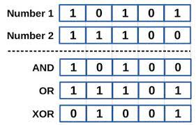
  - **AND** both must be true. '1'.
  - **OR** only one needs to be true. '1'.
  - **XOR** only a true and false = '1'.;
- **Authentication**: It is the process of verification of the identity of the person.;
- **Encryption**:
  - simplest terms, changing plaintext into ciphertext.
  - encryption should be done at rest and in transit.;
- **Decryption**: changing ciphertext into plaintext.;
- **Authorization**: It refers to the process of granting or denying access to a network resource or service. Most of the computer security systems that we have today are based on a two-step mechanism. The first step is authentication, and the second step is authorization or access control, which allows the user to access various resources based on the user’s identity.;
- **Confidentiality or privacy**: It means the assurance that only authorized users can read or use confidential information. When cryptographic keys are used on plaintext to create ciphertext, privacy is assigned to the information.;
- **Integrity**: Integrity is the security aspect that confirms that the original contents of information have not been altered or corrupted. There should be not any kind of modification with information while its transport over the network.;
- **Non-repudiation**: Non-repudiation makes sure that each party is liable for its sent message. Prevents someone from communicating and then denying it occurred, occurred at a different time, or even deny receiving any piece of information.;
- **Monoalphabetic Cipher**: code or substitution is where a single mapping from our alphabet to a cipher alphabet is created. Many early cryptosystems used this.;
- **Polyalphabetic Cipher**:
  - refers to the mapping of our alphabet to a number of cipher alphabets. This approach added a bit of complexity to early cryptosystems.
  - In a polyalphabetic cipher, each letter can be replaced by multiple ciphertext letters based on its position within the plaintext. The Vigenère cipher is an example of a polyalphabetic cipher.;
- **Pigpen Cipher**:
  - 
  - Mono-alphabetic substitution cipher that makes use of mapping plaintext characters to graphical characters rather than to alphabetic. ones. i.e. A=(pick a symbol), vs A=(pick a letter). Disadvantage -once the mapping is known, it is difficult to keep the message secret.;
- **Rail Code Cipher**:
  - 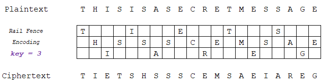
  - Employs a method to scramble text by writing it in a sequence across a number of rails.;
- **BIFID Cipher**:
  - 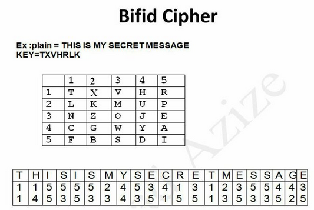
  - Makes use of a grid and which maps the letters into numeric values.;
- **Playfair Cipher**:
  - 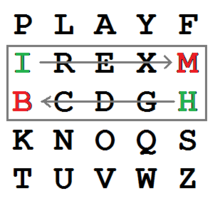
  - The Playfair cipher uses a 5×5 grid of letters, and encrypts a message by breaking the text into pairs of letters and swapping them according to their positions in a rectangle within that grid "HI" becomes "BM".;
- **Morse Code Cipher**:
  - 
  - Encoding method, rather than a cipher, that works by translating characters into sequences of dots (.) and dashes (-).;
- **Caesar Cipher**:
  - 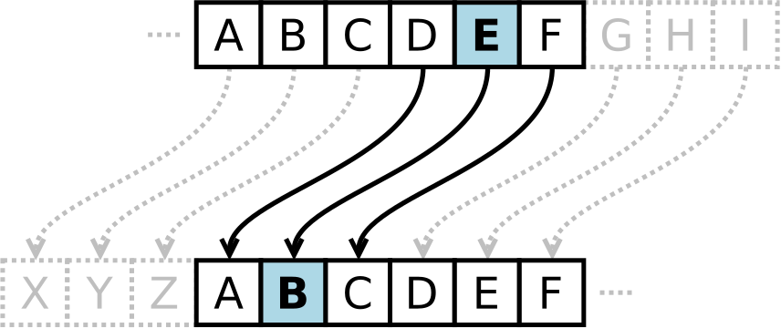
  - Mono-alphabetic substitution cipher known as "shift" cipher. Involves plaintext being replaced by a letter some fixed number of positions down the alphabet. i.e., a Caesar Cipher using a shift of +3 would mean a plaintext letter A would result in a ciphertext letter D (a shift of three positions to the right in the alphabet).;
- **Vigenere Cipher**:
  - 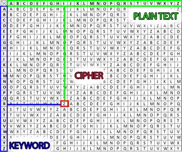
  - Polyalphabetic cipher that involves using a different mapping, based on a keyword, for each character of the cipher. An advantage of this type of cipher is that the same plaintext character is likely to be coded to different mappings, depending on the position of the keyword, making guessing more difficult.;
- **One Time Pad Cipher**:
  - 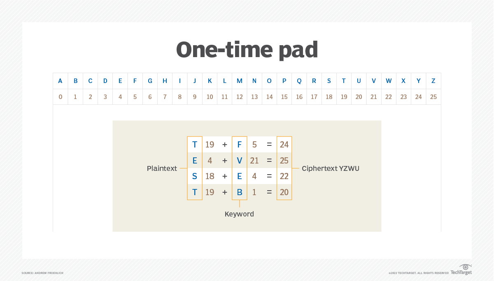
  - Cipher code mapping that is used only once. Advantage is it is essentially unbreakable, disadvantage is it takes lots of work as you'd have to generate the pad to be used, each time.;
- **Four-square Cipher**:
  - 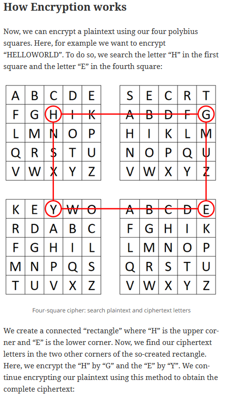
  - Uses four 5 × 5 matrices arranged in a square, are where each matrix contains 25 letters for encoding and decoding operations.;
- **Enigma Machine**: Used a polyalphabetic substitution cipher, which did not repeat within a reasonable time period, along with a secret key. For the cracking of the Enigma cipher, the challenge was thus to determine both the algorithm used and the key. Enigma’s main weakness, though, was that none of the plain text letters could be ciphered as itself.;
- **Digital Signatures**: Authentication and Non-repudiation.
  1. Sender encrypts hash of media with private key.
  2. Receiver decrypts signature with senders public key and compares hash of media with decrypted hash of signature
  3. If both match, only the sender could sign media and media integrity is assured.;
- **Pseudo-Random Number Generators (PRNGs)**: This method repeats the random numbers after a given time (periodic). They are fast and are also deterministic and are useful in producing a repeatable set of random numbers.;
- **True Random Number Generators (TRNGs)**:
  - This method generates a true random number and uses some form of random process. One approach is to monitor the movements of a mouse pointer on a screen or from the pauses between keystrokes.
  - Overall, the method is generally slow, especially if it involves human interaction, but is **non-deterministic** and **aperiodic**.;
- **Frequency Analysis**: cipher cracking methodology that involves identifying patterns and **variations in the probability** of codes.
  - example. a three-letter ciphered text combination spotted at the beginning of a string too often could tip us off that those three letters correlate the letters THE in the English alphabet.;
- **Entropy**: measures level of unpredictability in encryption relates to the degree of uncertainty of the encryption process.
  - more entropy, harder to crack.;
- **Two common binary to character encoding methods**:
  1. ASCII (8-bit values, up to 256 characters)
  2. UTF-16 (16- bit values, up to 65,536 characters).;
- **Hardware vs Software encryption**: Hardware encryption is more efficient than software encryption.;
- **hardware security module (HSM)**: is a tamper-evident and intrusion-resistant physical device that safeguards and manages cryptographic keys and provides cryptographic processing.;
- **trusted platform module (TPM)**: is a dedicated processor that handles hardware-level encryption allows the use of full disk encryption on a hard drive in a manner that minimizes the impact on system performance. TPM contains the encryption keys.;

## Section 2

- **Secret-Key Encryption**: Symmetric encryption. One key (de/en)crypts.
  - Since the same key is used for both encryption and decryption in symmetric cryptography, a challenge that exists is finding a secure way to share or transport the key between the entity encrypting and the one decrypting.;
- **Public-Key Encryption**: Asymmetric encryption. Two keys. Public/Private. Only public key can decrypt private key. Only private key can decrypt public key. Authenticate Identities. Pass Secret-Keys.;
- **Diffie-Hellman**: fundamental cryptographic protocol used to establish a secure shared secret between two parties over an insecure communication channel.;
- **Symmetric Block Encryption**:
  - grouping data into blocks and encrypting the individual blocks.
  - padding is used to fill blocks to operating size when the data does not fit perfectly.
  - Symmetric block ciphers manage how blocks of data are processed through block cipher mode implementations. For instance, one may choose to use the DES block cipher configured with ECB as the mode of operation.
  - Common block cipher modes covered in this course include ECB, CBC, CFB, OFB, and CTR.
  - CTR can be run in parallel(do not rely on the previous block) and essentially allow the block cipher to operate like a stream cipher.;
- **Symmetric Stream Encryption**: much faster than block and can typically be applied in real-time applications. symmetric stream encryption involves encrypting one bit at a time, i.e., a synchronous stream.;
- **Work Factor**:
  - All current cipher codes are crackable and a measure of the security of a code is the amount of time it would take to break the code based on the computational power available. This is often referred to as the work factor. As processing power magnifies, security of current ciphers decreases.;
  - **Salting**: is the process of adding an initialization vector to the ciphering process to change its operation and ensure that the ciphertext does not give the original plaintext when played back.;
  - **Describe Block Cipher**:
    - 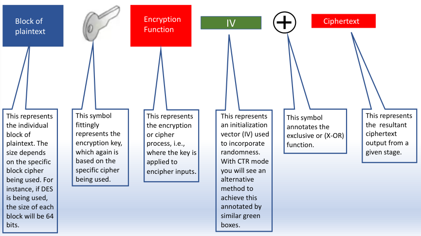
    - Outline how the blocks will be handled depending on the implementation selected (i.e., which mode is used). Implementation selection can be based on anything just as type of cipher can. Factors can include security needs or not, processing capacity, organization preference and so on.;
- **Electronic Code Book Cipher (EBC)**:
  - 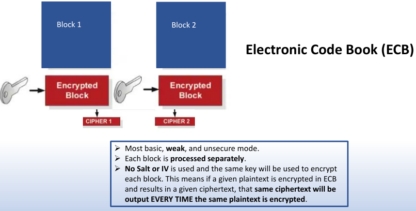
  - 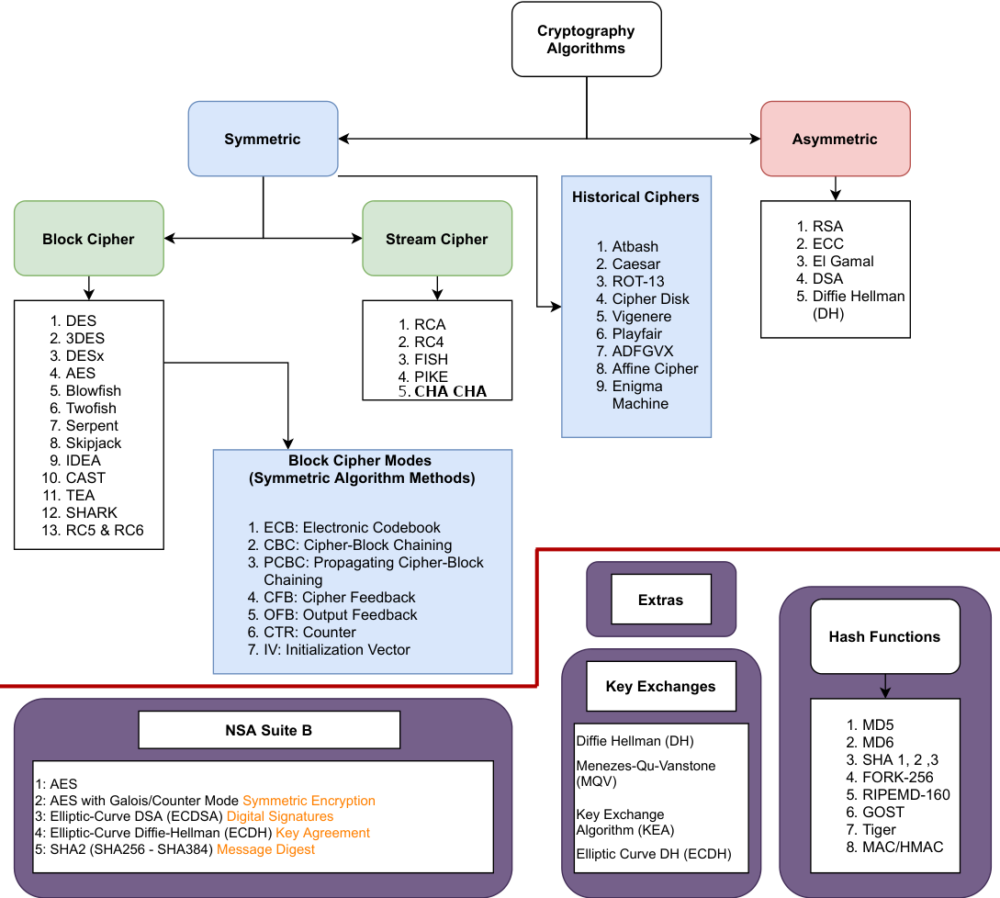;
- **Cipher Block Chaining (CBC)**:
  - 
  - ;
- **Cipher Feedback (CFB)**:
  - 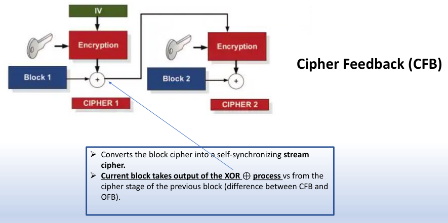
  - ;
- **Output Feedback (OFB)**:
  - 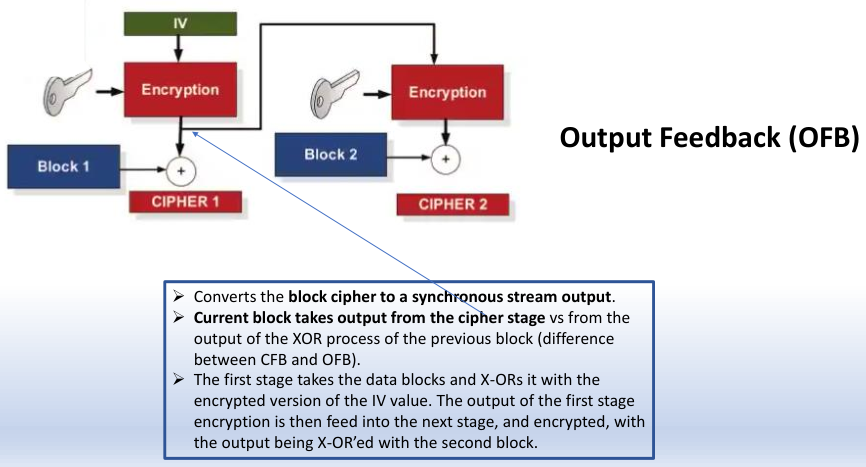
  - ;
- **Counter Mode Cipher**:
  - 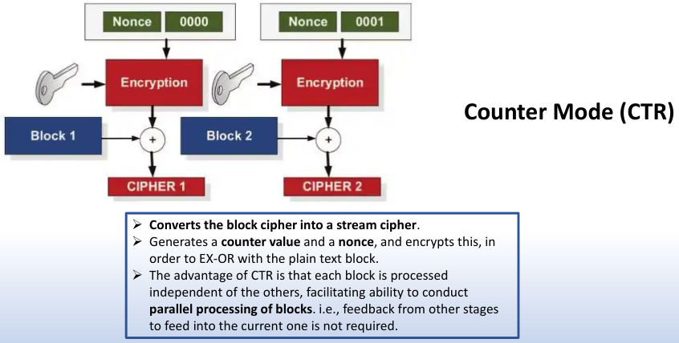
  - ;
- **Explain RC4, CHA CHA Symmetric Stream Ciphers**:
  - **RC4**. (stream cipher) – used in SSL and WEP.
  - **CHA CHA**. stream cipher.;
- **Explain MD5, SHA Hashes**:
  - **MD5**. 128 bit hash.
  - **SHA 1, 256, 3**. 1(160 bit), 256(192 bit), 3(224, 256, 384, and 512 bit);
- **Explain DES, 3DES, RC2, RC4, IDEA, and AES Symmetric Block Cipher**:
  - **DES**. (56 bit key size, 64 bit block size).
  - **3DES**. (112 bit key size, 64 bit block size).
  - **RC2**. (40-bit key size, 64-bit blocks).
  - **RC5**. (variable key size, 32, 64 or 128-bit block sizes).
  - **IDEA**. (128 key size, 64 bit block size).
  - **AES**. (128, 192 or 256-bit key size, 128-bit block size).;
- **Explain RSA, DSA and ElGamal Asymmetric Ciphers**:
  - **RSA**.
  - **DSA**.
  - **ElGamal**. key signing.
  - **Cramer Shoup**. extends El Gamal but adds one-way hashing. ;

## Section 3

- **Explain Hashing**:
  - describes one-way or irreversible encryption used for protecting the integrity of data and in authentication applications.
  - Hashing is normally used to either hide the original contents of a message (such as hiding a password), or to check the integrity of data.
  - Hashing involves taking a variable length input and producing a fixed length output (message digest).
  - A weakness of one-way hashing is that the same piece of plaintext will result in the same ciphertext (unless salt is applied).;
- **Hah Collision**: occurs when two different input values that produce the same hash signature. Different files produce the same hash value, rare but possible. Collision attacks exploit this.
  - Also called **Hash Similar Context**, **Pre-image attack**, and **Hash Full context**.;
- **Apache-defined APR1 Hash**: format that addresses the problems of brute forcing an **MD5** hash, and basically iterates the hash value 1,000 times.;
- **SHA method**: does not have a salted value. SHA produces a 160-bit signature, thus can contain a larger set of hashed value than MD5, but because there is no salt it can be open to rainbow table attacks, and also brute force. (A rainbow table is a collection of precomputed hash values of actual plaintext passwords used for password cracking.);
- **HMAC**: is a message authentication code (MAC) that can be used to verify the integrity and authentication of the message. It involves hashing the message with a secret key, and thus differs from standard hashing, which is purely a one-way function.;
- **Passwords which use a hashed value can be cracked by**: either with rainbow tables or brute force. An improved method of generating passcode is to generate a different one each time based on an initial seed value or based on time. One Time Passwords, Timed One Time Password, Hashed One Time Password.;
- **One Time Passwords (OTP)**: This allows a new unique password to be created for each instance, based on an initial seed.;
- **Timed One Time Password (TOTP)**: This allows for a new unique passcode to be created for each instance, based on an initial seed and for a given time period.;
- **Hashed One Time Password (HOTP)**: This allows a new unique passcode to be created each instance, based on a counter value and an initial seed.;
- **Time Stamp Protocol (TSP)**: cryptography method to give a verifiable method that a data entity was created at a defined time.;

## Section 4

- **Advantage of Signing**: file integrity. sender non-repudiation.;
- **Explain Public/Private Keys**:
  - The public key can only decrypt a private key encryption and the private key can only decrypt a public key encryption. They are mathematically linked this way.
  - It's like a lockbox that has two types of keys(public/private). Only one person has the ability to open the lock(private key), many people have the ability to lock it(public key). Any person w/public key can put something in the lockbox and lock it, but only the person w/ the private key can open it.;
- **5 Steps to Signing**:
  1. Sender creates hash of file and encrypts hash with private key(Signed).
  2. Client contacts Sender asking for file and passing along Client's public key. Sender encrypts file and signature with the Clients public key(now only the Clients private key can decrypt message. privacy).
  3. Client decrypts message with it's private key. Inside is the file and the encrypted signature.
  4. Client then decrypts Sender signature with Senders public key(non-repudiation).
  5. Client computes hash of message and compares this to the Sender's hash of original file. If both match, file integrity is assured.;

## Section 5

- **How was the sharing of secret keys solved**:
  - The major problem of secret-key encryption is how to pass the key between the entity encrypting and the entity decrypting. The two main methods for key exchange in symmetric cryptography is to (1) use a key exchange algorithm (such as Diffie-Hellman) or (2) encrypt the key with the recipient’s public key, pass it to the other side and then allow the recipient use their private key to decrypt it i.e., via public key encryption.
  - Diffie-Hellman is a widely used key exchange algorithm used to exchange the secret key in symmetric cryptography.;
- **Forward Secrecy**: An important concept within key exchange is the usage of forward secrecy, which means that a compromise of the long-term keys will not compromise any previous session keys.;
- **Sesson Key**: one time use key for each session(log-in, log-out).;
- **Emphemral Keys**: One time use. Temporary key. Throw away. With ephemeral key methods, a different key is used for each connection, and, again, the leakage of any long-term key would not cause all the associated session keys to be breached.;
- **DHE_EXPORT Downgrade Attack**:
  - A weakness discovered in Diffie Hellman is that it is fairly easy to precompute values for two popular Diffie-Hellman parameters (and which use the DHE_EXPORT cipher set).
  - The DHE_EXPORT Downgrade attack involves forcing the key negotiation process to default to 512-bit prime numbers. For this the client only offers DHE_EXPORT for the key negotiation, and the server, if it is setup for this, will accept it. The precomputation of 512-bit keys with g values of 2 and 5 (which are common) are within a reasonable time limits.;
- **Methods to combat DHE_EXPORT Downgrade attacks**: on Diffie Hellman include:
  1. Disabling Export Cipher Suites negotiation.
  2. Using (Ephemeral) Elliptic-Curve Diffie-Hellman (ECDHE).
  3. Use a strong group. Diffie Hellman has three groups (bases): Group 1, Group 3 or Group 5, which vary in the size of the prime number used.;
- **Diffie-Hellman man in the middle attack**: methods have been used extensively to create a shared secret key but suffers from man-in-the-middle attacks, where an attacker sits in-between and passes the values back and forward and negotiates two keys: one between a sender and the attacker, and the other between the receiver and the attacker. An improved method is to use public key encryption.;
- **Diffie-Hellman strength relates to what**: the size of the prime number bases which are used in the key exchange. bigger, better(longer to crack).;

## Section 6 Certificate Management

- **Common Certificate Applications**: Server authentication, Client authentication, Code signing, Email signing, Time stamping, IP security, Windows hardware driver verification, Smart card logon, Document signing, Public key transport.;
- **Common Certificate Types**: IKE, PKCS #7, PKCS #10, RSA signatures, X.509v3;
- **Pubic-Key Cryptography Standards (PKCS) #5, #7, #10, #12**:
  - **PKCS #5** Used for password-based encryption.
  - **PKCS #7** Used to sign and/or encrypt messages for PKI.
  - **PKCS #10** A standard format used for requesting digital certificates from certificate authorities.
  - **PKCS #12** Used to bundle a private key with its X.509 certificate or to bundle all the members of a chain of trust.;
- **What is Certificate Revocation List (CRL) and who publishes it**:
  - Certificates listed here cannot be trusted.
  - CRL must be published by the CA who originally generated the targeted certificates.;
- **Certificate Revoked**: private key breach.;
- **Certificate Hold**: investigation has show that it is possible breach of private key.;
- **Certificate Revocation Key Compromise**: This defines that the private key has been compromised.;
- **Certificate Revocation CA Compromise**: This defines that the CA has been compromised.;
- **Certificate Revocation Affiliation Changed**: This defines that the certificate affiliation defined within the certificate has changed.;
- **Certificate Revocation Superseded**: This defines that there is an updated certificate, and that this certificate is not valid any more.;
- **Certificate Revocation Cessation Of Operation**: This defines a generic reason of a termination of the certificate, such as where a company has gone in liquidation.;
- **Certificate Revocation Certificate Hold**: This defines where a hold is placed on a certificate.;
- **Certificate Revocation Remove from CRL**: This is where a remove is defined from the list.;
- **Certificate Revocation Privilege Withdrawn**: This defines where a privilege to sign certificates has been removed.;

## Section 7 Tunneling

- **Most common tunneling protocols**:
  - PPTP. Point-to-point tunneling protocol. Created by Microsoft.
  - L2TP. Layer 2 Tunneling protocol. Cisco Microsoft, Ascent and 3Com created it. Layer 2 protocol.
  - IPSec. VPN protocol. Open standard. Encryption and Authentication.;
- **SSL Risk**:
  - SSL v2. to comply with government export regulations, they were made weak and crackable.
  - DROWN, POODLE, FREAK all make SSL crackable.;
- **SSL/TLS**: creates tunnel w/ symmetric key(AES or RC4). Hash is created with MD5 or SHA.;
- **VPN**: tunnel over public network.;
- **IPSec ESP, ESP Tunnel/Transport Mode**:
  - encapsulated security protocol. encrypts payload.
  - Transport Mode. only payload is encrypted. Has a weakness with replay attack. fix with Tunnel mode.
  - Tunnel mode. whole packet is encrypted and new IP is added to it.;
- **IPSec AH, AH with Tunnel/Transport Mode**:
  - Authentication Header.
  - Transport mode. AH header inserted between ip and packet. does not encrypt anything. just verifies authenticity.
  - Tunnel Mode. new ip header and AH is added on. packet is unchanged. does not encrypt anything. only used for verifying authenticity.;
- **IPSec Transport Mode**: end-to-end encryption. only payload is encrypted. device to device, so even the network can't see traffic;
- **IPSec Tunnel Mode**: complete packet is encrypted and new header is attached to packet. only encrypted once leaves network;
- **IPSec Port**: UDP 500. Key exchange. IP Protocol has the value 50 defined in IP header for ESP and 51 for AH.;
- **Internet Key Exchange (IKE)**: how IPSec does handshake to agree on auth methods. ;
- **Onion Router**: routing using only subscriber computers instead of publicly available ones.;
- **TOR network**: network of computers around the world that route traffic. Each hop reduces a persons ability to track you.;

## Section 8 Crypto Cracking

- **Two backdoors in cryptography**:
  - the two main methods which could be used are
  - **Key escrow**. This is where a copy of the encryption key is kept in escrow so that it can be used by a government agent.
  - A **NOBUS (‘nobody but us’)** backdoor. This is where it is mathematically possible for government agents to crack the encryption, but no-one else can.;
- **Exhaustive search Cipher Attack**: Where the intruder uses brute force to decrypt the ciphertext and tries every possible key.;
- **Known plaintext Cipher Attack**: Where the intruder knows part of the ciphertext and the corresponding plaintext. The known ciphertext and plaintext can then be used to decrypt the rest of the ciphertext.;
- **Man-in-the-middle Cipher Attack**: Where the intruder is hidden between two parties and impersonates each of them to the other.;
- **Chosen-ciphertext Cipher Attack**: Where the intruder sends a message to the target, this is then encrypted with the target’s private key and the intruder then analyses the encrypted message. For example, an intruder may send an e-mail to the encryption file server and the intruder spies on the delivered message.;
- **Active Cipher Attack**: Where the intruder inserts or modifies messages.;
- **The replay system Cipher Attack**: Where the intruder takes a legitimate message and sends it into the network at some future time.;
- **Cut-and-paste Cipher Attack**: Where the intruder mixes parts of two different encrypted messages and is able to create a new message. This message is likely to make no sense but may trick the receiver into doing something that helps the intruder.;
- **Time resetting**: Some encryption schemes use the time of the computer to create the key. Resetting this time or determining the time that the message was created can give some useful information to the intruder.;
- **Time Cipher Attack**: This involves determining the amount of time that a user takes to decrypt the message; from this the key could be found.;
- **AES poor implementation of the encryption method**: leaves it susceptible to attacks such as: Brute force, use of Non-Random Numbers, and copy-and-paste.;
- **RSA suffers from**: several weaknesses and is susceptible to numerous attacks and cracking methods.;

## Section 9 Light-Weight Cryptography

- **Why is light-weight cryptography needed**:
  - Most conventional cryptosystems require too much processing power; too much physical space; and consume too much battery power for implementation in IoT, embedded SYSTEMS, and RFID.
  - Light-weight cryptography essentially consists of cryptosystems able to support IoT, embedded systems, RFID etc. (i.e. provide cryptographic functions but require less processing power, physical space, and battery power than conventional cryptosystems).
- **NIST Device Spectrum**:
  - **Conventional cryptography**. Servers and Desktops. Tablets and smart phones.
  - **Light-weight cryptography**. Embedded Systems. RFID and Sensor Networks.;
- **Quantum computers**: have fast multiplication circuits, and thus can be used to perform multiplications and search a range of prime numbers at a speed which would break most existing RSA implementations.;
- **Merkle tree**: is a tree that defines each non-leaf node with a value or a label and contains a hash of its children. This builds a hash trees and is used to provide a verification of large-scale data structures.;
- **Lattice-based cryptography**: uses asymmetric cryptographic primitives based on lattices. It has been known about for several decades, and is now being investigated because of its quantum robustness, whereas many of the existing public key methods such as RSA and Diffie-Hellman cryptosystems can be broken with quantum computers
- **Light-Weight Crypto -PRESENT**:
  - Block Size. 64
  - Key Size. 80 or 128
  - Attributes. Relatively small key and block sizes. Uses an SPN (substitution permutation network) method. **One of the 1st considered as an AES replacement for use in light-weight implementations**.;
- **Light-Weight Crypto -XTEA**:
  - Block Size. 64
  - Key Size. 128
  - Attributes. Relatively small key and block sizes and variable rounds setting. Operates with just a just a few lines of code. **Fast speed**.;
- **Light-Weight Crypto -RC5**:
  - Block Size. 32, 64, or 128
  - Key Size. 0-2048
  - Attributes. Variable block size, key size, and rounds. Can be optimized to IoT devices. **Conventional method suitable for light-weight implementations**.;
- **Light-Weight Crypto -SIMON**:
  - Block Size. 32, 48, 64, 96, 128
  - Key Size. 64, 72, 96, 128, 144, 192 or 256
  - Attributes. Variable block sizes key sizes, and rounds. **Optimized for hardware implementations**.;
- **Light-Weight Crypto -SPECK**:
  - Block Size. 32, 48, 64, 96 or 128
  - Key Size. Variable
  - Attributes. Variable block sizes key sizes, and rounds. **Optimized for software implementations**.;
- **Light-Weight Crypto -CLEFIA**:
  - Block Size. 128
  - Key Size. 128, 192 and 256
  - Attributes. Variable key size and rounds.;
- **Light-Weight Crypto -Rabbit**:
  - Hash Value. 128
  - IV Size. 64;
- **Light-Weight Crypto -Mickey v2**:
  - Hash Value. 80
  - IV Size. Variable up to 80;
- **Light-Weight Crypto -Trivium**:
  - Hash Value. 80
  - IV Size. 80;
- **Light-Weight Crypto -Grain**:
  - Hash Value. 80
  - IV Size. 64;
- **Light-Weight Crypto -Enocoro**:
  - Hash Value. 128
  - IV Size. 64;
- **Quark**:
  - Hash Value. 64 or 112.
  - Small memory footprint and have a target an input of just 256 characters (whereas typical hash functions support up to 264 bits). Can be used for hashing and in stream encryption.;
- **Chaskey**:
  - Key Size. 128
  - Light-weight cryptography method for signing messages (MAC). Relatively undemanding hardware implementation (only ~3,333 gates required at 1MHz clock rate) making it suitable for IoT implementation.;

## Section 10 Blockchain and Crypto-Currency

One of the most popular crypto-currencies is Bitcoin (BTC). A key focus is for the crypto-currency to protect against someone spending
money that they do not have, so Bitcoin uses Blockchain.
➢ Blockchain is a publicly available ledger of transactions that allows the Bitcoin network to know the number of bitcoins that a given
user has in their account. Can be public or private.
➢ A blockchain mining process where a new block of transactions is added to the blockchain and transactions within the block are
considered to be processed occurs every 10 minutes or so.
➢ Conventional currencies usually have a central bank that creates money and then controls its supply. The Bitcoin currency is instead
created when users mine for it, using their computers to perform complex calculations through special software.
➢ Bitcoin transactions will be captured by miners who will compile a list of the latest transactions. If valid, the transaction is then recorded
within a mining process, where mining nodes gather new transactions and compute a hash of the new block, and which should also
contain the hash of the previous block, and then build a transaction log. Once complete, this becomes part of the official Blockchain in
the network, and the miners reach a consensus on the current Blockchain. Miners receive rewards for successful mining efforts.
➢ The crypto currency Ethereum was built on the Bitcoin/Blockchain concept but included the concept of smart contracts.
➢ Within Ethereum applications we define the concept of gas. This is basically the unit that is used to measure the amount of work that is
required to perform a single Keccak-256 hash.
➢ Smart contracts are programs stored on a blockchain that run when predetermined conditions are met; they typically are used to
automate the execution of an agreement so that all participants can be immediately certain of the outcome, without an intermediary's
involvement or time loss.
➢ Along with creating a new currency (Ether), the main contribution of Ethereum is to create the concept of peer-to-peer smart contracts
which enables users to create their own contracts, and which will be strictly abided to.
➢ Although Bitcoin, Ethereum, and Hyperledger all use blockchain, Ethereum, and Hyperledger are considered “common” options for
implementing blockchain for this course. Hyperledger and Ethereum offer the smart contracts feature..
