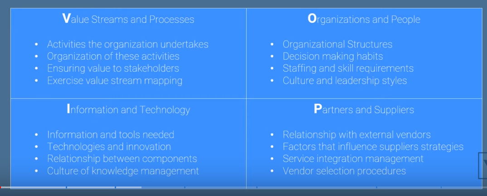
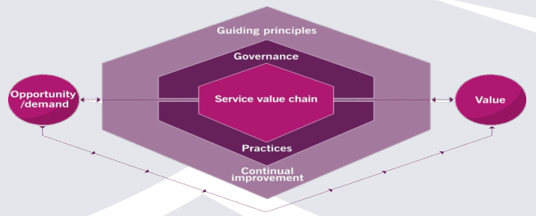
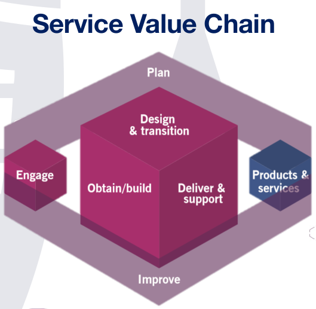
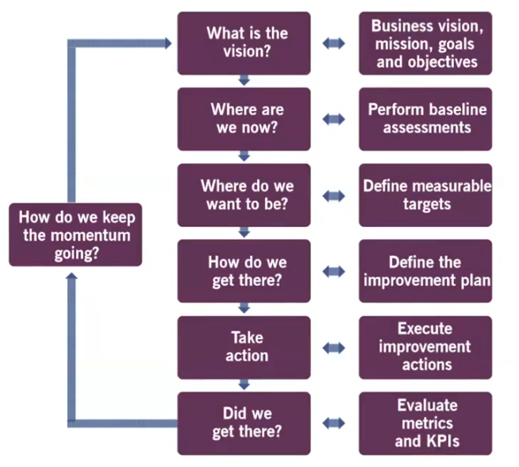
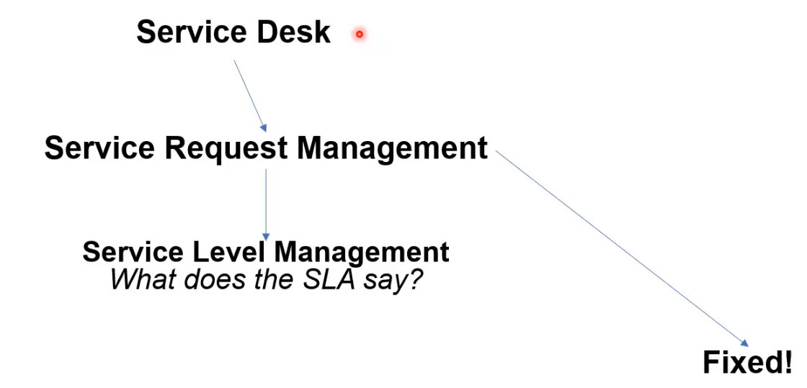

# D336 Business of IT Applications ITIL 4 Foundations Exam

## Tips

- ITIL Foundation ITIL 4 Edition.
- <https://www.reddit.com/r/WGU/comments/1bf1v17/best_resources_for_itil_4_foundation/>
- <https://www.reddit.com/r/WGU/comments/17waubz/summary_business_of_it_applications_d336_passed/>
  - <https://www.youtube.com/playlist?list=PLVzkjYR3xN1V9nlcECuygEZVlS4rj5qaf>
  - <https://www.youtube.com/playlist?list=PLVzkjYR3xN1Veghx7WyvEL34y9vLlyKGO>
- <https://www.reddit.com/r/WGUIT/comments/155p7nt/passed_business_of_it_applications_d336_in_2_days/>
  - cybervista practice test
- <https://www.reddit.com/r/WGU/comments/1074p4j/passed_business_of_it_applications_d336_itilv4/>
- [Jason Dion ITIL4 practice exams](https://wgu.udemy.com/course/itil-4-foundation-practice-certification-exams-6-exams-q/#content)
- [ITIL 4 exam practice questions](https://www.youtube.com/watch?v=SuSC7qHbaqE)
- [ITIL 4 exam practice questions](https://www.youtube.com/watch?v=-_JNP3NT3b4)
- <https://www.axelos.com/certifications/itil-service-management/itil-4-foundation>
  - 40 questions
  - Multiple choice
  - 26 out of 40 marks required to pass (65%)
  - 60 minutes
  - Closed book.

## 1.1 Syllabus listed definition (2 questions on ITIL 4 exam)

- **customer**
  - The role that **defines the requirements for a service** and takes responsibility for the outcomes of service consumption.
  - customer: takes a service, and uses it for their own purposes.
  - user: end user of service.
  - sponsor: provides the money.
  - e.g. purchase phone:
    - customer: takes phone and uses it to make calls, text...
    - user: end user of phone.
    - sponsor: pays for the monthly phone plan.
- **service**
  - A means of enabling value co-creation by **facilitating outcomes that customers wants**, without the customer having to manage specific costs and risks.
  - The customer does not want to worry about how the service gets to them. customer doesn't care how the company manages risk, compliance..., they just want the service.
- **service management**
  - A set of specialized **organizational capabilities for enabling value** for customers in the form of services.
  - Anything that distinguish's the company(culture, products, people).
- **sponsor**
  - The role that **authorizes budget** for service consumption. Can also be used to describe an organization or individual that provides financial or other support for an initiative.
- **user**
  - end **user of services**.
- **utility**
  - The **functionality** offered by a **product or service** to meet a particular need. Utility can be summarized as ‘what the service does’ and can be used to determine whether a service is ‘fit for purpose’. To have utility, a service must either support the performance of the consumer or remove constraints from the consumer. Many services do both.
- **warranty**
  - Assurance that a product or service will **meet agreed requirements**. Warranty can be summarized as ‘how the service performs’ and can be used to determine whether a service is ‘fit for use’. Warranty often relates to service levels aligned with the needs of service consumers. This may be based on a formal agreement, or it may be a marketing message or brand image. Warranty typically addresses such areas as the availability of the service, its capacity, levels of security, and continuity. A service may be said to provide acceptable assurance, or ‘warranty’, if all defined and agreed conditions are met.

## 1.2 Key Concepts of creating value (2 questions on ITIL 4 exam)

- **Cost**
  - amount spent.
- **Value**
  - **perceived** benefit, usefulness, importance.
- **Organization**
  - person or group with it's own functions(utility, value for customer).
- **Outcome**
  - result for stakeholder.
  - what the customer does with service(output).
- **Output**
  - deliverable of a service.
  - organization output is **delivered to customer**. What the customer does with the service(outcome).
- **Risk**
  - **possible** events that could cause harm or loss.
- **Utility**
  - **functionality** that meets a need.
- **Warranty**
  - assurance that requirements will be met.

## 1.3 Key Concepts of Service Relationships (1 question on ITIL 4 exam)

- **Service Offering**
  - goods: ownership is transferred to consumer.
  - resources: ownership is **not** transferred. e.g. rent/lease vehicle.
  - service actions: actions performed by provider. e.g. roadside assistance.
- **Service Relationship Management**
  - service relationship: a co-operation between a service provider and a service consumer.
  - joint activities between provider and consumer to ensure continued co-creation.
- **Service Provision**
  - providing service.
- **Service Consumption**
  - consuming service.

## 2.1 Use and Interaction of the Guiding Principles (1 question on ITIL 4 exam)

- **Nature, Use and Interaction of Guiding Principles**
  - guidelines to help make decisions, especially when you don't know what decision to make.
  - allows you to be consistent, in decision making.

## 2.2 Seven Guiding Principles (5 questions on ITIL 4 exam)

- **7 Guiding Principles**
  - mnemonic: **Fiasco(h)**
    - **F** - Focus on Value
    - **I** - Progress iteratively with feedback
    - **A** - Start Where You Are
    - **S** - Keep it Simple and Practical
    - **C** - Collaborate and Promote Visibility
    - **O** - Optimize and Automate
    - **(h)** - Think and Work Holistically
  - recommendations that guide organization in any circumstances.
    1. **Focus on Value**: all activities should **link back to value**. **better customers experience**.
    2. **Start Where you are**: do not start from scratch without considering what you already have and leverage it.
    3. **Progress Iteratively with feedback**: do not attempt to do everything at once. Organize work into smaller manageable units(agile), then get feedback from customers, stakeholders.
    4. **Collaborate and Promote Visibility**: **inclusion**. everyone on board and including in process.
    5. **Think and Work Holistically**: How our effort helps the whole. No single service stands alone. Value suffers unless we work in an integrated way. Avoid silo thinking.
    6. **Keep It Simple and Practical**: don't over complicate. If something fails to produce value, eliminate it.
    7. **Optimize and Automate**: prevents errors, speed up the value process.

## 3.1 Four Dimensions of Service Management (2 questions on ITIL 4 exam)

- **VOIP**
  - internal factors the we as service provider can influence. Activities we execute, to ensure value to our stakeholders and customers.
  - 
    1. **value streams & processes**: map creation process(steps) to service(value).
       1. activities organization undertakes. Organizing activities. Ensure value to stakeholder.
    2. **organization & people**: how organize people. structure of company. who makes decisions.
       1. roles, responsibilities, systems of authority and communication are well defined and supported.
    3. **information & technology**: information and tools. culture of knowledge management(knowledge in someones head, or properly documented).
    4. **partners and suppliers**: relationship with external vendors. service integration management.
- **PESTLE**
  - **external factors** that we cannot influence, but can influence the organization: **PESTLE**.
  - can constrain any of the four dimensions.
    - Political: trump as president makes policy.
    - Economical:
    - Social: how it effect peoples
    - Technological: latest tech.
    - Legal: country gets restricted(embargoed)
    - Environmental: green is good.

## 4.1 Service Value System (1 question on ITIL 4 exam)

- **Service Value System**
  - take **opportunity/demand and convert it into value**.
  - model representing how all the components and activities of an organization work together to create value.
  - opportunity/demand -> service value system -> value
  - Service Value System Components:
    - opportunity/demand: possibilities to add value for stakeholders.
    - value: outcome of SVS.
    - Guiding Principles: recommendations to guide organizations in an optimized way, converting demand into value.
    - Governance: the way an organization is directed/controlled.
    - Service Value Chain: interconnected activities organizations perform to deliver value.
    - Practices: set of organizational resources, designed to perform work or accomplish objective.
    - Continual Improvement: recurring activity to ensure performance aligns with stakeholder expectations.
  - 

## 5.1 How does Service Value Chain Support Value Streams (1 question ITIL 4 exam)

- **How does Service Value Chain Support Value Streams**
  - service value chain is about people(roles) and how the interconnect.
  - shows how parts of the service value chain(plan, improve...) work together.
  - 

## 5.2 Service Value Chain (1 questions on ITIL 4 exam)

- **Service Value Chain**
  - innermost part of the **Service Value System**. where demand is converted into value.
  - describes people and what they do.
  - Flexible model for the creation, delivery, and continual improvement of services.
  - Transforms demand into value.
  - Six main activities: **PIE DOD**
    1. Plan: manager. shared understanding of business needs.
       1. all planning done here.
       2. PLAN(improvements, contracts) -> ENGAGE.
    2. Improve: team. get feedback. continual improvement of product, services and practices.
       1. DELIVER & SUPPORT(service performance), ENGAGE(feedback) -> IMPROVE -> DESIGN & TRANSITION.
    3. Engage: salesman. stakeholder(anyone vested interest. e.g. customer) needs and continual engagement.
       1. performs all interactions with external services.
       2. ENGAGE(feedback) -> IMPROVE
    4. Design & Transition: developers. continually meets stakeholder expectations for quality, cost, time to market.
       1. all new internal product creation/modification done here.
       2. PLAN(portfolio, contracts), ENGAGE(feedback) -> DESIGN & TRANSITION -> OBTAIN/BUILD
    5. Obtain/Build: procurement dept. service components available when and where needed and meet specifications.
       1. all new resources go through obtain/build.
    6. Deliver & Support: shipping/help desk. meet deadline and expectation(SLA).
       1. OBTAIN/BUILD(new service components), IMPROVE(improvements) -> DELIVER & SUPPORT
  - 
  - 
- **Value Stream**
  - mapping the steps needed to create value for customers, stakeholders, then eliminate waste. LEAN.
  - To get value stream, you follow the six **Service Value Chain** steps.

## 6.1 Purpose of ITIL Practices (5 questions ITIL 4 exam)

- **Information Security Management**
  - protects information. leaking, hacking. confidentiality(private), integrity(only changed by authorized), availability(when we need it), authentication(you are who you say), non-repudiation(person/data cannot be changed without records).
- **Relationship Management**
  - establish, nurture links between the organization and stakeholders.
  - relationships are identified, modified and improved. lifecycle of relationship management.
- **Supplier Management**
  - organization suppliers performance/products are managed to support seamless service.
- **IT Asset Management**
  - plan/manage full lifecycle IT assets(printers, laptops...).
  - goal: maximize value, control cost, manage risk.
  - asset: **any financial valuable component. contributes to create product or services**.
- **Monitoring and Event Management**
  - observe/record/report changes of state(event).
  - event: **any change of state that has significance to business**.
- **Release Management**
  - new/changed services are available for use.
  - release: version of service/item made available for use.
  - release is decoupled from deployments. canary/dark release only available to small group.
- **Service Configuration Management**
  - ensure accurate configuration information is available about the services, the configuration items and their relationships.
  - CI (configuration item): any component that needs managed to deliver IT service.
  - CMDB (configuration management database): collection of databases holding CIs.
  - CMS (configuration management system): GUI for CMDB.
- **Deployment Management**
  - move any asset from test environment to live environment.
  - dev -> test -> prod

## 6.2 ITIL Terms (2 questions ITIL 4 exam)

- **IT Asset**
  - Any **financially valuable component** that can contribute to the delivery of an IT product or service.
- **Event**
  - Any change of state that has **significance** for the management of a service or other configuration item.
- **Configuration Item**
  - Any **component** that needs to be **managed** in order to deliver an IT service.
- **Change**
  - The **addition, modification, or removal** of anything that could have a direct or indirect effect on services.
- **Incident**
  - An **unplanned interruption** to a service or reduction in the quality of a service.
- **Problem**
  - A **cause, or potential cause**, of one or more **incidents**.
- **Known Error**
  - A problem that has been analysed but has **not been resolved**.

## 7.1 ITIL Practices in Detail (17 questions ITIL 4 exam)

- **What is a practice**
  - organizational resources to **perform work** or accomplish **objective**.
- **!Continual Improvement**
  - think AGILE. What is the vision of company(goals and objectives to achieve)?
  - **SVC, SVS, Practices** all have continuous improvement as part of it.
  - CIR (Continual Improvement Register): database/spreadsheet/document. manage/track/prioritize improvement ideas.
    - reprioritize when new ideas are added.
    - everyone/all levels are responsible for continual improvement.
  - all 4 dimensions need to be considered during improvement initiative.
  - mnemonic: **Vision Now, Where Get Action There**
  - 6 Steps of **Continual Improvement Model**. Rinse and repeat for continual improvement:
    1. what is our **vision**? business vision, goals.
    2. where are we **now**? perform baseline assessments.
    3. **where** do we want to be? define measurable targets.
    4. how do we **get** there? define improvement plan.
    5. take **action**? execute improvement plan.
    6. are we **there**? evaluate metrics, KPI's.
  - 
- **!Change Enablement**
  - performing proper risk assessment to maximize success and minimize failure when changing product/services.
  - 'change authority' authorizes change.
  - used by all but 'plan' and 'engage' from SVC.
  - Types: S-N-E
    - **Standard**: pre-authorized. low risk, low cost change. e.g. password change.
    - **Normal**: goes through normal change workflow. authorize -> schedule -> make change.
    - **Emergency**: needs rapid action. May need separate change authority.
- **!Incident Management**
  - **minimize negative impact** of incidents by restoring normal operation ASAP.
  - **swarming**: allocate multiple business resources towards problem.
  - engage and deliver and support(SVC) most likely to use.
  - used by all but 'plan' of the service value chain.
  - incident: unplanned interruption. Log, prioritize, manage through lifecycle. SLA defines what 'normal' is.
    - same categorization as 'Problem' tickets.
  - major accidents: separate procedure from normal incidents.
- **!Problem Management**
  - **reduce likelihood** of recurring incidents by identifying and **eliminating root cause**.
  - used by 'improve' and 'deliver and support' from SVC.
  - **problem**: unknown cause of **one or more incidents**.
  - **known error**: problem known, no solution.
  - **workaround**: alternate solution to reduce impact.
  - phases: **problem identify -> problem control -> error control(change enablement)**.
- **!Service Desk**
  - step 1. call the service desk -> service request management -> service level management.
  - capture demand for incident response and service request.
  - single point of contact between provider and consumer.
  - used by 'engage' and 'deliver and support' SVC.
  - capture demand for incidents and service request.
  - channels: email, phone, chat, text message, forums.
  - skills: **incident analysis, communication, emotional intelligence, customer service**.
  - 
- **!Service Request Management**
  - step 2. call the service desk -> service request management -> service level management.
  - support the user-initiated(stakeholders) needs(other than incident response) according to SLA.
  - normal part of service delivery. pre-defined, pre-agreed procedures.
  - used by 'engage' and 'deliver and support' SVC.
  - service request: formal request for something(e.g. need color monitor) not needing incident resolution.
  - steps to fulfill service request should be **well known**.
  - **re-use workflows** already in place.
  - 
- **!Service Level Management**
  - step 3. call the service desk -> service request management -> service level management.
  - set **clear business targets** for service performance, so delivery of service can be measured.
  - used by 'engage' and 'plan' from SVC.
  - SLA: business and client agreement for service. Service Level Management create/monitors SLA.
    - Watermelon Effect: monitoring the wrong SLA metrics, everything looks great, unhappy customers.
  - OLA: (organization level agreement). internal business units(teams) agreements between themselves.
  - UC: (under-pending contracts). business and external supplier.
  - recommendations: **clear language, simply written, defined outcomes**.
  - 

## Glossary Terms

- **acceptance criteria**
  - A list of minimum requirements that a service or service component must meet for it to be acceptable to key stakeholders.
- **Agile**
  - An umbrella term for a collection of frameworks and techniques that together enable teams and individuals to work in a way that is typified by collaboration, prioritization, iterative and incremental delivery, and timeboxing. There are several specific methods (or frameworks) that are classed as Agile, such as Scrum, Lean, and Kanban.
- **architecture management practice**
  - The practice of providing an understanding of all the different elements that make up an organization and how those elements relate to one another.
- **asset register**
  - A database or list of assets, capturing key attributes such as ownership and financial value.
- **availability**
  - The ability of an IT service or other configuration item to perform its agreed function when required.
- **availability management practice**
  - The practice of ensuring that services deliver agreed levels of availability to meet the needs of customers and users.
- **baseline**
  - A report or metric that serves as a starting point against which progress or change can be assessed.
- **best practice**
  - A way of working that has been proven to be successful by multiple organizations.
- **big data**
  - The use of very large volumes of structured and unstructured data from a variety of sources to gain new insights.
- **business analysis practice**
  - The practice of analysing a business or some element of a business, defining its needs and recommending solutions to address these needs and/or solve a business problem, and create value for stakeholders.
- **business case**
  - A justification for expenditure of organizational resources, providing information about costs, benefits, options, risks, and issues.
- **business impact analysis (BIA)**
  - A key activity in the practice of service continuity management that identifies vital business functions and their dependencies.
- **business relationship manager (BRM)**
  - A role responsible for maintaining good relationships with one or more customers.
- **call**
  - An interaction (e.g. a telephone call) with the service desk. A call could result in an incident or a service request being logged.
- **call/contact centre**
  - An organization or business unit that handles large numbers of incoming and outgoing calls and other interactions.
- **capability**
  - The ability of an organization, person, process, application, configuration item, or IT service to carry out an activity.
- **capacity and performance management practice**
  - The practice of ensuring that services achieve agreed and expected performance levels, satisfying current and future demand in a cost-effective way.
- **capacity planning**
  - The activity of creating a plan that manages resources to meet demand for services.
- **change**
  - The addition, modification, or removal of anything that could have a direct or indirect effect on services.
- **change authority**
  - A person or group responsible for authorizing a change.
- **change enablement practice**
  - The practice of ensuring that risks are properly assessed, authorizing changes to proceed and managing a change schedule in order to maximize the number of successful service and product changes.
- **change model**
  - A repeatable approach to the management of a particular type of change.
- **change schedule**
  - A calendar that shows planned and historical changes.
- **charging**
  - The activity that assigns a price for services.
- **cloud computing**
  - A model for enabling on-demand network access to a shared pool of configurable computing resources that can be rapidly provided with minimal management effort or provider interaction.
- **compliance**
  - The act of ensuring that a standard or set of guidelines is followed, or that proper, consistent accounting or other practices are being employed.
- **confidentiality**
  - A security objective that ensures information is not made available or disclosed to unauthorized entities.
- **configuration**
  - An arrangement of configuration items (CIs) or other resources that work together to deliver a product or service. Can also be used to describe the parameter settings for one or more CIs.
- **configuration item (CI)**
  - Any component that needs to be managed in order to deliver an IT service.
- **configuration management database (CMDB)**
  - A database used to store configuration records throughout their lifecycle. The CMDB also maintains the relationships between configuration records.
- **configuration management system (CMS)**
  - A set of tools, data, and information that is used to support service configuration management.
- **configuration record**
  - A record containing the details of a configuration item (CI). Each configuration record documents the lifecycle of a single CI. Configuration records are stored in a configuration management database.
- **continual improvement practice**
  - The practice of aligning an organization’s practices and services with changing business needs through the ongoing identification and improvement of all elements involved in the effective management of products and services.
- **continuous deployment**
  - An integrated set of practices and tools used to deploy software changes into the production environment. These software changes have already passed pre-defined automated tests.
- **continuous integration/continuous delivery**
  - An integrated set of practices and tools used to merge developers’ code, build and test the resulting software, and package it so that it is ready for deployment.
- **control**
  - The means of managing a risk, ensuring that a business objective is achieved, or that a process is followed.
- **cost**
  - The amount of money spent on a specific activity or resource.
- **cost centre**
  - A business unit or project to which costs are assigned.
- **critical success factor (CSF)**
  - A necessary precondition for the achievement of intended results.
- **culture**
  - A set of values that is shared by a group of people, including expectations about how people should behave, ideas, beliefs, and practices.
- **customer**
  - The role that defines the requirements for a service and takes responsibility for the outcomes of service consumption.
- **customer experience (CX)**
  - The sum of functional and emotional interactions with a service and service provider as perceived by a service customer.
- **dashboard**
  - A real-time graphical representation of data.
- **deliver and support**
  - The value chain activity that ensures services are delivered and supported according to agreed specifications and stakeholders’ expectations.
- **demand**
  - Input to the service value system based on opportunities and needs from internal and external stakeholders.
- **deployment**
  - The movement of any service component into any environment.
- **deployment management practice**
  - The practice of moving new or changed hardware, software, documentation, processes, or any other service component to live environments.
- **design and transition**
  - The value chain activity that ensures products and services continually meet stakeholder expectations for quality, costs, and time to market.
- **design thinking**
  - A practical and human-centred approach used by product and service designers to solve complex problems and find practical and creative solutions that meet the needs of an organization and its customers.
- **development environment**
  - An environment used to create or modify IT services or applications.
- **DevOps**
  - An organizational culture that aims to improve the flow of value to customers. DevOps focuses on culture, automation, Lean, measurement, and sharing (CALMS).
- **digital transformation**
  - The evolution of traditional business models to meet the needs of highly empowered customers, with technology playing an enabling role.
- **disaster**
  - A sudden unplanned event that causes great damage or serious loss to an organization. A disaster results in an organization failing to provide critical business functions for some predetermined minimum period of time.
- **disaster recovery plans**
  - A set of clearly defined plans related to how an organization will recover from a disaster as well as return to a pre-disaster condition, considering the four dimensions of service management.
- **driver**
  - Something that influences strategy, objectives, or requirements.
- **effectiveness**
  - A measure of whether the objectives of a practice, service or activity have been achieved.
- **efficiency**
  - A measure of whether the right amount of resources have been used by a practice, service, or activity.
- **emergency change**
  - A change that must be introduced as soon as possible.
- **engage**
  - The value chain activity that provides a good understanding of stakeholder needs, transparency, continual engagement, and good relationships with all stakeholders.
- **environment**
  - A subset of the IT infrastructure that is used for a particular purpose, for example a live environment or test environment. Can also mean the external conditions that influence or affect something.
- **error**
  - A flaw or vulnerability that may cause incidents.
- **error control**
  - Problem management activities used to manage known errors.
- **escalation**
  - The act of sharing awareness or transferring ownership of an issue or work item.
- **event**
  - Any change of state that has significance for the management of a service or other configuration item.
- **external customer**
  - A customer who works for an organization other than the service provider.
- **failure**
  - A loss of ability to operate to specification, or to deliver the required output or outcome.
- **feedback loop**
  - A technique whereby the outputs of one part of a system are used as inputs to the same part of the system.
- **four dimensions of service management**
  - The four perspectives that are critical to the effective and efficient facilitation of value for customers and other stakeholders in the form of products and services.
- **goods**
  - Tangible resources that are transferred or available for transfer from a service provider to a service consumer, together with ownership and associated rights and responsibilities.
- **governance**
  - The means by which an organization is directed and controlled.
- **identity**
  - A unique name that is used to identify and grant system access rights to a user, person, or role.
- **improve**
  - The value chain activity that ensures continual improvement of products, services, and practices across all value chain activities and the four dimensions of service management.
- **incident**
  - An unplanned interruption to a service or reduction in the quality of a service.
- **incident management**
  - The practice of minimizing the negative impact of incidents by restoring normal service operation as quickly as possible.
- **information and technology**
  - One of the four dimensions of service management. It includes the information and knowledge used to deliver services, and the information and technologies used to manage all aspects of the service value system.
- **information security management practice**
  - The practice of protecting an organization by understanding and managing risks to the confidentiality, integrity, and availability of information.
- **information security policy**
  - The policy that governs an organization’s approach to information security management.
- **infrastructure and platform management practice**
  - The practice of overseeing the infrastructure and platforms used by an organization. This enables the monitoring of technology solutions available, including solutions from third parties.
- **integrity**
  - A security objective that ensures information is only modified by authorized personnel and activities.
- **internal customer**
  - A customer who works for the same organization as the service provider.
- **Internet of Things**
  - The interconnection of devices via the internet that were not traditionally thought of as IT assets, but now include embedded computing capability and network connectivity.
- **IT asset**
  - Any financially valuable component that can contribute to the delivery of an IT product or service.
- **IT asset management practice**
  - The practice of planning and managing the full lifecycle of all IT assets.
- **IT infrastructure**
  - All of the hardware, software, networks, and facilities that are required to develop, test, deliver, monitor, manage, and support IT services.
- **IT service**
  - A service based on the use of information technology.
- **ITIL**
  - Best-practice guidance for IT service management.
- **ITIL guiding principles**
  - Recommendations that can guide an organization in all circumstances, regardless of changes in its goals, strategies, type of work, or management structure.
- **ITIL service value chain**
  - An operating model for service providers that covers all the key activities required to effectively manage products and services.
- **ITIL value chain activity**
  - A step of the value chain that an organization takes in the creation of value.
- **Kanban**
  - A method for visualizing work, identifying potential blockages and resource conflicts, and managing work in progress.
- **key performance indicator (KPI)**
  - An important metric used to evaluate the success in meeting an objective.
- **knowledge management practice**
  - The practice of maintaining and improving the effective, efficient, and convenient use of information and knowledge across an organization.
- **known error**
  - A problem that has been analysed but has not been resolved.
- **Lean**
  - An approach that focuses on improving workflows by maximizing value through the elimination of waste.
- **lifecycle**
  - The full set of stages, transitions, and associated statuses in the life of a service, product, practice, or other entity.
- **live**
  - Refers to a service or other configuration item operating in the live environment.
- **live environment**
  - A controlled environment used in the delivery of IT services to service consumers.
- **maintainability**
  - The ease with which a service or other entity can be repaired or modified.
- **major incident**
  - An incident with significant business impact, requiring an immediate coordinated resolution.
- **management system**
  - Interrelated or interacting elements that establish policy and objectives and enable the achievement of those objectives.
- **maturity**
  - A measure of the reliability, efficiency and effectiveness of an organization, practice, or process.
- **mean time between failures (MTBF)**
  - A metric of how frequently a service or other configuration item fails.
- **mean time to restore service (MTRS)**
  - A metric of how quickly a service is restored after a failure.
- **measurement and reporting**
  - The practice of supporting good decision-making and continual improvement by decreasing levels of uncertainty.
- **metric**
  - A measurement or calculation that is monitored or reported for management and improvement.
- **minimum viable product (MVP)**
  - A product with just enough features to satisfy early customers, and to provide feedback for future product development.
- **mission**
  - A short but complete description of the overall purpose and intentions of an organization.
- **model**
  - A representation of a system, practice, process, service, or other entity that is used to understand and predict its behaviour and relationships.
- **modelling**
  - The activity of creating, maintaining, and utilizing models.
- **monitoring**
  - Repeated observation of a system, practice, process, service, or other entity to detect events and to ensure that the current status is known.
- **monitoring and event management practice**
  - The practice of systematically observing services and service components, and recording and reporting selected changes of state identified as events.
- **obtain/build**
  - The value chain activity that ensures service components are available when and where they are needed, and that they meet agreed specifications.
- **operation**
  - The routine running and management of an activity, product, service, or other configuration item.
- **operational technology**
  - The hardware and software solutions that detect or cause changes in physical processes through direct monitoring and/or control of physical devices such as valves, pumps, etc.
- **organization**
  - A person or a group of people that has its own functions with responsibilities, authorities, and relationships to achieve its objectives.
- **organizational change management practice**
  - The practice of ensuring that changes in an organization are smoothly and successfully implemented and that lasting benefits are achieved by managing the human aspects of the changes.
- **organizational resilience**
  - The ability of an organization to anticipate, prepare for, respond to, and adapt to unplanned external influences.
- **organizational velocity**
  - The speed, effectiveness, and efficiency with which an organization operates. Organizational velocity influences time to market, quality, safety, costs, and risks.
- **organizations and people**
  - One of the four dimensions of service management. It ensures that the way an organization is structured and managed, as well as its roles, responsibilities, and systems of authority and communication, is well defined and supports its overall strategy and operating model.
- **outcome !important**
  - A result for a stakeholder enabled by one or more outputs.
  - when you meet all your goals, the 'outcome' is what you get.
- **output**
  - A tangible or intangible deliverable of an activity.
- **outsourcing**
  - The process of having external suppliers provide products and services that were previously provided internally.
- **partners and suppliers**
  - One of the four dimensions of service management. It encompasses the relationships an organization has with other organizations that are involved in the design, development, deployment, delivery, support, and/or continual improvement of services.
- **partnership**
  - A relationship between two organizations that involves working closely together to achieve common goals and objectives.
- **performance**
  - A measure of what is achieved or delivered by a system, person, team, practice, or service.
- **pilot**
  - A test implementation of a service with a limited scope in a live environment.
- **plan**
  - The value chain activity that ensures a shared understanding of the vision, current status, and improvement direction for all four dimensions and all products and services across an organization.
- **policy**
  - Formally documented management expectations and intentions, used to direct decisions and activities.
- **portfolio management practice**
  - The practice of ensuring that an organization has the right mix of programmes, projects, products, and services to execute its strategy within its funding and resource constraints.
- **post-implementation review (PIR)**
  - A review after the implementation of a change, to evaluate success and identify opportunities for improvement.
- **practice**
  - A set of organizational resources designed for performing work or accomplishing an objective.
- **problem**
  - A cause, or potential cause, of one or more incidents.
- **problem management practice**
  - The practice of reducing the likelihood and impact of incidents by identifying actual and potential causes of incidents, and managing workarounds and known errors.
- **procedure**
  - A documented way to carry out an activity or a process.
- **process**
  - A set of interrelated or interacting activities that transform inputs into outputs. Processes define the sequence of activities and their dependencies.
- **product**
  - A configuration of an organization’s resources designed to offer value for a consumer.
- **production environment**
  - See live environment.
- **programme**
  - A set of related projects and activities, and an organization structure created to direct and oversee them.
- **project**
  - A temporary structure that is created for the purpose of delivering one or more outputs (or products) according to an agreed business case.
- **project management practice**
  - The practice of ensuring that all an organization’s projects are successfully delivered.
- **quick win**
  - An improvement that is expected to provide a return on investment in a short period of time with relatively small cost and effort.
- **record**
  - A document stating results achieved and providing evidence of activities performed.
- **recovery**
  - The activity of returning a configuration item to normal operation after a failure.
- **recovery point objective (RPO)**
  - The point to which information used by an activity must be restored to enable the activity to operate on resumption.
- **recovery time objective (RTO)**
  - The maximum acceptable period of time following a service disruption that can elapse before the lack of business functionality severely impacts the organization.
- **relationship management practice**
  - The practice of establishing and nurturing links between an organization and its stakeholders at strategic and tactical levels.
- **release**
  - A version of a service or other configuration item, or a collection of configuration items, that is made available for use.
- **release management practice**
  - The practice of making new and changed services and features available for use.
- **reliability**
  - The ability of a product, service, or other configuration item to perform its intended function for a specified period of time or number of cycles.
- **request catalogue**
  - A view of the service catalogue, providing details on service requests for existing and new services, which is made available for the user.
- **request for change (RFC)**
  - A description of a proposed change used to initiate change enablement.
- **resolution**
  - The action of solving an incident or problem.
- **resource**
  - Personnel, material, finance, or other entity that is required for the execution of an activity or the achievement of an objective. Resources used by an organization may be owned by the organization or used according to an agreement with the resource owner.
- **retire**
  - The act of permanently withdrawing a product, service, or other configuration item from use.
- **risk**
  - A possible event that could cause harm or loss, or make it more difficult to achieve objectives. Can also be defined as uncertainty of outcome, and can be used in the context of measuring the probability of positive outcomes as well as negative outcomes.
- **risk assessment**
  - An activity to identify, analyse, and evaluate risks.
- **risk management practice**
  - The practice of ensuring that an organization understands and effectively handles risks.
- **service**
  - A means of enabling value co-creation by facilitating outcomes that customers want to achieve, without the customer having to manage specific costs and risks.
  - The customer does not want to worry about how the service gets to them. customer doesn't care how the company manages risk, compliance..., they just want the service.
- **service action**
  - Any action required to deliver a service output to a user. Service actions may be performed by a service provider resource, by service users, or jointly.
- **service architecture**
  - A view of all the services provided by an organization. It includes interactions between the services, and service models that describe the structure and dynamics of each service.
- **service catalogue**
  - Structured information about all the services and service offerings of a service provider, relevant for a specific target audience.
- **service catalogue management practice**
  - The practice of providing a single source of consistent information on all services and service offerings, and ensuring that it is available to the relevant audience.
- **service configuration management practice**
  - The practice of ensuring that accurate and reliable information about the configuration of services, and the configuration items that support them, is available when and where needed.
- **service consumption**
  - Activities performed by an organization to consume services. It includes the management of the consumer’s resources needed to use the service, service actions performed by users, and the receiving (acquiring) of goods (if required).
- **service continuity management practice**
  - The practice of ensuring that service availability and performance are maintained at a sufficient level in case of a disaster.
- **service design practice**
  - The practice of designing products and services that are fit for purpose, fit for use, and that can be delivered by the organization and its ecosystem.
- **service desk**
  - The point of communication between the service provider and all its users.
- **service desk practice**
  - The practice of capturing demand for incident resolution and service requests.
- **service financial management practice**
  - The practice of supporting an organization’s strategies and plans for service management by ensuring that the organization’s financial resources and investments are being used effectively.
- **service level**
  - One or more metrics that define expected or achieved service quality.
- **service level agreement (SLA)**
  - A documented agreement between a service provider and a customer that identifies both services required and the expected level of service.
- **service level management practice**
  - The practice of setting clear business-based targets for service performance so that the delivery of a service can be properly assessed, monitored, and managed against these targets.
- **service management**
  - A set of specialized organizational capabilities for enabling value for customers in the form of services.
  - Anything that distinguish's the company(culture, products, people).
- **service offering and Goods, Access to Resources, and Service Actions**
  - A formal description of one or more services, designed to address the needs of a target consumer group. A service offering may include goods, access to resources, and service actions.
    - **Goods**: transfer ownership to customer.
    - **Access to resources**: customer allowed to use it.
    - **Service Actions**: things the service provider does for the customer.
- **Service Manangement Key Concepts**
  - Key concepts of services and service management:
    a. Service: A means of enabling value co-creation by facilitating outcomes that customers want to achieve, without the customer having to manage specific costs and risks.
    b. Service management: A set of specialized organizational capabilities for enabling value for customers in the form of services.
    c. Customer: The role that defines the requirements for a service and takes responsibility for the outcomes of service consumption.
    d. User: The role that uses services.
    e. Sponsor: The role that authorizes budget for service consumption. Can also be used to describe an organization or individual that provides financial or other support for an initiative.
    f. Utility: The functionality offered by a product or service to meet a particular need. Utility can be
    summarized as ‘what the service does’ and can be used to determine whether a service is ‘fit for purpose’. To have utility, a service must either support the performance of the consumer or remove constraints from the consumer. Many services do both.
    g. Warranty: Assurance that a product or service will meet agreed requirements. Warranty can be summarized as ‘how the service performs’ and can be used to determine whether a service is 'fit for use'. Warranty often relates to service levels aligned with the needs of service consumers. This may be based on a formal agreement, or it may be a marketing message or brand image. Warranty typically addresses such areas as the availability of the service, its capacity, levels of security, and continuity. A service may be said to provide acceptable assurance, or 'warranty', if all defined and agreed conditions are met.
- **service owner**
  - A role that is accountable for the delivery of a specific service.
- **service portfolio**
  - A complete set of products and services that are managed throughout their lifecycles by an organization.
- **service provider**
  - A role performed by an organization in a service relationship to provide services to consumers.
- **service provision**
  - Activities performed by an organization to provide services. It includes management of the provider’s resources, configured to deliver the service; ensuring access to these resources for users; fulfilment of the agreed service actions; service level management; and continual improvement. It may also include the supply of goods.
- **service relationship**
  - A cooperation between a service provider and service consumer. Service relationships include service provision, service consumption, and service relationship management.
- **service relationship management**
  - Joint activities performed by a service provider and a service consumer to ensure continual value co-creation based on agreed and available service offerings.
- **service request**
  - A request from a user or a user’s authorized representative that initiates a service action which has been agreed as a normal part of service delivery.
- **service request management practice**
  - The practice of supporting the agreed quality of a service by handling all pre-defined, user-initiated service requests in an effective and user-friendly manner.
- **service validation and testing practice**
  - The practice of ensuring that new or changed products and services meet defined requirements.
- **service value system (SVS)**
  - A model representing how all the components and activities of an organization work together to facilitate value creation.
- **software development and management practice**
  - The practice of ensuring that applications meet stakeholder needs in terms of functionality, reliability, maintainability, compliance, and auditability.
- **sourcing**
  - The activity of planning and obtaining resources from a particular source type, which could be internal or external, centralized or distributed, and open or proprietary.
- **specification**
  - A documented description of the properties of a product, service, or other configuration item.
- **sponsor**
  - The role that authorizes budget for service consumption. Can also be used to describe an organization or individual that provides financial or other support for an initiative.
- **stakeholder**
  - A person or organization that has an interest or involvement in an organization, product, service, practice, or other entity.
- **standard**
  - A document, established by consensus and approved by a recognized body, that provides for common and repeated use, mandatory requirements, guidelines, or characteristics for its subject.
- **standard change**
  - A low-risk, pre-authorized change that is well understood and fully documented, and which can be implemented without needing additional authorization.
- **status**
  - A description of the specific states an entity can have at a given time.
- **strategy management practice**
  - The practice of formulating the goals of an organization and adopting the courses of action and allocation of resources necessary for achieving those goals.
- **supplier**
  - A stakeholder responsible for providing services that are used by an organization.
- **supplier management practice**
  - The practice of ensuring that an organization’s suppliers and their performance levels are managed appropriately to support the provision of seamless quality products and services.
- **support team**
  - A team with the responsibility to maintain normal operations, address users’ requests, and resolve incidents and problems related to specified products, services, or other configuration items.
- **system**
  - A combination of interacting elements organized and maintained to achieve one or more stated purposes.
- **systems thinking**
  - A holistic approach to analysis that focuses on the way that a system’s constituent parts work, interrelate, and interact over time, and within the context of other systems.
- **technical debt**
  - The total rework backlog accumulated by choosing workarounds instead of system solutions that would take longer.
- **test environment**
  - A controlled environment established to test products, services, and other configuration items.
- **third party**
  - A stakeholder external to an organization.
- **throughput**
  - A measure of the amount of work performed by a product, service, or other system over a given period of time.
- **transaction**
  - A unit of work consisting of an exchange between two or more participants or systems.
- **use case**
  - A technique using realistic practical scenarios to define functional requirements and to design tests.
- **user**
  - The role that uses services.
- **user experience (UX)**
  - The sum of the functional and emotional interactions with a service and service provider as perceived by a user.
- **utility**
  - The functionality offered by a product or service to meet a particular need. Utility can be summarized as ‘what the service does’ and can be used to determine whether a service is ‘fit for purpose’. To have utility, a service must either support the performance of the consumer or remove constraints from the consumer. Many services do both.
- **utility requirements**
  - Functional requirements which have been defined by the customer and are unique to a specific product.
- **validation**
  - Confirmation that the system, product, service, or other entity meets the agreed specification.
- **value**
  - The perceived benefits, usefulness, and importance of something.
  - Utility(what it does) + Warranty(fit for use) + perception(does it do what customer expects) = value.
- **value stream**
  - A series of steps an organization undertakes to create and deliver products and services to consumers.
- **value streams and processes**
  - One of the four dimensions of service management. It defines the activities, workflows, controls, and procedures needed to achieve the agreed objectives.
- **vision**
  - A defined aspiration of what an organization would like to become in the future.
- **warranty**
  - Assurance that a product or service will meet agreed requirements. Warranty can be summarized as ‘how the service performs’ and can be used to determine whether a service is ‘fit for use’. Warranty often relates to service levels aligned with the needs of service consumers. This may be based on a formal agreement, or it may be a marketing message or brand image. Warranty typically addresses such areas as the availability of the service, its capacity, levels of security, and continuity. A service may be said to provide acceptable assurance, or ‘warranty’, if all defined and agreed conditions are met.
- **warranty requirements**
  - Typically non-functional requirements captured as inputs from key stakeholders and other practices.
- **waterfall method**
  - A development approach that is linear and sequential with distinct objectives for each phase of development.
- **work instruction**
  - A detailed description to be followed in order to perform an activity.
- **workaround**
  - A solution that reduces or eliminates the impact of an incident or problem for which a full resolution is not yet available. Some workarounds reduce the likelihood of incidents.
- **workforce and talent management practice**
  - The practice of ensuring that an organization has the right people with the appropriate skills and knowledge and in the correct roles to support its business objectives.
