# D426 Database Management Foundations Terms Study Guide

## 1.1 Database basics

- **database application**
  - A database application is software that **helps** business **users interact with database systems**.
- **database administrator**
  - A database administrator is responsible for **securing the database system against unauthorized users**. A database administrator enforces procedures for user access and database system availability.

## 1.2 Database systems

- **Authorization**
  - . Many database users should have **limited access** to specific tables, columns, or rows of a database. Database systems authorize individual users to access specific data.
- **Rules**
  - Database systems ensure **data** is **consistent** with **structural** and **business rules**.
- **query processor**
  - The query processor **interprets queries, creates a plan** to modify the database or retrieve data, and returns query results to the application.
- **query optimization**
  - The query processor performs query optimization to ensure the most **efficient instructions are executed** on the data.
- **storage manager**
  - The storage manager **translates the query processor instructions** into **low-level** file-system **commands** that modify or retrieve data.
- **indexes**
  - The **storage manager uses indexes to quickly locate data**.
- **transaction manager**
  - The transaction manager **ensures transactions are properly executed**.
- **Metadata**
  - Metadata is **data about the database**, such as **column names** and the **number of rows** in each table.
- **relational database**
  - A relational database **stores data in tables, columns, and rows**, similar to a spreadsheet.
  - All relational database systems support the SQL query language.
- **relational databases are good for what?**
  - Relational systems are ideal for databases that require an **accurate record of every transaction, such as banking, airline reservation systems, and student records.**
- **SQL**
  - SQL stands for Structured Query **Language** and includes statements that **read** and **write** data, **create** and **delete** tables, and **administer the database system**.
  - All relational database systems support the SQL query language.
- **big data**
  - The growth of the internet in the 1990s generated massive volumes of online data, called big data, often with poorly structured or missing information.
  - **MongoDB: big data, open source, noSQL**.
- **NoSQL**
  - The newer non-relational systems are called NoSQL, for 'not only SQL', and are **optimized for big data**.
  - MongoDB: big data, open source, noSQL

## 1.3 Query languages

- **INSERT**
  - `INSERT` inserts rows into a table.

```sql
INSERT INTO table_name (column_name1, column_name2, ...)
                      VALUES (DEFAULT, 'bob', 30, 150);
```

- **SELECT**
  - `SELECT` retrieves data from a table.

```sql
SELECT column1, column2, ...
FROM table_name; -- return all data from those columns.
```

- **UPDATE**
  - `UPDATE` modifies data in a table.

```sql
UPDATE table_name
SET   column_name = 2
WHERE column_id = 3;
```

- **DELETE**
  - `DELETE` deletes rows from a table.

```sql
DELETE FROM table_name; -- all rows deleted!
DELETE FROM table_name WHERE column_name = 'value'; -- delete row
```

- **CREATE TABLE**
  - The SQL `CREATE TABLE` statement **creates a new table** by specifying the table and column names.

```sql
CREATE TABLE Customers (
  customerId    INT NOT NULL UNIQUE,
  first_name    VARCHAR(255) NOT NULL,
  age           INT CHECK(age > 18)
  driverid      INT NOT NULL,
  PRIMARY KEY (customerId),
  FOREIGN KEY (LOCAL_COLUMN_NAME) REFERENCES TABLE_NAME (COLUMN_NAME),
);
```

## 1.4 Database design and programming

- **database design: analysis**
  - The analysis phase specifies database requirements **without regard to a specific database system**.
  - Requirements are represented as **entities, relationships, and attributes**.
  - Sometimes called: **Conceptual Design**
- **ER diagrams**
  - Entities, relationships, and attributes are depicted in ER diagrams.
  - 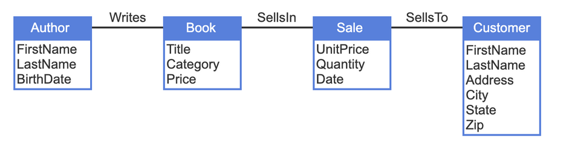
  - 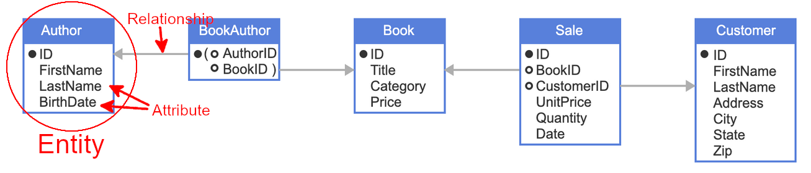
- **database design: logical design**
  - The logical design phase implements database requirements in a specific database system.
  - For relational database systems, logical design converts entities, relationships, and attributes into **tables, keys, and columns**.
  - The logical design, as specified in SQL and depicted in a table diagram, is called a database **schema**.
  - 
- **key**
  - A key is a column used to identify individual rows of a table.
  - Tables, keys, and columns are specified in SQL with `CREATE TABLE` statements.
- **database design: physical design**
  - The physical design phase adds indexes and specifies how tables are organized on **storage media**.
  - Physical design **affects query processing speed** but **never affects the query result**.
- **data independence**
  - The principle that physical design never affects query results is called data independence.
  - Physical design **affects query processing speed** but **never affects the query result**.
  - When database designers modify indexes or row order, **applications run faster** or slower but **always generate the same results**.
- **application programming interface / API**
  - simplify the use of SQL with a general-purpose language.
  - An application programming interface, or API, is **a library of procedures or classes** that **links** a host **programming language to a database**.

## 1.5 MySQL

- **MySQL Command-Line Client**
  - The MySQL Command-Line Client is a text interface **included in the MySQL Server download**.
  - The Command-Line Client allows developers to connect to the database server, perform administrative functions, and execute SQL statements.
  - 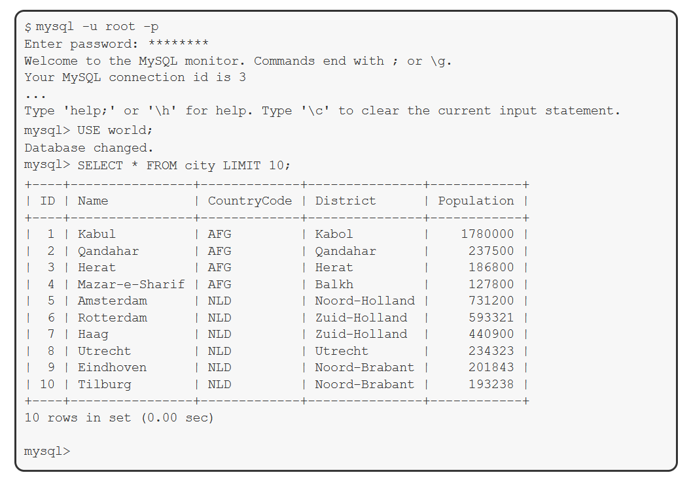
  - MYSQL Community sometimes includes the 'world' database, a database to practice with.
- **root account**
  - The root account, the **administrative account that has full control** of MySQL.
- **error code**
  - MySQL Server returns an error code and description when an **SQL statement is syntactically incorrect** or the **database cannot execute the statement**.

## 2.01 Relational model

- **relational database**
  - A database model is a conceptual framework for database systems, with three parts:
    - **Data structures**: that prescribe **how data is organized**.
      - data structures form the backbone of efficient and organized information storage.
      - Each database model relies on specific structures to represent entities, attributes, and relationships, ensuring data integrity and facilitating smooth retrieval and manipulation.
      - e.g. relational model: primary key, foreign key, data types(INT, STRING, ...), indexes.
    - **Operations**: that **manipulate data structures**.
    - **Rules**: logical constraints that ensure the **data is valid**.
- **set**
  - A set is an **unordered** collection of elements enclosed in braces.
  - e.g. {a, b, c} and {c, b, a} are the same, since sets are **not** ordered.
- **tuple**
  - A tuple is an **ordered** collection of elements enclosed in parentheses.
  - e.g. (a, b, c) and (c, b, a) are different, since tuples are ordered.
- **table**
  - A table has a name, a fixed **tuple of columns**, and a varying **set of rows**.
  - Synonyms: **Table, File, Relation**.
- **column**
  - A column has a **name** and a **data type**.
  - Synonyms: **Column, Field, Attribute**
- **row**
  - A row is an **unnamed tuple of values**. Each value corresponds to a column and belongs to the column's data type.
  - since rows are a set, rows have no inherit order.
  - Synonyms: **Row, Record, Tuple**
- **relational data type**
  - A data type is a named **set of values**, from which column values are drawn.
- **relational algebra**
  - These operations are collectively called relational algebra and are the theoretical foundation of the SQL language.
- **Relational rules**
  - Rules are **logical constraints** that ensure data is valid.
  - Relational rules are part of the relational model and govern data in every relational database.
- **Relational Operations: SELECT, JOIN, UNION, AGGREGATE**
  - `SELECT` selects a subset of rows of a table.
  - `JOIN` combines two tables by comparing related columns.
  - `UNION` selects all rows of two tables.
  - `AGGREGATE` computes functions over multiple table rows, such as sum and count.
- **Business rules**
  - Rules are logical constraints that ensure data is valid.
  - Business rules are based on business policy and specific to a particular database.
  - e.g. All rows of the 'Employee' table must have a valid entry in the 'DepartCode' column.

## 2.02 Structured Query Language

- **Structured Query Language / SQL**
  - Structured Query Language (SQL) is a **high-level computer language for storing, manipulating, and retrieving data**.
  - SQL is the standard language for **relational databases**, and is commonly supported in non-relational databases.
- **SQL Statement Literals: Strings, Numbers, Binary**
  - Explicit values that are string, numeric, or binary.
    - Strings must be surrounded by single quotes or double quotes. e.g. `'string' or "string"`.
    - Numeric. `123`
    - Binary values are represented with x'0' where the 0 is any hex value. e.g. `x'ofa2'`.
- **Data Definition Language**
  - Data Definition Language (DDL) defines the structure of the database.
  - `CREATE, ALTER, DROP`
- **Data Manipulation Language**
  - Data Manipulation Language (DML) manipulates data stored in a database.
  - `INSERT, UPDATE, DELETE`
- **Data Query Language**
  - Data Query Language (DQL) retrieves data from the database.
  - `SELECT`
- **Data Control Language**
  - Data Control Language (DCL) controls database user access.
  - `GRANT, REVOKE`
- **Data Transaction Language**
  - Data Transaction Language (DTL) manages database transactions.
  - `SAVEPOINT, ROLLBACK, COMMIT`

## 2.04 Tables

- **table**
  - A table has a name, a **fixed sequence of columns(tuple)**, and a varying **set of rows**.
- **table rules**
  - Exactly one value per cell. A cell may not contain multiple values. Unknown data is represented with a special `NULL` value.
  - No duplicate column names. Duplicate column names are allowed in different tables, but not in the same table.
  - No duplicate rows. No two rows may have identical values in all columns.
  - **No row order**. Rows are not ordered. The organization of rows on a storage device, such as a disk drive, never affects query results.
    - **data independence**. Data independence allows database administrators to improve query performance by **changing the organization of data on storage devices**, without affecting query results.
- **column**
  - A column has a name and a data type.
- **row**
  - A row is an unnamed sequence of values. Each value corresponds to a column and belongs to the column's data type.
- **cell**
  - A cell is a single column of a single row.
- **empty table**
  - A table without rows is called an empty table.
- **data independence**
  - Data independence allows database administrators to **improve query performance** by changing the organization of data on **storage devices**, **without affecting query results**.
- **CREATE TABLE**
  - DDL
  - The `CREATE TABLE` statement creates a new table by specifying the table name, column names, and column data types.

```sql
CREATE TABLE Employee (
   ID        INT NOT NULL UNSIGNED,
   Name      VARCHAR(60),
   Salary    DECIMAL(7,2),-- max 7 digits total, Two behind decimal.
   startDate DATE,
   PRIMARY KEY (ID)
);
```

- **DROP TABLE**
  - DDL
  - The `DROP TABLE` statement deletes a table, along with all the table's rows, from a database.
  - `DROP TABLE TableName;`
- **ALTER TABLE**
  - DDL
  - The `ALTER TABLE` statement adds, deletes, or modifies columns on an existing table.

```sql
-- Add Column and data type.
ALTER TABLE TableName
  ADD ColumnName DataType;
-- Change Column Name and data type.
ALTER TABLE TableName
  CHANGE CurrentColumnName NewColumnName NewDataType;
-- Drop Column
ALTER TABLE TableName
  DROP ColumnName;
```

## 2.05 Data types

- **data type**
  - A data type is a named set of values from which column values are drawn.
  - `INT` — positive and negative integer values.
  - `VARCHAR(N)` — values with 0 to N characters.
  - `CHAR(N)` - fixed string value, if string is less than stated, space padding will be added.
  - `DATE` — date values YYYY-MM-DD
  - `TIME` - hh:mm:ss
  - `DATETIME` - YYYY-MM-DD HH:MI:SS
  - `DECIMAL(N, D)` — numeric values with total N digits, of which D digits follow the decimal point
- **Integer**
  - Integer data types represent positive and negative integers.
  - `INT` — positive and negative integer values.

| Data type      | Storage |
| :------------- | :------ |
| TINYINT        | 1 byte  |
| SMALLINT       | 2 bytes |
| MEDIUMINT      | 3 bytes |
| INTEGER or INT | 4 bytes |
| BIGINT         | 8 bytes |

## 2.06 Selecting rows

- **operator / operands**
  - An operator is a symbol that computes a value from one or more other values, called operands:
    - **Arithmetic operators** compute numeric values from numeric operands.
    - **Comparison operators** compute logical values TRUE or FALSE. Operands may be numeric, character, and other data types.
    - **Logical operators** compute logical values from logical operands.
  - 

| Operator   | Description                                                            | Example | Value |
| :--------- | :--------------------------------------------------------------------- | :------ | :---- |
| +          | Adds two numeric values                                                | 4 + 3   | 7     |
| - (unary)  | Reverses the sign of one numeric value                                 | -(-2)   | 2     |
| - (binary) | Subtracts one numeric value from another                               | 11 - 5  | 6     |
| `*`        | Multiplies two numeric values                                          | 3 \* 5  | 15    |
| /          | Divides one numeric value by another                                   | 4 / 2   | 2     |
| % (modulo) | Divides one numeric value by another and returns the integer remainder | 5 % 2   | 1     |
| ^          | Raises one numeric value to the power of another                       | 5^2     | 25    |
| =          | Compares two values for equality                                       | 1 = 2   | FALSE |
| !=         | Compares two values for inequality                                     | 1 != 2  | TRUE  |

- **Operator precedence**
  - higher more precedence. PEDMAS.
  - **`OR`** has the least precedence.

| Operator/Element | Description                                        |
| :--------------- | :------------------------------------------------- |
| ()               | parens                                             |
| ^                | exponentiation                                     |
| `* / %`          | multiplication, division, modulo                   |
| + -              | addition, subtraction                              |
| BETWEEN IN LIKE  | range containment, set membership, string matching |
| < > = <= >= <>   | comparison operators                               |
| IS ISNULL        | IS TRUE, IS FALSE, IS NULL, IS DISTINCT FROM, etc. |
| NOT              | logical negation                                   |
| AND              | logical conjunction                                |
| **OR**           | logical disjunction                                |

## 2.07 Null values

- **NULL**
  - `NULL` is a special value that represents either **unknown** or **inapplicable data**.

## 2.08 Inserting, updating, and deleting rows

- **INSERT**
  - The `INSERT` statement adds rows to a table.
  - `INSERT [INTO] TableName (Column1, Column2, ...) VALUES (Value1, Value2, ...);`

```sql
INSERT INTO table_name (column_name1, column_name2, ...)
                      VALUES (DEFAULT, 'bob', 30, 150);
```

- **UPDATE**
  - The `UPDATE` statement modifies existing rows in a table.
  - The `UPDATE` statement uses the `SET` clause to specify the new column values.
  - An optional `WHERE` clause specifies which rows are updated. Omitting the `WHERE` clause results in all rows being updated.

```sql
UPDATE table_name
SET column_name = 'Tom Snead',
WHERE ID = 5384;
```

- **DELETE**
  - The `DELETE` statement deletes existing rows in a table.

```sql
DELETE FROM TableName; -- delete all rows.
DELETE FROM TableName WHERE condition; -- delete rows that returns true.
```

- **TRUNCATE**
  - The `TRUNCATE` statement **deletes all rows** from a table.

```sql
TRUNCATE TABLE TableName; -- delete all table rows.
```

- **MERGE**
  - selects data from one table, called the **source**, and inserts the data to another table, called the **target**.
  - MySQL does not support the `MERGE` statement.

## 2.09 Primary keys

- **primary key**
  - A primary key is a column, or group of columns, used to identify a row.
  - The primary key is usually the table's first column and appears on the left of table diagrams, but the position is not significant to the database.
  - **Primary keys (simple or composite) must be**:
    - `UNIQUE`. This rule ensures that each value identifies at most one row.
    - `NOT NULL`. This rule ensures that each value identifies at least one row.
- **simple primary key**
  - A simple primary key consists of a single column.

```sql
CREATE TABLE Employee (
   ID        SMALLINT NOT NULL UNIQUE UNSIGNED,
   Name      VARCHAR(60),
   Salary    DECIMAL(7,2),
   PRIMARY KEY (ID)
);
```

- **composite primary key**
  - A composite primary key consists of multiple columns.

```sql
CREATE TABLE Family (
   ID           SMALLINT NOT NULL UNIQUE UNSIGNED,
   Number       SMALLINT NOT NULL UNIQUE UNSIGNED,
   Relationship VARCHAR(20),
   Name         VARCHAR(60),
   PRIMARY KEY(ID, Number)
);
```

- **auto-increment**
  - An auto-increment column is a numeric column that is assigned an **automatically incrementing value** when a new row is inserted.
  - **AUTO_INCREMENT**
    - The AUTO_INCREMENT keyword defines an auto-increment column. AUTO_INCREMENT follows the column's data type in a CREATE TABLE statement.
    - Database users occasionally make the following errors when inserting primary keys:
      - Inserting values for auto-increment primary keys.
      - Omitting values for primary keys that are not auto-increment columns.
      - MySQL allows insertion of a specific value to an auto-increment column. However, overriding auto-increment for a primary key is usually a mistake.

```sql
CREATE TABLE Employee (
   ID        SMALLINT NOT NULL UNSIGNED AUTO_INCREMENT,
   Name      VARCHAR(60),
   BirthDate DATE,
   Salary    DECIMAL(7,2),
   PRIMARY KEY (ID)
);
```

## 2.10 Foreign keys

- **foreign key**
  - A foreign key is a column, or group of columns, that refer to a primary key.
  - 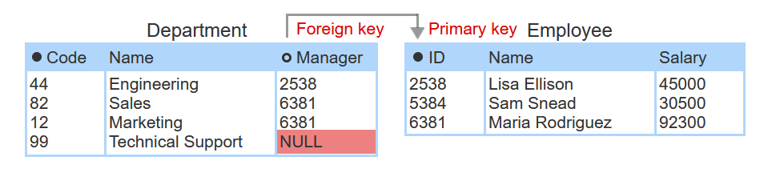
- **FOREIGN KEY / REFERENCES**
  - A foreign key constraint is added to a `CREATE TABLE` statement with the `FOREIGN KEY` and `REFERENCES` keywords.
  - When a **foreign key constraint** is specified, the **database rejects insert, update, and delete** statements that **violate referential integrity**.

```sql
CREATE TABLE Department (
   Code      TINYINT NOT NULL UNIQUE UNSIGNED,
   Name      VARCHAR(20),
   ManagerID SMALLINT UNSIGNED,
   PRIMARY KEY (Code),
   FOREIGN KEY (ManagerID) REFERENCES EmployeeTable(ID)
);
```

## 2.11 Referential integrity

- **fully NULL**
  - A fully NULL foreign key is a simple or composite foreign key in which **all columns** are `NULL`.
- **Referential integrity**
  - Referential integrity is a relational rule that requires foreign key values are either `NULL` or **match primary key value**.
- **RESTRICT**
  - `RESTRICT` rejects an insert, update, or delete that violates referential integrity.
  - `RESTRICT`, `SET NULL`, and `SET DEFAULT` apply to **primary key** update and delete, and **foreign key** insert and update.
  - `CASCADE` applies to **primary key** update and delete only.

```sql
CREATE TABLE TableName(
  ID varchar(20),
  Enrollment INT,
  PRIMARY KEY(ID),
  FOREIGN KEY(Enrollment) REFERENCES table_name(column_name)
    ON DELETE RESTRICT
    ON UPDATE CASCADE
);
```

- **CASCADE**
  - `CASCADE` propagates primary key changes to foreign keys.
  - If a primary key is deleted, rows containing matching foreign keys are deleted. If a primary key is updated, matching foreign keys are updated to the same value.
  - `RESTRICT`, `SET NULL`, and `SET DEFAULT` apply to **primary key** update and delete, and **foreign key** insert and update.
  - `CASCADE` applies to **primary key** update and delete only.

```sql
CREATE TABLE TableName(
  ID varchar(20),
  Enrollment INT,
  PRIMARY KEY(ID),
  FOREIGN KEY(Enrollment) REFERENCES table_name(column_name)
    ON DELETE CASCADE
    ON UPDATE CASCADE
);
```

## 2.12 Constraints

- **constraint**
  - A constraint is a rule that governs **allowable** values in a database. **Constraints are based on relational and business rules**.
  - The database automatically rejects insert, update, and delete statements that violate a constraint.
  - `NOT NULL`
  - `DEFAULT`
  - `PRIMARY KEY`
  - `FOREIGN KEY`

```sql
CREATE TABLE Employee (
  ID             INT,
  Name           VARCHAR(20) NOT NULL, -- NOT NULL, Column Constraint
  DepartmentCode INT DEFAULT 999,
  PRIMARY KEY (ID), -- Column or Table Constraint
  FOREIGN KEY (DepartmentCode) REFERENCES Department (Code) -- Table Constraint
);
```

- **UNIQUE**
  - The UNIQUE constraint ensures that values in a column, or group of columns, are unique.

```sql
CREATE TABLE Employee (
  ID         SMALLINT UNSIGNED,
  Name       VARCHAR(60),
  Extension  CHAR(4),
  Username   VARCHAR(50) UNIQUE,
  UNIQUE (Name, Extension),
  PRIMARY KEY (ID)
);
```

- **CHECK**
  - The CHECK constraint specifies an expression on one or more columns of a table. The constraint is violated when the expression is FALSE and satisfied when the expression is either TRUE or NULL.

```sql
CREATE TABLE Employee (
  ID        SMALLINT UNSIGNED,
  Name      VARCHAR(60),
  BirthDate DATE,
  HireDate  DATE CHECK (HireDate >= '2000-01-01' AND HireDate <= '2019-12-31'),
  Size      VARCHAR(6) CHECK (Size IN ('small', 'medium', 'large')),
  CHECK (BirthDate < HireDate),
  PRIMARY KEY (ID)
);
```

- **SQL CONSTRAINT**
  - Table constraints may be **named** using the optional `CONSTRAINT` keyword, followed by the constraint name and declaration
  - **Adding and dropping constraints**
    - Constraints are added and dropped with the `ALTER TABLE` TableName followed by an `ADD`, `DROP`, or `CHANGE` clause.

```sql
CREATE TABLE Employee (
   ID             INT,
   Name           VARCHAR(20) NOT NULL,
   DepartmentCode INT DEFAULT 999,
  CONSTRAINT EmployeePK PRIMARY KEY (ID),
  CONSTRAINT EmployeeDepartmentFK FOREIGN KEY (DepartmentCode) REFERENCES Department (Code)
);

-- Query Statement
SELECT Column_Name, Constraint_Name
FROM Employee
WHERE EmployeePK = 1;
```

## 3.1 Special operators and clauses

- **BETWEEN**
  - The `BETWEEN` operator provides an alternative way to determine if a value is between two other values. The operator is written value `BETWEEN` minValue `AND` maxValue and is equivalent to:
  - `value >= minValue AND value <= maxValue`. // These are both inclusive. Includes both minValue and maxValue.

```sql
SELECT Name
FROM Employee
WHERE HireDate BETWEEN '2000-01-01' AND '2020-01-01'; -- inclusive both.
```

- **LIKE**
  - The LIKE operator, when used in a WHERE clause, matches text against a pattern using the two wildcard characters `%` and `_`.
  - `%` matches any number of characters. e.g. `LIKE 'L%t'` matches "Lt", "Lot", "Lift", and "Lol cat".
  - `_` matches exactly one character. e.g. `LIKE 'L_t`' matches "Lot" and "Lit" but not "Lt" and "Loot".

```sql
SELECT *
FROM CountryLanguage
WHERE CountryCode LIKE 'A_W';
```

- **ORDER BY**
  - The `ORDER BY` clause orders selected rows by one or more columns in ascending (alphabetic or increasing) order. Low -> High. e.g. A -> a.
  - DESC reverses order High -> Low.

```sql
SELECT *
FROM CountryLanguage
ORDER BY Language DESC; -- high to low order
```

- **DESC**
  - The `DESC` keyword with the `ORDER BY` clause orders rows in descending order.

```sql
SELECT *
FROM CountryLanguage
ORDER BY Language DESC;
```

## 3.2 Simple functions

- **function / argument**
  - A function operates on an expression enclosed in parentheses, called an argument, and returns a value. Usually, the argument is a simple expression, such as a column name or fixed value. Some functions have several arguments, separated by commas, and a few have no arguments at all.
- **ABS()**
  - Returns the absolute value.
  - `SELECT ABS(-5); -- returns 5`
- **LOWER()**
  - returns lowercase.
  - `SELECT LOWER(MySQL); -- returns mysql`
- **TRIM()**
  - removes leading and trailing whitespace.
  - `SELECT TRIM('   hello   '); -- returns 'hello'`
- **LTRIM()**
  - Removes leading spaces from a string.
- **RTRIM()**
  - Removes trailing spaces from a string.
- **HOUR(), MINUTE(), SECOND()**
  - returns hour or minute or second from timestamp.
  - `SELECT HOUR('22:11:45'); -- returns 22`

## 3.3 Aggregate functions

- **aggregate function**
  - An aggregate function processes values from a **set of rows** and returns a **summary value**.
- **COUNT()**
  - `COUNT()` counts the number of rows in the set.
- **MIN()**
  - `MIN()` finds the minimum value in the set.
- **MAX()**
  - `MAX()` finds the maximum value in the set.
- **SUM()**
  - `SUM()` sums all the values in the set.
- **AVG()**
  - `AVG()` computes the arithmetic mean of all the values in the set.
- **GROUP BY**
  - The `GROUP BY`clause consists of the GROUP BY keyword and one or more columns. Each simple or composite value of the column(s) becomes a group. The query computes the aggregate function separately, and returns one row, for each group.
- **HAVING**
  - The `HAVING` clause is used with the `GROUP BY` clause to **filter group results**.

```sql
SELECT column_name
FROM table_name
WHERE condition
GROUP BY column_name
  HAVING condition
ORDER BY column_name;
```

## 3.4 Join queries

- **join / left table / right table**
  - A join is a `SELECT` statement that **combines data from two tables**, known as the left table and right table, into a single result.
  - The tables are combined by comparing columns from the left and right tables, usually with the `=` operator.
- **AS**
  - To simplify queries or result tables, a column name can be replaced with an **alias**. The alias follows the column name, separated by an optional `AS` keyword.
  - e.g. `SELECT some_long_column_name AS short_name`
- **INNER JOIN clause**
  - A join clause determines how a join query handles unmatched rows. Two common join clauses are:
  - **INNER JOIN**
    - `INNER JOIN` selects **only matching** left and right table rows.
    - `INNER` is optional.

```sql
SELECT
  column_name AS group,
  column_name2 AS supervisor
FROM table1 t1
JOIN table2 t2
  ON t1.ID = t2.ID; -- only matching TRUE rows will be joined.
```

- **FULL JOIN**
  - `FULL JOIN` selects **all** left and right table rows, regardless of match.

```sql
SELECT
  column_name AS group,
  column_name2 AS supervisor
FROM table1 t1
FULL JOIN table2 t2
  ON t1.ID = t2.ID; -- all rows from both tables will be joined.
```

- **LEFT JOIN**
  - `LEFT JOIN` selects **all left table rows**, but only matching left table rows.

```sql
SELECT
  column_name AS group,
  column_name2 AS supervisor
FROM table1 t1
LEFT JOIN table2 t2
  ON t1.ID = t2.ID; -- all rows from t1 will be joined with matching rows from t2.
```

- **RIGHT JOIN**
  - `RIGHT JOIN` selects **all right table rows**, but only matching left table rows.
  - right join can be confusing, most avoid it's usage. You can switch the table order to `LEFT JOIN` the table of your choose.

```sql
SELECT
  column_name AS group,
  column_name2 AS supervisor
FROM table1 t1
RIGHT JOIN table2 t2
  ON t1.ID = t2.ID; -- all rows from t2 will be joined with matching rows from t1.
```

- **UNION**
  - The `UNION` keyword **combines the two results into one table**.

```sql
SELECT d.name, e.name
FROM Department d, Employee e
WHERE d.ID = e.ID
UNION -- both results will be joined to create a single table.
SELECT name, NULL
FROM Department
WHERE column_name NOT IN (SELECT ID FROM Employee)
   OR column_name IS NULL;
```

## 3.5 Equijoins, self-joins, and cross-joins

- **equijoin**
  - An equijoin compares columns of two tables with the **=** operator.
- **non-equijoin**
  - A non-equijoin compares columns with an operator other than =, such as **< and >**.
- **self-join**
  - A self-join **joins a table to itself**.

| ID   | Name            | Manager |
| :--- | :-------------- | :------ |
| 2538 | Lisa Ellison    | 8820    |
| 5384 | Sam Snead       | 8820    |
| 6381 | Maria Rodriguez | 8820    |
| 8820 | Jiho Chen       | NULL    |

```sql
SELECT A.Name, B.Name
FROM table1 A
JOIN tab1e1 B -- same table
  ON B.ID = A.Manager;
```

- **cross-join**
  - A cross-join combines two tables **without comparing columns**.
  - **CROSS JOIN**
    - A cross-join uses a `CROSS JOIN` clause **without** an `ON` clause.

```sql
SELECT *
FROM table1
CROSS JOIN table2; -- join both tables.
```

## 3.6 Subqueries

- **subquery / nested query / inner query**
  - A subquery, sometimes called a **nested query** or **inner query**, is a query within another SQL query.
  - precedence order is higher. PEDMAS.

```sql
SELECT *
FROM table1
WHERE Percentage IN
    (SELECT Percentage
    FROM table1
    WHERE column_name = 'ABW');
```

- **alias**
  - An alias is a temporary name assigned to a column or table.
- **AS**
  - An alias is a temporary name assigned to a column or table.
  - The `AS` keyword follows a column or table name to **create an alias**.

## 3.8 View tables

- **materialized view**
  - A materialized view is a view for which **view table data is stored** at all times.
  - Whenever a view table changes, the corresponding view tables can also change, so materialized views must be refreshed.
- **WITH CHECK OPTION**
  - When `WITH CHECK OPTION` is specified, the database **rejects inserts and updates** that do not satisfy the view query `WHERE` clause, the database generates an error message that explains the violation.

```sql
CREATE VIEW SalesEmployee (ID, Name, Department)
AS SELECT *
FROM Employee
WHERE DepartmentCode = 51
WITH CHECK OPTION; -- any insert or update not matching WHERE will throw error.
```

## 4.1 Entities, relationships, and attributes

- **entity-relationship model**
  - Database design begins with verbal or written requirements for the database. Requirements are formalized as an entity-relationship model and then implemented in SQL
  - An entity-relationship model is a **high-level representation of data requirements**, ignoring implementation details.
- **entity**
  - An entity is a person, place, product, concept, or activity.
  - 
- **relationship**
  - A relationship is a statement about two entities.
  - 
- **attribute**
  - An attribute is a descript­ive property of an entity.
  - 
- **reflexive relationship**
  - A reflexive relationship **relates an entity to itself**.
  - 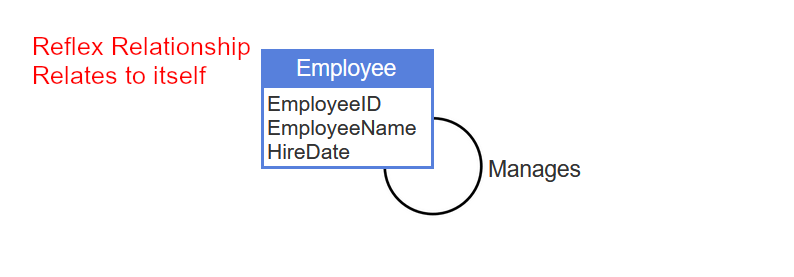
- **entity-relationship diagram / ER diagram**
  - An entity-relationship diagram, commonly called an ER diagram, is a schematic picture of **entities, relationships, and attributes**.
  - Entities are drawn as rectangles.
  - 
- **entity type**
  - An entity type is a **set of things**. Ex: All employees in a company.
- **relationship type**
  - A relationship type is a **set of related things**. Ex: Employee-Manages-Department is a set of (employee, department) pairs, where the employee manages the department.
- **attribute type**
  - An attribute type is a **set of values**. Ex: All employee salaries.
- **entity instance**
  - An entity instance is an **individual thing**. Ex: The employee Sam Snead.
- **relationship instance**
  - A relationship instance is a **statement about entity instances**. Ex: "Maria Rodriguez manages Sales." .
- **attribute instance**
  - An attribute instance is an **individual value**. Ex: The salary $35,000.
- **Analysis for Database Design**
  - This is called: **Conceptual Design**
  - Analysis develops an entity-relationship model, capturing **data requirements** while **ignoring implementation details**.
  - Analysis steps

| Step | Name                                               |
| :--- | :------------------------------------------------- |
| 1    | Discover entities, relationships, and attributes   |
| 2    | Determine cardinality                              |
| 3    | Distinguish strong and weak entities               |
| 4    | Identify and Create supertype and subtype entities |

- **Logical design**
  - Logical design **converts the entity-relationship model into tables, columns, and keys** for a particular database system.
  - Logical design steps

| Step | Name                    |
| :--- | :---------------------- |
| 5    | Implement entities      |
| 6    | Implement relationships |
| 7    | Implement attributes    |
| 8    | Apply normal form       |

- **Physical design**
  - Physical design **adds indexes** and specifies how tables are organized on **storage media**.
- **Strong Entity**
  - entity with own primary key.
  - can exist independent of other entities.
- **Weak Entity**
  - entity with composite key.
  - must depend on strong entities to exist.
  - e.g. Orders (dependent on Customers), phone numbers (dependent on Customers).

## 4.2 Discovery

- **Synonyms and descriptions**
  - Often, entity, relationship, and attribute names have **synonyms**.

## 4.3 Cardinality

- **cardinality**
  - In entity-relationship modeling, cardinality refers to **maxima and minima of relationships** and attributes.
    - one-to-one.
    - one-to-many.
    - many-to-many.
  - 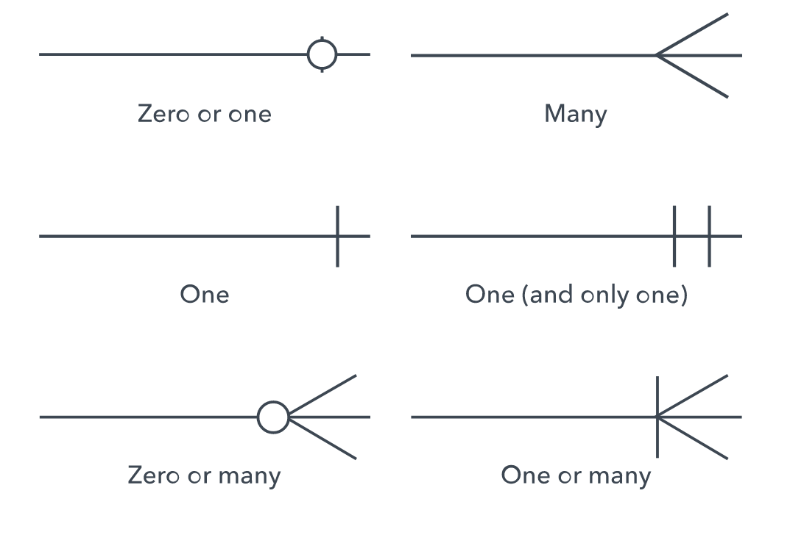
  - 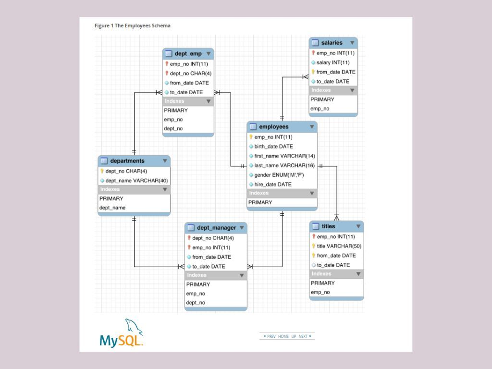
- **Relationship maximum**
  - Relationship maximum is the **greatest number of instances** of one entity that can relate to a single instance of another entity.
  - one-to-many.
  - 
- **Relationship minimum**
  - Relationship minimum is the **least number of instances** of one entity that can relate to a single instance of another entity.
  - A relationship has two minima, one for each of the related entities.
  - one-to-one
  - 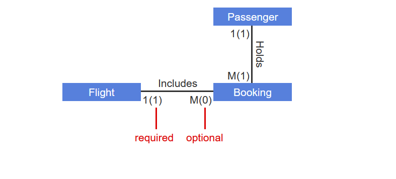
- **Attribute maximum and Attribute minimum**
  - Attribute maximum is the greatest number of attribute values that can describe each entity instance.
  - Attribute maximum is usually specified as one (singular) or many (plural).
  - Attribute minimum is the least number of attribute values that can describe each entity instance. Attribute minimum is usually specified as zero (optional) or one (required).
  - In ER diagrams, attribute maximum and minimum follow the attribute name. The **minimum appears in parentheses**.
  - 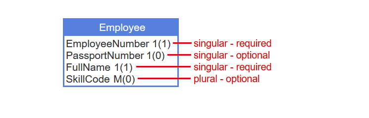
  - 

## 4.5 Supertype and subtype entities

- **subtype entity / supertype entity**
  - A subtype entity is a subset of another entity type, called the supertype entity.
  - e.g. GasVehicle is a subset of Vehicle, so GasVehicle is a subtype entity of the Vehicle supertype entity.
  - On ER diagrams, subtype entities are drawn within the supertype.
  - 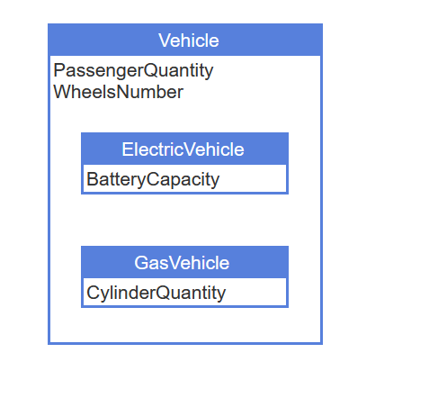
- **IsA relationship**
  - A supertype entity identifies its subtype entities. The identifying relationship is called an **IsA** relationship.
  - 
- **partition**
  - A partition of a supertype entity is a **group of mutually exclusive(belong to only one subtype entity) subtype entities**.
  - 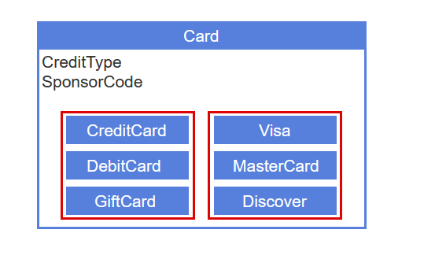
- **Database Design**
  - **After entities, relationships, attributes, cardinality, and strong and weak entities are determined**, the database designer looks for supertype and subtype entities.
  - once Analysis id done, **logical design** converts an entity-relationship model to tables, columns, and keys for a specific database system.
  - Creating supertype and subtype entities is the last of four analysis steps:
    1. Discover entities, relationships, and attributes
    2. Determine cardinality
    3. Distinguish strong and weak entities
    4. Create supertype and subtype entities

## 4.6 Alternative modeling conventions

- **crow's foot notation**
  - Variations in cardinality conventions are common. One popular convention, called crow's foot notation, depicts cardinality as a circle (zero), a short line (one), or three short lines (many). The three short lines look like a bird's foot, hence the name "crow's foot notation".
  - 
  - 
  - 
- **Intangible Entity**
  - documented in the data model, but not tracked with data in the database.

## 4.7 Implementing entities

- **Selecting Primary Keys**
  - stable: value should not change.
  - **simple**: easy to type and store.
  - meaningless: no descriptive information.
- **artificial key**
  - An artificial key is a single-column primary **key created by the database designer** when no suitable single-column or composite primary key exists.
  - Usually artificial key values are integers, generated automatically by the database as new rows are inserted to the table. **Artificial keys are stable, simple, and meaningless**.

## 4.10 First, second, and third normal form

- **functional dependence**
  - **Dependence of one column on another** is called functional dependence.
  - e.g. the data is linked.
    - Customer ID: Unique identifier for each customer.
    - Order ID: Unique identifier for each order.
    - Customer Name: Name of the customer.
    - Product: Purchased product details.
  - Customer Name is dependent on Customer ID. Knowing the Customer ID uniquely determines the Customer Name.
- **Redundancy**
  - Redundancy is the **repetition of related values** in a table.
- **Normal forms**
  - Normal forms are **rules for designing tables with less redundancy**.
  - eliminates redundancy by **decomposing a table into two or more tables**.
  - [Learn Database Normalization - 1NF, 2NF, 3NF, 4NF, 5NF](https://www.youtube.com/watch?v=GFQaEYEc8_8&t=7s)
- **first normal form**
  1. Every **cell** of a table contains **exactly one value**. A table is in first normal form when
  2. the table has a unique **primary key**.
  3. **no duplicate rows**. Has Primary key that is unique, so every row is unique.
- **second normal form**
  - A table is in second normal form when **all non-key columns depend on the whole primary key**.
  - a non-key column cannot depend on **part** of a **composite** primary key. **A table with a simple primary key is automatically in second normal form**.
- **third normal form**
  - Informally, a table is in third normal form when **all non-key columns depend on the key, the whole key, and nothing but the key**.

## 4.11 Boyce-Codd normal form

- **candidate key**
  - all column values are unique and a 'candidate' for primary key.
  - A candidate key is a simple or composite **column** that is **unique** and **minimal**.
  - A table can have multiple candidate keys.
  - **Minimal**
    - Minimal means **all columns are necessary for uniqueness**.
    - The **smallest set of attributes** for unique identification(candidate key), promoting efficiency.
    - Primary key usually is **unique** and **minimal**.
    - e.g. choosing only one column with unique values for primary key, instead of a composite column.
- **non-key**
  - A non-key column is a **column** that is **not a possible candidate key**.
- **third normal form**
  - A table is in third normal form when **all non-key columns depend on the key, the whole key, and nothing but the key**.
  - A table is in third normal form if, whenever a non-key column A depends on column B, then B is unique.
- **Boyce-Codd normal form**
  - [Learn Boyce-Codd Normal Form (BCNF)](https://www.youtube.com/watch?v=VWnKUKH4tLg)
  - Improved version of 'third normal form'.
  - While 'third normal form' applies to all **'non-key' columns**(which will allow occasional redundancy), Boyce-Codd normal form applies to **ALL** columns(which eliminates this redundancy).
  - Boyce-Codd normal form **eliminates all redundancy arising from functional dependence**.
  - **all dependencies(functional dependency) are on unique columns**.
  - In a Boyce-Codd normal form table, if column A depends on column B, then B must be unique.
  - Boyce-Codd normal form is ideal for **tables with frequent inserts, updates, and deletes**.
- **Trivial Dependencies**
  - When the columns of A are a subset of the columns of B, A always depends on B. Ex: FareClass depends on (FlightCode, FareClass). These dependencies are called trivial.

## 4.12 Applying normal form

- **Normalization**
  - Normalization eliminates redundancy by decomposing a table into two or more tables.
  - **redundancy is eliminated** with normalization, the **last step of logical design**.
- **depends on**
  - Column A depends on column B when each B value is related to at most one A value. A and B may be simple or composite columns.
- **Denormalization**
  - Denormalization means **intentionally introducing redundancy** by merging tables, to **eliminate `JOIN` queries**.

## 5.2 Table structures

- **table structure**
  - A table structure is a scheme for **organizing rows in blocks on storage media**.
  - Row-oriented storage performs better than column-oriented storage for most transactional databases. Consequently, relational databases commonly use row-oriented storage.
  - Alternate table structures:
    - **Heap table**
    - **Sorted table**
    - **Hash table**
    - **Table cluster**
- **heap table**
  - In a heap table, **no order is imposed on rows**.
  - Heap tables **optimize insert operations**. Heap tables are particularly **fast** for bulk load of many rows, since rows are stored in load order.
- **hash table**
  - In a hash table, **rows are assigned to buckets**.
  - Each bucket is a block, once full, another bucket is linked to, evenly distributing rows across blocks.
- **hash table bucket**
  - A bucket is a block or group of blocks containing rows.
  - optimal for inserts and deletes of individual rows.
- **modulo function**
  - The modulo function is a simple hash function with four steps.
    - Convert the hash key by interpreting the key's bits as an integer value.
    - Divide the integer by the number of buckets.
    - Interpret the division remainder as the bucket number.
    - Convert the bucket number to the physical address of the block containing the row.

## 5.3 Single-level indexes

- **table scan**
  - A table scan is a database operation that **reads table blocks directly**, without accessing an index.
  - When a `SELECT` query is executed, the database examines the `WHERE` clause and estimates **hit ratio**. If **hit ratio** is high, the database performs a table scan. If **hit ratio** is low, the query needs only a few table blocks, performs index scan.
  - 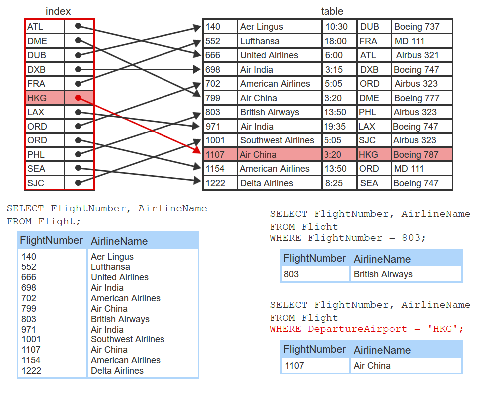
- **index scan**
  - An index scan is a database operation that **reads index blocks sequentially**, in order to locate the needed table blocks.
  - 
- **Hit ratio / filter factor / selectivity**
  - Hit ratio, also called filter factor or selectivity, is the **percentage of table rows selected by a query**.
  - When a `SELECT` query is executed, the database examines the `WHERE` clause and estimates **hit ratio**. If hit ratio is high, the database performs a table scan. If hit ratio is low, the query needs only a few table blocks, performs index scan.
- **binary search**
  - **Index must be sorted!**
  - In a binary search, the database **repeatedly splits the index in two** until it finds the entry containing the search value.
    - The database first compares the search value to an entry in the middle of the index.
    - If the search value is less than the entry value, the search value is in the first half of the index. If not, the search value is in the second half.

```sql
-- CREATE
CREATE INDEX IndexName ON TableName (Column1, ..., ColumnN);
-- DROP
DROP INDEX IndexName ON TableName;
-- SHOW
SHOW INDEX FROM TableName;
```

- **dense index**
  - A dense index contains an **entry for every table row**.
- **sparse index**
  - A sparse index contains an **entry for every table block**.
  - 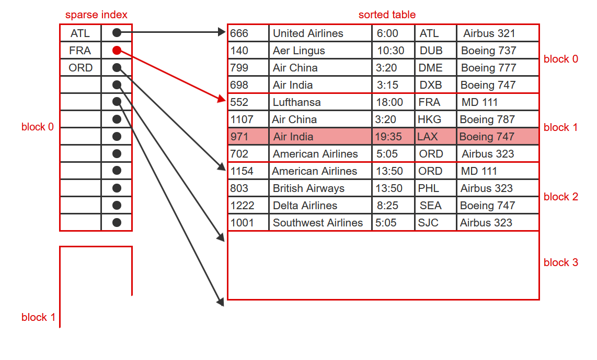

## 5.4 Multi-level indexes

- **multi-level index**
  - A multi-level index **stores column values and row pointers in a hierarchy**.
  - Each level above the bottom is a **sparse sorted index to the level below**.
  - The number of index entries per block is called the **fan-out** of a multi-level index.
  - multi-level index is the **most commonly used index type**.
  - 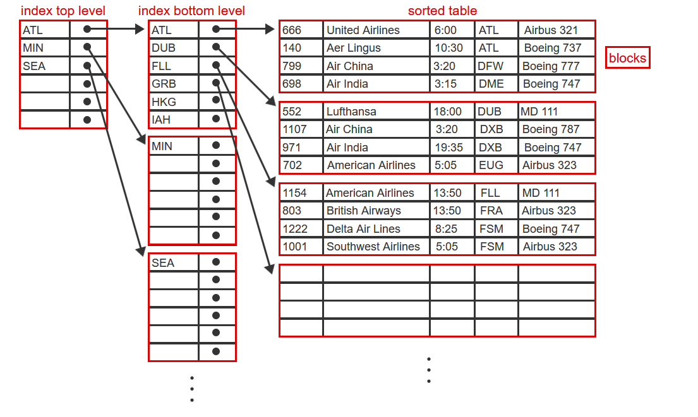
- **fan-out**
  - The number of index entries per block is called the fan-out of a multi-level index.

## 5.5 Other indexes

- **Other Multi-Level Indexes**
  - Hash index
  - Bitmap index
  - Logical index
  - Function index
- **hash index**
  - In a hash index, index entries are assigned to buckets.
  - As an index grows, some buckets eventually fill up, and additional blocks are allocated and linked to the initial block.
  - 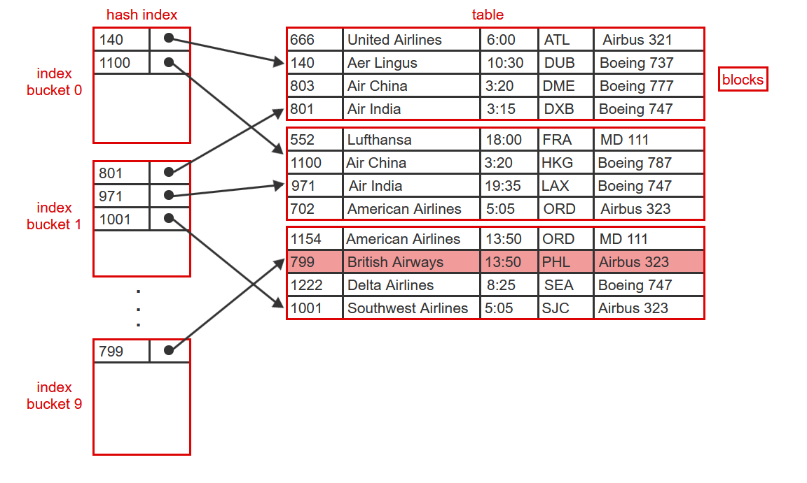
- **bitmap index**
  - A bitmap index is a grid of bits.
  - Bitmap indexes contain **ones and zeros**.
  - enable fast reads.
  - 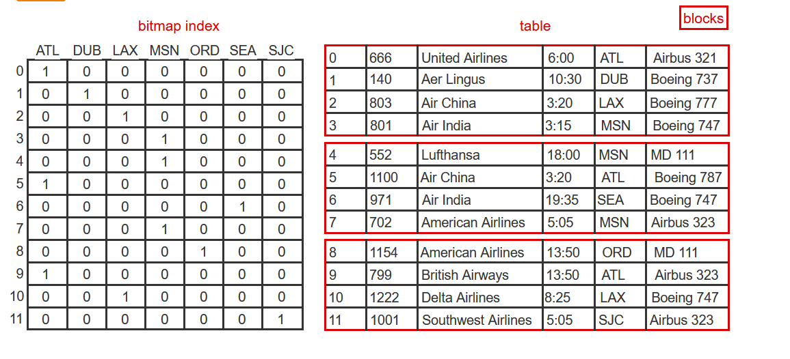

## 5.6 Tablespaces and partitions

- **tablespace**
  - A tablespace is a database **object** that **maps** one or more **tables** to a **single file**.
  - not specified in the SQL standard.
  - Database administrators can **manually create tablespaces** and assign one or multiple tables to each tablespace. Database administrators can improve query performance by **assigning frequently accessed tables** to tablespaces stored on **fast storage media**.
  - 

```sql
CREATE TABLESPACE TablespaceName
[ ADD DATAFILE 'FileName' ];

CREATE TABLE TableName
( ColumnName ColumnDefintion, ... )
[ TABLESPACE TablespaceName ];
```

## 5.7 Physical design

- **Physical design**
  - Physical design specifies **indexes, table structures, and partitions**.
  - Physical design **affects query performance** but **never affects query results**.
- **storage engine / storage manager**
  - A storage engine or storage manager **translates instructions** generated by a query processor into **low-level commands** that access data on storage media.
